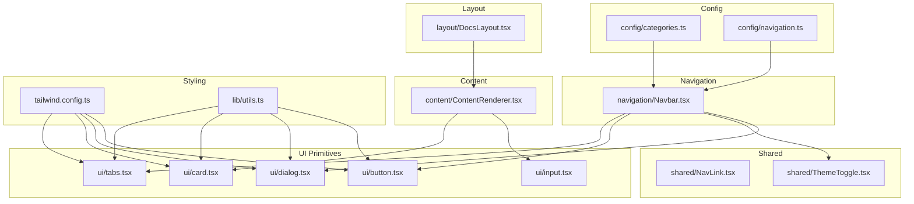
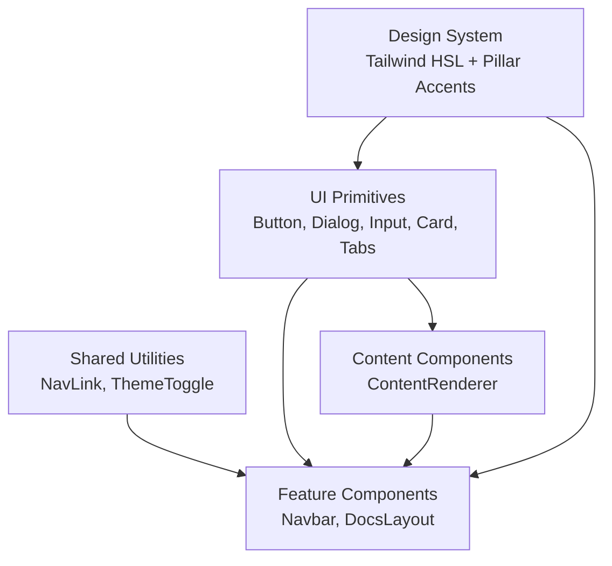
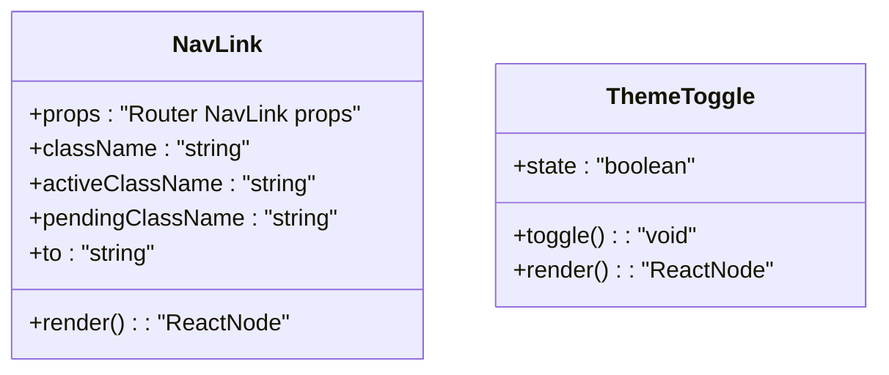
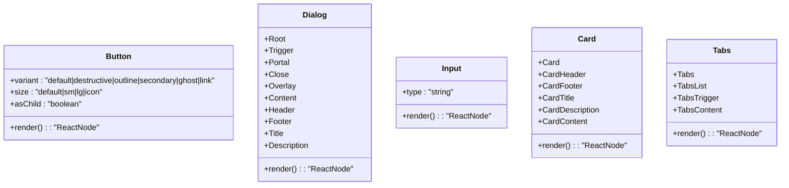
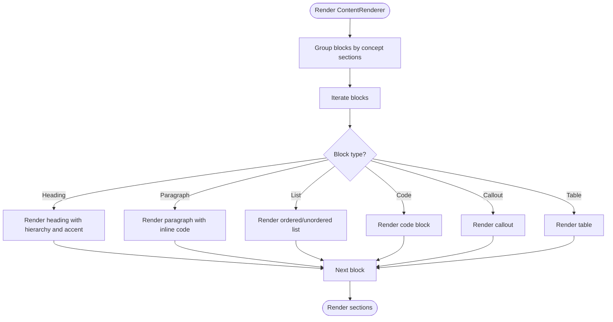
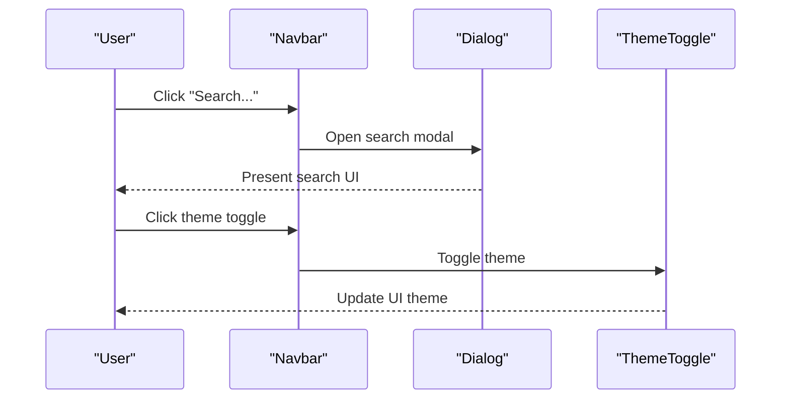
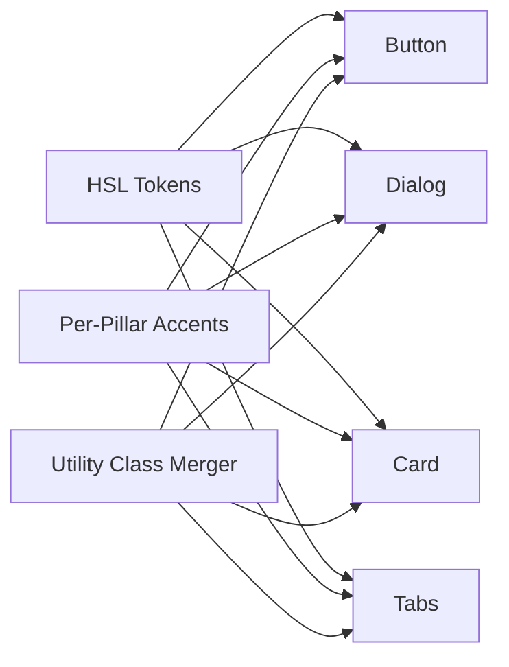
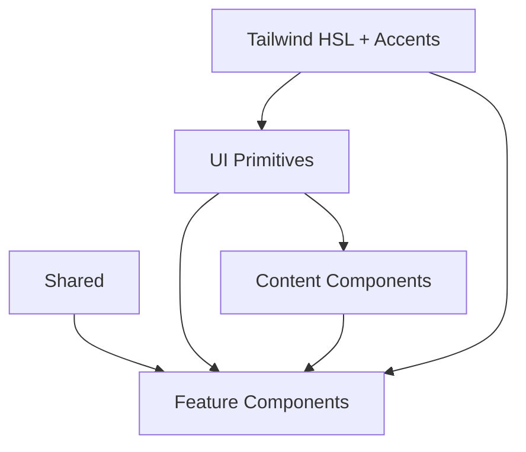

# Component System

<cite>
**Referenced Files in This Document**
- [src/components/shared/NavLink.tsx](file://src/components/shared/NavLink.tsx)
- [src/components/shared/ThemeToggle.tsx](file://src/components/shared/ThemeToggle.tsx)
- [src/components/ui/button.tsx](file://src/components/ui/button.tsx)
- [src/components/ui/dialog.tsx](file://src/components/ui/dialog.tsx)
- [src/components/ui/input.tsx](file://src/components/ui/input.tsx)
- [src/components/ui/card.tsx](file://src/components/ui/card.tsx)
- [src/components/ui/tabs.tsx](file://src/components/ui/tabs.tsx)
- [src/components/content/ContentRenderer.tsx](file://src/components/content/ContentRenderer.tsx)
- [src/components/navigation/Navbar.tsx](file://src/components/navigation/Navbar.tsx)
- [src/components/layout/DocsLayout.tsx](file://src/components/layout/DocsLayout.tsx)
- [src/config/categories.ts](file://src/config/categories.ts)
- [src/config/navigation.ts](file://src/config/navigation.ts)
- [tailwind.config.ts](file://tailwind.config.ts)
- [src/lib/utils.ts](file://src/lib/utils.ts)
- [src/config/site.ts](file://src/config/site.ts)
</cite>

## Table of Contents
1. [Introduction](#introduction)
2. [Project Structure](#project-structure)
3. [Core Components](#core-components)
4. [Architecture Overview](#architecture-overview)
5. [Detailed Component Analysis](#detailed-component-analysis)
6. [Dependency Analysis](#dependency-analysis)
7. [Performance Considerations](#performance-considerations)
8. [Troubleshooting Guide](#troubleshooting-guide)
9. [Conclusion](#conclusion)
10. [Appendices](#appendices)

## Introduction
This document describes the component system of JSphere, focusing on the modular UI architecture built on Radix UI primitives and the shadcn/ui-inspired design system. It explains how components are organized into shared utilities, UI primitives, content components, and feature components, and how they work together to deliver a consistent, accessible, and responsive user experience. The design system is centered around HSL-based design tokens with unique accent colors per content pillar, enabling cohesive theming across Learn, Reference, Integrations, Recipes, Projects, Explore, and Errors.

## Project Structure
JSphere organizes components by responsibility and reusability:
- Shared: Reusable utilities like navigation links and theme toggle
- UI Primitives: Low-level building blocks wrapping Radix UI and styled with Tailwind
- Content Components: Renderers and helpers for structured content
- Feature Components: Page-level and layout components that assemble primitives and content

**Diagram sources**
- [src/components/shared/NavLink.tsx:1-29](file://src/components/shared/NavLink.tsx#L1-L29)
- [src/components/shared/ThemeToggle.tsx:1-30](file://src/components/shared/ThemeToggle.tsx#L1-L30)
- [src/components/ui/button.tsx:1-48](file://src/components/ui/button.tsx#L1-L48)
- [src/components/ui/dialog.tsx:1-96](file://src/components/ui/dialog.tsx#L1-L96)
- [src/components/ui/input.tsx:1-23](file://src/components/ui/input.tsx#L1-L23)
- [src/components/ui/card.tsx:1-44](file://src/components/ui/card.tsx#L1-L44)
- [src/components/ui/tabs.tsx:1-54](file://src/components/ui/tabs.tsx#L1-L54)
- [src/components/content/ContentRenderer.tsx:1-157](file://src/components/content/ContentRenderer.tsx#L1-L157)
- [src/components/navigation/Navbar.tsx:1-183](file://src/components/navigation/Navbar.tsx#L1-L183)
- [src/components/layout/DocsLayout.tsx:1-26](file://src/components/layout/DocsLayout.tsx#L1-L26)
- [src/config/categories.ts:1-90](file://src/config/categories.ts#L1-L90)
- [src/config/navigation.ts:1-531](file://src/config/navigation.ts#L1-L531)
- [tailwind.config.ts:1-104](file://tailwind.config.ts#L1-L104)
- [src/lib/utils.ts:1-7](file://src/lib/utils.ts#L1-L7)

**Section sources**
- [src/components/shared/NavLink.tsx:1-29](file://src/components/shared/NavLink.tsx#L1-L29)
- [src/components/shared/ThemeToggle.tsx:1-30](file://src/components/shared/ThemeToggle.tsx#L1-L30)
- [src/components/ui/button.tsx:1-48](file://src/components/ui/button.tsx#L1-L48)
- [src/components/ui/dialog.tsx:1-96](file://src/components/ui/dialog.tsx#L1-L96)
- [src/components/ui/input.tsx:1-23](file://src/components/ui/input.tsx#L1-L23)
- [src/components/ui/card.tsx:1-44](file://src/components/ui/card.tsx#L1-L44)
- [src/components/ui/tabs.tsx:1-54](file://src/components/ui/tabs.tsx#L1-L54)
- [src/components/content/ContentRenderer.tsx:1-157](file://src/components/content/ContentRenderer.tsx#L1-L157)
- [src/components/navigation/Navbar.tsx:1-183](file://src/components/navigation/Navbar.tsx#L1-L183)
- [src/components/layout/DocsLayout.tsx:1-26](file://src/components/layout/DocsLayout.tsx#L1-L26)
- [src/config/categories.ts:1-90](file://src/config/categories.ts#L1-L90)
- [src/config/navigation.ts:1-531](file://src/config/navigation.ts#L1-L531)
- [tailwind.config.ts:1-104](file://tailwind.config.ts#L1-L104)
- [src/lib/utils.ts:1-7](file://src/lib/utils.ts#L1-L7)

## Core Components
This section outlines the foundational pieces of the component system.

- Shared Utilities
  - NavLink: A router-aware link wrapper that merges base and active/pending classes via a utility class merger. It forwards refs and exposes props compatible with the routing library’s NavLink while adding convenience flags for active/pending states.
  - ThemeToggle: A theme switcher that reads/writes the preferred theme to localStorage, toggles a root class for dark mode, and renders appropriate icons.

- UI Primitives
  - Button: A versatile button primitive with variant and size scales powered by a variant engine and composed with Radix slot semantics for semantic flexibility.
  - Dialog: A composite dialog built on Radix UI with overlay, portal, content, header/footer, title, and description slots, styled with Tailwind and animated transitions.
  - Input: A low-level input primitive with consistent focus styles and responsive typography.
  - Card: A semantic card group with header, footer, title, description, and content slots.
  - Tabs: A tabbed interface with list, trigger, and content slots, styled for focus and active states.

- Content Components
  - ContentRenderer: Renders structured content blocks (headings, paragraphs, lists, code, callouts, tables) into a cohesive document layout, grouping content by concept sections and applying animations and typography.

- Navigation and Layout
  - Navbar: Desktop mega-menu navigation with grouped sections, badges for availability, and a mobile sheet menu; integrates with theme toggle and search affordances.
  - DocsLayout: A three-pane layout for documentation pages with a sidebar, main content area, and table of contents.

- Design Tokens and Theming
  - Tailwind configuration defines HSL-based color tokens and extends them with per-pillar accent colors. The utility class merger composes Tailwind classes safely.

**Section sources**
- [src/components/shared/NavLink.tsx:1-29](file://src/components/shared/NavLink.tsx#L1-L29)
- [src/components/shared/ThemeToggle.tsx:1-30](file://src/components/shared/ThemeToggle.tsx#L1-L30)
- [src/components/ui/button.tsx:1-48](file://src/components/ui/button.tsx#L1-L48)
- [src/components/ui/dialog.tsx:1-96](file://src/components/ui/dialog.tsx#L1-L96)
- [src/components/ui/input.tsx:1-23](file://src/components/ui/input.tsx#L1-L23)
- [src/components/ui/card.tsx:1-44](file://src/components/ui/card.tsx#L1-L44)
- [src/components/ui/tabs.tsx:1-54](file://src/components/ui/tabs.tsx#L1-L54)
- [src/components/content/ContentRenderer.tsx:1-157](file://src/components/content/ContentRenderer.tsx#L1-L157)
- [src/components/navigation/Navbar.tsx:1-183](file://src/components/navigation/Navbar.tsx#L1-L183)
- [src/components/layout/DocsLayout.tsx:1-26](file://src/components/layout/DocsLayout.tsx#L1-L26)
- [tailwind.config.ts:1-104](file://tailwind.config.ts#L1-L104)
- [src/lib/utils.ts:1-7](file://src/lib/utils.ts#L1-L7)

## Architecture Overview
JSphere’s component architecture follows a layered pattern:
- Shared: Provides cross-cutting utilities (links, theme toggle)
- UI Primitives: Encapsulate Radix UI and expose a small, consistent API surface
- Content: Transforms structured content into readable layouts
- Feature: Assembles primitives and content into cohesive pages and experiences
- Theming: Centralized HSL tokens and per-pillar accents unify appearance

**Diagram sources**
- [src/components/shared/NavLink.tsx:1-29](file://src/components/shared/NavLink.tsx#L1-L29)
- [src/components/shared/ThemeToggle.tsx:1-30](file://src/components/shared/ThemeToggle.tsx#L1-L30)
- [src/components/ui/button.tsx:1-48](file://src/components/ui/button.tsx#L1-L48)
- [src/components/ui/dialog.tsx:1-96](file://src/components/ui/dialog.tsx#L1-L96)
- [src/components/ui/input.tsx:1-23](file://src/components/ui/input.tsx#L1-L23)
- [src/components/ui/card.tsx:1-44](file://src/components/ui/card.tsx#L1-L44)
- [src/components/ui/tabs.tsx:1-54](file://src/components/ui/tabs.tsx#L1-L54)
- [src/components/content/ContentRenderer.tsx:1-157](file://src/components/content/ContentRenderer.tsx#L1-L157)
- [src/components/navigation/Navbar.tsx:1-183](file://src/components/navigation/Navbar.tsx#L1-L183)
- [src/components/layout/DocsLayout.tsx:1-26](file://src/components/layout/DocsLayout.tsx#L1-L26)
- [tailwind.config.ts:1-104](file://tailwind.config.ts#L1-L104)

## Detailed Component Analysis

### Shared Components
- NavLink
  - Purpose: Provide a consistent, active-state-aware link for internal navigation
  - Props and behavior: Accepts base props, merges classes, and conditionally applies active/pending classes
  - Composition: Used widely in navigation menus and lists
- ThemeToggle
  - Purpose: Toggle between light and dark themes
  - Behavior: Reads system preference or stored preference, updates root class, persists choice

**Diagram sources**
- [src/components/shared/NavLink.tsx:1-29](file://src/components/shared/NavLink.tsx#L1-L29)
- [src/components/shared/ThemeToggle.tsx:1-30](file://src/components/shared/ThemeToggle.tsx#L1-L30)

**Section sources**
- [src/components/shared/NavLink.tsx:1-29](file://src/components/shared/NavLink.tsx#L1-L29)
- [src/components/shared/ThemeToggle.tsx:1-30](file://src/components/shared/ThemeToggle.tsx#L1-L30)

### UI Primitive System
- Button
  - Variants: default, destructive, outline, secondary, ghost, link
  - Sizes: default, sm, lg, icon
  - Composition: Uses a variant engine and Radix slot semantics for asChild
- Dialog
  - Parts: Root, Trigger, Portal, Close, Overlay, Content, Header, Footer, Title, Description
  - Styling: Uses Tailwind classes and Radix state attributes for animations
- Input
  - Styling: Consistent border, focus ring, and responsive text sizing
- Card
  - Slots: Card, CardHeader, CardFooter, CardTitle, CardDescription, CardContent
- Tabs
  - Slots: Tabs, TabsList, TabsTrigger, TabsContent

**Diagram sources**
- [src/components/ui/button.tsx:1-48](file://src/components/ui/button.tsx#L1-L48)
- [src/components/ui/dialog.tsx:1-96](file://src/components/ui/dialog.tsx#L1-L96)
- [src/components/ui/input.tsx:1-23](file://src/components/ui/input.tsx#L1-L23)
- [src/components/ui/card.tsx:1-44](file://src/components/ui/card.tsx#L1-L44)
- [src/components/ui/tabs.tsx:1-54](file://src/components/ui/tabs.tsx#L1-L54)

**Section sources**
- [src/components/ui/button.tsx:1-48](file://src/components/ui/button.tsx#L1-L48)
- [src/components/ui/dialog.tsx:1-96](file://src/components/ui/dialog.tsx#L1-L96)
- [src/components/ui/input.tsx:1-23](file://src/components/ui/input.tsx#L1-L23)
- [src/components/ui/card.tsx:1-44](file://src/components/ui/card.tsx#L1-L44)
- [src/components/ui/tabs.tsx:1-54](file://src/components/ui/tabs.tsx#L1-L54)

### Content Component: ContentRenderer
- Purpose: Render structured content blocks into a readable, animated document
- Features:
  - Groups blocks into concept sections by headings
  - Renders headings, paragraphs, lists, code blocks, callouts, and tables
  - Applies typography, spacing, and subtle animations
- Integration: Consumes shared CodeBlock and Callout components

**Diagram sources**
- [src/components/content/ContentRenderer.tsx:1-157](file://src/components/content/ContentRenderer.tsx#L1-L157)

**Section sources**
- [src/components/content/ContentRenderer.tsx:1-157](file://src/components/content/ContentRenderer.tsx#L1-L157)

### Navigation and Layout: Navbar and DocsLayout
- Navbar
  - Desktop: Mega menu with grouped sections and availability badges
  - Mobile: Collapsible sheet menu with grouped items
  - Integrates ThemeToggle and search affordances
- DocsLayout
  - Three-column layout: sidebar, main content, table of contents
  - Responsive padding and constrained widths

**Diagram sources**
- [src/components/navigation/Navbar.tsx:1-183](file://src/components/navigation/Navbar.tsx#L1-L183)
- [src/components/ui/dialog.tsx:1-96](file://src/components/ui/dialog.tsx#L1-L96)
- [src/components/shared/ThemeToggle.tsx:1-30](file://src/components/shared/ThemeToggle.tsx#L1-L30)

**Section sources**
- [src/components/navigation/Navbar.tsx:1-183](file://src/components/navigation/Navbar.tsx#L1-L183)
- [src/components/layout/DocsLayout.tsx:1-26](file://src/components/layout/DocsLayout.tsx#L1-L26)

### Design System: HSL Tokens and Per-Pillar Accents
- Tailwind configuration
  - Defines HSL-based tokens for borders, inputs, rings, backgrounds, foregrounds, and semantic roles
  - Extends colors with per-pillar accent tokens (e.g., accent-learn, accent-reference, etc.)
  - Includes radius and animation extensions for consistent UI behavior
- Utilities
  - Utility class merger composes Tailwind classes safely
- Site configuration
  - Provides site-wide metadata used across the app

**Diagram sources**
- [tailwind.config.ts:1-104](file://tailwind.config.ts#L1-L104)
- [src/lib/utils.ts:1-7](file://src/lib/utils.ts#L1-L7)

**Section sources**
- [tailwind.config.ts:1-104](file://tailwind.config.ts#L1-L104)
- [src/lib/utils.ts:1-7](file://src/lib/utils.ts#L1-L7)
- [src/config/site.ts:1-15](file://src/config/site.ts#L1-L15)

### Component Composition Patterns
- Primitive-first: Build higher-level components by composing primitives (e.g., Dialog content uses Button and Input)
- Semantic composition: Use Radix slot semantics to maintain accessibility and keyboard navigation
- Theming-first: Apply HSL tokens and per-pillar accents consistently across components
- Responsive patterns: Use Tailwind utilities for breakpoints and adaptive layouts (e.g., navbar mobile/desktop, docs layout)

**Section sources**
- [src/components/ui/button.tsx:1-48](file://src/components/ui/button.tsx#L1-L48)
- [src/components/ui/dialog.tsx:1-96](file://src/components/ui/dialog.tsx#L1-L96)
- [src/components/ui/card.tsx:1-44](file://src/components/ui/card.tsx#L1-L44)
- [src/components/ui/tabs.tsx:1-54](file://src/components/ui/tabs.tsx#L1-L54)
- [tailwind.config.ts:1-104](file://tailwind.config.ts#L1-L104)

### Accessibility and Responsive Design
- Accessibility
  - Built on Radix UI primitives ensuring ARIA attributes, focus management, and keyboard compatibility
  - Focus-visible rings and outline utilities for keyboard navigation
- Responsive
  - Breakpoint-aware paddings and widths in layout components
  - Typography scaling and spacing adjustments across screen sizes

**Section sources**
- [src/components/ui/dialog.tsx:1-96](file://src/components/ui/dialog.tsx#L1-L96)
- [src/components/ui/button.tsx:1-48](file://src/components/ui/button.tsx#L1-L48)
- [src/components/layout/DocsLayout.tsx:1-26](file://src/components/layout/DocsLayout.tsx#L1-L26)

### Guidelines for Extending the Component System
- Follow the primitive pattern: Wrap Radix UI and compose with Tailwind classes
- Use the variant engine for consistent variants and sizes
- Respect the design tokens and per-pillar accents
- Maintain accessibility by preserving Radix semantics and focus behavior
- Keep component props minimal and explicit; leverage composition over duplication
- Add new primitives under the ui directory and reuse them across content and feature components

**Section sources**
- [src/components/ui/button.tsx:1-48](file://src/components/ui/button.tsx#L1-L48)
- [tailwind.config.ts:1-104](file://tailwind.config.ts#L1-L104)

## Dependency Analysis
The component system exhibits low coupling and high cohesion:
- Shared utilities depend on routing and icons; they are consumed by navigation and feature components
- UI primitives depend on Radix UI and Tailwind; they are consumed by content and feature components
- Content components depend on shared primitives and content types
- Navigation and layout components orchestrate primitives and content
- Theming is centralized in Tailwind configuration and applied uniformly

**Diagram sources**
- [src/components/shared/NavLink.tsx:1-29](file://src/components/shared/NavLink.tsx#L1-L29)
- [src/components/shared/ThemeToggle.tsx:1-30](file://src/components/shared/ThemeToggle.tsx#L1-L30)
- [src/components/ui/button.tsx:1-48](file://src/components/ui/button.tsx#L1-L48)
- [src/components/ui/dialog.tsx:1-96](file://src/components/ui/dialog.tsx#L1-L96)
- [src/components/ui/input.tsx:1-23](file://src/components/ui/input.tsx#L1-L23)
- [src/components/ui/card.tsx:1-44](file://src/components/ui/card.tsx#L1-L44)
- [src/components/ui/tabs.tsx:1-54](file://src/components/ui/tabs.tsx#L1-L54)
- [src/components/content/ContentRenderer.tsx:1-157](file://src/components/content/ContentRenderer.tsx#L1-L157)
- [src/components/navigation/Navbar.tsx:1-183](file://src/components/navigation/Navbar.tsx#L1-L183)
- [src/components/layout/DocsLayout.tsx:1-26](file://src/components/layout/DocsLayout.tsx#L1-L26)
- [tailwind.config.ts:1-104](file://tailwind.config.ts#L1-L104)

**Section sources**
- [src/components/shared/NavLink.tsx:1-29](file://src/components/shared/NavLink.tsx#L1-L29)
- [src/components/shared/ThemeToggle.tsx:1-30](file://src/components/shared/ThemeToggle.tsx#L1-L30)
- [src/components/ui/button.tsx:1-48](file://src/components/ui/button.tsx#L1-L48)
- [src/components/ui/dialog.tsx:1-96](file://src/components/ui/dialog.tsx#L1-L96)
- [src/components/ui/input.tsx:1-23](file://src/components/ui/input.tsx#L1-L23)
- [src/components/ui/card.tsx:1-44](file://src/components/ui/card.tsx#L1-L44)
- [src/components/ui/tabs.tsx:1-54](file://src/components/ui/tabs.tsx#L1-L54)
- [src/components/content/ContentRenderer.tsx:1-157](file://src/components/content/ContentRenderer.tsx#L1-L157)
- [src/components/navigation/Navbar.tsx:1-183](file://src/components/navigation/Navbar.tsx#L1-L183)
- [src/components/layout/DocsLayout.tsx:1-26](file://src/components/layout/DocsLayout.tsx#L1-L26)
- [tailwind.config.ts:1-104](file://tailwind.config.ts#L1-L104)

## Performance Considerations
- Prefer memoization for content rendering to avoid unnecessary re-renders
- Use lazy loading for heavy content and images
- Minimize class merging overhead by composing classes efficiently
- Keep dialogs and modals rendered conditionally to reduce DOM footprint

[No sources needed since this section provides general guidance]

## Troubleshooting Guide
- ThemeToggle does not persist or reflect system preference
  - Verify root class toggling and localStorage persistence
  - Confirm media query fallback behavior
- Dialog not animating or focus not managed
  - Ensure Radix state attributes are present and Tailwind animations are enabled
- Button variants not applying
  - Check variant engine usage and class merging
- ContentRenderer not rendering sections
  - Validate block grouping logic and heading hierarchy

**Section sources**
- [src/components/shared/ThemeToggle.tsx:1-30](file://src/components/shared/ThemeToggle.tsx#L1-L30)
- [src/components/ui/dialog.tsx:1-96](file://src/components/ui/dialog.tsx#L1-L96)
- [src/components/ui/button.tsx:1-48](file://src/components/ui/button.tsx#L1-L48)
- [src/components/content/ContentRenderer.tsx:1-157](file://src/components/content/ContentRenderer.tsx#L1-L157)

## Conclusion
JSphere’s component system leverages Radix UI primitives and a shadcn/ui-inspired design system to create a scalable, accessible, and consistent UI. The separation of concerns—shared utilities, UI primitives, content components, and feature components—combined with HSL-based design tokens and per-pillar accents, enables predictable theming and easy extension. Following the outlined patterns ensures new components integrate seamlessly and maintain the quality and coherence of the overall system.

[No sources needed since this section summarizes without analyzing specific files]

## Appendices
- Example usage across pillars
  - Learn: Use Card and Tabs to organize lessons and examples
  - Reference: Use Input and Button for quick actions and search
  - Integrations: Use Dialog for walkthroughs and modals
  - Recipes: Combine ContentRenderer with UI primitives for step-by-step guides
  - Projects: Compose DocsLayout with navigation and content components
  - Explore: Use ThemeToggle and navigation badges for discoverability
  - Errors: Pair Dialog with actionable buttons for error handling

**Section sources**
- [src/components/ui/card.tsx:1-44](file://src/components/ui/card.tsx#L1-L44)
- [src/components/ui/tabs.tsx:1-54](file://src/components/ui/tabs.tsx#L1-L54)
- [src/components/ui/input.tsx:1-23](file://src/components/ui/input.tsx#L1-L23)
- [src/components/ui/dialog.tsx:1-96](file://src/components/ui/dialog.tsx#L1-L96)
- [src/components/content/ContentRenderer.tsx:1-157](file://src/components/content/ContentRenderer.tsx#L1-L157)
- [src/components/layout/DocsLayout.tsx:1-26](file://src/components/layout/DocsLayout.tsx#L1-L26)
- [src/components/shared/ThemeToggle.tsx:1-30](file://src/components/shared/ThemeToggle.tsx#L1-L30)
- [src/config/categories.ts:1-90](file://src/config/categories.ts#L1-L90)