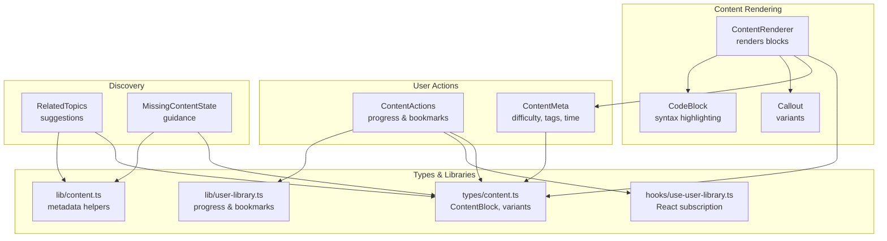
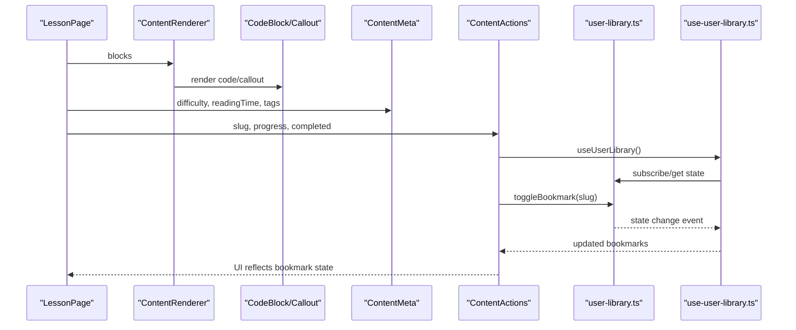
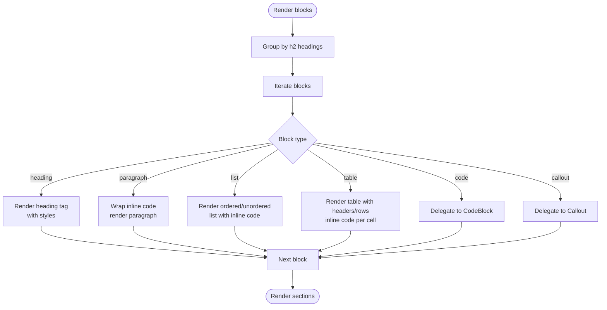
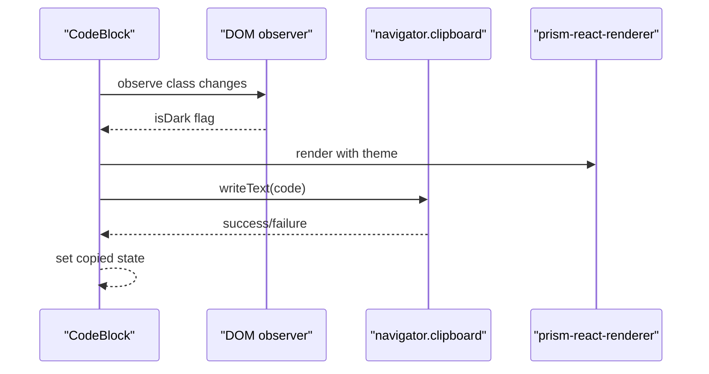
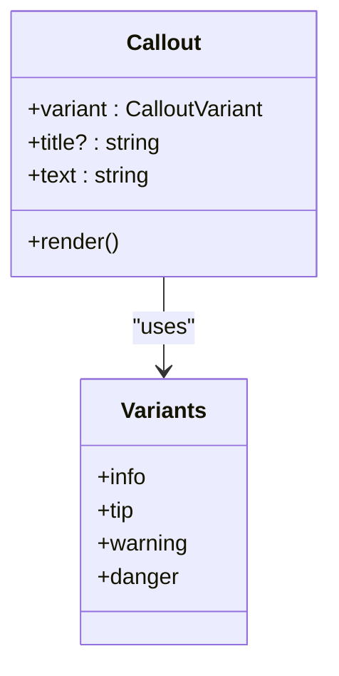
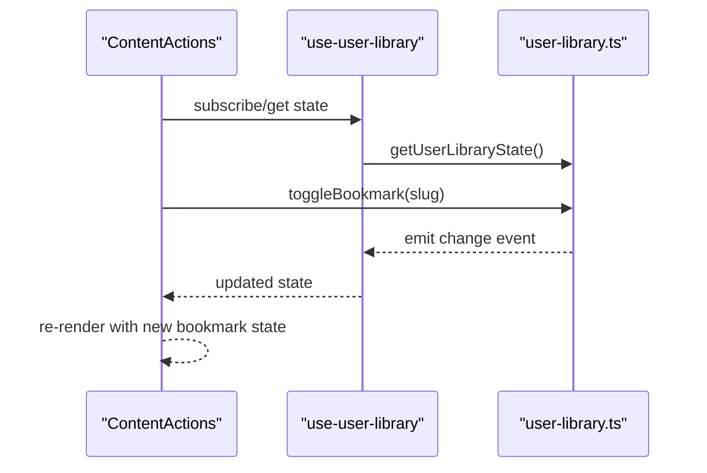
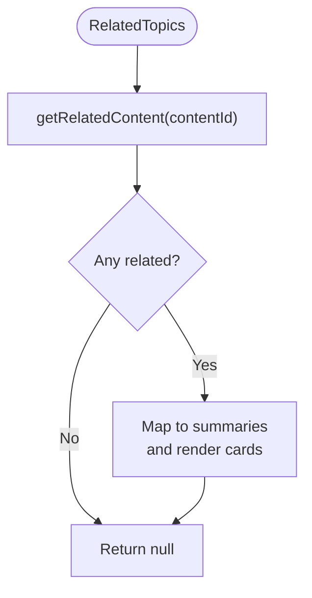
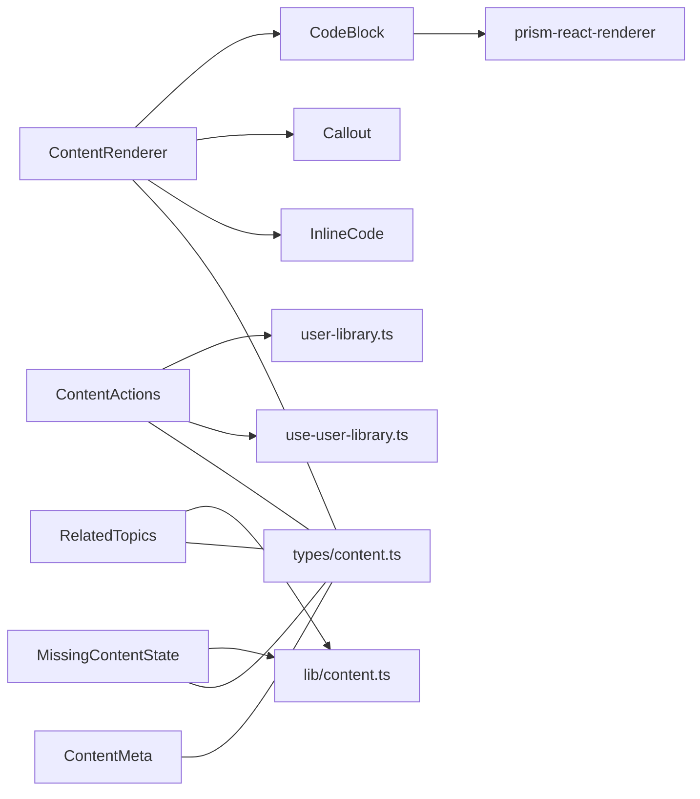

# Content Components

<cite>
**Referenced Files in This Document**
- [ContentRenderer.tsx](file://src/components/content/ContentRenderer.tsx)
- [CodeBlock.tsx](file://src/components/code/CodeBlock.tsx)
- [Callout.tsx](file://src/components/content/Callout.tsx)
- [ContentActions.tsx](file://src/components/content/ContentActions.tsx)
- [ContentMeta.tsx](file://src/components/content/ContentMeta.tsx)
- [RelatedTopics.tsx](file://src/components/content/RelatedTopics.tsx)
- [MissingContentState.tsx](file://src/components/content/MissingContentState.tsx)
- [content.ts](file://src/types/content.ts)
- [content.ts](file://src/lib/content.ts)
- [user-library.ts](file://src/lib/user-library.ts)
- [use-user-library.ts](file://src/hooks/use-user-library.ts)
- [LessonPage.tsx](file://src/features/learn/LessonPage.tsx)
- [package.json](file://package.json)
</cite>

## Table of Contents
1. [Introduction](#introduction)
2. [Project Structure](#project-structure)
3. [Core Components](#core-components)
4. [Architecture Overview](#architecture-overview)
5. [Detailed Component Analysis](#detailed-component-analysis)
6. [Dependency Analysis](#dependency-analysis)
7. [Performance Considerations](#performance-considerations)
8. [Troubleshooting Guide](#troubleshooting-guide)
9. [Conclusion](#conclusion)
10. [Appendices](#appendices)

## Introduction
This document explains JSphere’s specialized content components that render and present educational material. It focuses on:
- Markdown-like rendering pipeline and custom element processing
- Syntax highlighting integration and theme-aware code blocks
- Variant-driven callouts for different content types
- Bookmarking, sharing, and progress tracking
- Metadata display and social sharing affordances
- Intelligent related topics suggestions
- Error handling and user guidance for missing content
- Practical usage patterns and customization options
- Accessibility and performance considerations

## Project Structure
JSphere organizes content-related components under a dedicated folder and integrates them into page layouts. The content rendering pipeline is driven by a structured block model, enabling consistent rendering across lessons, references, recipes, and more.

**Diagram sources**
- [ContentRenderer.tsx:29-156](file://src/components/content/ContentRenderer.tsx#L29-L156)
- [CodeBlock.tsx:13-105](file://src/components/code/CodeBlock.tsx#L13-L105)
- [Callout.tsx:18-33](file://src/components/content/Callout.tsx#L18-L33)
- [ContentActions.tsx:13-40](file://src/components/content/ContentActions.tsx#L13-L40)
- [ContentMeta.tsx:18-38](file://src/components/content/ContentMeta.tsx#L18-L38)
- [RelatedTopics.tsx:12-41](file://src/components/content/RelatedTopics.tsx#L12-L41)
- [MissingContentState.tsx:15-89](file://src/components/content/MissingContentState.tsx#L15-L89)
- [content.ts:16-26](file://src/types/content.ts#L16-L26)
- [content.ts:78-89](file://src/lib/content.ts#L78-L89)
- [user-library.ts:138-204](file://src/lib/user-library.ts#L138-L204)
- [use-user-library.ts:4-6](file://src/hooks/use-user-library.ts#L4-L6)

**Section sources**
- [ContentRenderer.tsx:29-156](file://src/components/content/ContentRenderer.tsx#L29-L156)
- [content.ts:16-26](file://src/types/content.ts#L16-L26)

## Core Components
- ContentRenderer: Converts structured content blocks into a rendered page, grouping sections by headings and delegating specialized elements to dedicated components.
- CodeBlock: Renders highlighted code with language awareness, copy-to-clipboard, and theme-aware styling.
- Callout: Presents contextual notes, tips, warnings, and danger messages with variant-specific styling.
- ContentActions: Manages bookmarking and reading progress for a given content slug.
- ContentMeta: Displays difficulty, reading time, and tags.
- RelatedTopics: Suggests related content based on metadata relationships.
- MissingContentState: Guides users when content is unavailable, offering exploration and recent views.

**Section sources**
- [ContentRenderer.tsx:29-156](file://src/components/content/ContentRenderer.tsx#L29-L156)
- [CodeBlock.tsx:13-105](file://src/components/code/CodeBlock.tsx#L13-L105)
- [Callout.tsx:18-33](file://src/components/content/Callout.tsx#L18-L33)
- [ContentActions.tsx:13-40](file://src/components/content/ContentActions.tsx#L13-L40)
- [ContentMeta.tsx:18-38](file://src/components/content/ContentMeta.tsx#L18-L38)
- [RelatedTopics.tsx:12-41](file://src/components/content/RelatedTopics.tsx#L12-L41)
- [MissingContentState.tsx:15-89](file://src/components/content/MissingContentState.tsx#L15-L89)

## Architecture Overview
The content rendering pipeline centers on a unified block model. ContentRenderer orchestrates rendering, while specialized components handle code, callouts, actions, and metadata. User interactions are persisted via a centralized user library abstraction.

**Diagram sources**
- [LessonPage.tsx:19-122](file://src/features/learn/LessonPage.tsx#L19-L122)
- [ContentRenderer.tsx:29-156](file://src/components/content/ContentRenderer.tsx#L29-L156)
- [CodeBlock.tsx:13-105](file://src/components/code/CodeBlock.tsx#L13-L105)
- [Callout.tsx:18-33](file://src/components/content/Callout.tsx#L18-L33)
- [ContentMeta.tsx:18-38](file://src/components/content/ContentMeta.tsx#L18-L38)
- [ContentActions.tsx:13-40](file://src/components/content/ContentActions.tsx#L13-L40)
- [user-library.ts:138-204](file://src/lib/user-library.ts#L138-L204)
- [use-user-library.ts:4-6](file://src/hooks/use-user-library.ts#L4-L6)

## Detailed Component Analysis

### ContentRenderer
- Purpose: Render a sequence of content blocks into a structured, animated document.
- Key behaviors:
  - Groups blocks into concept sections separated by h2 headings.
  - Renders headings, paragraphs, lists, tables, code blocks, and callouts.
  - Processes inline code within paragraphs and table cells.
  - Applies Tailwind-based animations and transitions for smooth entry.
- Custom element processing:
  - Inline code parsing wraps backtick-delimited segments in code tags.
  - Callouts are delegated to the Callout component with variant selection.
  - Code blocks are delegated to CodeBlock with language and optional filename/highlights.
- Accessibility and UX:
  - Adds scroll margin anchors for anchor links.
  - Uses semantic headings and lists.
  - Animated transitions improve perceived performance.

**Diagram sources**
- [ContentRenderer.tsx:29-156](file://src/components/content/ContentRenderer.tsx#L29-L156)

**Section sources**
- [ContentRenderer.tsx:29-156](file://src/components/content/ContentRenderer.tsx#L29-L156)

### CodeBlock
- Purpose: Render code with syntax highlighting, language identification, and copy-to-clipboard.
- Key behaviors:
  - Detects theme based on document class (light/dark) and selects a Prism theme accordingly.
  - Observes DOM class changes to react to theme toggles.
  - Provides a copy button with success feedback.
  - Highlights specific lines via a zero-indexed highlight list.
  - Displays optional filename and language badge.
- Integration:
  - Uses prism-react-renderer for syntax highlighting.
  - Uses lucide-react icons for copy and file indicators.
- Accessibility:
  - Copy button includes aria-label.
  - Monospace typography and readable contrast in both themes.

**Diagram sources**
- [CodeBlock.tsx:13-105](file://src/components/code/CodeBlock.tsx#L13-L105)

**Section sources**
- [CodeBlock.tsx:13-105](file://src/components/code/CodeBlock.tsx#L13-L105)
- [package.json:60](file://package.json#L60)

### Callout
- Purpose: Present contextual notes with variant-specific styling and icons.
- Variants:
  - info: informational note
  - tip: helpful tip
  - warning: cautionary notice
  - danger: high-risk warning
- Behavior:
  - Renders an icon, optional title, and body text.
  - Applies border accent, background tint, and icon color per variant.
- Accessibility:
  - Semantic structure with icon and text content.

**Diagram sources**
- [Callout.tsx:18-33](file://src/components/content/Callout.tsx#L18-L33)
- [content.ts](file://src/types/content.ts#L16)

**Section sources**
- [Callout.tsx:18-33](file://src/components/content/Callout.tsx#L18-L33)
- [content.ts](file://src/types/content.ts#L16)

### ContentActions
- Purpose: Allow users to save content and track reading progress.
- Features:
  - Bookmark toggle with visual feedback.
  - Reading progress bar with percentage display.
  - Completed state indication.
- Data model:
  - Uses user library state for bookmarks and progress.
  - Integrates with a React sync external store hook for reactive updates.
- UX:
  - Clear Save/Saved state based on bookmark presence.
  - Progress bar indicates completion threshold.

**Diagram sources**
- [ContentActions.tsx:13-40](file://src/components/content/ContentActions.tsx#L13-L40)
- [use-user-library.ts:4-6](file://src/hooks/use-user-library.ts#L4-L6)
- [user-library.ts:138-204](file://src/lib/user-library.ts#L138-L204)

**Section sources**
- [ContentActions.tsx:13-40](file://src/components/content/ContentActions.tsx#L13-L40)
- [user-library.ts:138-204](file://src/lib/user-library.ts#L138-L204)
- [use-user-library.ts:4-6](file://src/hooks/use-user-library.ts#L4-L6)

### ContentMeta
- Purpose: Display metadata such as difficulty, reading time, and tags.
- Behavior:
  - Renders difficulty as a colored badge with pill-like styling.
  - Shows reading time with a clock icon.
  - Displays up to four tags as secondary badges.
- Theming:
  - Uses variant-specific color classes mapped to difficulty levels.

**Section sources**
- [ContentMeta.tsx:18-38](file://src/components/content/ContentMeta.tsx#L18-L38)
- [content.ts](file://src/types/content.ts#L14)

### RelatedTopics
- Purpose: Suggest related content to keep learners engaged.
- Behavior:
  - Fetches related content IDs from metadata and resolves to summaries.
  - Renders a grid of links with title, pillar label, and reading time.
  - Uses router links for navigation.
- Discovery pattern:
  - Relies on precomputed relatedTopics IDs in content metadata.

**Diagram sources**
- [RelatedTopics.tsx:12-41](file://src/components/content/RelatedTopics.tsx#L12-L41)
- [content.ts:78-89](file://src/lib/content.ts#L78-L89)

**Section sources**
- [RelatedTopics.tsx:12-41](file://src/components/content/RelatedTopics.tsx#L12-L41)
- [content.ts:78-89](file://src/lib/content.ts#L78-L89)

### MissingContentState
- Purpose: Provide graceful guidance when content is not available.
- Behavior:
  - Offers primary actions: explore pillar, go home.
  - Suggests content based on pillar and recently viewed items.
  - Uses cards with titles and descriptions for suggested items.
- UX:
  - Calm, non-frustrating messaging with actionable buttons.

**Section sources**
- [MissingContentState.tsx:15-89](file://src/components/content/MissingContentState.tsx#L15-L89)

## Dependency Analysis
- ContentRenderer depends on:
  - CodeBlock and Callout for specialized rendering.
  - InlineCode parsing for in-paragraph code.
- CodeBlock depends on:
  - prism-react-renderer for syntax highlighting.
  - Theme detection via DOM observer.
- ContentActions depends on:
  - user-library.ts for persistence and state updates.
  - use-user-library.ts for reactive subscriptions.
- RelatedTopics and MissingContentState depend on:
  - lib/content.ts for metadata and suggestions.
- Types define the block model and variants used across components.

**Diagram sources**
- [ContentRenderer.tsx:29-156](file://src/components/content/ContentRenderer.tsx#L29-L156)
- [CodeBlock.tsx:13-105](file://src/components/code/CodeBlock.tsx#L13-L105)
- [Callout.tsx:18-33](file://src/components/content/Callout.tsx#L18-L33)
- [ContentActions.tsx:13-40](file://src/components/content/ContentActions.tsx#L13-L40)
- [RelatedTopics.tsx:12-41](file://src/components/content/RelatedTopics.tsx#L12-L41)
- [MissingContentState.tsx:15-89](file://src/components/content/MissingContentState.tsx#L15-L89)
- [content.ts:16-26](file://src/types/content.ts#L16-L26)
- [content.ts:78-89](file://src/lib/content.ts#L78-L89)
- [user-library.ts:138-204](file://src/lib/user-library.ts#L138-L204)
- [use-user-library.ts:4-6](file://src/hooks/use-user-library.ts#L4-L6)

**Section sources**
- [content.ts:16-26](file://src/types/content.ts#L16-L26)
- [content.ts:78-89](file://src/lib/content.ts#L78-L89)
- [user-library.ts:138-204](file://src/lib/user-library.ts#L138-L204)
- [use-user-library.ts:4-6](file://src/hooks/use-user-library.ts#L4-L6)

## Performance Considerations
- Memoization and composition:
  - ContentRenderer is memoized to avoid unnecessary re-renders when blocks are unchanged.
  - CodeBlock uses memoized theme detection and a lightweight observer.
- Lazy loading and hydration:
  - CodeBlock defers heavy rendering until mounted; consider lazy-loading the renderer for very large documents.
- CSS and animations:
  - Minimal animations improve perceived performance; disable where needed for constrained environments.
- Clipboard operations:
  - Copy-to-clipboard is asynchronous; ensure fallbacks for unsupported contexts.
- Storage:
  - User library state is persisted in localStorage; consider throttling writes for frequent progress updates.

[No sources needed since this section provides general guidance]

## Troubleshooting Guide
- CodeBlock not highlighting:
  - Verify language is supported by prism-react-renderer and passed correctly.
  - Confirm theme detection observes DOM class changes.
- Copy button fails silently:
  - Check clipboard permissions and HTTPS context; handle exceptions gracefully.
- Callout variant not applying:
  - Ensure variant is one of the supported values and matches the variant map.
- ContentActions not updating:
  - Confirm use-user-library subscription is active and localStorage is writable.
- MissingContentState not suggesting content:
  - Ensure relatedTopics IDs exist and are resolvable via metadata.

**Section sources**
- [CodeBlock.tsx:13-105](file://src/components/code/CodeBlock.tsx#L13-L105)
- [Callout.tsx:18-33](file://src/components/content/Callout.tsx#L18-L33)
- [ContentActions.tsx:13-40](file://src/components/content/ContentActions.tsx#L13-L40)
- [MissingContentState.tsx:15-89](file://src/components/content/MissingContentState.tsx#L15-L89)

## Conclusion
JSphere’s content components form a cohesive, extensible system for rendering and interacting with educational content. By leveraging a unified block model, robust user library integration, and theme-aware rendering, the components deliver a rich, accessible, and performant experience. The modular design allows easy customization and extension for diverse content types.

[No sources needed since this section summarizes without analyzing specific files]

## Appendices

### Usage Examples
- Rendering a lesson page:
  - LessonPage composes ContentRenderer, ContentMeta, ContentActions, RelatedTopics, and handles missing content states.
  - See [LessonPage.tsx:19-122](file://src/features/learn/LessonPage.tsx#L19-L122).

- Building a content block:
  - Define a ContentBlock array with headings, paragraphs, lists, tables, code, and callouts.
  - See [content.ts:20-26](file://src/types/content.ts#L20-L26).

- Managing bookmarks and progress:
  - Toggle bookmarks and update progress via user-library APIs.
  - See [user-library.ts:138-204](file://src/lib/user-library.ts#L138-L204).

**Section sources**
- [LessonPage.tsx:19-122](file://src/features/learn/LessonPage.tsx#L19-L122)
- [content.ts:20-26](file://src/types/content.ts#L20-L26)
- [user-library.ts:138-204](file://src/lib/user-library.ts#L138-L204)

### Customization Options
- Theming:
  - Adjust theme mapping in CodeBlock to align with your design system.
- Variants:
  - Extend Callout variants by adding new entries to the variant map.
- Styling:
  - Override Tailwind classes for headings, lists, and tables in ContentRenderer.
- Accessibility:
  - Ensure sufficient color contrast in theme-aware components.
  - Add ARIA labels for interactive elements where needed.

[No sources needed since this section provides general guidance]