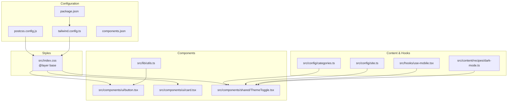
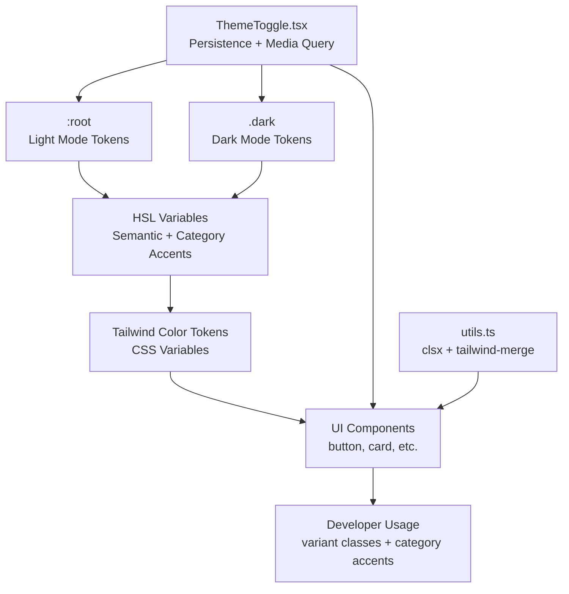
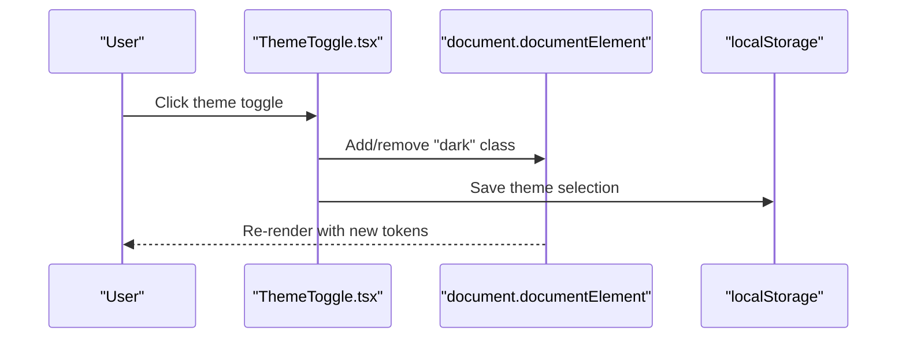
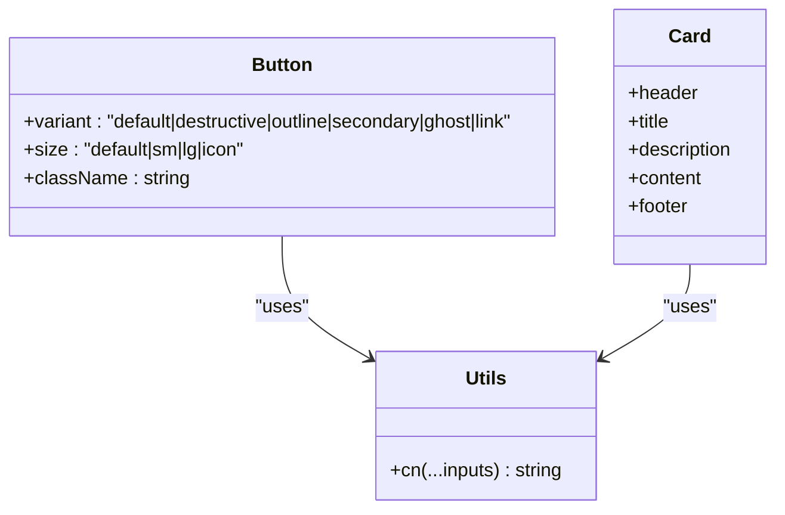
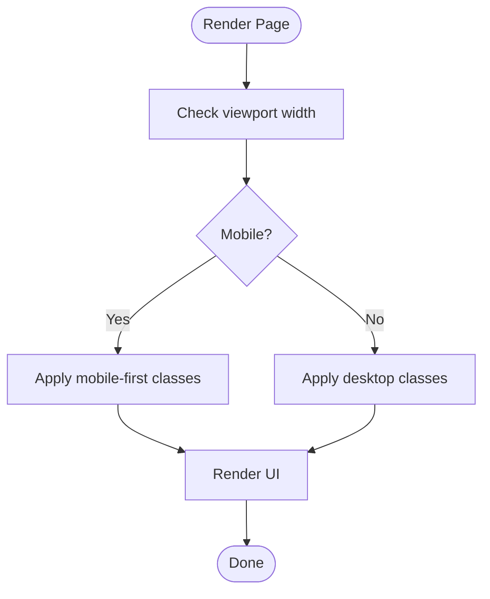
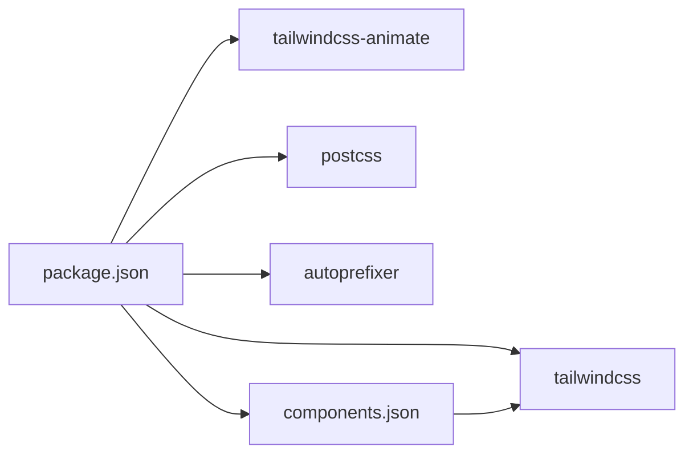

# Design System

<cite>
**Referenced Files in This Document**
- [tailwind.config.ts](file://tailwind.config.ts)
- [index.css](file://src/index.css)
- [postcss.config.js](file://postcss.config.js)
- [package.json](file://package.json)
- [ThemeToggle.tsx](file://src/components/shared/ThemeToggle.tsx)
- [button.tsx](file://src/components/ui/button.tsx)
- [card.tsx](file://src/components/ui/card.tsx)
- [categories.ts](file://src/config/categories.ts)
- [site.ts](file://src/config/site.ts)
- [utils.ts](file://src/lib/utils.ts)
- [use-mobile.tsx](file://src/hooks/use-mobile.tsx)
- [dark-mode.ts](file://src/content/recipes/dark-mode.ts)
- [components.json](file://components.json)
</cite>

## Table of Contents
1. [Introduction](#introduction)
2. [Project Structure](#project-structure)
3. [Core Components](#core-components)
4. [Architecture Overview](#architecture-overview)
5. [Detailed Component Analysis](#detailed-component-analysis)
6. [Dependency Analysis](#dependency-analysis)
7. [Performance Considerations](#performance-considerations)
8. [Troubleshooting Guide](#troubleshooting-guide)
9. [Conclusion](#conclusion)
10. [Appendices](#appendices)

## Introduction
This document describes JSphere’s design system: a cohesive visual identity and styling architecture built on HSL-based design tokens, a Tailwind CSS configuration with custom spacing and typography, and a robust theming model supporting light and dark modes. It documents the token hierarchy (semantic, component, and utility), brand identity guidelines, responsive design system, animation and transitions, and component customization patterns. It also provides practical guidance for designers and developers contributing to and maintaining the system.

## Project Structure
JSphere organizes design and styling across configuration, CSS layers, and component libraries:
- Tailwind configuration defines design tokens, extended color palette, animations, and spacing.
- CSS layers define semantic tokens and apply them via HSL variables for light and dark modes.
- UI components consume semantic tokens and expose variant-driven customization.
- Theming utilities and hooks manage theme persistence and media queries.
- Category-specific accent tokens are mapped to content pillars for consistent brand expression.

**Diagram sources**
- [tailwind.config.ts](file://tailwind.config.ts)
- [postcss.config.js](file://postcss.config.js)
- [package.json](file://package.json)
- [components.json](file://components.json)
- [index.css](file://src/index.css)
- [button.tsx](file://src/components/ui/button.tsx)
- [card.tsx](file://src/components/ui/card.tsx)
- [ThemeToggle.tsx](file://src/components/shared/ThemeToggle.tsx)
- [utils.ts](file://src/lib/utils.ts)
- [categories.ts](file://src/config/categories.ts)
- [site.ts](file://src/config/site.ts)
- [use-mobile.tsx](file://src/hooks/use-mobile.tsx)
- [dark-mode.ts](file://src/content/recipes/dark-mode.ts)

**Section sources**
- [tailwind.config.ts](file://tailwind.config.ts)
- [index.css](file://src/index.css)
- [postcss.config.js](file://postcss.config.js)
- [package.json](file://package.json)
- [components.json](file://components.json)

## Core Components
JSphere’s design system centers on three pillars:
- Semantic tokens: foundational HSL variables for background, foreground, borders, and component roles.
- Category accent tokens: unique accent colors per content pillar (Learn, Reference, Integrations, Recipes, Projects, Explore, Errors).
- Component tokens: UI primitives (buttons, cards, inputs) that resolve to semantic tokens and optionally to category accents.

Key implementation highlights:
- Tailwind resolves color tokens to HSL via CSS variables, enabling dynamic theming.
- Category accent tokens are exposed as named CSS variables and Tailwind utilities.
- UI components use semantic tokens and variant classes for consistent styling.

**Section sources**
- [tailwind.config.ts](file://tailwind.config.ts)
- [index.css](file://src/index.css)
- [button.tsx](file://src/components/ui/button.tsx)
- [card.tsx](file://src/components/ui/card.tsx)
- [categories.ts](file://src/config/categories.ts)

## Architecture Overview
The design system architecture ties together configuration, tokens, and components:

**Diagram sources**
- [index.css](file://src/index.css)
- [tailwind.config.ts](file://tailwind.config.ts)
- [ThemeToggle.tsx](file://src/components/shared/ThemeToggle.tsx)
- [utils.ts](file://src/lib/utils.ts)
- [button.tsx](file://src/components/ui/button.tsx)
- [card.tsx](file://src/components/ui/card.tsx)

## Detailed Component Analysis

### Token Hierarchy and Application
JSphere defines a layered token system:
- Semantic tokens: background, foreground, primary, secondary, muted, accent, destructive, border, input, ring, and radius.
- Category accent tokens: seven distinct HSL values for Learn, Reference, Integrations, Recipes, Projects, Explore, and Errors.
- Component tokens: UI components resolve to semantic tokens (e.g., button background to primary, card background to card).
- Utility tokens: Tailwind utilities like text-balance and responsive grid classes.

Implementation details:
- Tokens are authored in CSS layers and consumed by Tailwind via CSS variables.
- Category accents are surfaced as both CSS variables and Tailwind utilities for convenient usage.

**Section sources**
- [index.css](file://src/index.css)
- [tailwind.config.ts](file://tailwind.config.ts)
- [button.tsx](file://src/components/ui/button.tsx)
- [card.tsx](file://src/components/ui/card.tsx)
- [categories.ts](file://src/config/categories.ts)

### Theming Model: Light and Dark Modes
JSphere supports a robust theming model:
- Light and dark tokens are defined in CSS layers with matching HSL values for each semantic role.
- Category accent tokens are mirrored across light and dark modes for consistent brand expression.
- Theme persistence and system preference detection are handled by a theme toggle component that toggles a class on the root element and persists the choice in local storage.
- A dedicated recipe demonstrates a programmatic theme manager that updates CSS variables dynamically and dispatches a custom event.

**Diagram sources**
- [ThemeToggle.tsx](file://src/components/shared/ThemeToggle.tsx)
- [index.css](file://src/index.css)

**Section sources**
- [ThemeToggle.tsx](file://src/components/shared/ThemeToggle.tsx)
- [index.css](file://src/index.css)
- [dark-mode.ts](file://src/content/recipes/dark-mode.ts)

### Tailwind Configuration and Customization
Tailwind is configured to:
- Enable class-based dark mode.
- Scan components and app files for utility extraction.
- Extend fonts (sans and mono), colors (semantic and category accents), border radius, keyframes, and animations.
- Integrate tailwindcss-animate for animation utilities.

Custom spacing and typography:
- Container padding and screen thresholds are defined for consistent page widths.
- Font families are set for sans and monospace contexts.

Category accent utilities:
- Named color utilities are generated for each pillar, enabling quick application of brand accents.

**Section sources**
- [tailwind.config.ts](file://tailwind.config.ts)
- [postcss.config.js](file://postcss.config.js)
- [package.json](file://package.json)

### Component Theming and Variants
UI components are designed to inherit from semantic tokens and support variant-driven customization:
- Buttons expose variants (default, destructive, outline, secondary, ghost, link) and sizes, resolving to semantic tokens.
- Cards and other surfaces rely on card and background tokens for consistent elevation and contrast.
- Utilities like clsx and tailwind-merge ensure predictable class composition.

**Diagram sources**
- [button.tsx](file://src/components/ui/button.tsx)
- [card.tsx](file://src/components/ui/card.tsx)
- [utils.ts](file://src/lib/utils.ts)

**Section sources**
- [button.tsx](file://src/components/ui/button.tsx)
- [card.tsx](file://src/components/ui/card.tsx)
- [utils.ts](file://src/lib/utils.ts)

### Responsive Design System
JSphere’s responsive strategy:
- Breakpoints are used implicitly through Tailwind utilities (e.g., lg:grid-cols-4).
- A mobile hook detects viewport width and enables responsive behavior in components.
- Content areas use consistent padding rules across breakpoints for readability.

**Diagram sources**
- [use-mobile.tsx](file://src/hooks/use-mobile.tsx)
- [index.css](file://src/index.css)

**Section sources**
- [use-mobile.tsx](file://src/hooks/use-mobile.tsx)
- [index.css](file://src/index.css)

### Animation and Transition System
JSphere integrates smooth transitions and animations:
- Tailwind’s animate plugin provides built-in keyframes and animation utilities.
- Accordion animations demonstrate consistent easing and timing.
- Motion preferences are respected via reduced-motion media queries in base styles.

**Section sources**
- [tailwind.config.ts](file://tailwind.config.ts)
- [index.css](file://src/index.css)

### Brand Identity Guidelines
Brand identity in JSphere:
- Name and tagline are defined centrally for consistent messaging.
- Category accent tokens visually distinguish content pillars while maintaining a unified palette.
- Typography emphasizes readability with system-safe fonts and monospace for code.

**Section sources**
- [site.ts](file://src/config/site.ts)
- [index.css](file://src/index.css)
- [categories.ts](file://src/config/categories.ts)

### Component Customization Patterns
To maintain design consistency when extending components:
- Prefer variant props and size classes over ad-hoc overrides.
- Use category accent utilities for contextual highlighting aligned with content pillars.
- Compose classes with utility functions to avoid conflicts and ensure merging semantics.

**Section sources**
- [button.tsx](file://src/components/ui/button.tsx)
- [categories.ts](file://src/config/categories.ts)
- [utils.ts](file://src/lib/utils.ts)

## Dependency Analysis
The design system relies on a small set of key dependencies and configurations:
- Tailwind CSS and tailwindcss-animate for styling and animation utilities.
- PostCSS and Autoprefixer for CSS processing.
- shadcn/ui components.json for standardized component aliases and Tailwind variables.

**Diagram sources**
- [package.json](file://package.json)
- [components.json](file://components.json)

**Section sources**
- [package.json](file://package.json)
- [components.json](file://components.json)

## Performance Considerations
- CSS variable-based theming avoids reprocessing large static assets; keep token updates minimal and scoped.
- Prefer variant classes over inline styles to leverage Tailwind’s purging and caching.
- Use responsive utilities judiciously to minimize unnecessary class combinations.

## Troubleshooting Guide
Common issues and resolutions:
- Theme not persisting: verify the theme toggle writes to local storage and toggles the root class.
- Category accent not applying: ensure the correct Tailwind text/bg utility is used and the CSS variable is defined in both light and dark layers.
- Animations not playing: confirm tailwindcss-animate is enabled and keyframes are defined in the Tailwind config.
- Build-time scanning issues: verify content globs in Tailwind config include component directories.

**Section sources**
- [ThemeToggle.tsx](file://src/components/shared/ThemeToggle.tsx)
- [tailwind.config.ts](file://tailwind.config.ts)
- [index.css](file://src/index.css)

## Conclusion
JSphere’s design system combines HSL-based semantic tokens, category-specific accents, and a robust theming model to deliver a consistent, accessible, and extensible visual identity. By leveraging Tailwind’s CSS variable integration, a clear token hierarchy, and component variants, teams can rapidly build UIs that remain aligned with brand guidelines and responsive across devices.

## Appendices

### Appendix A: Token Reference
- Semantic tokens: background, foreground, primary, secondary, muted, accent, destructive, border, input, ring, radius.
- Category accent tokens: accent-learn, accent-reference, accent-integrations, accent-recipes, accent-projects, accent-explore, accent-errors.
- Component tokens: buttons, cards, inputs, and other primitives resolve to semantic tokens.

**Section sources**
- [index.css](file://src/index.css)
- [tailwind.config.ts](file://tailwind.config.ts)
- [button.tsx](file://src/components/ui/button.tsx)
- [card.tsx](file://src/components/ui/card.tsx)

### Appendix B: Contribution Workflow
- Define or update HSL tokens in the base CSS layer.
- Extend Tailwind color tokens if adding new semantic roles or category accents.
- Implement component variants thoughtfully and reuse existing tokens.
- Test theme switching and motion preferences across components.
- Keep content and configuration files (categories, site config) synchronized with brand updates.

**Section sources**
- [index.css](file://src/index.css)
- [tailwind.config.ts](file://tailwind.config.ts)
- [categories.ts](file://src/config/categories.ts)
- [site.ts](file://src/config/site.ts)