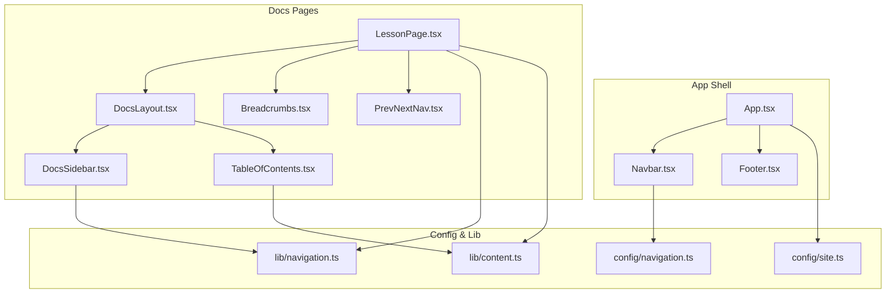
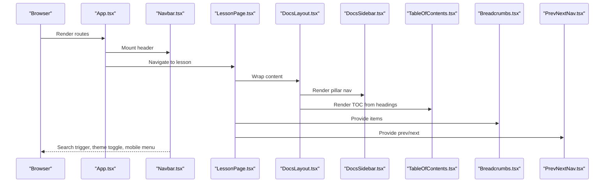
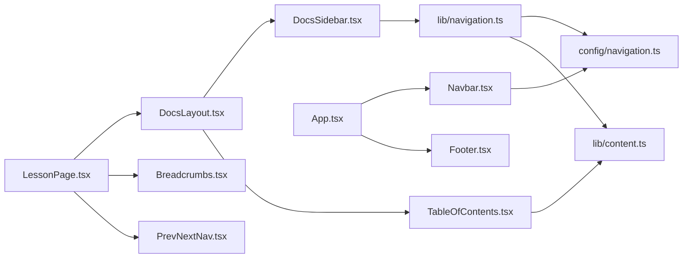
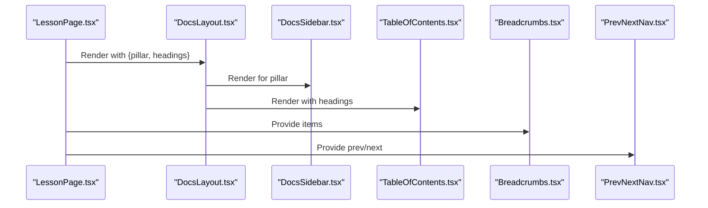

# Layout Components

<cite>
**Referenced Files in This Document**
- [App.tsx](file://src/App.tsx)
- [DocsLayout.tsx](file://src/components/layout/DocsLayout.tsx)
- [Navbar.tsx](file://src/components/navigation/Navbar.tsx)
- [Footer.tsx](file://src/components/navigation/Footer.tsx)
- [DocsSidebar.tsx](file://src/components/navigation/DocsSidebar.tsx)
- [Breadcrumbs.tsx](file://src/components/navigation/Breadcrumbs.tsx)
- [TableOfContents.tsx](file://src/components/navigation/TableOfContents.tsx)
- [PrevNextNav.tsx](file://src/components/navigation/PrevNextNav.tsx)
- [navigation.ts](file://src/lib/navigation.ts)
- [navigation.ts (config)](file://src/config/navigation.ts)
- [content.ts](file://src/lib/content.ts)
- [LessonPage.tsx](file://src/features/learn/LessonPage.tsx)
- [site.ts](file://src/config/site.ts)
</cite>

## Table of Contents
1. [Introduction](#introduction)
2. [Project Structure](#project-structure)
3. [Core Components](#core-components)
4. [Architecture Overview](#architecture-overview)
5. [Detailed Component Analysis](#detailed-component-analysis)
6. [Dependency Analysis](#dependency-analysis)
7. [Performance Considerations](#performance-considerations)
8. [Troubleshooting Guide](#troubleshooting-guide)
9. [Conclusion](#conclusion)
10. [Appendices](#appendices)

## Introduction
This document describes JSphere’s layout components that provide consistent navigation and content organization across all content pillars. It focuses on:
- DocsLayout responsive grid system, sidebar management, and content area handling
- Navbar logo integration, navigation links, search functionality, and mobile responsiveness
- Footer sitemap generation, social links, and legal information display
- DocsSidebar hierarchical navigation, active state tracking, and collapsible behavior
- Breadcrumbs automatic path generation and navigation enhancement
- TableOfContents heading extraction, scroll synchronization, and mobile-friendly design
- PrevNextNav content discovery and navigation flow patterns
- Usage examples showing how layout components coordinate to create seamless user experiences
- Customization options, responsive breakpoints, and accessibility features
- Relationship between layout components and the overall application architecture

## Project Structure
JSphere organizes layout and navigation components under src/components, with configuration and utilities under src/config and src/lib. Pages under src/features consume these components to assemble cohesive layouts.

**Diagram sources**
- [App.tsx:40-103](file://src/App.tsx#L40-L103)
- [DocsLayout.tsx:12-26](file://src/components/layout/DocsLayout.tsx#L12-L26)
- [Navbar.tsx:24-183](file://src/components/navigation/Navbar.tsx#L24-L183)
- [Footer.tsx:39-91](file://src/components/navigation/Footer.tsx#L39-L91)
- [DocsSidebar.tsx:13-68](file://src/components/navigation/DocsSidebar.tsx#L13-L68)
- [TableOfContents.tsx:9-68](file://src/components/navigation/TableOfContents.tsx#L9-L68)
- [Breadcrumbs.tsx:13-34](file://src/components/navigation/Breadcrumbs.tsx#L13-L34)
- [PrevNextNav.tsx:9-45](file://src/components/navigation/PrevNextNav.tsx#L9-L45)
- [navigation.ts (config):62-262](file://src/config/navigation.ts#L62-L262)
- [navigation.ts:28-74](file://src/lib/navigation.ts#L28-L74)
- [content.ts](file://src/lib/content.ts)
- [LessonPage.tsx:19-123](file://src/features/learn/LessonPage.tsx#L19-L123)
- [site.ts:1-15](file://src/config/site.ts#L1-L15)

**Section sources**
- [App.tsx:40-103](file://src/App.tsx#L40-L103)
- [DocsLayout.tsx:12-26](file://src/components/layout/DocsLayout.tsx#L12-L26)
- [Navbar.tsx:24-183](file://src/components/navigation/Navbar.tsx#L24-L183)
- [Footer.tsx:39-91](file://src/components/navigation/Footer.tsx#L39-L91)
- [DocsSidebar.tsx:13-68](file://src/components/navigation/DocsSidebar.tsx#L13-L68)
- [TableOfContents.tsx:9-68](file://src/components/navigation/TableOfContents.tsx#L9-L68)
- [Breadcrumbs.tsx:13-34](file://src/components/navigation/Breadcrumbs.tsx#L13-L34)
- [PrevNextNav.tsx:9-45](file://src/components/navigation/PrevNextNav.tsx#L9-L45)
- [navigation.ts (config):62-262](file://src/config/navigation.ts#L62-L262)
- [navigation.ts:28-74](file://src/lib/navigation.ts#L28-L74)
- [content.ts](file://src/lib/content.ts)
- [LessonPage.tsx:19-123](file://src/features/learn/LessonPage.tsx#L19-L123)
- [site.ts:1-15](file://src/config/site.ts#L1-L15)

## Core Components
- DocsLayout: Provides a responsive three-column grid (sidebar, content, TOC) with sticky main content and constrained width.
- Navbar: Implements desktop mega menu, mobile sheet menu, theme toggle, and global search trigger.
- Footer: Renders a multi-column sitemap and legal attribution.
- DocsSidebar: Hierarchical sidebar with collapsible groups, active state detection, and availability badges.
- Breadcrumbs: Generates navigable breadcrumbs from a list of items.
- TableOfContents: Extracts headings, observes intersections, and provides scroll-to anchors.
- PrevNextNav: Displays previous/next navigation with optional placeholders.

**Section sources**
- [DocsLayout.tsx:12-26](file://src/components/layout/DocsLayout.tsx#L12-L26)
- [Navbar.tsx:24-183](file://src/components/navigation/Navbar.tsx#L24-L183)
- [Footer.tsx:39-91](file://src/components/navigation/Footer.tsx#L39-L91)
- [DocsSidebar.tsx:13-68](file://src/components/navigation/DocsSidebar.tsx#L13-L68)
- [Breadcrumbs.tsx:13-34](file://src/components/navigation/Breadcrumbs.tsx#L13-L34)
- [TableOfContents.tsx:9-68](file://src/components/navigation/TableOfContents.tsx#L9-L68)
- [PrevNextNav.tsx:9-45](file://src/components/navigation/PrevNextNav.tsx#L9-L45)

## Architecture Overview
JSphere composes layout components around content pages. The app shell mounts Navbar and Footer globally, while content pages wrap their content in DocsLayout and compose complementary navigation aids.

**Diagram sources**
- [App.tsx:40-103](file://src/App.tsx#L40-L103)
- [LessonPage.tsx:19-123](file://src/features/learn/LessonPage.tsx#L19-L123)
- [DocsLayout.tsx:12-26](file://src/components/layout/DocsLayout.tsx#L12-L26)
- [DocsSidebar.tsx:13-68](file://src/components/navigation/DocsSidebar.tsx#L13-L68)
- [TableOfContents.tsx:9-68](file://src/components/navigation/TableOfContents.tsx#L9-L68)
- [Breadcrumbs.tsx:13-34](file://src/components/navigation/Breadcrumbs.tsx#L13-L34)
- [PrevNextNav.tsx:9-45](file://src/components/navigation/PrevNextNav.tsx#L9-L45)

## Detailed Component Analysis

### DocsLayout
Responsibilities:
- Centers content with a max-width container and horizontal padding.
- Renders DocsSidebar on the left for desktop.
- Renders TableOfContents on the right for desktop.
- Wraps page content inside a constrained main area.

Responsive behavior:
- Sidebar and TOC are hidden on small screens; content remains centered and readable.
- Sticky positioning ensures sidebar and TOC remain visible during vertical scrolling.

Customization:
- Adjust max-width and padding classes to change spacing.
- Modify column widths or visibility breakpoints by editing the wrapper and aside classes.

Accessibility:
- Uses semantic main element for content focus.
- No explicit ARIA roles are added; ensure screen readers can navigate the page structure.

**Section sources**
- [DocsLayout.tsx:12-26](file://src/components/layout/DocsLayout.tsx#L12-L26)

### Navbar
Responsibilities:
- Logo integration with brand initials and name.
- Desktop navigation using a mega menu with grouped items and descriptions.
- Mobile navigation via a collapsible sheet with grouped sections.
- Global search trigger with keyboard shortcut support.
- Theme toggle integration.

Desktop navigation:
- Uses NavigationMenu components to render grouped links with grid layouts.
- Availability status is resolved dynamically and displayed with badges.

Mobile navigation:
- Uses Collapsible sections to expand/collapse groups.
- Each item conditionally renders a link or a disabled badge depending on availability.

Search:
- Triggers a global search modal via a callback passed from the app shell.
- Supports macOS-style Command+K shortcut.

Responsive breakpoints:
- Mega menu hidden below lg; mobile sheet appears at lg and below.
- Search button shows desktop-only; mobile uses a compact icon button.

Accessibility:
- Uses proper heading levels and labels for menu triggers.
- Keyboard navigation supported by underlying UI components.

**Section sources**
- [Navbar.tsx:24-183](file://src/components/navigation/Navbar.tsx#L24-L183)
- [App.tsx:40-103](file://src/App.tsx#L40-L103)
- [navigation.ts (config):62-262](file://src/config/navigation.ts#L62-L262)
- [navigation.ts:28-43](file://src/lib/navigation.ts#L28-L43)

### Footer
Responsibilities:
- Sitemap organized into four columns with pillar sections.
- Legal attribution and branding with author link and site tagline.
- Responsive grid layout adapts to two columns on small screens and four on larger.

Customization:
- Edit footerLinks array to adjust sections and links.
- Modify grid classes to change column count at different breakpoints.

Accessibility:
- Links are styled for contrast and hover states; ensure sufficient color contrast for readability.

**Section sources**
- [Footer.tsx:39-91](file://src/components/navigation/Footer.tsx#L39-L91)

### DocsSidebar
Responsibilities:
- Builds hierarchical navigation per pillar using sidebar configuration.
- Detects active item based on current location.
- Collapsible groups with chevron rotation and default open states.
- Availability badges for items not yet published.

Behavior:
- Uses IntersectionObserver-like logic indirectly via location pathname comparison to highlight active items.
- Groups default to open if any child is active.

Customization:
- Configure defaultOpen flags per group.
- Add or remove items in sidebarConfig for each pillar.

Accessibility:
- Uses focusable links and hover states; ensure keyboard navigation is smooth.

**Section sources**
- [DocsSidebar.tsx:13-68](file://src/components/navigation/DocsSidebar.tsx#L13-L68)
- [navigation.ts (config):266-523](file://src/config/navigation.ts#L266-L523)
- [navigation.ts:45-57](file://src/lib/navigation.ts#L45-L57)

### Breadcrumbs
Responsibilities:
- Generates a breadcrumb trail from a list of items.
- Home link is always present; last item is non-clickable.
- Uses Lucide icons for home and chevron separators.

Usage:
- Pages pass items derived from current route context (e.g., Learn pillar, category, title).

Accessibility:
- Adds an aria-label to the nav element for screen readers.

**Section sources**
- [Breadcrumbs.tsx:13-34](file://src/components/navigation/Breadcrumbs.tsx#L13-L34)
- [LessonPage.tsx:45-51](file://src/features/learn/LessonPage.tsx#L45-L51)

### TableOfContents
Responsibilities:
- Extracts headings from content and observes their intersection with the viewport.
- Highlights the currently visible heading and provides anchor links.
- Supports keyboard activation to scroll to headings.

Behavior:
- Uses IntersectionObserver with a root margin to detect active headings.
- Applies indentation based on heading levels.

Responsive:
- Hidden on small screens; visible on extra-large screens and above.

Accessibility:
- Keyboard support for Enter/Space to jump to headings.
- Focus-visible ring for keyboard navigation.

**Section sources**
- [TableOfContents.tsx:9-68](file://src/components/navigation/TableOfContents.tsx#L9-L68)
- [LessonPage.tsx:39-40](file://src/features/learn/LessonPage.tsx#L39-L40)
- [content.ts](file://src/lib/content.ts)

### PrevNextNav
Responsibilities:
- Displays Previous and Next navigation buttons with labels and icons.
- Shows empty placeholders when prev or next is unavailable.
- Uses subtle hover animations and spacing.

Usage:
- Pages compute prev/next from content metadata and pass them to the component.

**Section sources**
- [PrevNextNav.tsx:9-45](file://src/components/navigation/PrevNextNav.tsx#L9-L45)
- [LessonPage.tsx:40](file://src/features/learn/LessonPage.tsx#L40)
- [navigation.ts:59-65](file://src/lib/navigation.ts#L59-L65)

## Dependency Analysis
The layout components depend on configuration and utilities for navigation and content metadata.

**Diagram sources**
- [DocsLayout.tsx:12-26](file://src/components/layout/DocsLayout.tsx#L12-L26)
- [DocsSidebar.tsx:13-68](file://src/components/navigation/DocsSidebar.tsx#L13-L68)
- [TableOfContents.tsx:9-68](file://src/components/navigation/TableOfContents.tsx#L9-L68)
- [LessonPage.tsx:19-123](file://src/features/learn/LessonPage.tsx#L19-L123)
- [Breadcrumbs.tsx:13-34](file://src/components/navigation/Breadcrumbs.tsx#L13-L34)
- [PrevNextNav.tsx:9-45](file://src/components/navigation/PrevNextNav.tsx#L9-L45)
- [navigation.ts:28-74](file://src/lib/navigation.ts#L28-L74)
- [navigation.ts (config):62-262](file://src/config/navigation.ts#L62-L262)
- [content.ts](file://src/lib/content.ts)
- [App.tsx:40-103](file://src/App.tsx#L40-L103)
- [Footer.tsx:39-91](file://src/components/navigation/Footer.tsx#L39-L91)

**Section sources**
- [navigation.ts:28-74](file://src/lib/navigation.ts#L28-L74)
- [navigation.ts (config):62-262](file://src/config/navigation.ts#L62-L262)
- [content.ts](file://src/lib/content.ts)
- [App.tsx:40-103](file://src/App.tsx#L40-L103)

## Performance Considerations
- DocsLayout centers content and constrains width to improve readability; keep content sections within the main container to minimize layout thrashing.
- Navbar’s desktop mega menu uses grid layouts; avoid excessive nesting to prevent reflow.
- DocsSidebar relies on pathname matching for active states; ensure minimal re-renders by memoizing computed navigation structures.
- TableOfContents uses IntersectionObserver; avoid frequent DOM mutations to the headings to maintain smooth scroll synchronization.
- PrevNextNav is lightweight; keep prev/next computation efficient by caching metadata.

[No sources needed since this section provides general guidance]

## Troubleshooting Guide
- Sidebar does not highlight active item:
  - Verify the current route matches an item href in the sidebar configuration for the selected pillar.
  - Confirm the location hook is available in the page context.

- TableOfContents not updating:
  - Ensure headings are extracted from content and passed to the component.
  - Confirm heading ids exist in the DOM and IntersectionObserver targets are present.

- Navbar links show “Coming Soon”:
  - Check availability resolution logic and whether content metadata exists for the given slug.

- Breadcrumbs missing last link:
  - Ensure the items array includes the current page label without an href.

- PrevNextNav shows empty:
  - Verify prev/next metadata is available for the current slug.

**Section sources**
- [DocsSidebar.tsx:22-32](file://src/components/navigation/DocsSidebar.tsx#L22-L32)
- [TableOfContents.tsx:24-30](file://src/components/navigation/TableOfContents.tsx#L24-L30)
- [navigation.ts:24-26](file://src/lib/navigation.ts#L24-L26)
- [Breadcrumbs.tsx:22-28](file://src/components/navigation/Breadcrumbs.tsx#L22-L28)
- [PrevNextNav.tsx:10](file://src/components/navigation/PrevNextNav.tsx#L10)

## Conclusion
JSphere’s layout components deliver a consistent, accessible, and responsive navigation experience across content pillars. By composing DocsLayout with DocsSidebar, TableOfContents, Breadcrumbs, and PrevNextNav, pages achieve clear orientation, discoverability, and smooth reading flows. Configuration-driven navigation and dynamic availability checks keep the UI synchronized with evolving content.

[No sources needed since this section summarizes without analyzing specific files]

## Appendices

### Usage Examples: How Components Coordinate
- Lesson page composition:
  - LessonPage wraps content in DocsLayout, passes pillar and headings.
  - Breadcrumbs receives items derived from the current lesson metadata.
  - PrevNextNav receives prev/next computed from content metadata.
  - DocsSidebar and TableOfContents are rendered automatically by DocsLayout.

**Diagram sources**
- [LessonPage.tsx:43-118](file://src/features/learn/LessonPage.tsx#L43-L118)
- [DocsLayout.tsx:12-26](file://src/components/layout/DocsLayout.tsx#L12-L26)
- [DocsSidebar.tsx:13-68](file://src/components/navigation/DocsSidebar.tsx#L13-L68)
- [TableOfContents.tsx:9-68](file://src/components/navigation/TableOfContents.tsx#L9-L68)
- [Breadcrumbs.tsx:13-34](file://src/components/navigation/Breadcrumbs.tsx#L13-L34)
- [PrevNextNav.tsx:9-45](file://src/components/navigation/PrevNextNav.tsx#L9-L45)

### Customization Options
- Responsive breakpoints:
  - DocsLayout uses lg and xl breakpoints for sidebar and TOC visibility.
  - Navbar switches between desktop mega menu and mobile sheet at lg.
- Theming and branding:
  - Site-wide branding and tagline configured centrally.
- Navigation structure:
  - Top navigation and sidebar groups are defined in configuration files and resolved at runtime.

**Section sources**
- [DocsLayout.tsx:14-22](file://src/components/layout/DocsLayout.tsx#L14-L22)
- [Navbar.tsx:40-98](file://src/components/navigation/Navbar.tsx#L40-L98)
- [site.ts:1-15](file://src/config/site.ts#L1-L15)
- [navigation.ts (config):62-262](file://src/config/navigation.ts#L62-L262)
- [navigation.ts (config):266-523](file://src/config/navigation.ts#L266-L523)

### Accessibility Features
- ARIA labels on breadcrumb navigation.
- Keyboard support for TableOfContents anchors.
- Semantic main element in DocsLayout.
- Proper focus management in collapsible components.

**Section sources**
- [Breadcrumbs.tsx:15](file://src/components/navigation/Breadcrumbs.tsx#L15)
- [TableOfContents.tsx:45-50](file://src/components/navigation/TableOfContents.tsx#L45-L50)
- [DocsLayout.tsx:17](file://src/components/layout/DocsLayout.tsx#L17)