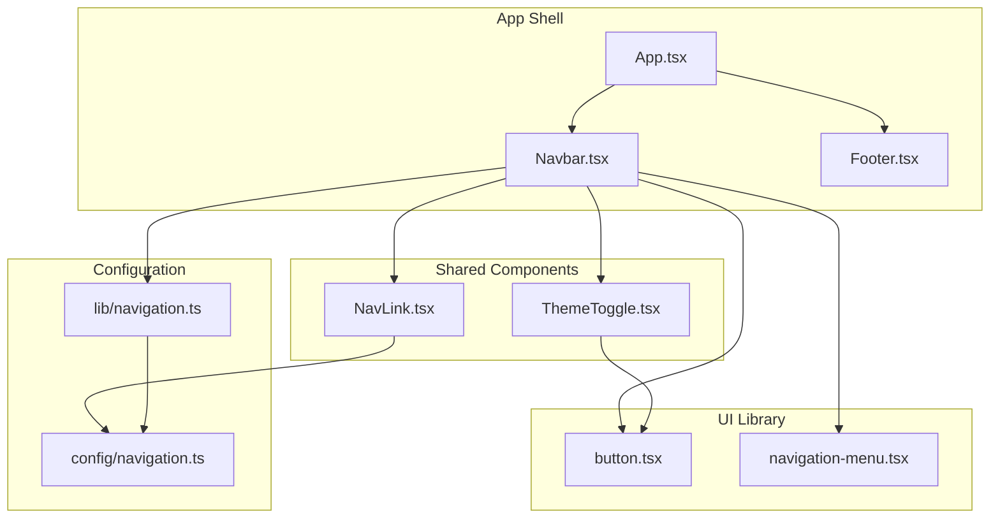
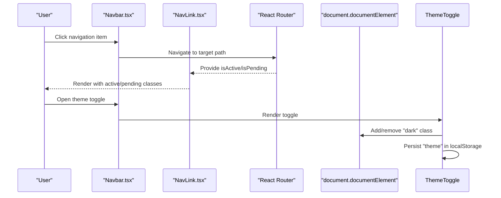
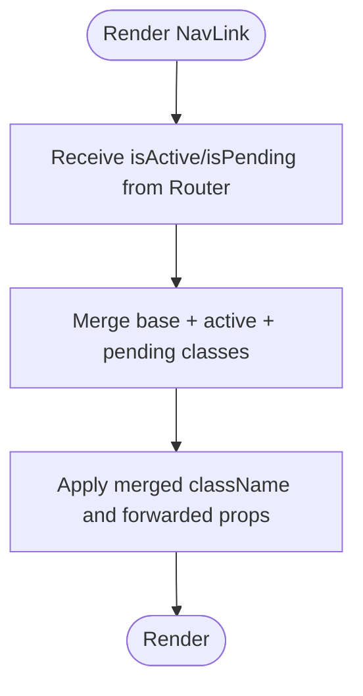
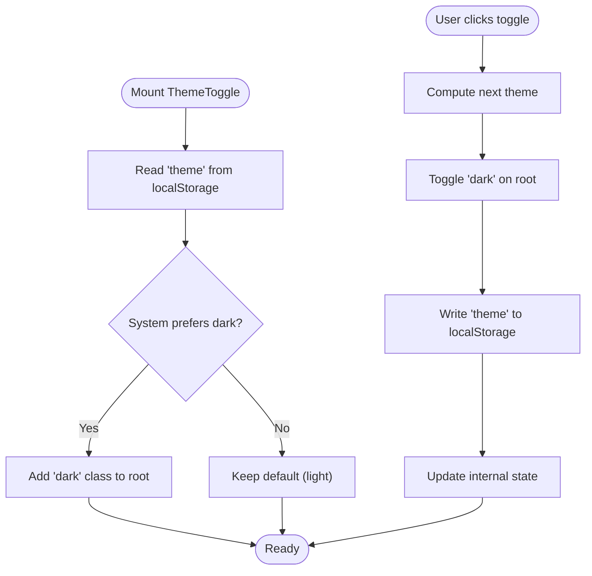
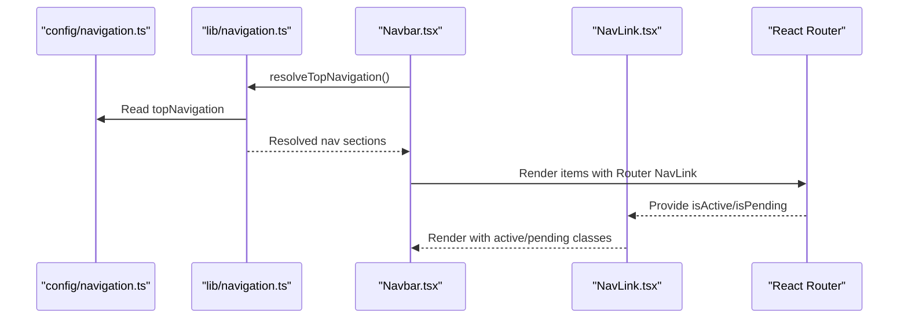
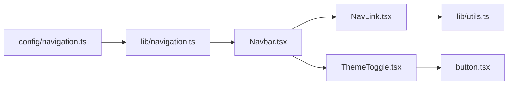

# Shared Components

<cite>
**Referenced Files in This Document**
- [src/components/shared/NavLink.tsx](file://src/components/shared/NavLink.tsx)
- [src/components/shared/ThemeToggle.tsx](file://src/components/shared/ThemeToggle.tsx)
- [src/components/ui/button.tsx](file://src/components/ui/button.tsx)
- [src/components/navigation/Navbar.tsx](file://src/components/navigation/Navbar.tsx)
- [src/components/navigation/Footer.tsx](file://src/components/navigation/Footer.tsx)
- [src/components/ui/navigation-menu.tsx](file://src/components/ui/navigation-menu.tsx)
- [src/lib/navigation.ts](file://src/lib/navigation.ts)
- [src/config/navigation.ts](file://src/config/navigation.ts)
- [src/App.tsx](file://src/App.tsx)
- [src/lib/utils.ts](file://src/lib/utils.ts)
</cite>

## Table of Contents
1. [Introduction](#introduction)
2. [Project Structure](#project-structure)
3. [Core Components](#core-components)
4. [Architecture Overview](#architecture-overview)
5. [Detailed Component Analysis](#detailed-component-analysis)
6. [Dependency Analysis](#dependency-analysis)
7. [Performance Considerations](#performance-considerations)
8. [Troubleshooting Guide](#troubleshooting-guide)
9. [Conclusion](#conclusion)
10. [Appendices](#appendices)

## Introduction
This document describes the shared components that power JSphere’s navigation and theming experience. It focuses on two reusable building blocks:
- NavLink: A router-aware link wrapper that integrates with the routing system to reflect active and pending states.
- ThemeToggle: A theme switcher that toggles between light and dark modes, persists preferences, and applies theme-aware styling.

The guide explains component props, event handlers, customization options, lifecycle behavior, performance characteristics, accessibility features, and best practices for extending these components consistently across content pillars.

## Project Structure
JSphere organizes shared components under a dedicated folder and integrates them into navigation and layout components. The routing system is powered by React Router, and theming is applied via a CSS class on the root element with persistence in localStorage.

**Diagram sources**
- [src/App.tsx:40-100](file://src/App.tsx#L40-L100)
- [src/components/navigation/Navbar.tsx:24-182](file://src/components/navigation/Navbar.tsx#L24-L182)
- [src/components/shared/NavLink.tsx:11-28](file://src/components/shared/NavLink.tsx#L11-L28)
- [src/components/shared/ThemeToggle.tsx:5-29](file://src/components/shared/ThemeToggle.tsx#L5-L29)
- [src/components/ui/button.tsx:39-47](file://src/components/ui/button.tsx#L39-L47)
- [src/components/ui/navigation-menu.tsx:8-120](file://src/components/ui/navigation-menu.tsx#L8-L120)
- [src/config/navigation.ts:62-262](file://src/config/navigation.ts#L62-L262)
- [src/lib/navigation.ts:28-73](file://src/lib/navigation.ts#L28-L73)

**Section sources**
- [src/App.tsx:40-100](file://src/App.tsx#L40-L100)
- [src/components/navigation/Navbar.tsx:24-182](file://src/components/navigation/Navbar.tsx#L24-L182)
- [src/components/shared/NavLink.tsx:11-28](file://src/components/shared/NavLink.tsx#L11-L28)
- [src/components/shared/ThemeToggle.tsx:5-29](file://src/components/shared/ThemeToggle.tsx#L5-L29)
- [src/components/ui/button.tsx:39-47](file://src/components/ui/button.tsx#L39-L47)
- [src/components/ui/navigation-menu.tsx:8-120](file://src/components/ui/navigation-menu.tsx#L8-L120)
- [src/config/navigation.ts:62-262](file://src/config/navigation.ts#L62-L262)
- [src/lib/navigation.ts:28-73](file://src/lib/navigation.ts#L28-L73)

## Core Components
This section documents the shared components and how they integrate with the routing system and theming.

- NavLink
  - Purpose: A thin wrapper around the router’s NavLink that adds active and pending state classes and forwards props.
  - Props:
    - className: Base CSS class for the link.
    - activeClassName: Additional class applied when the link is active.
    - pendingClassName: Additional class applied during navigation transitions.
    - to: Target route path.
    - ...other RouterNavLink props.
  - Behavior:
    - Uses the router’s state to compute active/pending classes.
    - Merges base and state-specific classes via a utility that merges Tailwind classes safely.
  - Accessibility: Inherits semantics from the underlying router link; ensure labels are descriptive in consuming components.

- ThemeToggle
  - Purpose: A button that toggles between light and dark themes.
  - Props: None.
  - Behavior:
    - On mount, reads localStorage or prefers-color-scheme to set initial theme.
    - Toggles a CSS class on the root element and persists preference in localStorage.
  - Accessibility: Provides an aria-label for screen readers.

**Section sources**
- [src/components/shared/NavLink.tsx:5-28](file://src/components/shared/NavLink.tsx#L5-L28)
- [src/components/shared/ThemeToggle.tsx:5-29](file://src/components/shared/ThemeToggle.tsx#L5-L29)
- [src/lib/utils.ts:4-6](file://src/lib/utils.ts#L4-L6)

## Architecture Overview
The shared components participate in the app’s navigation and theming architecture as follows:
- Navigation is configured centrally and resolved at runtime to populate the navbar and sidebar.
- NavLink participates in active state management through the router.
- ThemeToggle manages theme persistence and applies a class to the document root for downstream styling.

**Diagram sources**
- [src/components/navigation/Navbar.tsx:24-182](file://src/components/navigation/Navbar.tsx#L24-L182)
- [src/components/shared/NavLink.tsx:11-28](file://src/components/shared/NavLink.tsx#L11-L28)
- [src/components/shared/ThemeToggle.tsx:5-29](file://src/components/shared/ThemeToggle.tsx#L5-L29)

## Detailed Component Analysis

### NavLink Component
NavLink enhances the router’s NavLink with explicit active and pending state classes and forwards all other props. It composes with a utility to merge Tailwind classes safely.

- Props and customization
  - className: Base class applied regardless of state.
  - activeClassName: Applied when the route is active.
  - pendingClassName: Applied during navigation transitions.
  - to: Required route target.
  - Other props supported by the underlying router NavLink.

- Active state management
  - The component receives isActive and isPending from the router and conditionally applies classes accordingly.

- Integration with routing
  - Consuming components pass the to prop and any additional attributes (e.g., aria attributes) directly to NavLink.

- Accessibility
  - Ensure descriptive labels and roles are provided by consumers when needed.

- Lifecycle
  - Mounts once per navigation change; class updates are handled reactively by the router.

- Performance
  - Minimal overhead; relies on the router’s built-in state computation.

- Extensibility
  - Can be extended to accept additional state classes (e.g., error or disabled states) by adding new props and merging conditions.

**Diagram sources**
- [src/components/shared/NavLink.tsx:11-28](file://src/components/shared/NavLink.tsx#L11-L28)
- [src/lib/utils.ts:4-6](file://src/lib/utils.ts#L4-L6)

**Section sources**
- [src/components/shared/NavLink.tsx:5-28](file://src/components/shared/NavLink.tsx#L5-L28)
- [src/lib/utils.ts:4-6](file://src/lib/utils.ts#L4-L6)

### ThemeToggle Component
ThemeToggle controls the application theme by toggling a CSS class on the document root and persisting the choice in localStorage. It respects the user’s system preference when no explicit choice exists.

- Props and customization
  - None. The component is self-contained.

- Persistence mechanism
  - Reads "theme" from localStorage on mount; falls back to system preference if unset.
  - Writes "dark" or "light" to localStorage on each toggle.

- Theme-aware styling
  - Adds/removes the "dark" class on the root element so downstream styles can adapt.

- Accessibility
  - Includes an aria-label for assistive technologies.

- Lifecycle
  - Mount effect initializes theme based on persisted or system preference.
  - Toggle handler updates DOM class and localStorage.

- Performance
  - Very lightweight; effects run only on mount and on toggle.

- Extensibility
  - Can be extended to support additional themes or read from a context/provider for centralized state.

**Diagram sources**
- [src/components/shared/ThemeToggle.tsx:5-29](file://src/components/shared/ThemeToggle.tsx#L5-L29)

**Section sources**
- [src/components/shared/ThemeToggle.tsx:5-29](file://src/components/shared/ThemeToggle.tsx#L5-L29)

### Integration with Navigation System
NavLink is used extensively in the Navbar to reflect active states in the top navigation. The Navbar resolves navigation configuration at runtime and renders items with appropriate status indicators.

- Active state integration
  - The Navbar uses the router’s NavLink to render items; NavLink applies active classes based on the current route.

- Status resolution
  - The navigation resolver marks items as available or coming-soon based on content availability.

- Accessibility and UX
  - The Navbar provides keyboard-accessible navigation menus and responsive behavior.

**Diagram sources**
- [src/config/navigation.ts:62-262](file://src/config/navigation.ts#L62-L262)
- [src/lib/navigation.ts:28-73](file://src/lib/navigation.ts#L28-L73)
- [src/components/navigation/Navbar.tsx:24-182](file://src/components/navigation/Navbar.tsx#L24-L182)
- [src/components/shared/NavLink.tsx:11-28](file://src/components/shared/NavLink.tsx#L11-L28)

**Section sources**
- [src/config/navigation.ts:62-262](file://src/config/navigation.ts#L62-L262)
- [src/lib/navigation.ts:28-73](file://src/lib/navigation.ts#L28-L73)
- [src/components/navigation/Navbar.tsx:24-182](file://src/components/navigation/Navbar.tsx#L24-L182)

### UI Composition Notes
- Button component
  - ThemeToggle composes a ghost-styled button with icon sizing suitable for header areas.
- Navigation menu
  - The Navbar uses a navigation menu system for desktop layouts, complementing NavLink for individual items.

**Section sources**
- [src/components/ui/button.tsx:39-47](file://src/components/ui/button.tsx#L39-L47)
- [src/components/ui/navigation-menu.tsx:8-120](file://src/components/ui/navigation-menu.tsx#L8-L120)

## Dependency Analysis
The shared components depend on:
- Router for active/pending state and navigation.
- UI primitives for consistent styling.
- Utilities for safe class merging.
- Configuration and resolver modules for navigation data.

**Diagram sources**
- [src/config/navigation.ts:62-262](file://src/config/navigation.ts#L62-L262)
- [src/lib/navigation.ts:28-73](file://src/lib/navigation.ts#L28-L73)
- [src/components/navigation/Navbar.tsx:24-182](file://src/components/navigation/Navbar.tsx#L24-L182)
- [src/components/shared/NavLink.tsx:11-28](file://src/components/shared/NavLink.tsx#L11-L28)
- [src/components/shared/ThemeToggle.tsx:5-29](file://src/components/shared/ThemeToggle.tsx#L5-L29)
- [src/components/ui/button.tsx:39-47](file://src/components/ui/button.tsx#L39-L47)
- [src/lib/utils.ts:4-6](file://src/lib/utils.ts#L4-L6)

**Section sources**
- [src/config/navigation.ts:62-262](file://src/config/navigation.ts#L62-L262)
- [src/lib/navigation.ts:28-73](file://src/lib/navigation.ts#L28-L73)
- [src/components/navigation/Navbar.tsx:24-182](file://src/components/navigation/Navbar.tsx#L24-L182)
- [src/components/shared/NavLink.tsx:11-28](file://src/components/shared/NavLink.tsx#L11-L28)
- [src/components/shared/ThemeToggle.tsx:5-29](file://src/components/shared/ThemeToggle.tsx#L5-L29)
- [src/components/ui/button.tsx:39-47](file://src/components/ui/button.tsx#L39-L47)
- [src/lib/utils.ts:4-6](file://src/lib/utils.ts#L4-L6)

## Performance Considerations
- NavLink
  - Uses the router’s built-in state computation; avoid heavy computations inside className functions.
  - Prefer concise class names and rely on the utility for merging to minimize reflows.
- ThemeToggle
  - Single DOM class toggle and a localStorage write per click; negligible cost.
  - Initialization runs once on mount; keep side effects minimal.
- General
  - Keep shared components stateless where possible to reduce re-renders.
  - Use memoization for derived data (e.g., resolved navigation) when appropriate.

## Troubleshooting Guide
- NavLink does not show active state
  - Ensure the to prop matches the current route exactly.
  - Verify that the page is rendered within the Router context.
  - Confirm that activeClassName and pendingClassName are defined appropriately.
- ThemeToggle does not persist
  - Check that localStorage is enabled and accessible.
  - Confirm that the root element exists and accepts the "dark" class.
- ThemeToggle does not reflect system preference
  - Verify the media query behavior and that no prior "theme" value overrides it.
- Accessibility issues
  - Provide meaningful aria-labels and roles for interactive elements.
  - Ensure keyboard navigation works in navigation menus.

## Conclusion
NavLink and ThemeToggle are small, focused, and highly reusable components that integrate seamlessly with the routing and theming systems. They provide consistent behavior across content pillars, with clear extension points for future enhancements.

## Appendices

### Props and Options Summary
- NavLink
  - className: string
  - activeClassName: string
  - pendingClassName: string
  - to: string
  - ...other RouterNavLink props
- ThemeToggle
  - No props

### Usage Examples (paths)
- Using NavLink in Navbar:
  - [src/components/navigation/Navbar.tsx:64-74](file://src/components/navigation/Navbar.tsx#L64-L74)
  - [src/components/navigation/Navbar.tsx:149-156](file://src/components/navigation/Navbar.tsx#L149-L156)
- Using ThemeToggle in Navbar:
  - [src/components/navigation/Navbar.tsx:117](file://src/components/navigation/Navbar.tsx#L117)
- Button used by ThemeToggle:
  - [src/components/ui/button.tsx:39-47](file://src/components/ui/button.tsx#L39-L47)