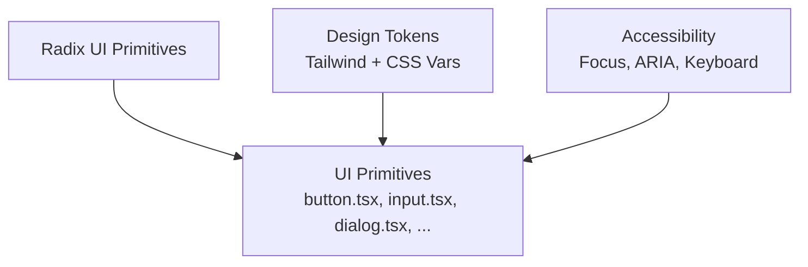
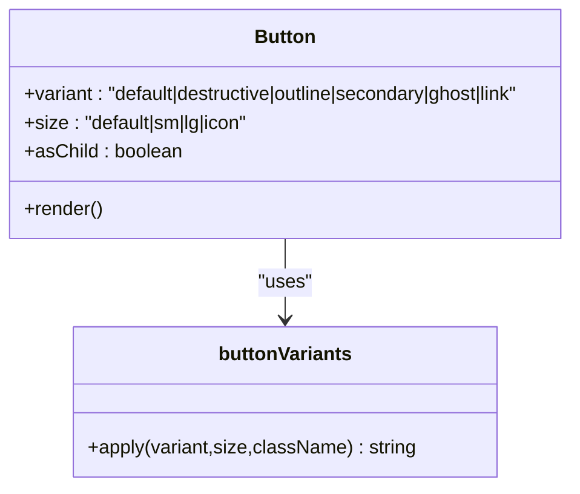
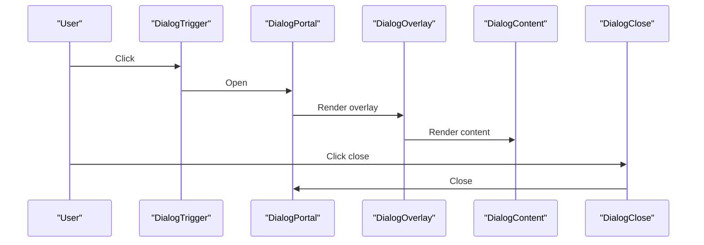
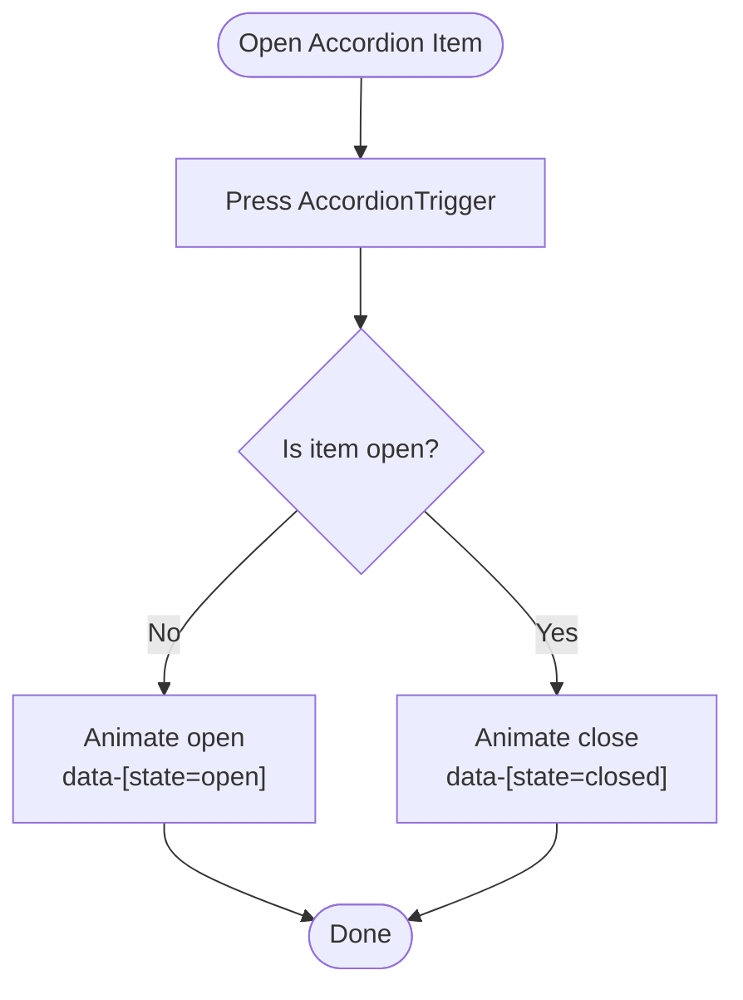
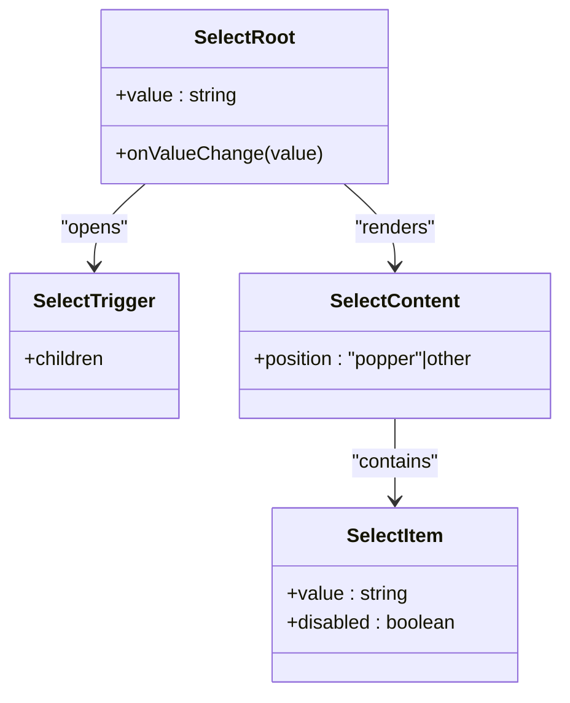
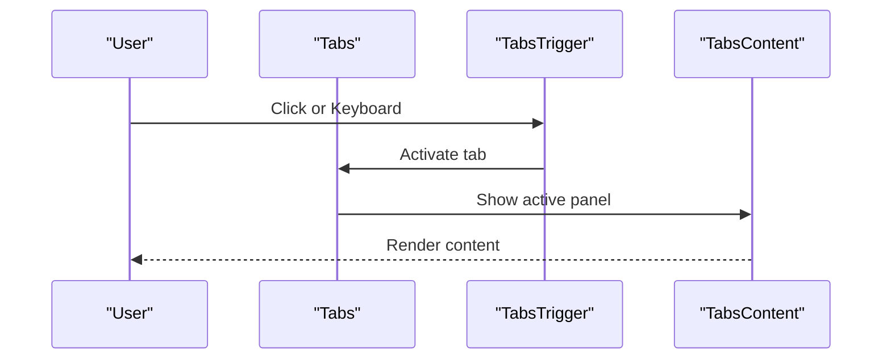
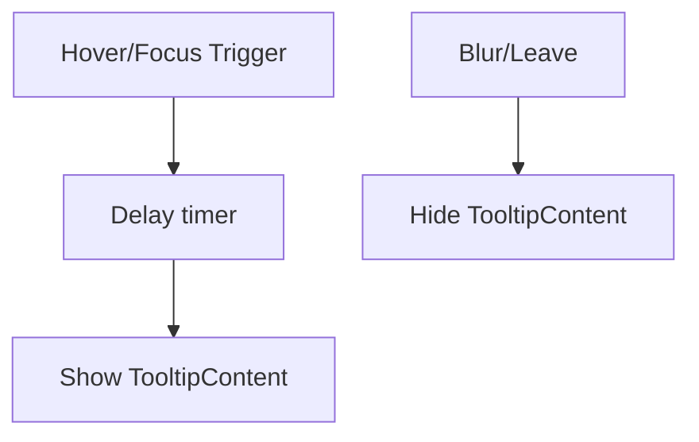
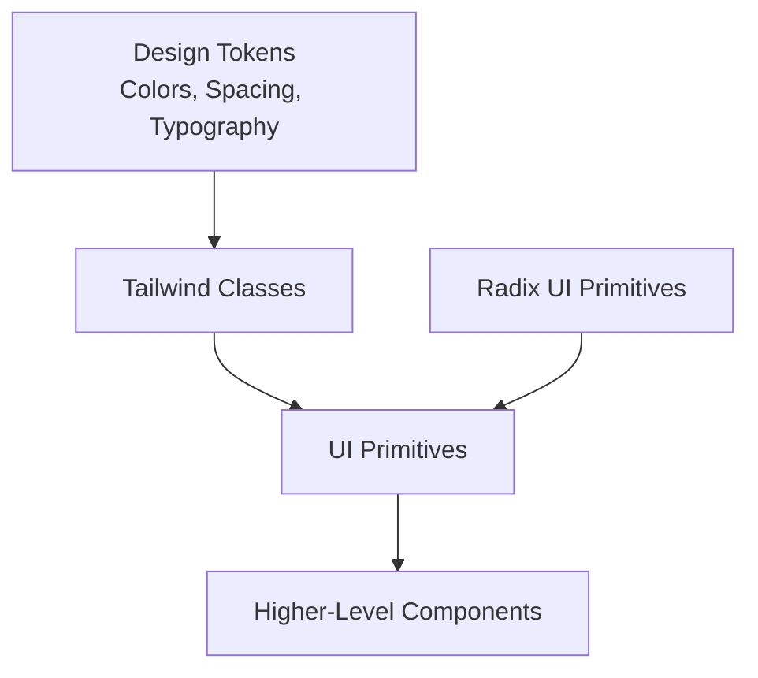
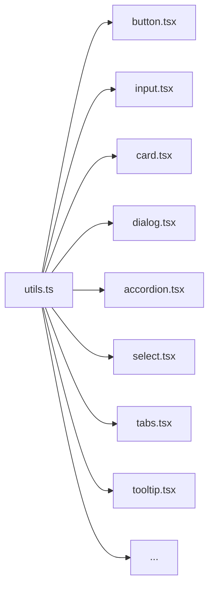

# UI Primitives

<cite>
**Referenced Files in This Document**
- [button.tsx](file://src/components/ui/button.tsx)
- [input.tsx](file://src/components/ui/input.tsx)
- [card.tsx](file://src/components/ui/card.tsx)
- [dialog.tsx](file://src/components/ui/dialog.tsx)
- [accordion.tsx](file://src/components/ui/accordion.tsx)
- [badge.tsx](file://src/components/ui/badge.tsx)
- [avatar.tsx](file://src/components/ui/avatar.tsx)
- [checkbox.tsx](file://src/components/ui/checkbox.tsx)
- [switch.tsx](file://src/components/ui/switch.tsx)
- [tabs.tsx](file://src/components/ui/tabs.tsx)
- [select.tsx](file://src/components/ui/select.tsx)
- [textarea.tsx](file://src/components/ui/textarea.tsx)
- [slider.tsx](file://src/components/ui/slider.tsx)
- [radio-group.tsx](file://src/components/ui/radio-group.tsx)
- [tooltip.tsx](file://src/components/ui/tooltip.tsx)
- [form.tsx](file://src/components/ui/form.tsx)
- [label.tsx](file://src/components/ui/label.tsx)
- [navigation-menu.tsx](file://src/components/ui/navigation-menu.tsx)
- [menubar.tsx](file://src/components/ui/menubar.tsx)
- [pagination.tsx](file://src/components/ui/pagination.tsx)
- [popover.tsx](file://src/components/ui/popover.tsx)
- [progress.tsx](file://src/components/ui/progress.tsx)
- [resizable.tsx](file://src/components/ui/resizable.tsx)
- [scroll-area.tsx](file://src/components/ui/scroll-area.tsx)
- [separator.tsx](file://src/components/ui/separator.tsx)
- [sheet.tsx](file://src/components/ui/sheet.tsx)
- [sidebar.tsx](file://src/components/ui/sidebar.tsx)
- [skeleton.tsx](file://src/components/ui/skeleton.tsx)
- [table.tsx](file://src/components/ui/table.tsx)
- [toggle.tsx](file://src/components/ui/toggle.tsx)
- [toggle-group.tsx](file://src/components/ui/toggle-group.tsx)
- [toast.tsx](file://src/components/ui/toast.tsx)
- [toaster.tsx](file://src/components/ui/toaster.tsx)
- [use-toast.ts](file://src/components/ui/use-toast.ts)
- [calendar.tsx](file://src/components/ui/calendar.tsx)
- [carousel.tsx](file://src/components/ui/carousel.tsx)
- [chart.tsx](file://src/components/ui/chart.tsx)
- [context-menu.tsx](file://src/components/ui/context-menu.tsx)
- [drawer.tsx](file://src/components/ui/drawer.tsx)
- [hover-card.tsx](file://src/components/ui/hover-card.tsx)
- [input-otp.tsx](file://src/components/ui/input-otp.tsx)
- [breadcrumb.tsx](file://src/components/ui/breadcrumb.tsx)
- [aspect-ratio.tsx](file://src/components/ui/aspect-ratio.tsx)
- [sonner.tsx](file://src/components/ui/sonner.tsx)
- [alert.tsx](file://src/components/ui/alert.tsx)
- [alert-dialog.tsx](file://src/components/ui/alert-dialog.tsx)
- [utils.ts](file://src/lib/utils.ts)
- [tailwind.config.ts](file://tailwind.config.ts)
- [index.css](file://src/index.css)
</cite>

## Table of Contents
1. [Introduction](#introduction)
2. [Project Structure](#project-structure)
3. [Core Components](#core-components)
4. [Architecture Overview](#architecture-overview)
5. [Detailed Component Analysis](#detailed-component-analysis)
6. [Dependency Analysis](#dependency-analysis)
7. [Performance Considerations](#performance-considerations)
8. [Troubleshooting Guide](#troubleshooting-guide)
9. [Conclusion](#conclusion)
10. [Appendices](#appendices)

## Introduction
This document describes JSphere’s UI primitives foundation built on Radix UI and the shadcn/ui design system. It covers the complete set of primitives (buttons, inputs, cards, dialogs, accordions, and more), the design token system, styling via Tailwind CSS, accessibility features inherited from Radix UI, usage patterns, composition strategies, customization and theming, and guidance for extending primitives consistently.

## Project Structure
JSphere organizes UI primitives under a single directory and composes them into higher-level components. Each primitive is a small, focused React component that wraps a Radix UI primitive and applies consistent Tailwind styles and design tokens.

```mermaid
graph TB
subgraph "UI Primitives"
BTN["button.tsx"]
INP["input.tsx"]
CARD["card.tsx"]
DLG["dialog.tsx"]
ACC["accordion.tsx"]
BADGE["badge.tsx"]
AVA["avatar.tsx"]
CB["checkbox.tsx"]
SW["switch.tsx"]
TABS["tabs.tsx"]
SEL["select.tsx"]
TXT["textarea.tsx"]
SLIDER["slider.tsx"]
RG["radio-group.tsx"]
TOOLTIP["tooltip.tsx"]
FORM["form.tsx"]
LABEL["label.tsx"]
NAVM["navigation-menu.tsx"]
MEBAR["menubar.tsx"]
PAG["pagination.tsx"]
POP["popover.tsx"]
PROG["progress.tsx"]
RES["resizable.tsx"]
SCROLL["scroll-area.tsx"]
SEP["separator.tsx"]
SHEET["sheet.tsx"]
SB["sidebar.tsx"]
SKEL["skeleton.tsx"]
TBL["table.tsx"]
TG["toggle.tsx"]
TGG["toggle-group.tsx"]
TOAST["toast.tsx"]
TOASTER["toaster.tsx"]
USE_T["use-toast.ts"]
CALENDAR["calendar.tsx"]
CAROUSEL["carousel.tsx"]
CHART["chart.tsx"]
CMENU["context-menu.tsx"]
DRAWER["drawer.tsx"]
HCARD["hover-card.tsx"]
OTP["input-otp.tsx"]
BREAD["breadcrumb.tsx"]
ASPECT["aspect-ratio.tsx"]
SONNER["sonner.tsx"]
ALERT["alert.tsx"]
ADLG["alert-dialog.tsx"]
end
UTILS["utils.ts"]
TWCFG["tailwind.config.ts"]
CSS["index.css"]
BTN --> UTILS
INP --> UTILS
CARD --> UTILS
DLG --> UTILS
ACC --> UTILS
BADGE --> UTILS
AVA --> UTILS
CB --> UTILS
SW --> UTILS
TABS --> UTILS
SEL --> UTILS
TXT --> UTILS
SLIDER --> UTILS
RG --> UTILS
TOOLTIP --> UTILS
FORM --> UTILS
LABEL --> UTILS
NAVM --> UTILS
MEBAR --> UTILS
PAG --> UTILS
POP --> UTILS
PROG --> UTILS
RES --> UTILS
SCROLL --> UTILS
SEP --> UTILS
SHEET --> UTILS
SB --> UTILS
SKEL --> UTILS
TBL --> UTILS
TG --> UTILS
TGG --> UTILS
TOAST --> UTILS
TOASTER --> UTILS
USE_T --> UTILS
CALENDAR --> UTILS
CAROUSEL --> UTILS
CHART --> UTILS
CMENU --> UTILS
DRAWER --> UTILS
HCARD --> UTILS
OTP --> UTILS
BREAD --> UTILS
ASPECT --> UTILS
SONNER --> UTILS
ALERT --> UTILS
ADLG --> UTILS
UTILS --> CSS
UTILS --> TWCFG
```

**Diagram sources**
- [button.tsx:1-48](file://src/components/ui/button.tsx#L1-L48)
- [input.tsx:1-23](file://src/components/ui/input.tsx#L1-L23)
- [card.tsx:1-44](file://src/components/ui/card.tsx#L1-L44)
- [dialog.tsx:1-96](file://src/components/ui/dialog.tsx#L1-L96)
- [accordion.tsx:1-53](file://src/components/ui/accordion.tsx#L1-L53)
- [badge.tsx:1-30](file://src/components/ui/badge.tsx#L1-L30)
- [avatar.tsx:1-39](file://src/components/ui/avatar.tsx#L1-L39)
- [checkbox.tsx:1-27](file://src/components/ui/checkbox.tsx#L1-L27)
- [switch.tsx:1-28](file://src/components/ui/switch.tsx#L1-L28)
- [tabs.tsx:1-54](file://src/components/ui/tabs.tsx#L1-L54)
- [select.tsx:1-144](file://src/components/ui/select.tsx#L1-L144)
- [textarea.tsx:1-22](file://src/components/ui/textarea.tsx#L1-L22)
- [slider.tsx:1-24](file://src/components/ui/slider.tsx#L1-L24)
- [radio-group.tsx:1-37](file://src/components/ui/radio-group.tsx#L1-L37)
- [tooltip.tsx:1-29](file://src/components/ui/tooltip.tsx#L1-L29)
- [form.tsx](file://src/components/ui/form.tsx)
- [label.tsx](file://src/components/ui/label.tsx)
- [navigation-menu.tsx](file://src/components/ui/navigation-menu.tsx)
- [menubar.tsx](file://src/components/ui/menubar.tsx)
- [pagination.tsx](file://src/components/ui/pagination.tsx)
- [popover.tsx](file://src/components/ui/popover.tsx)
- [progress.tsx](file://src/components/ui/progress.tsx)
- [resizable.tsx](file://src/components/ui/resizable.tsx)
- [scroll-area.tsx](file://src/components/ui/scroll-area.tsx)
- [separator.tsx](file://src/components/ui/separator.tsx)
- [sheet.tsx](file://src/components/ui/sheet.tsx)
- [sidebar.tsx](file://src/components/ui/sidebar.tsx)
- [skeleton.tsx](file://src/components/ui/skeleton.tsx)
- [table.tsx](file://src/components/ui/table.tsx)
- [toggle.tsx](file://src/components/ui/toggle.tsx)
- [toggle-group.tsx](file://src/components/ui/toggle-group.tsx)
- [toast.tsx](file://src/components/ui/toast.tsx)
- [toaster.tsx](file://src/components/ui/toaster.tsx)
- [use-toast.ts](file://src/components/ui/use-toast.ts)
- [calendar.tsx](file://src/components/ui/calendar.tsx)
- [carousel.tsx](file://src/components/ui/carousel.tsx)
- [chart.tsx](file://src/components/ui/chart.tsx)
- [context-menu.tsx](file://src/components/ui/context-menu.tsx)
- [drawer.tsx](file://src/components/ui/drawer.tsx)
- [hover-card.tsx](file://src/components/ui/hover-card.tsx)
- [input-otp.tsx](file://src/components/ui/input-otp.tsx)
- [breadcrumb.tsx](file://src/components/ui/breadcrumb.tsx)
- [aspect-ratio.tsx](file://src/components/ui/aspect-ratio.tsx)
- [sonner.tsx](file://src/components/ui/sonner.tsx)
- [alert.tsx](file://src/components/ui/alert.tsx)
- [alert-dialog.tsx](file://src/components/ui/alert-dialog.tsx)
- [utils.ts](file://src/lib/utils.ts)
- [tailwind.config.ts](file://tailwind.config.ts)
- [index.css](file://src/index.css)

**Section sources**
- [button.tsx:1-48](file://src/components/ui/button.tsx#L1-L48)
- [input.tsx:1-23](file://src/components/ui/input.tsx#L1-L23)
- [card.tsx:1-44](file://src/components/ui/card.tsx#L1-L44)
- [dialog.tsx:1-96](file://src/components/ui/dialog.tsx#L1-L96)
- [accordion.tsx:1-53](file://src/components/ui/accordion.tsx#L1-L53)
- [badge.tsx:1-30](file://src/components/ui/badge.tsx#L1-L30)
- [avatar.tsx:1-39](file://src/components/ui/avatar.tsx#L1-L39)
- [checkbox.tsx:1-27](file://src/components/ui/checkbox.tsx#L1-L27)
- [switch.tsx:1-28](file://src/components/ui/switch.tsx#L1-L28)
- [tabs.tsx:1-54](file://src/components/ui/tabs.tsx#L1-L54)
- [select.tsx:1-144](file://src/components/ui/select.tsx#L1-L144)
- [textarea.tsx:1-22](file://src/components/ui/textarea.tsx#L1-L22)
- [slider.tsx:1-24](file://src/components/ui/slider.tsx#L1-L24)
- [radio-group.tsx:1-37](file://src/components/ui/radio-group.tsx#L1-L37)
- [tooltip.tsx:1-29](file://src/components/ui/tooltip.tsx#L1-L29)
- [utils.ts](file://src/lib/utils.ts)

## Core Components
This section documents the foundational primitives and their props, variants, sizes, and styling approaches.

- Button
  - Props: variant, size, asChild, and standard button attributes.
  - Variants: default, destructive, outline, secondary, ghost, link.
  - Sizes: default, sm, lg, icon.
  - Styling: class variance authority (CVA) with Tailwind classes; supports slot composition.
  - Accessibility: inherits Radix focus styles and keyboard behavior.
  - Example snippet path: [button.tsx:33-47](file://src/components/ui/button.tsx#L33-L47)

- Input
  - Props: type, and standard input attributes.
  - Styling: consistent border, background, focus ring, disabled states.
  - Accessibility: standard input semantics.
  - Example snippet path: [input.tsx:5-22](file://src/components/ui/input.tsx#L5-L22)

- Card
  - Parts: Card, CardHeader, CardTitle, CardDescription, CardContent, CardFooter.
  - Styling: border, background, shadow; spacing and typography helpers.
  - Accessibility: semantic grouping via divs and headings.
  - Example snippet path: [card.tsx:5-43](file://src/components/ui/card.tsx#L5-L43)

- Dialog
  - Parts: Root, Portal, Overlay, Close, Trigger, Content, Header, Footer, Title, Description.
  - Animations: fade/zoom/slide transitions keyed by open state.
  - Accessibility: focus trapping, ARIA roles, escape-to-close, screen-reader labels.
  - Example snippet path: [dialog.tsx:7-95](file://src/components/ui/dialog.tsx#L7-L95)

- Accordion
  - Parts: Root, Item, Trigger, Content.
  - Behavior: controlled open/close with animated height changes.
  - Accessibility: aria-expanded, keyboard navigation (Enter/Space, Arrow keys).
  - Example snippet path: [accordion.tsx:7-52](file://src/components/ui/accordion.tsx#L7-L52)

- Badge
  - Props: variant, and standard HTML attributes.
  - Variants: default, secondary, destructive, outline.
  - Styling: CVA with border and color tokens.
  - Example snippet path: [badge.tsx:6-29](file://src/components/ui/badge.tsx#L6-L29)

- Avatar
  - Parts: Root, Image, Fallback.
  - Styling: rounded-full container, fallback background.
  - Accessibility: alt text via image element.
  - Example snippet path: [avatar.tsx:6-38](file://src/components/ui/avatar.tsx#L6-L38)

- Checkbox
  - Props: checked, onCheckedChange, and standard input attributes.
  - Styling: indicator with check mark; focus ring and disabled states.
  - Accessibility: native semantics with Radix state attributes.
  - Example snippet path: [checkbox.tsx:7-26](file://src/components/ui/checkbox.tsx#L7-L26)

- Switch
  - Props: checked, onCheckedChange, and standard input attributes.
  - Styling: thumb translation; focus ring and disabled states.
  - Accessibility: native semantics with Radix state attributes.
  - Example snippet path: [switch.tsx:6-27](file://src/components/ui/switch.tsx#L6-L27)

- Tabs
  - Parts: Root, List, Trigger, Content.
  - Styling: active state indicators; focus ring and disabled states.
  - Accessibility: aria-controls, aria-selected, keyboard navigation.
  - Example snippet path: [tabs.tsx:8-53](file://src/components/ui/tabs.tsx#L8-L53)

- Select
  - Parts: Root, Group, Value, Trigger, Content, Label, Item, Separator, ScrollUp/Down Buttons.
  - Behavior: portal overlay, viewport sizing, scrolling, selection indicators.
  - Accessibility: aria-expanded, role="listbox", keyboard navigation.
  - Example snippet path: [select.tsx:13-143](file://src/components/ui/select.tsx#L13-L143)

- Textarea
  - Props: rows, cols, and standard textarea attributes.
  - Styling: consistent padding, border, focus ring, disabled states.
  - Accessibility: standard textarea semantics.
  - Example snippet path: [textarea.tsx:7-21](file://src/components/ui/textarea.tsx#L7-L21)

- Slider
  - Props: value, onValueChange, min, max, step, and standard input attributes.
  - Styling: track and range; thumb focus ring and disabled states.
  - Accessibility: native semantics with Radix state attributes.
  - Example snippet path: [slider.tsx:6-23](file://src/components/ui/slider.tsx#L6-L23)

- RadioGroup
  - Parts: Root, Item.
  - Behavior: mutually exclusive selection; indicator dot.
  - Accessibility: native semantics with Radix state attributes.
  - Example snippet path: [radio-group.tsx:7-36](file://src/components/ui/radio-group.tsx#L7-L36)

- Tooltip
  - Parts: Provider, Root, Trigger, Content.
  - Behavior: delay-based show/hide; directional animations.
  - Accessibility: aria-label on trigger; focusable content when open.
  - Example snippet path: [tooltip.tsx:6-28](file://src/components/ui/tooltip.tsx#L6-L28)

- Additional primitives (selection)
  - Form, Label, NavigationMenu, Menubar, Pagination, Popover, Progress, Resizable, ScrollArea, Separator, Sheet, Sidebar, Skeleton, Table, Toggle, ToggleGroup, Toast, Toaster, useToast, Calendar, Carousel, Chart, ContextMenu, Drawer, HoverCard, InputOTP, Breadcrumb, AspectRatio, Sonner, Alert, AlertDialog.
  - These components follow similar patterns: wrap Radix primitives, apply design tokens and Tailwind classes, expose minimal props, and inherit accessibility features from Radix UI.

**Section sources**
- [button.tsx:33-47](file://src/components/ui/button.tsx#L33-L47)
- [input.tsx:5-22](file://src/components/ui/input.tsx#L5-L22)
- [card.tsx:5-43](file://src/components/ui/card.tsx#L5-L43)
- [dialog.tsx:7-95](file://src/components/ui/dialog.tsx#L7-L95)
- [accordion.tsx:7-52](file://src/components/ui/accordion.tsx#L7-L52)
- [badge.tsx:6-29](file://src/components/ui/badge.tsx#L6-L29)
- [avatar.tsx:6-38](file://src/components/ui/avatar.tsx#L6-L38)
- [checkbox.tsx:7-26](file://src/components/ui/checkbox.tsx#L7-L26)
- [switch.tsx:6-27](file://src/components/ui/switch.tsx#L6-L27)
- [tabs.tsx:8-53](file://src/components/ui/tabs.tsx#L8-L53)
- [select.tsx:13-143](file://src/components/ui/select.tsx#L13-L143)
- [textarea.tsx:7-21](file://src/components/ui/textarea.tsx#L7-L21)
- [slider.tsx:6-23](file://src/components/ui/slider.tsx#L6-L23)
- [radio-group.tsx:7-36](file://src/components/ui/radio-group.tsx#L7-L36)
- [tooltip.tsx:6-28](file://src/components/ui/tooltip.tsx#L6-L28)

## Architecture Overview
JSphere’s UI primitives layer is a thin wrapper around Radix UI primitives. Each primitive:
- Uses a consistent design token system (colors, shadows, spacing).
- Applies Tailwind utility classes for layout and appearance.
- Exposes a minimal prop surface aligned with the design system.
- Inherits accessibility features from Radix UI (focus management, ARIA attributes, keyboard interactions).

[No sources needed since this diagram shows conceptual workflow, not actual code structure]

## Detailed Component Analysis

### Button
- Composition pattern: Uses a slot to render either a button or a child component; applies CVA variants and sizes.
- Props: variant, size, asChild, and standard button attributes.
- Accessibility: Focus ring and disabled states handled via Tailwind and Radix focus-visible styles.
- Example snippet path: [button.tsx:33-47](file://src/components/ui/button.tsx#L33-L47)

**Diagram sources**
- [button.tsx:7-31](file://src/components/ui/button.tsx#L7-L31)

**Section sources**
- [button.tsx:33-47](file://src/components/ui/button.tsx#L33-L47)

### Dialog
- Composition pattern: Root, Trigger, Portal, Overlay, Content, Close, Header/Footer, Title/Description.
- Animations: Fade/Zoom/Slide transitions keyed by open state.
- Accessibility: Focus trap, Escape-to-close, ARIA modal roles, screen-reader labels.
- Example snippet path: [dialog.tsx:7-95](file://src/components/ui/dialog.tsx#L7-L95)

**Diagram sources**
- [dialog.tsx:7-52](file://src/components/ui/dialog.tsx#L7-L52)

**Section sources**
- [dialog.tsx:7-95](file://src/components/ui/dialog.tsx#L7-L95)

### Accordion
- Composition pattern: Root, Item, Trigger with chevron icon, Content with collapse animation.
- Accessibility: aria-expanded on trigger; keyboard navigation to expand/collapse.
- Example snippet path: [accordion.tsx:7-52](file://src/components/ui/accordion.tsx#L7-L52)

**Diagram sources**
- [accordion.tsx:17-48](file://src/components/ui/accordion.tsx#L17-L48)

**Section sources**
- [accordion.tsx:7-52](file://src/components/ui/accordion.tsx#L7-L52)

### Select
- Composition pattern: Trigger opens Content portal; viewport renders Items with selection indicators.
- Accessibility: role="listbox", aria-expanded, keyboard navigation, scroll buttons.
- Example snippet path: [select.tsx:13-143](file://src/components/ui/select.tsx#L13-L143)

**Diagram sources**
- [select.tsx:7-143](file://src/components/ui/select.tsx#L7-L143)

**Section sources**
- [select.tsx:13-143](file://src/components/ui/select.tsx#L13-L143)

### Tabs
- Composition pattern: List of Triggers and associated Content panels.
- Accessibility: aria-controls, aria-selected, focus management, arrow key navigation.
- Example snippet path: [tabs.tsx:8-53](file://src/components/ui/tabs.tsx#L8-L53)

**Diagram sources**
- [tabs.tsx:23-50](file://src/components/ui/tabs.tsx#L23-L50)

**Section sources**
- [tabs.tsx:8-53](file://src/components/ui/tabs.tsx#L8-L53)

### Tooltip
- Composition pattern: Provider, Root, Trigger, Content; delay-based show/hide.
- Accessibility: aria-label on trigger; focusable content when open.
- Example snippet path: [tooltip.tsx:6-28](file://src/components/ui/tooltip.tsx#L6-L28)

**Diagram sources**
- [tooltip.tsx:12-25](file://src/components/ui/tooltip.tsx#L12-L25)

**Section sources**
- [tooltip.tsx:6-28](file://src/components/ui/tooltip.tsx#L6-L28)

### Conceptual Overview
- Design token system: Colors, typography, spacing, and shadows are applied consistently across primitives via Tailwind classes and CSS variables.
- Accessibility: All interactive primitives inherit keyboard navigation, focus management, and ARIA attributes from Radix UI.
- Composition: Higher-level components compose multiple primitives to build complex UI elements (e.g., forms, navigation menus, modals).

[No sources needed since this diagram shows conceptual workflow, not actual code structure]

[No sources needed since this section doesn't analyze specific source files]

## Dependency Analysis
- Internal dependencies:
  - All primitives depend on a shared utility for composing Tailwind classes.
  - Many primitives depend on Radix UI packages for behavior and accessibility.
- Theming and tokens:
  - Tailwind configuration defines design tokens; CSS variables can augment tokens.
- Coupling:
  - Primitives are loosely coupled; each exposes a minimal API surface.
  - Composition favors small, single-responsibility components.

**Diagram sources**
- [utils.ts](file://src/lib/utils.ts)
- [button.tsx:1-6](file://src/components/ui/button.tsx#L1-L6)
- [input.tsx:1-4](file://src/components/ui/input.tsx#L1-L4)
- [card.tsx:1-4](file://src/components/ui/card.tsx#L1-L4)
- [dialog.tsx:1-6](file://src/components/ui/dialog.tsx#L1-L6)
- [accordion.tsx:1-6](file://src/components/ui/accordion.tsx#L1-L6)
- [select.tsx:1-6](file://src/components/ui/select.tsx#L1-L6)
- [tabs.tsx:1-5](file://src/components/ui/tabs.tsx#L1-L5)
- [tooltip.tsx:1-5](file://src/components/ui/tooltip.tsx#L1-L5)

**Section sources**
- [utils.ts](file://src/lib/utils.ts)
- [button.tsx:1-6](file://src/components/ui/button.tsx#L1-L6)
- [input.tsx:1-4](file://src/components/ui/input.tsx#L1-L4)
- [card.tsx:1-4](file://src/components/ui/card.tsx#L1-L4)
- [dialog.tsx:1-6](file://src/components/ui/dialog.tsx#L1-L6)
- [accordion.tsx:1-6](file://src/components/ui/accordion.tsx#L1-L6)
- [select.tsx:1-6](file://src/components/ui/select.tsx#L1-L6)
- [tabs.tsx:1-5](file://src/components/ui/tabs.tsx#L1-L5)
- [tooltip.tsx:1-5](file://src/components/ui/tooltip.tsx#L1-L5)

## Performance Considerations
- Prefer composition over heavy internal logic: primitives keep rendering lightweight and delegate behavior to Radix UI.
- Use minimal re-renders: avoid unnecessary prop drilling; pass only required props to primitives.
- Optimize animations: leverage Radix’s built-in transitions; avoid animating large DOM subtrees inside primitives.
- Bundle size: import only the Radix primitives you use; tree-shake unused features.

[No sources needed since this section provides general guidance]

## Troubleshooting Guide
- Missing focus rings or incorrect focus styles:
  - Ensure focus-visible utilities are present in Tailwind configuration and that Radix focus-visible attributes are applied.
- Disabled states not working:
  - Verify disabled props are passed to primitives and that disabled utilities are included in Tailwind.
- Accessibility issues:
  - Confirm ARIA attributes and roles are set by Radix; test with assistive technologies.
- Animation glitches:
  - Check that portals and overlays are rendered correctly and that CSS transitions are not overridden by conflicting styles.

[No sources needed since this section provides general guidance]

## Conclusion
JSphere’s UI primitives provide a cohesive, accessible, and extensible foundation for building interfaces. By leveraging Radix UI for behavior and accessibility, and applying a consistent design token system with Tailwind, the primitives enable predictable composition and easy customization. Extending or modifying primitives should preserve their minimal APIs, maintain accessibility, and align with the established design tokens.

[No sources needed since this section summarizes without analyzing specific files]

## Appendices

### Design Token System and Theming
- Color scheme: HSL-based tokens define primary, secondary, muted, and semantic colors (e.g., destructive). Unique accent colors can be mapped per content pillar via theme overrides.
- Typography: Consistent font weights, sizes, and line heights across primitives.
- Spacing and shadows: Uniform padding, margins, and border radius tokens.
- Tailwind integration: Tailwind configuration maps tokens to utility classes; CSS variables can override tokens at runtime for theming.

**Section sources**
- [tailwind.config.ts](file://tailwind.config.ts)
- [index.css](file://src/index.css)

### Accessibility Features Inherited from Radix UI
- Keyboard navigation: Arrow keys, Enter/Space, Tab/Shift+Tab for focus management.
- Screen reader support: ARIA roles and live regions where applicable.
- Focus management: Auto-focus behavior and focus traps in dialogs/modals.
- State attributes: data-[state=open], data-[state=closed], data-[disabled], data-[checked], etc.

**Section sources**
- [dialog.tsx:15-52](file://src/components/ui/dialog.tsx#L15-L52)
- [accordion.tsx:17-48](file://src/components/ui/accordion.tsx#L17-L48)
- [select.tsx:61-91](file://src/components/ui/select.tsx#L61-L91)
- [tabs.tsx:23-50](file://src/components/ui/tabs.tsx#L23-L50)
- [tooltip.tsx:12-25](file://src/components/ui/tooltip.tsx#L12-L25)

### Responsive Design Patterns
- Use responsive utilities (e.g., sm:, md:, lg:) to adapt primitives for different breakpoints.
- Prefer fluid layouts with padding and margin tokens that scale across devices.
- Test interactive primitives (dialogs, selects, tooltips) across screen sizes for proper positioning and readability.

**Section sources**
- [button.tsx:8-31](file://src/components/ui/button.tsx#L8-L31)
- [input.tsx:10-16](file://src/components/ui/input.tsx#L10-L16)
- [dialog.tsx:36-50](file://src/components/ui/dialog.tsx#L36-L50)
- [select.tsx:61-89](file://src/components/ui/select.tsx#L61-L89)

### Extending Primitives While Maintaining Consistency
- Keep the prop surface minimal; favor composition over adding new props.
- Preserve Radix behavior and accessibility semantics.
- Apply design tokens consistently; avoid hardcoding colors or spacing.
- Add variants via CVA when appropriate; document defaults and overrides.
- Provide clear snippet paths for usage examples to guide adoption.

**Section sources**
- [button.tsx:7-31](file://src/components/ui/button.tsx#L7-L31)
- [badge.tsx:6-21](file://src/components/ui/badge.tsx#L6-L21)
- [select.tsx:13-31](file://src/components/ui/select.tsx#L13-L31)