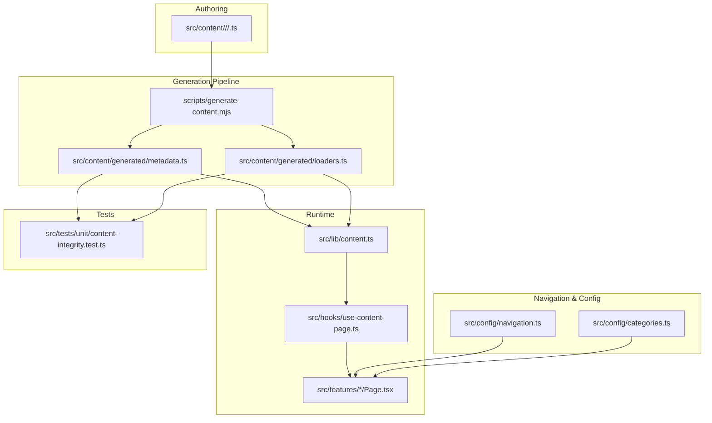
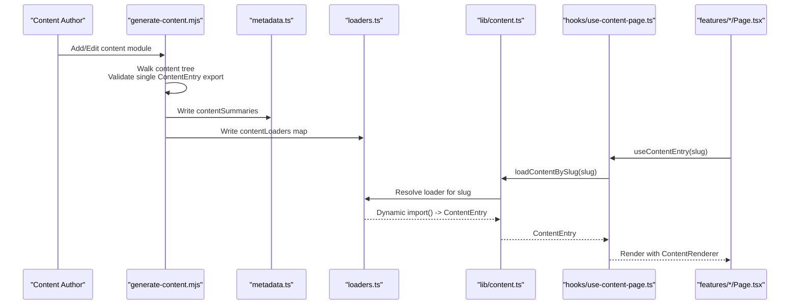
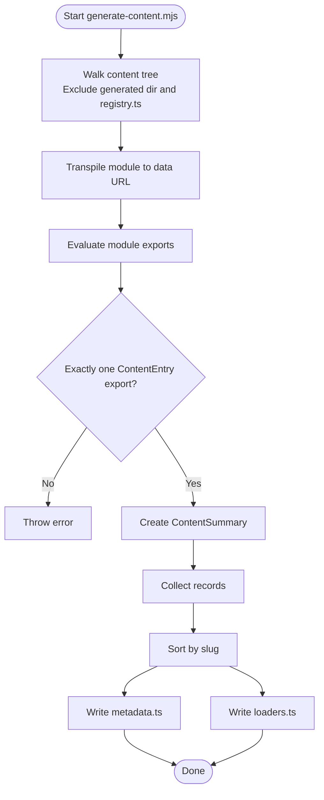
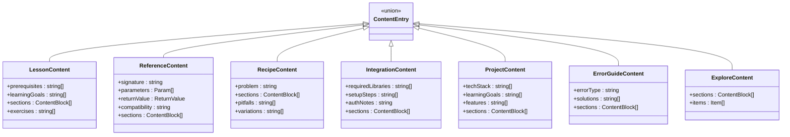
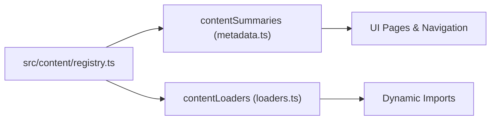
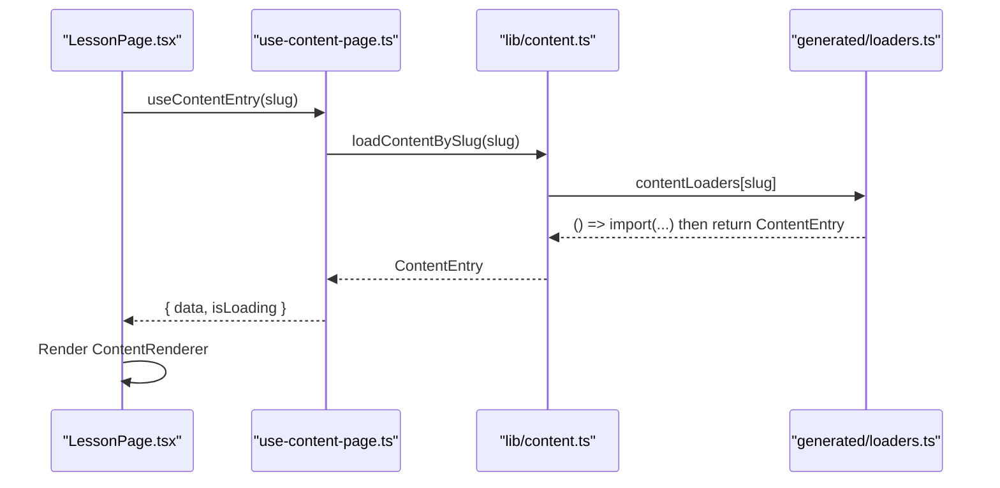
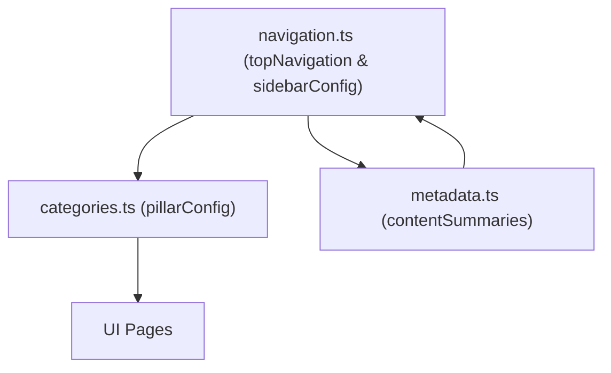
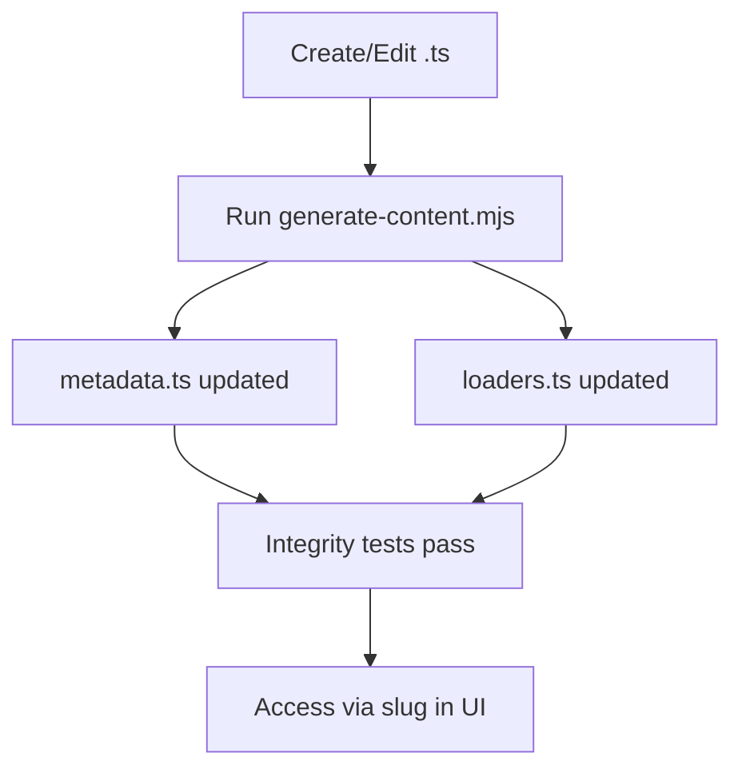
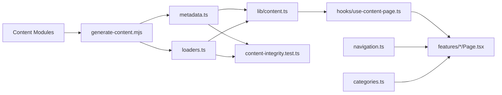

# Content Architecture

<cite>
**Referenced Files in This Document**
- [generate-content.mjs](file://scripts/generate-content.mjs)
- [registry.ts](file://src/content/registry.ts)
- [content.ts](file://src/types/content.ts)
- [content.ts](file://src/lib/content.ts)
- [use-content-page.ts](file://src/hooks/use-content-page.ts)
- [metadata.ts](file://src/content/generated/metadata.ts)
- [loaders.ts](file://src/content/generated/loaders.ts)
- [variables.ts](file://src/content/learn/fundamentals/variables.ts)
- [map.ts](file://src/content/reference/array/map.ts)
- [debouncing.ts](file://src/content/recipes/debouncing.ts)
- [content-integrity.test.ts](file://src/tests/unit/content-integrity.test.ts)
- [LessonPage.tsx](file://src/features/learn/LessonPage.tsx)
- [ReferencePage.tsx](file://src/features/reference/ReferencePage.tsx)
- [categories.ts](file://src/config/categories.ts)
- [navigation.ts](file://src/config/navigation.ts)
</cite>

## Table of Contents
1. [Introduction](#introduction)
2. [Project Structure](#project-structure)
3. [Core Components](#core-components)
4. [Architecture Overview](#architecture-overview)
5. [Detailed Component Analysis](#detailed-component-analysis)
6. [Dependency Analysis](#dependency-analysis)
7. [Performance Considerations](#performance-considerations)
8. [Troubleshooting Guide](#troubleshooting-guide)
9. [Conclusion](#conclusion)
10. [Appendices](#appendices)

## Introduction
This document explains the content architecture of JSphere, an educational platform built around a dynamic content management system. The platform loads all content at runtime rather than compiling it statically, enabling lean bundles, route-based code splitting, and a metadata-driven content registry. The system centers on a unified ContentEntry interface that standardizes seven pillars: learn, reference, integrations, recipes, projects, explore, and errors. A generation pipeline auto-produces metadata and dynamic loaders, while integrity tests validate correctness and completeness.

## Project Structure
The content architecture spans several layers:
- Content authoring under src/content with categorized TypeScript modules
- Auto-generated artifacts under src/content/generated (metadata.ts and loaders.ts)
- Runtime content access via src/lib/content.ts
- UI pages for each pillar under src/features/*
- Navigation and category configuration under src/config/*
- Content integrity tests under src/tests/unit/*

**Diagram sources**
- [generate-content.mjs:93-152](file://scripts/generate-content.mjs#L93-L152)
- [metadata.ts:1-40](file://src/content/generated/metadata.ts#L1-L40)
- [loaders.ts:9-96](file://src/content/generated/loaders.ts#L9-L96)
- [content.ts:1-126](file://src/lib/content.ts#L1-L126)
- [use-content-page.ts:1-35](file://src/hooks/use-content-page.ts#L1-L35)
- [navigation.ts:62-262](file://src/config/navigation.ts#L62-L262)
- [categories.ts:14-89](file://src/config/categories.ts#L14-L89)
- [content-integrity.test.ts:1-107](file://src/tests/unit/content-integrity.test.ts#L1-L107)

**Section sources**
- [generate-content.mjs:93-152](file://scripts/generate-content.mjs#L93-L152)
- [metadata.ts:1-40](file://src/content/generated/metadata.ts#L1-L40)
- [loaders.ts:9-96](file://src/content/generated/loaders.ts#L9-L96)
- [content.ts:1-126](file://src/lib/content.ts#L1-L126)
- [navigation.ts:62-262](file://src/config/navigation.ts#L62-L262)
- [categories.ts:14-89](file://src/config/categories.ts#L14-L89)
- [content-integrity.test.ts:1-107](file://src/tests/unit/content-integrity.test.ts#L1-L107)

## Core Components
- Unified ContentEntry interface: A single union type that standardizes all content across seven pillars, ensuring consistent metadata, structure, and rendering.
- Content metadata: A generated array of ContentSummary entries used for discovery, filtering, and navigation.
- Dynamic loaders: A generated map of slug-to-loader functions enabling route-based code splitting and lazy loading.
- Runtime library: A content facade exposing getters, filters, and helpers for UI pages and navigation.
- Integrity tests: Automated checks validating content integrity, uniqueness, and loader correctness.

**Section sources**
- [content.ts:142](file://src/types/content.ts#L142)
- [metadata.ts:7-40](file://src/content/generated/metadata.ts#L7-L40)
- [loaders.ts:9-96](file://src/content/generated/loaders.ts#L9-L96)
- [content.ts:22-126](file://src/lib/content.ts#L22-L126)
- [content-integrity.test.ts:6-57](file://src/tests/unit/content-integrity.test.ts#L6-L57)

## Architecture Overview
The system operates on a content-first, metadata-driven model:
- Authoring: Each piece of content is authored as a TypeScript module exporting a ContentEntry variant.
- Generation: A script walks the content tree, validates exports, and produces metadata and loaders.
- Runtime: Pages request content by slug via a loader; metadata is used for navigation and filtering.
- Rendering: UI pages render content using standardized components and extracted headings.

**Diagram sources**
- [generate-content.mjs:23-152](file://scripts/generate-content.mjs#L23-L152)
- [metadata.ts:7-40](file://src/content/generated/metadata.ts#L7-L40)
- [loaders.ts:9-96](file://src/content/generated/loaders.ts#L9-L96)
- [content.ts:38-42](file://src/lib/content.ts#L38-L42)
- [use-content-page.ts:7-23](file://src/hooks/use-content-page.ts#L7-L23)
- [LessonPage.tsx:19-122](file://src/features/learn/LessonPage.tsx#L19-L122)

## Detailed Component Analysis

### Content Generation Pipeline
The pipeline scans the content directory, transpiles each module to a data URL, evaluates its exports, enforces a single ContentEntry export, and writes:
- contentSummaries: An array of normalized ContentSummary objects
- contentLoaders: A Record mapping slug to a loader that dynamic-imports the module and returns the named export

**Diagram sources**
- [generate-content.mjs:23-152](file://scripts/generate-content.mjs#L23-L152)

**Section sources**
- [generate-content.mjs:12-86](file://scripts/generate-content.mjs#L12-L86)
- [generate-content.mjs:93-152](file://scripts/generate-content.mjs#L93-L152)

### Unified ContentEntry Interface
The ContentEntry union ensures consistent metadata and structure across all content types. The types define:
- Base metadata: id, title, description, slug, pillar, category, tags, difficulty, contentType, summary, relatedTopics, order, updatedAt, readingTime, featured, keywords, aliases
- Content-specific shapes: lessons, references, recipes, integrations, projects, error guides, and explore entries
- Block-based content sections supporting paragraphs, headings, code, lists, callouts, and tables

**Diagram sources**
- [content.ts:30-142](file://src/types/content.ts#L30-L142)

**Section sources**
- [content.ts:1-169](file://src/types/content.ts#L1-L169)

### Content Registry and Discovery
The registry aggregates all content modules into a single array for centralized discovery. While the generation pipeline also builds a loaders map, the registry file consolidates imports for potential static analysis or hybrid usage.

**Diagram sources**
- [registry.ts:161-305](file://src/content/registry.ts#L161-L305)
- [metadata.ts:7-40](file://src/content/generated/metadata.ts#L7-L40)
- [loaders.ts:9-96](file://src/content/generated/loaders.ts#L9-L96)

**Section sources**
- [registry.ts:1-306](file://src/content/registry.ts#L1-L306)

### Runtime Content Loading and UI Integration
The runtime library exposes:
- Lookup functions for metadata by slug/id
- Filtering by pillar, content type, and category
- Loader resolution for dynamic imports
- Helpers for headings extraction and prev/next navigation

UI pages use a hook that:
- Requests content by slug via loadContentBySlug
- Caches and retries with React Query
- Tracks recent views and reading progress

**Diagram sources**
- [LessonPage.tsx:19-122](file://src/features/learn/LessonPage.tsx#L19-L122)
- [use-content-page.ts:7-23](file://src/hooks/use-content-page.ts#L7-L23)
- [content.ts:38-42](file://src/lib/content.ts#L38-L42)
- [loaders.ts:9-96](file://src/content/generated/loaders.ts#L9-L96)

**Section sources**
- [content.ts:22-126](file://src/lib/content.ts#L22-L126)
- [use-content-page.ts:1-35](file://src/hooks/use-content-page.ts#L1-L35)
- [LessonPage.tsx:1-123](file://src/features/learn/LessonPage.tsx#L1-L123)
- [ReferencePage.tsx:1-137](file://src/features/reference/ReferencePage.tsx#L1-L137)

### Content Categories and Navigation
Navigation and category configuration define:
- Pillar-level navigation with grouped items
- Sidebar groups per pillar
- Status resolution for availability based on generated metadata
- Top-level and sidebar navigation items mapped to content slugs

**Diagram sources**
- [navigation.ts:62-262](file://src/config/navigation.ts#L62-L262)
- [categories.ts:14-89](file://src/config/categories.ts#L14-L89)
- [metadata.ts:7-40](file://src/content/generated/metadata.ts#L7-L40)

**Section sources**
- [navigation.ts:1-531](file://src/config/navigation.ts#L1-L531)
- [categories.ts:1-90](file://src/config/categories.ts#L1-L90)

### Content Authoring Workflows
To add or update content:
- Create or edit a TypeScript module under src/content/<pillar>/<category>/<slug>.ts exporting a ContentEntry variant
- Run the generation script to update metadata.ts and loaders.ts
- Verify integrity with unit tests
- Access content via slug in UI pages or navigation

**Diagram sources**
- [generate-content.mjs:93-152](file://scripts/generate-content.mjs#L93-L152)
- [content-integrity.test.ts:49-57](file://src/tests/unit/content-integrity.test.ts#L49-L57)

**Section sources**
- [generate-content.mjs:93-152](file://scripts/generate-content.mjs#L93-L152)
- [content-integrity.test.ts:1-107](file://src/tests/unit/content-integrity.test.ts#L1-L107)

## Dependency Analysis
The system exhibits low coupling and high cohesion:
- Authoring modules depend only on the ContentEntry interface
- Generation script depends on the content tree and TypeScript compiler
- Runtime library depends on generated metadata and loaders
- UI pages depend on runtime library and navigation configuration
- Tests depend on generated metadata and loaders

**Diagram sources**
- [generate-content.mjs:93-152](file://scripts/generate-content.mjs#L93-L152)
- [metadata.ts:7-40](file://src/content/generated/metadata.ts#L7-L40)
- [loaders.ts:9-96](file://src/content/generated/loaders.ts#L9-L96)
- [content.ts:1-126](file://src/lib/content.ts#L1-L126)
- [use-content-page.ts:1-35](file://src/hooks/use-content-page.ts#L1-L35)
- [navigation.ts:62-262](file://src/config/navigation.ts#L62-L262)
- [categories.ts:14-89](file://src/config/categories.ts#L14-L89)
- [content-integrity.test.ts:1-107](file://src/tests/unit/content-integrity.test.ts#L1-L107)

**Section sources**
- [generate-content.mjs:93-152](file://scripts/generate-content.mjs#L93-L152)
- [content.ts:1-126](file://src/lib/content.ts#L1-L126)
- [navigation.ts:62-262](file://src/config/navigation.ts#L62-L262)
- [categories.ts:14-89](file://src/config/categories.ts#L14-L89)
- [content-integrity.test.ts:1-107](file://src/tests/unit/content-integrity.test.ts#L1-L107)

## Performance Considerations
- Route-based code splitting: Loaders map enables dynamic imports per slug, minimizing initial bundle size.
- Metadata caching: The runtime library caches metadata lookups for fast retrieval.
- Query caching: The content hook leverages React Query with retry and staleTime to reduce redundant loads.
- Lean bundles: Only requested content modules are fetched, avoiding monolithic compilation.

[No sources needed since this section provides general guidance]

## Troubleshooting Guide
Common issues and resolutions:
- Missing or invalid ContentEntry export: The generation script enforces exactly one ContentEntry export per module; verify the module exports the correct named export.
- Slug conflicts: Integrity tests enforce unique ids and slugs; ensure each content module has a unique slug.
- Broken related topics: Integrity tests validate that relatedTopic ids exist; confirm references align with actual content ids.
- Loader mismatch: Integrity tests verify that loaders resolve to matching metadata; regenerate artifacts if discrepancies occur.
- Navigation availability: Availability is derived from generated metadata; ensure slugs match navigation routes.

**Section sources**
- [generate-content.mjs:78-86](file://scripts/generate-content.mjs#L78-L86)
- [content-integrity.test.ts:27-47](file://src/tests/unit/content-integrity.test.ts#L27-L47)
- [content-integrity.test.ts:49-57](file://src/tests/unit/content-integrity.test.ts#L49-L57)
- [navigation.ts:73-95](file://src/config/navigation.ts#L73-L95)

## Conclusion
JSphere’s content architecture embraces a dynamic, metadata-driven model that scales across seven pillars. The generation pipeline automates metadata and loader creation, enabling lean bundles and route-based code splitting. The unified ContentEntry interface and runtime library provide a consistent foundation for rendering, navigation, and content discovery, while integrity tests ensure correctness and reliability.

[No sources needed since this section summarizes without analyzing specific files]

## Appendices

### Sample Content Modules
- Lesson example: [variables.ts:3-632](file://src/content/learn/fundamentals/variables.ts#L3-L632)
- Reference example: [map.ts:3-293](file://src/content/reference/array/map.ts#L3-L293)
- Recipe example: [debouncing.ts:3-59](file://src/content/recipes/debouncing.ts#L3-L59)

**Section sources**
- [variables.ts:3-632](file://src/content/learn/fundamentals/variables.ts#L3-L632)
- [map.ts:3-293](file://src/content/reference/array/map.ts#L3-L293)
- [debouncing.ts:3-59](file://src/content/recipes/debouncing.ts#L3-L59)