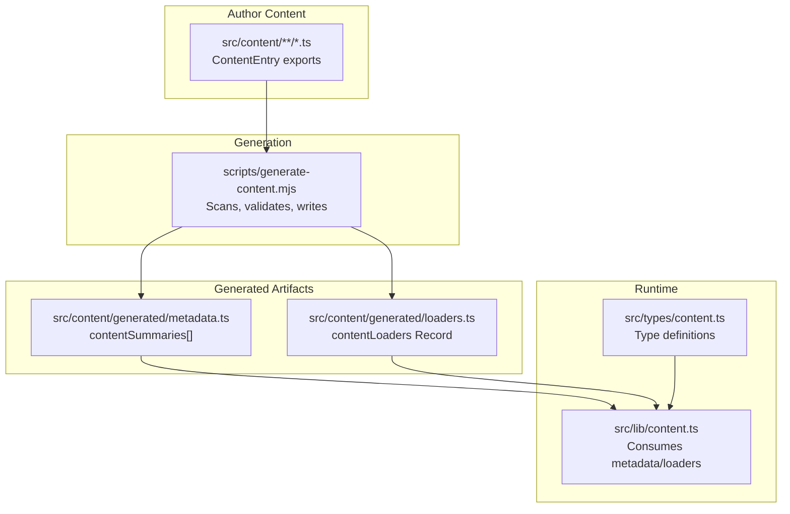
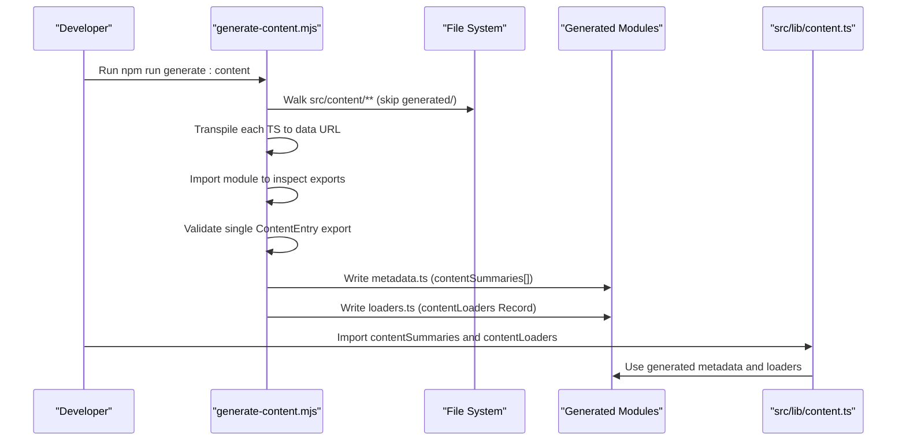
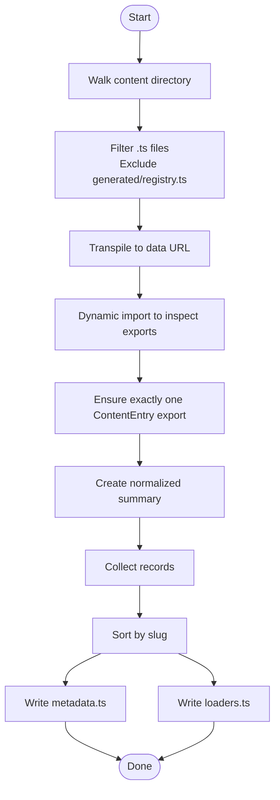
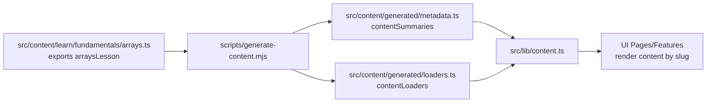
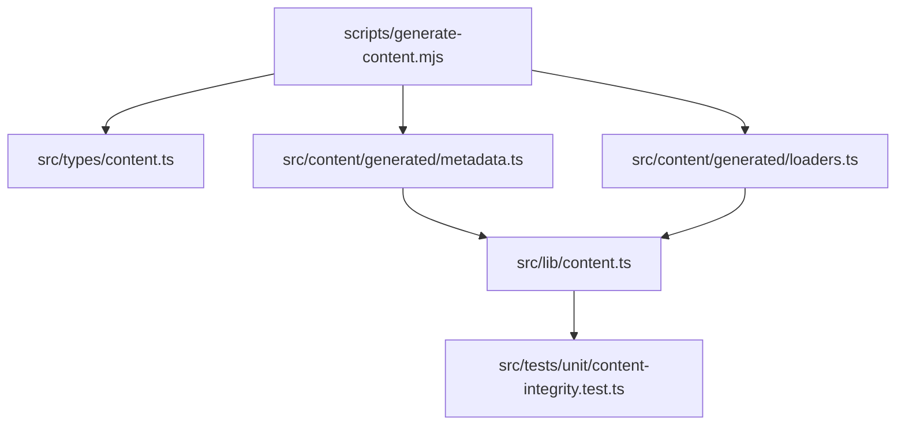

# Content Generation Pipeline

<cite>
**Referenced Files in This Document**
- [generate-content.mjs](file://scripts/generate-content.mjs)
- [metadata.ts](file://src/content/generated/metadata.ts)
- [loaders.ts](file://src/content/generated/loaders.ts)
- [content.ts](file://src/lib/content.ts)
- [content.ts](file://src/types/content.ts)
- [common.ts](file://src/content/errors/common.ts)
- [arrays.ts](file://src/content/learn/fundamentals/arrays.ts)
- [rest-apis.ts](file://src/content/integrations/rest-apis.ts)
- [content-integrity.test.ts](file://src/tests/unit/content-integrity.test.ts)
- [registry.ts](file://src/content/registry.ts)
- [package.json](file://package.json)
</cite>

## Table of Contents
1. [Introduction](#introduction)
2. [Project Structure](#project-structure)
3. [Core Components](#core-components)
4. [Architecture Overview](#architecture-overview)
5. [Detailed Component Analysis](#detailed-component-analysis)
6. [Dependency Analysis](#dependency-analysis)
7. [Performance Considerations](#performance-considerations)
8. [Troubleshooting Guide](#troubleshooting-guide)
9. [Conclusion](#conclusion)

## Introduction
This document explains the content generation pipeline that automates metadata creation and dynamic loader generation for a JavaScript documentation website. The pipeline processes markdown content files and generates TypeScript modules that power:
- A content metadata index with slug-based lookup and category organization
- Lean dynamic import loaders for optimal performance
- Build-time content processing that integrates new content automatically
- Content integrity validation ensuring correctness and reliability

The system is designed so that adding a new content file requires no manual updates to metadata or loaders—generation handles it automatically.

## Project Structure
The content generation pipeline spans several directories and files:
- scripts/generate-content.mjs: The build-time generator that scans content, extracts metadata, and writes generated modules
- src/content/generated/: Auto-generated modules for metadata and loaders
- src/content/: Author-authored content files (TypeScript modules exporting ContentEntry objects)
- src/lib/content.ts: Runtime library that consumes generated metadata and loaders
- src/types/content.ts: Shared TypeScript types for content metadata and entries
- src/tests/unit/content-integrity.test.ts: Validation tests ensuring content integrity
- src/content/registry.ts: Manual registry of content entries (legacy or special cases)
- package.json: Scripts that trigger generation before dev/build/test

**Diagram sources**
- [generate-content.mjs:93-152](file://scripts/generate-content.mjs#L93-L152)
- [metadata.ts:1-20](file://src/content/generated/metadata.ts#L1-L20)
- [loaders.ts:1-20](file://src/content/generated/loaders.ts#L1-L20)
- [content.ts:1-20](file://src/lib/content.ts#L1-L20)
- [content.ts:30-70](file://src/types/content.ts#L30-L70)

**Section sources**
- [generate-content.mjs:6-11](file://scripts/generate-content.mjs#L6-L11)
- [package.json:6-21](file://package.json#L6-L21)

## Core Components
- Content generator (scripts/generate-content.mjs): Recursively walks the content directory, transpiles each TypeScript file to a data URL, imports it to inspect exports, validates a single ContentEntry export per file, builds a normalized summary, and writes metadata and loaders modules.
- Generated metadata (src/content/generated/metadata.ts): An array of ContentSummary objects indexed by slug and id for fast lookup.
- Generated loaders (src/content/generated/loaders.ts): A Record mapping slug to a lazy loader function that dynamically imports the content module and returns the named export.
- Runtime library (src/lib/content.ts): Provides functions to query content by slug/id, filter by pillar/category/type, compute prev/next navigation, and extract headings.
- Types (src/types/content.ts): Defines ContentMeta, ContentSummary, ContentEntry union, and content types (lesson, recipe, integration, etc.).

**Section sources**
- [generate-content.mjs:12-86](file://scripts/generate-content.mjs#L12-L86)
- [metadata.ts:7-126](file://src/content/generated/metadata.ts#L7-L126)
- [loaders.ts:9-96](file://src/content/generated/loaders.ts#L9-L96)
- [content.ts:12-125](file://src/lib/content.ts#L12-L125)
- [content.ts:30-142](file://src/types/content.ts#L30-L142)

## Architecture Overview
The pipeline operates in two phases:
- Build-time generation: Scans content, validates exports, and writes metadata and loaders modules.
- Runtime consumption: Loads generated metadata and loaders, enabling fast slug-based lookups and lazy loading of content.

**Diagram sources**
- [generate-content.mjs:23-111](file://scripts/generate-content.mjs#L23-L111)
- [generate-content.mjs:115-149](file://scripts/generate-content.mjs#L115-L149)
- [content.ts:1-10](file://src/lib/content.ts#L1-L10)

## Detailed Component Analysis

### Content Generator (scripts/generate-content.mjs)
Responsibilities:
- Directory traversal excluding the generated folder and non-TypeScript files
- Single export validation per module
- Normalized summary extraction for metadata
- Slug-based sorting and loader generation
- Writing generated modules with ESLint disable comments

Key behaviors:
- Directory walker ignores "generated" directories and filters for ".ts" files, excluding "registry.ts"
- Uses TypeScript transpileModule to convert source to ESNext/React JSX for evaluation via dynamic import
- Validates that each module exports exactly one ContentEntry object
- Builds records with summary, export name, and import path
- Sorts records by slug and writes:
  - metadata.ts: contentSummaries array
  - loaders.ts: contentLoaders Record mapping slug to loader function

**Diagram sources**
- [generate-content.mjs:23-111](file://scripts/generate-content.mjs#L23-L111)
- [generate-content.mjs:115-149](file://scripts/generate-content.mjs#L115-L149)

**Section sources**
- [generate-content.mjs:23-40](file://scripts/generate-content.mjs#L23-L40)
- [generate-content.mjs:78-86](file://scripts/generate-content.mjs#L78-L86)
- [generate-content.mjs:115-149](file://scripts/generate-content.mjs#L115-L149)

### Generated Metadata (src/content/generated/metadata.ts)
Structure:
- Exports contentSummaries: ContentSummary[]
- Each entry includes id, title, description, slug, pillar, category, subcategory, tags, difficulty, contentType, summary, relatedTopics, order, updatedAt, readingTime, featured, keywords, aliases

Indexing:
- Slugs are unique and serve as primary keys for content lookup
- Ids are also unique and indexed for alternate lookup

Organization:
- Pillars: learn, reference, integrations, recipes, projects, explore, errors
- Categories and subcategories organize content by domain and subdomain

**Section sources**
- [metadata.ts:7-126](file://src/content/generated/metadata.ts#L7-L126)
- [content.ts:30-70](file://src/types/content.ts#L30-L70)

### Generated Loaders (src/content/generated/loaders.ts)
Structure:
- Exports contentLoaders: Record<string, ContentLoader>
- Each loader is a function that returns a Promise resolving to a ContentEntry
- Loader keys are slugs; values are dynamic import chains that resolve the named export

Performance characteristics:
- Lazy loading: content is fetched only when requested
- Minimal overhead: loader is a thin wrapper around import()

**Section sources**
- [loaders.ts:9-96](file://src/content/generated/loaders.ts#L9-L96)

### Runtime Library (src/lib/content.ts)
Capabilities:
- Lookup by slug and id using generated metadata
- Filtering by pillar, contentType, and category
- Featured content and related topics retrieval
- Previous/next navigation within a pillar
- Headings extraction for table of contents

Implementation highlights:
- Precomputes Maps for slug and id lookups for O(1) access
- Sorts content by order and title when filtering
- Uses generated loaders to lazily load content on demand

**Section sources**
- [content.ts:12-125](file://src/lib/content.ts#L12-L125)

### Content Types (src/types/content.ts)
Defines:
- Pillar union and ContentType union
- ContentMeta and ContentSummary interfaces
- ContentEntry union of specialized content types
- Content blocks and headings for rendering

Usage:
- Author content files export a ContentEntry (e.g., LessonContent, IntegrationContent)
- Generated metadata normalizes to ContentSummary for runtime

**Section sources**
- [content.ts:30-142](file://src/types/content.ts#L30-L142)

### Example Content Files
- Error guide: src/content/errors/common.ts exports commonErrorsGuide as ErrorGuideContent
- Lesson: src/content/learn/fundamentals/arrays.ts exports arraysLesson as LessonContent
- Integration: src/content/integrations/rest-apis.ts exports restApisIntegration as IntegrationContent

These files demonstrate the ContentEntry contract and are consumed by the generator to produce metadata and loaders.

**Section sources**
- [common.ts:3-311](file://src/content/errors/common.ts#L3-L311)
- [arrays.ts:3-539](file://src/content/learn/fundamentals/arrays.ts#L3-L539)
- [rest-apis.ts:3-317](file://src/content/integrations/rest-apis.ts#L3-L317)

### Relationship Between Source Content and Generated Modules
- Author content files export a single ContentEntry
- The generator reads each file, validates the export, and includes it in contentSummaries
- The generator maps each slug to a loader that dynamically imports the module and returns the named export
- Runtime code imports contentSummaries and contentLoaders to provide fast, lazy content access

**Diagram sources**
- [arrays.ts:3-37](file://src/content/learn/fundamentals/arrays.ts#L3-L37)
- [generate-content.mjs:99-111](file://scripts/generate-content.mjs#L99-L111)
- [metadata.ts:7-126](file://src/content/generated/metadata.ts#L7-L126)
- [loaders.ts:9-96](file://src/content/generated/loaders.ts#L9-L96)
- [content.ts:1-10](file://src/lib/content.ts#L1-L10)

## Dependency Analysis
- scripts/generate-content.mjs depends on:
  - Node filesystem and TypeScript compiler
  - src/content/** for author content
  - src/types/content.ts for type definitions
- Generated modules depend on:
  - src/types/content.ts for type safety
  - src/lib/content.ts for runtime helpers
- Runtime library depends on:
  - src/content/generated/metadata.ts for contentSummaries
  - src/content/generated/loaders.ts for contentLoaders
- Tests validate:
  - Integrity of metadata (pillars, types, uniqueness, related topics)
  - Loader availability and content shape

**Diagram sources**
- [generate-content.mjs:1-5](file://scripts/generate-content.mjs#L1-L5)
- [content.ts:1-10](file://src/types/content.ts#L1-L10)
- [metadata.ts:1-6](file://src/content/generated/metadata.ts#L1-L6)
- [loaders.ts:1-6](file://src/content/generated/loaders.ts#L1-L6)
- [content.ts:1-10](file://src/lib/content.ts#L1-L10)
- [content-integrity.test.ts:1-5](file://src/tests/unit/content-integrity.test.ts#L1-L5)

**Section sources**
- [generate-content.mjs:1-5](file://scripts/generate-content.mjs#L1-L5)
- [content.ts:1-10](file://src/types/content.ts#L1-L10)
- [metadata.ts:1-6](file://src/content/generated/metadata.ts#L1-L6)
- [loaders.ts:1-6](file://src/content/generated/loaders.ts#L1-L6)
- [content.ts:1-10](file://src/lib/content.ts#L1-L10)
- [content-integrity.test.ts:1-5](file://src/tests/unit/content-integrity.test.ts#L1-L5)

## Performance Considerations
- Lazy loading: Loaders defer importing content modules until requested, reducing initial bundle size
- Fast lookups: Runtime uses Maps keyed by slug and id for O(1) metadata retrieval
- Minimal overhead: Loaders are thin wrappers around dynamic import
- Sorting and filtering: Precomputed maps and simple array filters keep runtime operations efficient

[No sources needed since this section provides general guidance]

## Troubleshooting Guide
Common issues and resolutions:
- Missing or extra ContentEntry export: The generator enforces exactly one ContentEntry export per module. Ensure each content file exports a single ContentEntry.
- Slug collisions: Slugs must be unique. If two files share the same slug, generation will fail.
- Unknown pillar or contentType: Values must be from predefined unions. Verify pillar and contentType against allowed sets.
- Related topics not found: relatedTopics must reference existing ids. Ensure referenced ids exist in metadata.
- Loader fails at runtime: Confirm the slug exists in contentSummaries and that the loader key matches the slug.

Validation coverage:
- Integrity tests check pillars and types, uniqueness of ids and slugs, related topic references, loader availability, and code block validity.

**Section sources**
- [generate-content.mjs:78-86](file://scripts/generate-content.mjs#L78-L86)
- [content-integrity.test.ts:7-47](file://src/tests/unit/content-integrity.test.ts#L7-L47)
- [content-integrity.test.ts:49-71](file://src/tests/unit/content-integrity.test.ts#L49-L71)

## Conclusion
The content generation pipeline automates metadata creation and dynamic loader generation, enabling seamless integration of new content. Authors simply add a TypeScript module exporting a single ContentEntry, and the generator produces optimized metadata and loaders. The runtime library provides fast, typed access to content with robust validation and navigation helpers. This approach ensures scalability, maintainability, and performance across a growing content catalog.