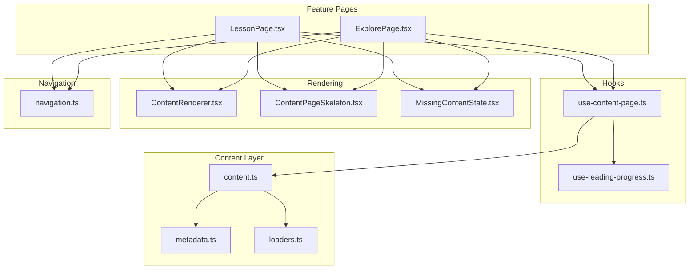
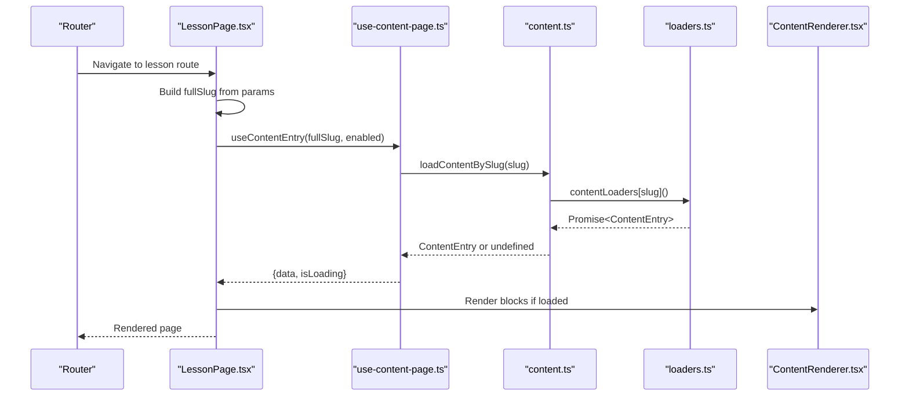
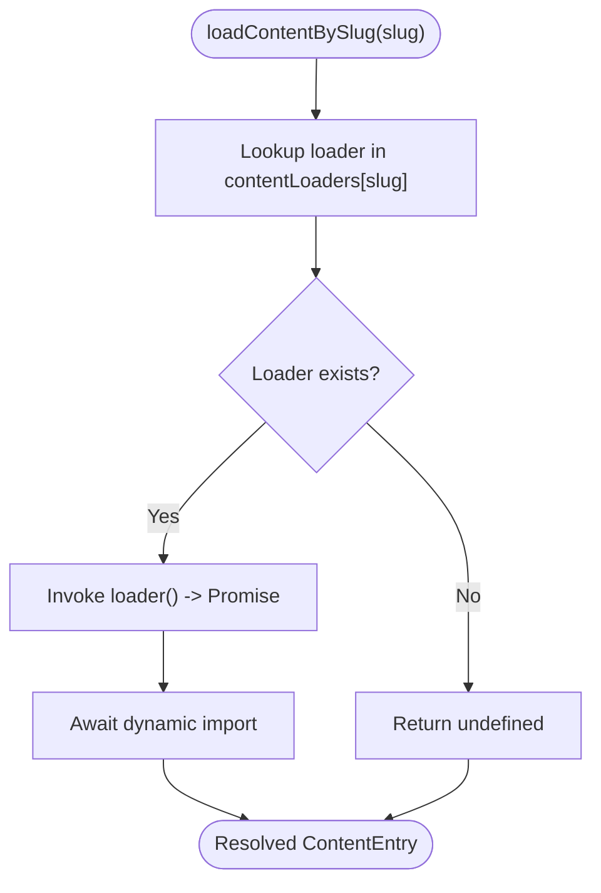
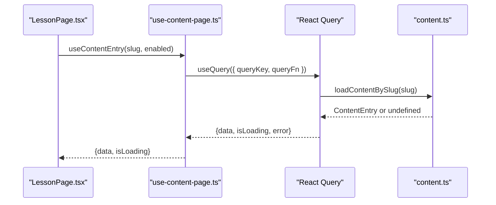
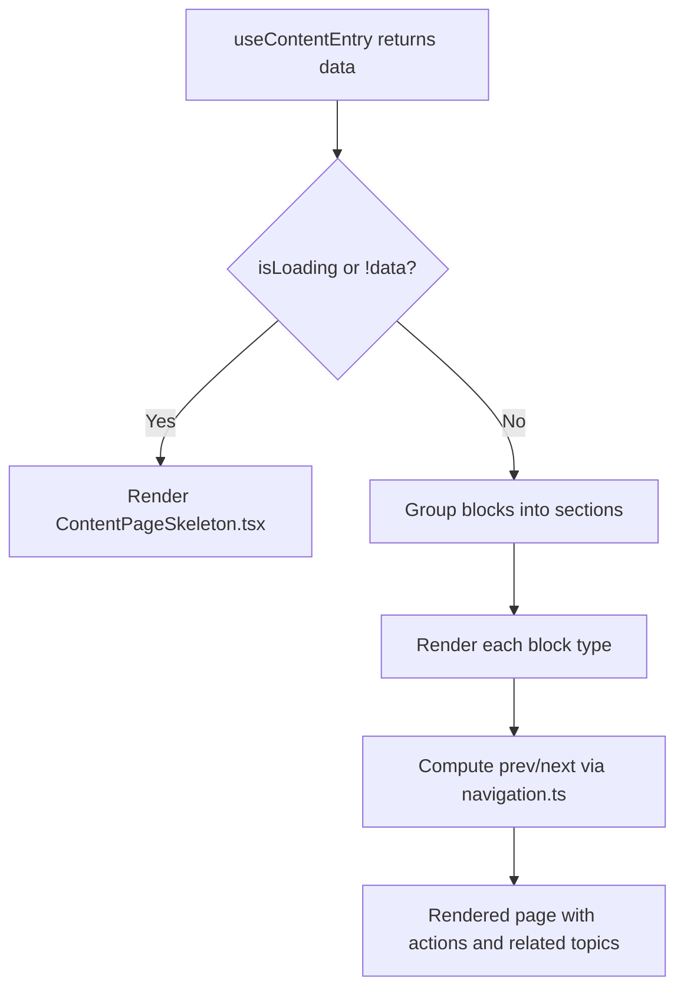
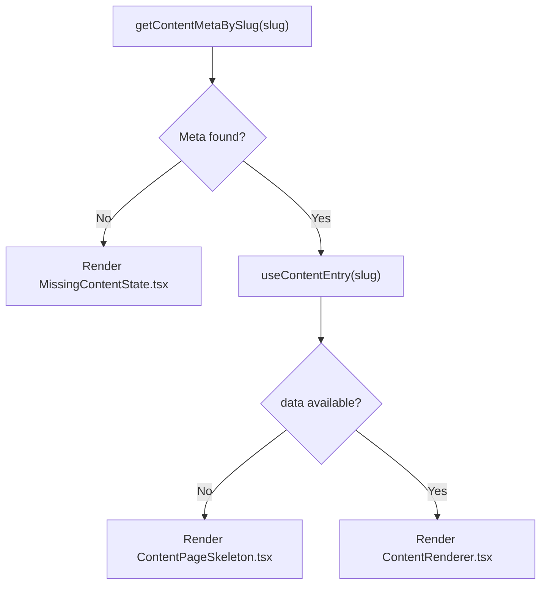
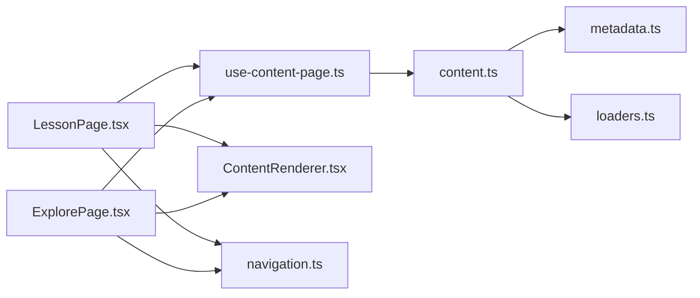

# Content Loading Mechanisms

<cite>
**Referenced Files in This Document**
- [use-content-page.ts](file://src/hooks/use-content-page.ts)
- [content.ts](file://src/lib/content.ts)
- [loaders.ts](file://src/content/generated/loaders.ts)
- [metadata.ts](file://src/content/generated/metadata.ts)
- [LessonPage.tsx](file://src/features/learn/LessonPage.tsx)
- [ExplorePage.tsx](file://src/features/explore/ExplorePage.tsx)
- [ContentRenderer.tsx](file://src/components/content/ContentRenderer.tsx)
- [ContentPageSkeleton.tsx](file://src/components/content/ContentPageSkeleton.tsx)
- [MissingContentState.tsx](file://src/components/content/MissingContentState.tsx)
- [navigation.ts](file://src/lib/navigation.ts)
- [content.ts (types)](file://src/types/content.ts)
- [generate-content.mjs](file://scripts/generate-content.mjs)
- [use-reading-progress.ts](file://src/hooks/use-reading-progress.ts)
</cite>

## Table of Contents
1. [Introduction](#introduction)
2. [Project Structure](#project-structure)
3. [Core Components](#core-components)
4. [Architecture Overview](#architecture-overview)
5. [Detailed Component Analysis](#detailed-component-analysis)
6. [Dependency Analysis](#dependency-analysis)
7. [Performance Considerations](#performance-considerations)
8. [Troubleshooting Guide](#troubleshooting-guide)
9. [Conclusion](#conclusion)
10. [Appendices](#appendices)

## Introduction
This document explains the content loading mechanisms that power dynamic content retrieval and rendering across the application. It covers:
- Dynamic import system enabling lazy loading of content modules
- Route-based code splitting to load content only when needed
- Content loading hooks that manage state, loading, and error handling
- Content caching, performance optimizations, and concurrent request handling
- Error handling strategies for missing content and network failures
- Examples of loading patterns, performance monitoring, and debugging techniques
- Preloading and prefetching strategies to optimize user experience during transitions

## Project Structure
The content system is composed of:
- Generated metadata and loaders that map slugs to dynamic import functions
- A content library that resolves metadata and triggers dynamic imports
- Feature pages that orchestrate loading and rendering
- Rendering components that present content blocks
- Hooks for reading progress and content entry loading
- Navigation utilities that compute prev/next and availability

**Diagram sources**
- [LessonPage.tsx:19-122](file://src/features/learn/LessonPage.tsx#L19-L122)
- [ExplorePage.tsx:17-81](file://src/features/explore/ExplorePage.tsx#L17-L81)
- [use-content-page.ts:7-34](file://src/hooks/use-content-page.ts#L7-L34)
- [content.ts:38-42](file://src/lib/content.ts#L38-L42)
- [loaders.ts:9-96](file://src/content/generated/loaders.ts#L9-L96)
- [metadata.ts:7-40](file://src/content/generated/metadata.ts#L7-L40)
- [ContentRenderer.tsx:29-156](file://src/components/content/ContentRenderer.tsx#L29-L156)
- [ContentPageSkeleton.tsx:1-14](file://src/components/content/ContentPageSkeleton.tsx#L1-L14)
- [MissingContentState.tsx:15-89](file://src/components/content/MissingContentState.tsx#L15-L89)
- [navigation.ts:59-64](file://src/lib/navigation.ts#L59-L64)
- [use-reading-progress.ts:12-51](file://src/hooks/use-reading-progress.ts#L12-L51)

**Section sources**
- [LessonPage.tsx:19-122](file://src/features/learn/LessonPage.tsx#L19-L122)
- [ExplorePage.tsx:17-81](file://src/features/explore/ExplorePage.tsx#L17-L81)
- [use-content-page.ts:7-34](file://src/hooks/use-content-page.ts#L7-L34)
- [content.ts:38-42](file://src/lib/content.ts#L38-L42)
- [loaders.ts:9-96](file://src/content/generated/loaders.ts#L9-L96)
- [metadata.ts:7-40](file://src/content/generated/metadata.ts#L7-L40)
- [ContentRenderer.tsx:29-156](file://src/components/content/ContentRenderer.tsx#L29-L156)
- [ContentPageSkeleton.tsx:1-14](file://src/components/content/ContentPageSkeleton.tsx#L1-L14)
- [MissingContentState.tsx:15-89](file://src/components/content/MissingContentState.tsx#L15-L89)
- [navigation.ts:59-64](file://src/lib/navigation.ts#L59-L64)
- [use-reading-progress.ts:12-51](file://src/hooks/use-reading-progress.ts#L12-L51)

## Core Components
- Dynamic import registry: A generated mapping from slug to a dynamic import that resolves to a content entry.
- Content library: Provides metadata lookup and triggers dynamic imports for content bodies.
- Content hooks: Encapsulate loading, caching, retries, and error propagation.
- Feature pages: Resolve metadata, orchestrate content loading, and render skeletons or missing states.
- Renderer: Renders content blocks into semantic HTML with sectioning and responsive styling.
- Navigation helpers: Compute prev/next links and availability for content routes.

**Section sources**
- [loaders.ts:9-96](file://src/content/generated/loaders.ts#L9-L96)
- [content.ts:38-42](file://src/lib/content.ts#L38-L42)
- [use-content-page.ts:7-34](file://src/hooks/use-content-page.ts#L7-L34)
- [LessonPage.tsx:23-24](file://src/features/learn/LessonPage.tsx#L23-L24)
- [ExplorePage.tsx:21-22](file://src/features/explore/ExplorePage.tsx#L21-L22)
- [ContentRenderer.tsx:29-156](file://src/components/content/ContentRenderer.tsx#L29-L156)
- [navigation.ts:59-64](file://src/lib/navigation.ts#L59-L64)

## Architecture Overview
The system uses route-based code splitting and dynamic imports to load content modules only when a user navigates to a specific slug. The flow:
- Feature pages derive a full slug from route params and metadata.
- A content hook triggers a query to load the content entry via the content library.
- The content library selects the appropriate loader from the generated registry and executes a dynamic import.
- On success, the content is rendered; on failure, a fallback UI is shown.

**Diagram sources**
- [LessonPage.tsx:20-24](file://src/features/learn/LessonPage.tsx#L20-L24)
- [use-content-page.ts:7-23](file://src/hooks/use-content-page.ts#L7-L23)
- [content.ts:38-42](file://src/lib/content.ts#L38-L42)
- [loaders.ts:9-96](file://src/content/generated/loaders.ts#L9-L96)
- [ContentRenderer.tsx:29-156](file://src/components/content/ContentRenderer.tsx#L29-L156)

## Detailed Component Analysis

### Dynamic Import System and Route-Based Code Splitting
- Generated loaders map each slug to a dynamic import returning a content entry.
- The content library selects the loader by slug and awaits the import promise.
- This ensures each content module is bundled separately and only loaded on demand.

**Diagram sources**
- [content.ts:38-42](file://src/lib/content.ts#L38-L42)
- [loaders.ts:9-96](file://src/content/generated/loaders.ts#L9-L96)

**Section sources**
- [content.ts:38-42](file://src/lib/content.ts#L38-L42)
- [loaders.ts:9-96](file://src/content/generated/loaders.ts#L9-L96)
- [generate-content.mjs:128-146](file://scripts/generate-content.mjs#L128-L146)

### Content Loading Hooks: use-content-page
- Provides a content query keyed by slug with automatic retries and a short-lived cache.
- Wraps the content library’s loader and surfaces loading and error states.
- Enables reading progress tracking alongside content loading.

**Diagram sources**
- [use-content-page.ts:7-23](file://src/hooks/use-content-page.ts#L7-L23)
- [content.ts:38-42](file://src/lib/content.ts#L38-L42)

**Section sources**
- [use-content-page.ts:7-34](file://src/hooks/use-content-page.ts#L7-L34)

### Content Rendering Pipeline
- Feature pages render a skeleton while content is loading.
- On success, the renderer splits content blocks into concept sections and renders headings, paragraphs, code, lists, callouts, and tables.
- Prev/next navigation and related topics are computed from metadata.

**Diagram sources**
- [LessonPage.tsx:53-119](file://src/features/learn/LessonPage.tsx#L53-L119)
- [ExplorePage.tsx:45-78](file://src/features/explore/ExplorePage.tsx#L45-L78)
- [ContentRenderer.tsx:29-156](file://src/components/content/ContentRenderer.tsx#L29-L156)
- [navigation.ts:59-64](file://src/lib/navigation.ts#L59-L64)

**Section sources**
- [LessonPage.tsx:53-119](file://src/features/learn/LessonPage.tsx#L53-L119)
- [ExplorePage.tsx:45-78](file://src/features/explore/ExplorePage.tsx#L45-L78)
- [ContentRenderer.tsx:29-156](file://src/components/content/ContentRenderer.tsx#L29-L156)
- [navigation.ts:59-64](file://src/lib/navigation.ts#L59-L64)

### Content Caching and Staleness
- React Query caches content entries per slug with a configurable stale time.
- This reduces redundant network calls and improves perceived performance.
- Reading progress is tracked independently and persisted via user library hooks.

**Section sources**
- [use-content-page.ts:21-22](file://src/hooks/use-content-page.ts#L21-L22)
- [use-reading-progress.ts:12-51](file://src/hooks/use-reading-progress.ts#L12-L51)

### Error Handling and Missing Content
- If metadata is missing for a slug, feature pages render a dedicated missing state with suggestions and recent items.
- If a content loader is missing, the content library returns undefined; the hook throws a normalized error surfaced to the UI.
- Skeletons provide immediate feedback during loading.

**Diagram sources**
- [LessonPage.tsx:26-37](file://src/features/learn/LessonPage.tsx#L26-L37)
- [ExplorePage.tsx:24-35](file://src/features/explore/ExplorePage.tsx#L24-L35)
- [MissingContentState.tsx:15-89](file://src/components/content/MissingContentState.tsx#L15-L89)
- [ContentPageSkeleton.tsx:1-14](file://src/components/content/ContentPageSkeleton.tsx#L1-L14)

**Section sources**
- [LessonPage.tsx:26-37](file://src/features/learn/LessonPage.tsx#L26-L37)
- [ExplorePage.tsx:24-35](file://src/features/explore/ExplorePage.tsx#L24-L35)
- [MissingContentState.tsx:15-89](file://src/components/content/MissingContentState.tsx#L15-L89)
- [ContentPageSkeleton.tsx:1-14](file://src/components/content/ContentPageSkeleton.tsx#L1-L14)

### Concurrent Content Requests
- React Query deduplicates identical queries by query key and shares results across instances.
- Retries are configured to handle transient failures gracefully.
- Reading progress updates are throttled using requestAnimationFrame to avoid excessive work.

**Section sources**
- [use-content-page.ts:20-21](file://src/hooks/use-content-page.ts#L20-L21)
- [use-reading-progress.ts:24-34](file://src/hooks/use-reading-progress.ts#L24-L34)

### Content Types and Block Model
- Content entries conform to union types that include lessons, references, recipes, integrations, projects, error guides, and explore pages.
- Content blocks define a compact, extensible model for headings, paragraphs, code, lists, callouts, and tables.

**Section sources**
- [content.ts (types):74-142](file://src/types/content.ts#L74-L142)
- [content.ts (types):20-26](file://src/types/content.ts#L20-L26)

## Dependency Analysis
The content system exhibits low coupling and high cohesion:
- Feature pages depend on hooks and content library abstractions.
- The content library depends on generated metadata and loaders.
- Rendering components are decoupled from loading logic and only consume normalized blocks.

**Diagram sources**
- [LessonPage.tsx:14-16](file://src/features/learn/LessonPage.tsx#L14-L16)
- [ExplorePage.tsx:14-15](file://src/features/explore/ExplorePage.tsx#L14-L15)
- [use-content-page.ts:2-3](file://src/hooks/use-content-page.ts#L2-L3)
- [content.ts:1-10](file://src/lib/content.ts#L1-L10)
- [metadata.ts:5-6](file://src/content/generated/metadata.ts#L5-L6)
- [loaders.ts:5-7](file://src/content/generated/loaders.ts#L5-L7)
- [ContentRenderer.tsx:2-5](file://src/components/content/ContentRenderer.tsx#L2-L5)
- [navigation.ts:7](file://src/lib/navigation.ts#L7)

**Section sources**
- [LessonPage.tsx:14-16](file://src/features/learn/LessonPage.tsx#L14-L16)
- [ExplorePage.tsx:14-15](file://src/features/explore/ExplorePage.tsx#L14-L15)
- [use-content-page.ts:2-3](file://src/hooks/use-content-page.ts#L2-L3)
- [content.ts:1-10](file://src/lib/content.ts#L1-L10)
- [metadata.ts:5-6](file://src/content/generated/metadata.ts#L5-L6)
- [loaders.ts:5-7](file://src/content/generated/loaders.ts#L5-L7)
- [ContentRenderer.tsx:2-5](file://src/components/content/ContentRenderer.tsx#L2-L5)
- [navigation.ts:7](file://src/lib/navigation.ts#L7)

## Performance Considerations
- Bundle size optimization: Dynamic imports enable route-based code splitting; only the relevant content module is fetched.
- Caching: React Query’s cache with a short staleness window reduces redundant loads.
- Rendering efficiency: The renderer groups blocks into sections and uses memoization to minimize re-renders.
- Throttling: Reading progress updates are scheduled with requestAnimationFrame to avoid layout thrashing.
- Skeletons: Provide instant perceived responsiveness while content loads.

[No sources needed since this section provides general guidance]

## Troubleshooting Guide
- Missing content loader: If a slug lacks a loader entry, the content library returns undefined. Verify the slug exists in the generated loader registry.
- Missing metadata: If metadata is absent, feature pages render a friendly missing state with suggestions. Confirm the slug exists in the generated metadata.
- Network failures: The hook retries twice on error; if persistent, surface a user-friendly error state and offer retry or navigation options.
- Excessive re-renders: Ensure consumers only subscribe to necessary props and rely on memoized components for content blocks.
- Debugging techniques:
  - Inspect the generated metadata and loaders to confirm slug mappings.
  - Temporarily disable caching/stale behavior to reproduce issues.
  - Monitor React Query cache and query status in devtools.
  - Use browser devtools to observe network requests for dynamic imports.

**Section sources**
- [use-content-page.ts:14-18](file://src/hooks/use-content-page.ts#L14-L18)
- [content.ts:38-42](file://src/lib/content.ts#L38-L42)
- [loaders.ts:9-96](file://src/content/generated/loaders.ts#L9-L96)
- [metadata.ts:7-40](file://src/content/generated/metadata.ts#L7-L40)

## Conclusion
The content loading system leverages dynamic imports, route-based code splitting, and React Query to deliver efficient, scalable content rendering. It balances user experience with performance through caching, skeleton UIs, and throttled progress tracking. The architecture cleanly separates concerns between metadata, loaders, loading hooks, and rendering, enabling maintainability and extensibility.

[No sources needed since this section summarizes without analyzing specific files]

## Appendices

### Example Loading Patterns
- Route-driven loading: Feature pages derive a full slug and pass it to the content hook.
- Conditional loading: The hook enables/disables queries based on metadata presence.
- Fallback rendering: Skeletons and missing states improve resilience and UX.

**Section sources**
- [LessonPage.tsx:20-24](file://src/features/learn/LessonPage.tsx#L20-L24)
- [ExplorePage.tsx:18-22](file://src/features/explore/ExplorePage.tsx#L18-L22)
- [use-content-page.ts:19-22](file://src/hooks/use-content-page.ts#L19-L22)
- [ContentPageSkeleton.tsx:1-14](file://src/components/content/ContentPageSkeleton.tsx#L1-L14)
- [MissingContentState.tsx:15-89](file://src/components/content/MissingContentState.tsx#L15-L89)

### Performance Monitoring Approaches
- Measure time-to-interactive for content modules using browser devtools.
- Track React Query cache hit rates and average query durations.
- Observe network waterfall to confirm code splitting and dynamic import timing.
- Monitor reading progress updates to ensure smooth scrolling performance.

[No sources needed since this section provides general guidance]

### Preloading and Prefetching Strategies
- Prefetch on hover or near viewport: Trigger the content hook for adjacent slugs to reduce perceived latency.
- Preload critical metadata: Ensure metadata is available before navigation to avoid blank renders.
- Use browser hints: Combine with service workers or CDN strategies to preload likely content modules.

[No sources needed since this section provides general guidance]