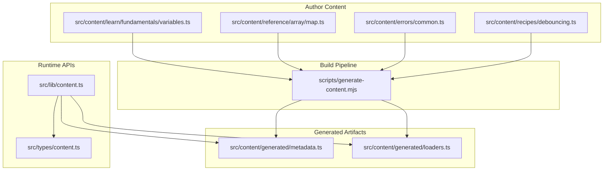
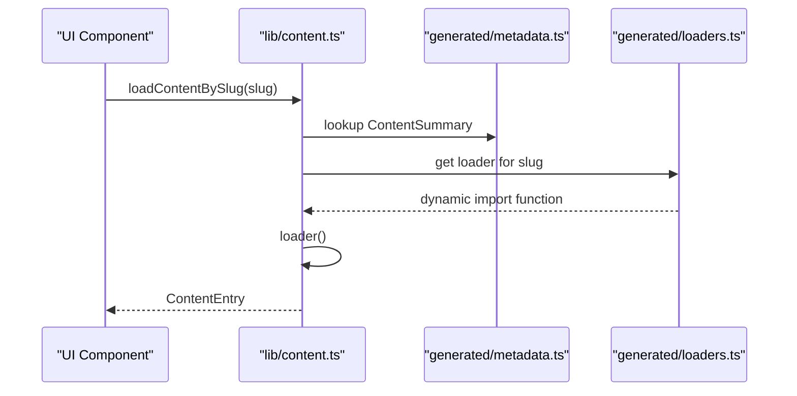
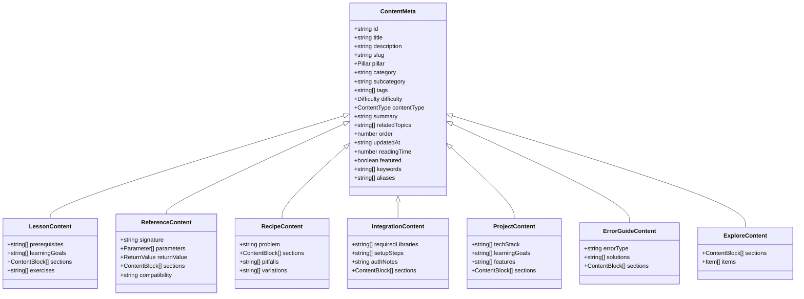
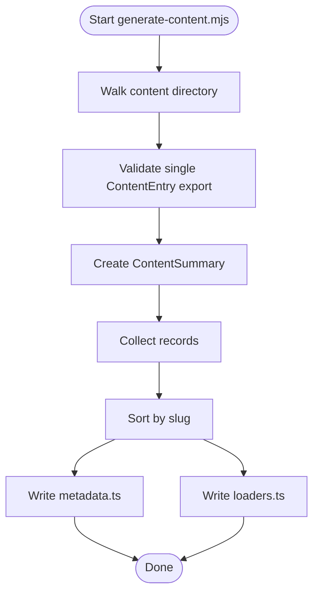
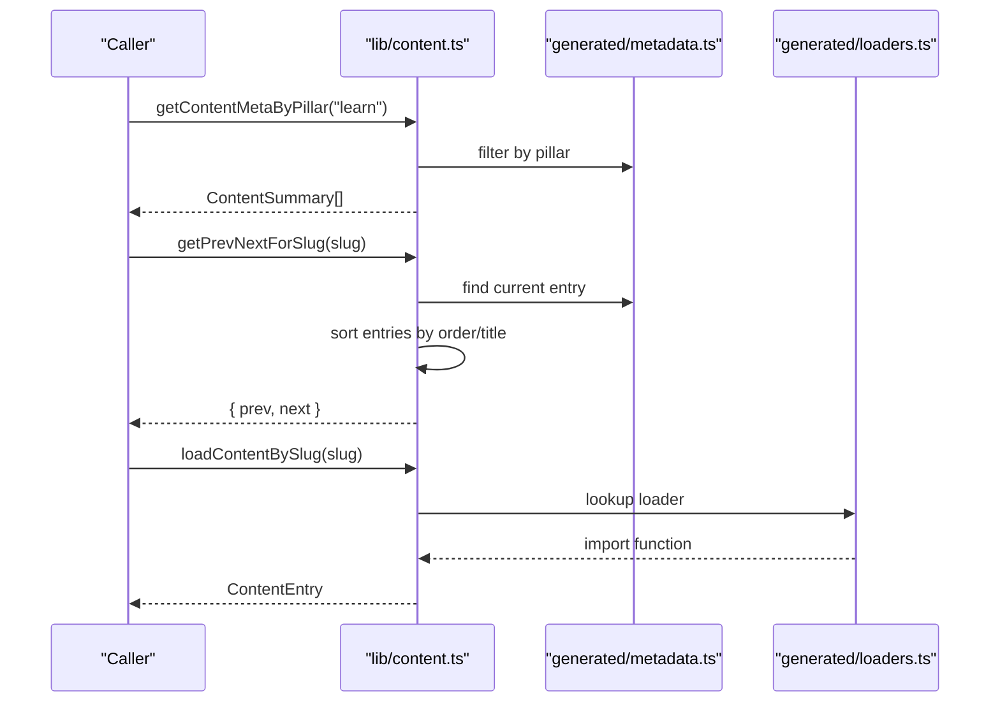
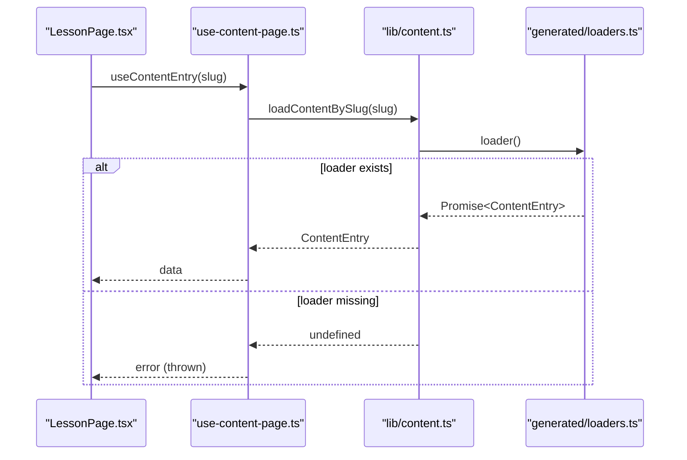
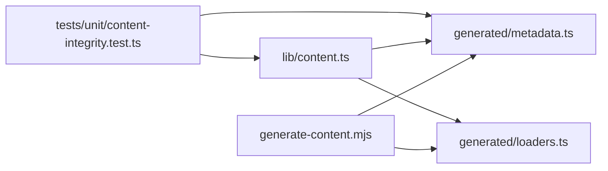

# Content Management System

<cite>
**Referenced Files in This Document**
- [registry.ts](file://src/content/registry.ts)
- [content.ts](file://src/lib/content.ts)
- [content.ts](file://src/types/content.ts)
- [metadata.ts](file://src/content/generated/metadata.ts)
- [loaders.ts](file://src/content/generated/loaders.ts)
- [generate-content.mjs](file://scripts/generate-content.mjs)
- [content-integrity.test.ts](file://src/tests/unit/content-integrity.test.ts)
- [use-content-page.ts](file://src/hooks/use-content-page.ts)
- [LessonPage.tsx](file://src/features/learn/LessonPage.tsx)
- [variables.ts](file://src/content/learn/fundamentals/variables.ts)
- [map.ts](file://src/content/reference/array/map.ts)
- [common.ts](file://src/content/errors/common.ts)
- [debouncing.ts](file://src/content/recipes/debouncing.ts)
</cite>

## Table of Contents
1. [Introduction](#introduction)
2. [Project Structure](#project-structure)
3. [Core Components](#core-components)
4. [Architecture Overview](#architecture-overview)
5. [Detailed Component Analysis](#detailed-component-analysis)
6. [Dependency Analysis](#dependency-analysis)
7. [Performance Considerations](#performance-considerations)
8. [Troubleshooting Guide](#troubleshooting-guide)
9. [Conclusion](#conclusion)
10. [Appendices](#appendices)

## Introduction
This document describes the Content Management System that powers JSphere’s dynamic content architecture. It explains how content is authored, validated, indexed, loaded, and rendered across seven pillars: Learn, Reference, Recipes, Integrations, Projects, Explore, and Errors. It focuses on the unified ContentEntry interface, the content registry and loaders, and the core content APIs: loadContentBySlug, getContentMetaByPillar, and getPrevNextForSlug. It also covers validation, integrity checks, error handling, and performance strategies such as lazy loading and caching.

## Project Structure
The content system is organized around:
- Author-authored content modules under src/content/<pillar>/<category>/<topic>.ts
- Auto-generated metadata and loaders under src/content/generated/
- Runtime content APIs under src/lib/content.ts
- Type definitions under src/types/content.ts
- Build-time generator under scripts/generate-content.mjs
- Unit tests enforcing content integrity under src/tests/unit/

**Diagram sources**
- [variables.ts](file://src/content/learn/fundamentals/variables.ts)
- [map.ts](file://src/content/reference/array/map.ts)
- [common.ts](file://src/content/errors/common.ts)
- [debouncing.ts](file://src/content/recipes/debouncing.ts)
- [metadata.ts](file://src/content/generated/metadata.ts)
- [loaders.ts](file://src/content/generated/loaders.ts)
- [content.ts](file://src/lib/content.ts)
- [content.ts](file://src/types/content.ts)
- [generate-content.mjs](file://scripts/generate-content.mjs)

**Section sources**
- [registry.ts](file://src/content/registry.ts)
- [metadata.ts](file://src/content/generated/metadata.ts)
- [loaders.ts](file://src/content/generated/loaders.ts)
- [content.ts](file://src/lib/content.ts)
- [content.ts](file://src/types/content.ts)
- [generate-content.mjs](file://scripts/generate-content.mjs)

## Core Components
- Unified ContentEntry interface: A single union type that standardizes all content across pillars and types. It extends a base ContentMeta with pillar-specific fields (e.g., prerequisites for lessons, signature for reference, problem for recipes).
- Generated metadata: A stable, sorted array of ContentSummary used for discovery, filtering, and navigation.
- Generated loaders: A record mapping slugs to dynamic import functions, enabling lazy loading of content modules.
- Runtime content APIs: Functions to query metadata, load content by slug, and compute prev/next navigation within a pillar.

Key APIs:
- loadContentBySlug(slug): Returns a promise resolving to ContentEntry or undefined if not found.
- getContentMetaByPillar(pillar): Returns sorted ContentSummary entries filtered by pillar.
- getPrevNextForSlug(slug): Computes previous and next entries within the same pillar by order and title.

**Section sources**
- [content.ts](file://src/lib/content.ts)
- [content.ts](file://src/types/content.ts)
- [metadata.ts](file://src/content/generated/metadata.ts)
- [loaders.ts](file://src/content/generated/loaders.ts)

## Architecture Overview
The system separates authoring from runtime:
- Authoring: Each content module exports a single ContentEntry object.
- Generation: A build script walks the content tree, validates exports, and writes metadata and loaders.
- Runtime: Consumers query metadata and lazily load content via loaders.

**Diagram sources**
- [content.ts](file://src/lib/content.ts)
- [metadata.ts](file://src/content/generated/metadata.ts)
- [loaders.ts](file://src/content/generated/loaders.ts)

## Detailed Component Analysis

### Unified ContentEntry Interface
The ContentEntry union ensures consistent metadata and rendering across all content types while allowing type-specific fields. The base ContentMeta includes identifiers, categorization, SEO fields, and ordering. Specific content types extend the base with domain fields:
- LessonContent: prerequisites, learningGoals, sections, exercises
- ReferenceContent: signature, parameters, returnValue, compatibility
- RecipeContent: problem, pitfalls, variations
- IntegrationContent: requiredLibraries, setupSteps, authNotes
- ProjectContent: techStack, learningGoals, features
- ErrorGuideContent: errorType, solutions
- ExploreContent: sections, items (for library/glossary/comparison)

**Diagram sources**
- [content.ts](file://src/types/content.ts)

**Section sources**
- [content.ts](file://src/types/content.ts)

### Content Registry and Discovery
The registry aggregates all content modules into a single array for indexing and navigation. It imports each content module and exposes contentRegistry: ContentEntry[]. This enables:
- Centralized enumeration of all content
- Consistent ordering and filtering
- Navigation and sitemap generation

Note: The registry is primarily for centralized indexing and does not participate in runtime loading; runtime loading uses generated loaders.

**Section sources**
- [registry.ts](file://src/content/registry.ts)

### Generated Metadata and Loaders
The generator script:
- Walks the content directory excluding generated and registry.ts
- Validates each module exports exactly one ContentEntry
- Produces contentSummaries (ContentSummary[]) and contentLoaders (Record<string, () => Promise<ContentEntry>>)
- Sorts entries by slug and writes deterministic artifacts

**Diagram sources**
- [generate-content.mjs](file://scripts/generate-content.mjs)
- [metadata.ts](file://src/content/generated/metadata.ts)
- [loaders.ts](file://src/content/generated/loaders.ts)

**Section sources**
- [generate-content.mjs](file://scripts/generate-content.mjs)
- [metadata.ts](file://src/content/generated/metadata.ts)
- [loaders.ts](file://src/content/generated/loaders.ts)

### Runtime Content APIs
- loadContentBySlug(slug): Uses contentLoaders to dynamically import and return the matching ContentEntry.
- getContentMetaByPillar(pillar): Filters contentSummaries by pillar and sorts by order and title.
- getPrevNextForSlug(slug): Finds the current entry by slug, retrieves all entries in the same pillar, and returns adjacent entries.

**Diagram sources**
- [content.ts](file://src/lib/content.ts)
- [metadata.ts](file://src/content/generated/metadata.ts)
- [loaders.ts](file://src/content/generated/loaders.ts)

**Section sources**
- [content.ts](file://src/lib/content.ts)

### Content Loading Patterns and Lazy Loading
- Lazy loading: contentLoaders map slugs to dynamic import() calls, ensuring content is fetched only when needed.
- Caching: React Query in useContentEntry caches results with a 5-minute staleTime and retries on failure.
- Error handling: On load failure, the hook throws a user-friendly error and logs details.

**Diagram sources**
- [LessonPage.tsx](file://src/features/learn/LessonPage.tsx)
- [use-content-page.ts](file://src/hooks/use-content-page.ts)
- [content.ts](file://src/lib/content.ts)
- [loaders.ts](file://src/content/generated/loaders.ts)

**Section sources**
- [use-content-page.ts](file://src/hooks/use-content-page.ts)
- [LessonPage.tsx](file://src/features/learn/LessonPage.tsx)
- [content.ts](file://src/lib/content.ts)

### Content Validation and Integrity Checks
The generator enforces:
- Exactly one ContentEntry export per module
- Presence of required fields (id, slug, contentType, title)
- Unique ids and slugs across contentSummaries

Unit tests further validate:
- Allowed pillar and contentType values
- Unique ids and slugs
- Related topics reference existing ids
- Full content loads match metadata
- Code blocks are non-empty strings
- Navigation availability and prev/next correctness

**Section sources**
- [generate-content.mjs](file://scripts/generate-content.mjs)
- [content-integrity.test.ts](file://src/tests/unit/content-integrity.test.ts)

### Practical Examples
- Lesson content: variables.ts demonstrates a lesson with sections, exercises, and metadata.
- Reference content: map.ts shows a reference entry with signature, parameters, and sections.
- Error guide: common.ts illustrates an error guide with solutions and sections.
- Recipe content: debouncing.ts presents a recipe with problem, pitfalls, and code examples.

**Section sources**
- [variables.ts](file://src/content/learn/fundamentals/variables.ts)
- [map.ts](file://src/content/reference/array/map.ts)
- [common.ts](file://src/content/errors/common.ts)
- [debouncing.ts](file://src/content/recipes/debouncing.ts)

## Dependency Analysis
The runtime content APIs depend on generated metadata and loaders. The generator depends on the content directory structure and TypeScript transpilation. Tests depend on generated metadata and runtime APIs.

**Diagram sources**
- [generate-content.mjs](file://scripts/generate-content.mjs)
- [metadata.ts](file://src/content/generated/metadata.ts)
- [loaders.ts](file://src/content/generated/loaders.ts)
- [content.ts](file://src/lib/content.ts)
- [content-integrity.test.ts](file://src/tests/unit/content-integrity.test.ts)

**Section sources**
- [content.ts](file://src/lib/content.ts)
- [metadata.ts](file://src/content/generated/metadata.ts)
- [loaders.ts](file://src/content/generated/loaders.ts)
- [generate-content.mjs](file://scripts/generate-content.mjs)
- [content-integrity.test.ts](file://src/tests/unit/content-integrity.test.ts)

## Performance Considerations
- Lazy loading: Dynamic imports ensure content is fetched only when requested, reducing initial bundle size.
- Caching: React Query caches content with a 5-minute staleTime to minimize repeated loads.
- Sorting: Sorting by order and title is O(n log n) per query; keep queries scoped (by pillar/category) to limit n.
- Rendering: ContentRenderer consumes ContentBlock arrays; avoid unnecessary re-renders by memoizing props.

[No sources needed since this section provides general guidance]

## Troubleshooting Guide
Common issues and resolutions:
- Content not found by slug:
  - Verify slug exists in generated metadata.
  - Confirm a loader entry exists for the slug.
  - Ensure the module exports exactly one ContentEntry.
- Duplicate ids or slugs:
  - The generator and tests enforce uniqueness; fix duplicates in author content.
- Related topics pointing to missing ids:
  - Ensure relatedTopics ids exist in contentSummaries.
- Full content mismatch:
  - After editing a module, re-run the generator to update metadata and loaders.
- Navigation pointing to unavailable routes:
  - Tests validate prev/next and navigation availability; ensure slugs are correct.

**Section sources**
- [generate-content.mjs](file://scripts/generate-content.mjs)
- [content-integrity.test.ts](file://src/tests/unit/content-integrity.test.ts)

## Conclusion
JSphere’s Content Management System provides a robust, scalable foundation for dynamic content across seven pillars. The unified ContentEntry interface, generated metadata and loaders, and runtime APIs deliver consistent discovery, validation, and rendering. Lazy loading and caching optimize performance, while automated generation and tests ensure integrity and reliability.

[No sources needed since this section summarizes without analyzing specific files]

## Appendices

### Authoring Workflow and Integration Patterns
- Create a new content module under the appropriate pillar/category directory.
- Export a single ContentEntry object conforming to the chosen type.
- Run the generator to update metadata and loaders.
- Reference the content via its slug in navigation or linking logic.
- Validate with unit tests to ensure integrity.

**Section sources**
- [generate-content.mjs](file://scripts/generate-content.mjs)
- [content.ts](file://src/types/content.ts)
- [metadata.ts](file://src/content/generated/metadata.ts)
- [loaders.ts](file://src/content/generated/loaders.ts)