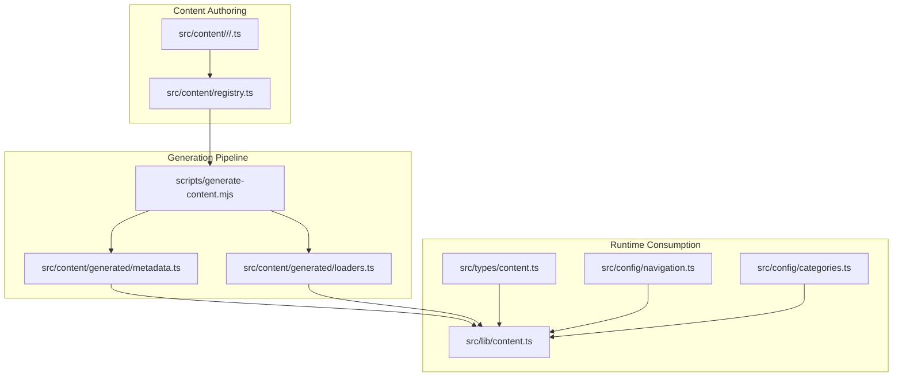
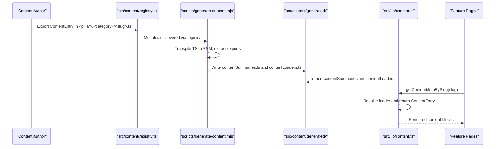
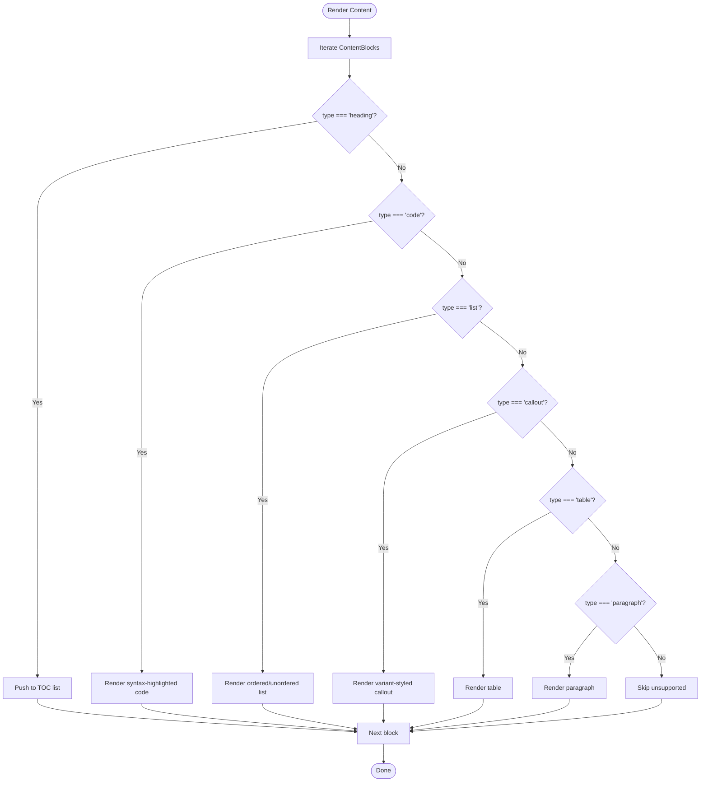
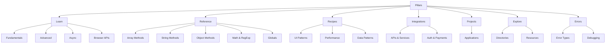
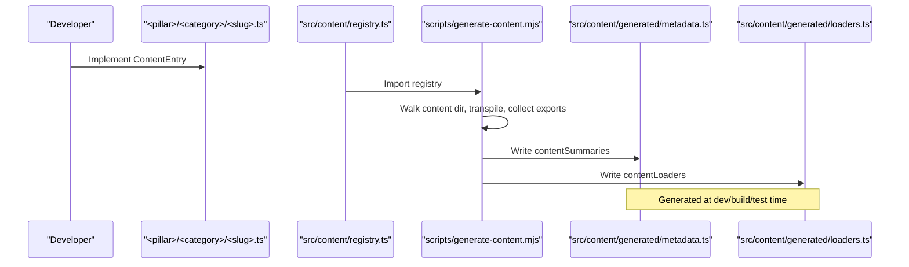
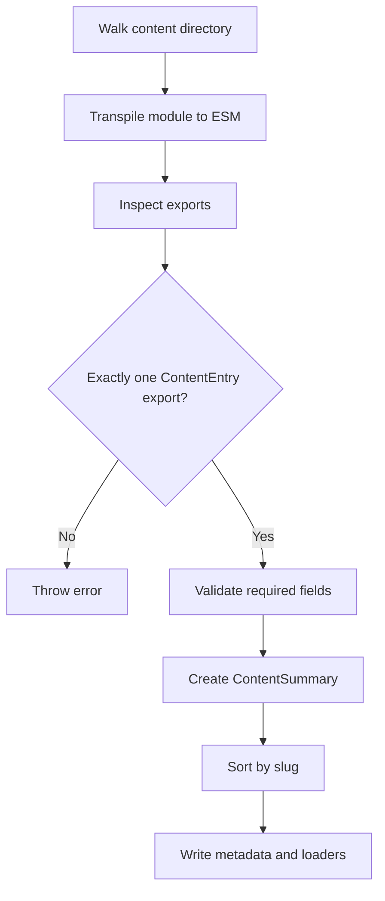
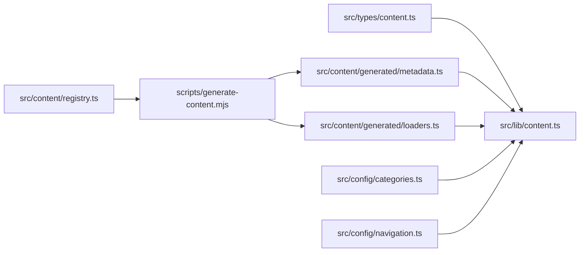

# Content Types & Structure

<cite>
**Referenced Files in This Document**
- [content.ts](file://src/types/content.ts)
- [content.ts](file://src/lib/content.ts)
- [categories.ts](file://src/config/categories.ts)
- [navigation.ts](file://src/config/navigation.ts)
- [registry.ts](file://src/content/registry.ts)
- [generate-content.mjs](file://scripts/generate-content.mjs)
- [variables.ts](file://src/content/learn/fundamentals/variables.ts)
- [map.ts](file://src/content/reference/array/map.ts)
- [debouncing.ts](file://src/content/recipes/debouncing.ts)
- [rest-apis.ts](file://src/content/integrations/rest-apis.ts)
- [telegram-bot.ts](file://src/content/projects/telegram-bot.ts)
- [common.ts](file://src/content/errors/common.ts)
- [libraries.ts](file://src/content/explore/libraries.ts)
- [README.md](file://README.md)
</cite>

## Table of Contents
1. [Introduction](#introduction)
2. [Project Structure](#project-structure)
3. [Core Components](#core-components)
4. [Architecture Overview](#architecture-overview)
5. [Detailed Component Analysis](#detailed-component-analysis)
6. [Dependency Analysis](#dependency-analysis)
7. [Performance Considerations](#performance-considerations)
8. [Troubleshooting Guide](#troubleshooting-guide)
9. [Conclusion](#conclusion)

## Introduction
This document explains the content types and structure system used throughout JSphere. It covers the standardized ContentEntry interface, the seven-content-pillar taxonomy (Learn, Reference, Recipes, Integrations, Projects, Explore, Errors), content metadata, lightweight summaries for search and listings, content validation and integrity checks, and how content is processed and rendered. It also provides examples of content structure variations and best practices for content authoring.

## Project Structure
JSphere organizes content under a clear, hierarchical taxonomy with TypeScript interfaces defining the canonical content model. Content is authored as individual modules under the content directory, auto-registered via a central registry, and processed by a generation script that produces metadata and dynamic loaders for runtime consumption.



**Diagram sources**
- [generate-content.mjs:93-152](file://scripts/generate-content.mjs#L93-L152)
- [registry.ts:161-305](file://src/content/registry.ts#L161-L305)
- [content.ts:1-126](file://src/lib/content.ts#L1-L126)
- [content.ts:1-169](file://src/types/content.ts#L1-L169)
- [navigation.ts:62-262](file://src/config/navigation.ts#L62-L262)
- [categories.ts:14-85](file://src/config/categories.ts#L14-L85)

**Section sources**
- [README.md:147-191](file://README.md#L147-L191)
- [generate-content.mjs:1-158](file://scripts/generate-content.mjs#L1-L158)
- [registry.ts:1-306](file://src/content/registry.ts#L1-L306)

## Core Components
This section documents the canonical content model and the runtime APIs used to discover, filter, and load content.

- ContentEntry and metadata model
  - The union type ContentEntry aggregates all content variants: lessons, reference docs, recipes, integrations, projects, error guides, and explore entries. Each variant extends a shared ContentMeta base with standardized fields for identification, categorization, SEO, and presentation.
  - Key fields include identifiers (id, slug), taxonomy (pillar, category, subcategory), classification (contentType, difficulty), SEO (title, description, summary, keywords, aliases), relationships (relatedTopics), ordering (order), freshness (updatedAt), readability (readingTime), visibility (featured), and content blocks (sections) for rendering.

- Lightweight summaries for listings and search
  - ContentSummary mirrors ContentMeta but is used for lightweight listings and search indexing. It excludes heavy content blocks and is produced by the generation pipeline.

- Runtime content API
  - The content library exposes functions to retrieve content by slug/id, filter by pillar/category/type, compute prev/next navigation, extract headings, and count content per pillar. These functions operate on the generated metadata and loaders.

- Pillars and navigation
  - The seven pillars are defined with labels, descriptions, icons, and ordering. Navigation trees are configured per pillar to drive sidebar and top navigation.

**Section sources**
- [content.ts:1-169](file://src/types/content.ts#L1-L169)
- [content.ts:1-126](file://src/lib/content.ts#L1-L126)
- [categories.ts:1-90](file://src/config/categories.ts#L1-L90)
- [navigation.ts:1-531](file://src/config/navigation.ts#L1-L531)

## Architecture Overview
The content architecture centers on a static, metadata-driven model with a generation step that transforms authored content modules into runtime artifacts.



**Diagram sources**
- [generate-content.mjs:93-152](file://scripts/generate-content.mjs#L93-L152)
- [registry.ts:161-305](file://src/content/registry.ts#L161-L305)
- [content.ts:38-42](file://src/lib/content.ts#L38-L42)

**Section sources**
- [generate-content.mjs:1-158](file://scripts/generate-content.mjs#L1-L158)
- [content.ts:1-126](file://src/lib/content.ts#L1-L126)

## Detailed Component Analysis

### Content Model and Variants
JSphere defines a robust content model with a base metadata interface and specialized variants for each content type. The base includes fields for SEO, taxonomy, relationships, and presentation. Variants add domain-specific fields such as lesson prerequisites/goals, reference signatures and parameters, recipe problem/solutions, integration setup steps, project tech stacks and features, and error guide solutions.

```mermaid
classDiagram
class ContentMeta {
+string id
+string title
+string description
+string slug
+Pillar pillar
+string category
+string? subcategory
+string[] tags
+Difficulty difficulty
+ContentType contentType
+string summary
+string[] relatedTopics
+number order
+string updatedAt
+number readingTime
+boolean featured
+string[] keywords
+string[]? aliases
}
class LessonContent {
+LessonContent prerequisites
+LessonContent learningGoals
+ContentBlock[] sections
+string[] exercises
}
class ReferenceContent {
+string signature
+Parameter[] parameters
+ReturnValue returnValue
+string compatibility
+ContentBlock[] sections
}
class RecipeContent {
+string problem
+string[] pitfalls
+string[] variations
+ContentBlock[] sections
}
class IntegrationContent {
+string[] requiredLibraries
+string[] setupSteps
+string authNotes
+ContentBlock[] sections
}
class ProjectContent {
+string[] techStack
+string[] learningGoals
+string[] features
+ContentBlock[] sections
}
class ErrorGuideContent {
+string errorType
+string[] solutions
+ContentBlock[] sections
}
class ExploreContent {
+{items} name : string, description : string, url? : string
+ContentBlock[] sections
}
class ContentEntry {
}
ContentEntry <|-- LessonContent
ContentEntry <|-- ReferenceContent
ContentEntry <|-- RecipeContent
ContentEntry <|-- IntegrationContent
ContentEntry <|-- ProjectContent
ContentEntry <|-- ErrorGuideContent
ContentEntry <|-- ExploreContent
ContentMeta <|-- LessonContent
ContentMeta <|-- ReferenceContent
ContentMeta <|-- RecipeContent
ContentMeta <|-- IntegrationContent
ContentMeta <|-- ProjectContent
ContentMeta <|-- ErrorGuideContent
ContentMeta <|-- ExploreContent
```

**Diagram sources**
- [content.ts:30-142](file://src/types/content.ts#L30-L142)

**Section sources**
- [content.ts:1-169](file://src/types/content.ts#L1-L169)

### Content Blocks and Rendering
Content blocks define a uniform, extensible rendering model supporting paragraphs, headings, code, lists, callouts, and tables. Headings are extracted for table-of-contents generation, and code blocks support language detection and optional highlights.



**Diagram sources**
- [content.ts:20-26](file://src/types/content.ts#L20-L26)
- [content.ts:121-125](file://src/lib/content.ts#L121-L125)

**Section sources**
- [content.ts:14-26](file://src/types/content.ts#L14-L26)
- [content.ts:121-125](file://src/lib/content.ts#L121-L125)

### Seven Content Pillars and Taxonomy
JSphere organizes content into seven pillars, each with a dedicated navigation tree and configuration for branding and ordering.

- Learn: Structured lessons covering fundamentals, advanced patterns, async programming, and browser APIs.
- Reference: Method-level documentation with signatures, parameters, return values, and examples.
- Recipes: Implementation patterns for common UI and performance problems.
- Integrations: Guides for connecting JavaScript with external services and APIs.
- Projects: End-to-end walkthroughs of real applications.
- Explore: Directories, glossaries, comparisons, and discovery tools.
- Errors: Debugging guides and error breakdowns.



**Diagram sources**
- [categories.ts:14-85](file://src/config/categories.ts#L14-L85)
- [navigation.ts:62-262](file://src/config/navigation.ts#L62-L262)

**Section sources**
- [categories.ts:1-90](file://src/config/categories.ts#L1-L90)
- [navigation.ts:1-531](file://src/config/navigation.ts#L1-L531)
- [README.md:63-76](file://README.md#L63-L76)

### Content Authoring and Registration
Authors create content modules exporting a single ContentEntry variant. The central registry aggregates these exports, and the generation script produces:
- contentSummaries: A sorted array of ContentSummary objects for fast lookups and search.
- contentLoaders: A map from slug to a dynamic loader that imports the module and returns the ContentEntry.



**Diagram sources**
- [registry.ts:161-305](file://src/content/registry.ts#L161-L305)
- [generate-content.mjs:93-152](file://scripts/generate-content.mjs#L93-L152)

**Section sources**
- [registry.ts:1-306](file://src/content/registry.ts#L1-L306)
- [generate-content.mjs:1-158](file://scripts/generate-content.mjs#L1-L158)

### Content Integrity Checks and Validation
The generation script enforces content integrity:
- Each module must export exactly one ContentEntry.
- The exported object must have required fields (id, slug, contentType, title).
- The script sorts entries by slug and writes deterministic metadata and loaders.



**Diagram sources**
- [generate-content.mjs:12-86](file://scripts/generate-content.mjs#L12-L86)
- [generate-content.mjs:113-152](file://scripts/generate-content.mjs#L113-L152)

**Section sources**
- [generate-content.mjs:12-86](file://scripts/generate-content.mjs#L12-L86)

### Examples of Content Structure Variations
Below are representative examples of content structure across pillars and types. These illustrate how metadata, sections, and variant-specific fields are organized.

- Learn (lesson)
  - Includes prerequisites, learning goals, exercises, and a sequence of content blocks.
  - Example: [variables.ts:3-632](file://src/content/learn/fundamentals/variables.ts#L3-L632)

- Reference (API documentation)
  - Includes signature, parameters, return value, compatibility, and sections with examples.
  - Example: [map.ts:3-293](file://src/content/reference/array/map.ts#L3-L293)

- Recipe (implementation pattern)
  - Describes a problem, lists pitfalls and variations, and provides code examples.
  - Example: [debouncing.ts:3-59](file://src/content/recipes/debouncing.ts#L3-L59)

- Integration (external service)
  - Lists required libraries, setup steps, auth notes, and sections with code.
  - Example: [rest-apis.ts:3-317](file://src/content/integrations/rest-apis.ts#L3-L317)

- Project (hands-on application)
  - Lists tech stack, learning goals, features, and sections with code.
  - Example: [telegram-bot.ts:3-294](file://src/content/projects/telegram-bot.ts#L3-L294)

- Errors (debugging guide)
  - Categorizes error types, lists solutions, and provides diagnostic examples.
  - Example: [common.ts:3-311](file://src/content/errors/common.ts#L3-L311)

- Explore (directory/resource)
  - Provides categorized items and sections with tables and examples.
  - Example: [libraries.ts:3-214](file://src/content/explore/libraries.ts#L3-L214)

**Section sources**
- [variables.ts:3-632](file://src/content/learn/fundamentals/variables.ts#L3-L632)
- [map.ts:3-293](file://src/content/reference/array/map.ts#L3-L293)
- [debouncing.ts:3-59](file://src/content/recipes/debouncing.ts#L3-L59)
- [rest-apis.ts:3-317](file://src/content/integrations/rest-apis.ts#L3-L317)
- [telegram-bot.ts:3-294](file://src/content/projects/telegram-bot.ts#L3-L294)
- [common.ts:3-311](file://src/content/errors/common.ts#L3-L311)
- [libraries.ts:3-214](file://src/content/explore/libraries.ts#L3-L214)

### Best Practices for Content Authoring
- Use precise, SEO-friendly titles and descriptions; keep summaries concise yet informative.
- Assign accurate pillar, category, and subcategory; choose appropriate contentType and difficulty.
- Populate tags and keywords thoughtfully for discoverability; include relatedTopics to improve cross-linking.
- Structure sections with clear headings and progressive complexity; include code examples with filenames and highlights where helpful.
- For lessons: specify prerequisites and learning goals; include exercises to reinforce concepts.
- For references: include signatures, parameter types and descriptions, return types, and compatibility notes.
- For recipes: clearly state the problem, list pitfalls and variations, and provide runnable examples.
- For integrations: enumerate required libraries, setup steps, and authentication notes; include cancellation and error handling patterns.
- For projects: list tech stack, learning goals, and features; provide step-by-step sections with code.
- For errors: categorize error types and provide actionable solutions; include debugging strategies and prevention tips.
- For explore: organize items in tables with descriptions and links; keep sections scannable and actionable.

[No sources needed since this section provides general guidance]

## Dependency Analysis
The runtime content API depends on generated metadata and loaders. Navigation and category configurations depend on the content taxonomy. The generation script depends on the registry and TypeScript transpilation.



**Diagram sources**
- [content.ts:1-169](file://src/types/content.ts#L1-L169)
- [content.ts:1-126](file://src/lib/content.ts#L1-L126)
- [registry.ts:161-305](file://src/content/registry.ts#L161-L305)
- [generate-content.mjs:93-152](file://scripts/generate-content.mjs#L93-L152)
- [categories.ts:14-85](file://src/config/categories.ts#L14-L85)
- [navigation.ts:62-262](file://src/config/navigation.ts#L62-L262)

**Section sources**
- [content.ts:1-126](file://src/lib/content.ts#L1-L126)
- [navigation.ts:1-531](file://src/config/navigation.ts#L1-L531)
- [categories.ts:1-90](file://src/config/categories.ts#L1-L90)

## Performance Considerations
- Metadata-driven loading: The generated metadata enables O(1) lookups by slug/id and supports sorting and filtering without parsing raw content.
- Lazy loading: Dynamic loaders permit route-based code splitting and on-demand content loading.
- Lightweight summaries: ContentSummary avoids loading heavy sections until needed.
- Efficient extraction: Headings are extracted in a single pass over sections for table-of-contents generation.

[No sources needed since this section provides general guidance]

## Troubleshooting Guide
Common issues and resolutions when working with content:

- Missing or incorrect exports
  - Symptom: Generation fails with “expected exactly one content export”.
  - Resolution: Ensure each module exports a single ContentEntry and nothing else.

- Invalid content shape
  - Symptom: Generation fails due to missing required fields.
  - Resolution: Verify id, slug, contentType, and title are present and correctly typed.

- Slug conflicts
  - Symptom: Runtime lookup ambiguity or unexpected content retrieval.
  - Resolution: Ensure each slug is unique across the content tree.

- Navigation drift
  - Symptom: Sidebar or top navigation does not reflect new content.
  - Resolution: Register the new content in the central registry and regenerate content metadata.

- Incorrect pillar/category
  - Symptom: Content appears in wrong section or fails filtering.
  - Resolution: Confirm pillar, category, and subcategory match the taxonomy and navigation configuration.

**Section sources**
- [generate-content.mjs:78-86](file://scripts/generate-content.mjs#L78-L86)
- [generate-content.mjs:12-21](file://scripts/generate-content.mjs#L12-L21)
- [registry.ts:161-305](file://src/content/registry.ts#L161-L305)

## Conclusion
JSphere’s content system is built on a strong, typed model with a clear taxonomy and automated generation pipeline. Authors focus on writing structured, metadata-rich content modules, while the system handles discovery, rendering, and navigation. By following the documented patterns and best practices, contributors can efficiently add high-quality content across all seven pillars.