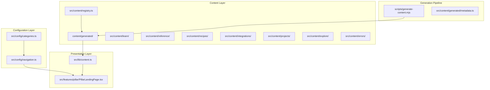
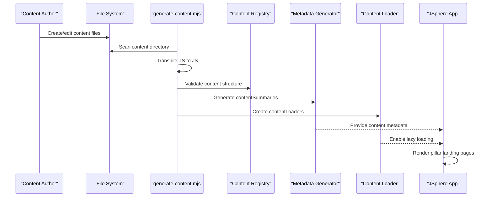
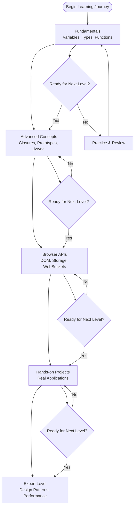
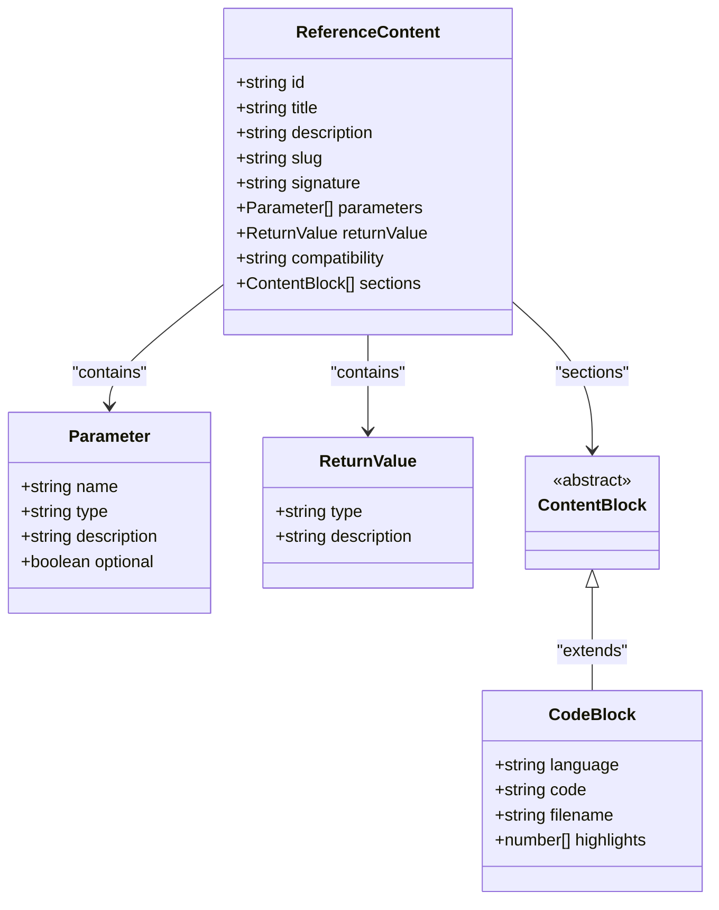
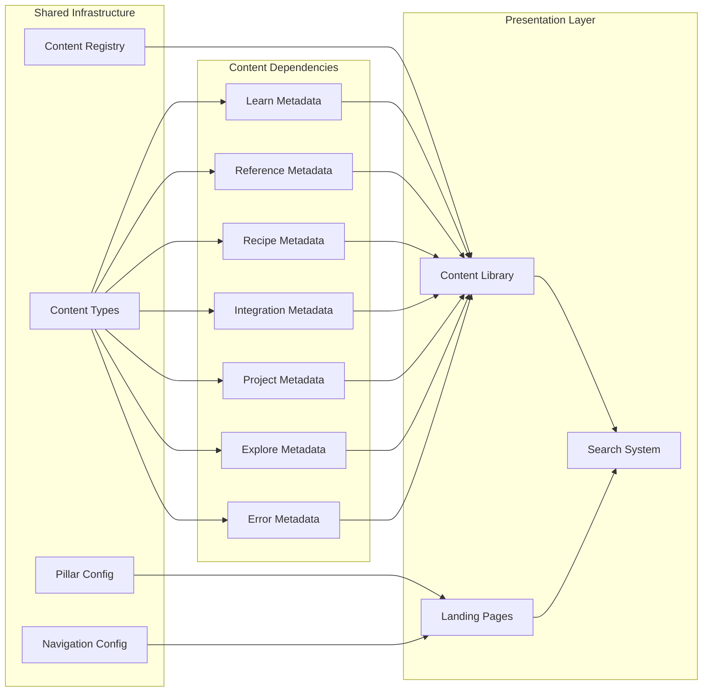

# Content Pillars

<cite>
**Referenced Files in This Document**
- [categories.ts](file://src/config/categories.ts)
- [navigation.ts](file://src/config/navigation.ts)
- [content.ts](file://src/lib/content.ts)
- [registry.ts](file://src/content/registry.ts)
- [PillarLandingPage.tsx](file://src/features/pillar/PillarLandingPage.tsx)
- [content.ts (types)](file://src/types/content.ts)
- [variables.ts](file://src/content/learn/fundamentals/variables.ts)
- [map.ts](file://src/content/reference/array/map.ts)
- [form-validation.ts](file://src/content/recipes/form-validation.ts)
- [rest-apis.ts](file://src/content/integrations/rest-apis.ts)
- [chat-app.ts](file://src/content/projects/chat-app.ts)
- [libraries.ts](file://src/content/explore/libraries.ts)
- [common.ts](file://src/content/errors/common.ts)
- [metadata.ts](file://src/content/generated/metadata.ts)
- [generate-content.mjs](file://scripts/generate-content.mjs)
</cite>

## Table of Contents
1. [Introduction](#introduction)
2. [Project Structure](#project-structure)
3. [Core Components](#core-components)
4. [Architecture Overview](#architecture-overview)
5. [Detailed Component Analysis](#detailed-component-analysis)
6. [Dependency Analysis](#dependency-analysis)
7. [Performance Considerations](#performance-considerations)
8. [Troubleshooting Guide](#troubleshooting-guide)
9. [Conclusion](#conclusion)
10. [Appendices](#appendices)

## Introduction
JSphere organizes JavaScript knowledge into seven distinct educational pillars that serve different learning styles and professional needs:
- Learn: Structured lessons progressing from fundamentals to advanced topics
- Reference: Fast, searchable API documentation
- Recipes: Production-ready implementation patterns
- Integrations: External service guides
- Projects: Full application walkthroughs
- Explore: Discovery tools and directories
- Errors: Debugging guides and troubleshooting

Each pillar maintains a consistent hierarchical organization with subcategories and learning paths that build progressively from basic concepts to complex implementations.

## Project Structure
The content system follows a modular architecture with clear separation between configuration, content definition, and presentation layers.

**Diagram sources**
- [categories.ts:1-90](file://src/config/categories.ts#L1-L90)
- [navigation.ts:1-531](file://src/config/navigation.ts#L1-L531)
- [PillarLandingPage.tsx:1-90](file://src/features/pillar/PillarLandingPage.tsx#L1-L90)
- [generate-content.mjs:1-158](file://scripts/generate-content.mjs#L1-L158)

**Section sources**
- [categories.ts:1-90](file://src/config/categories.ts#L1-L90)
- [navigation.ts:1-531](file://src/config/navigation.ts#L1-L531)
- [PillarLandingPage.tsx:1-90](file://src/features/pillar/PillarLandingPage.tsx#L1-L90)
- [generate-content.mjs:1-158](file://scripts/generate-content.mjs#L1-L158)

## Core Components
The content pillars system consists of several interconnected components that work together to deliver structured learning experiences.

### Pillar Configuration System
The configuration defines the seven pillars with their metadata, navigation structure, and visual identity.

### Content Registry and Metadata
The registry aggregates all content entries and generates metadata for efficient lookup and navigation.

### Content Loading Pipeline
The generation script automatically discovers content files, validates their structure, and creates optimized loading mechanisms.

**Section sources**
- [categories.ts:14-85](file://src/config/categories.ts#L14-L85)
- [registry.ts:161-305](file://src/content/registry.ts#L161-L305)
- [content.ts:12-126](file://src/lib/content.ts#L12-L126)
- [generate-content.mjs:93-152](file://scripts/generate-content.mjs#L93-L152)

## Architecture Overview
The content architecture implements a layered approach with clear separation of concerns and automated content discovery.

**Diagram sources**
- [generate-content.mjs:23-152](file://scripts/generate-content.mjs#L23-L152)
- [registry.ts:161-305](file://src/content/registry.ts#L161-L305)
- [content.ts:12-126](file://src/lib/content.ts#L12-L126)

The architecture supports progressive learning through structured content organization and provides seamless navigation between related topics.

## Detailed Component Analysis

### Learn Pillar: Progressive Knowledge Building
The Learn pillar implements a comprehensive curriculum structure that progresses systematically from JavaScript fundamentals to advanced concepts.

**Diagram sources**
- [navigation.ts:62-118](file://src/config/navigation.ts#L62-L118)
- [variables.ts:21-29](file://src/content/learn/fundamentals/variables.ts#L21-L29)

The Learn pillar emphasizes foundational understanding with structured prerequisites and progressive complexity.

**Section sources**
- [navigation.ts:62-118](file://src/config/navigation.ts#L62-L118)
- [variables.ts:1-633](file://src/content/learn/fundamentals/variables.ts#L1-L633)

### Reference Pillar: API Documentation Standards
The Reference pillar provides structured API documentation with consistent formatting and comprehensive coverage.

**Diagram sources**
- [content.ts:84-91](file://src/types/content.ts#L84-L91)
- [map.ts:20-26](file://src/content/reference/array/map.ts#L20-L26)

**Section sources**
- [content.ts:84-91](file://src/types/content.ts#L84-L91)
- [map.ts:1-294](file://src/content/reference/array/map.ts#L1-L294)

### Recipes Pillar: Implementation Patterns
The Recipes pillar focuses on production-ready solutions with practical implementation guidance.

**Section sources**
- [form-validation.ts:1-73](file://src/content/recipes/form-validation.ts#L1-L73)

### Integrations Pillar: External Service Guides
The Integrations pillar provides comprehensive guides for connecting JavaScript applications with external services.

**Section sources**
- [rest-apis.ts:1-318](file://src/content/integrations/rest-apis.ts#L1-L318)

### Projects Pillar: Full Application Development
The Projects pillar offers complete application walkthroughs with real-world complexity.

**Section sources**
- [chat-app.ts:1-444](file://src/content/projects/chat-app.ts#L1-L444)

### Explore Pillar: Discovery and Resources
The Explore pillar curates essential resources and directories for JavaScript development.

**Section sources**
- [libraries.ts:1-215](file://src/content/explore/libraries.ts#L1-L215)

### Errors Pillar: Debugging and Troubleshooting
The Errors pillar provides systematic approaches to identifying and resolving common issues.

**Section sources**
- [common.ts:1-312](file://src/content/errors/common.ts#L1-L312)

## Dependency Analysis
The content system maintains loose coupling between components while ensuring strong internal consistency.

**Diagram sources**
- [content.ts:30-49](file://src/types/content.ts#L30-L49)
- [categories.ts:14-85](file://src/config/categories.ts#L14-L85)
- [navigation.ts:266-523](file://src/config/navigation.ts#L266-L523)
- [registry.ts:161-305](file://src/content/registry.ts#L161-L305)

**Section sources**
- [content.ts:30-49](file://src/types/content.ts#L30-L49)
- [categories.ts:14-85](file://src/config/categories.ts#L14-L85)
- [navigation.ts:266-523](file://src/config/navigation.ts#L266-L523)
- [registry.ts:161-305](file://src/content/registry.ts#L161-L305)

## Performance Considerations
The content system implements several performance optimizations for efficient content delivery and navigation.

### Content Loading Strategy
- Lazy loading of content modules reduces initial bundle size
- Generated metadata enables fast content discovery
- Optimized search indexing improves query performance

### Navigation Performance
- Pre-computed navigation hierarchies eliminate runtime computation
- Sidebar configurations support efficient rendering
- Content summaries provide lightweight navigation data

### Caching and Updates
- Content metadata cached for fast access
- Incremental regeneration on content changes
- Efficient invalidation strategies for updated content

## Troubleshooting Guide
Common issues and their solutions when working with the content system.

### Content Generation Issues
- **Missing content exports**: Each content file must export exactly one content entry
- **Invalid content structure**: Content must match the appropriate interface for its type
- **Duplicate slugs**: Each content piece requires a unique slug identifier

### Navigation Problems
- **Broken links**: Verify slug consistency between content and navigation configuration
- **Missing categories**: Ensure content belongs to a recognized pillar and category
- **Ordering issues**: Check order values for proper content sequencing

### Performance Issues
- **Slow page loads**: Verify lazy loading implementation and content bundling
- **Memory leaks**: Check for proper cleanup of event listeners and timers
- **Search inefficiency**: Validate search indexing and query optimization

**Section sources**
- [generate-content.mjs:78-86](file://scripts/generate-content.mjs#L78-L86)
- [content.ts:78-89](file://src/lib/content.ts#L78-L89)

## Conclusion
JSphere's content pillars system provides a comprehensive framework for JavaScript education that supports diverse learning styles and professional development needs. The seven-pillar architecture creates clear pathways for skill progression while maintaining flexibility for different learning objectives.

The system's strength lies in its structured approach to content organization, automated generation pipeline, and consistent formatting standards that ensure quality and maintainability across all educational materials.

## Appendices

### Content Creation Workflow
1. **Author Content**: Create or edit content files in appropriate pillar directories
2. **Validate Structure**: Ensure content matches required interface specifications
3. **Run Generation**: Execute content generation script to update metadata and loaders
4. **Test Integration**: Verify content appears correctly in navigation and search
5. **Publish Changes**: Deploy updates to production environment

### Content Structure Standards
- **Metadata Fields**: All content must include required metadata fields
- **Content Types**: Use appropriate content type interfaces for each pillar
- **Relationships**: Define related topics and prerequisites clearly
- **Formatting**: Follow established content block patterns and styling guidelines

### Cross-Pillar Integration
The content system supports cross-parenthood linking through:
- Related topics field for content interlinking
- Shared metadata for cross-referencing
- Navigation integration for seamless content discovery