# Errors

<cite>
**Referenced Files in This Document**
- [api.ts](file://src/content/errors/api.ts)
- [async.ts](file://src/content/errors/async.ts)
- [common.ts](file://src/content/errors/common.ts)
- [debugging.ts](file://src/content/errors/debugging.ts)
- [dom.ts](file://src/content/errors/dom.ts)
- [ErrorPage.tsx](file://src/features/errors/ErrorPage.tsx)
- [ErrorBoundary.tsx](file://src/components/error-boundary/ErrorBoundary.tsx)
- [error-handling.ts](file://src/content/learn/fundamentals/error-handling.ts)
- [content.ts](file://src/lib/content.ts)
- [use-toast.ts](file://src/hooks/use-toast.ts)
- [toaster.tsx](file://src/components/ui/toaster.tsx)
</cite>

## Table of Contents
1. [Introduction](#introduction)
2. [Project Structure](#project-structure)
3. [Core Components](#core-components)
4. [Architecture Overview](#architecture-overview)
5. [Detailed Component Analysis](#detailed-component-analysis)
6. [Dependency Analysis](#dependency-analysis)
7. [Performance Considerations](#performance-considerations)
8. [Troubleshooting Guide](#troubleshooting-guide)
9. [Conclusion](#conclusion)
10. [Appendices](#appendices)

## Introduction
This Errors Pilar documentation provides a comprehensive, practical guide to debugging and resolving JavaScript errors across client-side, server-side, and asynchronous contexts. It consolidates error handling architecture, diagnostic techniques, and resolution strategies grounded in the repository’s curated content. The goal is to help developers reproduce issues, diagnose root causes, apply fixes, and adopt preventive measures to reduce future incidents.

## Project Structure
The Errors Pilar is organized as a set of structured learning and reference materials integrated into the application’s content system. The key building blocks are:
- Error guides: Topic-focused content covering API errors, async pitfalls, common JavaScript errors, DOM/React issues, and debugging techniques.
- Error page renderer: A dedicated page component that loads and renders error guides by slug.
- Error boundary: A React error boundary to gracefully handle rendering errors.
- Content utilities: Functions to load, navigate, and extract metadata for content entries.
- UI toast system: A toast notification system used to surface runtime feedback during error handling.

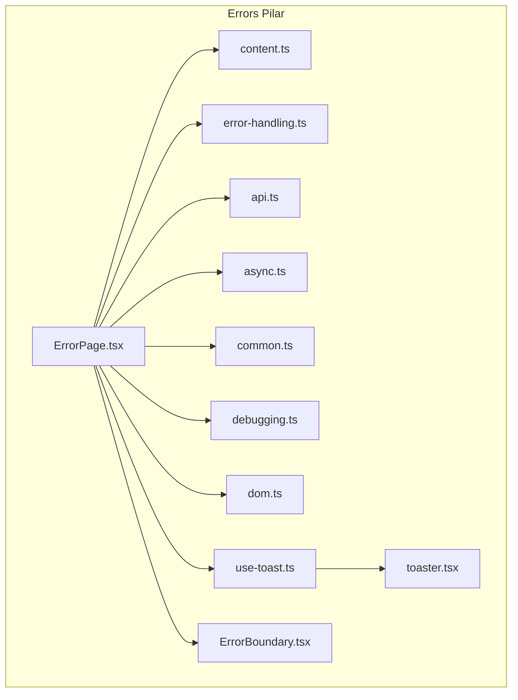

**Diagram sources**
- [ErrorPage.tsx:19-93](file://src/features/errors/ErrorPage.tsx#L19-L93)
- [ErrorBoundary.tsx:16-64](file://src/components/error-boundary/ErrorBoundary.tsx#L16-L64)
- [content.ts:38-42](file://src/lib/content.ts#L38-L42)
- [error-handling.ts:3-35](file://src/content/learn/fundamentals/error-handling.ts#L3-L35)
- [api.ts:3-20](file://src/content/errors/api.ts#L3-L20)
- [async.ts:3-20](file://src/content/errors/async.ts#L3-L20)
- [common.ts:3-20](file://src/content/errors/common.ts#L3-L20)
- [debugging.ts:3-20](file://src/content/errors/debugging.ts#L3-L20)
- [dom.ts:3-20](file://src/content/errors/dom.ts#L3-L20)
- [use-toast.ts:166-184](file://src/hooks/use-toast.ts#L166-L184)
- [toaster.tsx:4-23](file://src/components/ui/toaster.tsx#L4-L23)

**Section sources**
- [ErrorPage.tsx:19-93](file://src/features/errors/ErrorPage.tsx#L19-L93)
- [content.ts:38-42](file://src/lib/content.ts#L38-L42)

## Core Components
- Error Guides: Curated content covering:
  - API Integration Errors
  - Async Mistakes
  - Common JavaScript Errors
  - DOM & React Errors
  - Debugging Techniques
- Error Page Renderer: Loads a specific error guide by slug and renders its sections with metadata, breadcrumbs, and related topics.
- Error Boundary: Provides a fallback UI when rendering errors occur in the UI tree.
- Content Utilities: Provide slug-to-loader mapping, navigation helpers, and heading extraction for in-page navigation.
- Toast System: A lightweight notification system used to surface user-facing error messages.

**Section sources**
- [api.ts:3-20](file://src/content/errors/api.ts#L3-L20)
- [async.ts:3-20](file://src/content/errors/async.ts#L3-L20)
- [common.ts:3-20](file://src/content/errors/common.ts#L3-L20)
- [debugging.ts:3-20](file://src/content/errors/debugging.ts#L3-L20)
- [dom.ts:3-20](file://src/content/errors/dom.ts#L3-L20)
- [ErrorPage.tsx:19-93](file://src/features/errors/ErrorPage.tsx#L19-L93)
- [ErrorBoundary.tsx:16-64](file://src/components/error-boundary/ErrorBoundary.tsx#L16-L64)
- [content.ts:38-42](file://src/lib/content.ts#L38-L42)
- [use-toast.ts:166-184](file://src/hooks/use-toast.ts#L166-L184)
- [toaster.tsx:4-23](file://src/components/ui/toaster.tsx#L4-L23)

## Architecture Overview
The Errors Pilar integrates content-driven error guides with UI rendering and error handling primitives. The flow:
- A user navigates to an error guide via a URL with a slug.
- The ErrorPage component resolves the slug, fetches metadata, and loads the content entry.
- The page renders the guide’s sections, highlights the error type, and displays a solutions summary.
- The ErrorBoundary provides a fallback UI if rendering fails.
- The toast system can surface runtime feedback during error handling.

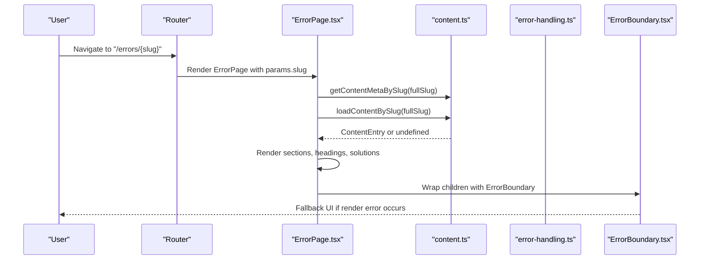

**Diagram sources**
- [ErrorPage.tsx:19-93](file://src/features/errors/ErrorPage.tsx#L19-L93)
- [content.ts:30-42](file://src/lib/content.ts#L30-L42)
- [ErrorBoundary.tsx:31-62](file://src/components/error-boundary/ErrorBoundary.tsx#L31-L62)

## Detailed Component Analysis

### API Integration Errors
This guide focuses on common API integration mistakes and their fixes:
- CORS errors: Emphasizes server-side header configuration and backend proxying as reliable solutions.
- Response.ok checks: Demonstrates a robust fetch wrapper that validates HTTP status and extracts meaningful error messages.
- Content-Type correctness: Explains why missing or mismatched Content-Type headers cause 400 errors and how to avoid double-stringification.
- Authentication errors: Covers Authorization header formatting and token refresh patterns.
- Network and timeout errors: Introduces AbortController-based timeouts and modern AbortSignal.timeout().
- JSON parsing: Recommends checking Content-Type and handling empty responses safely.
- Rate limiting: Shows how to respect Retry-After and implement client-side queuing.
- Debugging checklist: Provides a step-by-step approach to inspect network requests and interpret responses.

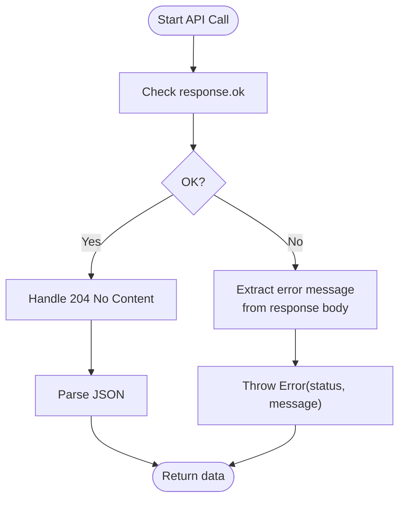

**Diagram sources**
- [api.ts:70-100](file://src/content/errors/api.ts#L70-L100)

**Section sources**
- [api.ts:28-383](file://src/content/errors/api.ts#L28-L383)

### Async Mistakes
This guide covers frequent async pitfalls and their solutions:
- Forgetting to await: Demonstrates how missing await leads to Promise truthiness and potential security bugs.
- Unhandled Promise rejections: Shows global and local handling strategies.
- forEach with async: Explains why forEach ignores async callbacks and demonstrates sequential, parallel, and controlled-concurrency alternatives.
- Race conditions: Presents AbortController, cancellation flags, and library-based solutions.
- Promise.all pitfalls: Advocates Promise.allSettled for partial-result scenarios.
- Async memory leaks: Highlights cleanup patterns for effects, intervals, and event listeners.
- Event loop confusion: Clarifies microtask vs macrotask ordering and provides strategies to yield to the event loop.

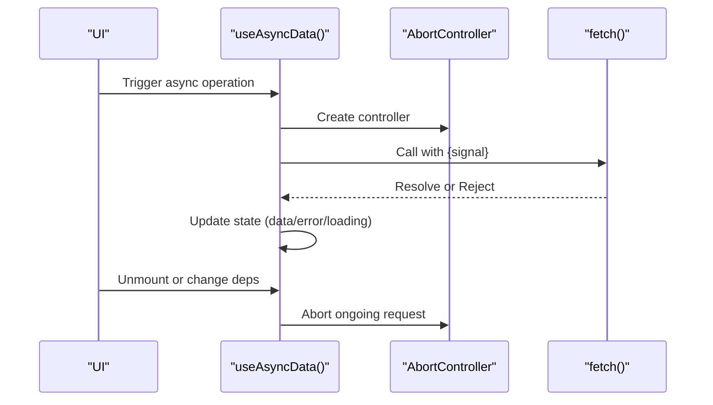

**Diagram sources**
- [async.ts:368-395](file://src/content/errors/async.ts#L368-L395)

**Section sources**
- [async.ts:28-412](file://src/content/errors/async.ts#L28-L412)

### Common JavaScript Errors
This guide explains the most frequent runtime errors and defensive programming patterns:
- TypeError: Cannot read properties of undefined/null: Defensive checks, optional chaining, nullish coalescing, and guard clauses.
- ReferenceError: Variable is not defined: Scope awareness, linting, and TypeScript to prevent typos.
- TypeError: Cannot read property of null: Similar to undefined with explicit null handling.
- SyntaxError: Parser-level errors: Linters, formatters, and guarded JSON parsing.
- Array index out of bounds: Length checks, destructuring defaults, and optional chaining.
- Unexpected token errors: Correct usage of await, commas, and spread syntax.
- Debug strategy and prevention: Systematic reproduction, DevTools usage, and proactive safeguards.

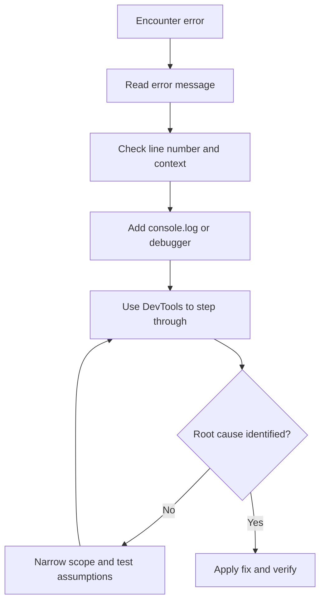

**Diagram sources**
- [debugging.ts:177-188](file://src/content/errors/debugging.ts#L177-L188)

**Section sources**
- [common.ts:28-312](file://src/content/errors/common.ts#L28-L312)
- [debugging.ts:29-280](file://src/content/errors/debugging.ts#L29-L280)

### DOM & React Errors
This guide addresses DOM and React-specific pitfalls:
- Null element access: Ensures DOM readiness and defensive checks.
- Missing keys in lists: Enforces unique, stable keys and warns against index misuse.
- Mutating state directly: Encourages immutable updates and nested updates.
- Incorrect useEffect dependencies: Covers empty deps, full deps, and cleanup.
- Ref misuse: Distinguishes imperative DOM access from state management.
- Event listener leaks: Requires cleanup in effects and event handlers.
- React key warnings: Reinforces the importance of unique keys.

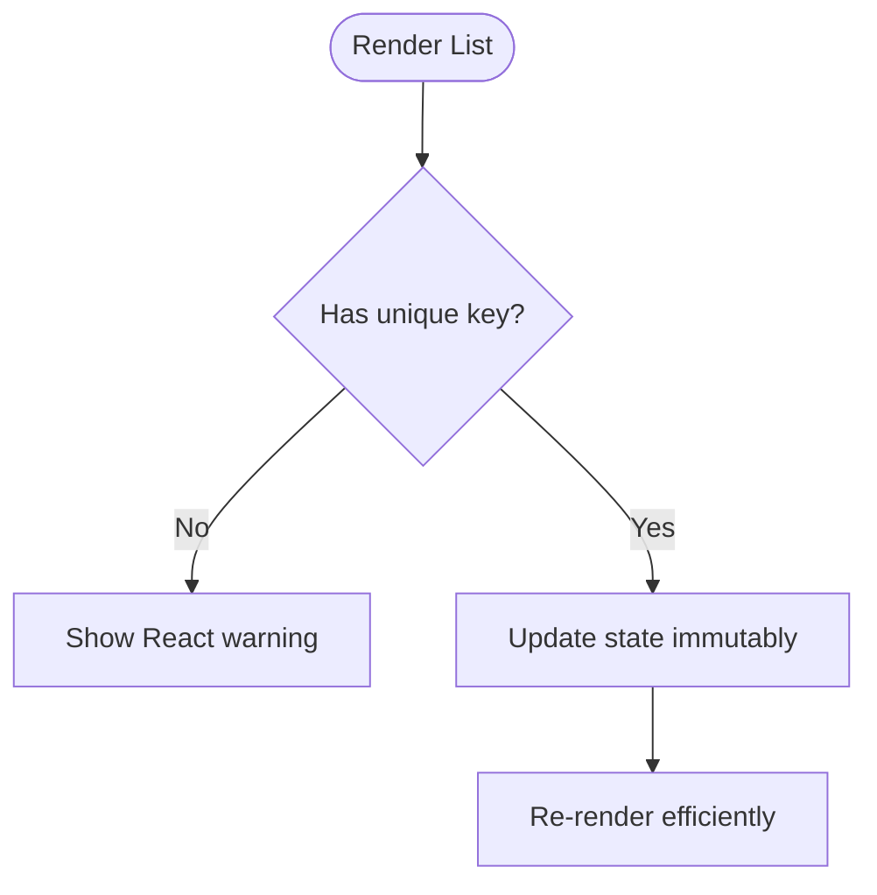

**Diagram sources**
- [dom.ts:75-113](file://src/content/errors/dom.ts#L75-L113)

**Section sources**
- [dom.ts:28-369](file://src/content/errors/dom.ts#L28-L369)

### Debugging Techniques
This guide provides practical debugging strategies and tool usage:
- Console methods: Structured logging, timing, grouping, and assertions.
- DevTools: Breakpoints, stepping, Network tab inspection, Elements inspector, and Performance profiling.
- Debugging strategy: Reproduce, isolate, hypothesize, test, iterate, and verify.
- Common patterns: Narrowing, assumption checks, before/after logging, async logging, type checks, and minimal repro.
- Remote debugging: Source maps, error tracking services, remote logging, feature flags, and user-accessible toggles.

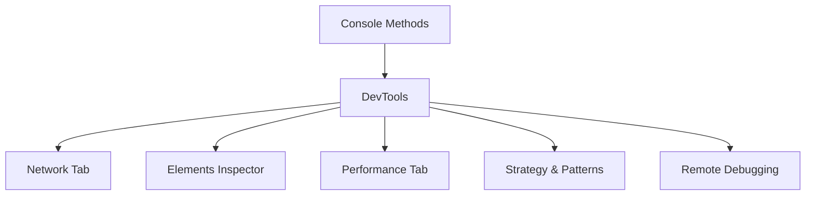

**Diagram sources**
- [debugging.ts:30-279](file://src/content/errors/debugging.ts#L30-L279)

**Section sources**
- [debugging.ts:29-280](file://src/content/errors/debugging.ts#L29-L280)

### Error Handling Fundamentals
This lesson consolidates error handling best practices:
- try/catch/finally: Proper usage, nested handling, and re-throwing unknown errors.
- Error object: Message, name, stack, and cause chaining.
- Throwing errors: Prefer Error objects, guard clauses, and meaningful messages.
- Built-in error types: Classification and examples.
- Custom error classes: Domain-specific errors with additional context.
- Error hierarchy pattern: Operational vs programmer errors and JSON serialization.
- Async error handling: Promise.catch, async/await try/catch, Promise.allSettled.
- Global error handlers: Browser and Node.js handlers for uncaught exceptions and unhandled rejections.
- Retry pattern: Simple and exponential backoff with jitter.
- Safe wrappers: Result tuples, safe JSON parse, and fallback wrappers.
- React error boundaries: Catching render-time errors and logging to monitoring services.
- Error logging & monitoring: Structured payloads, context, and production reporting.
- Common mistakes and best practices: Avoid swallowing, broad catching, and flow-control try/catch.

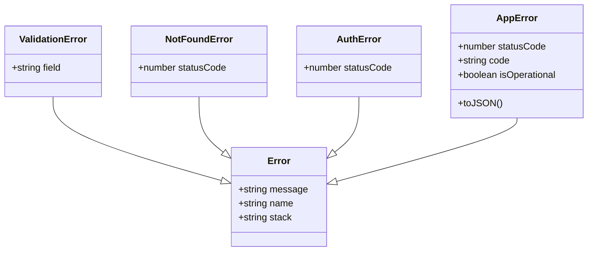

**Diagram sources**
- [error-handling.ts:224-343](file://src/content/learn/fundamentals/error-handling.ts#L224-L343)

**Section sources**
- [error-handling.ts:37-712](file://src/content/learn/fundamentals/error-handling.ts#L37-L712)

### Error Page Renderer
The ErrorPage component orchestrates the display of error guides:
- Resolves full slug from route params.
- Retrieves metadata and loads content via content utilities.
- Renders headings, breadcrumbs, actions, and related topics.
- Displays error type badge and solutions summary.
- Integrates with the toast system for user feedback.

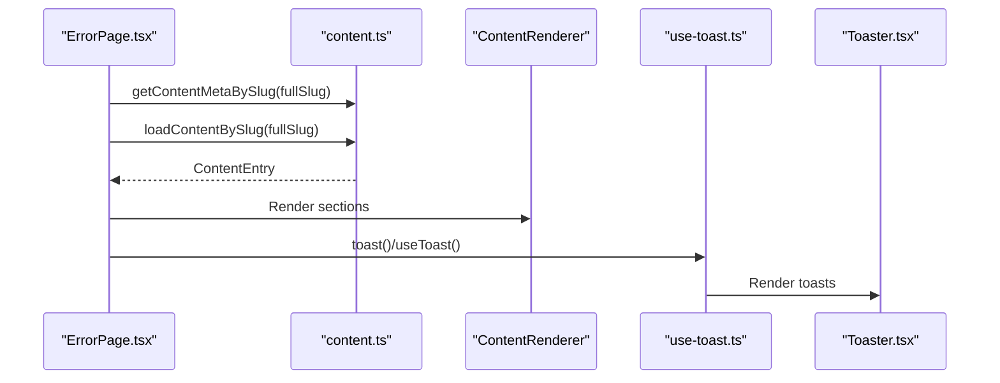

**Diagram sources**
- [ErrorPage.tsx:19-93](file://src/features/errors/ErrorPage.tsx#L19-L93)
- [content.ts:30-42](file://src/lib/content.ts#L30-L42)
- [use-toast.ts:166-184](file://src/hooks/use-toast.ts#L166-L184)
- [toaster.tsx:4-23](file://src/components/ui/toaster.tsx#L4-L23)

**Section sources**
- [ErrorPage.tsx:19-93](file://src/features/errors/ErrorPage.tsx#L19-L93)
- [content.ts:121-125](file://src/lib/content.ts#L121-L125)

### Error Boundary
The ErrorBoundary provides a fallback UI when rendering errors occur:
- Captures errors via getDerivedStateFromError and componentDidCatch.
- Offers reload and navigation actions.
- Prevents full page crashes and improves resilience.

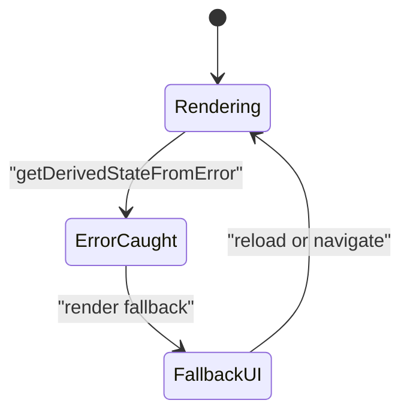

**Diagram sources**
- [ErrorBoundary.tsx:16-64](file://src/components/error-boundary/ErrorBoundary.tsx#L16-L64)

**Section sources**
- [ErrorBoundary.tsx:16-64](file://src/components/error-boundary/ErrorBoundary.tsx#L16-L64)

## Dependency Analysis
The Errors Pilar relies on a small set of cohesive dependencies:
- ErrorPage depends on content utilities for slug resolution and content loading.
- ErrorPage composes UI elements (breadcrumbs, headings, actions) and integrates with the toast system.
- ErrorPage wraps children in an ErrorBoundary to protect rendering.
- Error guides are authored as content entries and rendered by the same pipeline.

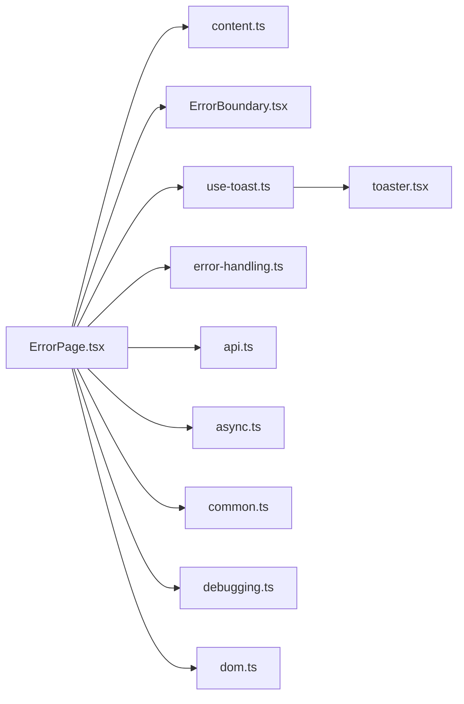

**Diagram sources**
- [ErrorPage.tsx:19-93](file://src/features/errors/ErrorPage.tsx#L19-L93)
- [content.ts:30-42](file://src/lib/content.ts#L30-L42)
- [ErrorBoundary.tsx:31-62](file://src/components/error-boundary/ErrorBoundary.tsx#L31-L62)
- [use-toast.ts:166-184](file://src/hooks/use-toast.ts#L166-L184)
- [toaster.tsx:4-23](file://src/components/ui/toaster.tsx#L4-L23)
- [error-handling.ts:3-35](file://src/content/learn/fundamentals/error-handling.ts#L3-L35)
- [api.ts:3-20](file://src/content/errors/api.ts#L3-L20)
- [async.ts:3-20](file://src/content/errors/async.ts#L3-L20)
- [common.ts:3-20](file://src/content/errors/common.ts#L3-L20)
- [debugging.ts:3-20](file://src/content/errors/debugging.ts#L3-L20)
- [dom.ts:3-20](file://src/content/errors/dom.ts#L3-L20)

**Section sources**
- [ErrorPage.tsx:19-93](file://src/features/errors/ErrorPage.tsx#L19-L93)
- [content.ts:30-42](file://src/lib/content.ts#L30-L42)

## Performance Considerations
- Minimize blocking operations on the event loop during async processing to avoid UI stalls.
- Use AbortController to cancel stale requests and prevent wasted work.
- Prefer controlled concurrency patterns for parallel operations to balance throughput and resource usage.
- Avoid unnecessary re-renders by ensuring stable keys and immutable state updates.
- Use structured logging and monitoring to detect performance regressions and error spikes.

## Troubleshooting Guide
- Reproduce consistently: Capture steps, inputs, and environment details.
- Inspect the Network tab: Validate URLs, methods, status codes, headers, and bodies.
- Use DevTools: Set breakpoints, step through code, and profile performance.
- Apply defensive patterns: Optional chaining, nullish coalescing, and guard clauses.
- Implement retry logic: Exponential backoff with jitter for transient failures.
- Centralize error handling: Use global handlers and error boundaries as safety nets.
- Log with context: Include user ID, action, input data, and environment info for production debugging.

**Section sources**
- [debugging.ts:177-280](file://src/content/errors/debugging.ts#L177-L280)
- [error-handling.ts:406-446](file://src/content/learn/fundamentals/error-handling.ts#L406-L446)

## Conclusion
The Errors Pilar offers a structured, practical approach to diagnosing and resolving JavaScript errors. By combining authoritative content, robust rendering, and resilient error handling primitives, developers can improve reliability, reduce debugging time, and build more maintainable applications. Adopt the recommended patterns, integrate monitoring, and continuously refine your approach based on real-world incidents.

## Appendices
- Practical examples and code snippet paths are referenced throughout the document to guide implementation and verification.
- Use the toast system to surface actionable feedback during error handling workflows.
- Keep error types and boundaries well-defined to streamline diagnosis and resolution.