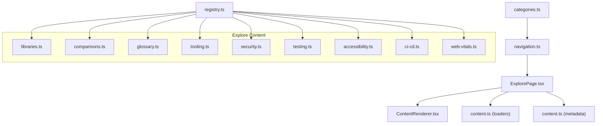
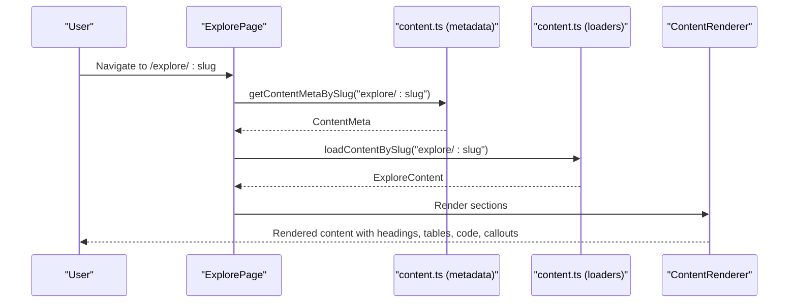
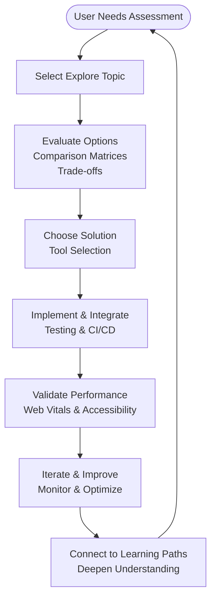
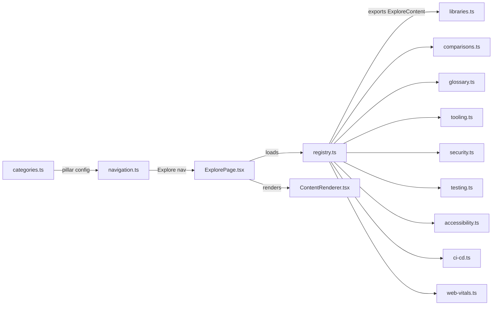

# Explore

<cite>
**Referenced Files in This Document**
- [libraries.ts](file://src/content/explore/libraries.ts)
- [comparisons.ts](file://src/content/explore/comparisons.ts)
- [glossary.ts](file://src/content/explore/glossary.ts)
- [tooling.ts](file://src/content/explore/tooling.ts)
- [security.ts](file://src/content/explore/security.ts)
- [testing.ts](file://src/content/explore/testing.ts)
- [accessibility.ts](file://src/content/explore/accessibility.ts)
- [ci-cd.ts](file://src/content/explore/ci-cd.ts)
- [web-vitals.ts](file://src/content/explore/web-vitals.ts)
- [content.ts](file://src/types/content.ts)
- [categories.ts](file://src/config/categories.ts)
- [navigation.ts](file://src/config/navigation.ts)
- [registry.ts](file://src/content/registry.ts)
- [ExplorePage.tsx](file://src/features/explore/ExplorePage.tsx)
- [ContentRenderer.tsx](file://src/components/content/ContentRenderer.tsx)
- [content.ts](file://src/lib/content.ts)
</cite>

## Table of Contents
1. [Introduction](#introduction)
2. [Project Structure](#project-structure)
3. [Core Components](#core-components)
4. [Architecture Overview](#architecture-overview)
5. [Detailed Component Analysis](#detailed-component-analysis)
6. [Dependency Analysis](#dependency-analysis)
7. [Performance Considerations](#performance-considerations)
8. [Troubleshooting Guide](#troubleshooting-guide)
9. [Conclusion](#conclusion)
10. [Appendices](#appendices)

## Introduction
Explore Pilar is the discovery hub of JSphere, designed to accelerate professional growth through curated, evaluative, and actionable guidance across the JavaScript ecosystem. It focuses on:
- Discovery-first architecture: directories, comparisons, glossaries, and curated resources
- Evaluation criteria: side-by-side comparisons, feature matrices, and practical trade-off discussions
- Professional development: tooling, security, testing, accessibility, CI/CD, and performance
- Learning alignment: contextual recommendations that connect exploration to structured learning paths

Explore Pilar organizes content into coherent pillars and categories, enabling users to navigate from “What should I use?” to “How do I implement and maintain it?”

## Project Structure
Explore Pilar’s content is authored as structured ExploreContent entries and rendered by a dedicated page and renderer. The content is registered centrally and discoverable via navigation and metadata.

**Diagram sources**
- [registry.ts:142-152](file://src/content/registry.ts#L142-L152)
- [ExplorePage.tsx:17-81](file://src/features/explore/ExplorePage.tsx#L17-L81)
- [ContentRenderer.tsx:29-156](file://src/components/content/ContentRenderer.tsx#L29-L156)
- [navigation.ts:235-261](file://src/config/navigation.ts#L235-L261)
- [categories.ts:66-74](file://src/config/categories.ts#L66-L74)

**Section sources**
- [registry.ts:142-152](file://src/content/registry.ts#L142-L152)
- [ExplorePage.tsx:17-81](file://src/features/explore/ExplorePage.tsx#L17-L81)
- [ContentRenderer.tsx:29-156](file://src/components/content/ContentRenderer.tsx#L29-L156)
- [navigation.ts:235-261](file://src/config/navigation.ts#L235-L261)
- [categories.ts:66-74](file://src/config/categories.ts#L66-L74)

## Core Components
ExploreContent defines a uniform structure for all discovery topics, enabling consistent rendering, navigation, and metadata handling.

Key fields:
- Identity: id, title, description, slug, pillar, category, tags
- Categorization: contentType (library, glossary, comparison), difficulty, readingTime, order, updatedAt
- Presentation: summary, keywords, featured, relatedTopics
- Content: sections (structured blocks), items (directory entries)
- Directory entries: name, description, url (optional)

Rendering pipeline:
- ExplorePage resolves metadata and content by slug
- ContentRenderer renders structured blocks (headings, paragraphs, code, lists, callouts, tables)
- Optional directory grid displays curated items

**Section sources**
- [content.ts:134-138](file://src/types/content.ts#L134-L138)
- [ExplorePage.tsx:17-81](file://src/features/explore/ExplorePage.tsx#L17-L81)
- [ContentRenderer.tsx:29-156](file://src/components/content/ContentRenderer.tsx#L29-L156)

## Architecture Overview
Explore Pilar follows a content-first architecture:
- Authoring: Each topic is a strongly-typed ExploreContent module exporting a single object
- Registration: registry.ts aggregates all ExploreContent entries
- Discovery: navigation.ts and categories.ts expose Explore as a navigable pillar
- Rendering: ExplorePage composes metadata, content, and directory entries; ContentRenderer interprets structured blocks
- Navigation: prev/next traversal within the Explore pillar

**Diagram sources**
- [ExplorePage.tsx:17-81](file://src/features/explore/ExplorePage.tsx#L17-L81)
- [content.ts:30-42](file://src/lib/content.ts#L30-L42)
- [ContentRenderer.tsx:29-156](file://src/components/content/ContentRenderer.tsx#L29-L156)

## Detailed Component Analysis

### JavaScript Libraries Directory
Purpose: Curated directory of essential JavaScript libraries and frameworks, organized by category with evaluation matrices and code examples.

Highlights:
- UI frameworks comparison (approach, bundle size, learning curve, best for)
- State management libraries (patterns, bundle sizes, React-specific notes)
- Data fetching and caching (TanStack Query, SWR)
- Routing options (client-side, type-safe, SSR)
- Styling approaches (utility-first CSS, CSS-in-JS, headless UI)
- Form handling (React Hook Form, Formik)
- Animation and motion (Framer Motion, React Spring, GSAP)
- Testing libraries (Vitest, Jest, Testing Library, Playwright)
- Utility libraries (lodash, date-fns, Day.js, qs)
- Practical tip: bundle size matters

Recommendation algorithm:
- Match use-case to best-for column
- Consider bundle impact and ecosystem fit
- Prefer libraries aligned with project stack and team expertise

Evaluation criteria:
- Bundle size (impact on LCP/INP)
- Learning curve (team velocity)
- Ecosystem maturity and maintenance
- Community support and documentation quality

**Section sources**
- [libraries.ts:3-215](file://src/content/explore/libraries.ts#L3-L215)

### Glossary
Purpose: Comprehensive glossary of JavaScript terminology, progressing from core language to runtime, async patterns, OOP/prototypes, and modern APIs.

Structure:
- Core language: closure, hoisting, scope, destructuring, TDZ, strict mode
- Runtime & environment: event loop, call stack, execution context, garbage collection
- Async patterns: Promise, callback, async/await, generator, Proxy
- Modern APIs & patterns: Web Worker, Service Worker, WeakMap/WeakSet, Symbol

Learning path guidance:
- Progress from foundational terms to runtime mechanics
- Async patterns build on core understanding
- Modern APIs extend traditional patterns

**Section sources**
- [glossary.ts:3-199](file://src/content/explore/glossary.ts#L3-L199)

### Comparisons
Purpose: Side-by-side comparisons of commonly confused JavaScript concepts and tools to clarify differences and usage contexts.

Examples:
- var vs let vs const (scope, hoisting, reassignment, redeclaration)
- == vs === (coercion, strictness, Object.is())
- map() vs forEach() (transformation vs side effects)
- null vs undefined (intent vs uninitialized, nullish coalescing)
- for...in vs for...of (keys vs values, inherited properties)
- Promise.all vs allSettled vs race vs any (settlement strategies)
- Spread (...) vs Rest (...) (expansion vs collection)
- fetch vs axios (bundle size, error handling, interceptors)
- debounce vs throttle (rate-limiting strategies)
- Shallow copy vs deep copy (references, cloning methods)
- Event bubbling vs capturing (flow phases, propagation)

Best practices highlighted:
- Default to const; use let only when reassignment is needed
- Prefer === unless intentional coercion
- Use map() for transformations; forEach() for side effects
- Use nullish coalescing (??) for explicit absence
- Choose Promise combinators based on desired failure behavior

**Section sources**
- [comparisons.ts:3-400](file://src/content/explore/comparisons.ts#L3-L400)

### Developer Tooling
Purpose: Master the JavaScript developer toolchain—build tools, linters, formatters, testing frameworks, package managers, and development environments.

Highlights:
- Build tools: Vite, esbuild, Webpack, Turbolinks, Rollup, Parcel
- Package managers: npm, pnpm, Yarn Berry, Bun
- Code quality: ESLint (flat config), Prettier, TypeScript
- Testing frameworks: Vitest, Jest, Playwright, Cypress, Testing Library
- Git hooks & CI/CD: Husky, lint-staged, CI pipeline order
- Browser DevTools: console.table, profiles, performance tips

Recommendation algorithm:
- Select build tool based on project type and HMR needs
- Choose package manager based on speed and monorepo support
- Combine ESLint + Prettier for logic vs style separation
- Pick testing tools aligned with project stack and testing pyramid

**Section sources**
- [tooling.ts:3-255](file://src/content/explore/tooling.ts#L3-L255)

### Security Best Practices
Purpose: Comprehensive guide to JavaScript security—XSS prevention, CSRF protection, CSP, input sanitization, dependency auditing, and OWASP top vulnerabilities.

Key areas:
- XSS prevention: escaping, textContent, DOMPurify, CSP
- CSRF protection: tokens, validation, headers
- CSP: directives, reporting, browser restrictions
- Input validation & sanitization: patterns, parameterized queries
- Dependency management & auditing: npm audit, pruning, updates
- Secure authentication: hashing, secure cookies, environment variables
- OWASP Top 10: risk rankings and prevention strategies
- Security checklist: practical enforcement steps

**Section sources**
- [security.ts:3-463](file://src/content/explore/security.ts#L3-L463)

### Testing Methodologies
Purpose: Explore JavaScript testing frameworks, strategies, and best practices for unit, integration, and end-to-end testing.

Highlights:
- Testing pyramid: unit (fast), integration (medium), E2E (slow)
- Unit testing with Vitest: examples, mocks, spies
- Component testing with Testing Library: user-centric testing
- Integration testing: multi-component interactions, mocking
- E2E testing with Playwright: cross-browser, multi-page flows
- Best practices: organization, coverage goals, CI integration

Recommendation algorithm:
- Prioritize unit tests for pure functions and small units
- Use component tests for UI behavior
- Limit E2E tests to critical user journeys
- Adopt mocking strategies appropriate to each layer

**Section sources**
- [testing.ts:3-468](file://src/content/explore/testing.ts#L3-L468)

### Accessibility Guidelines
Purpose: Build inclusive web applications accessible to all users including those with disabilities.

Highlights:
- Semantic HTML foundation: native elements over generic divs
- ARIA roles and attributes: dialogs, alerts, status, live regions
- Keyboard navigation: arrow keys, Home/End, Enter/Space, Escape
- Screen reader support: announcements, skip links, ARIA labels
- Color contrast & visual accessibility: WCAG AA/AAA, reduced motion, high contrast
- Testing for accessibility: jest-axe, Testing Library assertions
- WCAG compliance checklist: practical enforcement

Recommendation algorithm:
- Prefer semantic HTML; add ARIA only when necessary
- Ensure sufficient color contrast and alternative text
- Provide keyboard access and focus management
- Announce dynamic content changes for assistive technologies

**Section sources**
- [accessibility.ts:3-602](file://src/content/explore/accessibility.ts#L3-L602)

### CI/CD Pipelines
Purpose: Learn continuous integration and deployment strategies for JavaScript applications using GitHub Actions and other platforms.

Highlights:
- GitHub Actions fundamentals: triggers, jobs, steps, matrix builds
- Build & deployment workflow: artifacts, SSH deployment, service restarts
- Pull request checks: lint, format, type check, tests, bundle size
- Environment management: secrets, environments, multi-environment deployments
- Scheduled tasks & maintenance: dependency audits, performance tests
- Deployment strategies: blue-green, canary, rolling, shadow
- Secrets best practices: rotation, least privilege, OIDC

Recommendation algorithm:
- Automate fastest checks first (lint → type check → unit tests)
- Use environment-specific secrets and configuration
- Choose deployment strategy based on risk tolerance and rollback needs

**Section sources**
- [ci-cd.ts:3-461](file://src/content/explore/ci-cd.ts#L3-L461)

### Web Performance Metrics (Web Vitals)
Purpose: Measure and optimize web performance with Core Web Vitals (LCP, INP, CLS), plus modern optimization techniques.

Highlights:
- Core Web Vitals: LCP (< 2.5s), INP (< 200ms), CLS (< 0.1)
- LCP optimization: server response time, render-blocking resources, lazy loading, modern image formats, font-display
- INP optimization: breaking long tasks, web workers, deferring non-critical updates, React startTransition
- CLS optimization: reserved space, fixed positioning, avoiding layout-affecting properties
- Other metrics: FID (replaced by INP), TTFB, FCP
- Monitoring: web-vitals library, RUM, performance budgets
- Tools & resources: Lighthouse, PageSpeed Insights, WebPageTest, Sentry

Recommendation algorithm:
- Prioritize LCP for perceived performance, then INP for responsiveness, then CLS for stability
- Apply optimization techniques progressively, measuring impact with web-vitals
- Establish performance budgets and monitor in production

**Section sources**
- [web-vitals.ts:3-522](file://src/content/explore/web-vitals.ts#L3-L522)

### Conceptual Overview
Explore Pilar bridges discovery and learning by:
- Presenting curated, evaluative content (directories, comparisons, glossaries)
- Linking to related topics and structured learning paths
- Providing practical examples and implementation guidance
- Aligning recommendations with professional needs (tool selection, security, testing, accessibility, performance)

[No sources needed since this diagram shows conceptual workflow, not actual code structure]

## Dependency Analysis
Explore Pilar’s content is registered centrally and consumed by the Explore page and renderer.

**Diagram sources**
- [registry.ts:142-152](file://src/content/registry.ts#L142-L152)
- [ExplorePage.tsx:17-81](file://src/features/explore/ExplorePage.tsx#L17-L81)
- [ContentRenderer.tsx:29-156](file://src/components/content/ContentRenderer.tsx#L29-L156)
- [navigation.ts:235-261](file://src/config/navigation.ts#L235-L261)
- [categories.ts:66-74](file://src/config/categories.ts#L66-L74)

**Section sources**
- [registry.ts:142-152](file://src/content/registry.ts#L142-L152)
- [ExplorePage.tsx:17-81](file://src/features/explore/ExplorePage.tsx#L17-L81)
- [ContentRenderer.tsx:29-156](file://src/components/content/ContentRenderer.tsx#L29-L156)
- [navigation.ts:235-261](file://src/config/navigation.ts#L235-L261)
- [categories.ts:66-74](file://src/config/categories.ts#L66-L74)

## Performance Considerations
- Explore content is authored as static modules and loaded on demand, minimizing runtime overhead
- ContentRenderer groups blocks into sections for efficient rendering and smooth scrolling
- Directory grids are optimized for readability and touch-friendly layouts
- Recommendations emphasize performance-aligned choices (e.g., bundle size, LCP/INP/CLS targets)

[No sources needed since this section provides general guidance]

## Troubleshooting Guide
Common issues and resolutions:
- Explore page not found: verify slug exists in metadata and registry
- Missing content blocks: ensure sections include headings, paragraphs, code, lists, callouts, or tables
- Navigation inconsistencies: confirm order and relatedTopics fields align with intended flow
- CI/CD failures: validate workflow syntax, secrets availability, and environment configuration

**Section sources**
- [ExplorePage.tsx:24-35](file://src/features/explore/ExplorePage.tsx#L24-L35)
- [content.ts:121-125](file://src/lib/content.ts#L121-L125)
- [ci-cd.ts:59-100](file://src/content/explore/ci-cd.ts#L59-L100)

## Conclusion
Explore Pilar provides a discovery-first, evaluation-driven pathway for JavaScript professionals. By combining curated directories, comparisons, glossaries, and practical guides, it supports informed decision-making across tooling, security, testing, accessibility, CI/CD, and performance. Its integration with structured learning ensures that exploration naturally transitions into deeper understanding and skill-building.

[No sources needed since this section summarizes without analyzing specific files]

## Appendices
- Content types and metadata: ExploreContent, ContentBlock union, ContentMeta, and related types
- Navigation and categories: Explore pillar configuration and sidebar groups
- Rendering: ContentRenderer handles headings, paragraphs, code, lists, callouts, and tables

**Section sources**
- [content.ts:134-138](file://src/types/content.ts#L134-L138)
- [navigation.ts:235-261](file://src/config/navigation.ts#L235-L261)
- [categories.ts:66-74](file://src/config/categories.ts#L66-L74)
- [ContentRenderer.tsx:29-156](file://src/components/content/ContentRenderer.tsx#L29-L156)