# Integrations

<cite>
**Referenced Files in This Document**
- [IntegrationPage.tsx](file://src/features/integrations/IntegrationPage.tsx)
- [rest-apis.ts](file://src/content/integrations/rest-apis.ts)
- [oauth.ts](file://src/content/integrations/oauth.ts)
- [stripe.ts](file://src/content/integrations/stripe.ts)
- [firebase.ts](file://src/content/integrations/firebase.ts)
- [openai.ts](file://src/content/integrations/openai.ts)
- [telegram.ts](file://src/content/integrations/telegram.ts)
- [youtube.ts](file://src/content/integrations/youtube.ts)
- [graphql.ts](file://src/content/integrations/graphql.ts)
- [realtime.ts](file://src/content/integrations/realtime.ts)
- [push-notifications.ts](file://src/content/integrations/push-notifications.ts)
- [webrtc.ts](file://src/content/integrations/webrtc.ts)
- [auth-flows.ts](file://src/content/integrations/auth-flows.ts)
- [content.ts](file://src/types/content.ts)
</cite>

## Table of Contents
1. [Introduction](#introduction)
2. [Project Structure](#project-structure)
3. [Core Components](#core-components)
4. [Architecture Overview](#architecture-overview)
5. [Detailed Component Analysis](#detailed-component-analysis)
6. [Dependency Analysis](#dependency-analysis)
7. [Performance Considerations](#performance-considerations)
8. [Troubleshooting Guide](#troubleshooting-guide)
9. [Conclusion](#conclusion)
10. [Appendices](#appendices)

## Introduction
This document is the Integrations Pilar for JSphere. It consolidates practical, production-focused guidance for integrating external services and systems in JavaScript applications. It covers REST APIs, OAuth authentication flows, payment processing (Stripe), cloud services (Firebase), AI services (OpenAI), media APIs (YouTube), messaging platforms (Telegram), GraphQL, real-time communication, push notifications, and WebRTC. For each integration area, it explains architecture, security considerations, authentication methods, error handling strategies, setup procedures, configuration requirements, environment-specific considerations, testing approaches, and production deployment guidance. It also provides best practices for secure communication, rate limiting, and graceful degradation, along with guidance on choosing appropriate integration methods and managing dependencies.

## Project Structure
JSphere organizes integration guides as structured content entries with metadata and sections. The IntegrationPage view renders these entries into a documentation layout, extracting headings, navigation, and related topics. Integration content is authored as TypeScript modules exporting a typed IntegrationContent object.

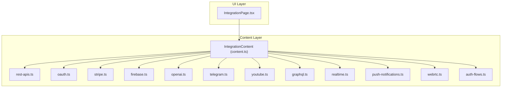

**Diagram sources**
- [IntegrationPage.tsx:19-92](file://src/features/integrations/IntegrationPage.tsx#L19-L92)
- [content.ts:103-111](file://src/types/content.ts#L103-L111)
- [rest-apis.ts:3-318](file://src/content/integrations/rest-apis.ts#L3-L318)
- [oauth.ts:3-322](file://src/content/integrations/oauth.ts#L3-L322)
- [stripe.ts:3-371](file://src/content/integrations/stripe.ts#L3-L371)
- [firebase.ts:3-615](file://src/content/integrations/firebase.ts#L3-L615)
- [openai.ts:3-537](file://src/content/integrations/openai.ts#L3-L537)
- [telegram.ts:3-310](file://src/content/integrations/telegram.ts#L3-L310)
- [youtube.ts:3-376](file://src/content/integrations/youtube.ts#L3-L376)
- [graphql.ts:3-502](file://src/content/integrations/graphql.ts#L3-L502)
- [realtime.ts:3-312](file://src/content/integrations/realtime.ts#L3-L312)
- [push-notifications.ts:3-607](file://src/content/integrations/push-notifications.ts#L3-L607)
- [webrtc.ts:3-655](file://src/content/integrations/webrtc.ts#L3-L655)
- [auth-flows.ts:3-326](file://src/content/integrations/auth-flows.ts#L3-L326)

**Section sources**
- [IntegrationPage.tsx:19-92](file://src/features/integrations/IntegrationPage.tsx#L19-L92)
- [content.ts:103-111](file://src/types/content.ts#L103-L111)

## Core Components
- IntegrationContent: Defines metadata, setup steps, authentication notes, required libraries, and sections for each integration guide.
- IntegrationPage: Renders integration content into a documentation layout, including SEO, breadcrumbs, navigation, and related topics.

Key responsibilities:
- IntegrationContent: Provides structured, typed content for rendering and discovery.
- IntegrationPage: Handles routing by slug, loading content, extracting headings for TOC, and rendering UI blocks.

**Section sources**
- [content.ts:103-111](file://src/types/content.ts#L103-L111)
- [IntegrationPage.tsx:19-92](file://src/features/integrations/IntegrationPage.tsx#L19-L92)

## Architecture Overview
The Integrations Pilar follows a content-driven architecture:
- Content authors define integration guides as typed modules.
- The runtime loads the appropriate content module based on the URL slug.
- The IntegrationPage composes metadata, headings, and rendered sections into a cohesive documentation experience.

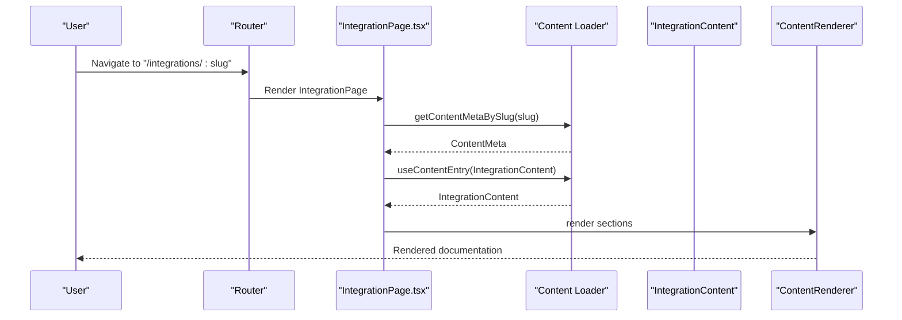

**Diagram sources**
- [IntegrationPage.tsx:20-24](file://src/features/integrations/IntegrationPage.tsx#L20-L24)
- [content.ts:103-111](file://src/types/content.ts#L103-L111)

## Detailed Component Analysis

### REST APIs
- Purpose: Master REST consumption patterns, including type-safe clients, authentication, pagination, cancellation, and TanStack Query integration.
- Key patterns:
  - ApiClient with request helpers for GET/POST/PUT/PATCH/DELETE.
  - URL building with URLSearchParams.
  - Authentication via headers (Bearer, API key, Basic).
  - Pagination strategies (offset and cursor-based).
  - Request cancellation with AbortController.
  - Error handling with ApiError classification.
  - TanStack Query integration for caching and optimistic updates.
- Security and reliability:
  - Validate response.ok and handle non-2xx statuses.
  - Respect rate limits and implement backoff.
  - Avoid exposing credentials to third-party origins.
- Testing and deployment:
  - Mock fetch in tests; verify error branches and timeouts.
  - Use environment variables for base URLs and keys.
  - Instrument network errors and HTTP errors distinctly.

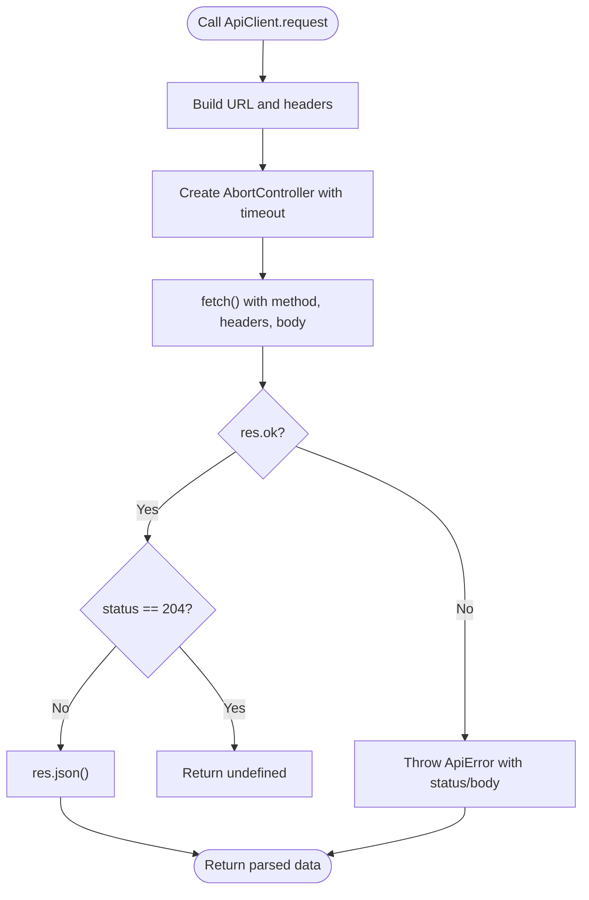

**Diagram sources**
- [rest-apis.ts:57-123](file://src/content/integrations/rest-apis.ts#L57-L123)

**Section sources**
- [rest-apis.ts:3-318](file://src/content/integrations/rest-apis.ts#L3-L318)

### OAuth 2.0
- Purpose: Implement secure OAuth 2.0 flows, focusing on PKCE for SPAs, token management, and security best practices.
- Key patterns:
  - PKCE challenge and verifier generation using crypto APIs.
  - Authorization code flow with state parameter validation.
  - Token exchange and refresh with TokenManager.
  - Authenticated fetch wrapper with automatic refresh.
  - OAuthError class for standardized error handling.
- Security and reliability:
  - Never store client secrets in the frontend.
  - Use short-lived access tokens and refresh tokens.
  - Validate state to prevent CSRF.
  - Store tokens securely (memory for access tokens; httpOnly cookies for refresh tokens).
- Provider-specific notes:
  - Google, GitHub, Microsoft, Discord with supported flows and caveats.

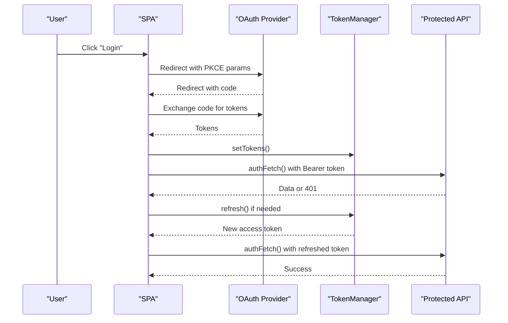

**Diagram sources**
- [oauth.ts:67-145](file://src/content/integrations/oauth.ts#L67-L145)
- [oauth.ts:157-210](file://src/content/integrations/oauth.ts#L157-L210)
- [oauth.ts:213-243](file://src/content/integrations/oauth.ts#L213-L243)

**Section sources**
- [oauth.ts:3-322](file://src/content/integrations/oauth.ts#L3-L322)

### Stripe Payments
- Purpose: Integrate Stripe for secure, PCI-compliant payment processing with Payment Intents, Elements, and webhooks.
- Key patterns:
  - Stripe.js initialization and Elements usage.
  - Server-side PaymentIntent creation with client secret.
  - Client confirmation with Stripe.confirmPayment().
  - Webhook handling for asynchronous confirmation and retries.
  - Subscriptions management and lifecycle events.
  - Error handling with retry logic and idempotency.
- Security and reliability:
  - Never expose secret keys in the frontend.
  - Verify webhook signatures.
  - Use idempotency keys for retries.
  - Enforce HTTPS and sanitize logs.
- Testing and deployment:
  - Use Stripe Test Mode for development.
  - Monitor webhooks and implement dead letter queues.
  - Scale with idempotent operations and exponential backoff.

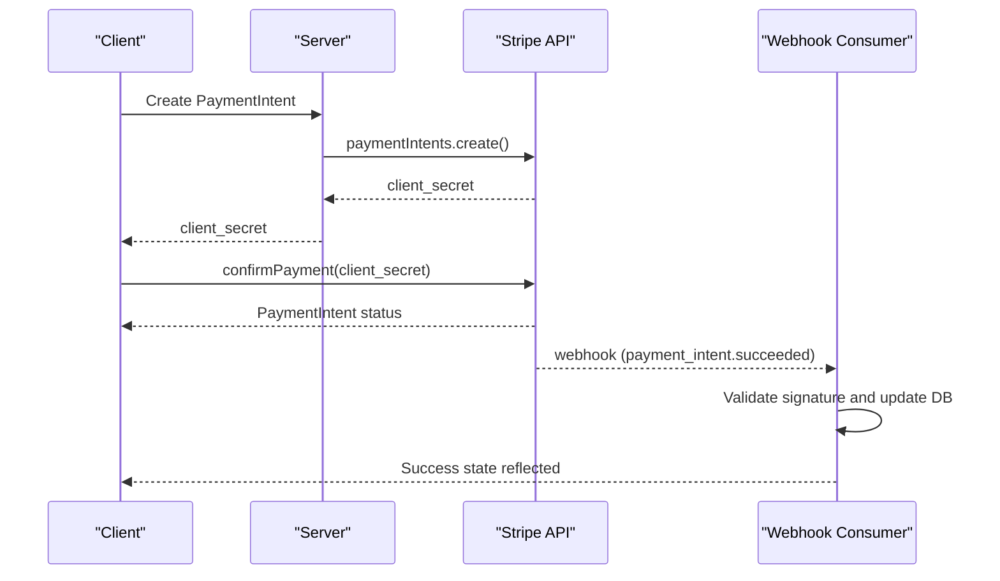

**Diagram sources**
- [stripe.ts:71-87](file://src/content/integrations/stripe.ts#L71-L87)
- [stripe.ts:126-138](file://src/content/integrations/stripe.ts#L126-L138)
- [stripe.ts:169-218](file://src/content/integrations/stripe.ts#L169-L218)

**Section sources**
- [stripe.ts:3-371](file://src/content/integrations/stripe.ts#L3-L371)

### Firebase & BaaS
- Purpose: Build backend-free apps using Firebase services: Authentication, Firestore, Cloud Storage, and Hosting.
- Key patterns:
  - Firebase initialization and offline persistence.
  - Authentication with email/password, Google, and popup flows.
  - Firestore CRUD with queries, ordering, and batching.
  - Real-time listeners with onSnapshot and docChanges.
  - Cloud Storage uploads with progress and deletion.
  - Security rules for access control.
- Security and reliability:
  - Always write security rules before production.
  - Use offline persistence with awareness of multi-tab limitations.
  - Validate data before writes and handle permission-denied errors.
- Testing and deployment:
  - Use emulator suite for local development.
  - Enable IndexedDB persistence on supported browsers.

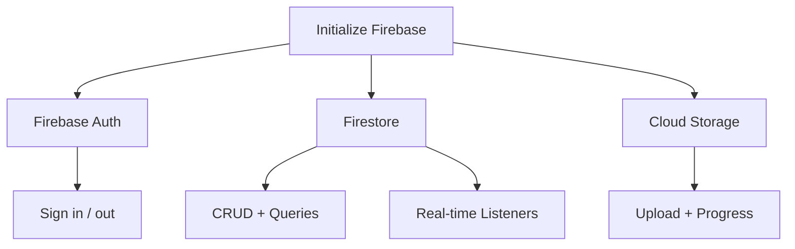

**Diagram sources**
- [firebase.ts:52-58](file://src/content/integrations/firebase.ts#L52-L58)
- [firebase.ts:154-245](file://src/content/integrations/firebase.ts#L154-L245)
- [firebase.ts:260-311](file://src/content/integrations/firebase.ts#L260-L311)
- [firebase.ts:374-431](file://src/content/integrations/firebase.ts#L374-L431)

**Section sources**
- [firebase.ts:3-615](file://src/content/integrations/firebase.ts#L3-L615)

### OpenAI / AI APIs
- Purpose: Integrate OpenAI GPT models, embeddings, streaming, function calling, and cost optimization.
- Key patterns:
  - Backend client initialization with environment variables.
  - Chat completions with system/user/assistant messages.
  - Streaming via Server-Sent Events with incremental UI updates.
  - Function calling with tool definitions and result feeding.
  - Embeddings for semantic search and vector indexing.
  - Token estimation and cost calculation.
  - Rate limiting with queueing and exponential backoff.
- Security and reliability:
  - Never expose API keys in the frontend; proxy via backend.
  - Implement rate limiting and backoff; handle 429 gracefully.
  - Use tiktoken for token estimation; cap output tokens.
- Testing and deployment:
  - Use test endpoints and small models for development.
  - Cache embeddings and search results to reduce cost.

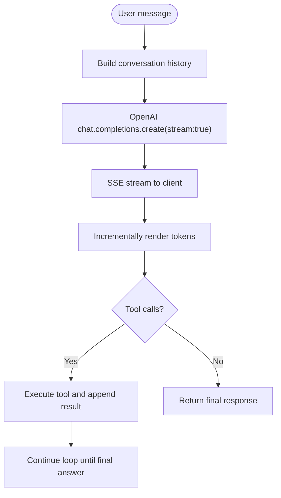

**Diagram sources**
- [openai.ts:129-149](file://src/content/integrations/openai.ts#L129-L149)
- [openai.ts:266-299](file://src/content/integrations/openai.ts#L266-L299)
- [openai.ts:447-491](file://src/content/integrations/openai.ts#L447-L491)

**Section sources**
- [openai.ts:3-537](file://src/content/integrations/openai.ts#L3-L537)

### Telegram Bot API
- Purpose: Build Telegram bots with messaging, commands, inline keyboards, and webhooks.
- Key patterns:
  - Type-safe TelegramBot client with sendMessage, editMessageText, deleteMessage, getUpdates, setWebhook, getMe.
  - Command routing with BotRouter supporting commands and callback queries.
  - Webhook verification with secret token and asynchronous handling.
  - Long polling for development with backoff and offset management.
- Security and reliability:
  - Never expose bot token; use environment variables.
  - Verify webhook secret token; return 200 immediately.
  - Acknowledge callback queries promptly.
- Testing and deployment:
  - Use long polling locally; deploy webhooks in production.
  - Implement rate limiting for user commands.

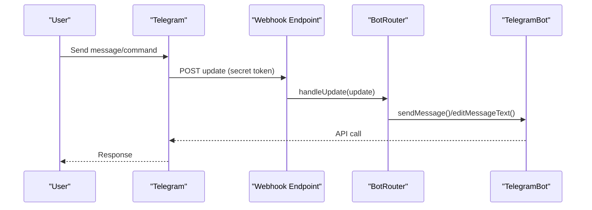

**Diagram sources**
- [telegram.ts:245-260](file://src/content/integrations/telegram.ts#L245-L260)
- [telegram.ts:163-205](file://src/content/integrations/telegram.ts#L163-L205)
- [telegram.ts:63-124](file://src/content/integrations/telegram.ts#L63-L124)

**Section sources**
- [telegram.ts:3-310](file://src/content/integrations/telegram.ts#L3-L310)

### YouTube API
- Purpose: Interact with YouTube Data API for search, metadata, playlists, and OAuth flows.
- Key patterns:
  - YouTubeClient with API key or access token selection.
  - Search videos with pagination and filtering.
  - Retrieve video details and parse durations.
  - OAuth 2.0 for user-specific operations (uploads playlist).
  - React hook for debounced search with caching.
- Security and reliability:
  - Protect API keys and OAuth secrets; never expose in frontend.
  - Respect quota limits and cache results.
  - Handle quota exceeded errors and pagination.
- Testing and deployment:
  - Use test credentials and mock responses in CI.
  - Implement pagination and debouncing for UI performance.

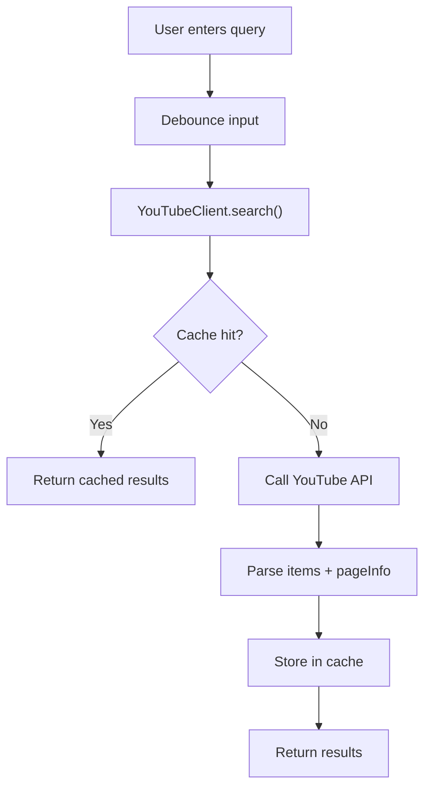

**Diagram sources**
- [youtube.ts:124-147](file://src/content/integrations/youtube.ts#L124-L147)
- [youtube.ts:325-331](file://src/content/integrations/youtube.ts#L325-L331)

**Section sources**
- [youtube.ts:3-376](file://src/content/integrations/youtube.ts#L3-L376)

### GraphQL APIs
- Purpose: Integrate GraphQL with Apollo Client for queries, mutations, subscriptions, caching, and optimistic updates.
- Key patterns:
  - ApolloClient setup with HttpLink and WebSocketLink.
  - Queries with typed variables and cache policies.
  - Mutations with optimistic updates and cache reconciliation.
  - Subscriptions for real-time updates.
  - Cache normalization and custom type policies.
  - Error handling with onError link.
- Security and reliability:
  - Include auth tokens via context or headers.
  - Distinguish network errors vs GraphQL errors.
  - Use cache-first vs cache-and-network appropriately.
- Testing and deployment:
  - Use code generation for types.
  - Implement retry logic for transient network errors.

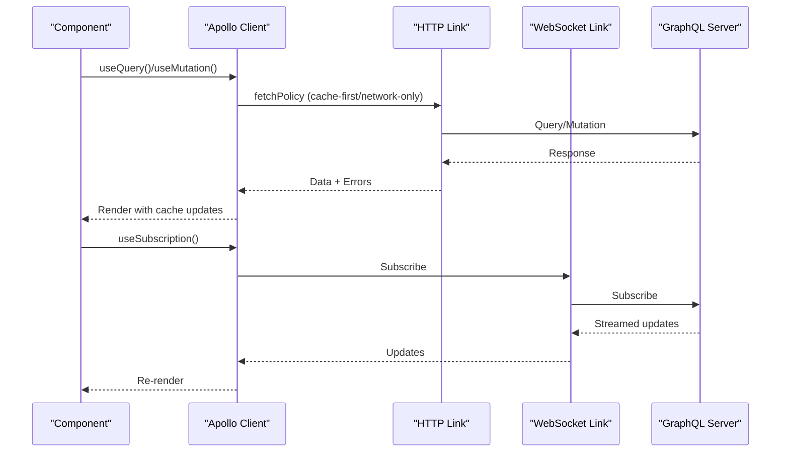

**Diagram sources**
- [graphql.ts:37-62](file://src/content/integrations/graphql.ts#L37-L62)
- [graphql.ts:226-247](file://src/content/integrations/graphql.ts#L226-L247)
- [graphql.ts:250-285](file://src/content/integrations/graphql.ts#L250-L285)

**Section sources**
- [graphql.ts:3-502](file://src/content/integrations/graphql.ts#L3-L502)

### Realtime Systems
- Purpose: Choose and implement transports (WebSocket, SSE, polling) with reconnection, heartbeats, and optimistic UI.
- Key patterns:
  - WebSocket client with exponential backoff, heartbeat, and message queue.
  - React hook for WebSocket with connect/disconnect status.
  - SSE with EventSource and automatic reconnection.
  - Polling with adaptive intervals and change detection.
  - Optimistic UI updates with rollback on failure.
- Security and reliability:
  - Authenticate WebSocket via query param or first message.
  - Use HTTP/2 for multiplexed SSE connections.
  - Handle network failures and resume where possible.
- Testing and deployment:
  - Simulate network flakiness in tests.
  - Tune intervals based on data volatility.

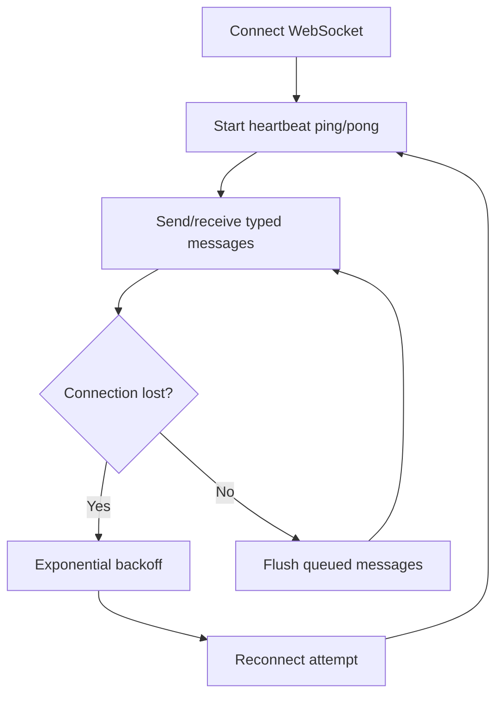

**Diagram sources**
- [realtime.ts:54-105](file://src/content/integrations/realtime.ts#L54-L105)
- [realtime.ts:159-180](file://src/content/integrations/realtime.ts#L159-L180)

**Section sources**
- [realtime.ts:3-312](file://src/content/integrations/realtime.ts#L3-L312)

### Push Notifications
- Purpose: Implement Web Push Notifications with Service Worker, VAPID keys, and server-side delivery.
- Key patterns:
  - Request notification permission and handle denials.
  - Register Service Worker and handle updates.
  - Subscribe to push with VAPID public key.
  - Handle push events and notification interactions.
  - Server-side sending with web-push and VAPID private key.
- Security and reliability:
  - HTTPS required for Service Worker and Push API.
  - Store VAPID private key securely; never expose.
  - Handle 410 (expired subscription) and remove records.
- Testing and deployment:
  - Use localhost for development; deploy HTTPS for production.
  - Implement graceful degradation when unsupported.

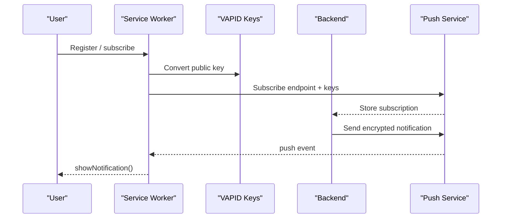

**Diagram sources**
- [push-notifications.ts:106-129](file://src/content/integrations/push-notifications.ts#L106-L129)
- [push-notifications.ts:163-195](file://src/content/integrations/push-notifications.ts#L163-L195)
- [push-notifications.ts:249-330](file://src/content/integrations/push-notifications.ts#L249-L330)
- [push-notifications.ts:352-452](file://src/content/integrations/push-notifications.ts#L352-L452)

**Section sources**
- [push-notifications.ts:3-607](file://src/content/integrations/push-notifications.ts#L3-L607)

### WebRTC & Peer Connections
- Purpose: Build peer-to-peer audio/video/data applications with RTCPeerConnection, ICE, and signaling.
- Key patterns:
  - getUserMedia for local camera/microphone; getDisplayMedia for screen sharing.
  - RTCPeerConnection with ICE servers; offer/answer exchange; ICE candidate handling.
  - Data channels for low-latency messaging and file transfer.
  - Signaling over WebSocket; handle connection states and stats.
- Security and reliability:
  - HTTPS required for getUserMedia/getDisplayMedia.
  - Use secure WebSocket for signaling; configure STUN/TURN servers.
  - Monitor ICE connectivity and adjust bandwidth.
- Testing and deployment:
  - Test behind NAT and with TURN relay.
  - Implement graceful degradation when ICE fails.

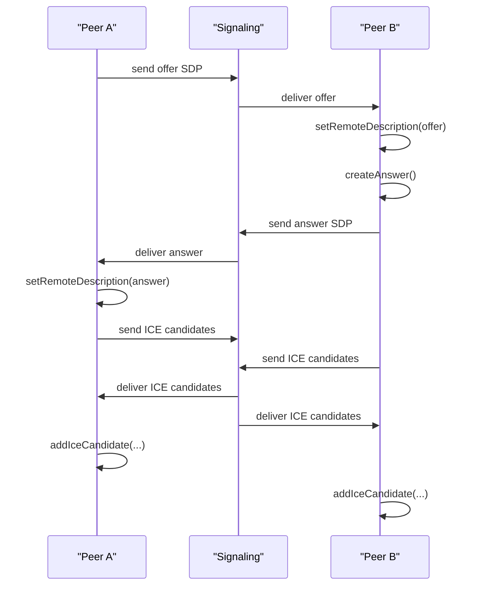

**Diagram sources**
- [webrtc.ts:163-200](file://src/content/integrations/webrtc.ts#L163-L200)
- [webrtc.ts:249-304](file://src/content/integrations/webrtc.ts#L249-L304)
- [webrtc.ts:516-537](file://src/content/integrations/webrtc.ts#L516-L537)

**Section sources**
- [webrtc.ts:3-655](file://src/content/integrations/webrtc.ts#L3-L655)

### Authentication Flows
- Purpose: Implement login, signup, password reset, and protected routes with JWT/session strategies.
- Key patterns:
  - AuthService with login/signup/logout and token refresh scheduling.
  - AuthError class and user-friendly messages.
  - React AuthProvider and protected/admin routes.
  - Password strength validation and reset flow.
- Security and reliability:
  - Store access tokens in memory; refresh tokens in httpOnly cookies.
  - Rate-limit login attempts and enforce password policies.
  - Client-side role checks are UX-only; server enforces authorization.
- Testing and deployment:
  - Mock auth endpoints; simulate token expiry and refresh.
  - Log authentication events for auditing.

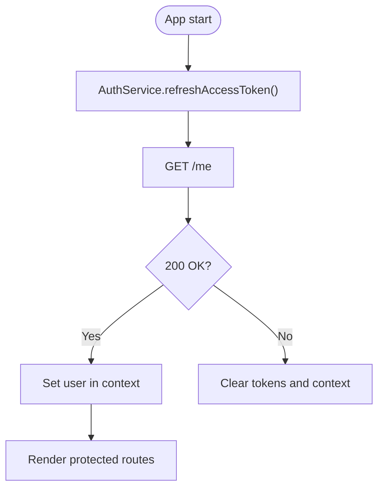

**Diagram sources**
- [auth-flows.ts:170-189](file://src/content/integrations/auth-flows.ts#L170-L189)
- [auth-flows.ts:219-232](file://src/content/integrations/auth-flows.ts#L219-L232)

**Section sources**
- [auth-flows.ts:3-326](file://src/content/integrations/auth-flows.ts#L3-L326)

## Dependency Analysis
- Content typing: IntegrationContent defines the contract for all integration guides, ensuring consistent metadata and sections.
- Rendering pipeline: IntegrationPage depends on content metadata extraction, content loading hooks, and block rendering utilities.
- External service integrations: Each guide encapsulates its own patterns and dependencies (e.g., Stripe SDK, Apollo Client, web-push, webRTC APIs).

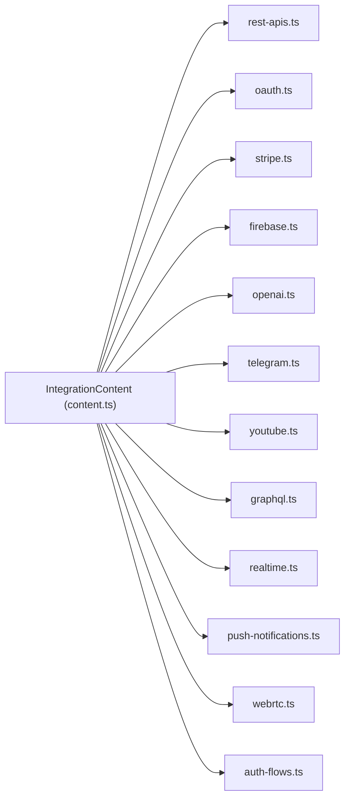

**Diagram sources**
- [content.ts:103-111](file://src/types/content.ts#L103-L111)
- [rest-apis.ts:3](file://src/content/integrations/rest-apis.ts#L3)
- [oauth.ts:3](file://src/content/integrations/oauth.ts#L3)
- [stripe.ts:3](file://src/content/integrations/stripe.ts#L3)
- [firebase.ts:3](file://src/content/integrations/firebase.ts#L3)
- [openai.ts:3](file://src/content/integrations/openai.ts#L3)
- [telegram.ts:3](file://src/content/integrations/telegram.ts#L3)
- [youtube.ts:3](file://src/content/integrations/youtube.ts#L3)
- [graphql.ts:3](file://src/content/integrations/graphql.ts#L3)
- [realtime.ts:3](file://src/content/integrations/realtime.ts#L3)
- [push-notifications.ts:3](file://src/content/integrations/push-notifications.ts#L3)
- [webrtc.ts:3](file://src/content/integrations/webrtc.ts#L3)
- [auth-flows.ts:3](file://src/content/integrations/auth-flows.ts#L3)

**Section sources**
- [content.ts:103-111](file://src/types/content.ts#L103-L111)

## Performance Considerations
- REST APIs
  - Use AbortController to cancel in-flight requests on rapid user input.
  - Implement pagination with concurrency limits for fetching multiple pages.
  - Prefer URLSearchParams for safe query parameter building.
- GraphQL
  - Choose cache policies (cache-first, cache-and-network) based on data volatility.
  - Use optimistic updates to reduce perceived latency.
  - Split HTTP and WebSocket links to reuse connections efficiently.
- Realtime
  - Use exponential backoff for WebSocket reconnection with jitter.
  - Implement adaptive polling intervals based on change frequency.
- Push Notifications
  - Minimize payload sizes; avoid large binary data in push payloads.
  - Use background sync for heavy processing.
- WebRTC
  - Monitor ICE candidate pairs and available bitrate; adjust resolution dynamically.
  - Use TURN only when STUN fails to establish a direct connection.
- AI Services
  - Cache embeddings and search results; use token estimation to budget usage.
  - Implement rate limiting and queueing to respect provider quotas.

[No sources needed since this section provides general guidance]

## Troubleshooting Guide
- REST APIs
  - Symptom: fetch resolves but returns 404/500.
    - Action: Check response.ok and handle non-2xx statuses; inspect error bodies.
  - Symptom: CORS errors.
    - Action: Verify preflight OPTIONS handling and allowed headers/methods.
- OAuth
  - Symptom: CSRF protection triggers.
    - Action: Validate state parameter on callback; ensure same origin.
  - Symptom: 401 after token refresh.
    - Action: Clear token state and prompt re-login; verify refresh endpoint.
- Stripe
  - Symptom: Webhook signature verification fails.
    - Action: Recreate webhook secret; verify signing secret and headers.
  - Symptom: Duplicate charges.
    - Action: Use idempotency keys; deduplicate requests.
- Firebase
  - Symptom: Permission denied.
    - Action: Review Firestore security rules; ensure correct auth UID.
  - Symptom: Offline sync conflicts.
    - Action: Handle docChanges; reconcile optimistic updates.
- OpenAI
  - Symptom: Rate limited.
    - Action: Implement queueing and exponential backoff; respect Retry-After.
  - Symptom: Unexpected token usage.
    - Action: Estimate tokens with tiktoken; adjust prompts and limits.
- Telegram
  - Symptom: Unauthorized webhook.
    - Action: Verify secret token header; return 200 immediately.
  - Symptom: Missing callback acknowledgment.
    - Action: Call answerCallbackQuery; remove loading indicators.
- YouTube
  - Symptom: Quota exceeded.
    - Action: Cache results; reduce request frequency; monitor quota usage.
- GraphQL
  - Symptom: Cache inconsistencies.
    - Action: Use type policies and cache eviction; avoid manual cache writes.
- Realtime
  - Symptom: Frequent reconnections.
    - Action: Tune heartbeat intervals; improve network conditions.
- Push Notifications
  - Symptom: 410 expired subscription.
    - Action: Remove subscription from DB; prompt re-subscribe.
- WebRTC
  - Symptom: No media after offer/answer.
    - Action: Verify ICE candidates; check TURN relay; ensure HTTPS.

**Section sources**
- [rest-apis.ts:253-264](file://src/content/integrations/rest-apis.ts#L253-L264)
- [oauth.ts:245-262](file://src/content/integrations/oauth.ts#L245-L262)
- [stripe.ts:169-218](file://src/content/integrations/stripe.ts#L169-L218)
- [firebase.ts:557-574](file://src/content/integrations/firebase.ts#L557-L574)
- [openai.ts:447-491](file://src/content/integrations/openai.ts#L447-L491)
- [telegram.ts:245-260](file://src/content/integrations/telegram.ts#L245-L260)
- [youtube.ts:325-331](file://src/content/integrations/youtube.ts#L325-L331)
- [graphql.ts:454-488](file://src/content/integrations/graphql.ts#L454-L488)
- [realtime.ts:89-105](file://src/content/integrations/realtime.ts#L89-L105)
- [push-notifications.ts:378-386](file://src/content/integrations/push-notifications.ts#L378-L386)
- [webrtc.ts:520-537](file://src/content/integrations/webrtc.ts#L520-L537)

## Conclusion
The Integrations Pilar provides a comprehensive, production-ready blueprint for connecting JavaScript applications to external services. By following the documented patterns—secure authentication, robust error handling, careful rate limiting, and graceful degradation—you can implement reliable integrations across REST APIs, OAuth, payments, cloud services, AI, media, messaging, GraphQL, real-time communication, push notifications, and WebRTC. Use the provided content modules as authoritative references and adapt them to your environment and requirements.

[No sources needed since this section summarizes without analyzing specific files]

## Appendices
- Choosing an integration method
  - REST APIs: Prefer when you need simple, stateless interactions with minimal overhead.
  - OAuth: Use for third-party identity and delegated access; favor PKCE for SPAs.
  - Payments: Use Stripe for PCI-compliant, hosted checkout with webhooks.
  - Cloud services: Use Firebase for backend-as-a-service with real-time features.
  - AI services: Use OpenAI for chat, embeddings, and function calling with careful rate management.
  - Media APIs: Use YouTube for search/metadata; Telegram for bot interactions.
  - GraphQL: Use when you need precise data fetching, caching, and subscriptions.
  - Realtime: Choose WebSocket for bidirectional, low-latency; SSE for server push; polling for simplicity.
  - Push notifications: Use Web Push for persistent, cross-device alerts.
  - WebRTC: Use for peer-to-peer audio/video and data channels with proper signaling.
- Environment-specific considerations
  - API keys and secrets: Store in environment variables; never commit to source control.
  - HTTPS: Required for WebRTC, Push API, and secure media APIs.
  - Proxies and CDNs: Ensure WebSocket upgrades and SSE compatibility.
  - Rate limits: Respect provider quotas; implement backoff and caching.
- Testing approaches
  - Unit tests: Mock external services; verify error branches and retries.
  - Integration tests: Use emulators or sandbox environments (Stripe Test, Firebase Emulator).
  - E2E tests: Automate user flows (login, payments, notifications).
- Production deployment
  - Observability: Instrument network calls, errors, and performance metrics.
  - Monitoring: Track provider quotas, webhook delivery, and user engagement.
  - Security: Rotate secrets, enforce HTTPS, and review access controls regularly.

[No sources needed since this section provides general guidance]