# Advanced Patterns

<cite>
**Referenced Files in This Document**
- [design-patterns.ts](file://src/content/learn/advanced/design-patterns.ts)
- [execution-context.ts](file://src/content/learn/advanced/execution-context.ts)
- [functional-patterns.ts](file://src/content/learn/advanced/functional-patterns.ts)
- [garbage-collection.ts](file://src/content/learn/advanced/garbage-collection.ts)
- [memory-leaks.ts](file://src/content/learn/advanced/memory-leaks.ts)
- [memory-performance.ts](file://src/content/learn/advanced/memory-performance.ts)
- [prototypes.ts](file://src/content/learn/advanced/prototypes.ts)
- [proxy-reflect.ts](file://src/content/learn/advanced/proxy-reflect.ts)
- [this-keyword.ts](file://src/content/learn/advanced/this-keyword.ts)
- [async-await.ts](file://src/content/learn/async/async-await.ts)
- [functions.ts](file://src/content/learn/fundamentals/functions.ts)
- [scope.ts](file://src/content/learn/fundamentals/scope.ts)
</cite>

## Table of Contents
1. [Introduction](#introduction)
2. [Project Structure](#project-structure)
3. [Core Components](#core-components)
4. [Architecture Overview](#architecture-overview)
5. [Detailed Component Analysis](#detailed-component-analysis)
6. [Dependency Analysis](#dependency-analysis)
7. [Performance Considerations](#performance-considerations)
8. [Troubleshooting Guide](#troubleshooting-guide)
9. [Conclusion](#conclusion)
10. [Appendices](#appendices)

## Introduction
This document synthesizes advanced JavaScript patterns and mechanisms into a cohesive guide for experienced developers. It connects design patterns (singleton, factory, observer), execution context and call stack, functional programming, prototype inheritance, Proxy/Reflect, and the this keyword, with memory management, garbage collection, and performance optimization. It also provides debugging strategies, architectural decision frameworks, and migration guidance for modern and legacy environments.

## Project Structure
The repository organizes advanced topics as modular lessons. The Advanced Patterns content is primarily located under src/content/learn/advanced, with supporting foundational materials in src/content/learn/fundamentals and src/content/learn/async. The lessons are authored as structured content with sections, code examples, and exercises.

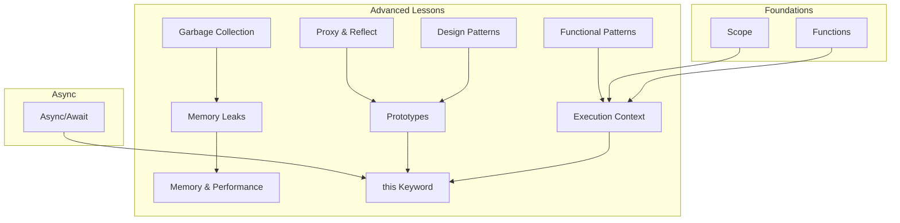

**Diagram sources**
- [design-patterns.ts:1-984](file://src/content/learn/advanced/design-patterns.ts#L1-L984)
- [execution-context.ts:1-415](file://src/content/learn/advanced/execution-context.ts#L1-L415)
- [functional-patterns.ts:1-525](file://src/content/learn/advanced/functional-patterns.ts#L1-L525)
- [garbage-collection.ts:1-564](file://src/content/learn/advanced/garbage-collection.ts#L1-L564)
- [memory-leaks.ts:1-812](file://src/content/learn/advanced/memory-leaks.ts#L1-L812)
- [memory-performance.ts:1-494](file://src/content/learn/advanced/memory-performance.ts#L1-L494)
- [prototypes.ts:1-501](file://src/content/learn/advanced/prototypes.ts#L1-L501)
- [proxy-reflect.ts:1-773](file://src/content/learn/advanced/proxy-reflect.ts#L1-L773)
- [this-keyword.ts:1-511](file://src/content/learn/advanced/this-keyword.ts#L1-L511)
- [functions.ts:1-552](file://src/content/learn/fundamentals/functions.ts#L1-L552)
- [scope.ts:1-485](file://src/content/learn/fundamentals/scope.ts#L1-L485)
- [async-await.ts:1-507](file://src/content/learn/async/async-await.ts#L1-L507)

**Section sources**
- [design-patterns.ts:1-984](file://src/content/learn/advanced/design-patterns.ts#L1-L984)
- [execution-context.ts:1-415](file://src/content/learn/advanced/execution-context.ts#L1-L415)
- [functional-patterns.ts:1-525](file://src/content/learn/advanced/functional-patterns.ts#L1-L525)
- [garbage-collection.ts:1-564](file://src/content/learn/advanced/garbage-collection.ts#L1-L564)
- [memory-leaks.ts:1-812](file://src/content/learn/advanced/memory-leaks.ts#L1-L812)
- [memory-performance.ts:1-494](file://src/content/learn/advanced/memory-performance.ts#L1-L494)
- [prototypes.ts:1-501](file://src/content/learn/advanced/prototypes.ts#L1-L501)
- [proxy-reflect.ts:1-773](file://src/content/learn/advanced/proxy-reflect.ts#L1-L773)
- [this-keyword.ts:1-511](file://src/content/learn/advanced/this-keyword.ts#L1-L511)
- [functions.ts:1-552](file://src/content/learn/fundamentals/functions.ts#L1-L552)
- [scope.ts:1-485](file://src/content/learn/fundamentals/scope.ts#L1-L485)
- [async-await.ts:1-507](file://src/content/learn/async/async-await.ts#L1-L507)

## Core Components
- Design Patterns: Creational (Singleton, Factory, Builder), Structural (Adapter, Decorator, Facade), Behavioral (Observer, Strategy, State), and practical implementations.
- Execution Context and Call Stack: Creation and execution phases, hoisting, lexical environments, closures, recursion, and stack overflow prevention.
- Functional Programming: Pure functions, composition, currying, immutability, memoization, functors, reduce power, and transducers.
- Prototypes and Inheritance: Prototype chain, __proto__ vs .prototype, constructor functions, ES6 classes, mixins, property descriptors, and performance considerations.
- Proxy and Reflect: Traps for property access, descriptors, object introspection, function calls, and practical applications (validation, caching, lazy loading).
- The this Keyword: Four binding rules, explicit binding (call/apply/bind), arrow functions, classes, event handlers, and debugging strategies.
- Memory and Performance: Garbage collection algorithms, generational GC, GC pause impact, leak detection, WeakMap/WeakRef, DOM and event optimization, V8 optimizations, and profiling.
- Async Integration: How async/await relates to execution context and this binding, error handling, cancellation, and performance considerations.

**Section sources**
- [design-patterns.ts:29-763](file://src/content/learn/advanced/design-patterns.ts#L29-L763)
- [execution-context.ts:36-412](file://src/content/learn/advanced/execution-context.ts#L36-L412)
- [functional-patterns.ts:36-523](file://src/content/learn/advanced/functional-patterns.ts#L36-L523)
- [prototypes.ts:36-499](file://src/content/learn/advanced/prototypes.ts#L36-L499)
- [proxy-reflect.ts:30-772](file://src/content/learn/advanced/proxy-reflect.ts#L30-L772)
- [this-keyword.ts:40-509](file://src/content/learn/advanced/this-keyword.ts#L40-L509)
- [garbage-collection.ts:29-554](file://src/content/learn/advanced/garbage-collection.ts#L29-L554)
- [memory-leaks.ts:30-800](file://src/content/learn/advanced/memory-leaks.ts#L30-L800)
- [memory-performance.ts:36-492](file://src/content/learn/advanced/memory-performance.ts#L36-L492)
- [async-await.ts:36-505](file://src/content/learn/async/async-await.ts#L36-L505)

## Architecture Overview
The Advanced Patterns lessons form a layered curriculum:
- Foundations (Scope, Functions) inform Execution Context.
- Execution Context underpins this binding and closures.
- Prototypes and Proxy/Reflect enable advanced object behavior and metaprogramming.
- Functional Programming complements object-oriented patterns for data transformation and purity.
- Memory and Performance tie together GC, leak prevention, and optimization strategies.

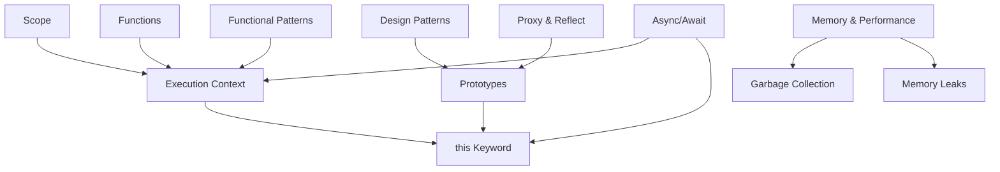

**Diagram sources**
- [scope.ts:1-485](file://src/content/learn/fundamentals/scope.ts#L1-L485)
- [functions.ts:1-552](file://src/content/learn/fundamentals/functions.ts#L1-L552)
- [execution-context.ts:1-415](file://src/content/learn/advanced/execution-context.ts#L1-L415)
- [this-keyword.ts:1-511](file://src/content/learn/advanced/this-keyword.ts#L1-L511)
- [prototypes.ts:1-501](file://src/content/learn/advanced/prototypes.ts#L1-L501)
- [proxy-reflect.ts:1-773](file://src/content/learn/advanced/proxy-reflect.ts#L1-L773)
- [functional-patterns.ts:1-525](file://src/content/learn/advanced/functional-patterns.ts#L1-L525)
- [design-patterns.ts:1-984](file://src/content/learn/advanced/design-patterns.ts#L1-L984)
- [memory-performance.ts:1-494](file://src/content/learn/advanced/memory-performance.ts#L1-L494)
- [garbage-collection.ts:1-564](file://src/content/learn/advanced/garbage-collection.ts#L1-L564)
- [memory-leaks.ts:1-812](file://src/content/learn/advanced/memory-leaks.ts#L1-L812)
- [async-await.ts:1-507](file://src/content/learn/async/async-await.ts#L1-L507)

## Detailed Component Analysis

### Design Patterns
- Creational: Singleton (closures and classes), Factory (simple and abstract), Builder (chaining and configuration).
- Structural: Adapter (legacy API normalization), Decorator (dynamic behavior), Facade (simplified interfaces).
- Behavioral: Observer (subject/observer, EventEmitter), Strategy (pluggable algorithms), State (state transitions).
- Architectural decisions: Choose Factory for controlled instantiation, Observer for decoupled updates, Strategy for algorithm switching, and Builder for complex object construction.

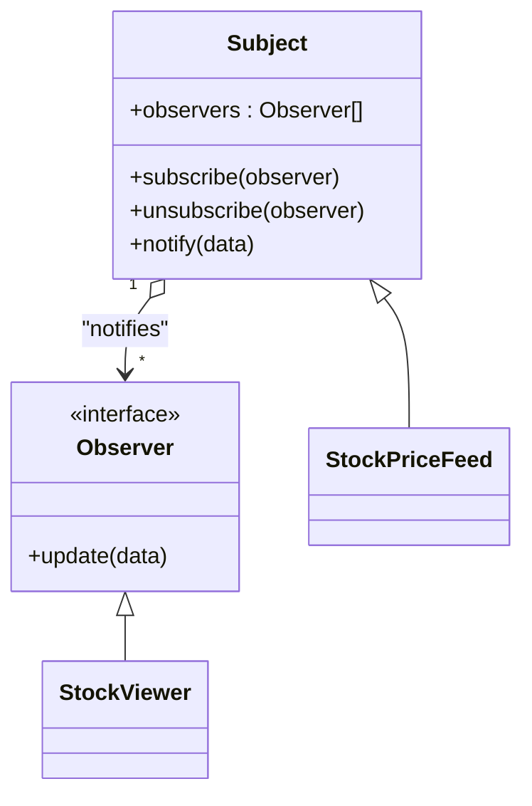

**Diagram sources**
- [design-patterns.ts:569-678](file://src/content/learn/advanced/design-patterns.ts#L569-L678)

**Section sources**
- [design-patterns.ts:46-763](file://src/content/learn/advanced/design-patterns.ts#L46-L763)

### Execution Context and Call Stack
- Creation phase (hoist declarations) and execution phase (evaluate code).
- Call stack evolution, stack traces, recursion depth, and stack overflow prevention.
- Closures retain lexical environments even after outer function returns.

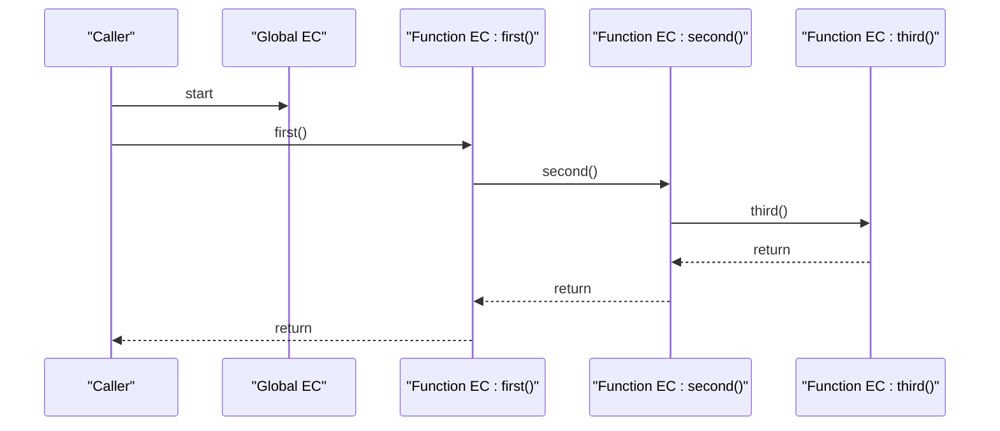

**Diagram sources**
- [execution-context.ts:84-110](file://src/content/learn/advanced/execution-context.ts#L84-L110)

**Section sources**
- [execution-context.ts:137-315](file://src/content/learn/advanced/execution-context.ts#L137-L315)

### Functional Programming Patterns
- Pure functions, composition (pipe/compose), currying, partial application, immutability, memoization, functors (Maybe), reduce as a Swiss army knife, and transducers for efficient pipelines.

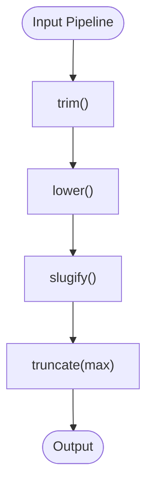

**Diagram sources**
- [functional-patterns.ts:112-135](file://src/content/learn/advanced/functional-patterns.ts#L112-L135)

**Section sources**
- [functional-patterns.ts:36-523](file://src/content/learn/advanced/functional-patterns.ts#L36-L523)

### Prototype Chain and Inheritance
- Prototype chain resolution, __proto__ vs .prototype, constructor mechanics, ES6 classes, mixins, property descriptors, and performance tips.

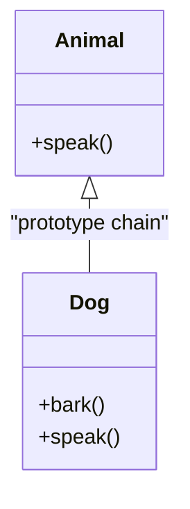

**Diagram sources**
- [prototypes.ts:142-168](file://src/content/learn/advanced/prototypes.ts#L142-L168)

**Section sources**
- [prototypes.ts:36-499](file://src/content/learn/advanced/prototypes.ts#L36-L499)

### Proxy and Reflect
- Traps for property access, descriptors, object introspection, function calls (apply/construct), and practical applications (validation, caching, lazy loading, computed properties, revocable proxies).

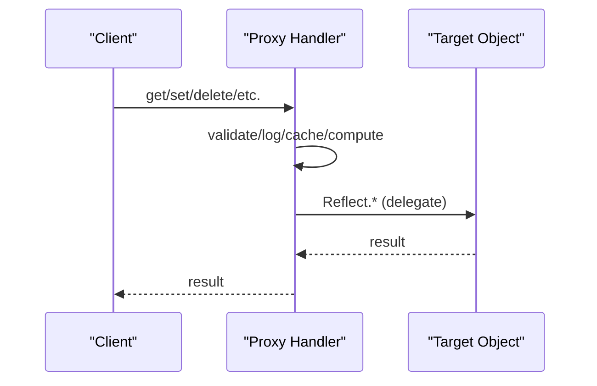

**Diagram sources**
- [proxy-reflect.ts:41-70](file://src/content/learn/advanced/proxy-reflect.ts#L41-L70)

**Section sources**
- [proxy-reflect.ts:30-772](file://src/content/learn/advanced/proxy-reflect.ts#L30-L772)

### The this Keyword and Binding
- Four rules: default, implicit, explicit (call/apply/bind), new. Arrow functions capture lexical this. Classes and event handlers require careful binding. Debug with console.log(this) and globalThis for cross-environment compatibility.

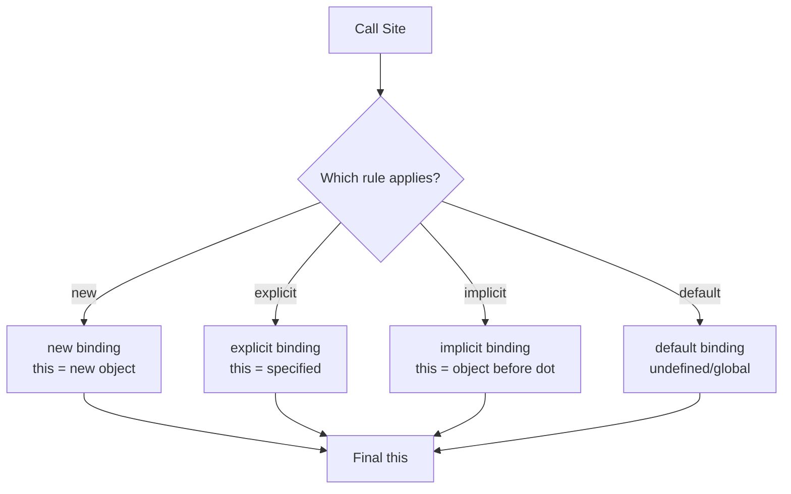

**Diagram sources**
- [this-keyword.ts:43-51](file://src/content/learn/advanced/this-keyword.ts#L43-L51)

**Section sources**
- [this-keyword.ts:40-509](file://src/content/learn/advanced/this-keyword.ts#L40-L509)

### Memory and Performance
- GC algorithms (Mark-and-Sweep, Generational), GC pause impact, GC-efficient patterns (object pooling, pre-allocation, batching), leak detection (DevTools), WeakMap/WeakRef, DOM/event optimization, V8 optimizations, and profiling.

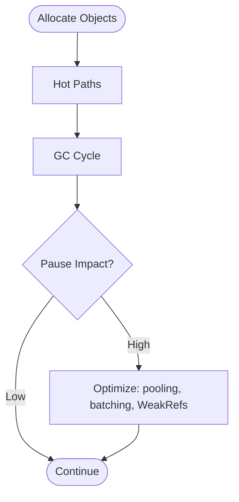

**Diagram sources**
- [memory-performance.ts:270-305](file://src/content/learn/advanced/memory-performance.ts#L270-L305)
- [garbage-collection.ts:232-242](file://src/content/learn/advanced/garbage-collection.ts#L232-L242)

**Section sources**
- [memory-performance.ts:36-492](file://src/content/learn/advanced/memory-performance.ts#L36-L492)
- [garbage-collection.ts:29-554](file://src/content/learn/advanced/garbage-collection.ts#L29-L554)
- [memory-leaks.ts:30-800](file://src/content/learn/advanced/memory-leaks.ts#L30-L800)

### Async Integration
- async/await builds on execution context and this semantics. Error handling with try/catch, parallel vs sequential, for await...of, top-level await, cancellation with AbortController, and class async methods.

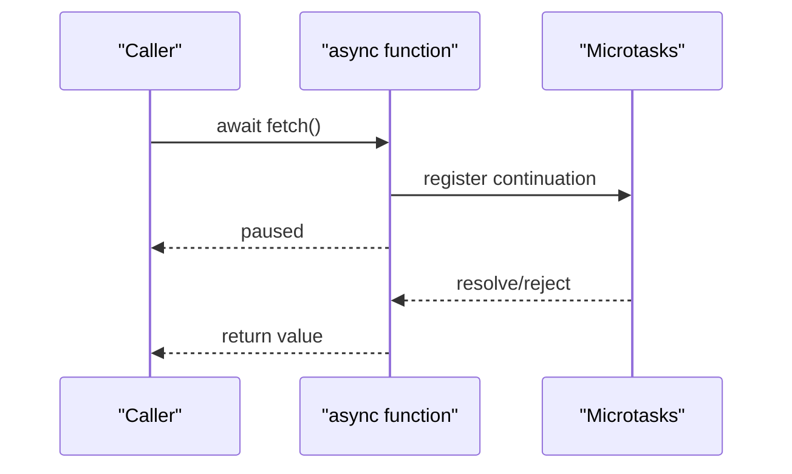

**Diagram sources**
- [async-await.ts:65-93](file://src/content/learn/async/async-await.ts#L65-L93)

**Section sources**
- [async-await.ts:36-505](file://src/content/learn/async/async-await.ts#L36-L505)

## Dependency Analysis
- Foundations drive deeper understanding: Scope and Functions underpin Execution Context; Execution Context informs this binding and closures.
- Prototypes and Proxy/Reflect are orthogonal but complementary: Prototypes for inheritance, Proxy/Reflect for interception and metaprogramming.
- Functional Programming integrates with object-oriented patterns for data transformation and purity.
- Memory and Performance considerations cut across all domains: GC, leaks, and optimization strategies apply to patterns, execution, and async code.

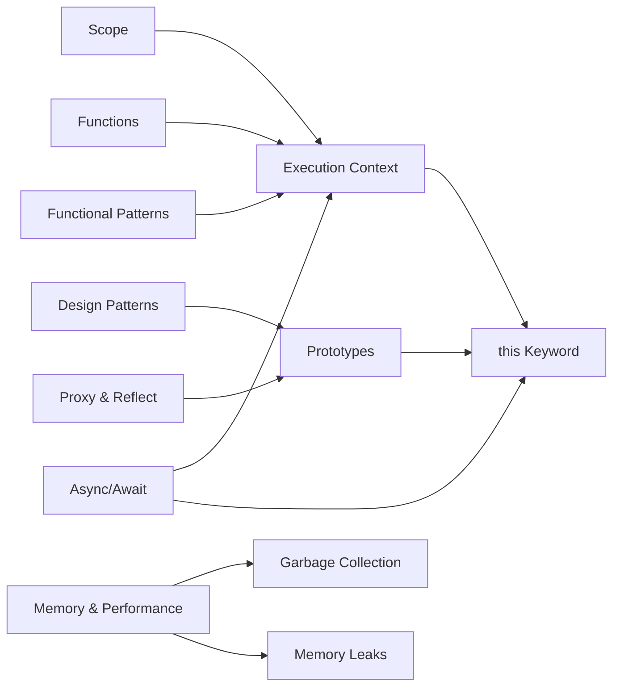

**Diagram sources**
- [scope.ts:1-485](file://src/content/learn/fundamentals/scope.ts#L1-L485)
- [functions.ts:1-552](file://src/content/learn/fundamentals/functions.ts#L1-L552)
- [execution-context.ts:1-415](file://src/content/learn/advanced/execution-context.ts#L1-L415)
- [this-keyword.ts:1-511](file://src/content/learn/advanced/this-keyword.ts#L1-L511)
- [prototypes.ts:1-501](file://src/content/learn/advanced/prototypes.ts#L1-L501)
- [proxy-reflect.ts:1-773](file://src/content/learn/advanced/proxy-reflect.ts#L1-L773)
- [functional-patterns.ts:1-525](file://src/content/learn/advanced/functional-patterns.ts#L1-L525)
- [design-patterns.ts:1-984](file://src/content/learn/advanced/design-patterns.ts#L1-L984)
- [memory-performance.ts:1-494](file://src/content/learn/advanced/memory-performance.ts#L1-L494)
- [garbage-collection.ts:1-564](file://src/content/learn/advanced/garbage-collection.ts#L1-L564)
- [memory-leaks.ts:1-812](file://src/content/learn/advanced/memory-leaks.ts#L1-L812)
- [async-await.ts:1-507](file://src/content/learn/async/async-await.ts#L1-L507)

**Section sources**
- [scope.ts:1-485](file://src/content/learn/fundamentals/scope.ts#L1-L485)
- [functions.ts:1-552](file://src/content/learn/fundamentals/functions.ts#L1-L552)
- [execution-context.ts:1-415](file://src/content/learn/advanced/execution-context.ts#L1-L415)
- [this-keyword.ts:1-511](file://src/content/learn/advanced/this-keyword.ts#L1-L511)
- [prototypes.ts:1-501](file://src/content/learn/advanced/prototypes.ts#L1-L501)
- [proxy-reflect.ts:1-773](file://src/content/learn/advanced/proxy-reflect.ts#L1-L773)
- [functional-patterns.ts:1-525](file://src/content/learn/advanced/functional-patterns.ts#L1-L525)
- [design-patterns.ts:1-984](file://src/content/learn/advanced/design-patterns.ts#L1-L984)
- [memory-performance.ts:1-494](file://src/content/learn/advanced/memory-performance.ts#L1-L494)
- [garbage-collection.ts:1-564](file://src/content/learn/advanced/garbage-collection.ts#L1-L564)
- [memory-leaks.ts:1-812](file://src/content/learn/advanced/memory-leaks.ts#L1-L812)
- [async-await.ts:1-507](file://src/content/learn/async/async-await.ts#L1-L507)

## Performance Considerations
- Prefer composition and immutability to reduce side effects and improve testability.
- Use object pooling and pre-allocation to minimize GC pressure; batch DOM operations and use requestAnimationFrame.
- Avoid creating objects in tight loops; leverage WeakMap/WeakRef for metadata to prevent retention.
- Use memoization and LRU caches judiciously; profile before optimizing.
- Favor async/await for readability; use Promise.all for independent operations and cancellation with AbortController.

[No sources needed since this section provides general guidance]

## Troubleshooting Guide
- Memory leaks: Inspect heap snapshots, watch for retained objects, detach DOM nodes, remove event listeners, clear timers, and avoid global accumulations.
- GC pauses: Reduce object churn, use pooling, avoid temporary arrays in hot loops, and monitor pause durations.
- Execution context issues: Trace call stacks, use console.trace, and understand hoisting and TDZ.
- this binding problems: Identify lost context in callbacks and event handlers; use arrow functions or explicit binding; verify class field arrow methods.
- Proxy/Reflect pitfalls: Always delegate to Reflect in handlers; be mindful of performance overhead in hot paths.

**Section sources**
- [memory-leaks.ts:448-800](file://src/content/learn/advanced/memory-leaks.ts#L448-L800)
- [garbage-collection.ts:468-554](file://src/content/learn/advanced/garbage-collection.ts#L468-L554)
- [execution-context.ts:353-412](file://src/content/learn/advanced/execution-context.ts#L353-L412)
- [this-keyword.ts:421-509](file://src/content/learn/advanced/this-keyword.ts#L421-L509)
- [proxy-reflect.ts:317-772](file://src/content/learn/advanced/proxy-reflect.ts#L317-L772)

## Conclusion
Advanced JavaScript mastery emerges from understanding how execution context, prototypes, functional paradigms, Proxy/Reflect, and this binding interplay with memory management and performance. Apply design patterns thoughtfully, instrument with DevTools, and adopt optimization strategies grounded in GC behavior and leak prevention. Use async/await to simplify asynchronous flows while preserving correct this semantics and error handling.

[No sources needed since this section summarizes without analyzing specific files]

## Appendices
- Migration strategies: Prefer const/let over var, use ES modules for strictness and encapsulation, adopt async/await, and introduce Proxy/Reflect gradually for validation and caching.
- Decision framework: Evaluate trade-offs between readability, performance, and maintainability; choose patterns that align with team expertise and runtime constraints.

[No sources needed since this section provides general guidance]