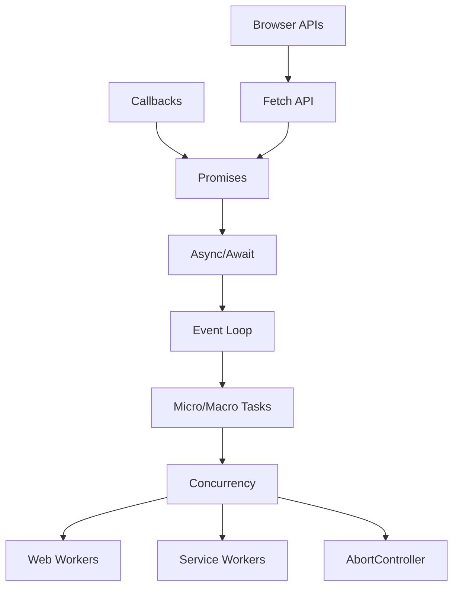
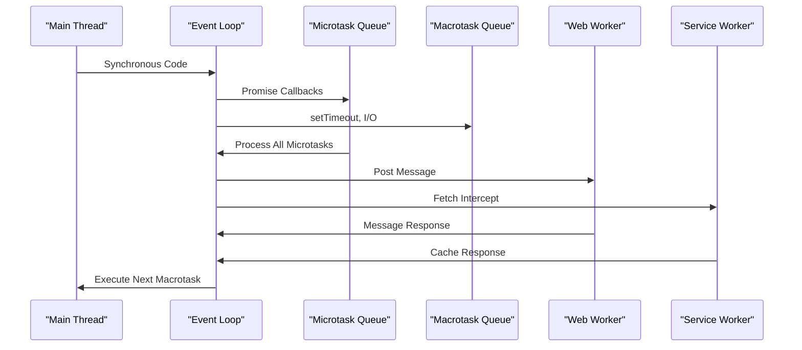
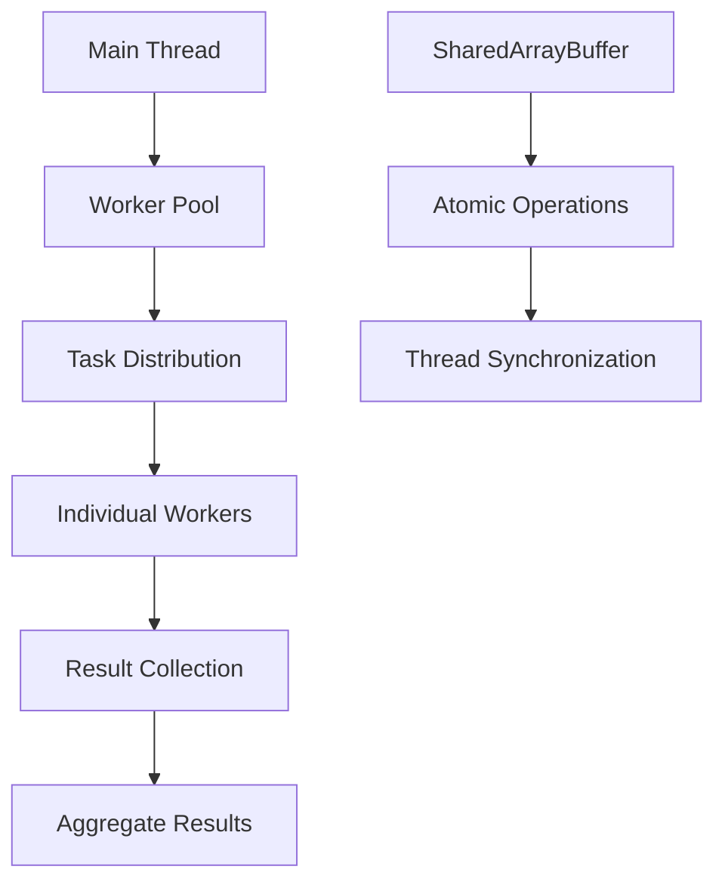
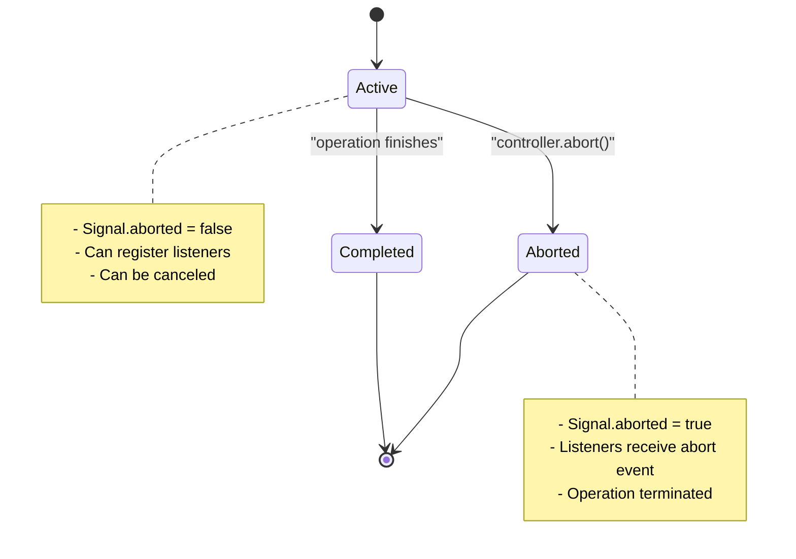
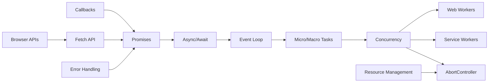

# Async Programming

<cite>
**Referenced Files in This Document**
- [callbacks.ts](file://src/content/learn/async/callbacks.ts)
- [promises.ts](file://src/content/learn/async/promises.ts)
- [async-await.ts](file://src/content/learn/async/async-await.ts)
- [event-loop.ts](file://src/content/learn/async/event-loop.ts)
- [micro-macro-tasks.ts](file://src/content/learn/async/micro-macro-tasks.ts)
- [concurrency.ts](file://src/content/learn/async/concurrency.ts)
- [abort-controller.ts](file://src/content/learn/async/abort-controller.ts)
- [web-workers.ts](file://src/content/learn/async/web-workers.ts)
- [service-workers.ts](file://src/content/learn/async/service-workers.ts)
- [fetch.ts](file://src/content/learn/browser/fetch.ts)
</cite>

## Table of Contents
1. [Introduction](#introduction)
2. [Project Structure](#project-structure)
3. [Core Components](#core-components)
4. [Architecture Overview](#architecture-overview)
5. [Detailed Component Analysis](#detailed-component-analysis)
6. [Dependency Analysis](#dependency-analysis)
7. [Performance Considerations](#performance-considerations)
8. [Troubleshooting Guide](#troubleshooting-guide)
9. [Conclusion](#conclusion)

## Introduction

This comprehensive guide covers JavaScript's asynchronous execution model, transforming your understanding from callback-based patterns to modern async/await syntax. The repository provides structured lessons that progressively build expertise in asynchronous programming, from fundamental concepts to advanced concurrency patterns.

JavaScript's asynchronous capabilities are built on several interconnected systems: the event loop, microtasks vs macrotasks, Promise chains, async/await syntax, and specialized workers for parallel processing. Understanding these systems enables developers to write efficient, maintainable asynchronous code that performs well under various conditions.

The documentation emphasizes practical applications, real-world scenarios, and best practices for managing asynchronous operations in modern web development environments.

## Project Structure

The async programming curriculum is organized as a progressive learning pathway, with each lesson building upon previous concepts:

**Diagram sources**
- [callbacks.ts:1-421](file://src/content/learn/async/callbacks.ts#L1-L421)
- [promises.ts:1-471](file://src/content/learn/async/promises.ts#L1-L471)
- [async-await.ts:1-507](file://src/content/learn/async/async-await.ts#L1-L507)
- [event-loop.ts:1-375](file://src/content/learn/async/event-loop.ts#L1-L375)
- [micro-macro-tasks.ts:1-541](file://src/content/learn/async/micro-macro-tasks.ts#L1-L541)
- [concurrency.ts:1-493](file://src/content/learn/async/concurrency.ts#L1-L493)
- [web-workers.ts:1-531](file://src/content/learn/async/web-workers.ts#L1-L531)
- [service-workers.ts:1-549](file://src/content/learn/async/service-workers.ts#L1-L549)
- [abort-controller.ts:1-611](file://src/content/learn/async/abort-controller.ts#L1-L611)

**Section sources**
- [callbacks.ts:1-421](file://src/content/learn/async/callbacks.ts#L1-L421)
- [promises.ts:1-471](file://src/content/learn/async/promises.ts#L1-L471)
- [async-await.ts:1-507](file://src/content/learn/async/async-await.ts#L1-L507)
- [event-loop.ts:1-375](file://src/content/learn/async/event-loop.ts#L1-L375)
- [micro-macro-tasks.ts:1-541](file://src/content/learn/async/micro-macro-tasks.ts#L1-L541)
- [concurrency.ts:1-493](file://src/content/learn/async/concurrency.ts#L1-L493)
- [web-workers.ts:1-531](file://src/content/learn/async/web-workers.ts#L1-L531)
- [service-workers.ts:1-549](file://src/content/learn/async/service-workers.ts#L1-L549)
- [abort-controller.ts:1-611](file://src/content/learn/async/abort-controller.ts#L1-L611)

## Core Components

### Callback Functions: The Foundation

Callbacks represent the original asynchronous pattern in JavaScript, serving as functions passed as arguments to be executed later. They form the foundation for understanding modern async patterns.

**Key Concepts:**
- **Synchronous vs Asynchronous Callbacks**: Understanding the execution timing differences
- **Error-First Callback Pattern**: Standardized error handling approach popularized by Node.js
- **Callback Hell**: The problematic nesting that led to the development of Promises
- **Consistency Principle**: Functions should consistently behave as either synchronous or asynchronous

**Practical Applications:**
- Event handlers for user interactions
- Array methods like `map()`, `filter()`, and `forEach()`
- Timer functions like `setTimeout()` and `setInterval()`
- Observer patterns and middleware implementations

**Section sources**
- [callbacks.ts:35-151](file://src/content/learn/async/callbacks.ts#L35-L151)
- [callbacks.ts:89-124](file://src/content/learn/async/callbacks.ts#L89-L124)
- [callbacks.ts:126-151](file://src/content/learn/async/callbacks.ts#L126-L151)

### Promises: The Modern Alternative

Promises provide a cleaner alternative to callback-based asynchronous programming, offering chainable operations and standardized error handling.

**Core Promise Concepts:**
- **Three States**: Pending, Fulfilled, and Rejected with immutable state transitions
- **Chainable Operations**: Sequential execution through `.then()` method chaining
- **Error Propagation**: Centralized error handling through `.catch()`
- **Finalization**: Guaranteed cleanup through `.finally()`

**Promise Combinators:**
- **Promise.all()**: Executes multiple promises in parallel, failing fast on any rejection
- **Promise.allSettled()**: Waits for all promises to settle, collecting results regardless of outcome
- **Promise.race()**: Returns the first settled promise, useful for timeouts
- **Promise.any()**: Returns the first fulfilled promise, requiring at least one success

**Section sources**
- [promises.ts:36-47](file://src/content/learn/async/promises.ts#L36-L47)
- [promises.ts:110-131](file://src/content/learn/async/promises.ts#L110-L131)
- [promises.ts:213-242](file://src/content/learn/async/promises.ts#L213-L242)
- [promises.ts:244-270](file://src/content/learn/async/promises.ts#L244-L270)
- [promises.ts:272-303](file://src/content/learn/async/promises.ts#L272-L303)

### Async/Await: Syntactic Sugar

Async/await provides the most intuitive approach to asynchronous programming, allowing developers to write asynchronous code that resembles synchronous code.

**Key Benefits:**
- **Simplified Syntax**: Eliminates callback nesting and improves readability
- **Error Handling**: Native try/catch integration for cleaner error management
- **Sequential Logic**: Natural if/else statements and loop constructs
- **Debugging**: Better stack traces compared to Promise chains

**Performance Considerations:**
- **Sequential vs Parallel**: Understanding when to use sequential vs parallel execution
- **Memory Efficiency**: Proper handling of large datasets and resource cleanup
- **Cancellation**: Graceful termination of long-running operations

**Section sources**
- [async-await.ts:36-60](file://src/content/learn/async/async-await.ts#L36-L60)
- [async-await.ts:95-151](file://src/content/learn/async/async-await.ts#L95-L151)
- [async-await.ts:153-189](file://src/content/learn/async/async-await.ts#L153-L189)
- [async-await.ts:274-295](file://src/content/learn/async/async-await.ts#L274-L295)

## Architecture Overview

The asynchronous execution model in JavaScript operates through several interconnected systems that work together to manage concurrent operations:

**Diagram sources**
- [event-loop.ts:51-64](file://src/content/learn/async/event-loop.ts#L51-L64)
- [web-workers.ts:43-74](file://src/content/learn/async/web-workers.ts#L43-L74)
- [service-workers.ts:114-125](file://src/content/learn/async/service-workers.ts#L114-L125)

### Event Loop Fundamentals

The event loop serves as JavaScript's concurrency engine, coordinating between synchronous execution, microtasks, and macrotasks. Understanding this architecture is crucial for predicting execution order and optimizing performance.

**Execution Cycle:**
1. Execute all synchronous code on the call stack
2. Process ALL microtasks in the microtask queue
3. Perform rendering if needed
4. Execute ONE macrotask from the macrotask queue
5. Repeat from step 2

**Key Distinctions:**
- **Microtasks**: Promise callbacks, queueMicrotask, MutationObserver
- **Macrotasks**: setTimeout, setInterval, I/O operations, UI events
- **Rendering**: requestAnimationFrame callbacks and layout/paint cycles

**Section sources**
- [event-loop.ts:51-64](file://src/content/learn/async/event-loop.ts#L51-L64)
- [event-loop.ts:113-122](file://src/content/learn/async/event-loop.ts#L113-L122)
- [micro-macro-tasks.ts:40-91](file://src/content/learn/async/micro-macro-tasks.ts#L40-L91)

## Detailed Component Analysis

### Concurrency Patterns and Parallel Processing

Modern JavaScript applications often require handling multiple concurrent operations efficiently. The repository provides comprehensive coverage of concurrency patterns and parallel processing techniques.

#### Web Workers: True Multithreading

Web Workers enable CPU-intensive tasks to run in background threads, preventing UI blocking and maintaining application responsiveness.

**Worker Capabilities:**
- **Isolation**: Separate global scope with no DOM access
- **Communication**: Message passing via postMessage API
- **Limitations**: No access to DOM, window, or localStorage
- **Performance**: Zero-copy data transfer with Transferable objects

**Advanced Features:**
- **Worker Pools**: Managing multiple workers for optimal resource utilization
- **Shared Memory**: Using SharedArrayBuffer with Atomics for high-performance scenarios
- **Progress Reporting**: Real-time feedback during long-running operations

**Diagram sources**
- [concurrency.ts:197-247](file://src/content/learn/async/concurrency.ts#L197-L247)
- [web-workers.ts:354-451](file://src/content/learn/async/web-workers.ts#L354-L451)

**Section sources**
- [concurrency.ts:50-105](file://src/content/learn/async/concurrency.ts#L50-L105)
- [web-workers.ts:30-74](file://src/content/learn/async/web-workers.ts#L30-L74)
- [web-workers.ts:268-342](file://src/content/learn/async/web-workers.ts#L268-L342)

#### Service Workers: Progressive Web Applications

Service Workers act as network proxies, enabling offline functionality, caching strategies, and background synchronization for Progressive Web Apps.

**Lifecycle Management:**
- **Installation**: Initial setup and asset caching
- **Activation**: Taking control and cleaning up old resources
- **Fetch Interception**: Network request handling and response generation

**Caching Strategies:**
- **Cache First**: Serve from cache, fallback to network
- **Network First**: Try network, fallback to cache
- **Stale While Revalidate**: Immediate cache response with background updates
- **Cache Only**: Static assets served exclusively from cache

**Section sources**
- [service-workers.ts:36-61](file://src/content/learn/async/service-workers.ts#L36-L61)
- [service-workers.ts:139-261](file://src/content/learn/async/service-workers.ts#L139-L261)
- [service-workers.ts:269-347](file://src/content/learn/async/service-workers.ts#L269-L347)

### Cancellation and Resource Management

Effective asynchronous programming requires robust cancellation mechanisms and proper resource cleanup to prevent memory leaks and ensure application stability.

#### AbortController: Standardized Cancellation

AbortController provides a unified approach to canceling asynchronous operations across various APIs, including fetch requests, event listeners, and custom async operations.

**Key Features:**
- **AbortSignal**: Passable to async operations for cancellation monitoring
- **Event Handling**: Automatic cleanup of event listeners on abort
- **Timeout Implementation**: Clean timeout handling with AbortSignal.timeout()
- **Resource Management**: Proper cleanup of long-running operations

**Advanced Patterns:**
- **Combined Signals**: Multiple cancellation criteria coordination
- **Priority-Based Cancellation**: Higher priority requests can abort lower priority ones
- **Debounced Operations**: Automatic cancellation of previous requests in rapid succession

**Diagram sources**
- [abort-controller.ts:43-100](file://src/content/learn/async/abort-controller.ts#L43-L100)
- [abort-controller.ts:397-422](file://src/content/learn/async/abort-controller.ts#L397-L422)

**Section sources**
- [abort-controller.ts:36-100](file://src/content/learn/async/abort-controller.ts#L36-L100)
- [abort-controller.ts:199-280](file://src/content/learn/async/abort-controller.ts#L199-L280)
- [abort-controller.ts:388-488](file://src/content/learn/async/abort-controller.ts#L388-L488)

### Real-World Applications and Best Practices

The repository demonstrates practical applications of asynchronous patterns through comprehensive examples and exercises designed for real-world scenarios.

#### API Integration Patterns

Modern web applications frequently require sophisticated API integration with proper error handling, retry logic, and performance optimization.

**Fetch API Mastery:**
- **Error Handling**: Distinguishing between network errors and HTTP errors
- **Cancellation**: Implementing graceful request termination
- **Streaming**: Processing large responses incrementally
- **Retry Logic**: Intelligent retry mechanisms with exponential backoff

**Section sources**
- [fetch.ts:124-156](file://src/content/learn/browser/fetch.ts#L124-L156)
- [fetch.ts:212-259](file://src/content/learn/browser/fetch.ts#L212-L259)
- [fetch.ts:373-412](file://src/content/learn/browser/fetch.ts#L373-L412)

#### Performance Optimization Strategies

Understanding timing, execution order, and performance implications enables developers to write efficient asynchronous code that scales effectively.

**Timing Considerations:**
- **Microtask vs Macrotask Priority**: Understanding execution precedence
- **Rendering Impact**: Minimizing layout thrashing and paint operations
- **Resource Contention**: Managing concurrent operations to prevent bottlenecks

**Memory Management:**
- **Proper Cleanup**: Ensuring event listeners and timers are properly removed
- **Reference Management**: Preventing memory leaks through proper object lifecycle management
- **Resource Pooling**: Efficient reuse of expensive resources like database connections

**Section sources**
- [event-loop.ts:236-267](file://src/content/learn/async/event-loop.ts#L236-L267)
- [micro-macro-tasks.ts:260-354](file://src/content/learn/async/micro-macro-tasks.ts#L260-L354)
- [concurrency.ts:439-451](file://src/content/learn/async/concurrency.ts#L439-L451)

## Dependency Analysis

The async programming concepts in this repository demonstrate clear dependency relationships and progression:

**Diagram sources**
- [callbacks.ts:14-20](file://src/content/learn/async/callbacks.ts#L14-L20)
- [promises.ts:14-20](file://src/content/learn/async/promises.ts#L14-L20)
- [async-await.ts:14-20](file://src/content/learn/async/async-await.ts#L14-L20)
- [event-loop.ts:14-20](file://src/content/learn/async/event-loop.ts#L14-L20)
- [micro-macro-tasks.ts:14-20](file://src/content/learn/async/micro-macro-tasks.ts#L14-L20)
- [concurrency.ts:14-20](file://src/content/learn/async/concurrency.ts#L14-L20)
- [web-workers.ts:14-20](file://src/content/learn/async/web-workers.ts#L14-L20)
- [service-workers.ts:14-20](file://src/content/learn/async/service-workers.ts#L14-L20)
- [abort-controller.ts:14-20](file://src/content/learn/async/abort-controller.ts#L14-L20)

**Section sources**
- [callbacks.ts:14-20](file://src/content/learn/async/callbacks.ts#L14-L20)
- [promises.ts:14-20](file://src/content/learn/async/promises.ts#L14-L20)
- [async-await.ts:14-20](file://src/content/learn/async/async-await.ts#L14-L20)
- [event-loop.ts:14-20](file://src/content/learn/async/event-loop.ts#L14-L20)
- [micro-macro-tasks.ts:14-20](file://src/content/learn/async/micro-macro-tasks.ts#L14-L20)
- [concurrency.ts:14-20](file://src/content/learn/async/concurrency.ts#L14-L20)
- [web-workers.ts:14-20](file://src/content/learn/async/web-workers.ts#L14-L20)
- [service-workers.ts:14-20](file://src/content/learn/async/service-workers.ts#L14-L20)
- [abort-controller.ts:14-20](file://src/content/learn/async/abort-controller.ts#L14-L20)

## Performance Considerations

### Execution Timing and Optimization

Understanding JavaScript's execution model enables significant performance improvements through strategic timing and resource management.

**Critical Performance Factors:**
- **Microtask Drain Behavior**: All microtasks execute before any macrotask, affecting perceived performance
- **Layout Thrashing Prevention**: Minimizing DOM manipulation sequences that trigger reflows
- **Memory Allocation Patterns**: Reducing garbage collection pressure through efficient object reuse

**Optimization Strategies:**
- **Batch Operations**: Grouping DOM updates to minimize layout calculations
- **Efficient Data Structures**: Choosing appropriate data structures for concurrent access
- **Resource Pooling**: Reusing expensive resources like database connections or WebSocket connections

### Concurrency Optimization

Effective concurrency management prevents resource contention and maximizes throughput in asynchronous applications.

**Concurrency Patterns:**
- **Worker Pool Sizing**: Determining optimal worker count based on hardware capabilities
- **Task Queuing**: Implementing fair queuing mechanisms for resource-limited operations
- **Load Balancing**: Distributing work evenly across available workers

**Memory Management:**
- **Proper Cleanup**: Ensuring workers and event listeners are properly terminated
- **Reference Cycles**: Avoiding circular references that prevent garbage collection
- **Resource Limits**: Monitoring memory usage in long-running asynchronous operations

## Troubleshooting Guide

### Common Pitfalls and Solutions

**Callback-Related Issues:**
- **Callback Hell**: Deeply nested callbacks leading to maintainability problems
- **Error Handling**: Forgetting to check for errors in callback-based APIs
- **Context Loss**: `this` binding issues in callback contexts

**Promise-Related Issues:**
- **Uncaught Rejections**: Missing `.catch()` handlers causing application crashes
- **Chain Breakage**: Forgetting to return values in `.then()` chains
- **Race Conditions**: Improper handling of concurrent operations

**Async/Await Issues:**
- **Missing Error Handling**: Forgetting try/catch blocks around async operations
- **Sequential vs Parallel**: Using sequential operations when parallel execution is possible
- **Resource Leaks**: Not properly cleaning up resources in async operations

**Section sources**
- [callbacks.ts:350-387](file://src/content/learn/async/callbacks.ts#L350-L387)
- [promises.ts:387-427](file://src/content/learn/async/promises.ts#L387-L427)
- [async-await.ts:426-473](file://src/content/learn/async/async-await.ts#L426-L473)

### Debugging Techniques

**Execution Order Analysis:**
- **Tracing Microtasks**: Understanding when microtasks execute relative to macrotasks
- **Event Loop Monitoring**: Tracking asynchronous operation timing and completion
- **Stack Trace Analysis**: Interpreting async stack traces for debugging purposes

**Performance Profiling:**
- **Timing Measurement**: Using `performance.now()` for precise timing measurements
- **Memory Profiling**: Monitoring memory allocation in asynchronous operations
- **Concurrency Analysis**: Identifying bottlenecks in concurrent operation patterns

**Section sources**
- [event-loop.ts:319-342](file://src/content/learn/async/event-loop.ts#L319-L342)
- [micro-macro-tasks.ts:443-517](file://src/content/learn/async/micro-macro-tasks.ts#L443-L517)

## Conclusion

The repository provides a comprehensive foundation for mastering JavaScript's asynchronous execution model. Through progressive learning from callbacks to advanced concurrency patterns, developers gain the skills necessary to build efficient, maintainable asynchronous applications.

Key takeaways include understanding the event loop architecture, leveraging modern async/await syntax, implementing proper cancellation mechanisms, and utilizing specialized workers for parallel processing. The practical examples and exercises demonstrate real-world applications that address common challenges in asynchronous programming.

By applying these concepts systematically, developers can write asynchronous code that is not only functional but also performant, maintainable, and scalable across various application architectures and deployment environments.

The integration of modern browser APIs like Fetch, Web Workers, and Service Workers demonstrates how asynchronous patterns extend beyond basic Promise chains to encompass sophisticated application architectures capable of handling complex real-world scenarios including offline functionality, background processing, and resource-efficient concurrent operations.