# Browser APIs

<cite>
**Referenced Files in This Document**
- [fetch.ts](file://src/content/learn/browser/fetch.ts)
- [clipboard.ts](file://src/content/learn/browser/clipboard.ts)
- [file-apis.ts](file://src/content/learn/browser/file-apis.ts)
- [geolocation.ts](file://src/content/learn/browser/geolocation.ts)
- [history.ts](file://src/content/learn/browser/history.ts)
- [indexeddb.ts](file://src/content/learn/browser/indexeddb.ts)
- [intersection-observer.ts](file://src/content/learn/browser/intersection-observer.ts)
- [local-storage.ts](file://src/content/learn/browser/local-storage.ts)
- [notifications.ts](file://src/content/learn/browser/notifications.ts)
- [pointer-events.ts](file://src/content/learn/browser/pointer-events.ts)
- [session-storage.ts](file://src/content/learn/browser/session-storage.ts)
- [web-crypto.ts](file://src/content/learn/browser/web-crypto.ts)
- [websockets.ts](file://src/content/learn/browser/websockets.ts)
</cite>

## Table of Contents
1. [Introduction](#introduction)
2. [Project Structure](#project-structure)
3. [Core Components](#core-components)
4. [Architecture Overview](#architecture-overview)
5. [Detailed Component Analysis](#detailed-component-analysis)
6. [Dependency Analysis](#dependency-analysis)
7. [Performance Considerations](#performance-considerations)
8. [Troubleshooting Guide](#troubleshooting-guide)
9. [Conclusion](#conclusion)
10. [Appendices](#appendices)

## Introduction
This document synthesizes the Browser APIs learning materials into a cohesive guide for building robust, secure, and performant web experiences. It consolidates lessons on HTTP networking (fetch), clipboard operations, file handling, geolocation, navigation history, client-side storage (localStorage, sessionStorage, IndexedDB), scroll-based interactions (Intersection Observer), notifications, pointer events, cryptography (Web Crypto), and real-time communication (WebSockets). For each API, it covers purpose, usage patterns, compatibility, security and privacy considerations, error handling, fallback strategies, performance tips, and practical integration examples.

## Project Structure
The learning materials are organized as modular lesson content modules, each focused on a specific browser API. The structure emphasizes progressive complexity and practical application, with code examples and best practices embedded directly in the lesson content.

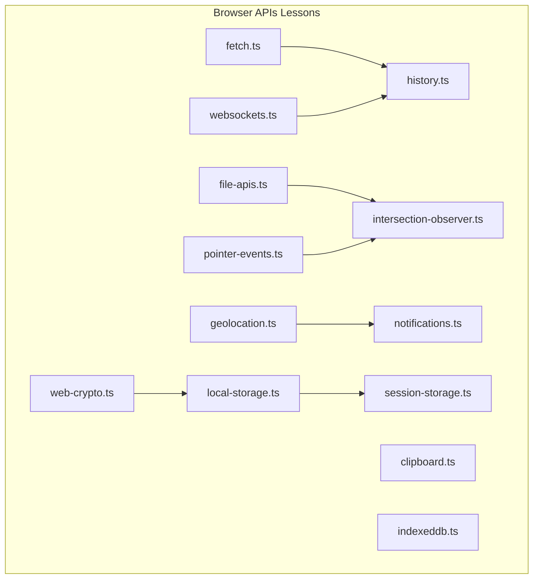

**Diagram sources**
- [fetch.ts:1-652](file://src/content/learn/browser/fetch.ts#L1-L652)
- [clipboard.ts:1-420](file://src/content/learn/browser/clipboard.ts#L1-L420)
- [file-apis.ts:1-558](file://src/content/learn/browser/file-apis.ts#L1-L558)
- [geolocation.ts:1-425](file://src/content/learn/browser/geolocation.ts#L1-L425)
- [history.ts:1-413](file://src/content/learn/browser/history.ts#L1-L413)
- [indexeddb.ts:1-592](file://src/content/learn/browser/indexeddb.ts#L1-L592)
- [intersection-observer.ts:1-477](file://src/content/learn/browser/intersection-observer.ts#L1-L477)
- [local-storage.ts:1-389](file://src/content/learn/browser/local-storage.ts#L1-L389)
- [notifications.ts:1-410](file://src/content/learn/browser/notifications.ts#L1-L410)
- [pointer-events.ts:1-657](file://src/content/learn/browser/pointer-events.ts#L1-L657)
- [session-storage.ts:1-352](file://src/content/learn/browser/session-storage.ts#L1-L352)
- [web-crypto.ts:1-516](file://src/content/learn/browser/web-crypto.ts#L1-L516)
- [websockets.ts:1-514](file://src/content/learn/browser/websockets.ts#L1-L514)

**Section sources**
- [fetch.ts:1-652](file://src/content/learn/browser/fetch.ts#L1-L652)
- [clipboard.ts:1-420](file://src/content/learn/browser/clipboard.ts#L1-L420)
- [file-apis.ts:1-558](file://src/content/learn/browser/file-apis.ts#L1-L558)
- [geolocation.ts:1-425](file://src/content/learn/browser/geolocation.ts#L1-L425)
- [history.ts:1-413](file://src/content/learn/browser/history.ts#L1-L413)
- [indexeddb.ts:1-592](file://src/content/learn/browser/indexeddb.ts#L1-L592)
- [intersection-observer.ts:1-477](file://src/content/learn/browser/intersection-observer.ts#L1-L477)
- [local-storage.ts:1-389](file://src/content/learn/browser/local-storage.ts#L1-L389)
- [notifications.ts:1-410](file://src/content/learn/browser/notifications.ts#L1-L410)
- [pointer-events.ts:1-657](file://src/content/learn/browser/pointer-events.ts#L1-L657)
- [session-storage.ts:1-352](file://src/content/learn/browser/session-storage.ts#L1-L352)
- [web-crypto.ts:1-516](file://src/content/learn/browser/web-crypto.ts#L1-L516)
- [websockets.ts:1-514](file://src/content/learn/browser/websockets.ts#L1-L514)

## Core Components
- Fetch API: Modern HTTP client with streaming, cancellation, and robust error handling.
- Clipboard API: Async text and rich content operations with permission handling.
- File APIs: FileReader/File/Blob utilities for client-side processing and previews.
- Geolocation: Position retrieval with permission, accuracy tuning, and fallbacks.
- History API: SPA navigation, push/replace state, and popstate handling.
- IndexedDB: Full-featured client-side NoSQL database with transactions and indexes.
- Intersection Observer: Efficient scroll-based triggers for lazy loading and analytics.
- localStorage/sessionStorage: Simple persistence with wrappers, TTL, and cross-tab sync.
- Notifications: Foreground/background alerts with permissions and Service Worker integration.
- Pointer Events: Unified input handling for mouse, touch, pen with gestures and capture.
- Web Crypto: Native hashing, encryption, signatures, and key management.
- WebSockets: Persistent, bidirectional real-time communication with reconnection and heartbeat.

**Section sources**
- [fetch.ts:1-652](file://src/content/learn/browser/fetch.ts#L1-L652)
- [clipboard.ts:1-420](file://src/content/learn/browser/clipboard.ts#L1-L420)
- [file-apis.ts:1-558](file://src/content/learn/browser/file-apis.ts#L1-L558)
- [geolocation.ts:1-425](file://src/content/learn/browser/geolocation.ts#L1-L425)
- [history.ts:1-413](file://src/content/learn/browser/history.ts#L1-L413)
- [indexeddb.ts:1-592](file://src/content/learn/browser/indexeddb.ts#L1-L592)
- [intersection-observer.ts:1-477](file://src/content/learn/browser/intersection-observer.ts#L1-L477)
- [local-storage.ts:1-389](file://src/content/learn/browser/local-storage.ts#L1-L389)
- [notifications.ts:1-410](file://src/content/learn/browser/notifications.ts#L1-L410)
- [pointer-events.ts:1-657](file://src/content/learn/browser/pointer-events.ts#L1-L657)
- [session-storage.ts:1-352](file://src/content/learn/browser/session-storage.ts#L1-L352)
- [web-crypto.ts:1-516](file://src/content/learn/browser/web-crypto.ts#L1-L516)
- [websockets.ts:1-514](file://src/content/learn/browser/websockets.ts#L1-L514)

## Architecture Overview
The Browser APIs ecosystem integrates tightly with the browser runtime and DOM. Many APIs complement each other: fetch for network, localStorage for persistence, Intersection Observer for performance-sensitive UI, Notifications for engagement, WebSockets for real-time collaboration, and Web Crypto for security.

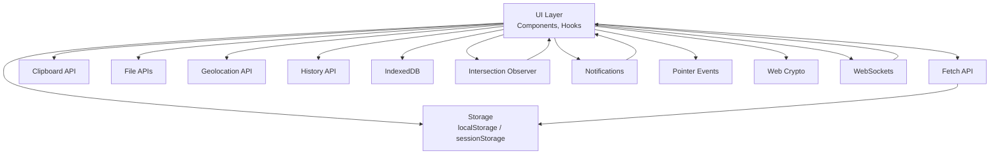

[No sources needed since this diagram shows conceptual architecture, not a direct code mapping]

## Detailed Component Analysis

### Fetch API
- Purpose: Modern HTTP client returning Promises, supporting headers, streaming, cancellation, and robust error handling.
- Key patterns:
  - Response.ok check, JSON parsing, and error categorization.
  - AbortController for timeouts and cleanup.
  - FormData uploads without manual Content-Type.
  - Streaming responses via ReadableStream.
  - Request wrappers with interceptors and retry logic.
- Compatibility: Native in modern browsers; Node.js 18+.
- Security: CORS modes and credentials handling; server cooperation required.
- Best practices: Always check response.ok, avoid JSON stringification mistakes, and use exponential backoff for retries.

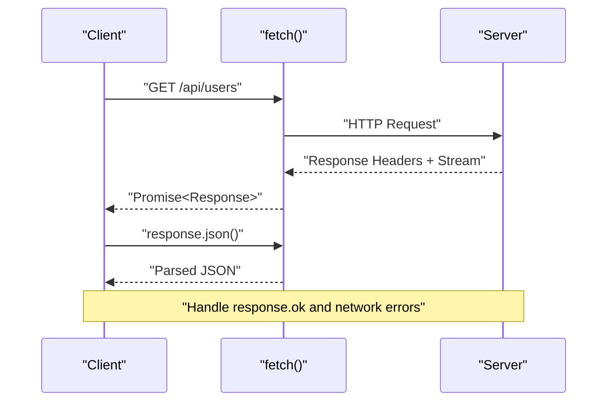

**Diagram sources**
- [fetch.ts:124-156](file://src/content/learn/browser/fetch.ts#L124-L156)
- [fetch.ts:212-259](file://src/content/learn/browser/fetch.ts#L212-L259)
- [fetch.ts:373-412](file://src/content/learn/browser/fetch.ts#L373-L412)

**Section sources**
- [fetch.ts:1-652](file://src/content/learn/browser/fetch.ts#L1-L652)

### Clipboard API
- Purpose: Async clipboard operations for text and rich content using ClipboardItem.
- Key patterns:
  - writeText/readText for simple text.
  - read()/write() with ClipboardItem for HTML/images.
  - Permission checks and graceful fallbacks.
  - React hooks for copy feedback.
- Security and privacy: Requires HTTPS; reading prompts permission; writing typically requires user gesture.
- Best practices: Always show feedback, handle errors, and provide fallbacks.

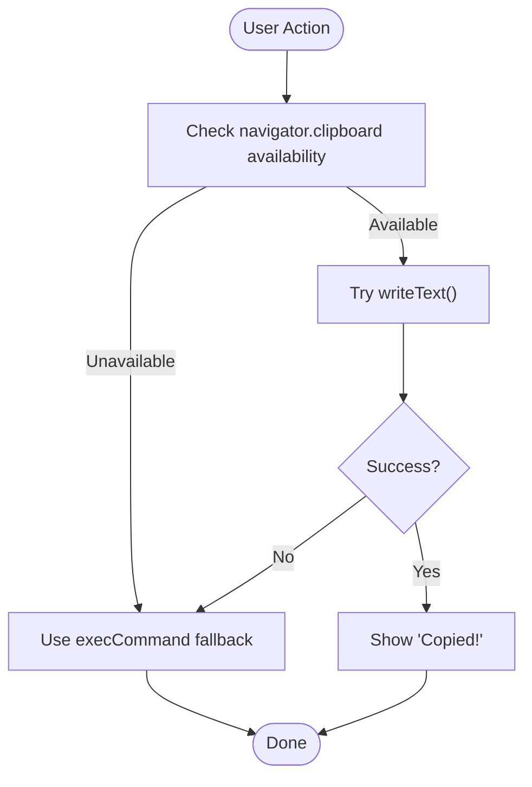

**Diagram sources**
- [clipboard.ts:317-329](file://src/content/learn/browser/clipboard.ts#L317-L329)

**Section sources**
- [clipboard.ts:1-420](file://src/content/learn/browser/clipboard.ts#L1-L420)

### File APIs
- Purpose: Client-side file reading, previews, validation, and creation/download.
- Key patterns:
  - File/Blob/FileReader/FileReader API and modern file.* methods.
  - URL.createObjectURL for previews; revokeObjectURL for memory safety.
  - Drag-and-drop with validation and progress.
  - File System Access API for Open/Save workflows (Chromium).
  - Processing large files via streams/chunks.
- Best practices: Validate early, avoid base64 for large files, revoke URLs, and handle empty FileList.

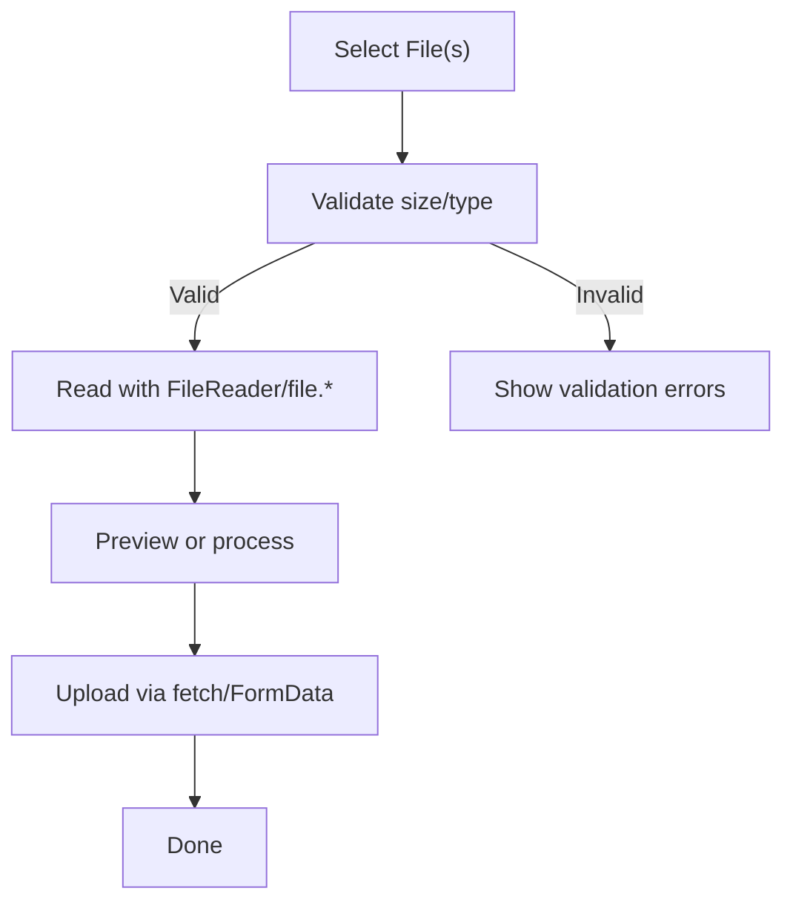

**Diagram sources**
- [file-apis.ts:175-231](file://src/content/learn/browser/file-apis.ts#L175-L231)
- [file-apis.ts:447-488](file://src/content/learn/browser/file-apis.ts#L447-L488)

**Section sources**
- [file-apis.ts:1-558](file://src/content/learn/browser/file-apis.ts#L1-L558)

### Geolocation
- Purpose: Retrieve user position with permission and accuracy controls.
- Key patterns:
  - getCurrentPosition/wrap to Promise; watchPosition for continuous tracking.
  - Haversine distance calculation; reverse geocoding via external API.
  - React hook for stateful location handling.
  - Permission UX and fallback strategies.
- Security: HTTPS required; permission prompts; battery vs precision trade-offs.
- Best practices: Request on user gesture, tune accuracy, clear watchers, and cache last known position.

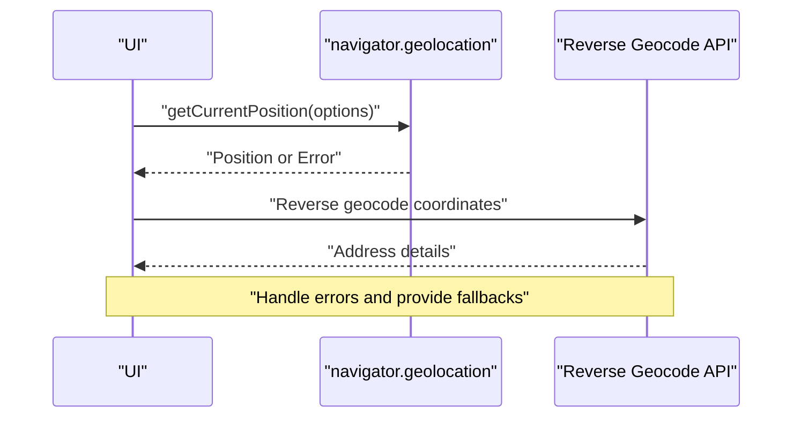

**Diagram sources**
- [geolocation.ts:200-224](file://src/content/learn/browser/geolocation.ts#L200-L224)
- [geolocation.ts:313-330](file://src/content/learn/browser/geolocation.ts#L313-L330)

**Section sources**
- [geolocation.ts:1-425](file://src/content/learn/browser/geolocation.ts#L1-L425)

### History API
- Purpose: Manage browser history for SPAs without full reloads.
- Key patterns:
  - pushState/replaceState and popstate event handling.
  - Minimal router implementation and link interception.
  - Hash routing vs history routing trade-offs.
  - Navigation API (modern) for enhanced control.
- Best practices: Use pushState for navigation, replaceState for URL cosmetics, configure server, and keep state small.

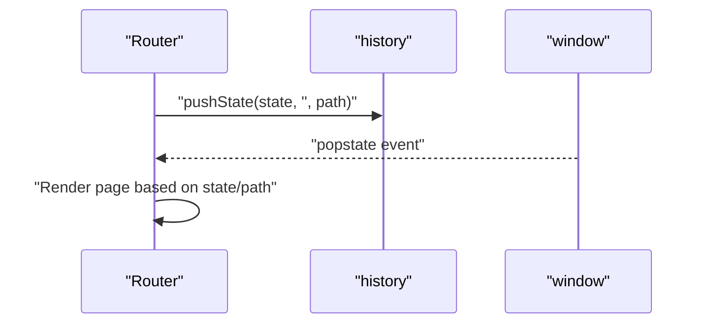

**Diagram sources**
- [history.ts:144-224](file://src/content/learn/browser/history.ts#L144-L224)
- [history.ts:318-354](file://src/content/learn/browser/history.ts#L318-L354)

**Section sources**
- [history.ts:1-413](file://src/content/learn/browser/history.ts#L1-L413)

### IndexedDB
- Purpose: Full-featured client-side NoSQL database with transactions and indexes.
- Key patterns:
  - Database open/upgradeneeded, object stores, indexes, and transactions.
  - CRUD operations, querying with indexes and IDBKeyRange.
  - Versioning and migrations.
  - Practical patterns: Promise wrapper, cache manager with TTL, offline sync queue.
- Best practices: Use transactions for ACID, create indexes for queries, handle versioning, and wrap API in Promises.

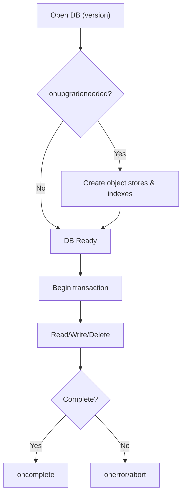

**Diagram sources**
- [indexeddb.ts:41-125](file://src/content/learn/browser/indexeddb.ts#L41-L125)
- [indexeddb.ts:222-316](file://src/content/learn/browser/indexeddb.ts#L222-L316)

**Section sources**
- [indexeddb.ts:1-592](file://src/content/learn/browser/indexeddb.ts#L1-L592)

### Intersection Observer
- Purpose: Efficiently detect element visibility for lazy loading, animations, analytics, and infinite scroll.
- Key patterns:
  - Observer configuration (root, rootMargin, threshold).
  - Lazy loading images, scroll-triggered animations, infinite scroll sentinel.
  - Visibility tracking and React hook.
- Best practices: One observer per use-case, unobserve after one-time actions, use rootMargin for preloading, and avoid per-scroll event listeners.

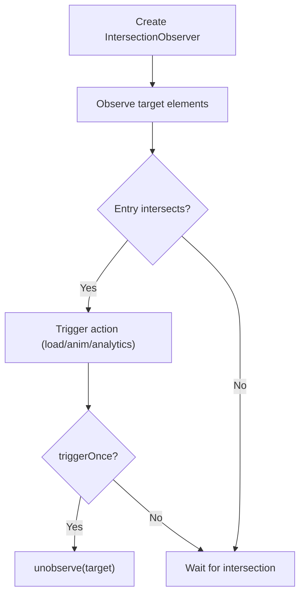

**Diagram sources**
- [intersection-observer.ts:40-106](file://src/content/learn/browser/intersection-observer.ts#L40-L106)
- [intersection-observer.ts:207-242](file://src/content/learn/browser/intersection-observer.ts#L207-L242)

**Section sources**
- [intersection-observer.ts:1-477](file://src/content/learn/browser/intersection-observer.ts#L1-L477)

### localStorage and sessionStorage
- Purpose: Simple key-value persistence; sessionStorage scoped to the tab.
- Key patterns:
  - Safe wrappers for JSON serialization/deserialization.
  - Expiring storage with TTL.
  - Cross-tab sync via storage event.
  - React hooks for reactive state.
- Best practices: Namespace keys, avoid sensitive data, keep data small, and handle quota exceeded errors.

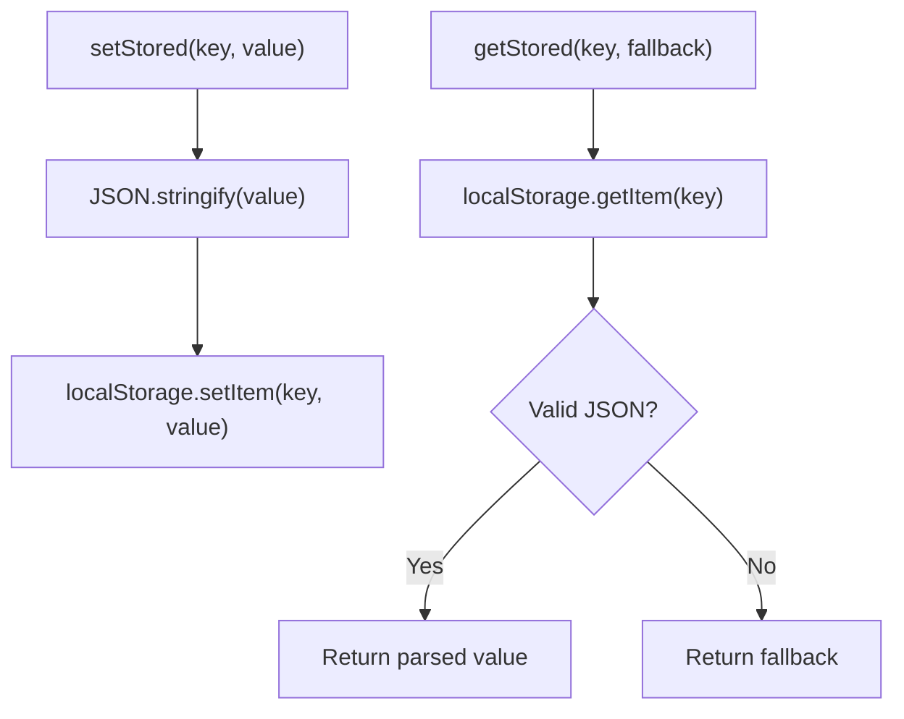

**Diagram sources**
- [local-storage.ts:94-125](file://src/content/learn/browser/local-storage.ts#L94-L125)
- [session-storage.ts:148-196](file://src/content/learn/browser/session-storage.ts#L148-L196)

**Section sources**
- [local-storage.ts:1-389](file://src/content/learn/browser/local-storage.ts#L1-L389)
- [session-storage.ts:1-352](file://src/content/learn/browser/session-storage.ts#L1-L352)

### Notifications
- Purpose: Desktop/mobile notifications for engagement; Notification API vs Push API.
- Key patterns:
  - Permission request and handling.
  - Notification creation with options (icon, image, badge, tag, actions).
  - Notification queue and grouping.
  - Service Worker integration for background notifications.
- Best practices: Request permission on user gesture, use tags to prevent duplicates, and test on mobile.

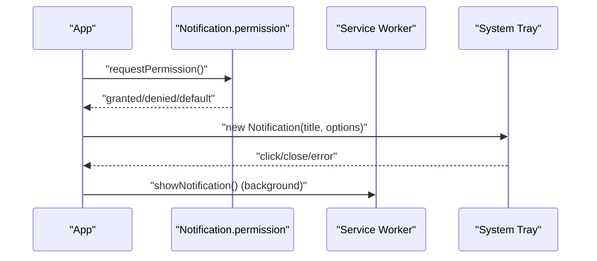

**Diagram sources**
- [notifications.ts:40-114](file://src/content/learn/browser/notifications.ts#L40-L114)
- [notifications.ts:159-197](file://src/content/learn/browser/notifications.ts#L159-L197)

**Section sources**
- [notifications.ts:1-410](file://src/content/learn/browser/notifications.ts#L1-L410)

### Pointer Events
- Purpose: Unified input handling for mouse, touch, pen with advanced gesture support.
- Key patterns:
  - Pointer properties (pointerId, pointerType, isPrimary, pressure, tilt).
  - Pointer capture for drag operations outside element bounds.
  - Multi-touch gesture recognition and drawing applications.
  - Feature detection and fallbacks to mouse/touch events.
- Best practices: Use pointer events for unified input, implement pointer capture for drag, and handle multi-touch gestures.

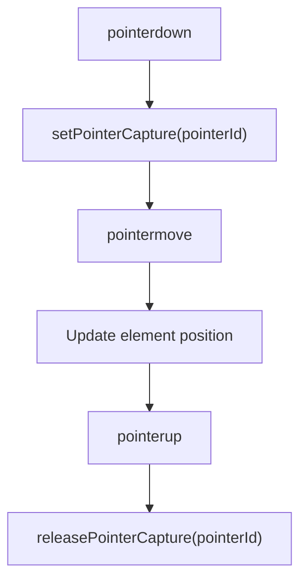

**Diagram sources**
- [pointer-events.ts:170-249](file://src/content/learn/browser/pointer-events.ts#L170-L249)

**Section sources**
- [pointer-events.ts:1-657](file://src/content/learn/browser/pointer-events.ts#L1-L657)

### Web Crypto
- Purpose: Native cryptography for hashing, encryption, signing, and key management.
- Key patterns:
  - Hashing with SHA-256/384/512; HMAC for message authentication.
  - Symmetric encryption (AES-GCM) and asymmetric (RSA-OAEP, ECDSA).
  - Key derivation (PBKDF2), key import/export (JWK), and secure random values.
- Best practices: Use secure random values, include IV with ciphertext, export/import keys carefully, and handle encrypted data securely.

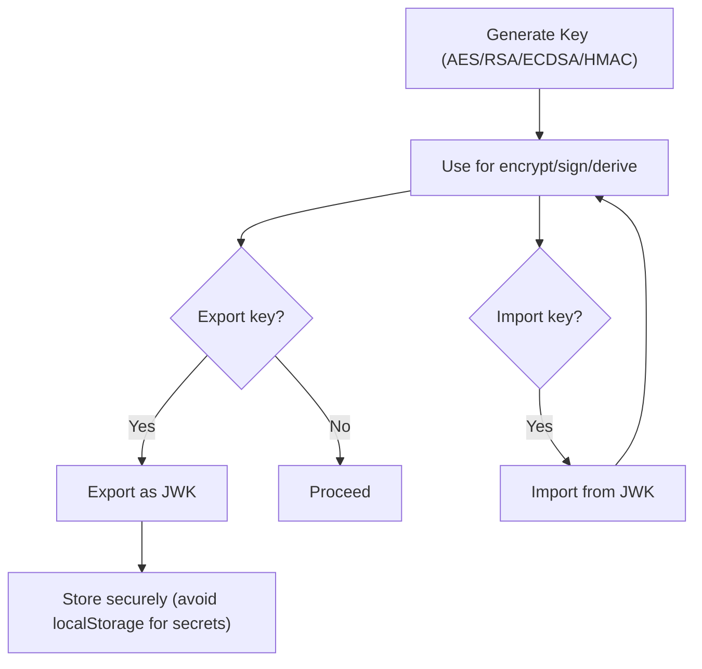

**Diagram sources**
- [web-crypto.ts:41-104](file://src/content/learn/browser/web-crypto.ts#L41-L104)
- [web-crypto.ts:428-492](file://src/content/learn/browser/web-crypto.ts#L428-L492)

**Section sources**
- [web-crypto.ts:1-516](file://src/content/learn/browser/web-crypto.ts#L1-L516)

### WebSockets
- Purpose: Persistent, bidirectional real-time communication.
- Key patterns:
  - Connection lifecycle (CONNECTING, OPEN, CLOSING, CLOSED).
  - Message protocol design with typed messages.
  - Reconnection with exponential backoff and jitter.
  - Heartbeat/ping-pong to detect dead connections.
  - SSE comparison for server-to-client streams.
- Best practices: Use wss://, implement reconnection, define a typed protocol, and close connections on unmount.

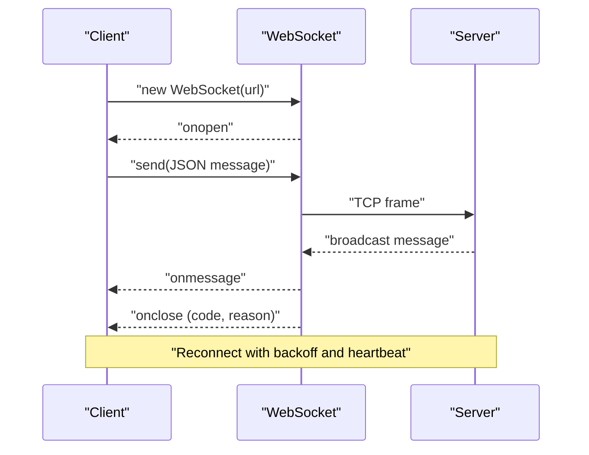

**Diagram sources**
- [websockets.ts:40-98](file://src/content/learn/browser/websockets.ts#L40-L98)
- [websockets.ts:170-257](file://src/content/learn/browser/websockets.ts#L170-L257)
- [websockets.ts:260-310](file://src/content/learn/browser/websockets.ts#L260-L310)

**Section sources**
- [websockets.ts:1-514](file://src/content/learn/browser/websockets.ts#L1-L514)

## Dependency Analysis
- Cross-cutting concerns:
  - Fetch often depends on localStorage/sessionStorage for caching and auth tokens.
  - Intersection Observer complements File APIs for lazy loading previews.
  - Notifications integrate with WebSockets for real-time alerts.
  - Pointer Events coordinate with Intersection Observer for gesture-driven UI.
  - Web Crypto secures data persisted in localStorage/sessionStorage and transmitted via WebSockets.
- Coupling and cohesion:
  - Each API module encapsulates its own patterns and best practices.
  - Shared utilities (wrappers, hooks) improve cohesion across components.

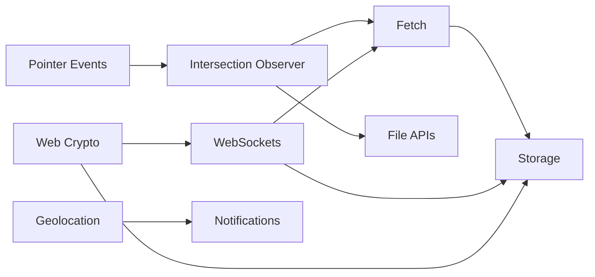

[No sources needed since this diagram shows conceptual relationships, not a direct code mapping]

**Section sources**
- [fetch.ts:1-652](file://src/content/learn/browser/fetch.ts#L1-L652)
- [intersection-observer.ts:1-477](file://src/content/learn/browser/intersection-observer.ts#L1-L477)
- [file-apis.ts:1-558](file://src/content/learn/browser/file-apis.ts#L1-L558)
- [websockets.ts:1-514](file://src/content/learn/browser/websockets.ts#L1-L514)
- [web-crypto.ts:1-516](file://src/content/learn/browser/web-crypto.ts#L1-L516)
- [geolocation.ts:1-425](file://src/content/learn/browser/geolocation.ts#L1-L425)
- [notifications.ts:1-410](file://src/content/learn/browser/notifications.ts#L1-L410)
- [pointer-events.ts:1-657](file://src/content/learn/browser/pointer-events.ts#L1-L657)

## Performance Considerations
- Fetch: Prefer streaming for large responses; use AbortController to cancel; implement exponential backoff.
- File APIs: Use URL.createObjectURL for previews; process large files via streams/chunks; revokeObjectURL promptly.
- Intersection Observer: Avoid per-scroll event listeners; use rootMargin for preloading; unobserve after one-time actions.
- localStorage/sessionStorage: Keep data small; avoid synchronous operations on hot paths; namespace keys.
- IndexedDB: Use indexes and transactions; batch operations; handle versioning carefully.
- WebSockets: Implement heartbeat; use reconnection with jitter; define compact message protocols.
- Web Crypto: Use AES-GCM for encryption; include IV with ciphertext; export/import keys securely.

[No sources needed since this section provides general guidance]

## Troubleshooting Guide
- Fetch:
  - Always check response.ok; avoid JSON.parse on non-JSON responses; handle network vs HTTP errors differently.
  - Use AbortController for timeouts and cleanup; avoid setting Content-Type with FormData.
- Clipboard:
  - Requires HTTPS; reading prompts permission; write often requires user gesture; provide fallbacks.
- File APIs:
  - Revoke object URLs; validate file types and sizes; handle empty FileList; avoid base64 for large files.
- Geolocation:
  - HTTPS required; request on user gesture; handle permission denials; tune accuracy and timeout.
- History:
  - Configure server for history routing; handle initial load and popstate; keep state small and serializable.
- IndexedDB:
  - Handle onupgradeneeded; manage versioning; use transactions; avoid large state objects.
- Intersection Observer:
  - Use appropriate thresholds; unobserve after one-time actions; avoid creating observers per element.
- localStorage/sessionStorage:
  - Wrap access in try/catch; avoid sensitive data; handle quota exceeded; namespace keys.
- Notifications:
  - Request permission on user gesture; use tags to prevent duplicates; test on mobile.
- Pointer Events:
  - Use pointer capture for drag; handle multi-touch gestures; implement fallbacks.
- Web Crypto:
  - Include IV with ciphertext; export/import keys carefully; handle encrypted data securely.
- WebSockets:
  - Implement reconnection with backoff and jitter; heartbeat detection; define typed protocols.

**Section sources**
- [fetch.ts:571-620](file://src/content/learn/browser/fetch.ts#L571-L620)
- [clipboard.ts:344-378](file://src/content/learn/browser/clipboard.ts#L344-L378)
- [file-apis.ts:489-524](file://src/content/learn/browser/file-apis.ts#L489-L524)
- [geolocation.ts:361-392](file://src/content/learn/browser/geolocation.ts#L361-L392)
- [history.ts:356-380](file://src/content/learn/browser/history.ts#L356-L380)
- [indexeddb.ts:328-384](file://src/content/learn/browser/indexeddb.ts#L328-L384)
- [intersection-observer.ts:411-445](file://src/content/learn/browser/intersection-observer.ts#L411-L445)
- [local-storage.ts:303-344](file://src/content/learn/browser/local-storage.ts#L303-L344)
- [notifications.ts:328-363](file://src/content/learn/browser/notifications.ts#L328-L363)
- [pointer-events.ts:558-634](file://src/content/learn/browser/pointer-events.ts#L558-L634)
- [web-crypto.ts:428-492](file://src/content/learn/browser/web-crypto.ts#L428-L492)
- [websockets.ts:426-464](file://src/content/learn/browser/websockets.ts#L426-L464)

## Conclusion
Browser APIs provide a powerful toolkit for modern web applications. By combining Fetch for networking, File APIs for client-side processing, Geolocation for location-aware features, History for SPA navigation, IndexedDB for complex data, Intersection Observer for performance, localStorage/sessionStorage for persistence, Notifications for engagement, Pointer Events for unified input, Web Crypto for security, and WebSockets for real-time communication, developers can build fast, secure, and engaging user experiences. Adopting best practices—such as robust error handling, progressive enhancement, careful security and privacy considerations, and performance-conscious patterns—ensures reliable and maintainable solutions.

[No sources needed since this section summarizes without analyzing specific files]

## Appendices
- When to use each API:
  - Fetch: REST APIs, streaming, cancellation, and file uploads.
  - Clipboard: Copy/paste operations with rich content.
  - File APIs: Client-side processing, previews, and drag-and-drop.
  - Geolocation: Location-aware features with permission and fallbacks.
  - History: SPA navigation and routing.
  - IndexedDB: Large structured data, complex queries, and offline-first apps.
  - Intersection Observer: Lazy loading, scroll animations, analytics, infinite scroll.
  - localStorage/sessionStorage: Simple persistence and temporary state.
  - Notifications: Foreground/background alerts and engagement.
  - Pointer Events: Unified input handling and advanced gestures.
  - Web Crypto: Hashing, encryption, signatures, and key management.
  - WebSockets: Real-time bidirectional communication with reconnection and heartbeat.

[No sources needed since this section provides general guidance]