# Fundamentals

<cite>
**Referenced Files in This Document**
- [variables.ts](file://src/content/learn/fundamentals/variables.ts)
- [operators.ts](file://src/content/learn/fundamentals/operators.ts)
- [functions.ts](file://src/content/learn/fundamentals/functions.ts)
- [scope.ts](file://src/content/learn/fundamentals/scope.ts)
- [objects.ts](file://src/content/learn/fundamentals/objects.ts)
- [arrays.ts](file://src/content/learn/fundamentals/arrays.ts)
- [loops.ts](file://src/content/learn/fundamentals/loops.ts)
- [dom.ts](file://src/content/learn/fundamentals/dom.ts)
- [events.ts](file://src/content/learn/fundamentals/events.ts)
- [modules-esm-cjs.ts](file://src/content/learn/fundamentals/modules-esm-cjs.ts)
- [type-coercion.ts](file://src/content/learn/fundamentals/type-coercion.ts)
- [error-handling.ts](file://src/content/learn/fundamentals/error-handling.ts)
- [maps-sets.ts](file://src/content/learn/fundamentals/maps-sets.ts)
- [generators.ts](file://src/content/learn/fundamentals/generators.ts)
</cite>

## Table of Contents
1. [Introduction](#introduction)
2. [Project Structure](#project-structure)
3. [Core Components](#core-components)
4. [Architecture Overview](#architecture-overview)
5. [Detailed Component Analysis](#detailed-component-analysis)
6. [Dependency Analysis](#dependency-analysis)
7. [Performance Considerations](#performance-considerations)
8. [Troubleshooting Guide](#troubleshooting-guide)
9. [Conclusion](#conclusion)
10. [Appendices](#appendices)

## Introduction
This document presents the Fundamentals category of JavaScript education, focusing on the essential building blocks that underpin all JavaScript development. It progresses from basic syntax and types to intermediate concepts like scope, modules, and DOM/event handling, ensuring learners develop a strong foundation for real-world applications. Each topic is presented with clear explanations, practical examples, common pitfalls, and best practices, making it accessible to beginners while maintaining technical depth.

## Project Structure
The Fundamentals lessons are authored as structured content modules that describe learning goals, sections, and exercises. Each lesson file exports a LessonContent object with metadata, prerequisites, and a rich sections array containing headings, paragraphs, callouts, tables, and code blocks. Interactive elements are represented as code demonstrations and exercises, encouraging hands-on practice.

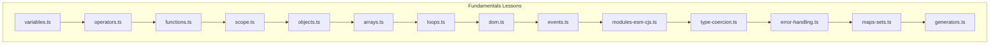

**Diagram sources**
- [variables.ts:3-30](file://src/content/learn/fundamentals/variables.ts#L3-L30)
- [operators.ts:3-35](file://src/content/learn/fundamentals/operators.ts#L3-L35)
- [functions.ts:3-30](file://src/content/learn/fundamentals/functions.ts#L3-L30)
- [scope.ts:3-35](file://src/content/learn/fundamentals/scope.ts#L3-L35)
- [objects.ts:3-36](file://src/content/learn/fundamentals/objects.ts#L3-L36)
- [arrays.ts:3-37](file://src/content/learn/fundamentals/arrays.ts#L3-L37)
- [loops.ts:3-35](file://src/content/learn/fundamentals/loops.ts#L3-L35)
- [dom.ts:3-36](file://src/content/learn/fundamentals/dom.ts#L3-L36)
- [events.ts:3-36](file://src/content/learn/fundamentals/events.ts#L3-L36)
- [modules-esm-cjs.ts:3-30](file://src/content/learn/fundamentals/modules-esm-cjs.ts#L3-L30)
- [type-coercion.ts:3-29](file://src/content/learn/fundamentals/type-coercion.ts#L3-L29)
- [error-handling.ts:3-36](file://src/content/learn/fundamentals/error-handling.ts#L3-L36)
- [maps-sets.ts:3-29](file://src/content/learn/fundamentals/maps-sets.ts#L3-L29)
- [generators.ts:3-30](file://src/content/learn/fundamentals/generators.ts#L3-L30)

**Section sources**
- [variables.ts:3-633](file://src/content/learn/fundamentals/variables.ts#L3-L633)
- [operators.ts:3-529](file://src/content/learn/fundamentals/operators.ts#L3-L529)
- [functions.ts:3-552](file://src/content/learn/fundamentals/functions.ts#L3-L552)
- [scope.ts:3-485](file://src/content/learn/fundamentals/scope.ts#L3-L485)
- [objects.ts:3-361](file://src/content/learn/fundamentals/objects.ts#L3-L361)
- [arrays.ts:3-540](file://src/content/learn/fundamentals/arrays.ts#L3-L540)
- [loops.ts:3-487](file://src/content/learn/fundamentals/loops.ts#L3-L487)
- [dom.ts:3-563](file://src/content/learn/fundamentals/dom.ts#L3-L563)
- [events.ts:3-677](file://src/content/learn/fundamentals/events.ts#L3-L677)
- [modules-esm-cjs.ts:3-626](file://src/content/learn/fundamentals/modules-esm-cjs.ts#L3-L626)
- [type-coercion.ts:3-375](file://src/content/learn/fundamentals/type-coercion.ts#L3-L375)
- [error-handling.ts:3-713](file://src/content/learn/fundamentals/error-handling.ts#L3-L713)
- [maps-sets.ts:3-562](file://src/content/learn/fundamentals/maps-sets.ts#L3-L562)
- [generators.ts:3-711](file://src/content/learn/fundamentals/generators.ts#L3-L711)

## Core Components
This section outlines the essential JavaScript fundamentals covered in the Fundamentals category, highlighting prerequisites and how each topic builds upon the previous ones.

- Variables & Types
  - Declaring variables with var, let, and const; scoping rules; primitive and reference types; numbers, strings, booleans, nullish values; type coercion; destructuring; naming conventions.
  - Prerequisite: None
  - Learning goals: Distinguish var/let/const; understand primitives/reference types; master type coercion; use destructuring; handle null/undefined safely.

- Operators
  - Arithmetic, assignment, comparison, logical, nullish coalescing (??), optional chaining (?.), spread/rest, ternary, bitwise, comma; operator precedence.
  - Prerequisite: Variables & Types
  - Learning goals: Use operators confidently; understand equality rules; apply modern operators; manage precedence.

- Functions
  - Declarations, expressions, arrow functions, default/rest parameters, higher-order functions, callbacks, IIFE, recursion, generators; this binding differences.
  - Prerequisite: Variables & Types
  - Learning goals: Declare with all syntaxes; understand hoisting; use arrow vs regular; default/rest params; higher-order functions; IIFE; recursion; generators.

- Scope
  - Global, function, block scope; hoisting; TDZ; scope chain; lexical vs dynamic; module scope; classic loop bug; variable shadowing; strict mode.
  - Prerequisite: Variables & Types, Functions
  - Learning goals: Distinguish scopes; understand hoisting/TDZ; trace scope chain; use module scope; avoid scoping bugs.

- Objects
  - Creation, property access, methods, destructuring, computed properties, object methods, iteration, copying, getters/setters, property descriptors.
  - Prerequisite: Variables & Types
  - Learning goals: Create with literals; access with dot/bracket; use destructuring/shorthand; iterate; shallow/deep copy; getters/setters; descriptors.

- Arrays
  - Creation, accessing/modifying, adding/removing, iteration, transforming (map/filter/reduce), searching, sorting, slicing/splicing, flattening, destructuring/spread, mutating vs non-mutating, array-like objects.
  - Prerequisite: Variables & Types
  - Learning goals: Create/access arrays; mutating methods; iterate; transform/chaining; understand mutating vs non-mutating; work with array-like.

- Loops
  - for, while/do...while, for...of, for...in, break/continue, labeled statements, async iteration, patterns, performance.
  - Prerequisite: Variables & Types
  - Learning goals: Choose right loop; use break/continue; understand for...of vs for...in; async iteration; avoid pitfalls.

- DOM Basics
  - What is the DOM; selecting elements; modifying content/attributes/classes/styles; creating/inserting/removing elements; traversal; DocumentFragment; MutationObserver; forms; performance tips.
  - Prerequisite: Variables & Types, Functions
  - Learning goals: Select/create/modify DOM; traverse safely; use fragments; observe changes; forms; performance.

- Events
  - Adding listeners; event object; mouse/keyboard/form events; bubbling/capturing; delegation; preventDefault; custom events; AbortController; touch/pointer; scroll/resize.
  - Prerequisite: DOM Basics, Functions
  - Learning goals: Add/remove listeners; use event object; understand propagation; delegation; preventDefault; custom events; AbortController; pointer/touch; scroll/resize.

- Modules: ESM and CommonJS
  - Understanding module systems; CommonJS syntax and features; ES Modules syntax and features; differences; interoperability; performance; migration guide.
  - Prerequisite: variables, functions, objects
  - Learning goals: Understand CJS/ESM; syntax differences; interop; performance; migration.

- Type Coercion
  - Implicit/explicit coercion; string/numeric/boolean coercion; abstract equality vs strict equality; explicit conversion; pitfalls; best practices.
  - Prerequisite: data-types, operators
  - Learning goals: Understand coercion rules; use ===; avoid pitfalls; explicit conversion.

- Error Handling
  - try/catch/finally; Error object; throwing; built-in error types; custom errors; async error handling; global handlers; retry pattern; safe wrappers; React error boundaries; logging.
  - Prerequisite: Functions
  - Learning goals: Handle sync/async errors; throw/custom errors; global handlers; retry/backoff; safe wrappers; React boundaries; logging.

- Maps and Sets
  - Map vs object; Set vs array; WeakMap/WeakSet; iteration; practical use cases; caching; frequency counting; unique items; event listeners.
  - Prerequisite: objects, arrays, iteration
  - Learning goals: Map/Set advantages; Weak variants; iteration; real-world patterns.

- Generators and Iterators
  - Generator syntax; yield; pausing/resuming; iterator protocol; generator delegation; lazy evaluation; infinite sequences; custom iterables; error handling; real-world examples.
  - Prerequisite: functions, arrays, loops
  - Learning goals: Generator functions; yield; delegation; lazy evaluation; custom iterators; state machines; pagination.

**Section sources**
- [variables.ts:13-30](file://src/content/learn/fundamentals/variables.ts#L13-L30)
- [operators.ts:13-29](file://src/content/learn/fundamentals/operators.ts#L13-L29)
- [functions.ts:13-30](file://src/content/learn/fundamentals/functions.ts#L13-L30)
- [scope.ts:13-29](file://src/content/learn/fundamentals/scope.ts#L13-L29)
- [objects.ts:13-30](file://src/content/learn/fundamentals/objects.ts#L13-L30)
- [arrays.ts:13-30](file://src/content/learn/fundamentals/arrays.ts#L13-L30)
- [loops.ts:13-29](file://src/content/learn/fundamentals/loops.ts#L13-L29)
- [dom.ts:13-30](file://src/content/learn/fundamentals/dom.ts#L13-L30)
- [events.ts:13-30](file://src/content/learn/fundamentals/events.ts#L13-L30)
- [modules-esm-cjs.ts:13-29](file://src/content/learn/fundamentals/modules-esm-cjs.ts#L13-L29)
- [type-coercion.ts:13-28](file://src/content/learn/fundamentals/type-coercion.ts#L13-L28)
- [error-handling.ts:13-30](file://src/content/learn/fundamentals/error-handling.ts#L13-L30)
- [maps-sets.ts:13-28](file://src/content/learn/fundamentals/maps-sets.ts#L13-L28)
- [generators.ts:13-29](file://src/content/learn/fundamentals/generators.ts#L13-L29)

## Architecture Overview
The Fundamentals lessons form a coherent learning pathway. Each lesson specifies prerequisites and relates to related topics, enabling learners to progress systematically. The content model uses a consistent structure: metadata, learning goals, sections (headings, paragraphs, callouts, tables, code blocks), exercises, and best practices.

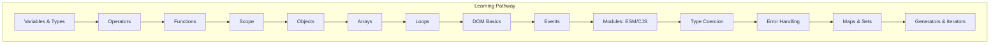

**Diagram sources**
- [variables.ts:14-20](file://src/content/learn/fundamentals/variables.ts#L14-L20)
- [operators.ts:14-20](file://src/content/learn/fundamentals/operators.ts#L14-L20)
- [functions.ts:14-20](file://src/content/learn/fundamentals/functions.ts#L14-L20)
- [scope.ts:14-20](file://src/content/learn/fundamentals/scope.ts#L14-L20)
- [objects.ts:14-20](file://src/content/learn/fundamentals/objects.ts#L14-L20)
- [arrays.ts:14-20](file://src/content/learn/fundamentals/arrays.ts#L14-L20)
- [loops.ts:14-20](file://src/content/learn/fundamentals/loops.ts#L14-L20)
- [dom.ts:14-20](file://src/content/learn/fundamentals/dom.ts#L14-L20)
- [events.ts:14-20](file://src/content/learn/fundamentals/events.ts#L14-L20)
- [modules-esm-cjs.ts:14-20](file://src/content/learn/fundamentals/modules-esm-cjs.ts#L14-L20)
- [type-coercion.ts:14-20](file://src/content/learn/fundamentals/type-coercion.ts#L14-L20)
- [error-handling.ts:14-20](file://src/content/learn/fundamentals/error-handling.ts#L14-L20)
- [maps-sets.ts:14-20](file://src/content/learn/fundamentals/maps-sets.ts#L14-L20)
- [generators.ts:14-20](file://src/content/learn/fundamentals/generators.ts#L14-L20)

## Detailed Component Analysis

### Variables & Types
- Core concepts: var/let/const scoping, hoisting, reassignment, global object property behavior.
- Primitive types: string, number, boolean, undefined, null, symbol, bigint; typeof nuances.
- Numbers: floating-point precision, special values, safe comparisons, BigInt.
- Strings: immutability, methods, Unicode handling, template literals, tagged templates.
- Booleans and truthy/falsy: 8 falsy values, common traps, double-negation.
- Type coercion: loose vs strict equality, string concatenation vs addition, comparison coercion.
- Reference types: objects, arrays, functions; reference vs value semantics; shallow vs deep copy.
- Symbols: unique keys, well-known symbols, iteration.
- Nullish values: null vs undefined; nullish coalescing (??), optional chaining (?.).
- typeof and type checking: typeof quirks, Array.isArray, instanceof caveats, robust utilities.
- Naming conventions: camelCase, UPPER_SNAKE_CASE, PascalCase, boolean prefixes.
- Destructuring: object/array destructuring, defaults, renaming, nested destructuring, function parameters, return destructuring.
- Common mistakes: forgetting var leaks, == pitfalls, NaN checks, const mutation, typeof null, floating-point arithmetic.
- Performance considerations: const/let block-scoping optimizations, string concatenation, BigInt slowness, immutable patterns.
- Interview questions and best practices summary included.

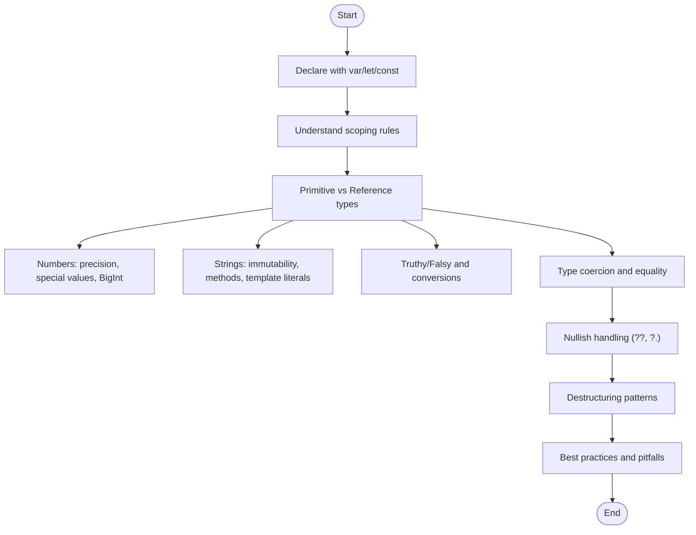

**Diagram sources**
- [variables.ts:38-633](file://src/content/learn/fundamentals/variables.ts#L38-L633)

**Section sources**
- [variables.ts:3-633](file://src/content/learn/fundamentals/variables.ts#L3-L633)

### Operators
- Arithmetic, assignment, comparison, logical, nullish coalescing (??), optional chaining (?.), spread/rest, ternary, bitwise, comma.
- Operator precedence and evaluation order.
- Real-world patterns: safe property access, conditional object properties, toggling booleans, clamping values, swapping without temp variables.
- Common mistakes: || vs ??, short-circuit side effects, chained comparisons, = vs ===, typeof pitfalls.
- Best practices: use ===, ?? for defaults, ?., explicit parentheses, avoid nested ternaries, use logical assignment, prefer Boolean() for readability.

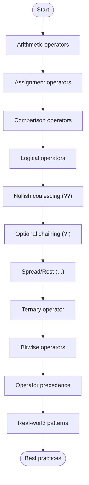

**Diagram sources**
- [operators.ts:36-529](file://src/content/learn/fundamentals/operators.ts#L36-L529)

**Section sources**
- [operators.ts:3-529](file://src/content/learn/fundamentals/operators.ts#L3-L529)

### Functions
- Function declarations (hoisted), expressions (not hoisted), arrow functions (lexical this).
- Arrow vs regular functions: this binding, arguments object, constructor, prototype, syntax.
- Default parameters and rest parameters; destructuring defaults.
- Higher-order functions and callbacks; IIFE; recursion; generators.
- Common mistakes: block-body arrow return, arrow as methods, missing arguments, arguments array misuse, excessive recursion, object literal return without parentheses.
- Performance tips: function declarations vs expressions, arrow overhead, avoid creating functions in loops, memoization, iterative alternatives.
- Best practices: arrow for callbacks/transforms, regular for methods, name functions, default parameters, rest over arguments, small focused functions, pure functions, early returns, JSDoc.

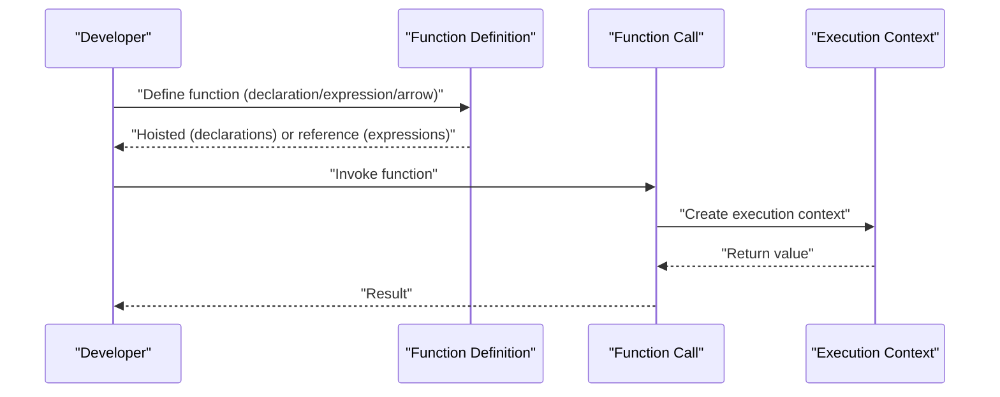

**Diagram sources**
- [functions.ts:38-552](file://src/content/learn/fundamentals/functions.ts#L38-L552)

**Section sources**
- [functions.ts:3-552](file://src/content/learn/fundamentals/functions.ts#L3-L552)

### Scope
- Global, function, and block scope; hoisting and TDZ; scope chain and lexical scoping; module scope; classic loop bug; variable shadowing; strict mode.
- Common mistakes: var function-scoping, accidental closure over loop variable, shadowing causing confusion, assuming hoisted let/const is undefined, creating globals; strict mode behavior.
- Best practices: use const/let, declare at top, small scopes, descriptive names, modules, strict mode, let in loops, linters.

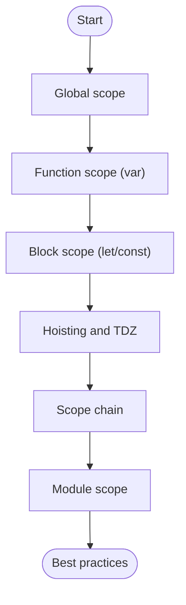

**Diagram sources**
- [scope.ts:36-485](file://src/content/learn/fundamentals/scope.ts#L36-L485)

**Section sources**
- [scope.ts:3-485](file://src/content/learn/fundamentals/scope.ts#L3-L485)

### Objects
- Object basics: literal syntax, dot/bracket notation, method shorthand, property shorthand.
- Dynamic properties: computed property names, adding/modifying/deleting, existence checks.
- Destructuring: basic, defaults, renaming, nested, rest; function parameters.
- Object methods: keys/values/entries, assign, freeze/seal, create.
- Iterating: for...in vs Object.entries; forEach; values/keys.
- Copying: shallow vs deep; structuredClone; JSON limitations.
- Getters/setters and property descriptors; freezing/sealing.
- Common mistakes: === on objects, mutating default parameters, shallow copy pitfalls, for...in inherited properties, deleting doesn't compact.
- Best practices: object shorthand, Object.entries over for...in, spread for non-mutating copies, structuredClone for deep, freeze for immutability, destructuring, computed property names, Object.hasOwn, getters/setters, keep objects focused.

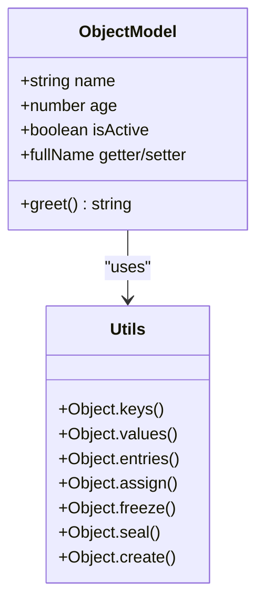

**Diagram sources**
- [objects.ts:37-361](file://src/content/learn/fundamentals/objects.ts#L37-L361)

**Section sources**
- [objects.ts:3-361](file://src/content/learn/fundamentals/objects.ts#L3-L361)

### Arrays
- Creating arrays: literals, Array constructor, Array.from/of, fill, spread.
- Accessing/modifying: indices, length, Array.isArray.
- Adding/removing: push/pop, unshift/shift, splice; performance notes.
- Iterating: for...of, forEach, entries; classic for loop; reverse iteration; avoid for...in.
- Transforming: map, filter, reduce; chaining; reduce to build objects/groups.
- Searching: find/findIndex, findLast/findLastIndex, includes, indexOf/lastIndexOf, some/every.
- Sorting: sort vs toSorted, localeCompare, numeric comparators; toReversed.
- Slicing/splicing: slice vs splice; toSpliced (ES2023).
- Flattening: flat, flatMap; practical expansion and filtering.
- Destructuring/spread: basic, skip, defaults, swap, nested, spread for merge/copy.
- Mutating vs non-mutating methods: table comparison.
- Array-like objects: arguments, NodeList, HTMLCollection; conversion to arrays.
- Advanced patterns: remove duplicates, chunking, intersection/difference, zipping, Object.groupBy.
- Common mistakes: === on arrays, delete holes, numeric sort without comparator, map/filter return discards, modifying while iterating, spread shallow copy pitfalls.
- Performance tips: push/pop O(1), pre-allocate arrays, Set for includes, reduce chains, for loops vs forEach, TypedArrays, flatMap, findIndex+splice.
- Best practices: prefer non-mutating methods, Array.isArray, for...of, forEach when index needed, chaining, destructuring, Set for uniqueness, at(-1), structuredClone, flatMap.

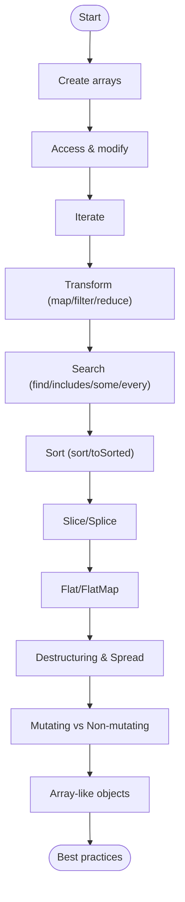

**Diagram sources**
- [arrays.ts:38-540](file://src/content/learn/fundamentals/arrays.ts#L38-L540)

**Section sources**
- [arrays.ts:3-540](file://src/content/learn/fundamentals/arrays.ts#L3-L540)

### Loops
- for, while/do...while, for...of (iterables), for...in (object keys).
- break/continue and labeled statements.
- Async iteration with for await...of.
- Patterns: FizzBuzz, pagination, retry loops, polling.
- Performance: caching length, avoiding repeated property access, avoiding function creation in loops.
- Common mistakes: off-by-one, infinite loops, modifying arrays while iterating, for...in on arrays, var closure bug.
- Best practices: for...of for arrays/iterables, for...in for objects with Object.hasOwn, let in for loops, array methods, early returns, labeled breaks, async iteration, generators for lazy sequences.

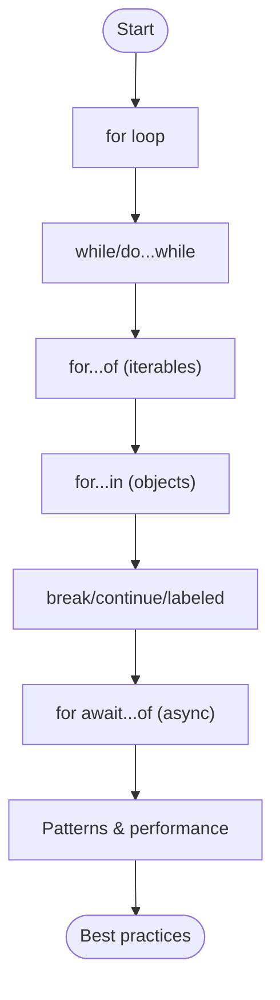

**Diagram sources**
- [loops.ts:36-487](file://src/content/learn/fundamentals/loops.ts#L36-L487)

**Section sources**
- [loops.ts:3-487](file://src/content/learn/fundamentals/loops.ts#L3-L487)

### DOM Basics
- What is the DOM; selecting elements (querySelector/querySelectorAll/getElementById); modifying content (textContent/innerText/innerHTML/outerHTML); attributes (getAttribute/setAttribute/removeAttribute/hasAttribute/direct property); classes (classList methods); styles (inline styles, CSS variables, computed styles).
- Creating/inserting/removing elements; DOM traversal (parent/children/siblings); DocumentFragment; MutationObserver; forms (elements, values, FormData, preventDefault).
- Performance tips: DocumentFragment/innerHTML for batch insertions, cache DOM references, requestAnimationFrame, batch reads/writes, event delegation, display:none batching, textContent vs innerHTML, classList vs className, detach for complex operations.
- Common mistakes: querySelector returns null, NodeList vs Array, live vs static collections, innerHTML XSS, setting styles without units, forgetting DOM load, layout thrashing.
- Best practices: querySelector with CSS selectors, check for null, textContent for text, classList methods, CSS classes for styling, DocumentFragment, event delegation, cache DOM references, data-* attributes, requestAnimationFrame.

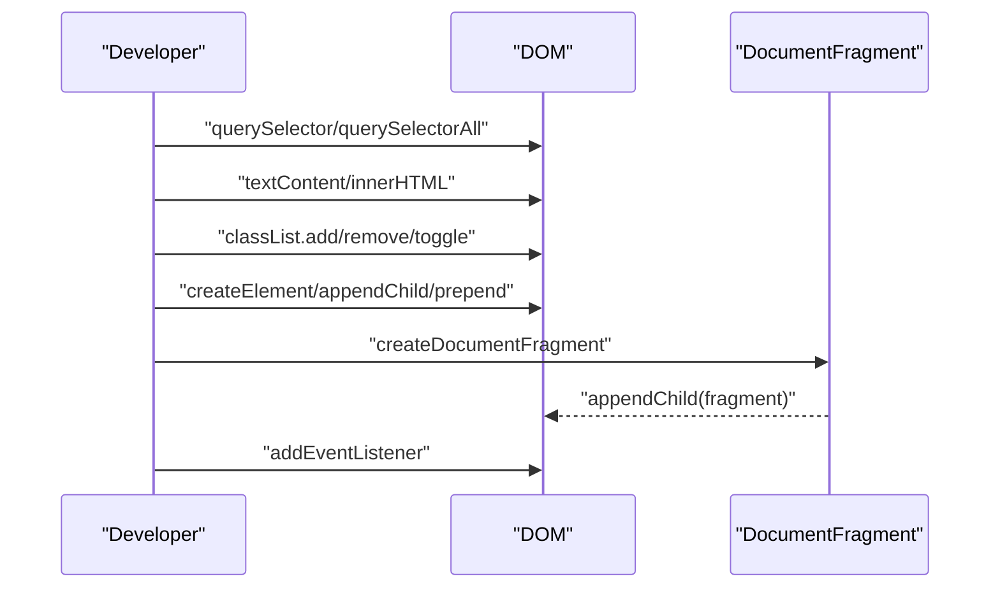

**Diagram sources**
- [dom.ts:37-563](file://src/content/learn/fundamentals/dom.ts#L37-L563)

**Section sources**
- [dom.ts:3-563](file://src/content/learn/fundamentals/dom.ts#L3-L563)

### Events
- Adding event listeners (addEventListener/options); event object (type/target/currentTarget/timeStamp/isTrusted; mouse properties; control propagation).
- Mouse events (click/dblclick/contextmenu/mouseenter/mouseleave/mousemove/mousedown/mouseup); keyboard events (keydown/keyup/input); form events (submit/change/input/focus/blur/focusin/focusout/reset).
- Event bubbling/capturing; delegation; preventDefault; custom events; AbortController; touch/pointer; scroll/resize.
- Common mistakes: arrow function with removeEventListener, onclick attribute override, passive for scroll/touch, memory leaks, unnecessary stopPropagation, not using { passive: true }.
- Best practices: addEventListener over onclick, delegation for lists, named functions for removal, AbortController, { passive: true }, { once: true }, debounce/throttle, e.target.closest, cleanup listeners, pointer events, custom events.

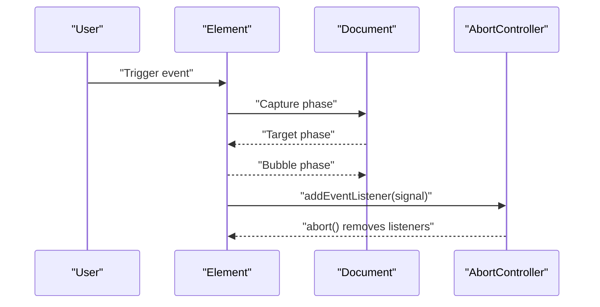

**Diagram sources**
- [events.ts:37-677](file://src/content/learn/fundamentals/events.ts#L37-L677)

**Section sources**
- [events.ts:3-677](file://src/content/learn/fundamentals/events.ts#L3-L677)

### Modules: ESM and CommonJS
- Understanding module systems: CommonJS (synchronous, Node.js) vs ES Modules (asynchronous, static, tree-shaking).
- CommonJS: require/module.exports, exports shorthand, conditional exports, circular dependencies.
- ES Modules: import/export syntax, default/named exports, re-exporting, namespaces, dynamic imports, top-level await, import.meta.
- ESM vs CJS differences: synchronous/async, tree-shaking, module binding, circular deps, top-level await, import syntax.
- Interoperability: ESM importing CJS, CJS importing ESM via dynamic import, hybrid wrapper approach.
- Migration guide: package.json "type": "module", .mjs extensions, require/module.exports to import/export, __dirname/__filename to import.meta.url, circular dependencies with dynamic imports.
- Best practices: prefer ESM, understand interop, optimize imports, use dynamic imports for conditional loading.

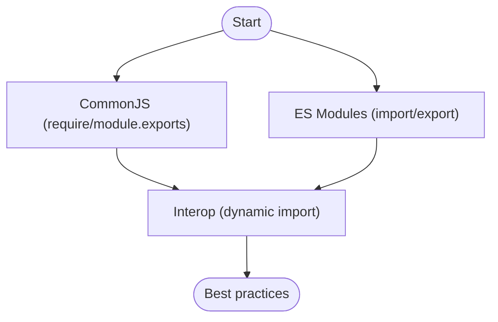

**Diagram sources**
- [modules-esm-cjs.ts:3-626](file://src/content/learn/fundamentals/modules-esm-cjs.ts#L3-L626)

**Section sources**
- [modules-esm-cjs.ts:3-626](file://src/content/learn/fundamentals/modules-esm-cjs.ts#L3-L626)

### Type Coercion
- Implicit coercion: string concatenation (+ with strings), numeric coercion (arithmetic/comparison/logical), boolean coercion (conditional contexts).
- Abstract equality (==) vs strict equality (===): coercion rules, surprising results, best practice to use === except value == null.
- Explicit type conversion: String(), Number(), Boolean(), parseInt/parseFloat, unary plus.
- Common pitfalls: == surprises, string concatenation vs addition, array/object comparisons, Array/Object coercion.
- Real-world examples: form validation, default values with ??, working with API responses, array flattening via coercion.
- Best practices: always use ===, understand falsy values, use explicit conversion, be aware of coercion in + and arithmetic.

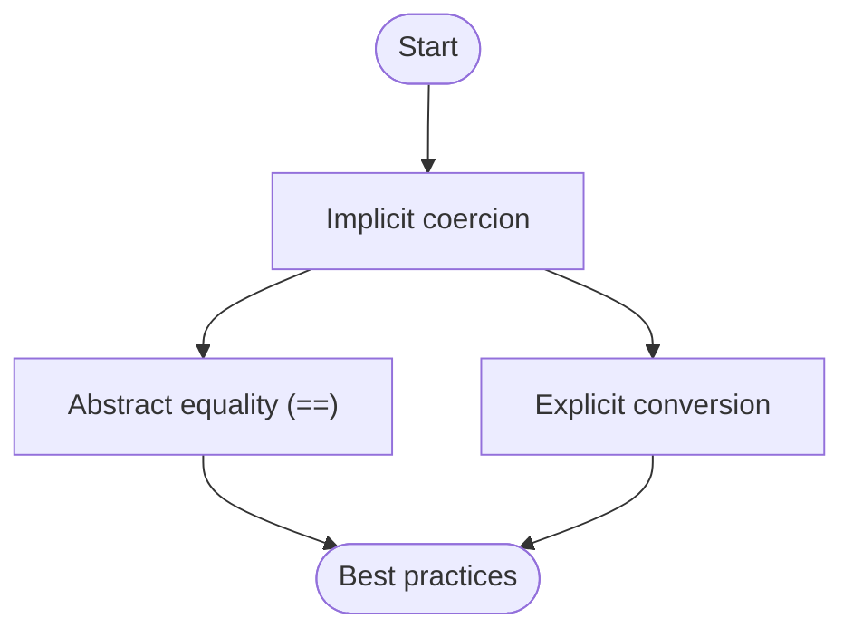

**Diagram sources**
- [type-coercion.ts:28-375](file://src/content/learn/fundamentals/type-coercion.ts#L28-L375)

**Section sources**
- [type-coercion.ts:3-375](file://src/content/learn/fundamentals/type-coercion.ts#L3-L375)

### Error Handling
- try/catch/finally; Error object (message/name/stack); throwing; built-in error types; custom error classes; error hierarchy pattern.
- Async error handling: Promise .catch(), async/await try/catch; Promise.allSettled; unhandled rejections.
- Global error handlers: browser window error/unhandledrejection; Node.js uncaughtException/unhandledRejection.
- Retry pattern: simple retry, exponential backoff; safe function wrappers; fallback patterns.
- React error boundaries: class component requirement, getDerivedStateFromError, componentDidCatch, usage patterns.
- Error logging & monitoring: structured logging, context, sendBeacon.
- Common mistakes: swallowing errors, catching too broadly, throwing strings, not re-throwing unknown errors, using try/catch for flow control, forgetting await.
- Best practices: use try/catch sparingly, throw Error objects, custom error classes, re-throw unhandled, error.cause, async try/catch/.catch, global handlers, error boundaries, retry with backoff, Promise.allSettled, production monitoring.

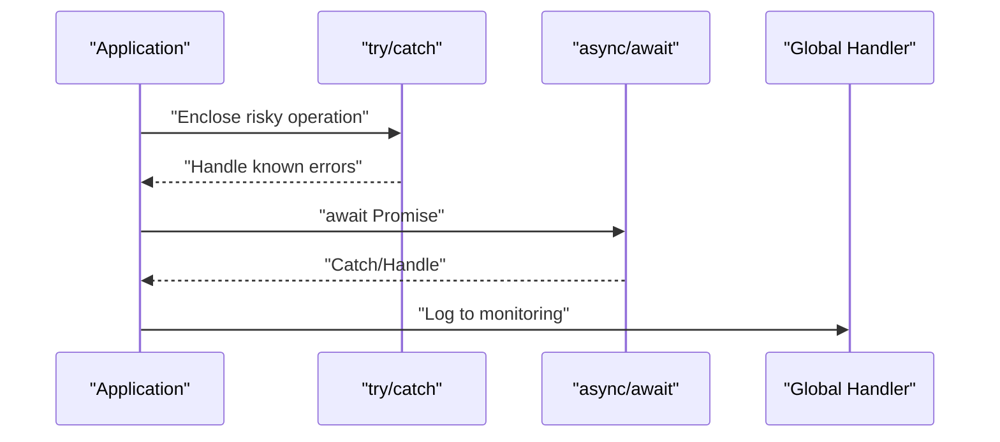

**Diagram sources**
- [error-handling.ts:37-713](file://src/content/learn/fundamentals/error-handling.ts#L37-L713)

**Section sources**
- [error-handling.ts:3-713](file://src/content/learn/fundamentals/error-handling.ts#L3-L713)

### Maps and Sets
- Map vs object: any type of key, size property, insertion order, performance for frequent additions/deletions.
- Set vs array: unique values, efficient membership testing, iteration.
- WeakMap/WeakSet: weak references, garbage collection, metadata/private data.
- Practical use cases: caching with Map, frequency counters, unique items, event listener management.
- Common mistakes: Set uniqueness by reference, performance comparisons.
- Best practices: choose Map/Set based on use case, Weak variants for metadata, structured iteration, practical patterns.

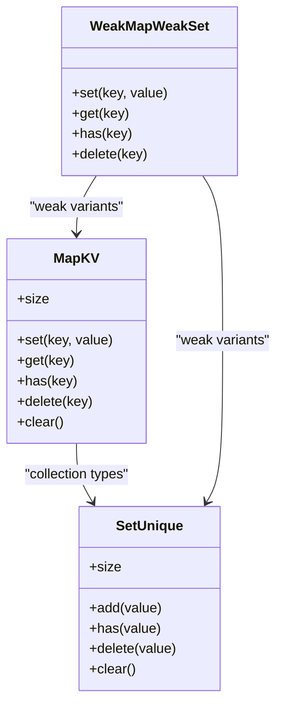

**Diagram sources**
- [maps-sets.ts:28-562](file://src/content/learn/fundamentals/maps-sets.ts#L28-L562)

**Section sources**
- [maps-sets.ts:3-562](file://src/content/learn/fundamentals/maps-sets.ts#L3-L562)

### Generators and Iterators
- Generator functions (function*); yield pauses/resumes execution; iterator protocol; next() returns {value, done}.
- Practical patterns: infinite sequences, lazy evaluation, generator delegation (yield*), custom iterables with Symbol.iterator.
- Memory efficiency: generators vs arrays; processing large datasets without loading all into memory.
- Advanced: error handling with throw(), return() for early termination; async generators; state machines; pagination.
- Real-world examples: pagination with generators, state machine with generators, file reader generator, command processor generator.
- Exercises: Fibonacci generator, range with lazy filtering/mapping, custom iterable, infinite ID generator, file reader generator, state machine.

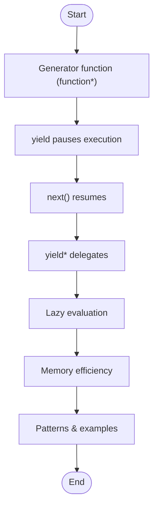

**Diagram sources**
- [generators.ts:30-711](file://src/content/learn/fundamentals/generators.ts#L30-L711)

**Section sources**
- [generators.ts:3-711](file://src/content/learn/fundamentals/generators.ts#L3-L711)

## Dependency Analysis
The Fundamentals lessons form a dependency graph where each lesson specifies prerequisites and related topics. The following diagram shows prerequisite relationships among lessons.

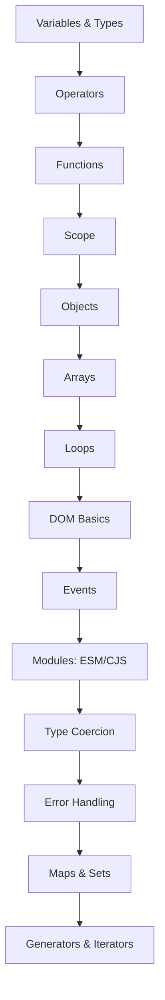

**Diagram sources**
- [variables.ts:14-20](file://src/content/learn/fundamentals/variables.ts#L14-L20)
- [operators.ts:14-20](file://src/content/learn/fundamentals/operators.ts#L14-L20)
- [functions.ts:14-20](file://src/content/learn/fundamentals/functions.ts#L14-L20)
- [scope.ts:14-20](file://src/content/learn/fundamentals/scope.ts#L14-L20)
- [objects.ts:14-20](file://src/content/learn/fundamentals/objects.ts#L14-L20)
- [arrays.ts:14-20](file://src/content/learn/fundamentals/arrays.ts#L14-L20)
- [loops.ts:14-20](file://src/content/learn/fundamentals/loops.ts#L14-L20)
- [dom.ts:14-20](file://src/content/learn/fundamentals/dom.ts#L14-L20)
- [events.ts:14-20](file://src/content/learn/fundamentals/events.ts#L14-L20)
- [modules-esm-cjs.ts:14-20](file://src/content/learn/fundamentals/modules-esm-cjs.ts#L14-L20)
- [type-coercion.ts:14-20](file://src/content/learn/fundamentals/type-coercion.ts#L14-L20)
- [error-handling.ts:14-20](file://src/content/learn/fundamentals/error-handling.ts#L14-L20)
- [maps-sets.ts:14-20](file://src/content/learn/fundamentals/maps-sets.ts#L14-L20)
- [generators.ts:14-20](file://src/content/learn/fundamentals/generators.ts#L14-L20)

**Section sources**
- [variables.ts:14-20](file://src/content/learn/fundamentals/variables.ts#L14-L20)
- [operators.ts:14-20](file://src/content/learn/fundamentals/operators.ts#L14-L20)
- [functions.ts:14-20](file://src/content/learn/fundamentals/functions.ts#L14-L20)
- [scope.ts:14-20](file://src/content/learn/fundamentals/scope.ts#L14-L20)
- [objects.ts:14-20](file://src/content/learn/fundamentals/objects.ts#L14-L20)
- [arrays.ts:14-20](file://src/content/learn/fundamentals/arrays.ts#L14-L20)
- [loops.ts:14-20](file://src/content/learn/fundamentals/loops.ts#L14-L20)
- [dom.ts:14-20](file://src/content/learn/fundamentals/dom.ts#L14-L20)
- [events.ts:14-20](file://src/content/learn/fundamentals/events.ts#L14-L20)
- [modules-esm-cjs.ts:14-20](file://src/content/learn/fundamentals/modules-esm-cjs.ts#L14-L20)
- [type-coercion.ts:14-20](file://src/content/learn/fundamentals/type-coercion.ts#L14-L20)
- [error-handling.ts:14-20](file://src/content/learn/fundamentals/error-handling.ts#L14-L20)
- [maps-sets.ts:14-20](file://src/content/learn/fundamentals/maps-sets.ts#L14-L20)
- [generators.ts:14-20](file://src/content/learn/fundamentals/generators.ts#L14-L20)

## Performance Considerations
- Variables & Types: const/let block-scoping optimizations, string concatenation performance, BigInt slowness, type conversion in hot paths, typeof speed, immutable patterns.
- Operators: operator precedence, ?? vs || for defaults, ?., logical assignment, spread for immutable operations, Boolean() readability.
- Functions: function declarations vs expressions, arrow overhead, avoid creating functions in loops, memoization, iterative alternatives.
- Scope: declare at top, small scopes, module scope encapsulation, strict mode benefits.
- Objects: Object.entries over for...in, spread for non-mutating copies, structuredClone for deep, freeze for immutability, destructuring, computed property names, Object.hasOwn, getters/setters.
- Arrays: push/pop O(1), pre-allocate arrays, Set for includes, reduce chains, for loops vs forEach, TypedArrays, flatMap, findIndex+splice.
- Loops: cache length, avoid repeated property access, avoid function creation in loops, for...of for arrays/iterables, async iteration, generators for lazy sequences.
- DOM: DocumentFragment/innerHTML for batch insertions, cache DOM references, requestAnimationFrame, batch reads/writes, event delegation, display:none batching, textContent vs innerHTML, classList vs className, detach for complex operations.
- Events: { passive: true } for scroll/touch, { once: true } for one-time handlers, AbortController for cleanup, delegation for dynamic content, pointer events, custom events.
- Modules: tree-shaking with ESM, dynamic imports for conditional loading.
- Type Coercion: === over ==, explicit conversion, coercion awareness in + and arithmetic.
- Error Handling: global handlers, logging with context, error boundaries, retry with backoff, Promise.allSettled.
- Maps & Sets: Map/Set advantages over objects/arrays, Weak variants for metadata, structured iteration, practical patterns.
- Generators: lazy evaluation saves memory, generator delegation, custom iterables, async generators.

[No sources needed since this section provides general guidance]

## Troubleshooting Guide
- Variables & Types: Use === instead of ==, typeof null === 'object' bug, NaN checks, const mutation, floating-point arithmetic, template literals, destructuring pitfalls.
- Operators: || vs ??, short-circuit side effects, chained comparisons, = vs ===, typeof pitfalls.
- Functions: Block-body arrow return, arrow as methods, missing arguments, arguments array misuse, excessive recursion, object literal return without parentheses.
- Scope: var function-scoping, accidental closure over loop variable, shadowing, hoisted let/const undefined, creating globals, strict mode.
- Objects: === on objects, mutating default parameters, shallow copy pitfalls, for...in inherited properties, deleting doesn't compact.
- Arrays: === on arrays, delete holes, numeric sort without comparator, map/filter return discards, modifying while iterating, spread shallow copy pitfalls.
- Loops: off-by-one, infinite loops, modifying arrays while iterating, for...in on arrays, var closure bug.
- DOM: querySelector returns null, NodeList vs Array, live vs static collections, innerHTML XSS, setting styles without units, layout thrashing.
- Events: arrow function with removeEventListener, onclick attribute override, passive for scroll/touch, memory leaks, unnecessary stopPropagation.
- Modules: ESM importing CJS named exports, CJS importing ESM, circular dependencies, dynamic import for interop.
- Type Coercion: == surprises, string concatenation vs addition, array/object comparisons.
- Error Handling: swallowing errors, catching too broadly, throwing strings, not re-throwing unknown errors, using try/catch for flow control, forgetting await.
- Maps & Sets: Set uniqueness by reference, performance comparisons.
- Generators: error handling with throw(), early termination with return(), async generators, state machines.

**Section sources**
- [variables.ts:526-633](file://src/content/learn/fundamentals/variables.ts#L526-L633)
- [operators.ts:411-529](file://src/content/learn/fundamentals/operators.ts#L411-L529)
- [functions.ts:480-552](file://src/content/learn/fundamentals/functions.ts#L480-L552)
- [scope.ts:399-485](file://src/content/learn/fundamentals/scope.ts#L399-L485)
- [objects.ts:304-361](file://src/content/learn/fundamentals/objects.ts#L304-L361)
- [arrays.ts:470-540](file://src/content/learn/fundamentals/arrays.ts#L470-L540)
- [loops.ts:431-487](file://src/content/learn/fundamentals/loops.ts#L431-L487)
- [dom.ts:507-563](file://src/content/learn/fundamentals/dom.ts#L507-L563)
- [events.ts:623-677](file://src/content/learn/fundamentals/events.ts#L623-L677)
- [modules-esm-cjs.ts:378-626](file://src/content/learn/fundamentals/modules-esm-cjs.ts#L378-L626)
- [type-coercion.ts:239-375](file://src/content/learn/fundamentals/type-coercion.ts#L239-L375)
- [error-handling.ts:639-713](file://src/content/learn/fundamentals/error-handling.ts#L639-L713)
- [maps-sets.ts:540-562](file://src/content/learn/fundamentals/maps-sets.ts#L540-L562)
- [generators.ts:515-711](file://src/content/learn/fundamentals/generators.ts#L515-L711)

## Conclusion
The Fundamentals category establishes a robust foundation for JavaScript development by progressing from variables and types through functions, scope, objects, arrays, loops, DOM, events, modules, type coercion, error handling, Maps/Sets, and generators. Each lesson emphasizes practical examples, common pitfalls, performance considerations, and best practices, preparing learners for real-world applications and more advanced topics.

[No sources needed since this section summarizes without analyzing specific files]

## Appendices
- Formatting standards: Lessons use a consistent structure with metadata, learning goals, sections (headings, paragraphs, callouts, tables, code blocks), exercises, and best practices.
- Interactive elements: Code demonstrations and exercises encourage hands-on practice; callouts highlight tips and warnings; tables summarize key differences and behaviors.
- Real-world applications: DOM and events connect to browser development; modules integrate with Node.js and bundlers; error handling and logging support production systems; generators enable efficient data processing and async flows.

[No sources needed since this section provides general guidance]