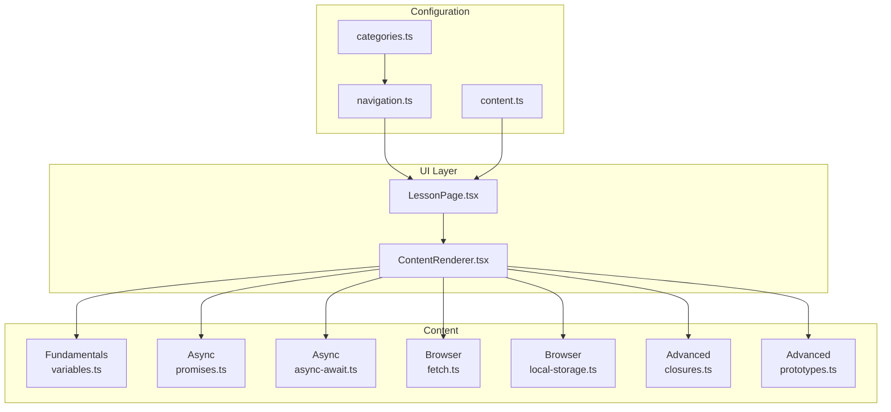
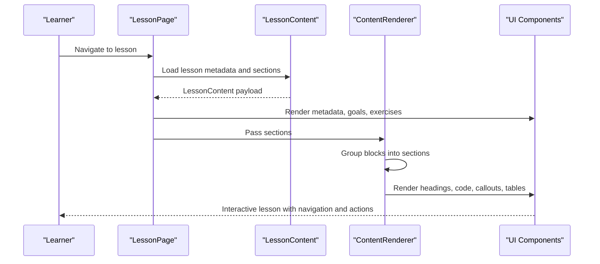
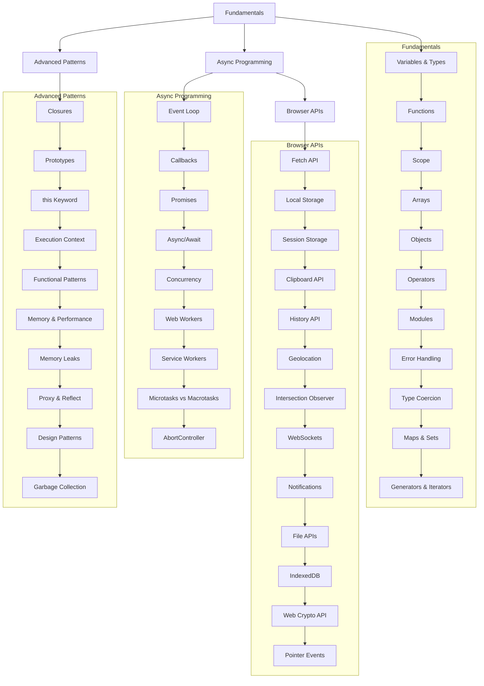
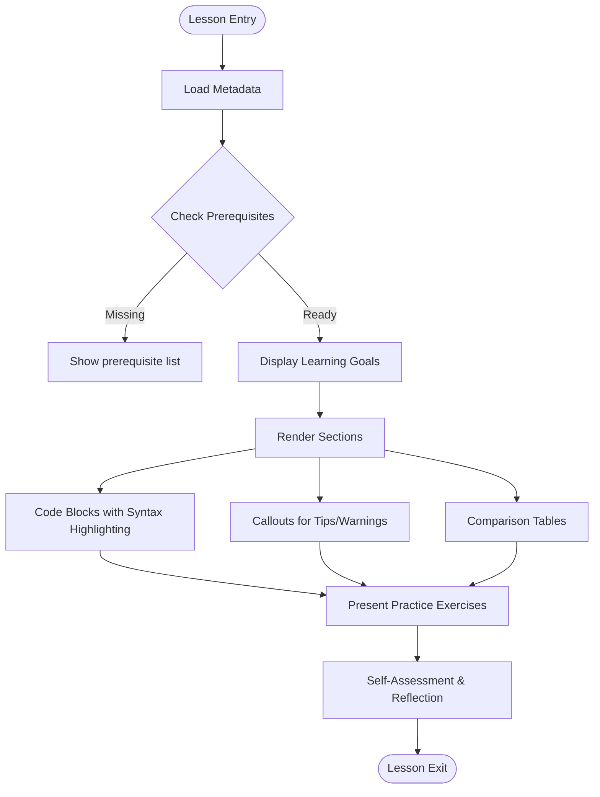
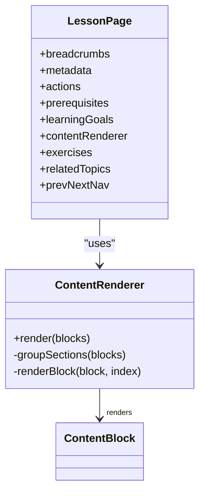
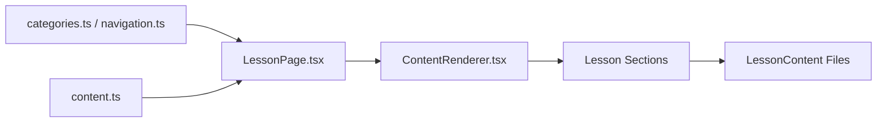

# Learn Pilar Documentation

<cite>
**Referenced Files in This Document**
- [categories.ts](file://src/config/categories.ts)
- [navigation.ts](file://src/config/navigation.ts)
- [content.ts](file://src/types/content.ts)
- [LessonPage.tsx](file://src/features/learn/LessonPage.tsx)
- [ContentRenderer.tsx](file://src/components/content/ContentRenderer.tsx)
- [variables.ts](file://src/content/learn/fundamentals/variables.ts)
- [promises.ts](file://src/content/learn/async/promises.ts)
- [async-await.ts](file://src/content/learn/async/async-await.ts)
- [fetch.ts](file://src/content/learn/browser/fetch.ts)
- [local-storage.ts](file://src/content/learn/browser/local-storage.ts)
- [closures.ts](file://src/content/learn/closures.ts)
- [prototypes.ts](file://src/content/learn/advanced/prototypes.ts)
</cite>

## Table of Contents
1. [Introduction](#introduction)
2. [Project Structure](#project-structure)
3. [Core Components](#core-components)
4. [Architecture Overview](#architecture-overview)
5. [Detailed Component Analysis](#detailed-component-analysis)
6. [Dependency Analysis](#dependency-analysis)
7. [Performance Considerations](#performance-considerations)
8. [Troubleshooting Guide](#troubleshooting-guide)
9. [Conclusion](#conclusion)
10. [Appendices](#appendices)

## Introduction
Learn Pilar is a structured, progressive JavaScript education platform designed to guide learners from fundamentals to advanced topics. It emphasizes mastery through clear prerequisites, incremental complexity, and practical application. The platform organizes content into four pillars: Learn (structured lessons), Reference (quick lookups), Integrations (external services), Recipes (practical patterns), Projects (hands-on apps), Explore (ecosystem resources), and Errors (debugging guides). Within Learn, the curriculum is divided into four domains: Fundamentals, Advanced Patterns, Async Programming, and Browser APIs. Each lesson follows a consistent structure with learning goals, prerequisites, interactive exercises, and assessment cues, ensuring a scaffolded learning experience.

## Project Structure
The platform uses a content-first architecture with TypeScript/React front-end components and a modular content model. Navigation defines the hierarchical structure of Learn topics, while content files encode lessons as structured data with standardized metadata and sections. UI components render lessons dynamically, applying consistent typography, code blocks, callouts, and interactive elements.

**Diagram sources**
- [categories.ts:14-85](file://src/config/categories.ts#L14-L85)
- [navigation.ts:62-262](file://src/config/navigation.ts#L62-L262)
- [content.ts:30-80](file://src/types/content.ts#L30-L80)
- [LessonPage.tsx:19-122](file://src/features/learn/LessonPage.tsx#L19-L122)
- [ContentRenderer.tsx:29-156](file://src/components/content/ContentRenderer.tsx#L29-L156)
- [variables.ts:3-633](file://src/content/learn/fundamentals/variables.ts#L3-L633)
- [promises.ts:3-471](file://src/content/learn/async/promises.ts#L3-L471)
- [async-await.ts:3-507](file://src/content/learn/async/async-await.ts#L3-L507)
- [fetch.ts:3-652](file://src/content/learn/browser/fetch.ts#L3-L652)
- [local-storage.ts:3-389](file://src/content/learn/browser/local-storage.ts#L3-L389)
- [closures.ts:3-494](file://src/content/learn/closures.ts#L3-L494)
- [prototypes.ts:3-501](file://src/content/learn/advanced/prototypes.ts#L3-L501)

**Section sources**
- [categories.ts:14-85](file://src/config/categories.ts#L14-L85)
- [navigation.ts:62-262](file://src/config/navigation.ts#L62-L262)
- [content.ts:30-80](file://src/types/content.ts#L30-L80)

## Core Components
- Content Model: Lessons are typed entities with metadata, prerequisites, learning goals, sections, and exercises. Sections support paragraphs, headings, code blocks, lists, callouts, and tables. This uniform structure enables consistent rendering and navigation.
- Rendering Pipeline: The LessonPage composes metadata, prerequisites, learning goals, content renderer, exercises, related topics, and navigation. The ContentRenderer groups blocks into concept sections, applies semantic headings, renders code with syntax highlighting, and formats callouts and tables.
- Navigation & Organization: The navigation configuration defines Learn categories and items, grouping topics by domain (Fundamentals, Advanced, Async, Browser APIs) and ordering them for progressive learning.

**Section sources**
- [content.ts:30-80](file://src/types/content.ts#L30-L80)
- [LessonPage.tsx:19-122](file://src/features/learn/LessonPage.tsx#L19-L122)
- [ContentRenderer.tsx:29-156](file://src/components/content/ContentRenderer.tsx#L29-L156)
- [navigation.ts:62-262](file://src/config/navigation.ts#L62-L262)

## Architecture Overview
The Learn Pilar architecture separates concerns across configuration, content, UI, and rendering layers. Configuration defines the Learn taxonomy and navigation. Content is authored as structured lesson files. UI components assemble metadata, render sections, and provide interactive elements. The result is a scalable, content-driven educational platform.

**Diagram sources**
- [LessonPage.tsx:19-122](file://src/features/learn/LessonPage.tsx#L19-L122)
- [ContentRenderer.tsx:29-156](file://src/components/content/ContentRenderer.tsx#L29-L156)
- [content.ts:74-80](file://src/types/content.ts#L74-L80)

## Detailed Component Analysis

### Progressive Learning Pathways
The platform organizes learning into clear domains with explicit prerequisites and sequencing:
- Fundamentals: Variables & Types, Functions, Scope, Arrays, Objects, Operators, Modules, Error Handling, Type Coercion, Maps & Sets, Generators & Iterators. These establish core mental models and language mechanics.
- Async Programming: Event Loop, Callbacks, Promises, Async/Await, Concurrency, Web Workers, Service Workers, Microtasks vs Macrotasks, AbortController. Learners build intuition about asynchronous control flow and error handling.
- Browser APIs: Fetch API, Local Storage, Session Storage, Clipboard API, History API, Geolocation, Intersection Observer, WebSockets, Notifications, File APIs, IndexedDB, Web Crypto API, Pointer Events. Learners integrate JavaScript with browser capabilities.
- Advanced Patterns: Closures, Prototypes, this Keyword, Execution Context, Functional Patterns, Memory & Performance, Memory Leaks, Proxy & Reflect, Design Patterns, Garbage Collection. Learners master internals and advanced abstractions.

**Diagram sources**
- [navigation.ts:66-117](file://src/config/navigation.ts#L66-L117)
- [variables.ts:20-30](file://src/content/learn/fundamentals/variables.ts#L20-L30)
- [promises.ts:20-28](file://src/content/learn/async/promises.ts#L20-L28)
- [async-await.ts:20-28](file://src/content/learn/async/async-await.ts#L20-L28)
- [fetch.ts:20-29](file://src/content/learn/browser/fetch.ts#L20-L29)
- [local-storage.ts:20-28](file://src/content/learn/browser/local-storage.ts#L20-L28)
- [closures.ts:23-30](file://src/content/learn/closures.ts#L23-L30)
- [prototypes.ts:20-28](file://src/content/learn/advanced/prototypes.ts#L20-L28)

**Section sources**
- [navigation.ts:66-117](file://src/config/navigation.ts#L66-L117)
- [variables.ts:20-30](file://src/content/learn/fundamentals/variables.ts#L20-L30)
- [promises.ts:20-28](file://src/content/learn/async/promises.ts#L20-L28)
- [async-await.ts:20-28](file://src/content/learn/async/async-await.ts#L20-L28)
- [fetch.ts:20-29](file://src/content/learn/browser/fetch.ts#L20-L29)
- [local-storage.ts:20-28](file://src/content/learn/browser/local-storage.ts#L20-L28)
- [closures.ts:23-30](file://src/content/learn/closures.ts#L23-L30)
- [prototypes.ts:20-28](file://src/content/learn/advanced/prototypes.ts#L20-L28)

### Lesson Format and Pedagogy
Each lesson follows a consistent, learner-centered structure:
- Metadata: id, title, description, slug, pillar, category, tags, difficulty, contentType, summary, relatedTopics, order, updatedAt, readingTime, featured, keywords, aliases.
- Prerequisites: A list of prior topics required for understanding.
- Learning Goals: Specific outcomes framed as actionable statements.
- Sections: Structured content blocks (headings, paragraphs, code, lists, callouts, tables) that present concepts incrementally.
- Exercises: Practical tasks that reinforce learning and encourage hands-on practice.
- Related Topics: Cross-links to complementary content for deeper exploration.

**Diagram sources**
- [content.ts:74-80](file://src/types/content.ts#L74-L80)
- [LessonPage.tsx:69-114](file://src/features/learn/LessonPage.tsx#L69-L114)
- [ContentRenderer.tsx:29-156](file://src/components/content/ContentRenderer.tsx#L29-L156)

**Section sources**
- [content.ts:74-80](file://src/types/content.ts#L74-L80)
- [LessonPage.tsx:69-114](file://src/features/learn/LessonPage.tsx#L69-L114)
- [ContentRenderer.tsx:29-156](file://src/components/content/ContentRenderer.tsx#L29-L156)

### Content Rendering and Interactive Elements
The ContentRenderer component transforms structured sections into a polished, accessible lesson:
- Headings: Semantic h2/h3/h4 with consistent styling and smooth scrolling behavior.
- Paragraphs: Enhanced readability with animated transitions and inline code parsing.
- Code Blocks: Syntax-highlighted rendering with filename and optional highlight ranges.
- Lists: Ordered and unordered lists styled for dense information consumption.
- Callouts: Distinct variants (info, warning, tip, danger) for emphasis and guidance.
- Tables: Responsive tables with clear headers and compact cells.

**Diagram sources**
- [ContentRenderer.tsx:29-156](file://src/components/content/ContentRenderer.tsx#L29-L156)
- [LessonPage.tsx:43-119](file://src/features/learn/LessonPage.tsx#L43-L119)

**Section sources**
- [ContentRenderer.tsx:29-156](file://src/components/content/ContentRenderer.tsx#L29-L156)
- [LessonPage.tsx:43-119](file://src/features/learn/LessonPage.tsx#L43-L119)

### Assessment and Progress Tracking
Assessment occurs through:
- Self-assessment cues embedded in lessons (e.g., Interview Questions, Best Practices summaries).
- Practical exercises that encourage hands-on reinforcement.
- Navigation aids (Prev/Next) to maintain momentum and track progress.
- Metadata indicators (difficulty, reading time) to help learners choose appropriate content.

**Section sources**
- [variables.ts:584-630](file://src/content/learn/fundamentals/variables.ts#L584-L630)
- [promises.ts:453-468](file://src/content/learn/async/promises.ts#L453-L468)
- [async-await.ts:489-504](file://src/content/learn/async/async-await.ts#L489-L504)
- [LessonPage.tsx:66-114](file://src/features/learn/LessonPage.tsx#L66-L114)

### Learning Style Accommodations
- Visual learners benefit from code examples, tables, and callouts that emphasize key points.
- Verbal learners engage with structured explanations and narrative flow.
- Practical learners are supported by exercises and real-world patterns (e.g., memoization, event handlers).
- Analytical learners appreciate comparative tables (e.g., Promise combinators, storage alternatives) and performance considerations.

**Section sources**
- [ContentRenderer.tsx:106-134](file://src/components/content/ContentRenderer.tsx#L106-L134)
- [variables.ts:571-582](file://src/content/learn/fundamentals/variables.ts#L571-L582)
- [local-storage.ts:287-301](file://src/content/learn/browser/local-storage.ts#L287-L301)

## Dependency Analysis
The platform exhibits low coupling and high cohesion:
- Configuration (categories, navigation) decouples presentation from content.
- Content types define a stable contract for lessons, enabling independent authoring.
- UI components depend on the content model but remain agnostic to specific lesson details.
- Rendering pipeline isolates presentation logic from content structure.

**Diagram sources**
- [categories.ts:14-85](file://src/config/categories.ts#L14-L85)
- [navigation.ts:62-262](file://src/config/navigation.ts#L62-L262)
- [content.ts:30-80](file://src/types/content.ts#L30-L80)
- [LessonPage.tsx:19-122](file://src/features/learn/LessonPage.tsx#L19-L122)
- [ContentRenderer.tsx:29-156](file://src/components/content/ContentRenderer.tsx#L29-L156)

**Section sources**
- [categories.ts:14-85](file://src/config/categories.ts#L14-L85)
- [navigation.ts:62-262](file://src/config/navigation.ts#L62-L262)
- [content.ts:30-80](file://src/types/content.ts#L30-L80)
- [LessonPage.tsx:19-122](file://src/features/learn/LessonPage.tsx#L19-L122)
- [ContentRenderer.tsx:29-156](file://src/components/content/ContentRenderer.tsx#L29-L156)

## Performance Considerations
- Rendering efficiency: Grouping sections and memoizing renders reduces reflows and improves readability.
- Code rendering: Syntax highlighting and responsive tables ensure performance without sacrificing clarity.
- Asynchronous patterns: Lessons on Promises and async/await demonstrate best practices for avoiding blocking and managing concurrency.
- Storage patterns: Lessons on localStorage and IndexedDB emphasize capacity limits, synchronous APIs, and alternatives for large or complex data.

[No sources needed since this section provides general guidance]

## Troubleshooting Guide
Common issues and resolutions:
- Missing prerequisites: Lessons include prerequisite lists to guide learners to foundational topics.
- Asynchronous pitfalls: Promises and async/await lessons cover error handling, sequential vs parallel execution, and cancellation patterns.
- Browser API limitations: Fetch and storage lessons explain CORS, quota limits, and cross-tab synchronization.
- Closure-related bugs: Closures lesson addresses stale closures, memory leaks, and loop variable capture.

**Section sources**
- [promises.ts:387-427](file://src/content/learn/async/promises.ts#L387-L427)
- [async-await.ts:426-473](file://src/content/learn/async/async-await.ts#L426-L473)
- [fetch.ts:571-619](file://src/content/learn/browser/fetch.ts#L571-L619)
- [local-storage.ts:303-344](file://src/content/learn/browser/local-storage.ts#L303-L344)
- [closures.ts:232-256](file://src/content/learn/closures.ts#L232-L256)

## Conclusion
Learn Pilar provides a robust, scalable framework for JavaScript education. Its structured curriculum, consistent lesson format, and integrated assessment support learners at every stage. By emphasizing prerequisites, progressive complexity, and practical application, it bridges the gap between theory and real-world development.

[No sources needed since this section summarizes without analyzing specific files]

## Appendices

### Appendix A: Lesson Organization Examples
- Variables & Types: Establishes variable declarations, scoping rules, primitive/reference types, destructuring, and type coercion.
- Promises: Introduces Promise states, chaining, error handling, and combinators.
- Async/Await: Demonstrates async functions, error handling, sequential vs parallel execution, and cancellation.
- Fetch API: Covers HTTP methods, headers, error handling, cancellation, streaming, and request wrappers.
- Local Storage: Explains persistence, JSON serialization, TTL caching, cross-tab sync, and limitations.
- Closures: Explores privacy, currying, memoization, event handlers, and memory considerations.
- Prototypes: Teaches prototype chain, inheritance, classes, mixins, and property descriptors.

**Section sources**
- [variables.ts:3-633](file://src/content/learn/fundamentals/variables.ts#L3-L633)
- [promises.ts:3-471](file://src/content/learn/async/promises.ts#L3-L471)
- [async-await.ts:3-507](file://src/content/learn/async/async-await.ts#L3-L507)
- [fetch.ts:3-652](file://src/content/learn/browser/fetch.ts#L3-L652)
- [local-storage.ts:3-389](file://src/content/learn/browser/local-storage.ts#L3-L389)
- [closures.ts:3-494](file://src/content/learn/closures.ts#L3-L494)
- [prototypes.ts:3-501](file://src/content/learn/advanced/prototypes.ts#L3-L501)

### Appendix B: Content Formatting Standards
- Headings: Use h2 for major sections, h3/h4 for subsections; ensure unique ids for anchor links.
- Code: Prefer fenced code blocks with language identifiers; include filenames when helpful.
- Callouts: Use info/warning/tip/danger variants to highlight important points.
- Tables: Present comparisons and summaries with clear headers and concise rows.
- Lists: Ordered lists for steps; unordered for bullet points.

**Section sources**
- [ContentRenderer.tsx:50-138](file://src/components/content/ContentRenderer.tsx#L50-L138)

### Appendix C: Assessment Methods
- Embedded reflection prompts and best practices summaries.
- Practical exercises aligned with learning goals.
- Cross-topic references to reinforce connections.
- Difficulty and reading time metadata to guide pacing.

**Section sources**
- [variables.ts:584-630](file://src/content/learn/fundamentals/variables.ts#L584-L630)
- [promises.ts:453-468](file://src/content/learn/async/promises.ts#L453-L468)
- [async-await.ts:489-504](file://src/content/learn/async/async-await.ts#L489-L504)
- [LessonPage.tsx:66-114](file://src/features/learn/LessonPage.tsx#L66-L114)