# Projects

<cite>
**Referenced Files in This Document**
- [package.json](file://package.json)
- [README.md](file://README.md)
- [src/App.tsx](file://src/App.tsx)
- [src/main.tsx](file://src/main.tsx)
- [src/types/content.ts](file://src/types/content.ts)
- [src/lib/content.ts](file://src/lib/content.ts)
- [src/features/projects/ProjectPage.tsx](file://src/features/projects/ProjectPage.tsx)
- [src/content/projects/crud-app.ts](file://src/content/projects/crud-app.ts)
- [src/content/projects/notes-app.ts](file://src/content/projects/notes-app.ts)
- [src/content/projects/chat-app.ts](file://src/content/projects/chat-app.ts)
- [src/content/projects/kanban-board.ts](file://src/content/projects/kanban-board.ts)
- [src/content/projects/ecommerce-cart.ts](file://src/content/projects/ecommerce-cart.ts)
- [src/content/projects/analytics-dashboard.ts](file://src/content/projects/analytics-dashboard.ts)
- [src/content/projects/admin-dashboard.ts](file://src/content/projects/admin-dashboard.ts)
- [src/content/projects/collaborative-editor.ts](file://src/content/projects/collaborative-editor.ts)
- [src/content/projects/music-player.ts](file://src/content/projects/music-player.ts)
- [src/content/projects/youtube-search.ts](file://src/content/projects/youtube-search.ts)
- [src/content/projects/telegram-bot.ts](file://src/content/projects/telegram-bot.ts)
</cite>

## Table of Contents
1. [Introduction](#introduction)
2. [Project Structure](#project-structure)
3. [Core Components](#core-components)
4. [Architecture Overview](#architecture-overview)
5. [Detailed Component Analysis](#detailed-component-analysis)
6. [Dependency Analysis](#dependency-analysis)
7. [Performance Considerations](#performance-considerations)
8. [Troubleshooting Guide](#troubleshooting-guide)
9. [Conclusion](#conclusion)
10. [Appendices](#appendices)

## Introduction
This document provides comprehensive, hands-on guidance for building full-stack and specialized applications using the JSphere Projects Pilar. It covers end-to-end walkthroughs for:
- Full-stack applications: chat apps, admin dashboards, analytics dashboards
- Data visualization: analytics dashboards
- Collaborative tools: collaborative editor
- E-commerce solutions: shopping carts
- Productivity apps: notes, kanban boards
- Media applications: music players, YouTube search
- Automation: Telegram bots
- CRUD applications: todos

It explains project architecture, development workflow, implementation phases, technology stacks, architectural decisions, design patterns, step-by-step implementation guides, testing strategies, deployment considerations, performance optimization, scalability planning, reusable components, and integration points.

## Project Structure
JSphere organizes content into “pillars.” The Projects Pilar contains curated, metadata-driven project walkthroughs. Each project is authored as a strongly-typed content entry with sections, learning goals, tech stack, and features. The runtime:
- Uses React Router for navigation
- Lazy-loads feature pages and components
- Provides a content renderer to display project sections
- Tracks reading progress and related topics
- Exposes a content API for metadata and loaders

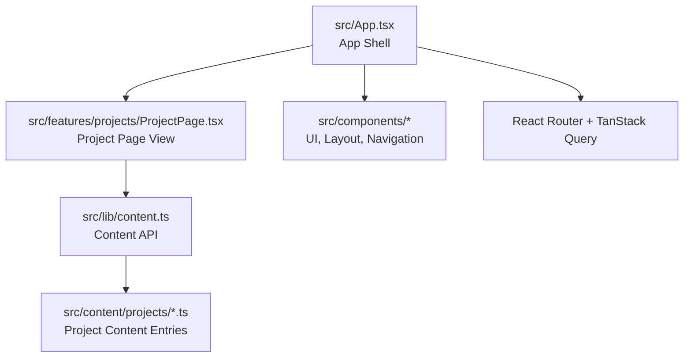

**Diagram sources**
- [src/App.tsx:40-100](file://src/App.tsx#L40-L100)
- [src/features/projects/ProjectPage.tsx:19-99](file://src/features/projects/ProjectPage.tsx#L19-L99)
- [src/lib/content.ts:38-42](file://src/lib/content.ts#L38-L42)

**Section sources**
- [README.md:147-191](file://README.md#L147-L191)
- [src/App.tsx:1-103](file://src/App.tsx#L1-L103)
- [src/main.tsx:1-6](file://src/main.tsx#L1-L6)
- [src/lib/content.ts:1-126](file://src/lib/content.ts#L1-L126)

## Core Components
- Content types and metadata: Strongly typed content entries define structure for lessons, references, recipes, integrations, projects, and more.
- Project content entries: Each project defines sections, learning goals, tech stack, and features.
- Project page view: Renders project metadata, tech stack badges, learning goals, content blocks, related topics, and navigation.
- Content API: Loads content by slug, extracts headings, and resolves related content and prev/next links.

Key responsibilities:
- src/types/content.ts: Defines ContentEntry union and ProjectContent shape
- src/lib/content.ts: Provides content loaders, metadata lookup, and navigation helpers
- src/features/projects/ProjectPage.tsx: Orchestrates rendering and UI composition

**Section sources**
- [src/types/content.ts:113-121](file://src/types/content.ts#L113-L121)
- [src/lib/content.ts:38-42](file://src/lib/content.ts#L38-L42)
- [src/features/projects/ProjectPage.tsx:19-99](file://src/features/projects/ProjectPage.tsx#L19-L99)

## Architecture Overview
JSphere’s Projects Pilar follows a metadata-driven, content-as-code architecture:
- Content authors write project walkthroughs as TypeScript modules under src/content/projects
- A generator produces loaders and metadata
- The runtime lazily loads content and renders it via a unified renderer
- UI components are reused across projects for consistency

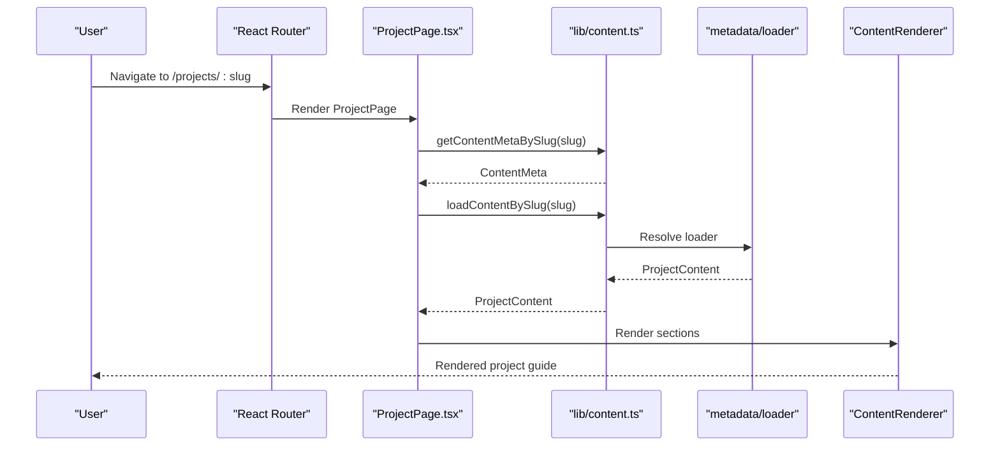

**Diagram sources**
- [src/features/projects/ProjectPage.tsx:20-24](file://src/features/projects/ProjectPage.tsx#L20-L24)
- [src/lib/content.ts:30-42](file://src/lib/content.ts#L30-L42)

## Detailed Component Analysis

### CRUD Todo App
A foundational CRUD application demonstrating state management, API integration, and optimistic updates.

Implementation highlights:
- Data models: Todo and TodoState with actions
- State management: useReducer pattern
- API integration: fetch wrappers for CRUD operations
- UI components: AddTodoForm, TodoItem, main TodoApp
- Best practices: optimistic updates, loading/error states, debounced saves

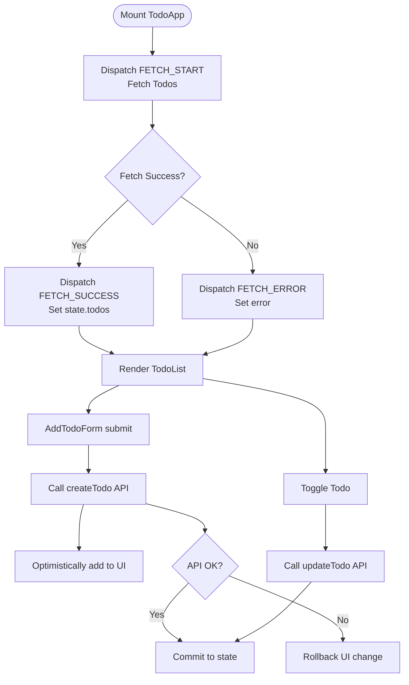

**Diagram sources**
- [src/content/projects/crud-app.ts:61-95](file://src/content/projects/crud-app.ts#L61-L95)
- [src/content/projects/crud-app.ts:98-132](file://src/content/projects/crud-app.ts#L98-L132)
- [src/content/projects/crud-app.ts:135-178](file://src/content/projects/crud-app.ts#L135-L178)
- [src/content/projects/crud-app.ts:181-251](file://src/content/projects/crud-app.ts#L181-L251)
- [src/content/projects/crud-app.ts:254-315](file://src/content/projects/crud-app.ts#L254-L315)

**Section sources**
- [src/content/projects/crud-app.ts:1-330](file://src/content/projects/crud-app.ts#L1-L330)

### Notes App with Local Storage
A note-taking app emphasizing local persistence, markdown preview, and search/filter.

Implementation highlights:
- localStorage wrapper with JSON serialization and error handling
- Debounced autosave with a timeout
- Markdown preview using a markdown parser
- Search hook with case-insensitive filtering
- Pinning and ordering of notes

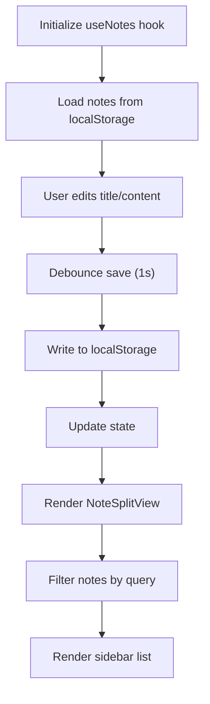

**Diagram sources**
- [src/content/projects/notes-app.ts:52-98](file://src/content/projects/notes-app.ts#L52-L98)
- [src/content/projects/notes-app.ts:102-155](file://src/content/projects/notes-app.ts#L102-L155)
- [src/content/projects/notes-app.ts:158-181](file://src/content/projects/notes-app.ts#L158-L181)
- [src/content/projects/notes-app.ts:184-194](file://src/content/projects/notes-app.ts#L184-L194)
- [src/content/projects/notes-app.ts:196-282](file://src/content/projects/notes-app.ts#L196-L282)

**Section sources**
- [src/content/projects/notes-app.ts:1-297](file://src/content/projects/notes-app.ts#L1-L297)

### Chat Application
A real-time chat app with WebSocket transport, state management, typing indicators, and auto-scroll.

Implementation highlights:
- WebSocket client with reconnect, heartbeat, and message queue
- Reducer managing rooms, messages, typing indicators, presence
- Message list with grouping and auto-scroll behavior
- Message input with debounced typing events
- Room sidebar and typing indicator UI

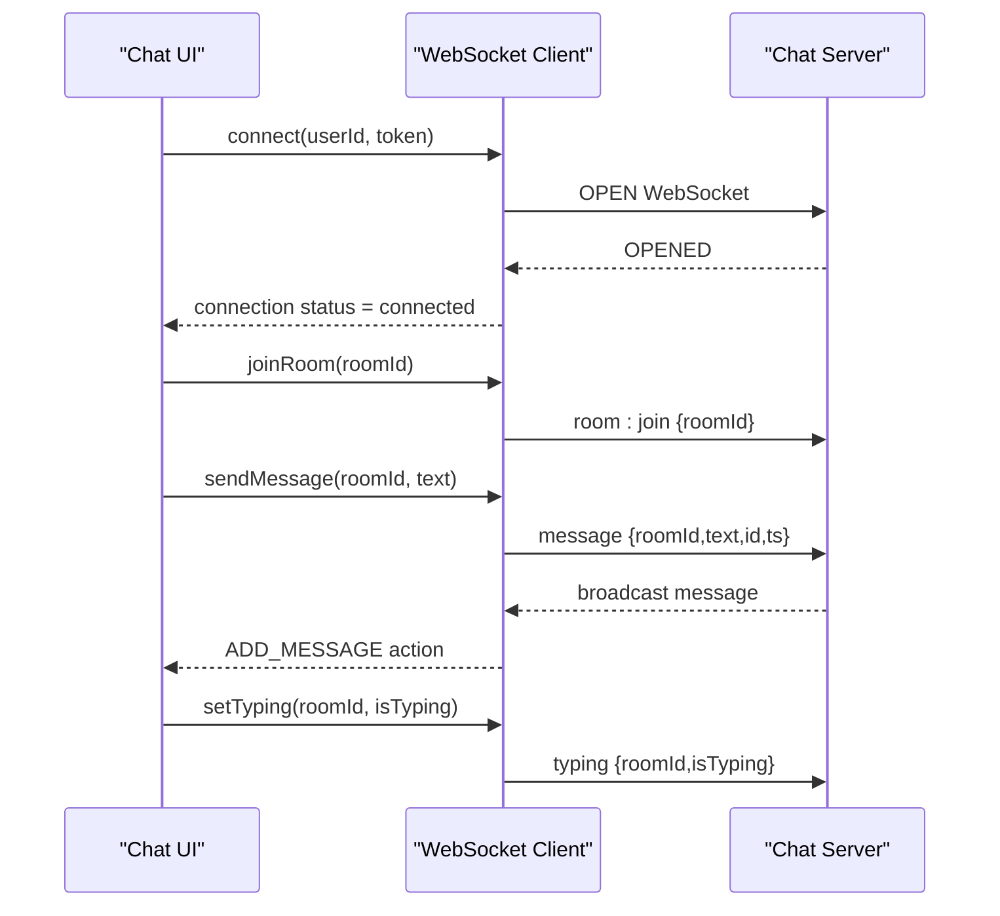

**Diagram sources**
- [src/content/projects/chat-app.ts:76-162](file://src/content/projects/chat-app.ts#L76-L162)
- [src/content/projects/chat-app.ts:165-223](file://src/content/projects/chat-app.ts#L165-L223)
- [src/content/projects/chat-app.ts:227-302](file://src/content/projects/chat-app.ts#L227-L302)
- [src/content/projects/chat-app.ts:309-364](file://src/content/projects/chat-app.ts#L309-L364)
- [src/content/projects/chat-app.ts:393-430](file://src/content/projects/chat-app.ts#L393-L430)

**Section sources**
- [src/content/projects/chat-app.ts:1-444](file://src/content/projects/chat-app.ts#L1-L444)

### Kanban Board App
A drag-and-drop kanban board with columns, cards, filtering, and keyboard accessibility.

Implementation highlights:
- Zustand store for columns, cards, filters, and selected card
- Drag-and-drop using HTML5 API
- Add/update/delete cards and move between columns
- Search/filter across titles and descriptions
- Keyboard shortcuts for navigation and actions

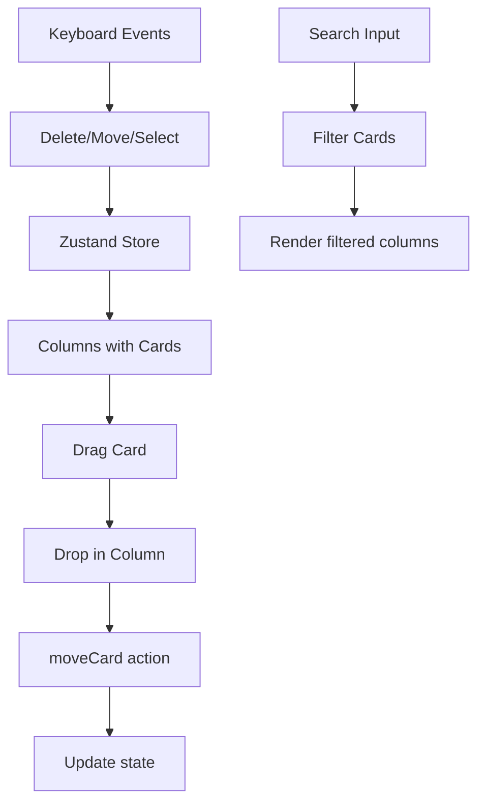

**Diagram sources**
- [src/content/projects/kanban-board.ts:88-229](file://src/content/projects/kanban-board.ts#L88-L229)
- [src/content/projects/kanban-board.ts:249-350](file://src/content/projects/kanban-board.ts#L249-L350)
- [src/content/projects/kanban-board.ts:365-441](file://src/content/projects/kanban-board.ts#L365-L441)
- [src/content/projects/kanban-board.ts:452-490](file://src/content/projects/kanban-board.ts#L452-L490)
- [src/content/projects/kanban-board.ts:502-580](file://src/content/projects/kanban-board.ts#L502-L580)

**Section sources**
- [src/content/projects/kanban-board.ts:1-602](file://src/content/projects/kanban-board.ts#L1-L602)

### E-Commerce Cart
A shopping cart with product catalog, cart state, promo codes, and checkout flow.

Implementation highlights:
- Product and cart item models
- Zustand store with persistence and selectors
- Promo code validation and discount calculation
- Order summary with tax/shipping
- Multi-step checkout flow

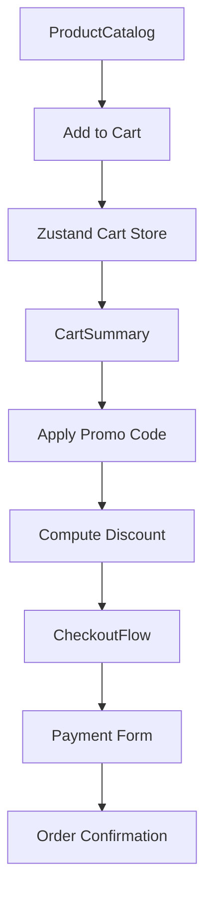

**Diagram sources**
- [src/content/projects/ecommerce-cart.ts:138-265](file://src/content/projects/ecommerce-cart.ts#L138-L265)
- [src/content/projects/ecommerce-cart.ts:276-391](file://src/content/projects/ecommerce-cart.ts#L276-L391)
- [src/content/projects/ecommerce-cart.ts:401-610](file://src/content/projects/ecommerce-cart.ts#L401-L610)
- [src/content/projects/ecommerce-cart.ts:635-694](file://src/content/projects/ecommerce-cart.ts#L635-L694)

**Section sources**
- [src/content/projects/ecommerce-cart.ts:1-698](file://src/content/projects/ecommerce-cart.ts#L1-L698)

### Analytics Dashboard
An analytics dashboard with charts, date range filtering, and data export.

Implementation highlights:
- Data aggregation and metric summaries
- Date range picker with presets and custom dates
- Traffic overview chart with toggles
- Comparison bar chart and top pages table
- CSV export functionality

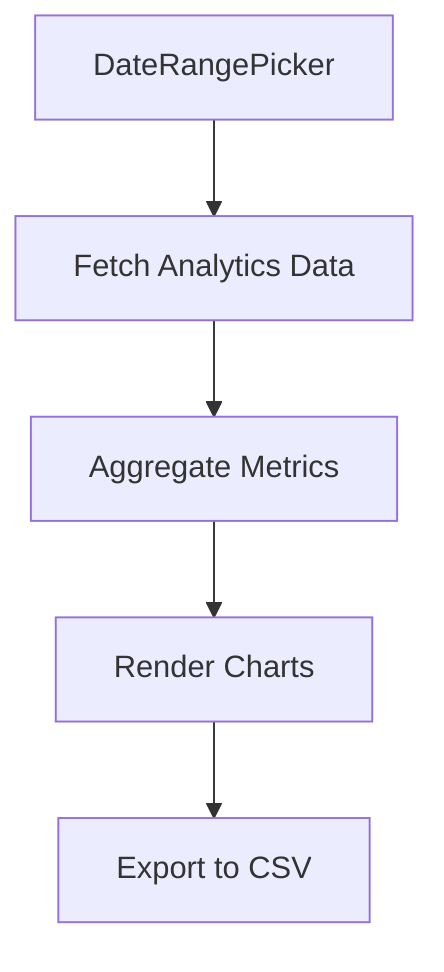

**Diagram sources**
- [src/content/projects/analytics-dashboard.ts:42-59](file://src/content/projects/analytics-dashboard.ts#L42-L59)
- [src/content/projects/analytics-dashboard.ts:63-112](file://src/content/projects/analytics-dashboard.ts#L63-L112)
- [src/content/projects/analytics-dashboard.ts:121-177](file://src/content/projects/analytics-dashboard.ts#L121-L177)
- [src/content/projects/analytics-dashboard.ts:182-206](file://src/content/projects/analytics-dashboard.ts#L182-L206)
- [src/content/projects/analytics-dashboard.ts:210-239](file://src/content/projects/analytics-dashboard.ts#L210-L239)
- [src/content/projects/analytics-dashboard.ts:243-285](file://src/content/projects/analytics-dashboard.ts#L243-L285)

**Section sources**
- [src/content/projects/analytics-dashboard.ts:1-299](file://src/content/projects/analytics-dashboard.ts#L1-L299)

### Admin Dashboard
A professional admin dashboard with layout, KPI cards, data tables, charts, and activity feed.

Implementation highlights:
- Responsive layout with collapsible sidebar
- KPI stat cards with trend indicators
- TanStack Table for sortable/filterable data
- Recharts for interactive charts
- Activity feed with relative timestamps

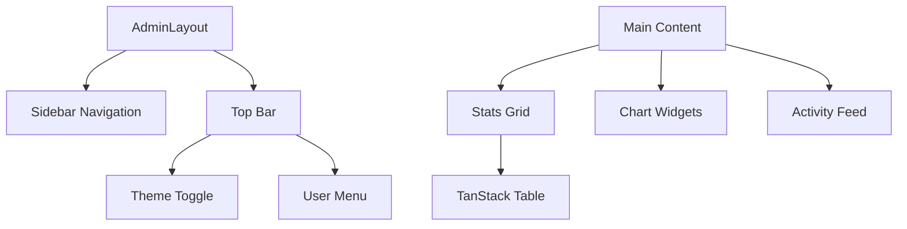

**Diagram sources**
- [src/content/projects/admin-dashboard.ts:26-75](file://src/content/projects/admin-dashboard.ts#L26-L75)
- [src/content/projects/admin-dashboard.ts:79-120](file://src/content/projects/admin-dashboard.ts#L79-L120)
- [src/content/projects/admin-dashboard.ts:124-256](file://src/content/projects/admin-dashboard.ts#L124-L256)
- [src/content/projects/admin-dashboard.ts:260-306](file://src/content/projects/admin-dashboard.ts#L260-L306)
- [src/content/projects/admin-dashboard.ts:309-356](file://src/content/projects/admin-dashboard.ts#L309-L356)

**Section sources**
- [src/content/projects/admin-dashboard.ts:1-369](file://src/content/projects/admin-dashboard.ts#L1-L369)

### Collaborative Editor
A real-time collaborative editor with operational transformation, cursor tracking, and offline sync.

Implementation highlights:
- Operational transformation for conflict-free editing
- WebSocket client for real-time sync
- Canvas-based visualizations for cursors and presence
- Offline sync queue persisted to localStorage

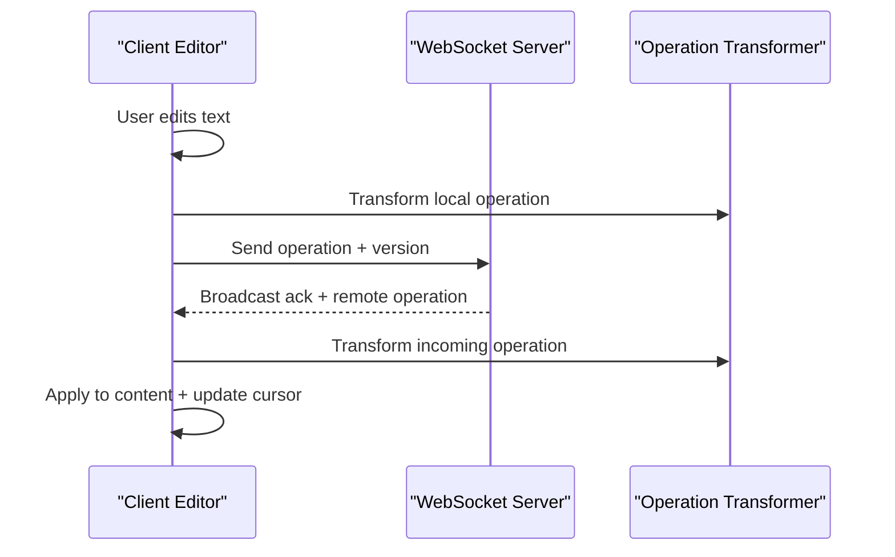

**Diagram sources**
- [src/content/projects/collaborative-editor.ts:52-177](file://src/content/projects/collaborative-editor.ts#L52-L177)
- [src/content/projects/collaborative-editor.ts:201-295](file://src/content/projects/collaborative-editor.ts#L201-L295)
- [src/content/projects/collaborative-editor.ts:306-429](file://src/content/projects/collaborative-editor.ts#L306-L429)
- [src/content/projects/collaborative-editor.ts:446-594](file://src/content/projects/collaborative-editor.ts#L446-L594)
- [src/content/projects/collaborative-editor.ts:604-641](file://src/content/projects/collaborative-editor.ts#L604-L641)

**Section sources**
- [src/content/projects/collaborative-editor.ts:1-662](file://src/content/projects/collaborative-editor.ts#L1-L662)

### Music Player
A feature-rich music player with Web Audio API, visualizers, playlists, and media controls.

Implementation highlights:
- Web Audio API setup with filters and analyser
- Canvas-based waveform, frequency bars, and circle visualizer
- Keyboard shortcuts and Media Session API integration
- Playlist management and equalizer controls

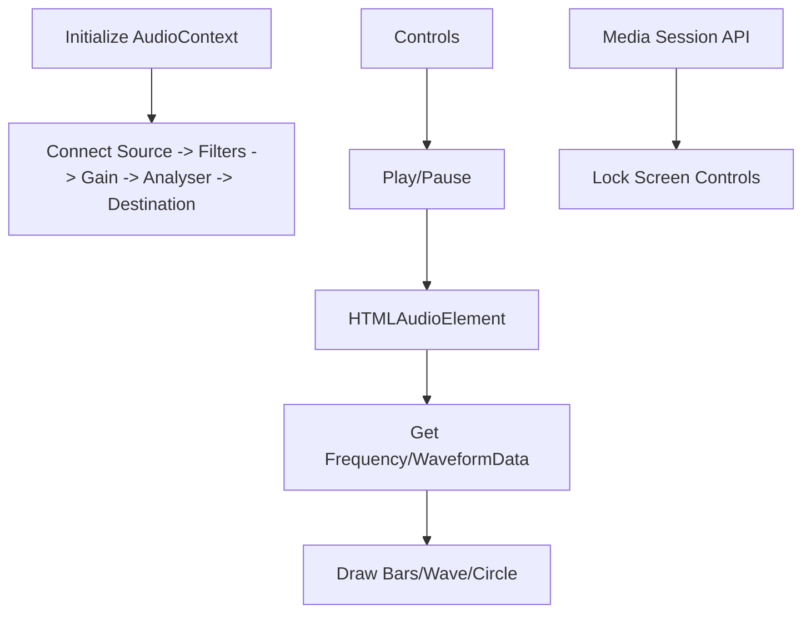

**Diagram sources**
- [src/content/projects/music-player.ts:62-187](file://src/content/projects/music-player.ts#L62-L187)
- [src/content/projects/music-player.ts:206-355](file://src/content/projects/music-player.ts#L206-L355)
- [src/content/projects/music-player.ts:366-617](file://src/content/projects/music-player.ts#L366-L617)
- [src/content/projects/music-player.ts:628-670](file://src/content/projects/music-player.ts#L628-L670)
- [src/content/projects/music-player.ts:681-722](file://src/content/projects/music-player.ts#L681-L722)

**Section sources**
- [src/content/projects/music-player.ts:1-726](file://src/content/projects/music-player.ts#L1-L726)

### YouTube Search App
A YouTube search interface with pagination, embedded player, and search UX.

Implementation highlights:
- Backend proxy to protect API key
- Debounced search input
- Skeleton loaders and pagination
- Embedded video player modal

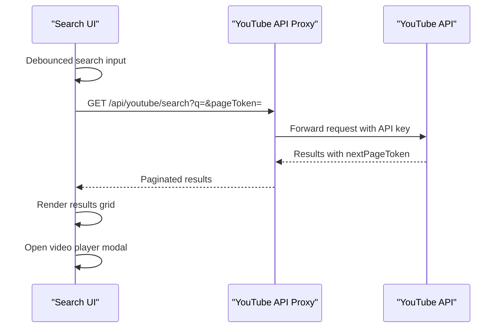

**Diagram sources**
- [src/content/projects/youtube-search.ts:28-70](file://src/content/projects/youtube-search.ts#L28-L70)
- [src/content/projects/youtube-search.ts:90-138](file://src/content/projects/youtube-search.ts#L90-L138)
- [src/content/projects/youtube-search.ts:141-186](file://src/content/projects/youtube-search.ts#L141-L186)
- [src/content/projects/youtube-search.ts:189-260](file://src/content/projects/youtube-search.ts#L189-L260)
- [src/content/projects/youtube-search.ts:263-290](file://src/content/projects/youtube-search.ts#L263-L290)
- [src/content/projects/youtube-search.ts:293-335](file://src/content/projects/youtube-search.ts#L293-L335)

**Section sources**
- [src/content/projects/youtube-search.ts:1-350](file://src/content/projects/youtube-search.ts#L1-L350)

### Telegram Bot
A Telegram bot with webhooks, command routing, inline keyboards, and conversational state.

Implementation highlights:
- Express webhook endpoint
- Command and callback routing
- In-memory state management for multi-step conversations
- Database integration patterns
- Error handling and logging

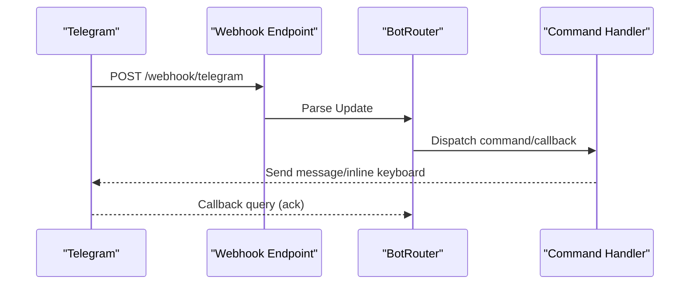

**Diagram sources**
- [src/content/projects/telegram-bot.ts:26-57](file://src/content/projects/telegram-bot.ts#L26-L57)
- [src/content/projects/telegram-bot.ts:60-115](file://src/content/projects/telegram-bot.ts#L60-L115)
- [src/content/projects/telegram-bot.ts:119-191](file://src/content/projects/telegram-bot.ts#L119-L191)
- [src/content/projects/telegram-bot.ts:194-224](file://src/content/projects/telegram-bot.ts#L194-L224)
- [src/content/projects/telegram-bot.ts:227-280](file://src/content/projects/telegram-bot.ts#L227-L280)

**Section sources**
- [src/content/projects/telegram-bot.ts:1-295](file://src/content/projects/telegram-bot.ts#L1-L295)

## Dependency Analysis
The Projects Pilar relies on a cohesive set of technologies and patterns:
- Frontend: React 18, TypeScript, Tailwind CSS, Radix UI/shadcn, TanStack Query, Recharts, Prism, React Hook Form/Zod
- Build and tooling: Vite, SWC, ESLint, Vitest, Playwright
- Runtime: React Router for routing, Helmet for SEO, React Query for caching and invalidation

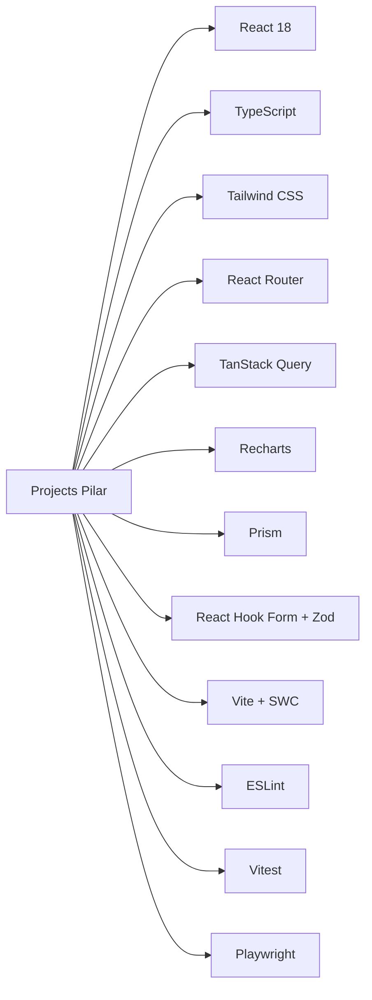

**Diagram sources**
- [package.json:22-74](file://package.json#L22-L74)
- [package.json:75-96](file://package.json#L75-L96)
- [README.md:124-144](file://README.md#L124-L144)

**Section sources**
- [package.json:1-99](file://package.json#L1-L99)
- [README.md:124-144](file://README.md#L124-L144)

## Performance Considerations
- Lazy loading: Route-based code splitting via React.lazy and Suspense
- Data fetching: TanStack Query for caching, background refetch, and invalidation
- Rendering: Skeleton loaders and virtualization for long lists (e.g., chat messages, kanban cards)
- Network: Debounced search, pagination, and offline queues
- Assets: Tailwind CSS for efficient styling, Lucide icons for lightweight SVGs

[No sources needed since this section provides general guidance]

## Troubleshooting Guide
Common issues and resolutions:
- Content not found: Verify slug exists and metadata is generated
- WebSocket disconnects: Implement exponential backoff and queue offline messages
- localStorage quota exceeded: Warn users and suggest export/import
- API key exposure: Always proxy third-party APIs through your backend
- Memory leaks: Clean up timers, event listeners, and animation frames
- Search performance: Debounce input and cache results

**Section sources**
- [src/features/projects/ProjectPage.tsx:26-37](file://src/features/projects/ProjectPage.tsx#L26-L37)
- [src/content/projects/chat-app.ts:118-119](file://src/content/projects/chat-app.ts#L118-L119)
- [src/content/projects/notes-app.ts:286-294](file://src/content/projects/notes-app.ts#L286-L294)
- [src/content/projects/youtube-search.ts:339-347](file://src/content/projects/youtube-search.ts#L339-L347)
- [src/content/projects/telegram-bot.ts:283-292](file://src/content/projects/telegram-bot.ts#L283-L292)

## Conclusion
JSphere’s Projects Pilar demonstrates a scalable, metadata-driven approach to teaching and building real-world applications. By following the provided patterns—typed content, modular UI, robust state management, and thoughtful UX—you can confidently implement, test, and deploy diverse applications ranging from simple CRUD apps to complex collaborative tools and media platforms.

[No sources needed since this section summarizes without analyzing specific files]

## Appendices
- Getting started: Install dependencies, run dev/build/test scripts, and generate content metadata
- Testing: Unit tests with Vitest, E2E tests with Playwright, and watch mode for TDD
- Deployment: Build with Vite, preview production bundle, and host on static hosting or SSR platforms

**Section sources**
- [README.md:195-248](file://README.md#L195-L248)
- [README.md:252-288](file://README.md#L252-L288)