# Recipes

<cite>
**Referenced Files in This Document**
- [pagination.ts](file://src/content/recipes/pagination.ts)
- [debouncing.ts](file://src/content/recipes/debouncing.ts)
- [drag-and-drop.ts](file://src/content/recipes/drag-and-drop.ts)
- [global-state.ts](file://src/content/recipes/global-state.ts)
- [error-fallback.ts](file://src/content/recipes/error-fallback.ts)
- [api-retries.ts](file://src/content/recipes/api-retries.ts)
- [auth-ui-patterns.ts](file://src/content/recipes/auth-ui-patterns.ts)
- [dark-mode.ts](file://src/content/recipes/dark-mode.ts)
- [image-lazy-loading.ts](file://src/content/recipes/image-lazy-loading.ts)
- [infinite-scroll.ts](file://src/content/recipes/infinite-scroll.ts)
- [route-guards.ts](file://src/content/recipes/route-guards.ts)
- [search-ui.ts](file://src/content/recipes/search-ui.ts)
- [skeleton-loaders.ts](file://src/content/recipes/skeleton-loaders.ts)
- [virtualized-lists.ts](file://src/content/recipes/virtualized-lists.ts)
- [form-validation.ts](file://src/content/recipes/form-validation.ts)
</cite>

## Table of Contents
1. [Introduction](#introduction)
2. [Project Structure](#project-structure)
3. [Core Components](#core-components)
4. [Architecture Overview](#architecture-overview)
5. [Detailed Component Analysis](#detailed-component-analysis)
6. [Dependency Analysis](#dependency-analysis)
7. [Performance Considerations](#performance-considerations)
8. [Troubleshooting Guide](#troubleshooting-guide)
9. [Conclusion](#conclusion)
10. [Appendices](#appendices)

## Introduction
This document presents the Recipes Pilar for JSphere, a curated set of production-ready implementation patterns and solutions spanning UI patterns, state management, performance optimizations, authentication, API resilience, and modern UI features. Each recipe follows a problem-solution approach, detailing real-world applicability, code quality standards, testing strategies, and performance considerations. Recipes are designed to be adaptable across projects, with integration examples and customization options to suit diverse requirements.

## Project Structure
JSphere organizes recipes as structured content entries under a dedicated recipes directory. Each recipe file defines a canonical content object with metadata, sections, and embedded code samples. These recipes integrate with the broader application’s UI components, hooks, and services to demonstrate end-to-end patterns.

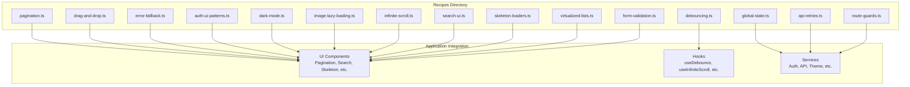

[No sources needed since this diagram shows conceptual workflow, not actual code structure]

## Core Components
This section highlights the primary recipe categories and their representative patterns, emphasizing production-readiness and extensibility.

- UI Patterns
  - Pagination: offset/cursor-based pagination, URL persistence, page buttons, TanStack Query integration, and comparison guidance.
  - Search UI: debounced search, result highlighting, keyboard navigation, command palette, fuzzy search, filters, and accessibility.
  - Drag-and-Drop: HTML5 Drag and Drop API, file uploads, reorderable lists, custom feedback, pointer events, Kanban board, and drop effects.
  - Skeleton Loaders: animated placeholders, shimmer/pulse/wave effects, dynamic generation, CLS avoidance, and timeout/error handling.
  - Infinite Scroll: IntersectionObserver hook, complete implementation, TanStack Query useInfiniteQuery, virtual scrolling, scroll restoration, and performance tips.
  - Virtualized Lists: basic windowing, variable heights, Intersection Observer approach, React example, performance monitoring, and pitfalls.
  - Form Validation: composable validators, validation hook, accessible input components, Zod schemas, async validation, multi-step forms, and validation timing strategies.

- State Management
  - Global State: event emitter store, reducer-based store, proxy-based reactive store, async actions/middleware, devtools/time-travel, and a todo app example.

- Performance Optimizations
  - Debouncing & Throttling: debounce/throttle utilities, React useDebounce, request cancellation, resize handler, autosave pattern, and memory leak prevention.
  - Image Lazy Loading: native lazy loading, Intersection Observer loader, responsive images, background images, blur-up technique, performance monitoring, and no-JS fallbacks.

- Authentication
  - Auth UI Patterns: login form, password strength meter, social login buttons, password reset flow, token storage strategy, protected route, security best practices, and accessibility.

- API Patterns
  - API Retries: exponential backoff with jitter, cancellable retry, circuit breaker, React hook, TanStack Query integration, and idempotency guidance.
  - Error Fallback UX: React error boundary, inline error state, async state machine, toast notifications, full-page error, graceful degradation, error logging, and design principles.

- Modern UI Features
  - Dark Mode: system detection, CSS variables, JavaScript theme manager, no-flash hydration, images/SVG handling, multiple themes, reduced motion, and complete implementation.

**Section sources**
- [pagination.ts:3-56](file://src/content/recipes/pagination.ts#L3-L56)
- [debouncing.ts:3-59](file://src/content/recipes/debouncing.ts#L3-L59)
- [drag-and-drop.ts:3-487](file://src/content/recipes/drag-and-drop.ts#L3-L487)
- [global-state.ts:3-529](file://src/content/recipes/global-state.ts#L3-L529)
- [error-fallback.ts:3-66](file://src/content/recipes/error-fallback.ts#L3-L66)
- [api-retries.ts:3-70](file://src/content/recipes/api-retries.ts#L3-L70)
- [auth-ui-patterns.ts:3-71](file://src/content/recipes/auth-ui-patterns.ts#L3-L71)
- [dark-mode.ts:3-457](file://src/content/recipes/dark-mode.ts#L3-L457)
- [image-lazy-loading.ts:3-510](file://src/content/recipes/image-lazy-loading.ts#L3-L510)
- [infinite-scroll.ts:3-64](file://src/content/recipes/infinite-scroll.ts#L3-L64)
- [route-guards.ts:3-592](file://src/content/recipes/route-guards.ts#L3-L592)
- [search-ui.ts:3-69](file://src/content/recipes/search-ui.ts#L3-L69)
- [skeleton-loaders.ts:3-520](file://src/content/recipes/skeleton-loaders.ts#L3-L520)
- [virtualized-lists.ts:3-446](file://src/content/recipes/virtualized-lists.ts#L3-L446)
- [form-validation.ts:3-72](file://src/content/recipes/form-validation.ts#L3-L72)

## Architecture Overview
The Recipes Pilar integrates with the application’s UI and services through reusable patterns and hooks. The following diagram maps key recipe implementations to their likely integration points.

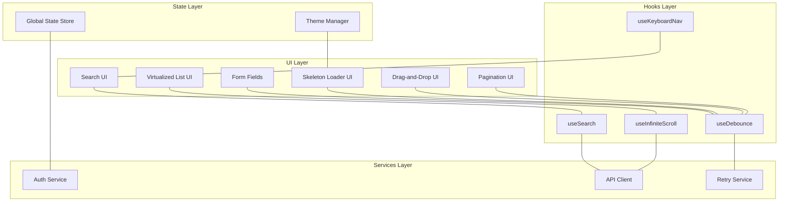

**Diagram sources**
- [pagination.ts:3-56](file://src/content/recipes/pagination.ts#L3-L56)
- [debouncing.ts:3-59](file://src/content/recipes/debouncing.ts#L3-L59)
- [drag-and-drop.ts:3-487](file://src/content/recipes/drag-and-drop.ts#L3-L487)
- [skeleton-loaders.ts:3-520](file://src/content/recipes/skeleton-loaders.ts#L3-L520)
- [infinite-scroll.ts:3-64](file://src/content/recipes/infinite-scroll.ts#L3-L64)
- [search-ui.ts:3-69](file://src/content/recipes/search-ui.ts#L3-L69)
- [api-retries.ts:3-70](file://src/content/recipes/api-retries.ts#L3-L70)
- [auth-ui-patterns.ts:3-71](file://src/content/recipes/auth-ui-patterns.ts#L3-L71)
- [dark-mode.ts:3-457](file://src/content/recipes/dark-mode.ts#L3-L457)
- [global-state.ts:3-529](file://src/content/recipes/global-state.ts#L3-L529)

## Detailed Component Analysis

### Pagination
- Problem: Loading all data at once is slow and resource-intensive.
- Solution: Implement page-based and cursor-based pagination with URL persistence, page buttons, and TanStack Query integration.
- Key patterns:
  - Offset pagination with page size, total, and next/prev navigation.
  - Cursor-based pagination for large datasets with next/prev cursors and isLast flag.
  - URL-based pagination to maintain state in the address bar.
  - Page number buttons with bounded visibility around the current page.
  - TanStack Query integration for caching and placeholder data.
- Comparison: Offset vs cursor trade-offs for performance, back button behavior, real-time data handling, and skip-to-page capability.
- Real-world applicability: Ideal for search results, feeds, and paginated lists where performance matters.

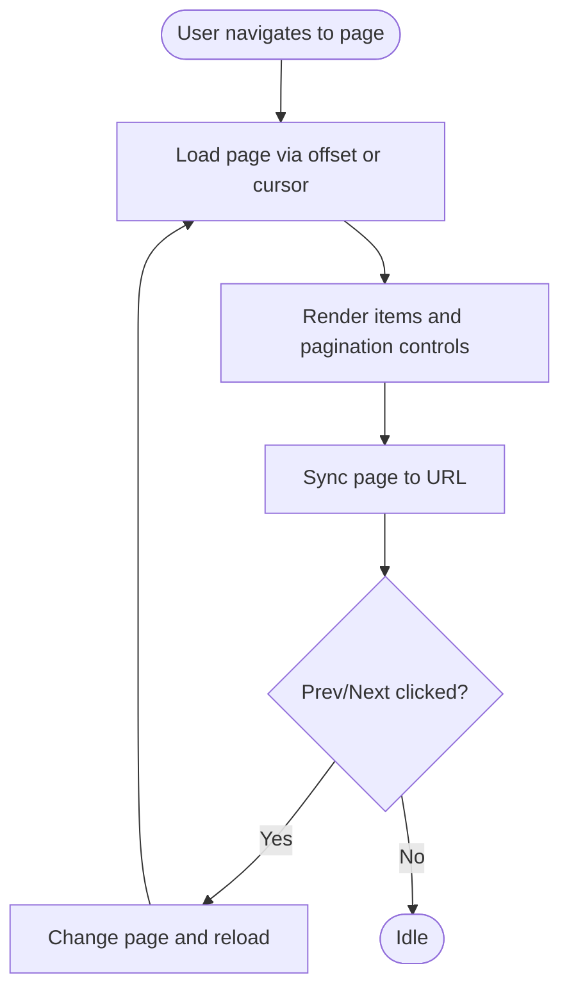

**Diagram sources**
- [pagination.ts:3-56](file://src/content/recipes/pagination.ts#L3-L56)

**Section sources**
- [pagination.ts:3-56](file://src/content/recipes/pagination.ts#L3-L56)

### Debouncing & Throttling
- Problem: Rapid events (typing, resizing, scrolling) trigger expensive operations and degrade UI responsiveness.
- Solution: Debounce to wait for idle periods and throttle to cap frequency.
- Key patterns:
  - Basic debounce/throttle utilities with cancellation.
  - React useDebounce hook for derived state.
  - Search with request cancellation and AbortController.
  - Window resize handler with throttling.
  - Autosave pattern combining debounce and async save.
- Pitfalls: Memory leaks from missing cleanup, confusing debounce vs throttle, zero-delay debouncing, and not canceling pending requests.
- Real-world applicability: Search inputs, scroll handlers, autosave, and performance-sensitive UI interactions.

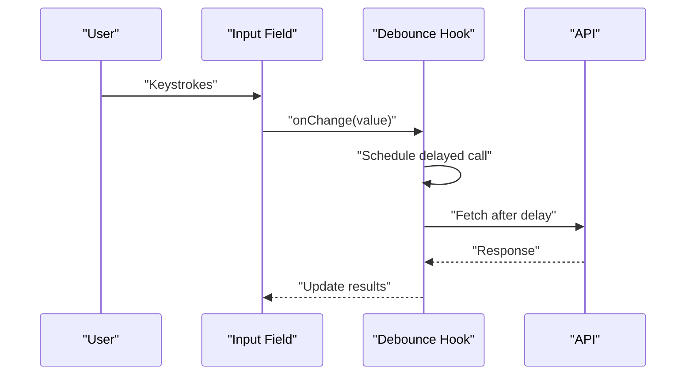

**Diagram sources**
- [debouncing.ts:3-59](file://src/content/recipes/debouncing.ts#L3-L59)

**Section sources**
- [debouncing.ts:3-59](file://src/content/recipes/debouncing.ts#L3-L59)

### Drag-and-Drop Interfaces
- Problem: Implementing cross-browser compatible drag-and-drop with visual feedback and file handling.
- Solution: HTML5 Drag and Drop API plus pointer events for modern, touch-friendly experiences.
- Key patterns:
  - Basic drag/drop with visual feedback and custom drag images.
  - File upload with drag-and-drop zones and FormData.
  - Reorderable lists with Intersection Observer logic for drop positioning.
  - Pointer events alternative for better touch support.
  - Kanban-style drag-and-drop across columns.
  - Handling different drop effects (copy, move, link).
- Pitfalls: Forgetting to prevent default dragover, missing dragImage, improper file handling, mixing APIs incorrectly, and lack of visual feedback.
- Real-world applicability: Kanban boards, file upload widgets, sortable lists, and interactive dashboards.

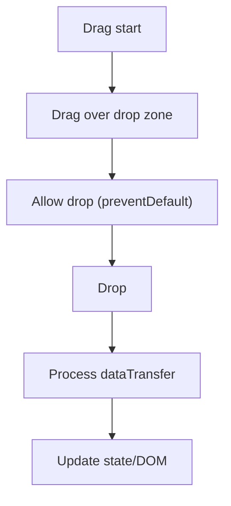

**Diagram sources**
- [drag-and-drop.ts:3-487](file://src/content/recipes/drag-and-drop.ts#L3-L487)

**Section sources**
- [drag-and-drop.ts:3-487](file://src/content/recipes/drag-and-drop.ts#L3-L487)

### Global State Management
- Problem: Managing application-wide state without heavy frameworks leads to prop drilling and spaghetti code.
- Solution: Lightweight global state using observer patterns, reducers, proxies, and async middleware.
- Key patterns:
  - Event emitter store with subscription and undo history.
  - Reducer-based store with middleware and action dispatch.
  - Proxy-based reactive store with selective listeners.
  - Async store with thunk middleware and promise chains.
  - Devtools integration and time-travel debugging.
  - Real-world todo app example binding store to UI.
- Pitfalls: Direct mutations, missing cleanup, missing initial state, no debugging, race conditions.
- Real-world applicability: Vanilla apps, micro-frontend state sharing, and minimal dependency setups.

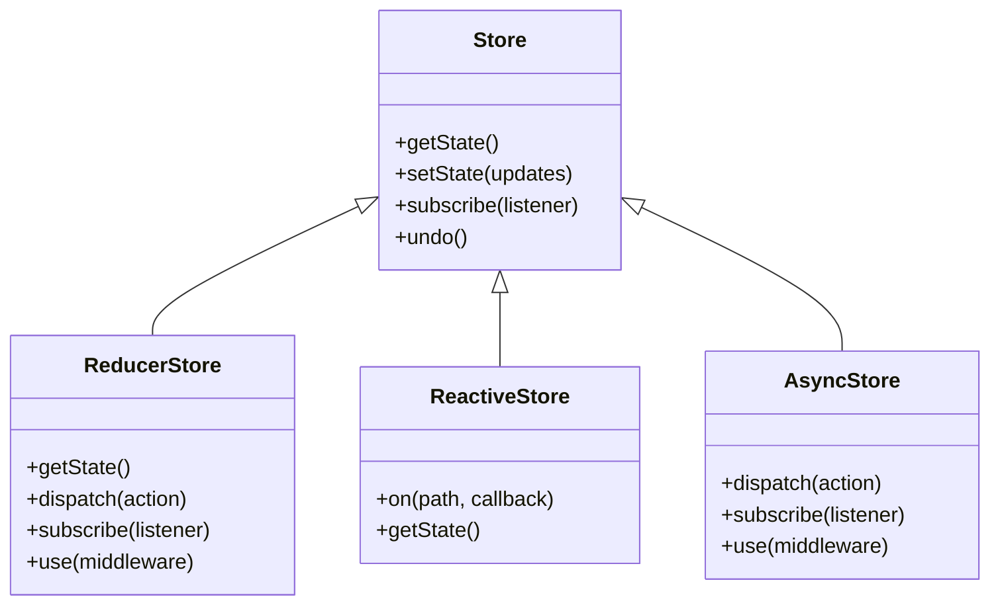

**Diagram sources**
- [global-state.ts:3-529](file://src/content/recipes/global-state.ts#L3-L529)

**Section sources**
- [global-state.ts:3-529](file://src/content/recipes/global-state.ts#L3-L529)

### Error Fallback UX
- Problem: Errors occur; users need clear, actionable feedback without app crashes.
- Solution: Error boundaries, inline error states, async state machines, toast notifications, full-page error, and graceful degradation.
- Key patterns:
  - React error boundary with fallback UI and retry.
  - Inline error state component with optional retry.
  - Async state machine modeling idle/loading/success/error.
  - Toast notifications with user-friendly messages and optional retry actions.
  - Full-page error with context-specific messaging.
  - Graceful degradation showing cached data with warnings.
  - Error logging and production tracking.
- Design principles: honesty, actionability, context, persistence, and forgiveness.
- Real-world applicability: Robust user experiences, resilient APIs, and accessible error communication.

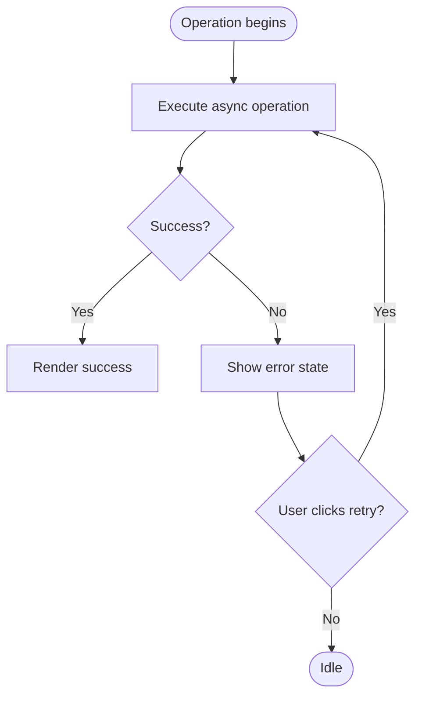

**Diagram sources**
- [error-fallback.ts:3-66](file://src/content/recipes/error-fallback.ts#L3-L66)

**Section sources**
- [error-fallback.ts:3-66](file://src/content/recipes/error-fallback.ts#L3-L66)

### API Retries
- Problem: Network requests fail transiently; naive retries can amplify load or cause duplicates.
- Solution: Exponential backoff with jitter, cancellable retries, circuit breaker, and TanStack Query integration.
- Key patterns:
  - Basic retry with backoff and retry condition.
  - Backoff strategies: constant, linear, exponential, exponential+jitter, decorrelated jitter.
  - Cancellable retry honoring AbortSignal.
  - Circuit breaker with open/half-open/closed states.
  - React hook with retry counter and exponential delays.
  - TanStack Query retry configuration.
  - Idempotency guidance for POST requests.
- Real-world applicability: REST/GraphQL clients, offline-first apps, and distributed systems.

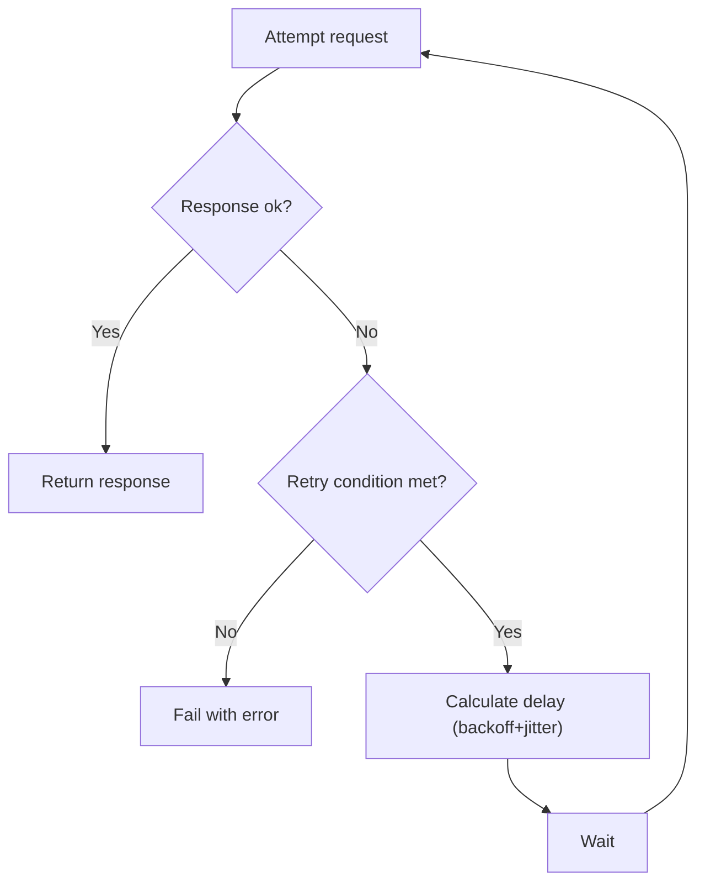

**Diagram sources**
- [api-retries.ts:3-70](file://src/content/recipes/api-retries.ts#L3-L70)

**Section sources**
- [api-retries.ts:3-70](file://src/content/recipes/api-retries.ts#L3-L70)

### Auth UI Patterns
- Problem: Secure, accessible, and user-friendly authentication flows.
- Solution: Login form, password strength meter, social login, password reset, protected routes, and security best practices.
- Key patterns:
  - Login form with loading states and error messaging.
  - Password strength checker with visual meter.
  - Social login buttons with “Or continue with” divider.
  - Password reset flow with resend option.
  - Token storage strategy (memory, httpOnly cookie, localStorage, sessionStorage).
  - Protected route with redirect and loading state.
  - Security and accessibility guidelines.
- Real-world applicability: Consumer apps, enterprise dashboards, and compliance-driven products.

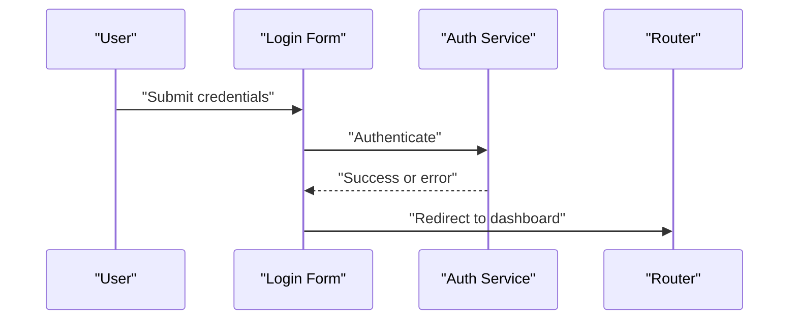

**Diagram sources**
- [auth-ui-patterns.ts:3-71](file://src/content/recipes/auth-ui-patterns.ts#L3-L71)

**Section sources**
- [auth-ui-patterns.ts:3-71](file://src/content/recipes/auth-ui-patterns.ts#L3-L71)

### Dark Mode Implementation
- Problem: Respect system preference, persist user choice, and handle transitions smoothly.
- Solution: System preference detection, CSS variables, JavaScript theme manager, no-flash hydration, images/SVG handling, multiple themes, and reduced motion support.
- Key patterns:
  - System detection via prefers-color-scheme and accessibility preferences.
  - CSS variables for theming with smooth transitions.
  - JavaScript theme manager with localStorage persistence and event dispatch.
  - No-flash hydration by applying theme in head.
  - Handling images and SVGs in dark mode.
  - Multiple themes and automatic switching.
  - Respecting reduced motion preferences.
- Real-world applicability: Progressive web apps, design systems, and inclusive UI.

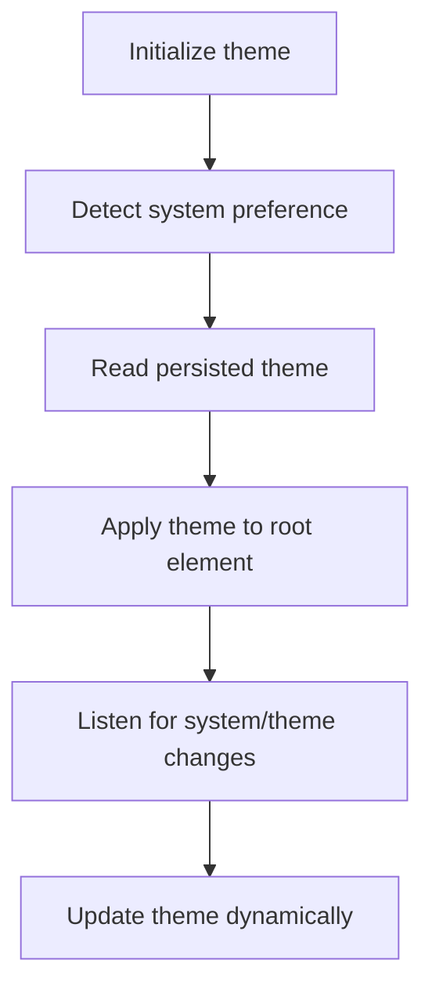

**Diagram sources**
- [dark-mode.ts:3-457](file://src/content/recipes/dark-mode.ts#L3-L457)

**Section sources**
- [dark-mode.ts:3-457](file://src/content/recipes/dark-mode.ts#L3-L457)

### Image Lazy Loading
- Problem: Loading all images on page load wastes bandwidth and slows perceived performance.
- Solution: Native lazy loading, Intersection Observer, responsive images, background images, blur-up technique, performance monitoring, and no-JS fallbacks.
- Key patterns:
  - Native loading="lazy" with srcset and sizes.
  - Intersection Observer loader with shimmer/fade transitions.
  - Background image lazy loading with preloading.
  - Blur-up technique for perceptual loading.
  - Performance metrics and reporting.
  - Fallback strategies for no-JS environments.
- Real-world applicability: Media-heavy sites, blogs, galleries, and performance-critical pages.

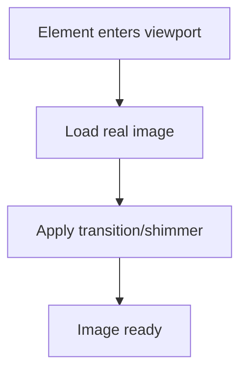

**Diagram sources**
- [image-lazy-loading.ts:3-510](file://src/content/recipes/image-lazy-loading.ts#L3-L510)

**Section sources**
- [image-lazy-loading.ts:3-510](file://src/content/recipes/image-lazy-loading.ts#L3-L510)

### Infinite Scroll
- Problem: Rendering large lists causes memory bloat and slow scrolling.
- Solution: IntersectionObserver sentinel, TanStack Query useInfiniteQuery, virtual scrolling, scroll restoration, and performance tips.
- Key patterns:
  - useInfiniteScroll hook with configurable thresholds and margins.
  - Complete implementation with loading/error states and sentinel element.
  - TanStack Query useInfiniteQuery for caching and pagination.
  - Virtual scrolling for 1000+ items.
  - Scroll restoration using sessionStorage.
  - Load more button alternative for user control.
  - SEO considerations for search engines.
- Real-world applicability: Social feeds, product catalogs, analytics dashboards, and content discovery.

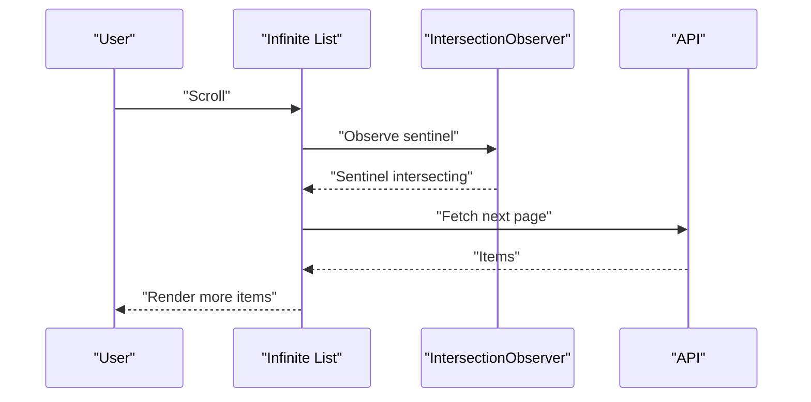

**Diagram sources**
- [infinite-scroll.ts:3-64](file://src/content/recipes/infinite-scroll.ts#L3-L64)

**Section sources**
- [infinite-scroll.ts:3-64](file://src/content/recipes/infinite-scroll.ts#L3-L64)

### Route Guards and Navigation Middleware
- Problem: Protect routes, enforce auth/roles, handle async checks, and manage navigation state.
- Solution: Global and route-specific guards, auth guard, RBAC, unsaved changes guard, parallel execution, and a complete SPA router.
- Key patterns:
  - Basic router with guards and navigation lifecycle.
  - Auth guard for authentication and token verification.
  - Role-based and permission-based guards.
  - Unsaved changes guard with beforeunload.
  - Parallel guard execution with timeouts.
  - Complete SPA router with popstate and link handling.
- Real-world applicability: Dashboards, admin panels, multi-tenant apps, and permission-heavy systems.

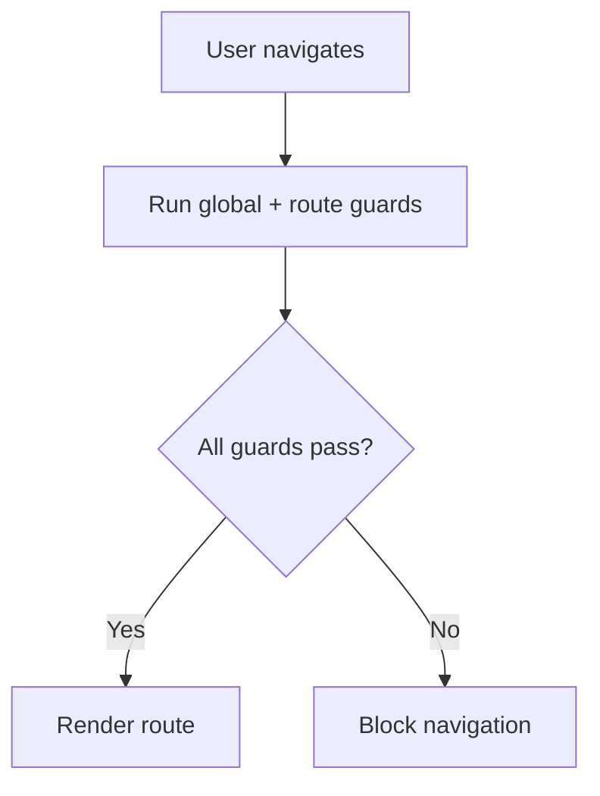

**Diagram sources**
- [route-guards.ts:3-592](file://src/content/recipes/route-guards.ts#L3-L592)

**Section sources**
- [route-guards.ts:3-592](file://src/content/recipes/route-guards.ts#L3-L592)

### Search UI
- Problem: Provide instant feedback, highlight matches, and support keyboard navigation.
- Solution: Debounced search hook, highlight matches safely, keyboard navigation, command palette, fuzzy search, filters, and accessibility.
- Key patterns:
  - useSearch hook with AbortController and debounced fetch.
  - Highlight component escaping regex and avoiding innerHTML risks.
  - Keyboard navigation with arrow keys and selection.
  - Command palette with global keyboard shortcut.
  - Client-side fuzzy search scoring and filtering.
  - Build search URLs with filters and date ranges.
  - Recent searches with localStorage.
  - Accessibility checklist for ARIA roles and keyboard.
- Real-world applicability: Developer tools, e-commerce, internal tools, and content portals.

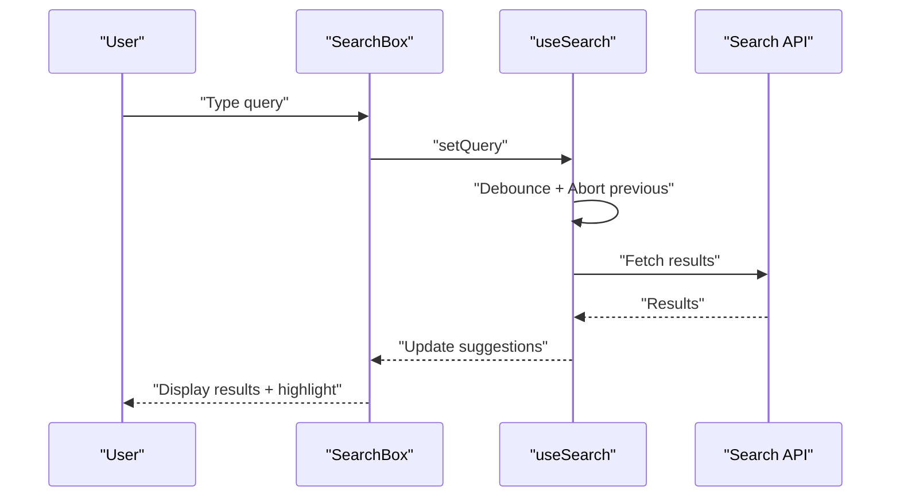

**Diagram sources**
- [search-ui.ts:3-69](file://src/content/recipes/search-ui.ts#L3-L69)

**Section sources**
- [search-ui.ts:3-69](file://src/content/recipes/search-ui.ts#L3-L69)

### Skeleton Loaders
- Problem: Blank screens during loading feel slow; users perceive skeleton loaders as faster.
- Solution: Animated shimmer/pulse/wave, dynamic skeleton generation, CLS avoidance, timeout/error states, and best practices.
- Key patterns:
  - Basic skeleton HTML/CSS with shimmer animation.
  - React skeleton components and card/list skeletons.
  - Shimmer, pulse, and wave animations with reduced motion support.
  - Dynamic skeleton generator cloning templates and replacing with skeletons.
  - Avoiding layout shift with matching dimensions and aspect ratios.
  - Timeout and error handling with user-friendly messages.
  - Best practices: matching final layout, subtle animations, appropriate durations, progress indication, and multiple skeletons for lists.
- Real-world applicability: News feeds, dashboards, e-commerce, and content-heavy applications.

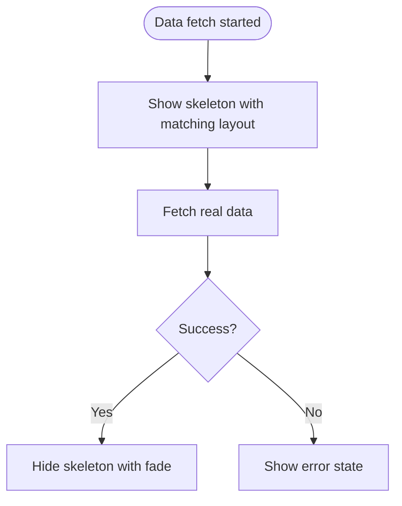

**Diagram sources**
- [skeleton-loaders.ts:3-520](file://src/content/recipes/skeleton-loaders.ts#L3-L520)

**Section sources**
- [skeleton-loaders.ts:3-520](file://src/content/recipes/skeleton-loaders.ts#L3-L520)

### Virtualized Lists (Windowing)
- Problem: Rendering thousands of list items causes memory bloat and scroll jank.
- Solution: Virtualization (windowing) with fixed/variable heights, Intersection Observer, and React examples.
- Key patterns:
  - Basic virtual list rendering visible items with buffer zones.
  - Variable height items with cumulative height calculation and ResizeObserver.
  - Intersection Observer approach for item visibility.
  - React virtual list with scroll handler and transform-based rendering.
  - Performance monitoring and metrics collection.
  - Common pitfalls: scroll jank, dynamic content handling, scroll jumping, and memory leaks.
- Real-world applicability: Large datasets, analytics reports, chat interfaces, and data grids.

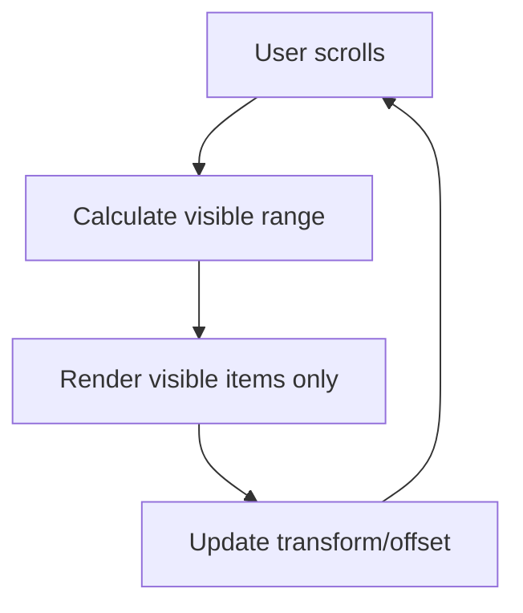

**Diagram sources**
- [virtualized-lists.ts:3-446](file://src/content/recipes/virtualized-lists.ts#L3-L446)

**Section sources**
- [virtualized-lists.ts:3-446](file://src/content/recipes/virtualized-lists.ts#L3-L446)

### Form Validation
- Problem: Forms need real-time validation feedback without overwhelming users or bypassing server-side checks.
- Solution: Composable validators, validation hook, accessible input components, Zod schemas, async validation, multi-step forms, and validation timing strategies.
- Key patterns:
  - Composable validators (required, min/max length, email).
  - useFormValidation hook with touched/errors and validation timing.
  - Accessible FormField component with ARIA attributes.
  - Zod schema validation with refiners and async checks.
  - React Hook Form + Zod resolver for robust validation.
  - Async validation with debounced server checks.
  - Multi-step form validation with independent step schemas.
  - Validation timing strategies: on submit, on blur, on change (debounced), eager then lazy.
  - Accessibility: ARIA roles, error announcements, focus management, and native validation attributes.
- Real-world applicability: Sign-up flows, checkout forms, admin panels, and compliance-heavy forms.

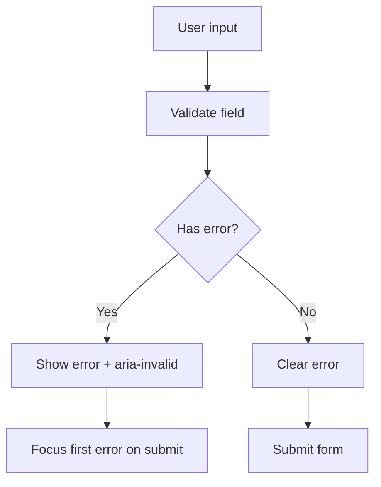

**Diagram sources**
- [form-validation.ts:3-72](file://src/content/recipes/form-validation.ts#L3-L72)

**Section sources**
- [form-validation.ts:3-72](file://src/content/recipes/form-validation.ts#L3-L72)

## Dependency Analysis
Recipes are loosely coupled and primarily depend on:
- UI components and hooks for rendering and interactivity.
- Browser APIs (IntersectionObserver, AbortController, ResizeObserver, localStorage).
- Optional libraries (TanStack Query, Sonner) for advanced patterns.
- Application services for auth, API, and theme management.

**Diagram sources**
- [pagination.ts:3-56](file://src/content/recipes/pagination.ts#L3-L56)
- [debouncing.ts:3-59](file://src/content/recipes/debouncing.ts#L3-L59)
- [drag-and-drop.ts:3-487](file://src/content/recipes/drag-and-drop.ts#L3-L487)
- [global-state.ts:3-529](file://src/content/recipes/global-state.ts#L3-L529)
- [error-fallback.ts:3-66](file://src/content/recipes/error-fallback.ts#L3-L66)
- [api-retries.ts:3-70](file://src/content/recipes/api-retries.ts#L3-L70)
- [auth-ui-patterns.ts:3-71](file://src/content/recipes/auth-ui-patterns.ts#L3-L71)
- [dark-mode.ts:3-457](file://src/content/recipes/dark-mode.ts#L3-L457)
- [image-lazy-loading.ts:3-510](file://src/content/recipes/image-lazy-loading.ts#L3-L510)
- [infinite-scroll.ts:3-64](file://src/content/recipes/infinite-scroll.ts#L3-L64)
- [route-guards.ts:3-592](file://src/content/recipes/route-guards.ts#L3-L592)
- [search-ui.ts:3-69](file://src/content/recipes/search-ui.ts#L3-L69)
- [skeleton-loaders.ts:3-520](file://src/content/recipes/skeleton-loaders.ts#L3-L520)
- [virtualized-lists.ts:3-446](file://src/content/recipes/virtualized-lists.ts#L3-L446)
- [form-validation.ts:3-72](file://src/content/recipes/form-validation.ts#L3-L72)

**Section sources**
- [pagination.ts:3-56](file://src/content/recipes/pagination.ts#L3-L56)
- [debouncing.ts:3-59](file://src/content/recipes/debouncing.ts#L3-L59)
- [drag-and-drop.ts:3-487](file://src/content/recipes/drag-and-drop.ts#L3-L487)
- [global-state.ts:3-529](file://src/content/recipes/global-state.ts#L3-L529)
- [error-fallback.ts:3-66](file://src/content/recipes/error-fallback.ts#L3-L66)
- [api-retries.ts:3-70](file://src/content/recipes/api-retries.ts#L3-L70)
- [auth-ui-patterns.ts:3-71](file://src/content/recipes/auth-ui-patterns.ts#L3-L71)
- [dark-mode.ts:3-457](file://src/content/recipes/dark-mode.ts#L3-L457)
- [image-lazy-loading.ts:3-510](file://src/content/recipes/image-lazy-loading.ts#L3-L510)
- [infinite-scroll.ts:3-64](file://src/content/recipes/infinite-scroll.ts#L3-L64)
- [route-guards.ts:3-592](file://src/content/recipes/route-guards.ts#L3-L592)
- [search-ui.ts:3-69](file://src/content/recipes/search-ui.ts#L3-L69)
- [skeleton-loaders.ts:3-520](file://src/content/recipes/skeleton-loaders.ts#L3-L520)
- [virtualized-lists.ts:3-446](file://src/content/recipes/virtualized-lists.ts#L3-L446)
- [form-validation.ts:3-72](file://src/content/recipes/form-validation.ts#L3-L72)

## Performance Considerations
- Debouncing and throttling reduce redundant work and improve responsiveness.
- Lazy loading and skeleton loaders improve perceived performance and reduce layout shifts.
- Infinite scroll and virtualization prevent DOM bloat and maintain smooth scrolling.
- API retries with backoff and jitter reduce server load spikes and improve resilience.
- Global state patterns minimize prop drilling and reduce unnecessary re-renders.
- Dark mode transitions and CSS variables avoid costly recalculations when toggled.
- Form validation timing strategies balance UX and performance.

[No sources needed since this section provides general guidance]

## Troubleshooting Guide
- Debouncing
  - Symptom: Memory leaks from timers.
  - Fix: Always cancel debounced functions in cleanup.
  - Reference: [debouncing.ts:37-59](file://src/content/recipes/debouncing.ts#L37-L59)

- Drag-and-Drop
  - Symptom: Drops not working.
  - Fix: Prevent default dragover and set dropEffect.
  - Reference: [drag-and-drop.ts:30-76](file://src/content/recipes/drag-and-drop.ts#L30-L76)

- Global State
  - Symptom: State changes not detected.
  - Fix: Use immutable updates and proper subscriptions.
  - Reference: [global-state.ts:31-115](file://src/content/recipes/global-state.ts#L31-L115)

- Error Fallback
  - Symptom: Silent failures.
  - Fix: Implement error boundaries and logging.
  - Reference: [error-fallback.ts:30-66](file://src/content/recipes/error-fallback.ts#L30-L66)

- API Retries
  - Symptom: Thundering herd.
  - Fix: Use jitter in retry delays.
  - Reference: [api-retries.ts:42-44](file://src/content/recipes/api-retries.ts#L42-L44)

- Auth UI
  - Symptom: Revealing sensitive info.
  - Fix: Use generic error messages and rate limiting.
  - Reference: [auth-ui-patterns.ts:21-71](file://src/content/recipes/auth-ui-patterns.ts#L21-L71)

- Dark Mode
  - Symptom: Theme flash on load.
  - Fix: Apply theme in head and use no-flash hydration.
  - Reference: [dark-mode.ts:196-254](file://src/content/recipes/dark-mode.ts#L196-L254)

- Image Lazy Loading
  - Symptom: Layout shift.
  - Fix: Set placeholder dimensions and avoid changing sizes.
  - Reference: [image-lazy-loading.ts:338-396](file://src/content/recipes/image-lazy-loading.ts#L338-L396)

- Infinite Scroll
  - Symptom: Memory leaks.
  - Fix: Clean up observers and limit DOM nodes.
  - Reference: [infinite-scroll.ts:30-35](file://src/content/recipes/infinite-scroll.ts#L30-L35)

- Route Guards
  - Symptom: Race conditions.
  - Fix: Use guard executors with timeouts and proper state.
  - Reference: [route-guards.ts:343-414](file://src/content/recipes/route-guards.ts#L343-L414)

- Search UI
  - Symptom: XSS via highlight.
  - Fix: Escape regex and avoid innerHTML.
  - Reference: [search-ui.ts:33-35](file://src/content/recipes/search-ui.ts#L33-L35)

- Skeleton Loaders
  - Symptom: Layout shift.
  - Fix: Match final dimensions and use aspect ratios.
  - Reference: [skeleton-loaders.ts:338-396](file://src/content/recipes/skeleton-loaders.ts#L338-L396)

- Virtualized Lists
  - Symptom: Scroll jank.
  - Fix: Batch reads/writes and measure heights accurately.
  - Reference: [virtualized-lists.ts:386-444](file://src/content/recipes/virtualized-lists.ts#L386-L444)

- Form Validation
  - Symptom: Overwhelming errors.
  - Fix: Use appropriate validation timing and accessible error presentation.
  - Reference: [form-validation.ts:52-72](file://src/content/recipes/form-validation.ts#L52-L72)

**Section sources**
- [debouncing.ts:37-59](file://src/content/recipes/debouncing.ts#L37-L59)
- [drag-and-drop.ts:30-76](file://src/content/recipes/drag-and-drop.ts#L30-L76)
- [global-state.ts:31-115](file://src/content/recipes/global-state.ts#L31-L115)
- [error-fallback.ts:30-66](file://src/content/recipes/error-fallback.ts#L30-L66)
- [api-retries.ts:42-44](file://src/content/recipes/api-retries.ts#L42-L44)
- [auth-ui-patterns.ts:21-71](file://src/content/recipes/auth-ui-patterns.ts#L21-L71)
- [dark-mode.ts:196-254](file://src/content/recipes/dark-mode.ts#L196-L254)
- [image-lazy-loading.ts:338-396](file://src/content/recipes/image-lazy-loading.ts#L338-L396)
- [infinite-scroll.ts:30-35](file://src/content/recipes/infinite-scroll.ts#L30-L35)
- [route-guards.ts:343-414](file://src/content/recipes/route-guards.ts#L343-L414)
- [search-ui.ts:33-35](file://src/content/recipes/search-ui.ts#L33-L35)
- [skeleton-loaders.ts:338-396](file://src/content/recipes/skeleton-loaders.ts#L338-L396)
- [virtualized-lists.ts:386-444](file://src/content/recipes/virtualized-lists.ts#L386-L444)
- [form-validation.ts:52-72](file://src/content/recipes/form-validation.ts#L52-L72)

## Conclusion
The Recipes Pilar provides production-ready, tested patterns across UI, state, performance, authentication, API resilience, and modern UI features. By following the problem-solution approach, leveraging the included patterns, and adhering to code quality and performance standards, teams can implement robust, scalable, and user-friendly JavaScript applications. Recipes are designed for adaptability—integrate, customize, and evolve them to meet project-specific needs while maintaining consistency and reliability.

[No sources needed since this section summarizes without analyzing specific files]

## Appendices
- Integration examples and customization options are embedded within each recipe’s sections. Use the referenced files as implementation blueprints and adapt them to your project’s architecture and design system.
- Testing strategies:
  - Unit tests for hooks and utilities (debounce, search, validation).
  - Integration tests for UI flows (pagination, infinite scroll, drag-and-drop).
  - E2E tests for critical journeys (auth flows, search, route guards).
  - Performance tests for lazy loading, virtualization, and retries.
- Architectural decisions and trade-offs:
  - Choose cursor-based pagination for large datasets; offset-based for small datasets or when skipping to pages is required.
  - Prefer TanStack Query for caching and infinite pagination; implement custom hooks for simpler scenarios.
  - Use debouncing for search and autosave; throttle for scroll/resize events.
  - Implement skeleton loaders to improve perceived performance; avoid layout shifts by matching final dimensions.
  - Employ route guards for access control; combine auth and RBAC guards for granular permissions.
  - Apply dark mode with system awareness and reduced motion support for inclusivity.
  - Use virtualization for large lists; monitor performance and adjust buffer sizes.

[No sources needed since this section provides general guidance]