# Browser APIs

<cite>
**Referenced Files in This Document**
- [fetch.ts](file://src/content/learn/browser/fetch.ts)
- [local-storage.ts](file://src/content/learn/browser/local-storage.ts)
- [session-storage.ts](file://src/content/learn/browser/session-storage.ts)
- [history.ts](file://src/content/learn/browser/history.ts)
- [clipboard.ts](file://src/content/learn/browser/clipboard.ts)
- [geolocation.ts](file://src/content/learn/browser/geolocation.ts)
- [indexeddb.ts](file://src/content/learn/browser/indexeddb.ts)
- [web-crypto.ts](file://src/content/learn/browser/web-crypto.ts)
- [websockets.ts](file://src/content/learn/browser/websockets.ts)
</cite>

## Table of Contents
1. [Introduction](#introduction)
2. [Project Structure](#project-structure)
3. [Core Components](#core-components)
4. [Architecture Overview](#architecture-overview)
5. [Detailed Component Analysis](#detailed-component-analysis)
6. [Dependency Analysis](#dependency-analysis)
7. [Performance Considerations](#performance-considerations)
8. [Troubleshooting Guide](#troubleshooting-guide)
9. [Conclusion](#conclusion)
10. [Appendices](#appendices)

## Introduction
This document consolidates the Browser APIs reference for JavaScript APIs available in browser environments. It focuses on:
- URL-related APIs: URL, URLSearchParams, and URLPattern
- Browser storage: localStorage and sessionStorage
- Network APIs: fetch and XMLHttpRequest
- Web APIs: Clipboard API, Geolocation API, IndexedDB, Web Crypto API, WebSockets
- Availability, compatibility, security, and performance
- Practical patterns, polyfills, fallbacks, and progressive enhancement
- Integration with modern web frameworks

## Project Structure
The repository organizes browser API lessons as structured content modules. Each lesson documents concepts, usage patterns, examples, and best practices for a specific API surface.

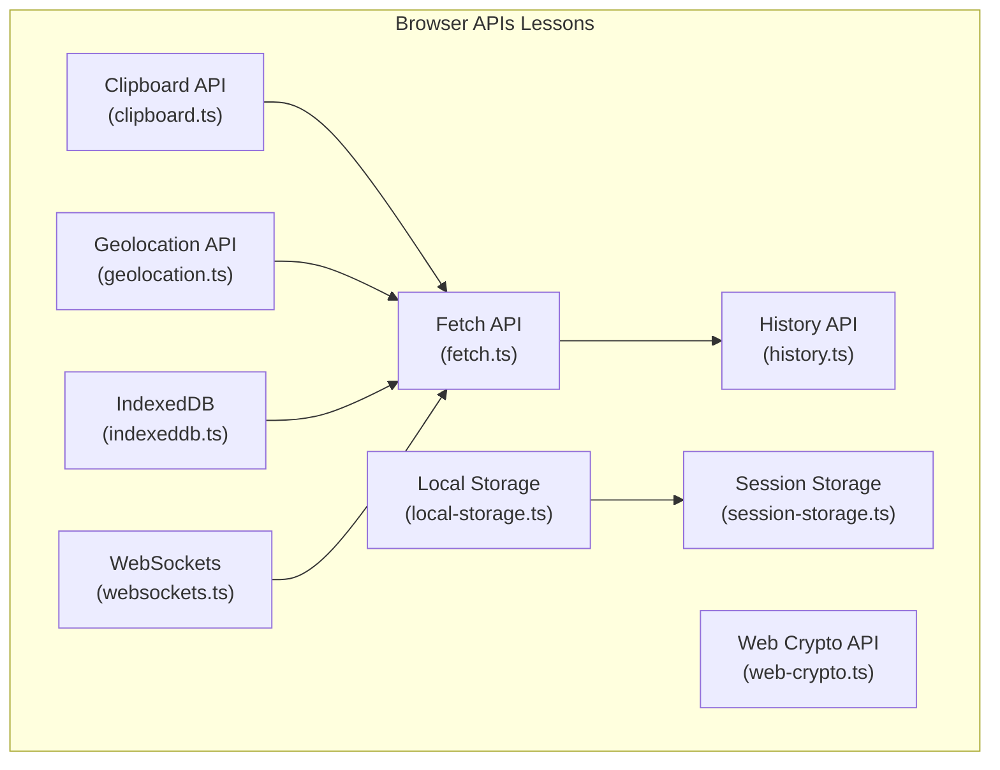

**Diagram sources**
- [fetch.ts:1-652](file://src/content/learn/browser/fetch.ts#L1-L652)
- [local-storage.ts:1-389](file://src/content/learn/browser/local-storage.ts#L1-L389)
- [session-storage.ts:1-352](file://src/content/learn/browser/session-storage.ts#L1-L352)
- [history.ts:1-413](file://src/content/learn/browser/history.ts#L1-L413)
- [clipboard.ts:1-420](file://src/content/learn/browser/clipboard.ts#L1-L420)
- [geolocation.ts:1-425](file://src/content/learn/browser/geolocation.ts#L1-L425)
- [indexeddb.ts:1-592](file://src/content/learn/browser/indexeddb.ts#L1-L592)
- [web-crypto.ts:1-516](file://src/content/learn/browser/web-crypto.ts#L1-L516)
- [websockets.ts:1-514](file://src/content/learn/browser/websockets.ts#L1-L514)

**Section sources**
- [fetch.ts:1-652](file://src/content/learn/browser/fetch.ts#L1-L652)
- [local-storage.ts:1-389](file://src/content/learn/browser/local-storage.ts#L1-L389)
- [session-storage.ts:1-352](file://src/content/learn/browser/session-storage.ts#L1-L352)
- [history.ts:1-413](file://src/content/learn/browser/history.ts#L1-L413)
- [clipboard.ts:1-420](file://src/content/learn/browser/clipboard.ts#L1-L420)
- [geolocation.ts:1-425](file://src/content/learn/browser/geolocation.ts#L1-L425)
- [indexeddb.ts:1-592](file://src/content/learn/browser/indexeddb.ts#L1-L592)
- [web-crypto.ts:1-516](file://src/content/learn/browser/web-crypto.ts#L1-L516)
- [websockets.ts:1-514](file://src/content/learn/browser/websockets.ts#L1-L514)

## Core Components
- URL-related APIs
  - URL: Construct and manipulate absolute and relative URLs.
  - URLSearchParams: Build and parse query strings with automatic encoding.
  - URLPattern: Match URLs against structured patterns (modern alternative to regex).
- Browser storage
  - localStorage: Persistent, synchronous key-value storage for strings.
  - sessionStorage: Per-tab, synchronous key-value storage for strings.
- Network APIs
  - fetch: Modern, Promise-based HTTP client with streaming and cancellation.
  - XMLHttpRequest: Legacy synchronous/asynchronous XHR (still widely used).
- Web APIs
  - Clipboard API: Copy/paste text and rich content (HTML/images).
  - Geolocation API: Obtain user coordinates with permissions and fallbacks.
  - IndexedDB: Client-side NoSQL database for large, structured data.
  - Web Crypto API: Native cryptography for hashing, encryption, signing, key management.
  - WebSockets: Real-time, bidirectional communication channels.

**Section sources**
- [fetch.ts:187-210](file://src/content/learn/browser/fetch.ts#L187-L210)
- [local-storage.ts:36-90](file://src/content/learn/browser/local-storage.ts#L36-L90)
- [session-storage.ts:35-100](file://src/content/learn/browser/session-storage.ts#L35-L100)
- [clipboard.ts:35-87](file://src/content/learn/browser/clipboard.ts#L35-L87)
- [geolocation.ts:36-88](file://src/content/learn/browser/geolocation.ts#L36-L88)
- [indexeddb.ts:36-125](file://src/content/learn/browser/indexeddb.ts#L36-L125)
- [web-crypto.ts:36-104](file://src/content/learn/browser/web-crypto.ts#L36-L104)
- [websockets.ts:36-99](file://src/content/learn/browser/websockets.ts#L36-L99)

## Architecture Overview
The Browser APIs ecosystem integrates with the browser runtime and the DOM. Applications commonly:
- Use fetch for network requests and integrate with storage for caching and state.
- Employ the History API for SPA routing and navigation.
- Apply the Clipboard and Geolocation APIs for user interactions and location-aware features.
- Utilize IndexedDB for offline-first and large-scale client-side data.
- Leverage Web Crypto for secure operations and WebSockets for real-time collaboration.

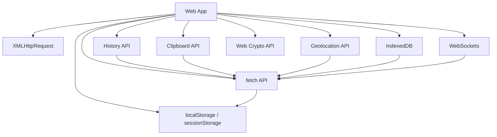

**Diagram sources**
- [fetch.ts:37-122](file://src/content/learn/browser/fetch.ts#L37-L122)
- [history.ts:36-142](file://src/content/learn/browser/history.ts#L36-L142)
- [clipboard.ts:35-87](file://src/content/learn/browser/clipboard.ts#L35-L87)
- [geolocation.ts:36-88](file://src/content/learn/browser/geolocation.ts#L36-L88)
- [indexeddb.ts:36-125](file://src/content/learn/browser/indexeddb.ts#L36-L125)
- [web-crypto.ts:36-104](file://src/content/learn/browser/web-crypto.ts#L36-L104)
- [websockets.ts:36-99](file://src/content/learn/browser/websockets.ts#L36-L99)

## Detailed Component Analysis

### URL, URLSearchParams, URLPattern
- URL
  - Purpose: Construct and parse absolute and relative URLs.
  - Typical usage: Building API endpoints, updating location, validating URLs.
  - Notes: Supports relative resolution and normalization.
- URLSearchParams
  - Purpose: Build and parse query strings with automatic encoding.
  - Typical usage: Filtering, pagination, search parameters.
  - Notes: Prefer over manual concatenation to avoid encoding mistakes.
- URLPattern
  - Purpose: Match URLs against structured patterns (host, pathname, search).
  - Typical usage: Route matching, URL validation, access control.
  - Notes: Modern replacement for complex regex-based URL matching.

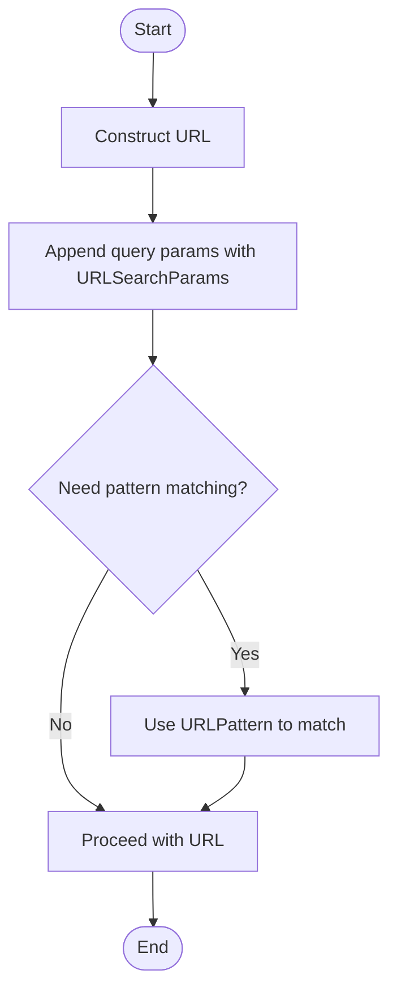

**Diagram sources**
- [fetch.ts:187-210](file://src/content/learn/browser/fetch.ts#L187-L210)

**Section sources**
- [fetch.ts:187-210](file://src/content/learn/browser/fetch.ts#L187-L210)

### localStorage
- Purpose: Persistent, synchronous key-value storage for strings scoped per origin.
- Key operations: setItem, getItem, removeItem, clear, length, key.
- Safety patterns: JSON serialization for objects, try/catch wrappers, quota handling, storage event for cross-tab sync.
- Expiration: Implement TTL wrapper to simulate expiration.
- Cross-tab sync: Listen to storage event to react to changes in other tabs.
- Limitations: Synchronous, strings only, limited capacity, no encryption, private/incognito restrictions.

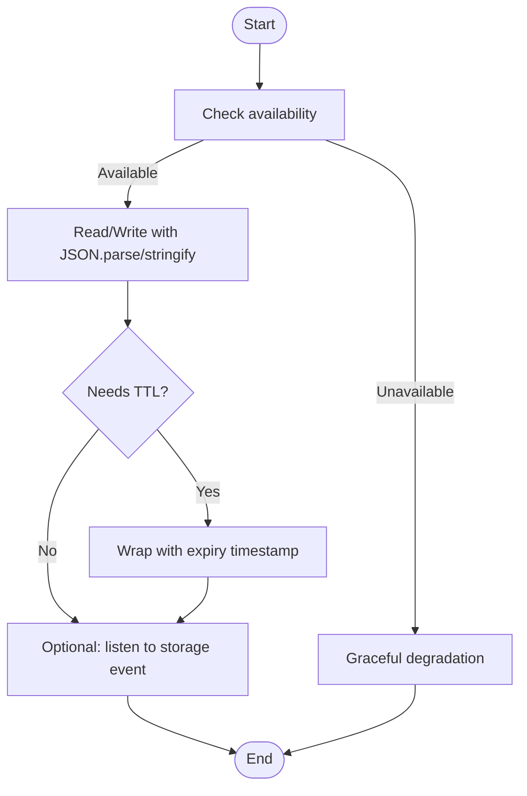

**Diagram sources**
- [local-storage.ts:91-125](file://src/content/learn/browser/local-storage.ts#L91-L125)
- [local-storage.ts:127-171](file://src/content/learn/browser/local-storage.ts#L127-L171)
- [local-storage.ts:173-205](file://src/content/learn/browser/local-storage.ts#L173-L205)

**Section sources**
- [local-storage.ts:36-90](file://src/content/learn/browser/local-storage.ts#L36-L90)
- [local-storage.ts:91-125](file://src/content/learn/browser/local-storage.ts#L91-L125)
- [local-storage.ts:127-171](file://src/content/learn/browser/local-storage.ts#L127-L171)
- [local-storage.ts:173-205](file://src/content/learn/browser/local-storage.ts#L173-L205)
- [local-storage.ts:271-285](file://src/content/learn/browser/local-storage.ts#L271-L285)

### sessionStorage
- Purpose: Per-tab, synchronous key-value storage for strings.
- Use cases: Multi-step forms, temporary state, scroll restoration, session-scoped notifications.
- Tab isolation: Each tab has its own storage; duplication may copy storage from source tab.
- Best practices: Use localStorage for cross-tab persistence, avoid storing sensitive data, keep data small.

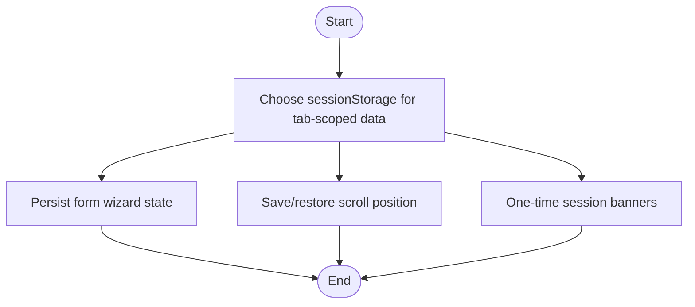

**Diagram sources**
- [session-storage.ts:101-144](file://src/content/learn/browser/session-storage.ts#L101-L144)
- [session-storage.ts:198-228](file://src/content/learn/browser/session-storage.ts#L198-L228)
- [session-storage.ts:230-257](file://src/content/learn/browser/session-storage.ts#L230-L257)

**Section sources**
- [session-storage.ts:35-100](file://src/content/learn/browser/session-storage.ts#L35-L100)
- [session-storage.ts:101-144](file://src/content/learn/browser/session-storage.ts#L101-L144)
- [session-storage.ts:198-257](file://src/content/learn/browser/session-storage.ts#L198-L257)
- [session-storage.ts:294-320](file://src/content/learn/browser/session-storage.ts#L294-L320)

### History API
- Purpose: Update URLs and manage navigation in SPAs without reloads.
- Methods: pushState, replaceState, popstate, history.back/forward/go.
- Patterns: Minimal router, link interception, state preservation, scroll restoration.
- Navigation API (new): Modern replacement with navigation interception and transitions.

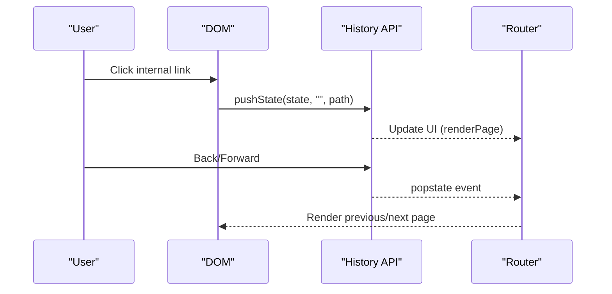

**Diagram sources**
- [history.ts:144-224](file://src/content/learn/browser/history.ts#L144-L224)
- [history.ts:257-278](file://src/content/learn/browser/history.ts#L257-L278)

**Section sources**
- [history.ts:36-142](file://src/content/learn/browser/history.ts#L36-L142)
- [history.ts:144-224](file://src/content/learn/browser/history.ts#L144-L224)
- [history.ts:257-278](file://src/content/learn/browser/history.ts#L257-L278)
- [history.ts:318-354](file://src/content/learn/browser/history.ts#L318-L354)

### Clipboard API
- Purpose: Copy/paste text and rich content (HTML/images) asynchronously.
- Methods: writeText/readText (simple), write/read (rich content).
- Permissions: Reading requires explicit user permission; writing often works without prompting after user gesture.
- Fallback: document.execCommand for legacy support.
- Security: Requires HTTPS; avoid silent reads.

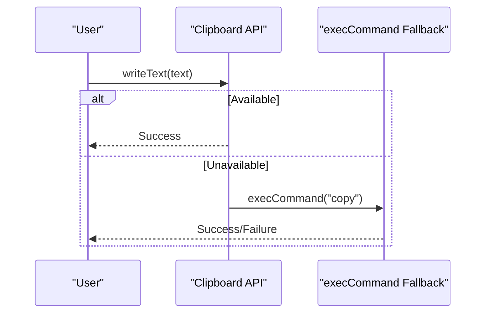

**Diagram sources**
- [clipboard.ts:290-331](file://src/content/learn/browser/clipboard.ts#L290-L331)
- [clipboard.ts:344-378](file://src/content/learn/browser/clipboard.ts#L344-L378)

**Section sources**
- [clipboard.ts:35-87](file://src/content/learn/browser/clipboard.ts#L35-L87)
- [clipboard.ts:88-125](file://src/content/learn/browser/clipboard.ts#L88-L125)
- [clipboard.ts:127-205](file://src/content/learn/browser/clipboard.ts#L127-L205)
- [clipboard.ts:290-331](file://src/content/learn/browser/clipboard.ts#L290-L331)
- [clipboard.ts:380-391](file://src/content/learn/browser/clipboard.ts#L380-L391)

### Geolocation API
- Purpose: Obtain user coordinates with permissions and fallbacks.
- Methods: getCurrentPosition, watchPosition; options: enableHighAccuracy, timeout, maximumAge.
- Accuracy vs battery: enableHighAccuracy increases precision but drains battery.
- Fallbacks: IP-based geolocation; Permissions API checks.
- Privacy: Requires HTTPS; never read without user consent.

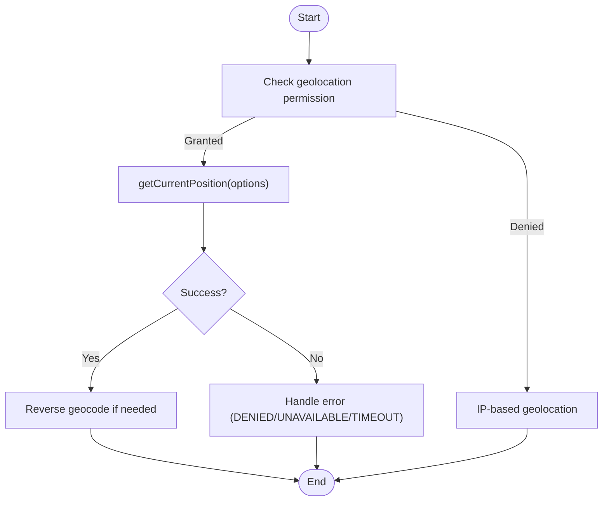

**Diagram sources**
- [geolocation.ts:313-330](file://src/content/learn/browser/geolocation.ts#L313-L330)
- [geolocation.ts:344-359](file://src/content/learn/browser/geolocation.ts#L344-L359)

**Section sources**
- [geolocation.ts:36-88](file://src/content/learn/browser/geolocation.ts#L36-L88)
- [geolocation.ts:89-120](file://src/content/learn/browser/geolocation.ts#L89-L120)
- [geolocation.ts:122-154](file://src/content/learn/browser/geolocation.ts#L122-L154)
- [geolocation.ts:156-197](file://src/content/learn/browser/geolocation.ts#L156-L197)
- [geolocation.ts:199-224](file://src/content/learn/browser/geolocation.ts#L199-L224)
- [geolocation.ts:313-330](file://src/content/learn/browser/geolocation.ts#L313-L330)
- [geolocation.ts:344-359](file://src/content/learn/browser/geolocation.ts#L344-L359)
- [geolocation.ts:392-394](file://src/content/learn/browser/geolocation.ts#L392-L394)

### IndexedDB
- Purpose: Client-side NoSQL database for large, structured data with ACID transactions.
- Concepts: Database, object stores, indexes, transactions, cursors, key ranges.
- Patterns: Promise wrapper, cache manager with TTL, offline sync queue.
- Migrations: onupgradeneeded for schema changes.

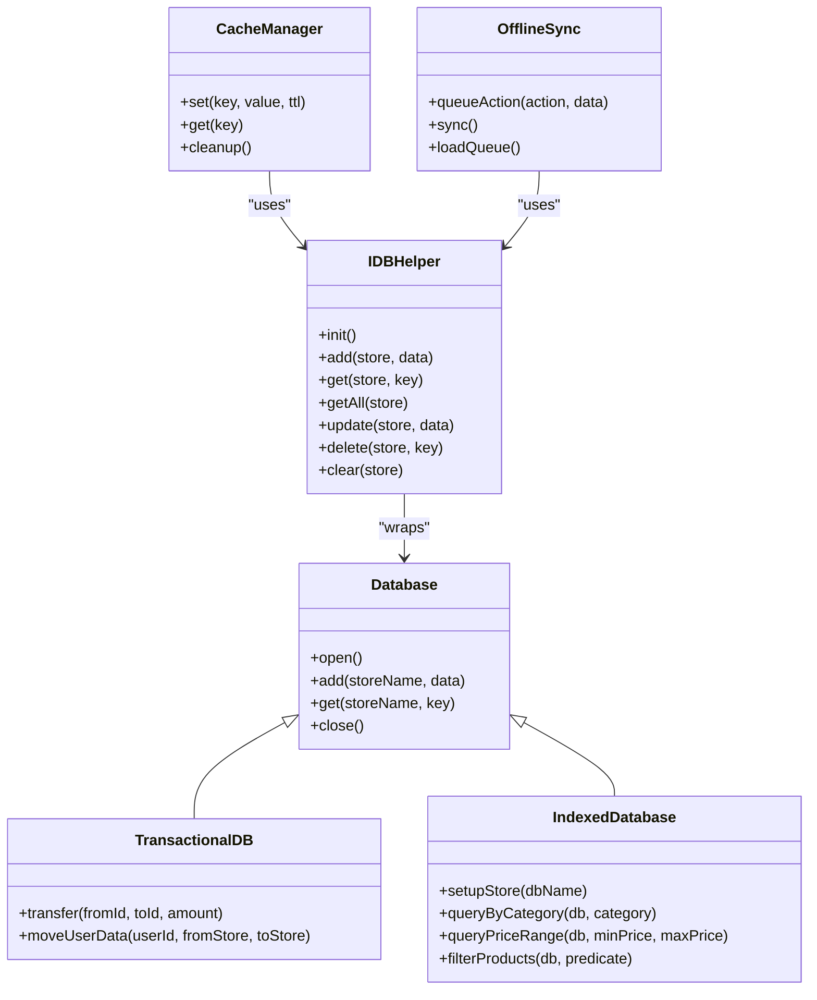

**Diagram sources**
- [indexeddb.ts:44-125](file://src/content/learn/browser/indexeddb.ts#L44-L125)
- [indexeddb.ts:137-196](file://src/content/learn/browser/indexeddb.ts#L137-L196)
- [indexeddb.ts:223-299](file://src/content/learn/browser/indexeddb.ts#L223-L299)
- [indexeddb.ts:397-467](file://src/content/learn/browser/indexeddb.ts#L397-L467)
- [indexeddb.ts:470-514](file://src/content/learn/browser/indexeddb.ts#L470-L514)
- [indexeddb.ts:516-568](file://src/content/learn/browser/indexeddb.ts#L516-L568)

**Section sources**
- [indexeddb.ts:36-125](file://src/content/learn/browser/indexeddb.ts#L36-L125)
- [indexeddb.ts:133-211](file://src/content/learn/browser/indexeddb.ts#L133-L211)
- [indexeddb.ts:219-316](file://src/content/learn/browser/indexeddb.ts#L219-L316)
- [indexeddb.ts:324-384](file://src/content/learn/browser/indexeddb.ts#L324-L384)
- [indexeddb.ts:394-568](file://src/content/learn/browser/indexeddb.ts#L394-L568)

### Web Crypto API
- Purpose: Native cryptography for hashing, encryption, signing, key management.
- Algorithms: SHA family, AES-GCM, RSA (OAEP/PKCS1), ECDSA, PBKDF2.
- Key management: Generate, export/import keys (JWK), derive keys from passwords.
- Best practices: Use secure random values, include IV with ciphertext, handle binary data appropriately.

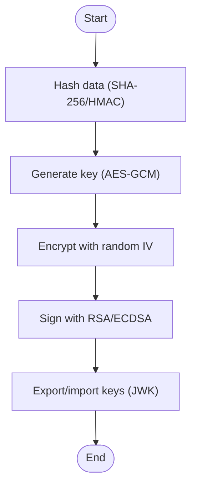

**Diagram sources**
- [web-crypto.ts:46-104](file://src/content/learn/browser/web-crypto.ts#L46-L104)
- [web-crypto.ts:115-194](file://src/content/learn/browser/web-crypto.ts#L115-L194)
- [web-crypto.ts:205-302](file://src/content/learn/browser/web-crypto.ts#L205-L302)
- [web-crypto.ts:313-372](file://src/content/learn/browser/web-crypto.ts#L313-L372)
- [web-crypto.ts:428-492](file://src/content/learn/browser/web-crypto.ts#L428-L492)

**Section sources**
- [web-crypto.ts:36-104](file://src/content/learn/browser/web-crypto.ts#L36-L104)
- [web-crypto.ts:112-169](file://src/content/learn/browser/web-crypto.ts#L112-L169)
- [web-crypto.ts:203-266](file://src/content/learn/browser/web-crypto.ts#L203-L266)
- [web-crypto.ts:310-372](file://src/content/learn/browser/web-crypto.ts#L310-L372)
- [web-crypto.ts:428-492](file://src/content/learn/browser/web-crypto.ts#L428-L492)

### WebSockets
- Purpose: Real-time, bidirectional communication over persistent connections.
- Lifecycle: CONNECTING, OPEN, CLOSING, CLOSED; send/receive; close with codes.
- Patterns: Typed message protocol, reconnection with exponential backoff + jitter, heartbeat/ping-pong.
- Alternatives: SSE for server-to-client streams; HTTP polling for infrequent updates.

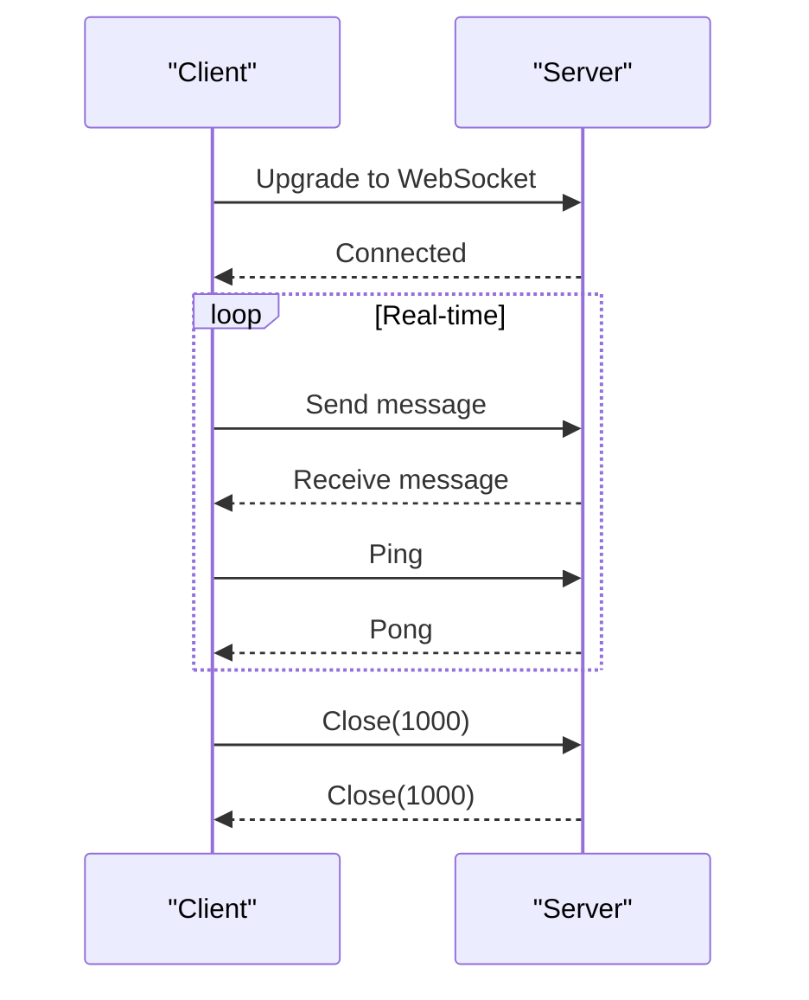

**Diagram sources**
- [websockets.ts:40-99](file://src/content/learn/browser/websockets.ts#L40-L99)
- [websockets.ts:260-310](file://src/content/learn/browser/websockets.ts#L260-L310)

**Section sources**
- [websockets.ts:36-99](file://src/content/learn/browser/websockets.ts#L36-L99)
- [websockets.ts:170-258](file://src/content/learn/browser/websockets.ts#L170-L258)
- [websockets.ts:260-310](file://src/content/learn/browser/websockets.ts#L260-L310)
- [websockets.ts:380-396](file://src/content/learn/browser/websockets.ts#L380-L396)
- [websockets.ts:426-464](file://src/content/learn/browser/websockets.ts#L426-L464)
- [websockets.ts:466-481](file://src/content/learn/browser/websockets.ts#L466-L481)

### fetch API
- Purpose: Modern, Promise-based HTTP client; supports all methods, headers, streaming, cancellation.
- Patterns: Error handling (check response.ok), request wrappers, retry logic, FormData uploads, streaming responses.
- CORS: Enforced by server; use appropriate modes and credentials.
- Comparison: Advantages over XHR include streaming, built-in JSON parsing, and better ergonomics.

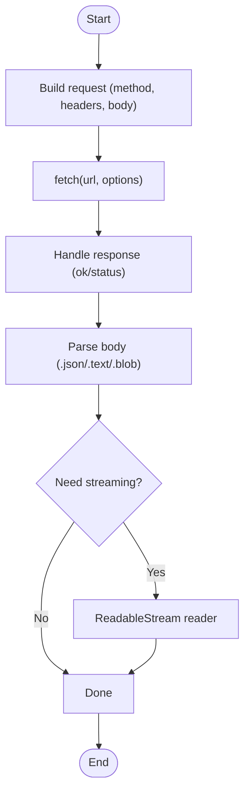

**Diagram sources**
- [fetch.ts:124-156](file://src/content/learn/browser/fetch.ts#L124-L156)
- [fetch.ts:373-412](file://src/content/learn/browser/fetch.ts#L373-L412)
- [fetch.ts:414-452](file://src/content/learn/browser/fetch.ts#L414-L452)

**Section sources**
- [fetch.ts:37-58](file://src/content/learn/browser/fetch.ts#L37-L58)
- [fetch.ts:59-109](file://src/content/learn/browser/fetch.ts#L59-L109)
- [fetch.ts:124-156](file://src/content/learn/browser/fetch.ts#L124-L156)
- [fetch.ts:158-185](file://src/content/learn/browser/fetch.ts#L158-L185)
- [fetch.ts:187-210](file://src/content/learn/browser/fetch.ts#L187-L210)
- [fetch.ts:212-259](file://src/content/learn/browser/fetch.ts#L212-L259)
- [fetch.ts:298-334](file://src/content/learn/browser/fetch.ts#L298-L334)
- [fetch.ts:335-372](file://src/content/learn/browser/fetch.ts#L335-L372)
- [fetch.ts:373-412](file://src/content/learn/browser/fetch.ts#L373-L412)
- [fetch.ts:414-452](file://src/content/learn/browser/fetch.ts#L414-L452)
- [fetch.ts:454-532](file://src/content/learn/browser/fetch.ts#L454-L532)
- [fetch.ts:533-552](file://src/content/learn/browser/fetch.ts#L533-L552)
- [fetch.ts:554-569](file://src/content/learn/browser/fetch.ts#L554-L569)
- [fetch.ts:571-620](file://src/content/learn/browser/fetch.ts#L571-L620)
- [fetch.ts:621-650](file://src/content/learn/browser/fetch.ts#L621-L650)

### XMLHttpRequest (XHR)
- Purpose: Legacy asynchronous/synchronous HTTP client; still widely used.
- Advantages: Interceptors (libraries), upload progress, wide compatibility.
- Disadvantages: Callback-heavy, no built-in JSON parsing, limited ergonomics compared to fetch.
- Polyfills: Use fetch polyfills or XHR-based libraries for environments lacking fetch.

**Section sources**
- [fetch.ts:554-569](file://src/content/learn/browser/fetch.ts#L554-L569)

## Dependency Analysis
- fetch depends on:
  - URL/URLSearchParams for constructing endpoints and query strings.
  - Headers for request/response metadata.
  - ReadableStream for streaming responses.
  - AbortController for cancellation.
- localStorage/sessionStorage depend on:
  - JSON serialization for complex data.
  - Storage event for cross-tab synchronization.
- Clipboard API depends on:
  - Navigator permissions and user gestures.
  - Fallback to document.execCommand for legacy.
- Geolocation API depends on:
  - HTTPS and user permission.
  - Optional IP-based fallback.
- IndexedDB depends on:
  - Transactions for ACID guarantees.
  - Indexes for efficient querying.
- Web Crypto API depends on:
  - Secure random values and proper key handling.
- WebSockets depends on:
  - Proper reconnection and heartbeat strategies.

```mermaid
graph TB
Fetch["fetch"] --> URL["URL/URLSearchParams"]
Fetch --> Headers["Headers"]
Fetch --> Streams["ReadableStream"]
Fetch --> Abort["AbortController"]
LS["localStorage"] --> JSON["JSON"]
SS["sessionStorage"] --> JSON
LS --> StorageEvt["storage event"]
SS --> StorageEvt
Clipboard["Clipboard API"] --> Perm["Permissions"]
Clipboard --> ExecCmd["execCommand fallback"]
Geolocation["Geolocation API"] --> HTTPS["HTTPS"]
Geolocation --> IP["IP-based fallback"]
IDB["IndexedDB"] --> Tx["Transactions"]
IDB --> Idx["Indexes"]
Crypto["Web Crypto API"] --> Rand["crypto.getRandomValues"]
Crypto --> Keys["Key management"]
WS["WebSockets"] --> Reconnect["Reconnection/backoff"]
WS --> Heartbeat["Heartbeat/ping-pong"]
```

**Diagram sources**
- [fetch.ts:187-210](file://src/content/learn/browser/fetch.ts#L187-L210)
- [fetch.ts:335-372](file://src/content/learn/browser/fetch.ts#L335-L372)
- [local-storage.ts:91-125](file://src/content/learn/browser/local-storage.ts#L91-L125)
- [session-storage.ts:173-205](file://src/content/learn/browser/session-storage.ts#L173-L205)
- [clipboard.ts:88-125](file://src/content/learn/browser/clipboard.ts#L88-L125)
- [clipboard.ts:290-331](file://src/content/learn/browser/clipboard.ts#L290-L331)
- [geolocation.ts:36-88](file://src/content/learn/browser/geolocation.ts#L36-L88)
- [geolocation.ts:313-330](file://src/content/learn/browser/geolocation.ts#L313-L330)
- [indexeddb.ts:133-211](file://src/content/learn/browser/indexeddb.ts#L133-L211)
- [web-crypto.ts:428-492](file://src/content/learn/browser/web-crypto.ts#L428-L492)
- [websockets.ts:170-258](file://src/content/learn/browser/websockets.ts#L170-L258)
- [websockets.ts:260-310](file://src/content/learn/browser/websockets.ts#L260-L310)

**Section sources**
- [fetch.ts:187-210](file://src/content/learn/browser/fetch.ts#L187-L210)
- [local-storage.ts:91-125](file://src/content/learn/browser/local-storage.ts#L91-L125)
- [session-storage.ts:173-205](file://src/content/learn/browser/session-storage.ts#L173-L205)
- [clipboard.ts:88-125](file://src/content/learn/browser/clipboard.ts#L88-L125)
- [geolocation.ts:36-88](file://src/content/learn/browser/geolocation.ts#L36-L88)
- [indexeddb.ts:133-211](file://src/content/learn/browser/indexeddb.ts#L133-L211)
- [web-crypto.ts:428-492](file://src/content/learn/browser/web-crypto.ts#L428-L492)
- [websockets.ts:170-258](file://src/content/learn/browser/websockets.ts#L170-L258)

## Performance Considerations
- localStorage/sessionStorage
  - Synchronous and blocking; avoid storing large data.
  - Keep data small and serialized minimally.
- IndexedDB
  - Asynchronous; use transactions and indexes for performance.
  - Batch operations and cursor-based iteration for large datasets.
- fetch
  - Prefer streaming for large responses.
  - Use AbortController to cancel unnecessary work.
  - Implement exponential backoff for retries.
- WebSockets
  - Use heartbeat to detect dead connections early.
  - Implement jitter to avoid thundering herd on reconnection.
- Clipboard API
  - Avoid silent reads; prompt user for permission.
- Geolocation
  - Use enableHighAccuracy judiciously; set reasonable timeouts.
- Web Crypto
  - Use secure random values; avoid exporting keys unnecessarily.

[No sources needed since this section provides general guidance]

## Troubleshooting Guide
- fetch
  - Always check response.ok before parsing body.
  - Handle network errors vs HTTP errors differently.
  - Avoid setting Content-Type manually with FormData.
  - Clone responses if you need multiple reads.
- localStorage/sessionStorage
  - Wrap access in try/catch; handle QuotaExceededError.
  - Use JSON wrappers for objects; be mindful of string-only storage.
  - Cross-tab changes are visible via storage event in other tabs.
- Clipboard API
  - Requires HTTPS; reading requires permission.
  - Provide fallback to document.execCommand for legacy.
- Geolocation
  - Requires HTTPS; request permission after user action.
  - Clear watchPosition on cleanup to prevent leaks.
- IndexedDB
  - Handle onupgradeneeded for migrations.
  - Use transactions for ACID guarantees.
- WebSockets
  - Always check readyState before sending.
  - Implement reconnection with jitter and heartbeat.
- XMLHttpRequest
  - Use interceptors/libraries for advanced features.
  - Handle progress events for uploads/downloads.

**Section sources**
- [fetch.ts:571-620](file://src/content/learn/browser/fetch.ts#L571-L620)
- [fetch.ts:621-650](file://src/content/learn/browser/fetch.ts#L621-L650)
- [local-storage.ts:303-344](file://src/content/learn/browser/local-storage.ts#L303-L344)
- [session-storage.ts:294-320](file://src/content/learn/browser/session-storage.ts#L294-L320)
- [clipboard.ts:344-378](file://src/content/learn/browser/clipboard.ts#L344-L378)
- [geolocation.ts:361-394](file://src/content/learn/browser/geolocation.ts#L361-L394)
- [indexeddb.ts:324-384](file://src/content/learn/browser/indexeddb.ts#L324-L384)
- [websockets.ts:426-464](file://src/content/learn/browser/websockets.ts#L426-L464)

## Conclusion
This Browser APIs reference consolidates modern and legacy browser capabilities with practical patterns, safety measures, and performance guidance. By combining URL utilities, robust storage strategies, efficient networking, and secure cryptography, applications can deliver responsive, resilient, and user-centric experiences across diverse environments.

[No sources needed since this section summarizes without analyzing specific files]

## Appendices
- Compatibility and availability
  - URL/URLSearchParams/URLPattern: Broad modern support; URLPattern is newer.
  - localStorage/sessionStorage: Universal support with caveats (private mode, quotas).
  - fetch: Modern browsers; use polyfills for legacy environments.
  - Clipboard API: Requires HTTPS; varies by browser; fallback available.
  - Geolocation: Requires HTTPS; permission prompts; IP fallback exists.
  - IndexedDB: Supported in all modern browsers; versioning required.
  - Web Crypto API: Native in modern browsers; strong cryptography without libraries.
  - WebSockets: Supported broadly; use wss:// in production.
- Progressive enhancement and polyfills
  - Feature detection: Check for availability before use.
  - Fallbacks: document.execCommand for Clipboard, XHR for fetch, IP-based geolocation.
  - Libraries: Socket.IO for robust WebSockets, Axios for fetch-like XHR convenience.
- Framework integration
  - React: Hooks for localStorage/sessionStorage, WebSocket status, and lifecycle cleanup.
  - SPA routers: History API underpins client-side routing; consider Navigation API for future-proofing.

[No sources needed since this section provides general guidance]