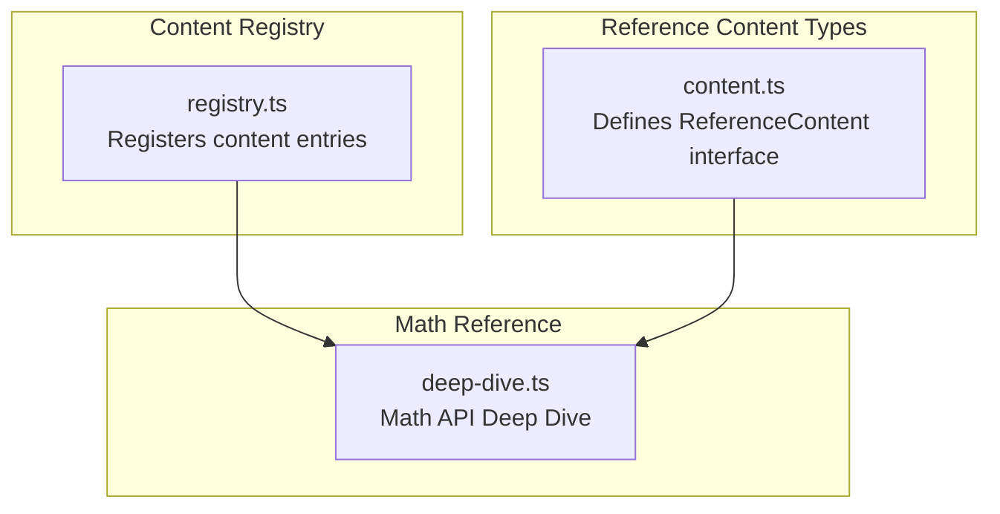
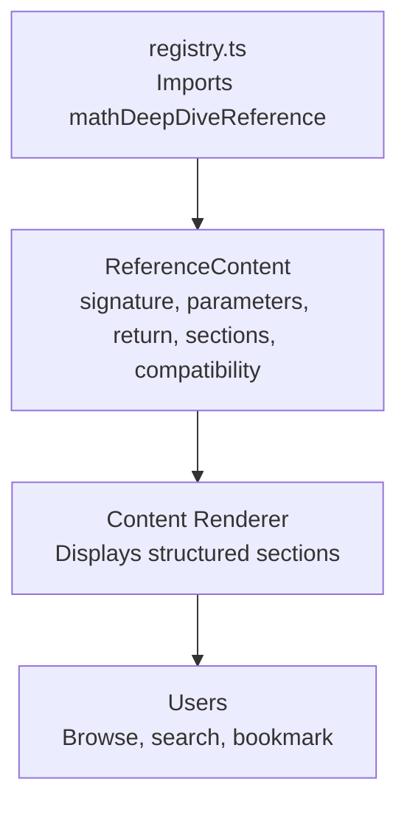
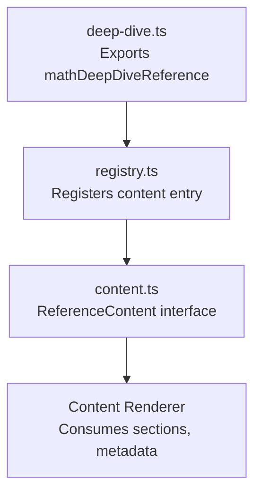

# Math Functions

<cite>
**Referenced Files in This Document**
- [deep-dive.ts](file://src/content/reference/math/deep-dive.ts)
- [registry.ts](file://src/content/registry.ts)
- [content.ts](file://src/types/content.ts)
- [README.md](file://README.md)
</cite>

## Table of Contents
1. [Introduction](#introduction)
2. [Project Structure](#project-structure)
3. [Core Components](#core-components)
4. [Architecture Overview](#architecture-overview)
5. [Detailed Component Analysis](#detailed-component-analysis)
6. [Dependency Analysis](#dependency-analysis)
7. [Performance Considerations](#performance-considerations)
8. [Troubleshooting Guide](#troubleshooting-guide)
9. [Conclusion](#conclusion)
10. [Appendices](#appendices)

## Introduction
This document provides a comprehensive reference for JavaScript Math object methods and constants, derived from the Math API Deep Dive content included in the JSphere knowledge platform. It consolidates the repository’s authoritative coverage of mathematical functions, constants, and practical patterns, with emphasis on function signatures, parameter ranges, return values, precision considerations, edge cases, and performance optimization.

The Math API Deep Dive content covers:
- Mathematical constants (PI, E, SQRT2, SQRT1_2, LN2, LN10, LOG2E, LOG10E)
- Rounding methods (round, floor, ceil, trunc)
- Absolute value and sign utilities
- Power and root operations (pow, sqrt, cbrt, hypot)
- Trigonometric functions (sin, cos, tan, asin, acos, atan, atan2)
- Hyperbolic functions (sinh, cosh, tanh)
- Logarithmic functions (log, log10, log2, exp, expm1)
- Min/max operations
- Random number generation
- Special values and edge cases
- Geometry and physics formulas
- Practical algorithms (linear interpolation, easing, statistics)
- Performance notes and common gotchas

These topics are presented as a cohesive reference with code examples and practical guidance suitable for learners and practitioners.

**Section sources**
- [deep-dive.ts:3-25](file://src/content/reference/math/deep-dive.ts#L3-L25)

## Project Structure
The Math reference is part of the “Reference” pillar and is registered centrally in the content registry. The content type definition for Reference pages includes fields for signatures, parameters, return values, and compatibility, which are populated by the Math Deep Dive content.

**Diagram sources**
- [registry.ts:87-92](file://src/content/registry.ts#L87-L92)
- [content.ts:82-91](file://src/types/content.ts#L82-L91)
- [deep-dive.ts:3-25](file://src/content/reference/math/deep-dive.ts#L3-L25)

**Section sources**
- [registry.ts:87-92](file://src/content/registry.ts#L87-L92)
- [content.ts:82-91](file://src/types/content.ts#L82-L91)
- [deep-dive.ts:3-25](file://src/content/reference/math/deep-dive.ts#L3-L25)

## Core Components
The Math API Deep Dive content defines a structured reference with:
- Signature: a concise method invocation pattern
- Parameters: typed parameter definitions with descriptions
- Return value: type and description
- Compatibility: browser support note
- Sections: organized by topic (constants, rounding, power/root, trigonometry, logarithms, min/max, random, special values, geometry, algorithms, performance, patterns)

This structure enables quick lookup of method usage, expected inputs/outputs, and practical examples.

**Section sources**
- [deep-dive.ts:20-25](file://src/content/reference/math/deep-dive.ts#L20-L25)
- [deep-dive.ts:26-516](file://src/content/reference/math/deep-dive.ts#L26-L516)

## Architecture Overview
The Math reference integrates into the JSphere platform as follows:
- Content registration: The registry imports and exposes the Math Deep Dive entry.
- Type system: ReferenceContent enforces consistent metadata and structure.
- Rendering: The platform’s content renderer displays headings, paragraphs, code blocks, and callouts.

**Diagram sources**
- [registry.ts:87-92](file://src/content/registry.ts#L87-L92)
- [content.ts:82-91](file://src/types/content.ts#L82-L91)
- [deep-dive.ts:3-25](file://src/content/reference/math/deep-dive.ts#L3-L25)

**Section sources**
- [registry.ts:87-92](file://src/content/registry.ts#L87-L92)
- [content.ts:82-91](file://src/types/content.ts#L82-L91)
- [deep-dive.ts:3-25](file://src/content/reference/math/deep-dive.ts#L3-L25)

## Detailed Component Analysis

### Mathematical Constants
- Constants covered: PI, E, SQRT2, SQRT1_2, LN2, LN10, LOG2E, LOG10E
- Typical usage: geometric formulas, exponential growth, signal processing conversions
- Precision: IEEE 754 double precision; treat as approximations in exact arithmetic contexts

Practical usage patterns:
- Circumference and area calculations
- Exponential growth modeling
- Decibel conversions

**Section sources**
- [deep-dive.ts:29-42](file://src/content/reference/math/deep-dive.ts#L29-L42)

### Rounding Methods
- round: ties to nearest even (banker’s rounding)
- floor: always rounds down
- ceil: always rounds up
- trunc: removes fractional part toward zero
- Custom rounding helpers: half-up rounding for negative numbers

Precision and edge cases:
- Negative half values round to nearest even
- Use custom helpers when consistent half-up behavior is required

**Section sources**
- [deep-dive.ts:44-73](file://src/content/reference/math/deep-dive.ts#L44-L73)
- [deep-dive.ts:484-494](file://src/content/reference/math/deep-dive.ts#L484-L494)

### Absolute Value and Sign
- abs: magnitude of a number
- sign: -1, 0, or 1 depending on sign; -0 and NaN edge cases
- Practical patterns: distance calculation, clamping values

**Section sources**
- [deep-dive.ts:75-100](file://src/content/reference/math/deep-dive.ts#L75-L100)

### Power and Root Operations
- pow(base, exponent): general exponentiation
- sqrt: principal square root; negative inputs yield NaN
- cbrt: cube root (handles negatives)
- hypot: Euclidean norm; robust against overflow/underflow

Performance notes:
- Prefer Math.sqrt for square roots
- Prefer the exponential operator for simple integer powers when applicable

**Section sources**
- [deep-dive.ts:102-133](file://src/content/reference/math/deep-dive.ts#L102-L133)
- [deep-dive.ts:443-482](file://src/content/reference/math/deep-dive.ts#L443-L482)

### Trigonometric Functions
- Units: radians
- Conversions: degrees × (π / 180) to radians; radians × (180 / π) to degrees
- Functions: sin, cos, tan, asin, acos, atan, atan2
- Applications: rotation, projections, angle computations

Gotchas:
- Trig functions expect radians, not degrees
- atan2(y, x) yields angle from origin

**Section sources**
- [deep-dive.ts:135-169](file://src/content/reference/math/deep-dive.ts#L135-L169)
- [deep-dive.ts:484-498](file://src/content/reference/math/deep-dive.ts#L484-L498)

### Logarithmic Functions
- log: natural logarithm (base e)
- log10: base 10 logarithm
- log2: base 2 logarithm
- exp: e raised to the power
- expm1: e^x - 1 for small x (more precise)
- Applications: decibel calculations, information theory, growth modeling

**Section sources**
- [deep-dive.ts:171-205](file://src/content/reference/math/deep-dive.ts#L171-L205)

### Min and Max
- min/max across multiple numeric arguments
- With arrays: spread operator
- NaN propagation and Infinity behavior
- Practical uses: range calculation, closest value selection

**Section sources**
- [deep-dive.ts:207-237](file://src/content/reference/math/deep-dive.ts#L207-L237)

### Random Number Generation
- Math.random(): uniform [0, 1)
- Helpers: random integers in range, random floats in range, weighted selection, Fisher–Yates shuffle
- Applications: simulations, games, sampling

**Section sources**
- [deep-dive.ts:239-292](file://src/content/reference/math/deep-dive.ts#L239-L292)

### Special Values and Edge Cases
- Infinity and -Infinity
- NaN (Not a Number)
- isFinite, isNaN checks
- Safe integer validation
- Floating-point precision pitfalls and epsilon-based comparisons

**Section sources**
- [deep-dive.ts:294-328](file://src/content/reference/math/deep-dive.ts#L294-L328)

### Geometry and Physics Formulas
- Circle area and circumference
- Sphere volume and surface area
- Euclidean distance in 2D and 3D
- Angle between slopes
- Haversine distance for geographic coordinates

**Section sources**
- [deep-dive.ts:330-384](file://src/content/reference/math/deep-dive.ts#L330-L384)

### Practical Algorithms
- Linear interpolation (lerp)
- Quadratic easing functions
- Percentile and percentage calculations
- Mean, median, standard deviation
- Box–Muller normal distribution sampler

**Section sources**
- [deep-dive.ts:386-441](file://src/content/reference/math/deep-dive.ts#L386-L441)

### Performance Notes
- Math.pow vs exponential operator: operator is often faster
- Math.sqrt vs x ** 0.5: Math.sqrt is typically faster
- Cache frequently used constants (e.g., Math.PI, 2 * Math.PI) in tight loops

**Section sources**
- [deep-dive.ts:443-482](file://src/content/reference/math/deep-dive.ts#L443-L482)

### Common Patterns and Gotchas
- Banker’s rounding with Math.round on halves
- Trig functions require radians
- parseInt vs Math.floor differences
- Division by zero yields Infinity or NaN
- Safe division helper patterns

**Section sources**
- [deep-dive.ts:484-513](file://src/content/reference/math/deep-dive.ts#L484-L513)

## Dependency Analysis
The Math Deep Dive content is integrated into the platform via the content registry and type system.

**Diagram sources**
- [registry.ts:87-92](file://src/content/registry.ts#L87-L92)
- [content.ts:82-91](file://src/types/content.ts#L82-L91)
- [deep-dive.ts:3-25](file://src/content/reference/math/deep-dive.ts#L3-L25)

**Section sources**
- [registry.ts:87-92](file://src/content/registry.ts#L87-L92)
- [content.ts:82-91](file://src/types/content.ts#L82-L91)
- [deep-dive.ts:3-25](file://src/content/reference/math/deep-dive.ts#L3-L25)

## Performance Considerations
- Prefer Math.sqrt for square roots; prefer the exponential operator for simple integer exponents when applicable.
- Cache Math constants (e.g., Math.PI, 2 * Math.PI) in hot loops to avoid repeated computation.
- Use Math.min/Math.max with spread for arrays; be mindful of NaN propagation and Infinity behavior.
- For floating-point comparisons, use epsilon-based equality rather than strict equality.

[No sources needed since this section provides general guidance]

## Troubleshooting Guide
- Unexpected rounding behavior: Math.round uses banker’s rounding; use a custom helper if you need half-up rounding.
- Trigonometry errors: Ensure angles are in radians, not degrees.
- NaN and Infinity: Validate inputs and handle edge cases explicitly; use isFinite and isNaN checks.
- Floating-point precision: Use epsilon-based comparisons for equality checks.
- Safe division: Guard against division by zero and return null or a sentinel value when appropriate.

**Section sources**
- [deep-dive.ts:484-513](file://src/content/reference/math/deep-dive.ts#L484-L513)

## Conclusion
The Math API Deep Dive content offers a thorough, practical reference for JavaScript’s Math object. It balances theoretical grounding with real-world usage patterns, including performance tips, edge-case handling, and cross-domain applications in geometry, physics, and game development. The content’s structured format and rich examples make it accessible to learners while serving as a reliable quick-reference for experienced developers.

[No sources needed since this section summarizes without analyzing specific files]

## Appendices

### Browser Compatibility
- The Math object is a global object and is supported across all modern browsers.

**Section sources**
- [deep-dive.ts:25](file://src/content/reference/math/deep-dive.ts#L25)

### Related Topics
- Bitwise operations
- Typed arrays

**Section sources**
- [deep-dive.ts:14](file://src/content/reference/math/deep-dive.ts#L14)