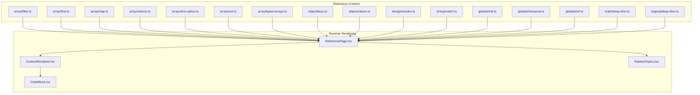
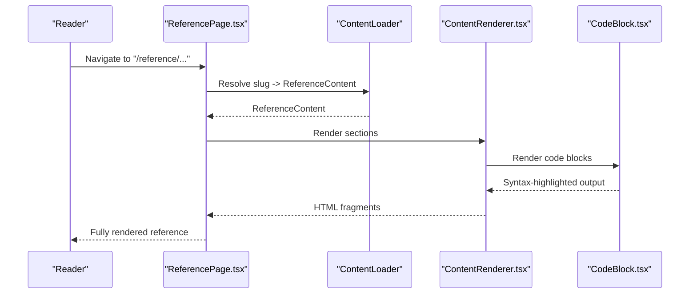
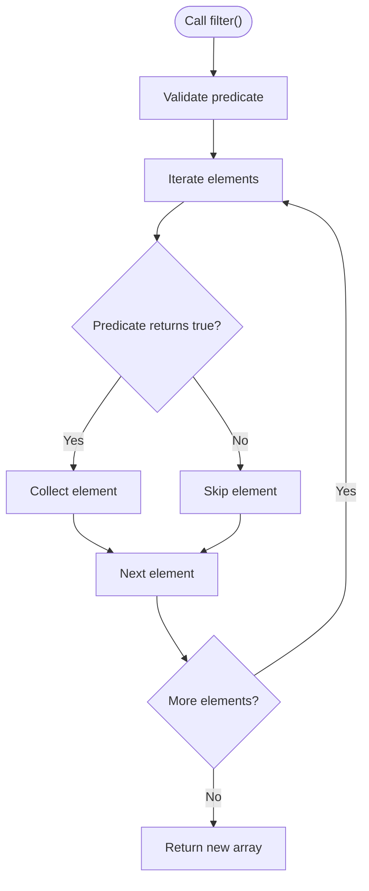
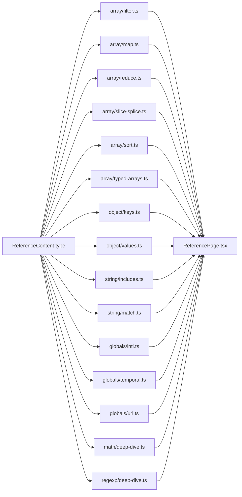

# Reference

<cite>
**Referenced Files in This Document**
- [array/filter.ts](file://src/content/reference/array/filter.ts)
- [array/find.ts](file://src/content/reference/array/find.ts)
- [array/map.ts](file://src/content/reference/array/map.ts)
- [array/reduce.ts](file://src/content/reference/array/reduce.ts)
- [array/slice-splice.ts](file://src/content/reference/array/slice-splice.ts)
- [array/sort.ts](file://src/content/reference/array/sort.ts)
- [array/typed-arrays.ts](file://src/content/reference/array/typed-arrays.ts)
- [object/keys.ts](file://src/content/reference/object/keys.ts)
- [object/values.ts](file://src/content/reference/object/values.ts)
- [string/includes.ts](file://src/content/reference/string/includes.ts)
- [string/match.ts](file://src/content/reference/string/match.ts)
- [globals/intl.ts](file://src/content/reference/globals/intl.ts)
- [globals/temporal.ts](file://src/content/reference/globals/temporal.ts)
- [globals/url.ts](file://src/content/reference/globals/url.ts)
- [math/deep-dive.ts](file://src/content/reference/math/deep-dive.ts)
- [regexp/deep-dive.ts](file://src/content/reference/regexp/deep-dive.ts)
</cite>

## Table of Contents
1. [Introduction](#introduction)
2. [Project Structure](#project-structure)
3. [Core Components](#core-components)
4. [Architecture Overview](#architecture-overview)
5. [Detailed Component Analysis](#detailed-component-analysis)
6. [Dependency Analysis](#dependency-analysis)
7. [Performance Considerations](#performance-considerations)
8. [Troubleshooting Guide](#troubleshooting-guide)
9. [Conclusion](#conclusion)
10. [Appendices](#appendices)

## Introduction
This Reference Pilar documentation presents a fast, reliable, and comprehensive guide to JavaScript APIs curated for quick lookups and deep dives. It covers:
- Core JavaScript objects and methods: Array, Object, String
- Global APIs: Intl, Temporal, URL
- Mathematical functions and constants
- Regular expressions
- Browser APIs and DOM-related patterns

The content follows a lookup-first approach: concise signatures, parameter and return-value definitions, cross-references, and contextual examples. It also documents the indexing system used for efficient searching and filtering, and explains how reference entries support both learning and professional development workflows.

## Project Structure
The Reference Pilar is organized under a content-driven structure with modular reference entries grouped by category and topic. Each entry is authored as a strongly-typed content object that includes metadata, structured sections, and code examples.

**Diagram sources**
- [array/filter.ts:1-223](file://src/content/reference/array/filter.ts#L1-L223)
- [array/find.ts:1-66](file://src/content/reference/array/find.ts#L1-L66)
- [array/map.ts:1-294](file://src/content/reference/array/map.ts#L1-L294)
- [array/reduce.ts:1-60](file://src/content/reference/array/reduce.ts#L1-L60)
- [array/slice-splice.ts:1-59](file://src/content/reference/array/slice-splice.ts#L1-L59)
- [array/sort.ts:1-59](file://src/content/reference/array/sort.ts#L1-L59)
- [array/typed-arrays.ts:1-450](file://src/content/reference/array/typed-arrays.ts#L1-L450)
- [object/keys.ts:1-62](file://src/content/reference/object/keys.ts#L1-L62)
- [object/values.ts:1-61](file://src/content/reference/object/values.ts#L1-L61)
- [string/includes.ts:1-57](file://src/content/reference/string/includes.ts#L1-L57)
- [string/match.ts:1-55](file://src/content/reference/string/match.ts#L1-L55)
- [globals/intl.ts:1-437](file://src/content/reference/globals/intl.ts#L1-L437)
- [globals/temporal.ts:1-521](file://src/content/reference/globals/temporal.ts#L1-L521)
- [globals/url.ts:1-441](file://src/content/reference/globals/url.ts#L1-L441)
- [math/deep-dive.ts:1-516](file://src/content/reference/math/deep-dive.ts#L1-L516)
- [regexp/deep-dive.ts:1-447](file://src/content/reference/regexp/deep-dive.ts#L1-L447)

**Section sources**
- [array/filter.ts:1-223](file://src/content/reference/array/filter.ts#L1-L223)
- [array/find.ts:1-66](file://src/content/reference/array/find.ts#L1-L66)
- [array/map.ts:1-294](file://src/content/reference/array/map.ts#L1-L294)
- [array/reduce.ts:1-60](file://src/content/reference/array/reduce.ts#L1-L60)
- [array/slice-splice.ts:1-59](file://src/content/reference/array/slice-splice.ts#L1-L59)
- [array/sort.ts:1-59](file://src/content/reference/array/sort.ts#L1-L59)
- [array/typed-arrays.ts:1-450](file://src/content/reference/array/typed-arrays.ts#L1-L450)
- [object/keys.ts:1-62](file://src/content/reference/object/keys.ts#L1-L62)
- [object/values.ts:1-61](file://src/content/reference/object/values.ts#L1-L61)
- [string/includes.ts:1-57](file://src/content/reference/string/includes.ts#L1-L57)
- [string/match.ts:1-55](file://src/content/reference/string/match.ts#L1-L55)
- [globals/intl.ts:1-437](file://src/content/reference/globals/intl.ts#L1-L437)
- [globals/temporal.ts:1-521](file://src/content/reference/globals/temporal.ts#L1-L521)
- [globals/url.ts:1-441](file://src/content/reference/globals/url.ts#L1-L441)
- [math/deep-dive.ts:1-516](file://src/content/reference/math/deep-dive.ts#L1-L516)
- [regexp/deep-dive.ts:1-447](file://src/content/reference/regexp/deep-dive.ts#L1-L447)

## Core Components
Each reference entry is a structured content object with:
- Metadata: id, title, description, slug, pillar, category, tags, difficulty, contentType, summary, relatedTopics, order, updatedAt, readingTime, featured, keywords
- Signature: concise method signature
- Parameters: array of parameter descriptors (name, type, description, optional)
- ReturnValue: object with type and description
- Compatibility: browser/runtime support
- Sections: ordered content blocks (headings, paragraphs, code, callouts, tables, lists)

These components enable:
- Quick lookups via signature and parameters
- Cross-references via relatedTopics
- Rich examples via embedded code blocks
- Accessibility via structured semantics

**Section sources**
- [array/filter.ts:2-26](file://src/content/reference/array/filter.ts#L2-L26)
- [array/find.ts:2-7](file://src/content/reference/array/find.ts#L2-L7)
- [array/map.ts:3-26](file://src/content/reference/array/map.ts#L3-L26)
- [array/reduce.ts:2-7](file://src/content/reference/array/reduce.ts#L2-L7)
- [array/slice-splice.ts:2-7](file://src/content/reference/array/slice-splice.ts#L2-L7)
- [array/sort.ts:2-7](file://src/content/reference/array/sort.ts#L2-L7)
- [array/typed-arrays.ts:3-28](file://src/content/reference/array/typed-arrays.ts#L3-L28)
- [object/keys.ts:2-7](file://src/content/reference/object/keys.ts#L2-L7)
- [object/values.ts:2-7](file://src/content/reference/object/values.ts#L2-L7)
- [string/includes.ts:2-7](file://src/content/reference/string/includes.ts#L2-L7)
- [string/match.ts:2-7](file://src/content/reference/string/match.ts#L2-L7)
- [globals/intl.ts:3-26](file://src/content/reference/globals/intl.ts#L3-L26)
- [globals/temporal.ts:3-27](file://src/content/reference/globals/temporal.ts#L3-L27)
- [globals/url.ts:3-26](file://src/content/reference/globals/url.ts#L3-L26)
- [math/deep-dive.ts:3-25](file://src/content/reference/math/deep-dive.ts#L3-L25)
- [regexp/deep-dive.ts:3-26](file://src/content/reference/regexp/deep-dive.ts#L3-L26)

## Architecture Overview
The Reference Pilar is authored in content files and rendered by dedicated UI components. The rendering pipeline:
- Loads a reference entry by slug
- Renders sections using a content renderer
- Displays code blocks with syntax highlighting
- Provides related topics for cross-linking
- Supports quick access via signature and parameters

**Diagram sources**
- [array/filter.ts:1-223](file://src/content/reference/array/filter.ts#L1-L223)
- [array/map.ts:1-294](file://src/content/reference/array/map.ts#L1-L294)
- [globals/intl.ts:1-437](file://src/content/reference/globals/intl.ts#L1-L437)
- [globals/url.ts:1-441](file://src/content/reference/globals/url.ts#L1-L441)
- [math/deep-dive.ts:1-516](file://src/content/reference/math/deep-dive.ts#L1-L516)
- [regexp/deep-dive.ts:1-447](file://src/content/reference/regexp/deep-dive.ts#L1-L447)

## Detailed Component Analysis

### Array Methods
This section covers the core array methods that define functional and imperative array manipulation.

#### Array.prototype.filter()
- Purpose: Keep only elements that pass a predicate test
- Signature: array.filter(callbackFn, thisArg?)
- Parameters: callbackFn(element, index, array) => boolean; thisArg (optional)
- Return: new array with matching elements
- Key notes: Pure, non-mutating; supports chaining; common pitfalls include side effects and Boolean trap
- Related topics: array-map, array-find, array-some-every

**Diagram sources**
- [array/filter.ts:14-25](file://src/content/reference/array/filter.ts#L14-L25)

**Section sources**
- [array/filter.ts:2-223](file://src/content/reference/array/filter.ts#L2-L223)

#### Array.prototype.find() and findLast()
- Purpose: Locate the first or last element matching a predicate
- Signature: array.find(callbackFn, thisArg?) and findLast variants
- Parameters: callbackFn(element, index, array) => boolean; thisArg (optional)
- Return: matching element or undefined; findLast returns last match
- Key notes: Short-circuits; better than filter()[0]; handle undefined carefully
- Related topics: array-some-every, array-filter

**Section sources**
- [array/find.ts:2-66](file://src/content/reference/array/find.ts#L2-L66)

#### Array.prototype.map()
- Purpose: Transform each element into a new value
- Signature: array.map(callbackFn(element, index, array), thisArg?)
- Parameters: callbackFn; thisArg (optional)
- Return: new array with mapped values
- Key notes: Pure, immutable; excellent for chaining; common mistakes include side effects and forgetting return values
- Related topics: array-filter, array-reduce, array-foreach

**Section sources**
- [array/map.ts:3-294](file://src/content/reference/array/map.ts#L3-L294)

#### Array.prototype.reduce()
- Purpose: Fold array into a single accumulated value
- Signature: array.reduce(callbackFn, initialValue?)
- Parameters: callbackFn(accumulator, currentValue, index, array) => T; initialValue (optional)
- Return: accumulated value
- Key notes: Powerful but readable alternatives often exist; avoid mutating accumulator unnecessarily
- Related topics: array-map, array-filter

**Section sources**
- [array/reduce.ts:2-60](file://src/content/reference/array/reduce.ts#L2-L60)

#### Array.prototype.slice() and splice()
- Purpose: Extract sub-arrays (slice) vs add/remove elements (splice)
- Signatures: array.slice(start?, end?) and array.splice(start, deleteCount?, ...items)
- Return: slice returns new sub-array; splice returns removed elements
- Key notes: slice is non-mutating; splice mutates; immutable alternatives include toSpliced()

**Section sources**
- [array/slice-splice.ts:2-59](file://src/content/reference/array/slice-splice.ts#L2-L59)

#### Array.prototype.sort()
- Purpose: Sort elements in place using a comparator
- Signature: array.sort(compareFn?)
- Parameters: compareFn(a, b) => number
- Return: sorted array (mutated)
- Key notes: Default lexicographic sort is a common mistake for numbers; stable sort since ES2019
- Related topics: array-map, array-filter

**Section sources**
- [array/sort.ts:2-59](file://src/content/reference/array/sort.ts#L2-L59)

#### Typed Arrays
- Purpose: Fixed-size, fixed-type arrays for binary data and high-performance operations
- Types: Uint8Array, Int8Array, Uint16Array, Int16Array, Uint32Array, Int32Array, Float32Array, Float64Array, BigUint64Array, BigInt64Array
- Use cases: Image processing, audio buffers, WebGL, file parsing, cryptography
- Key notes: Fixed size, clamping/wrapping behavior, endianness, ArrayBuffer views

**Section sources**
- [array/typed-arrays.ts:3-450](file://src/content/reference/array/typed-arrays.ts#L3-L450)

### Object Methods
- Object.keys(): enumerable own string-keyed property names
- Object.values(): enumerable own property values
- Related topics: object-entries

**Section sources**
- [object/keys.ts:2-62](file://src/content/reference/object/keys.ts#L2-L62)
- [object/values.ts:2-61](file://src/content/reference/object/values.ts#L2-L61)

### String Methods
- String.prototype.includes(): case-sensitive substring presence
- String.prototype.match(): regex-based matching with capture groups and flags
- Related topics: string-replace, string-split

**Section sources**
- [string/includes.ts:2-57](file://src/content/reference/string/includes.ts#L2-L57)
- [string/match.ts:2-55](file://src/content/reference/string/match.ts#L2-L55)

### Global APIs
- Intl: NumberFormat, DateTimeFormat, ListFormat, Collator, PluralRules, RelativeTimeFormat, Segmenter
- Temporal: Date patterns, timezone handling, relative time formatting
- URL and URLSearchParams: robust URL parsing and query manipulation

**Section sources**
- [globals/intl.ts:3-437](file://src/content/reference/globals/intl.ts#L3-L437)
- [globals/temporal.ts:3-521](file://src/content/reference/globals/temporal.ts#L3-L521)
- [globals/url.ts:3-441](file://src/content/reference/globals/url.ts#L3-L441)

### Math API Deep Dive
- Constants: PI, E, LN2, LOG2E, SQRT2, etc.
- Rounding: round, floor, ceil, trunc
- Power and roots: pow, sqrt, hypot, custom nthRoot
- Trigonometry: sin, cos, tan, asin, acos, atan, atan2
- Logarithms: log, log10, log2, exp
- Min/max, random, geometry formulas, easing, statistical helpers
- Performance tips and common pitfalls

**Section sources**
- [math/deep-dive.ts:3-516](file://src/content/reference/math/deep-dive.ts#L3-L516)

### RegExp Deep Dive
- Creating regex: literal and constructor forms
- Character classes, quantifiers, anchors, boundaries
- Capture groups, named groups, backreferences
- Flags: g, i, m, s, u, y, d
- String methods with RegExp: match, matchAll, search, replace, replaceAll, split, test, exec
- Practical patterns: validation, parsing, extraction
- Performance considerations and common pitfalls

**Section sources**
- [regexp/deep-dive.ts:3-447](file://src/content/reference/regexp/deep-dive.ts#L3-L447)

## Dependency Analysis
The reference entries are authored independently and consumed by the rendering pipeline. There are no runtime imports between entries; instead, they share a common content type and are loaded dynamically by slug.

**Diagram sources**
- [array/filter.ts:1-223](file://src/content/reference/array/filter.ts#L1-L223)
- [array/map.ts:1-294](file://src/content/reference/array/map.ts#L1-L294)
- [array/reduce.ts:1-60](file://src/content/reference/array/reduce.ts#L1-L60)
- [array/slice-splice.ts:1-59](file://src/content/reference/array/slice-splice.ts#L1-L59)
- [array/sort.ts:1-59](file://src/content/reference/array/sort.ts#L1-L59)
- [array/typed-arrays.ts:1-450](file://src/content/reference/array/typed-arrays.ts#L1-L450)
- [object/keys.ts:1-62](file://src/content/reference/object/keys.ts#L1-L62)
- [object/values.ts:1-61](file://src/content/reference/object/values.ts#L1-L61)
- [string/includes.ts:1-57](file://src/content/reference/string/includes.ts#L1-L57)
- [string/match.ts:1-55](file://src/content/reference/string/match.ts#L1-L55)
- [globals/intl.ts:1-437](file://src/content/reference/globals/intl.ts#L1-L437)
- [globals/temporal.ts:1-521](file://src/content/reference/globals/temporal.ts#L1-L521)
- [globals/url.ts:1-441](file://src/content/reference/globals/url.ts#L1-L441)
- [math/deep-dive.ts:1-516](file://src/content/reference/math/deep-dive.ts#L1-L516)
- [regexp/deep-dive.ts:1-447](file://src/content/reference/regexp/deep-dive.ts#L1-L447)

**Section sources**
- [array/filter.ts:1-223](file://src/content/reference/array/filter.ts#L1-L223)
- [array/map.ts:1-294](file://src/content/reference/array/map.ts#L1-L294)
- [array/reduce.ts:1-60](file://src/content/reference/array/reduce.ts#L1-L60)
- [array/slice-splice.ts:1-59](file://src/content/reference/array/slice-splice.ts#L1-L59)
- [array/sort.ts:1-59](file://src/content/reference/array/sort.ts#L1-L59)
- [array/typed-arrays.ts:1-450](file://src/content/reference/array/typed-arrays.ts#L1-L450)
- [object/keys.ts:1-62](file://src/content/reference/object/keys.ts#L1-L62)
- [object/values.ts:1-61](file://src/content/reference/object/values.ts#L1-L61)
- [string/includes.ts:1-57](file://src/content/reference/string/includes.ts#L1-L57)
- [string/match.ts:1-55](file://src/content/reference/string/match.ts#L1-L55)
- [globals/intl.ts:1-437](file://src/content/reference/globals/intl.ts#L1-L437)
- [globals/temporal.ts:1-521](file://src/content/reference/globals/temporal.ts#L1-L521)
- [globals/url.ts:1-441](file://src/content/reference/globals/url.ts#L1-L441)
- [math/deep-dive.ts:1-516](file://src/content/reference/math/deep-dive.ts#L1-L516)
- [regexp/deep-dive.ts:1-447](file://src/content/reference/regexp/deep-dive.ts#L1-L447)

## Performance Considerations
- Array methods: filter/map/reduce are O(n); prefer single-pass operations when possible; avoid heavy computations in comparators
- Typed Arrays: lower memory footprint and faster iteration for large numerical datasets
- RegExp: avoid catastrophic backtracking; cache regex objects; use simpler indexOf for trivial patterns
- Math: prefer ** operator for powers when appropriate; cache constants in tight loops
- Date/time: use UTC methods consistently; leverage Intl for locale-aware formatting

[No sources needed since this section provides general guidance]

## Troubleshooting Guide
Common issues and resolutions:
- Array.filter(Boolean) removes all falsy values (0, "", null, undefined, NaN, false)
- Array.sort default comparator converts to strings; always provide a numeric or locale-aware comparator
- Array.splice mutates in place; use immutable alternatives like toSpliced or [...arr].sort
- URL API requires valid URLs; wrap in try-catch for safety
- RegExp global flag affects match behavior; reset lastIndex when reusing regex
- Math.random does not guarantee uniform distribution; use Fisher-Yates for shuffling
- Date parsing is environment-dependent; prefer ISO 8601 or explicit construction

**Section sources**
- [array/filter.ts:69-72](file://src/content/reference/array/filter.ts#L69-L72)
- [array/sort.ts:13-43](file://src/content/reference/array/sort.ts#L13-L43)
- [array/slice-splice.ts:34-43](file://src/content/reference/array/slice-splice.ts#L34-L43)
- [globals/url.ts:357-405](file://src/content/reference/globals/url.ts#L357-L405)
- [regexp/deep-dive.ts:332-369](file://src/content/reference/regexp/deep-dive.ts#L332-L369)
- [math/deep-dive.ts:484-513](file://src/content/reference/math/deep-dive.ts#L484-L513)

## Conclusion
The Reference Pilar delivers a pragmatic, lookup-first JavaScript reference that balances brevity with depth. Its structured content model, cross-references, and contextual examples support both quick problem-solving and deeper understanding. The indexing system (metadata, tags, relatedTopics) enables efficient filtering and discovery, while the rendering pipeline ensures consistent presentation across diverse APIs.

[No sources needed since this section summarizes without analyzing specific files]

## Appendices

### Indexing System and Search Patterns
- Metadata: id, title, slug, category, tags, keywords, relatedTopics
- Ordering: order field for prioritization
- Compatibility: browser/runtime support per entry
- Reading time: helps surface entry difficulty and scope
- Featured: promotes key entries

**Section sources**
- [array/filter.ts:3-18](file://src/content/reference/array/filter.ts#L3-L18)
- [array/map.ts:9-18](file://src/content/reference/array/map.ts#L9-L18)
- [globals/intl.ts:14-18](file://src/content/reference/globals/intl.ts#L14-L18)
- [globals/url.ts:14-18](file://src/content/reference/globals/url.ts#L14-L18)

### Practical Application Patterns
- Array pipelines: filter -> map -> reduce
- Object introspection: keys/values/entries
- String validation and extraction: includes/match
- Internationalization: NumberFormat, DateTimeFormat, Collator
- URL manipulation: URL/URLSearchParams
- Math utilities: rounding, trigonometry, easing
- RegExp validation and parsing

**Section sources**
- [array/map.ts:110-135](file://src/content/reference/array/map.ts#L110-L135)
- [object/keys.ts:18-29](file://src/content/reference/object/keys.ts#L18-L29)
- [string/includes.ts:15-37](file://src/content/reference/string/includes.ts#L15-L37)
- [globals/intl.ts:345-405](file://src/content/reference/globals/intl.ts#L345-L405)
- [globals/url.ts:295-355](file://src/content/reference/globals/url.ts#L295-L355)
- [math/deep-dive.ts:386-441](file://src/content/reference/math/deep-dive.ts#L386-L441)
- [regexp/deep-dive.ts:253-330](file://src/content/reference/regexp/deep-dive.ts#L253-L330)