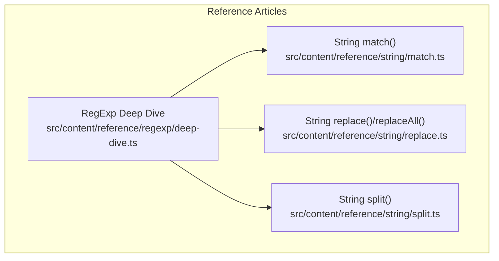
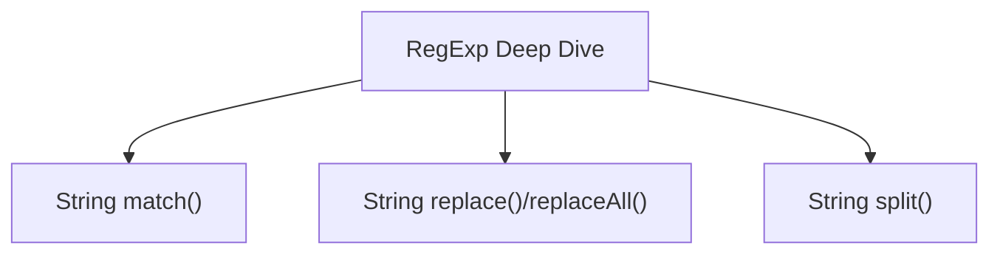
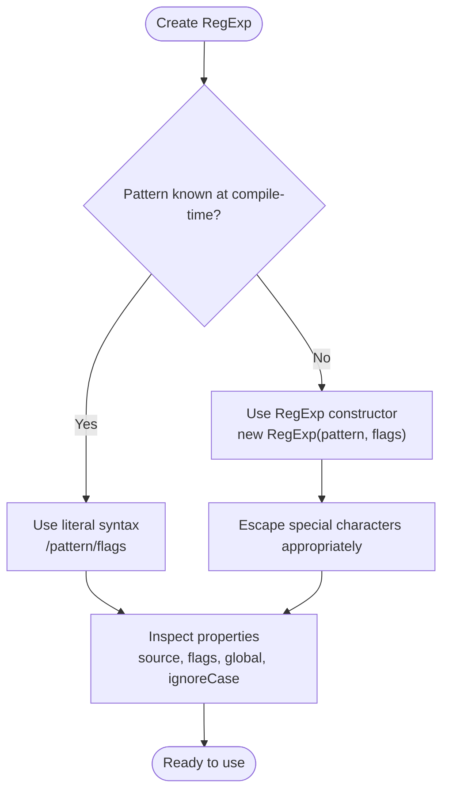
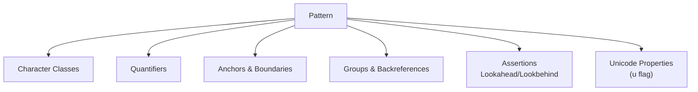
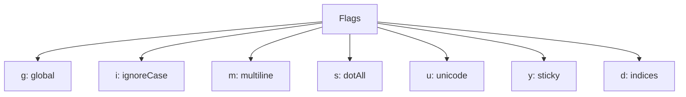
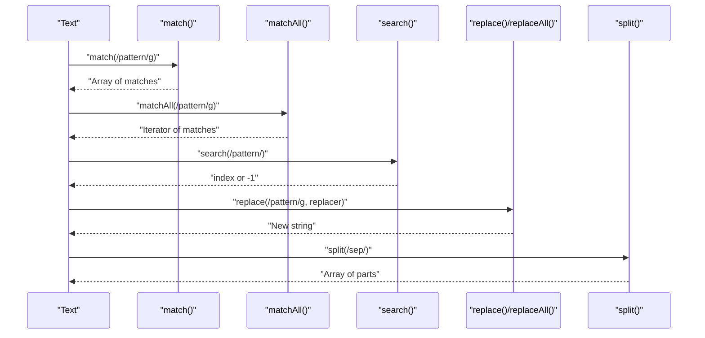
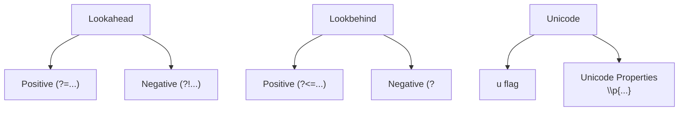
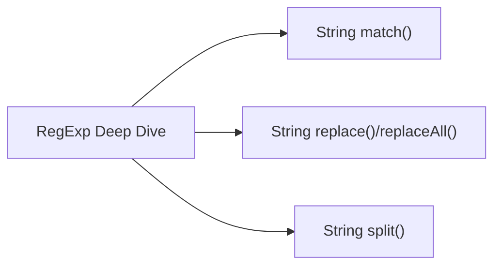
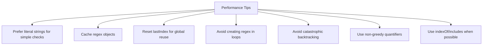

# Regular Expressions

<cite>
**Referenced Files in This Document**
- [deep-dive.ts](file://src/content/reference/regexp/deep-dive.ts)
- [match.ts](file://src/content/reference/string/match.ts)
- [replace.ts](file://src/content/reference/string/replace.ts)
- [split.ts](file://src/content/reference/string/split.ts)
</cite>

## Table of Contents
1. [Introduction](#introduction)
2. [Project Structure](#project-structure)
3. [Core Components](#core-components)
4. [Architecture Overview](#architecture-overview)
5. [Detailed Component Analysis](#detailed-component-analysis)
6. [Dependency Analysis](#dependency-analysis)
7. [Performance Considerations](#performance-considerations)
8. [Troubleshooting Guide](#troubleshooting-guide)
9. [Conclusion](#conclusion)
10. [Appendices](#appendices)

## Introduction
This document is a comprehensive guide to JavaScript regular expressions (RegExp) and pattern syntax. It covers how to construct regex objects using literal syntax and the RegExp constructor, how to use core methods like test(), exec(), match(), matchAll(), search(), replace(), replaceAll(), and split(), and how to apply flags (g, i, m, s, u, y, d). It also explains pattern syntax including character classes, quantifiers, anchors, groups, assertions, and Unicode properties. Practical examples demonstrate validation, parsing, extraction, and replacement tasks. Advanced topics include lookahead/lookbehind assertions and Unicode regex features. Finally, it provides performance guidance, pitfalls to avoid, and integration tips with JavaScript string methods.

## Project Structure
The repository organizes regex and string-related documentation as standalone reference articles. The regex deep dive article serves as the central resource for RegExp syntax and usage, while separate articles focus on string methods that integrate with regex.

**Diagram sources**
- [deep-dive.ts:1-447](file://src/content/reference/regexp/deep-dive.ts#L1-L447)
- [match.ts:1-55](file://src/content/reference/string/match.ts#L1-L55)
- [replace.ts:1-56](file://src/content/reference/string/replace.ts#L1-L56)
- [split.ts:1-57](file://src/content/reference/string/split.ts#L1-L57)

**Section sources**
- [deep-dive.ts:1-447](file://src/content/reference/regexp/deep-dive.ts#L1-L447)
- [match.ts:1-55](file://src/content/reference/string/match.ts#L1-L55)
- [replace.ts:1-56](file://src/content/reference/string/replace.ts#L1-L56)
- [split.ts:1-57](file://src/content/reference/string/split.ts#L1-L57)

## Core Components
- RegExp creation: literal syntax and RegExp constructor, including escaping special characters and inspecting properties.
- Pattern syntax: character classes, quantifiers, anchors, groups, assertions, and Unicode properties.
- Method usage: test(), exec(), match(), matchAll(), search(), replace(), replaceAll(), split().
- Flags: g, i, m, s, u, y, d and their effects on matching behavior.
- Practical applications: validation, parsing, extraction, and replacement.
- Performance and pitfalls: catastrophic backtracking, greedy vs non-greedy, caching, and common mistakes.

**Section sources**
- [deep-dive.ts:28-446](file://src/content/reference/regexp/deep-dive.ts#L28-L446)
- [match.ts:2-55](file://src/content/reference/string/match.ts#L2-L55)
- [replace.ts:2-56](file://src/content/reference/string/replace.ts#L2-L56)
- [split.ts:2-57](file://src/content/reference/string/split.ts#L2-L57)

## Architecture Overview
The regex ecosystem in this documentation is organized as a set of cohesive reference articles. The RegExp deep dive article acts as the central knowledge hub, while string method articles provide focused guidance on how to use regex with JavaScript’s built-in string APIs.

[No sources needed since this diagram shows conceptual architecture, not a direct code mapping]

## Detailed Component Analysis

### RegExp Creation and Constructor
- Literal syntax is preferred for static patterns; constructor syntax is useful for dynamic patterns and when building patterns from user input or configuration.
- Escaping special characters differs between literal and constructor forms; in constructors, backslashes must be doubled.
- RegExp instances expose properties such as source, flags, and booleans for flag presence.

**Section sources**
- [deep-dive.ts:28-49](file://src/content/reference/regexp/deep-dive.ts#L28-L49)

### Pattern Syntax: Character Classes, Quantifiers, Anchors, Groups, Assertions
- Character classes: shorthand for digits, word characters, whitespace, and negations; custom character sets and ranges.
- Quantifiers: greedy, non-greedy, and bounded repetition.
- Anchors: start, end, and word boundaries; multiline behavior with the m flag.
- Groups: capturing, named, and non-capturing; backreferences.
- Assertions: lookahead and lookbehind for context-sensitive matching.
- Unicode properties: using the u flag for proper Unicode handling.

**Section sources**
- [deep-dive.ts:51-172](file://src/content/reference/regexp/deep-dive.ts#L51-L172)

### Flags: g, i, m, s, u, y, d
- g: global matching; affects match(), matchAll(), replace(), replaceAll(), exec().
- i: case-insensitive matching.
- m: multiline anchors.
- s: dotAll allowing dot to match newlines.
- u: Unicode-aware matching.
- y: sticky matching at lastIndex.
- d: capture indices in match results.

**Section sources**
- [deep-dive.ts:174-206](file://src/content/reference/regexp/deep-dive.ts#L174-L206)

### String Methods with RegExp
- match(): returns all matches or detailed first match; global flag changes return shape.
- matchAll(): iterator of all matches with capture groups.
- search(): returns index of first match.
- replace()/replaceAll(): replace first/all matches; supports function replacement and special replacement patterns.
- split(): splits on a separator; regex capture groups include separators in results.

**Section sources**
- [deep-dive.ts:208-251](file://src/content/reference/regexp/deep-dive.ts#L208-L251)
- [match.ts:2-55](file://src/content/reference/string/match.ts#L2-L55)
- [replace.ts:2-56](file://src/content/reference/string/replace.ts#L2-L56)
- [split.ts:2-57](file://src/content/reference/string/split.ts#L2-L57)

### Practical Examples: Validation, Parsing, Extraction, Replacement
- Validation: email, password, URL, phone number, credit card, date, IP address.
- Parsing and extraction: hashtags, URLs, CSV-like fields, numbers with context, HTML removal, highlighting, case conversions, JSON key-value extraction.
- Replacement: templates, HTML escaping, trimming, formatting, abbreviations.

```mermaid
flowchart TD
V["Validation"] --> E["Email"]
V --> P["Password"]
V --> U["URL"]
V --> Ph["Phone"]
V --> C["Credit Card"]
V --> D["Date"]
V --> Ip["IP Address"]
PE["Parsing/Extraction"] --> H["Hashtags"]
PE --> Urls["URLs"]
PE --> Csv["CSV-like Fields"]
PE --> N["Numbers with Context"]
PE --> Html["Remove HTML Tags"]
PE --> Hl["Highlight Terms"]
PE --> Cc["Camel/Kebab Case"]
Re["Replacement"] --> Tpl["Template Substitution"]
Re --> Esc["HTML Escape"]
Re --> Trim["Trim Whitespace"]
Re --> Fmt["Format Numbers"]
Re --> Abv["Abbreviate Text"]
```

**Section sources**
- [deep-dive.ts:253-330](file://src/content/reference/regexp/deep-dive.ts#L253-L330)
- [match.ts:18-31](file://src/content/reference/string/match.ts#L18-L31)
- [replace.ts:25-37](file://src/content/reference/string/replace.ts#L25-L37)
- [split.ts:24-38](file://src/content/reference/string/split.ts#L24-L38)

### Advanced Topics: Lookaround Assertions and Unicode Features
- Lookahead and lookbehind: positive and negative assertions for context-sensitive matching.
- Unicode regex: Unicode-aware matching with the u flag and Unicode properties.

**Section sources**
- [deep-dive.ts:165-172](file://src/content/reference/regexp/deep-dive.ts#L165-L172)
- [deep-dive.ts:415-444](file://src/content/reference/regexp/deep-dive.ts#L415-L444)

## Dependency Analysis
The regex deep dive article is the central dependency for the other string method articles. It provides the foundational knowledge that informs how match(), replace(), replaceAll(), and split() behave with regex patterns.

**Diagram sources**
- [deep-dive.ts:1-447](file://src/content/reference/regexp/deep-dive.ts#L1-L447)
- [match.ts:1-55](file://src/content/reference/string/match.ts#L1-L55)
- [replace.ts:1-56](file://src/content/reference/string/replace.ts#L1-L56)
- [split.ts:1-57](file://src/content/reference/string/split.ts#L1-L57)

**Section sources**
- [deep-dive.ts:1-447](file://src/content/reference/regexp/deep-dive.ts#L1-L447)
- [match.ts:1-55](file://src/content/reference/string/match.ts#L1-L55)
- [replace.ts:1-56](file://src/content/reference/string/replace.ts#L1-L56)
- [split.ts:1-57](file://src/content/reference/string/split.ts#L1-L57)

## Performance Considerations
- Prefer literal strings for simple checks; regex overhead is unnecessary for constant patterns.
- Cache regex objects and reset lastIndex when reusing global regexes.
- Avoid creating regexes inside tight loops; precompile and reuse.
- Beware of catastrophic backtracking; simplify nested quantifiers and use possessive or atomic constructs when available.
- Use non-greedy quantifiers when appropriate to reduce backtracking.
- For simple substring checks, indexOf or includes may be faster than regex.

**Section sources**
- [deep-dive.ts:371-413](file://src/content/reference/regexp/deep-dive.ts#L371-L413)

## Troubleshooting Guide
Common mistakes and pitfalls:
- Forgetting to escape special characters in regex patterns.
- Expecting all matches without the global flag.
- Reusing a global regex without resetting lastIndex.
- Assuming case-sensitivity without the i flag.
- Overlooking that match() returns null when no matches are found.
- Misunderstanding how capture groups behave with the global flag.
- Complex regex readability and maintainability.

Debugging strategies:
- Start with simpler patterns and gradually add complexity.
- Use comments and named groups to improve readability.
- Test incrementally with small inputs.
- Validate performance with representative data sizes.

**Section sources**
- [deep-dive.ts:332-369](file://src/content/reference/regexp/deep-dive.ts#L332-L369)
- [match.ts:41-52](file://src/content/reference/string/match.ts#L41-L52)
- [replace.ts:39-53](file://src/content/reference/string/replace.ts#L39-L53)
- [split.ts:40-54](file://src/content/reference/string/split.ts#L40-L54)

## Conclusion
Regular expressions are a powerful tool for pattern matching and text processing in JavaScript. This guide consolidates the essential knowledge for constructing regex objects, mastering pattern syntax, and integrating with JavaScript’s string methods. By following best practices—caching regex objects, avoiding catastrophic backtracking, and using appropriate flags—you can build robust, maintainable, and efficient regex-driven solutions.

## Appendices

### Quick Reference: Methods and Flags
- Methods: test(), exec(), match(), matchAll(), search(), replace(), replaceAll(), split().
- Flags: g, i, m, s, u, y, d.

**Section sources**
- [deep-dive.ts:17-26](file://src/content/reference/regexp/deep-dive.ts#L17-L26)
- [deep-dive.ts:174-206](file://src/content/reference/regexp/deep-dive.ts#L174-L206)