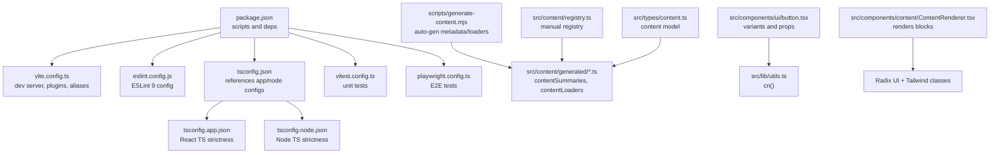
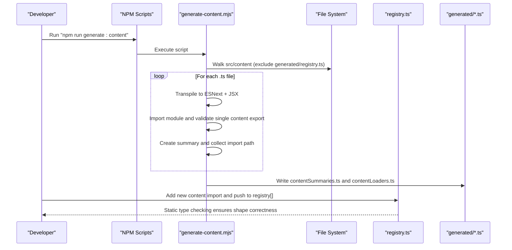
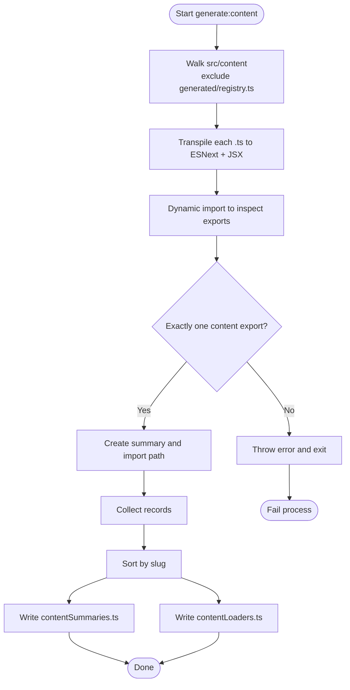
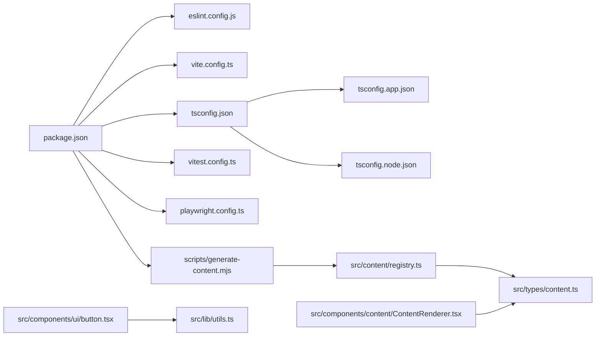

# Development Guidelines

<cite>
**Referenced Files in This Document**
- [eslint.config.js](file://eslint.config.js)
- [package.json](file://package.json)
- [vite.config.ts](file://vite.config.ts)
- [tsconfig.json](file://tsconfig.json)
- [tsconfig.app.json](file://tsconfig.app.json)
- [tsconfig.node.json](file://tsconfig.node.json)
- [vitest.config.ts](file://vitest.config.ts)
- [playwright.config.ts](file://playwright.config.ts)
- [src/content/registry.ts](file://src/content/registry.ts)
- [src/types/content.ts](file://src/types/content.ts)
- [src/components/ui/button.tsx](file://src/components/ui/button.tsx)
- [src/components/content/ContentRenderer.tsx](file://src/components/content/ContentRenderer.tsx)
- [src/lib/utils.ts](file://src/lib/utils.ts)
- [scripts/generate-content.mjs](file://scripts/generate-content.mjs)
- [src/tests/setup.ts](file://src/tests/setup.ts)
</cite>

## Table of Contents
1. [Introduction](#introduction)
2. [Project Structure](#project-structure)
3. [Core Components](#core-components)
4. [Architecture Overview](#architecture-overview)
5. [Detailed Component Analysis](#detailed-component-analysis)
6. [Dependency Analysis](#dependency-analysis)
7. [Performance Considerations](#performance-considerations)
8. [Troubleshooting Guide](#troubleshooting-guide)
9. [Conclusion](#conclusion)
10. [Appendices](#appendices)

## Introduction
This document defines the development guidelines for JSphere, focusing on code quality, consistency, and developer experience across the educational platform. It covers ESLint 9 configuration and TypeScript strictness, content authoring via the registry and generation pipeline, component development standards, testing requirements, contribution workflow, and extension practices that preserve architectural integrity and performance.

## Project Structure
JSphere is a Vite-powered React application with TypeScript. The structure emphasizes:
- Strong typing via layered tsconfig files
- Centralized ESLint configuration for linting and React Hooks rules
- A content-driven architecture with a registry and an automated generation pipeline
- UI primitives built with Radix UI and Tailwind, styled consistently through shared utilities

**Diagram sources**
- [package.json:1-99](file://package.json#L1-L99)
- [vite.config.ts:1-35](file://vite.config.ts#L1-L35)
- [eslint.config.js:1-27](file://eslint.config.js#L1-L27)
- [tsconfig.json:1-24](file://tsconfig.json#L1-L24)
- [tsconfig.app.json:1-36](file://tsconfig.app.json#L1-L36)
- [tsconfig.node.json:1-23](file://tsconfig.node.json#L1-L23)
- [vitest.config.ts:1-18](file://vitest.config.ts#L1-L18)
- [playwright.config.ts:1-25](file://playwright.config.ts#L1-L25)
- [scripts/generate-content.mjs:1-158](file://scripts/generate-content.mjs#L1-L158)
- [src/content/registry.ts:1-306](file://src/content/registry.ts#L1-L306)
- [src/types/content.ts:1-169](file://src/types/content.ts#L1-L169)
- [src/components/ui/button.tsx:1-48](file://src/components/ui/button.tsx#L1-L48)
- [src/lib/utils.ts:1-7](file://src/lib/utils.ts#L1-L7)
- [src/components/content/ContentRenderer.tsx:1-157](file://src/components/content/ContentRenderer.tsx#L1-L157)

**Section sources**
- [package.json:1-99](file://package.json#L1-L99)
- [vite.config.ts:1-35](file://vite.config.ts#L1-L35)
- [tsconfig.json:1-24](file://tsconfig.json#L1-L24)
- [tsconfig.app.json:1-36](file://tsconfig.app.json#L1-L36)
- [tsconfig.node.json:1-23](file://tsconfig.node.json#L1-L23)
- [eslint.config.js:1-27](file://eslint.config.js#L1-L27)
- [vitest.config.ts:1-18](file://vitest.config.ts#L1-L18)
- [playwright.config.ts:1-25](file://playwright.config.ts#L1-L25)

## Core Components
- ESLint 9 configuration enforces recommended rules for JavaScript and TypeScript, extends React Hooks recommended rules, and adds a refresh plugin rule. It ignores the dist folder and targets TypeScript/TSX files with browser globals.
- TypeScript strictness is enforced via layered configs:
  - Root tsconfig.json references app and node configs and enables strictNullChecks and unused checks.
  - tsconfig.app.json sets JSX transform, DOM libs, bundler module resolution, and strict mode for the app.
  - tsconfig.node.json configures Node-side TS settings for build tooling.
- Vite dev server runs on IPv6 host binding, disables overlay, deduplicates React packages, and aliases @ to src. Build splits vendor, UI, and query bundles.
- Testing:
  - Vitest runs unit tests under src/tests/unit with jsdom environment, global setup, and aliasing.
  - Playwright runs E2E tests under src/tests/e2e with a single Chromium project and a web server launched on dev.

**Section sources**
- [eslint.config.js:1-27](file://eslint.config.js#L1-L27)
- [tsconfig.json:1-24](file://tsconfig.json#L1-L24)
- [tsconfig.app.json:1-36](file://tsconfig.app.json#L1-L36)
- [tsconfig.node.json:1-23](file://tsconfig.node.json#L1-L23)
- [vite.config.ts:1-35](file://vite.config.ts#L1-L35)
- [vitest.config.ts:1-18](file://vitest.config.ts#L1-L18)
- [playwright.config.ts:1-25](file://playwright.config.ts#L1-L25)

## Architecture Overview
The platform follows a content-first architecture:
- Content entries are authored as TypeScript modules exporting a single content object.
- An automated generator scans content directories, validates a single content export per file, computes summaries, and generates:
  - contentSummaries for indexing and routing
  - contentLoaders for dynamic imports keyed by slug
- The registry consolidates all content entries for static analysis and navigation.
- UI components are built with Radix UI primitives and styled via shared utilities.

**Diagram sources**
- [package.json:6-21](file://package.json#L6-L21)
- [scripts/generate-content.mjs:1-158](file://scripts/generate-content.mjs#L1-L158)
- [src/content/registry.ts:1-306](file://src/content/registry.ts#L1-L306)

## Detailed Component Analysis

### ESLint and Coding Standards
- Enforced rules:
  - Recommended base and TypeScript recommended rules
  - React Hooks recommended rules
  - React Refresh rule with allowConstantExport enabled
  - Disables @typescript-eslint/no-unused-vars to avoid conflicts with unused params/locals in UI
- Global environment configured for browser globals.
- Ignores dist folder to prevent linting build artifacts.

Best practices:
- Keep unused variables/parameters intentionally named to satisfy unused checks; otherwise mark with underscore prefixes.
- Prefer functional components and hooks; follow React Hooks rules.
- Use consistent casing and naming conventions for props and handlers.

**Section sources**
- [eslint.config.js:1-27](file://eslint.config.js#L1-L27)

### TypeScript Configuration and Type Safety
- Strict null checks and unused locals/parameters are enabled across configs.
- Path aliases @/* mapped to src for clean imports.
- App config sets JSX transform, DOM libs, bundler module resolution, and strict mode.
- Node config aligns with build tooling and disables certain linter checks for non-application code.

Recommendations:
- Use explicit types for props and state; avoid implicit any.
- Leverage discriminated unions for content blocks and content types.
- Keep exported types in a central location (src/types) for reuse.

**Section sources**
- [tsconfig.json:1-24](file://tsconfig.json#L1-L24)
- [tsconfig.app.json:1-36](file://tsconfig.app.json#L1-L36)
- [tsconfig.node.json:1-23](file://tsconfig.node.json#L1-L23)

### Content Authoring Guidelines
- Content entry modules must export exactly one content object validated by a dedicated predicate.
- Each entry must include id, slug, contentType, title, and other metadata fields.
- The generator writes two outputs:
  - contentSummaries: a static array of summarized content for fast indexing.
  - contentLoaders: a record mapping slugs to dynamic import functions for lazy loading.
- The registry aggregates all content entries for static analysis and navigation.

Authoring checklist:
- Export a single named export representing the content entry.
- Define a unique id and slug; ensure slug uniqueness across the platform.
- Fill in metadata fields according to the content type’s interface.
- Add the new entry to the registry and commit both the content module and the generated files.

**Section sources**
- [scripts/generate-content.mjs:12-86](file://scripts/generate-content.mjs#L12-L86)
- [scripts/generate-content.mjs:115-146](file://scripts/generate-content.mjs#L115-L146)
- [src/content/registry.ts:1-306](file://src/content/registry.ts#L1-L306)
- [src/types/content.ts:1-169](file://src/types/content.ts#L1-L169)

### Component Development Guidelines
- Naming and composition:
  - Use PascalCase for component names and forwardRef when exposing refs.
  - Prefer variant-based design with class-variance-authority and a shared cn() utility for merging Tailwind classes.
- Prop interfaces:
  - Extend HTML attributes where appropriate (e.g., ButtonProps extends ButtonHTMLAttributes).
  - Use VariantProps for variant and size enums; provide defaults.
- Accessibility:
  - Use semantic HTML elements and proper heading hierarchy.
  - Ensure interactive controls expose accessible names and roles.
  - Respect focus management and keyboard navigation.
- Rendering content:
  - ContentRenderer groups blocks by h2 headings and renders sections with dividers.
  - Inline code parsing wraps backtick-delimited segments in code elements.
  - Lists, tables, headings, and callouts are handled with appropriate semantics and styles.

Example patterns:
- Button component demonstrates variants, sizes, and asChild composition.
- ContentRenderer shows block switching, section grouping, and responsive typography.

**Section sources**
- [src/components/ui/button.tsx:1-48](file://src/components/ui/button.tsx#L1-L48)
- [src/lib/utils.ts:1-7](file://src/lib/utils.ts#L1-L7)
- [src/components/content/ContentRenderer.tsx:1-157](file://src/components/content/ContentRenderer.tsx#L1-L157)

### Testing Requirements and Best Practices
- Unit tests:
  - Run with Vitest under src/tests/unit with jsdom environment.
  - Global setup includes localStorage mock and matchMedia polyfill; beforeEach clears storage and afterEach resets DOM head/title.
  - Use setup files to configure environment and globals.
- E2E tests:
  - Playwright tests run under src/tests/e2e with a Chromium project.
  - Web server is launched on dev prior to test execution; traces retained on failure.
- Coverage:
  - Include unit tests for components, hooks, and utilities.
  - Add integration tests for content rendering and navigation flows.
  - Maintain deterministic mocks for external APIs and storage.

**Section sources**
- [vitest.config.ts:1-18](file://vitest.config.ts#L1-L18)
- [playwright.config.ts:1-25](file://playwright.config.ts#L1-L25)
- [src/tests/setup.ts:1-56](file://src/tests/setup.ts#L1-L56)

### Contribution Workflow
- Branching and commits:
  - Use conventional commits for clear, machine-readable histories.
  - Keep commits small and focused; reference related issues where applicable.
- Pull requests:
  - Include a concise description, links to related content or tests, and screenshots for UI changes.
  - Request reviews from maintainers; address feedback promptly.
- Pre-commit and pre-push:
  - Run linting and tests locally before pushing.
  - Ensure the content generation script is executed to update generated files.

**Section sources**
- [package.json:6-21](file://package.json#L6-L21)

### Content Generation Pipeline
- Trigger:
  - Executed via npm scripts before dev, build, and test commands.
- Process:
  - Traverse src/content excluding generated and registry.ts.
  - Transpile each file to ESNext with JSX and dynamically import to inspect exports.
  - Validate a single content export per file; compute a summary; collect import paths.
  - Sort by slug and write contentSummaries and contentLoaders.
- Outputs:
  - contentSummaries.ts: static array of summaries for indexing.
  - contentLoaders.ts: record mapping slugs to loader functions for dynamic imports.

**Diagram sources**
- [scripts/generate-content.mjs:23-40](file://scripts/generate-content.mjs#L23-L40)
- [scripts/generate-content.mjs:42-53](file://scripts/generate-content.mjs#L42-L53)
- [scripts/generate-content.mjs:78-86](file://scripts/generate-content.mjs#L78-L86)
- [scripts/generate-content.mjs:115-146](file://scripts/generate-content.mjs#L115-L146)

**Section sources**
- [scripts/generate-content.mjs:1-158](file://scripts/generate-content.mjs#L1-L158)
- [package.json:6-21](file://package.json#L6-L21)

### Review Process and Quality Gates
- Code quality gates:
  - ESLint must pass without warnings; TypeScript strictness enforced.
  - Generated content must be committed alongside content changes.
- Content accuracy:
  - Registry updates must reflect new entries; type-safe content shapes verified by TypeScript.
  - ContentRenderer tests ensure rendering stability across block types.
- Performance:
  - Vite build splits vendor/UI/query bundles; keep bundle sizes reasonable.
  - Avoid unnecessary re-renders; leverage memoization and stable references.

**Section sources**
- [eslint.config.js:1-27](file://eslint.config.js#L1-L27)
- [tsconfig.app.json:16-26](file://tsconfig.app.json#L16-L26)
- [vite.config.ts:22-33](file://vite.config.ts#L22-L33)
- [src/content/registry.ts:161-305](file://src/content/registry.ts#L161-L305)

### Extending the Platform
- New content:
  - Add a new content module under src/content with a single named export.
  - Update the registry to include the new import and push to the registry array.
  - Re-run the generation script; commit both the new module and generated files.
- New UI components:
  - Follow variant and size patterns; use cn() for class merging.
  - Provide clear prop interfaces and default variants.
  - Add stories/tests where appropriate.
- New features:
  - Introduce new routes/pages under src/features and integrate with navigation.
  - Add tests for new hooks/utilities and ensure they are covered in CI.

**Section sources**
- [src/content/registry.ts:1-306](file://src/content/registry.ts#L1-L306)
- [src/components/ui/button.tsx:33-47](file://src/components/ui/button.tsx#L33-L47)
- [scripts/generate-content.mjs:93-152](file://scripts/generate-content.mjs#L93-L152)

## Dependency Analysis
- Toolchain:
  - Vite dev server with React SWC plugin and path aliases.
  - ESLint 9 with TypeScript and React Hooks plugins.
  - Vitest with jsdom; Playwright for E2E.
- Runtime:
  - React 18, Radix UI primitives, Tailwind utilities, and shared cn() utility.
- Build-time:
  - Content generation script produces metadata and loaders for dynamic routing.

**Diagram sources**
- [package.json:1-99](file://package.json#L1-L99)
- [eslint.config.js:1-27](file://eslint.config.js#L1-L27)
- [vite.config.ts:1-35](file://vite.config.ts#L1-L35)
- [tsconfig.json:1-24](file://tsconfig.json#L1-L24)
- [tsconfig.app.json:1-36](file://tsconfig.app.json#L1-L36)
- [tsconfig.node.json:1-23](file://tsconfig.node.json#L1-L23)
- [vitest.config.ts:1-18](file://vitest.config.ts#L1-L18)
- [playwright.config.ts:1-25](file://playwright.config.ts#L1-L25)
- [scripts/generate-content.mjs:1-158](file://scripts/generate-content.mjs#L1-L158)
- [src/content/registry.ts:1-306](file://src/content/registry.ts#L1-L306)
- [src/types/content.ts:1-169](file://src/types/content.ts#L1-L169)
- [src/components/ui/button.tsx:1-48](file://src/components/ui/button.tsx#L1-L48)
- [src/lib/utils.ts:1-7](file://src/lib/utils.ts#L1-L7)
- [src/components/content/ContentRenderer.tsx:1-157](file://src/components/content/ContentRenderer.tsx#L1-L157)

**Section sources**
- [package.json:1-99](file://package.json#L1-L99)

## Performance Considerations
- Bundle splitting:
  - Vendor, UI, and query chunks reduce initial load; keep chunk boundaries logical.
- Source maps:
  - Enabled in development for debugging; disabled in production builds.
- Rendering:
  - Memoize heavy computations and components; avoid unnecessary re-renders.
  - Use stable references for event handlers and callbacks.

**Section sources**
- [vite.config.ts:22-33](file://vite.config.ts#L22-L33)

## Troubleshooting Guide
- Lint failures:
  - Fix unused variable/parameter violations or adjust rule if truly intentional.
  - Ensure React Hooks rules are satisfied; separate concerns into custom hooks.
- Test failures:
  - Verify jsdom environment and setup file are applied.
  - Mock localStorage and matchMedia as needed; clear state between tests.
- Content generation errors:
  - Ensure each content module exports exactly one content object.
  - Confirm unique slugs and valid metadata fields.
  - Re-run the generation script after adding new content.

**Section sources**
- [eslint.config.js:20-24](file://eslint.config.js#L20-L24)
- [vitest.config.ts:7-12](file://vitest.config.ts#L7-L12)
- [src/tests/setup.ts:1-56](file://src/tests/setup.ts#L1-L56)
- [scripts/generate-content.mjs:78-86](file://scripts/generate-content.mjs#L78-L86)

## Conclusion
These guidelines establish a consistent, type-safe, and maintainable development process for JSphere. By adhering to ESLint and TypeScript strictness, following the content generation pipeline, and applying component and testing best practices, contributors can deliver high-quality educational content and features while preserving performance and developer experience.

## Appendices
- Quick reference:
  - Run lint: npm run lint
  - Generate content: npm run generate:content
  - Unit tests: npm run test
  - Watch tests: npm run test:watch
  - E2E tests: npm run test:e2e
  - Dev server: npm run dev
  - Build: npm run build

[No sources needed since this section provides general guidance]