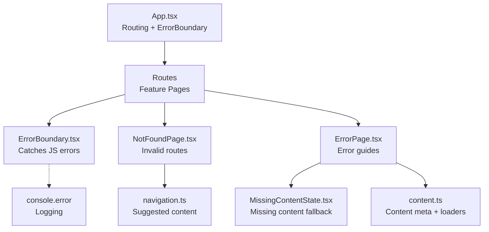
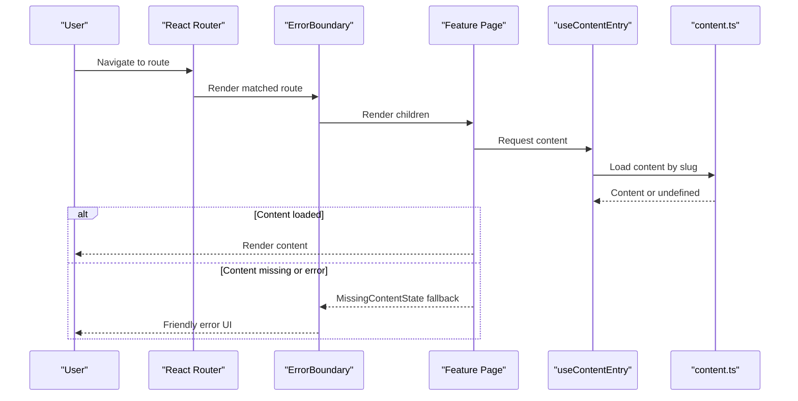
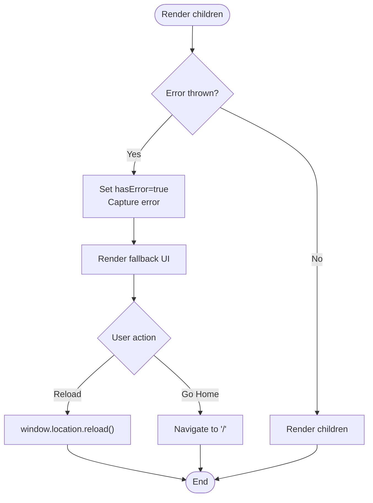
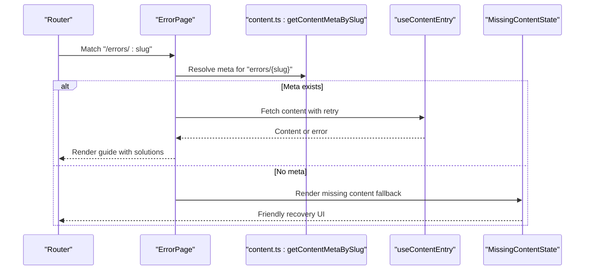
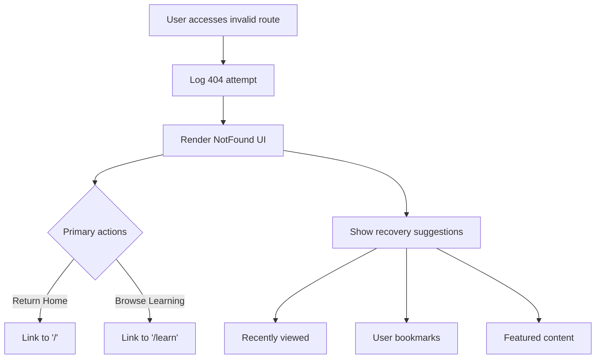
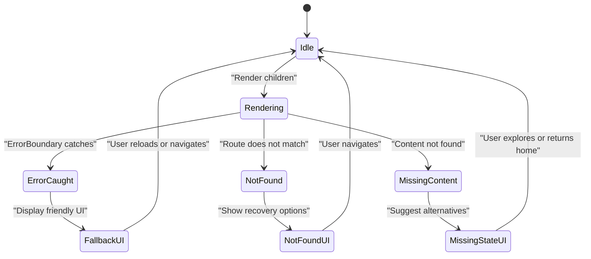
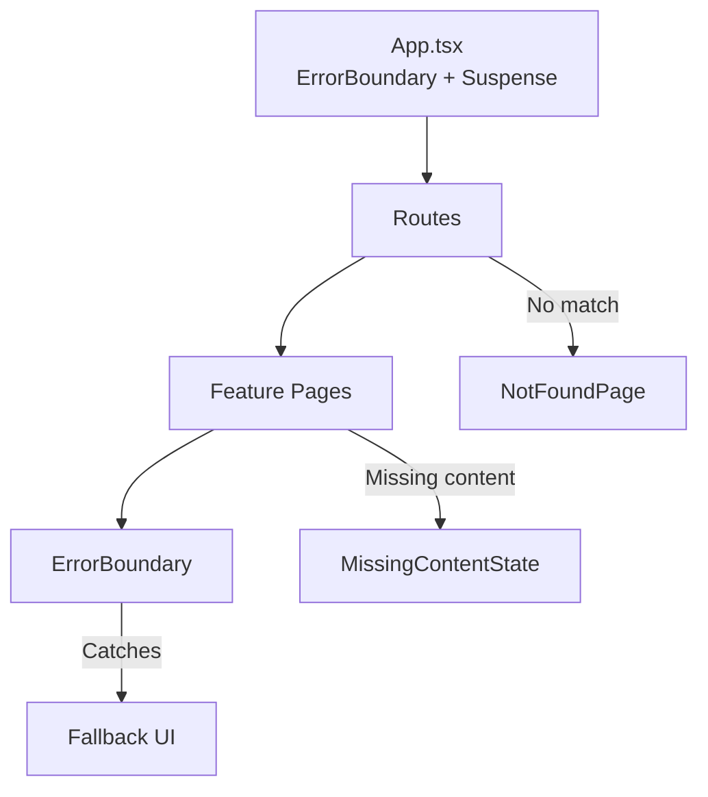
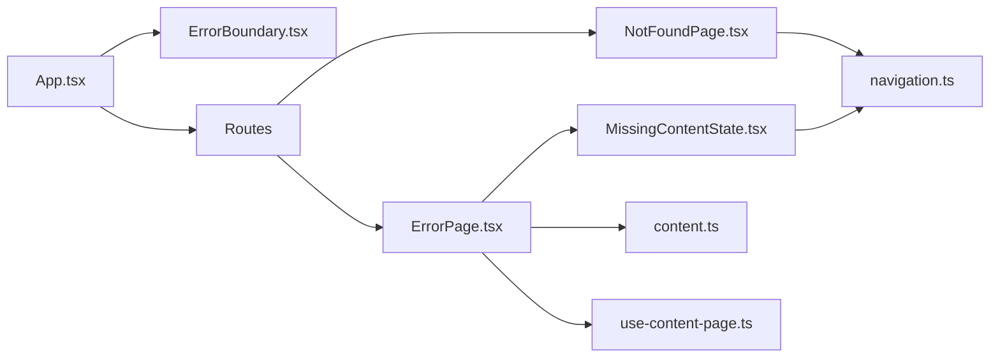

# Error Handling and Boundary Management

<cite>
**Referenced Files in This Document**
- [App.tsx](file://src/App.tsx)
- [ErrorBoundary.tsx](file://src/components/error-boundary/ErrorBoundary.tsx)
- [ErrorPage.tsx](file://src/features/errors/ErrorPage.tsx)
- [NotFoundPage.tsx](file://src/features/not-found/NotFoundPage.tsx)
- [MissingContentState.tsx](file://src/components/content/MissingContentState.tsx)
- [content.ts](file://src/lib/content.ts)
- [navigation.ts](file://src/lib/navigation.ts)
- [use-content-page.ts](file://src/hooks/use-content-page.ts)
- [error-handling.ts](file://src/content/learn/fundamentals/error-handling.ts)
- [error-fallback.ts](file://src/content/recipes/error-fallback.ts)
- [async-errors.ts](file://src/content/errors/async.ts)
</cite>

## Table of Contents
1. [Introduction](#introduction)
2. [Project Structure](#project-structure)
3. [Core Components](#core-components)
4. [Architecture Overview](#architecture-overview)
5. [Detailed Component Analysis](#detailed-component-analysis)
6. [Dependency Analysis](#dependency-analysis)
7. [Performance Considerations](#performance-considerations)
8. [Troubleshooting Guide](#troubleshooting-guide)
9. [Conclusion](#conclusion)

## Introduction
This document explains the error handling and boundary management system that keeps users informed and guided when unexpected issues occur. It covers:
- The ErrorBoundary component that catches JavaScript rendering errors and displays a friendly fallback UI
- The ErrorPage feature that presents structured error guides with categorization and recovery steps
- The NotFoundPage component for invalid routes and missing pages
- The MissingContentState component for graceful handling of missing content with recovery options
- Error reporting and logging strategies that capture actionable details while respecting privacy
- Error categorization distinguishing recoverable versus critical issues
- Implementation details for error state management, fallback rendering, and lifecycle integration

## Project Structure
The error handling system spans several layers:
- Application bootstrap and routing in App.tsx
- React ErrorBoundary wrapping the routing layer
- Feature pages for error guides and not-found scenarios
- Content loading and navigation utilities supporting graceful degradation
- Hooks and libraries enabling resilient content retrieval and navigation

**Diagram sources**
- [App.tsx:70-91](file://src/App.tsx#L70-L91)
- [ErrorBoundary.tsx:16-63](file://src/components/error-boundary/ErrorBoundary.tsx#L16-L63)
- [NotFoundPage.tsx:9-118](file://src/features/not-found/NotFoundPage.tsx#L9-L118)
- [ErrorPage.tsx:19-93](file://src/features/errors/ErrorPage.tsx#L19-L93)
- [MissingContentState.tsx:15-89](file://src/components/content/MissingContentState.tsx#L15-L89)
- [content.ts:30-42](file://src/lib/content.ts#L30-L42)
- [navigation.ts:67-69](file://src/lib/navigation.ts#L67-L69)

**Section sources**
- [App.tsx:40-100](file://src/App.tsx#L40-L100)

## Core Components
- ErrorBoundary: Catches JavaScript rendering errors in React subtrees and renders a friendly fallback with reload/home actions.
- ErrorPage: Renders error guides with categorized error types, summaries, and recovery steps, falling back to MissingContentState when content is unavailable.
- NotFoundPage: Handles invalid routes with contextual recovery options and suggested content.
- MissingContentState: Provides graceful fallbacks for missing content with navigation aids and recent/recommended suggestions.
- Content utilities and hooks: Support content loading, navigation, and resilience via retry and caching.

**Section sources**
- [ErrorBoundary.tsx:16-63](file://src/components/error-boundary/ErrorBoundary.tsx#L16-L63)
- [ErrorPage.tsx:19-93](file://src/features/errors/ErrorPage.tsx#L19-L93)
- [NotFoundPage.tsx:9-118](file://src/features/not-found/NotFoundPage.tsx#L9-L118)
- [MissingContentState.tsx:15-89](file://src/components/content/MissingContentState.tsx#L15-L89)
- [content.ts:30-42](file://src/lib/content.ts#L30-L42)
- [use-content-page.ts:7-23](file://src/hooks/use-content-page.ts#L7-L23)

## Architecture Overview
The system follows a layered approach:
- Top-level ErrorBoundary wraps the entire routing layer to prevent full-page crashes.
- Feature pages render content conditionally, switching to fallbacks when data is missing or loading fails.
- Navigation and content utilities provide suggestions and breadcrumbs to help users recover.
- Logging and reporting are integrated at boundaries and content load points.

**Diagram sources**
- [App.tsx:70-91](file://src/App.tsx#L70-L91)
- [ErrorPage.tsx:23-37](file://src/features/errors/ErrorPage.tsx#L23-L37)
- [MissingContentState.tsx:15-89](file://src/components/content/MissingContentState.tsx#L15-L89)
- [use-content-page.ts:7-23](file://src/hooks/use-content-page.ts#L7-L23)
- [content.ts:38-42](file://src/lib/content.ts#L38-L42)

## Detailed Component Analysis

### ErrorBoundary Component
Purpose:
- Catches JavaScript errors thrown during React rendering and lifecycle methods.
- Displays a friendly UI with a reload action and navigation to home.

Key behaviors:
- State transitions on error via static getDerivedStateFromError.
- Logs error details to the console via componentDidCatch.
- Provides a default fallback UI or accepts a custom fallback prop.
- Offers immediate recovery actions: reload the page or navigate home.

**Diagram sources**
- [ErrorBoundary.tsx:19-29](file://src/components/error-boundary/ErrorBoundary.tsx#L19-L29)
- [ErrorBoundary.tsx:31-63](file://src/components/error-boundary/ErrorBoundary.tsx#L31-L63)

**Section sources**
- [ErrorBoundary.tsx:16-63](file://src/components/error-boundary/ErrorBoundary.tsx#L16-L63)

### ErrorPage Feature Component
Purpose:
- Presents curated error guides with categorization and recovery steps.
- Gracefully handles missing content by delegating to MissingContentState.

Highlights:
- Builds a content slug under the "errors" pillar and loads metadata.
- Uses content hooks to track reading progress and loading states.
- Displays error type badges, solutions summary, and related topics.
- Falls back to MissingContentState when metadata is not found.

**Diagram sources**
- [ErrorPage.tsx:20-37](file://src/features/errors/ErrorPage.tsx#L20-L37)
- [ErrorPage.tsx:47-90](file://src/features/errors/ErrorPage.tsx#L47-L90)
- [content.ts:30-32](file://src/lib/content.ts#L30-L32)
- [use-content-page.ts:7-23](file://src/hooks/use-content-page.ts#L7-L23)
- [MissingContentState.tsx:15-89](file://src/components/content/MissingContentState.tsx#L15-L89)

**Section sources**
- [ErrorPage.tsx:19-93](file://src/features/errors/ErrorPage.tsx#L19-L93)
- [content.ts:30-32](file://src/lib/content.ts#L30-L32)
- [use-content-page.ts:7-23](file://src/hooks/use-content-page.ts#L7-L23)

### NotFoundPage Component
Purpose:
- Handles invalid routes with a clear, friendly UI.
- Suggests recovery options using recent views, bookmarks, and featured content.

Key aspects:
- Captures the attempted path and logs it for diagnostics.
- Provides primary actions: return home and browse learning.
- Displays three recovery zones: recently viewed, bookmarks, and featured content.

**Diagram sources**
- [NotFoundPage.tsx:9-118](file://src/features/not-found/NotFoundPage.tsx#L9-L118)
- [navigation.ts:67-69](file://src/lib/navigation.ts#L67-L69)

**Section sources**
- [NotFoundPage.tsx:9-118](file://src/features/not-found/NotFoundPage.tsx#L9-L118)

### MissingContentState Component
Purpose:
- Provides graceful fallbacks when content is missing or unavailable.
- Offers navigation to the pillar landing, back home, and suggested content.

Highlights:
- Accepts pillar, title, and message props for context.
- Retrieves recent content and pillar suggestions for recovery.
- Renders a concise set of recovery actions and suggestion lists.

**Section sources**
- [MissingContentState.tsx:15-89](file://src/components/content/MissingContentState.tsx#L15-L89)

### Error Reporting and Privacy-Friendly Logging
- ErrorBoundary logs captured errors to the console for diagnostics.
- Content loading hooks log failures and surface user-friendly errors.
- Best practices emphasize structured logging with context while avoiding sensitive data.

Implementation notes:
- Use console.error for development diagnostics.
- For production, integrate with an error tracking service (e.g., Sentry) following privacy guidelines.
- Avoid logging personally identifiable information (PII) and sensitive fields.

**Section sources**
- [ErrorBoundary.tsx:23-25](file://src/components/error-boundary/ErrorBoundary.tsx#L23-L25)
- [use-content-page.ts:14-16](file://src/hooks/use-content-page.ts#L14-L16)
- [error-handling.ts:601-636](file://src/content/learn/fundamentals/error-handling.ts#L601-L636)

### Error Categorization and Recovery Strategy
- ErrorPage displays errorType metadata to categorize guides (e.g., runtime errors, debugging strategies).
- Solutions summaries provide actionable recovery steps aligned with the error type.
- MissingContentState and NotFoundPage offer distinct recovery pathways:
  - MissingContentState: Explore pillar, back home, and suggested content.
  - NotFoundPage: Return home, browse learning, and recovery suggestions.

**Section sources**
- [ErrorPage.tsx:61-69](file://src/features/errors/ErrorPage.tsx#L61-L69)
- [ErrorPage.tsx:73-85](file://src/features/errors/ErrorPage.tsx#L73-L85)
- [MissingContentState.tsx:32-45](file://src/components/content/MissingContentState.tsx#L32-L45)
- [NotFoundPage.tsx:44-57](file://src/features/not-found/NotFoundPage.tsx#L44-L57)

### Error State Management and Fallback Rendering
- ErrorBoundary manages internal state to trigger fallback UI rendering.
- ErrorPage composes multiple fallbacks: MissingContentState, skeletons, and navigation helpers.
- NotFoundPage centralizes 404 handling with logging and recovery options.

**Diagram sources**
- [ErrorBoundary.tsx:19-21](file://src/components/error-boundary/ErrorBoundary.tsx#L19-L21)
- [ErrorPage.tsx:26-37](file://src/features/errors/ErrorPage.tsx#L26-L37)
- [NotFoundPage.tsx:22-24](file://src/features/not-found/NotFoundPage.tsx#L22-L24)

**Section sources**
- [ErrorBoundary.tsx:16-63](file://src/components/error-boundary/ErrorBoundary.tsx#L16-L63)
- [ErrorPage.tsx:19-93](file://src/features/errors/ErrorPage.tsx#L19-L93)
- [NotFoundPage.tsx:9-118](file://src/features/not-found/NotFoundPage.tsx#L9-L118)

### Error Boundary Propagation and Lifecycle Integration
- App.tsx wraps the entire routing tree with ErrorBoundary to act as a global safety net.
- Suspense provides skeleton fallbacks during route lazy-loading.
- ErrorBoundary intercepts rendering errors; NotFoundPage handles unmatched routes; MissingContentState handles content-level failures.

**Diagram sources**
- [App.tsx:70-91](file://src/App.tsx#L70-L91)
- [ErrorBoundary.tsx:16-63](file://src/components/error-boundary/ErrorBoundary.tsx#L16-L63)
- [NotFoundPage.tsx:9-118](file://src/features/not-found/NotFoundPage.tsx#L9-L118)
- [MissingContentState.tsx:15-89](file://src/components/content/MissingContentState.tsx#L15-L89)

**Section sources**
- [App.tsx:40-100](file://src/App.tsx#L40-L100)

## Dependency Analysis
- App.tsx depends on ErrorBoundary for global error coverage and on lazy-loaded feature pages for content.
- ErrorPage depends on content utilities and hooks for metadata and content retrieval.
- NotFoundPage relies on navigation utilities for suggestions and user library integration.
- MissingContentState depends on navigation utilities for suggestions and user library for recent content.

**Diagram sources**
- [App.tsx:70-91](file://src/App.tsx#L70-L91)
- [ErrorPage.tsx:19-93](file://src/features/errors/ErrorPage.tsx#L19-L93)
- [NotFoundPage.tsx:9-118](file://src/features/not-found/NotFoundPage.tsx#L9-L118)
- [MissingContentState.tsx:15-89](file://src/components/content/MissingContentState.tsx#L15-L89)
- [content.ts:30-42](file://src/lib/content.ts#L30-L42)
- [navigation.ts:67-69](file://src/lib/navigation.ts#L67-L69)
- [use-content-page.ts:7-23](file://src/hooks/use-content-page.ts#L7-L23)

**Section sources**
- [App.tsx:40-100](file://src/App.tsx#L40-L100)
- [content.ts:30-42](file://src/lib/content.ts#L30-L42)
- [navigation.ts:67-69](file://src/lib/navigation.ts#L67-L69)
- [use-content-page.ts:7-23](file://src/hooks/use-content-page.ts#L7-L23)

## Performance Considerations
- Prefer lightweight fallback UIs to minimize paint and layout thrash.
- Use Suspense and lazy loading to keep the main thread responsive.
- Cache content metadata and leverage retry policies to reduce repeated failures.
- Avoid heavy computations inside ErrorBoundary render to prevent cascading delays.

## Troubleshooting Guide
Common scenarios and remedies:
- Rendering errors crash the page:
  - Verify ErrorBoundary is wrapping the routing layer.
  - Check console logs for captured errors and stack traces.
- Content fails to load:
  - Confirm slug resolution via content utilities.
  - Inspect hook retry behavior and staleTime configuration.
- Missing content or guides:
  - Use MissingContentState to guide users to related or featured content.
- Invalid routes:
  - Ensure NotFoundPage is matched as the wildcard route.
  - Review navigation utilities for suggested content and recent views.

**Section sources**
- [ErrorBoundary.tsx:23-25](file://src/components/error-boundary/ErrorBoundary.tsx#L23-L25)
- [use-content-page.ts:14-16](file://src/hooks/use-content-page.ts#L14-L16)
- [content.ts:30-32](file://src/lib/content.ts#L30-L32)
- [NotFoundPage.tsx:22-24](file://src/features/not-found/NotFoundPage.tsx#L22-L24)

## Conclusion
The error handling and boundary management system combines React ErrorBoundary, structured error guides, and graceful fallbacks to deliver a resilient user experience. By categorizing errors, providing actionable recovery options, and integrating privacy-conscious logging, the system maintains usability even under unexpected conditions. The layered architecture ensures that rendering errors are contained, content failures are surfaced with alternatives, and invalid routes are met with helpful navigation.