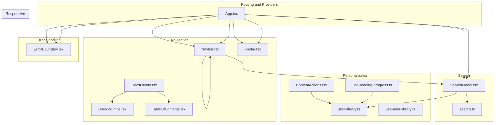
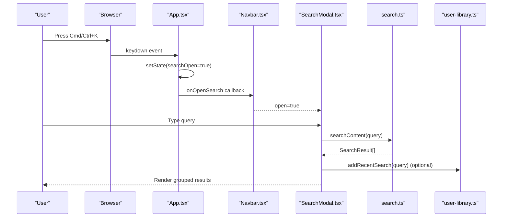
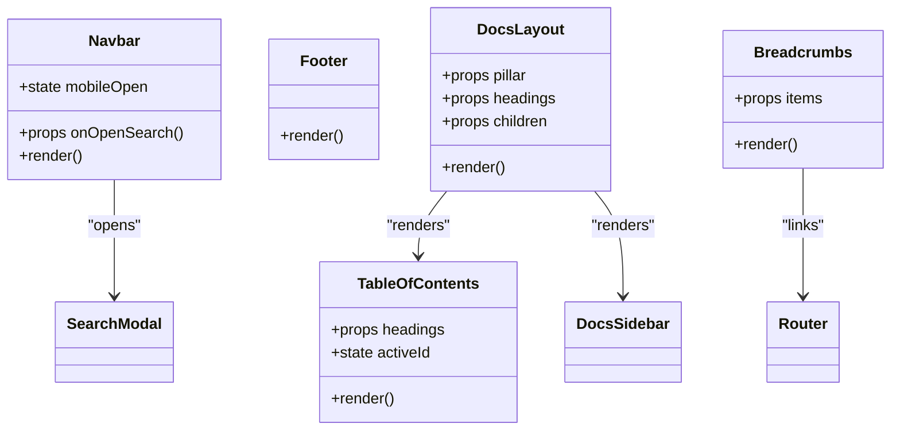
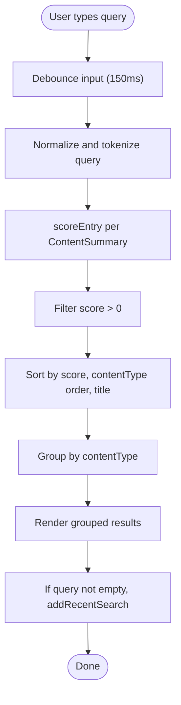
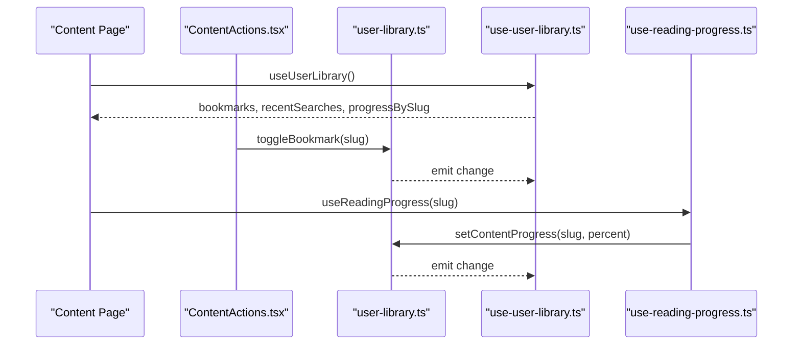
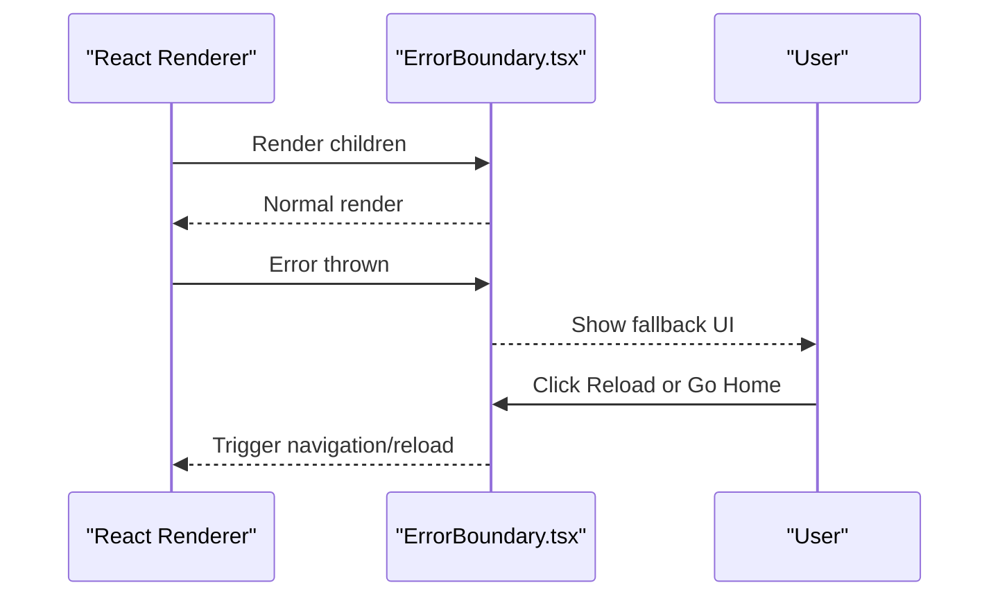
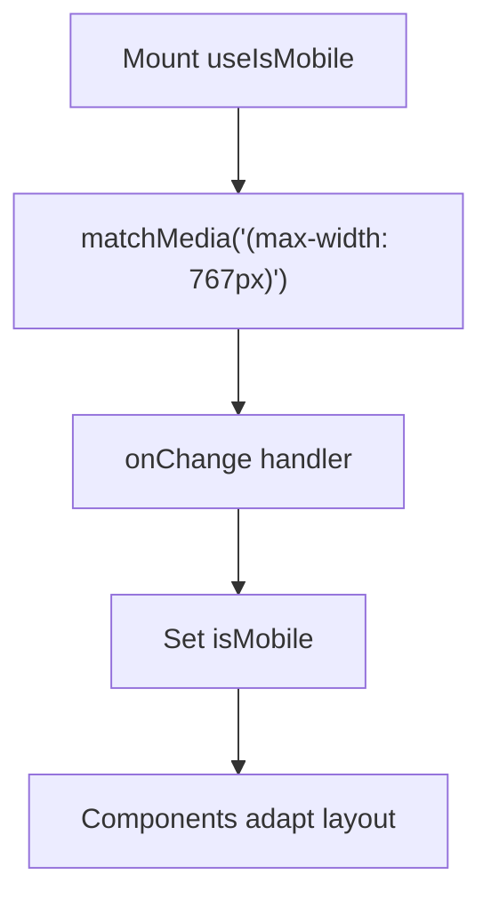
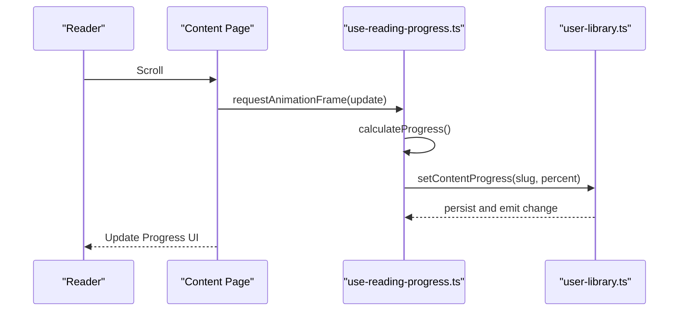
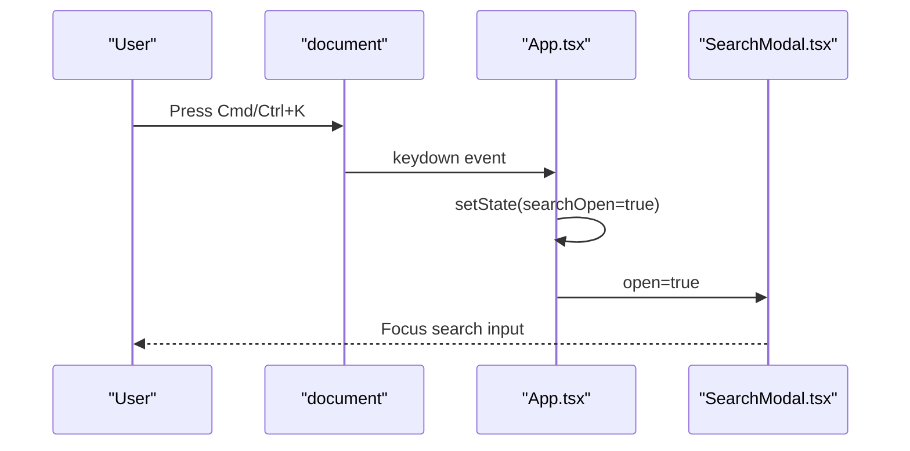
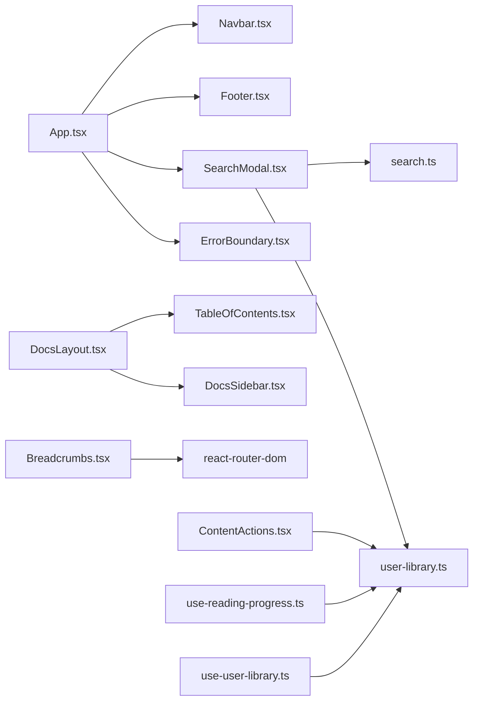

# Feature Implementation

<cite>
**Referenced Files in This Document**
- [App.tsx](file://src/App.tsx)
- [Navbar.tsx](file://src/components/navigation/Navbar.tsx)
- [Footer.tsx](file://src/components/navigation/Footer.tsx)
- [DocsLayout.tsx](file://src/components/layout/DocsLayout.tsx)
- [Breadcrumbs.tsx](file://src/components/navigation/Breadcrumbs.tsx)
- [TableOfContents.tsx](file://src/components/navigation/TableOfContents.tsx)
- [SearchModal.tsx](file://src/components/search/SearchModal.tsx)
- [search.ts](file://src/lib/search.ts)
- [user-library.ts](file://src/lib/user-library.ts)
- [use-user-library.ts](file://src/hooks/use-user-library.ts)
- [use-reading-progress.ts](file://src/hooks/use-reading-progress.ts)
- [ContentActions.tsx](file://src/components/content/ContentActions.tsx)
- [ErrorBoundary.tsx](file://src/components/error-boundary/ErrorBoundary.tsx)
- [navigation.ts](file://src/lib/navigation.ts)
- [use-mobile.tsx](file://src/hooks/use-mobile.tsx)
</cite>

## Table of Contents
1. [Introduction](#introduction)
2. [Project Structure](#project-structure)
3. [Core Components](#core-components)
4. [Architecture Overview](#architecture-overview)
5. [Detailed Component Analysis](#detailed-component-analysis)
6. [Dependency Analysis](#dependency-analysis)
7. [Performance Considerations](#performance-considerations)
8. [Troubleshooting Guide](#troubleshooting-guide)
9. [Conclusion](#conclusion)

## Introduction
This document explains the feature implementation that delivers JSphere’s educational experience. It focuses on navigation and layout (Navbar, Footer, DocsLayout, Breadcrumbs, Table of Contents), the intelligent search system (fuzzy matching, weighted scoring, keyboard shortcuts), personalization and user library (bookmarks, recently viewed, continue reading, search history), error handling (ErrorBoundary), responsive design, reading progress tracking, content actions, and how these features integrate to support the learning journey.

## Project Structure
JSphere organizes features by domain and layer:
- Navigation and layout live under components/navigation and components/layout.
- Search and personalization logic live under components/search and lib/.
- Hooks under src/hooks coordinate state subscriptions and effects.
- Routing and global providers are wired in App.tsx.

**Diagram sources**
- [App.tsx:40-100](file://src/App.tsx#L40-L100)
- [Navbar.tsx:24-183](file://src/components/navigation/Navbar.tsx#L24-L183)
- [Footer.tsx:39-91](file://src/components/navigation/Footer.tsx#L39-L91)
- [DocsLayout.tsx:12-26](file://src/components/layout/DocsLayout.tsx#L12-L26)
- [Breadcrumbs.tsx:13-34](file://src/components/navigation/Breadcrumbs.tsx#L13-L34)
- [TableOfContents.tsx:9-68](file://src/components/navigation/TableOfContents.tsx#L9-L68)
- [SearchModal.tsx:41-154](file://src/components/search/SearchModal.tsx#L41-L154)
- [search.ts:90-127](file://src/lib/search.ts#L90-L127)
- [user-library.ts:103-213](file://src/lib/user-library.ts#L103-L213)
- [use-user-library.ts:4-7](file://src/hooks/use-user-library.ts#L4-L7)
- [use-reading-progress.ts:12-52](file://src/hooks/use-reading-progress.ts#L12-L52)
- [ContentActions.tsx:13-41](file://src/components/content/ContentActions.tsx#L13-L41)
- [ErrorBoundary.tsx:16-65](file://src/components/error-boundary/ErrorBoundary.tsx#L16-L65)

**Section sources**
- [App.tsx:40-100](file://src/App.tsx#L40-L100)

## Core Components
- Navigation and Layout: Navbar provides top-level discovery and search trigger; Footer offers secondary navigation; DocsLayout structures content with sidebar, main content, and Table of Contents; Breadcrumbs guide contextual location.
- Intelligent Search: SearchModal integrates Command UI, debounced queries, grouping, and suggestions; search.ts implements fuzzy scoring and weighted text matching.
- Personalization and Library: user-library.ts persists bookmarks, recent views, recent searches, and reading progress; hooks expose reactive state; ContentActions and use-reading-progress surface user-centric controls.
- Error Handling: ErrorBoundary renders graceful fallbacks and recovery actions.
- Responsive Design: use-mobile.tsx detects breakpoints; Navbar and DocsLayout adapt layouts across device sizes.

**Section sources**
- [Navbar.tsx:24-183](file://src/components/navigation/Navbar.tsx#L24-L183)
- [Footer.tsx:39-91](file://src/components/navigation/Footer.tsx#L39-L91)
- [DocsLayout.tsx:12-26](file://src/components/layout/DocsLayout.tsx#L12-L26)
- [Breadcrumbs.tsx:13-34](file://src/components/navigation/Breadcrumbs.tsx#L13-L34)
- [TableOfContents.tsx:9-68](file://src/components/navigation/TableOfContents.tsx#L9-L68)
- [SearchModal.tsx:41-154](file://src/components/search/SearchModal.tsx#L41-L154)
- [search.ts:90-127](file://src/lib/search.ts#L90-L127)
- [user-library.ts:103-213](file://src/lib/user-library.ts#L103-L213)
- [use-user-library.ts:4-7](file://src/hooks/use-user-library.ts#L4-L7)
- [use-reading-progress.ts:12-52](file://src/hooks/use-reading-progress.ts#L12-L52)
- [ContentActions.tsx:13-41](file://src/components/content/ContentActions.tsx#L13-L41)
- [ErrorBoundary.tsx:16-65](file://src/components/error-boundary/ErrorBoundary.tsx#L16-L65)
- [use-mobile.tsx:5-19](file://src/hooks/use-mobile.tsx#L5-L19)

## Architecture Overview
The app wires routing, providers, and feature components. The Navbar triggers the SearchModal via a keyboard shortcut. DocsLayout composes sidebar, main content, and Table of Contents. SearchModal delegates to search.ts and user-library.ts. Content pages consume use-reading-progress and ContentActions to track and present reading progress and bookmarks.

**Diagram sources**
- [App.tsx:44-53](file://src/App.tsx#L44-L53)
- [Navbar.tsx:102-116](file://src/components/navigation/Navbar.tsx#L102-L116)
- [SearchModal.tsx:47-60](file://src/components/search/SearchModal.tsx#L47-L60)
- [search.ts:111-113](file://src/lib/search.ts#L111-L113)
- [user-library.ts:160-170](file://src/lib/user-library.ts#L160-L170)

## Detailed Component Analysis

### Navigation and Layout System
- Navbar
  - Renders logo, desktop dropdown navigation, theme toggle, and search trigger.
  - Provides mobile Sheet with collapsible sections for top-level navigation.
  - Integrates keyboard shortcut to open search.
- Footer
  - Grid of categorized links for Learn, Reference, Build, and Explore.
- DocsLayout
  - Composes DocsSidebar, main content area, and TableOfContents.
- Breadcrumbs
  - Renders hierarchical path with home and current page.
- Table of Contents
  - IntersectionObserver tracks active heading; sticky layout updates active link.

**Diagram sources**
- [Navbar.tsx:24-183](file://src/components/navigation/Navbar.tsx#L24-L183)
- [Footer.tsx:39-91](file://src/components/navigation/Footer.tsx#L39-L91)
- [DocsLayout.tsx:12-26](file://src/components/layout/DocsLayout.tsx#L12-L26)
- [Breadcrumbs.tsx:13-34](file://src/components/navigation/Breadcrumbs.tsx#L13-L34)
- [TableOfContents.tsx:9-68](file://src/components/navigation/TableOfContents.tsx#L9-L68)

**Section sources**
- [Navbar.tsx:24-183](file://src/components/navigation/Navbar.tsx#L24-L183)
- [Footer.tsx:39-91](file://src/components/navigation/Footer.tsx#L39-L91)
- [DocsLayout.tsx:12-26](file://src/components/layout/DocsLayout.tsx#L12-L26)
- [Breadcrumbs.tsx:13-34](file://src/components/navigation/Breadcrumbs.tsx#L13-L34)
- [TableOfContents.tsx:9-68](file://src/components/navigation/TableOfContents.tsx#L9-L68)

### Intelligent Search System
- Debounced Query Execution
  - SearchModal debounces input to reduce recomputation.
- Fuzzy Matching and Weighted Scoring
  - search.ts computes scores across title, aliases, summary, description, keywords, tags, category, and token prefixes; favors exact/prefix matches and subsequence fuzzy matches.
- Grouping and Suggestions
  - Results grouped by contentType; popular suggestions surfaced when query is empty.
- Personalization Integration
  - Adds recent searches to user-library when a query is submitted.

**Diagram sources**
- [SearchModal.tsx:42-60](file://src/components/search/SearchModal.tsx#L42-L60)
- [search.ts:90-109](file://src/lib/search.ts#L90-L109)
- [search.ts:119-126](file://src/lib/search.ts#L119-L126)
- [user-library.ts:160-170](file://src/lib/user-library.ts#L160-L170)

**Section sources**
- [SearchModal.tsx:41-154](file://src/components/search/SearchModal.tsx#L41-L154)
- [search.ts:90-127](file://src/lib/search.ts#L90-L127)
- [user-library.ts:160-170](file://src/lib/user-library.ts#L160-L170)

### Personalization and User Library
- State Management
  - user-library.ts persists to localStorage, sanitizes inputs, enforces caps on recent collections, and emits change events.
  - use-user-library.ts exposes a sync subscription hook for reactive reads.
- Bookmarks
  - ContentActions toggles bookmark state via user-library.toggleBookmark.
- Recently Viewed Items
  - recordRecentView updates ordered list capped at 12.
- Continue Reading
  - use-reading-progress calculates scroll-based progress, stores non-decreasing values, and persists via setContentProgress.
- Search History
  - addRecentSearch appends sanitized queries capped at 8.

**Diagram sources**
- [ContentActions.tsx:13-41](file://src/components/content/ContentActions.tsx#L13-L41)
- [user-library.ts:138-204](file://src/lib/user-library.ts#L138-L204)
- [use-user-library.ts:4-7](file://src/hooks/use-user-library.ts#L4-L7)
- [use-reading-progress.ts:12-52](file://src/hooks/use-reading-progress.ts#L12-L52)

**Section sources**
- [user-library.ts:8-213](file://src/lib/user-library.ts#L8-L213)
- [use-user-library.ts:4-7](file://src/hooks/use-user-library.ts#L4-L7)
- [ContentActions.tsx:13-41](file://src/components/content/ContentActions.tsx#L13-L41)
- [use-reading-progress.ts:12-52](file://src/hooks/use-reading-progress.ts#L12-L52)

### Error Handling System
- ErrorBoundary
  - Catches rendering errors, logs, and presents a friendly message with reload and home navigation options.

**Diagram sources**
- [ErrorBoundary.tsx:16-65](file://src/components/error-boundary/ErrorBoundary.tsx#L16-L65)

**Section sources**
- [ErrorBoundary.tsx:16-65](file://src/components/error-boundary/ErrorBoundary.tsx#L16-L65)

### Responsive Design System
- Breakpoint Detection
  - use-mobile.tsx listens to media query changes and reports mobile state.
- Adaptive Layouts
  - Navbar switches between desktop dropdowns and collapsible mobile sheet.
  - DocsLayout adjusts spacing and TOC visibility across breakpoints.

**Diagram sources**
- [use-mobile.tsx:5-19](file://src/hooks/use-mobile.tsx#L5-L19)
- [Navbar.tsx:120-178](file://src/components/navigation/Navbar.tsx#L120-L178)
- [DocsLayout.tsx:12-26](file://src/components/layout/DocsLayout.tsx#L12-L26)

**Section sources**
- [use-mobile.tsx:5-19](file://src/hooks/use-mobile.tsx#L5-L19)
- [Navbar.tsx:120-178](file://src/components/navigation/Navbar.tsx#L120-L178)
- [DocsLayout.tsx:12-26](file://src/components/layout/DocsLayout.tsx#L12-L26)

### Reading Progress Tracking and Content Actions
- Reading Progress
  - use-reading-progress computes percentage from scroll position, throttles updates with requestAnimationFrame, and persists non-decreasing progress.
- Content Actions
  - Displays progress bar and bookmark toggle; integrates with user-library for persistence.

**Diagram sources**
- [use-reading-progress.ts:12-52](file://src/hooks/use-reading-progress.ts#L12-L52)
- [user-library.ts:172-204](file://src/lib/user-library.ts#L172-L204)
- [ContentActions.tsx:13-41](file://src/components/content/ContentActions.tsx#L13-L41)

**Section sources**
- [use-reading-progress.ts:12-52](file://src/hooks/use-reading-progress.ts#L12-L52)
- [ContentActions.tsx:13-41](file://src/components/content/ContentActions.tsx#L13-L41)
- [user-library.ts:172-204](file://src/lib/user-library.ts#L172-L204)

### Keyboard Shortcuts and Global Integration
- Global Shortcut
  - App.tsx registers Cmd/Ctrl+K to toggle SearchModal.
- Search Modal
  - Uses Command UI with debounced search and suggestion rendering.

**Diagram sources**
- [App.tsx:44-53](file://src/App.tsx#L44-L53)
- [Navbar.tsx:102-116](file://src/components/navigation/Navbar.tsx#L102-L116)
- [SearchModal.tsx:66-71](file://src/components/search/SearchModal.tsx#L66-L71)

**Section sources**
- [App.tsx:44-53](file://src/App.tsx#L44-L53)
- [Navbar.tsx:102-116](file://src/components/navigation/Navbar.tsx#L102-L116)
- [SearchModal.tsx:66-71](file://src/components/search/SearchModal.tsx#L66-L71)

## Dependency Analysis
- Component Coupling
  - App.tsx orchestrates routing, providers, and global shortcuts; it composes Navbar, SearchModal, ErrorBoundary, and Footer.
  - DocsLayout depends on TableOfContents and DocsSidebar; Breadcrumbs is used by content pages.
  - SearchModal depends on search.ts and user-library.ts.
  - ContentActions and use-reading-progress depend on user-library.ts and use-user-library.ts.
- External Dependencies
  - react-router-dom for routing and navigation.
  - @tanstack/react-query for caching and data fetching.
  - lucide-react for icons.
  - react-helmet-async for SEO metadata.

**Diagram sources**
- [App.tsx:40-100](file://src/App.tsx#L40-L100)
- [SearchModal.tsx:41-154](file://src/components/search/SearchModal.tsx#L41-L154)
- [search.ts:90-127](file://src/lib/search.ts#L90-L127)
- [user-library.ts:103-213](file://src/lib/user-library.ts#L103-L213)
- [DocsLayout.tsx:12-26](file://src/components/layout/DocsLayout.tsx#L12-L26)
- [TableOfContents.tsx:9-68](file://src/components/navigation/TableOfContents.tsx#L9-L68)
- [Breadcrumbs.tsx:13-34](file://src/components/navigation/Breadcrumbs.tsx#L13-L34)
- [ContentActions.tsx:13-41](file://src/components/content/ContentActions.tsx#L13-L41)
- [use-reading-progress.ts:12-52](file://src/hooks/use-reading-progress.ts#L12-L52)
- [use-user-library.ts:4-7](file://src/hooks/use-user-library.ts#L4-L7)

**Section sources**
- [App.tsx:40-100](file://src/App.tsx#L40-L100)
- [search.ts:90-127](file://src/lib/search.ts#L90-L127)
- [user-library.ts:103-213](file://src/lib/user-library.ts#L103-L213)
- [DocsLayout.tsx:12-26](file://src/components/layout/DocsLayout.tsx#L12-L26)
- [TableOfContents.tsx:9-68](file://src/components/navigation/TableOfContents.tsx#L9-L68)
- [Breadcrumbs.tsx:13-34](file://src/components/navigation/Breadcrumbs.tsx#L13-L34)
- [ContentActions.tsx:13-41](file://src/components/content/ContentActions.tsx#L13-L41)
- [use-reading-progress.ts:12-52](file://src/hooks/use-reading-progress.ts#L12-L52)
- [use-user-library.ts:4-7](file://src/hooks/use-user-library.ts#L4-L7)

## Performance Considerations
- Debounced Search
  - SearchModal uses a 150ms debounce to reduce re-computation during typing.
- Efficient Scoring
  - search.ts short-circuits on empty inputs and filters out zero-score results before sorting.
- IntersectionObserver for TOC
  - TableOfContents uses a single observer per heading list and disconnects on unmount.
- Non-decreasing Progress
  - use-reading-progress ensures progress never decreases, reducing churn in persisted state.
- RequestAnimationFrame Throttling
  - use-reading-progress throttles scroll updates to avoid layout thrash.
- LocalStorage Caching
  - user-library.ts caches deserialized state and emits targeted change events to minimize re-renders.

[No sources needed since this section provides general guidance]

## Troubleshooting Guide
- Search Results Not Updating
  - Verify debounced query is not empty and that searchContent returns non-empty results.
  - Confirm groupResultsByType is invoked after searchContent.
- Bookmark Toggle Not Persisting
  - Ensure toggleBookmark is called with a valid slug and localStorage is writable.
- Reading Progress Not Saving
  - Check that setContentProgress receives a numeric percent and that use-reading-progress is enabled.
- Error Fallback Appears Unexpectedly
  - Review ErrorBoundary behavior and confirm child components render without throwing.
- Mobile Navigation Issues
  - Confirm useIsMobile reflects the expected breakpoint and that Sheet and Collapsible are properly wired.

**Section sources**
- [search.ts:90-109](file://src/lib/search.ts#L90-L109)
- [user-library.ts:138-204](file://src/lib/user-library.ts#L138-L204)
- [use-reading-progress.ts:12-52](file://src/hooks/use-reading-progress.ts#L12-L52)
- [ErrorBoundary.tsx:16-65](file://src/components/error-boundary/ErrorBoundary.tsx#L16-L65)
- [use-mobile.tsx:5-19](file://src/hooks/use-mobile.tsx#L5-L19)

## Conclusion
JSphere’s educational experience emerges from tightly integrated navigation, intelligent search, personalization, and robust error handling. The Navbar and DocsLayout scaffold exploration; SearchModal accelerates discovery with fuzzy matching and suggestions; user-library and hooks enable personalized learning journeys; ErrorBoundary ensures resilience; and responsive hooks tailor the UI across devices. Together, these features form a cohesive system that supports efficient, enjoyable, and reliable learning.