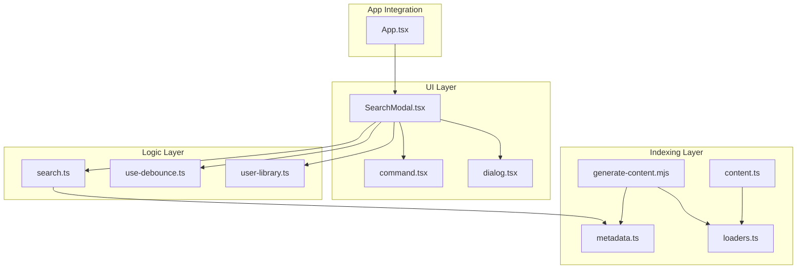
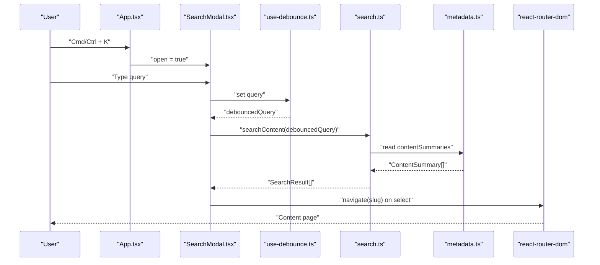
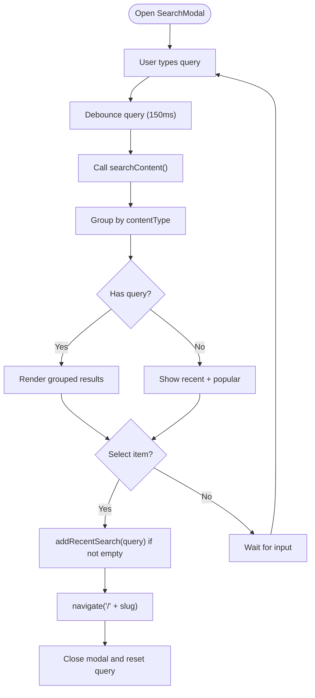
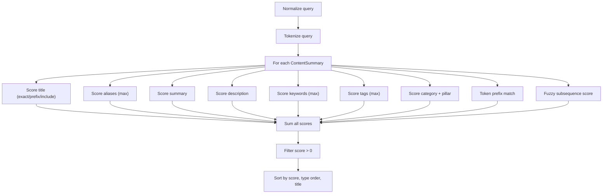
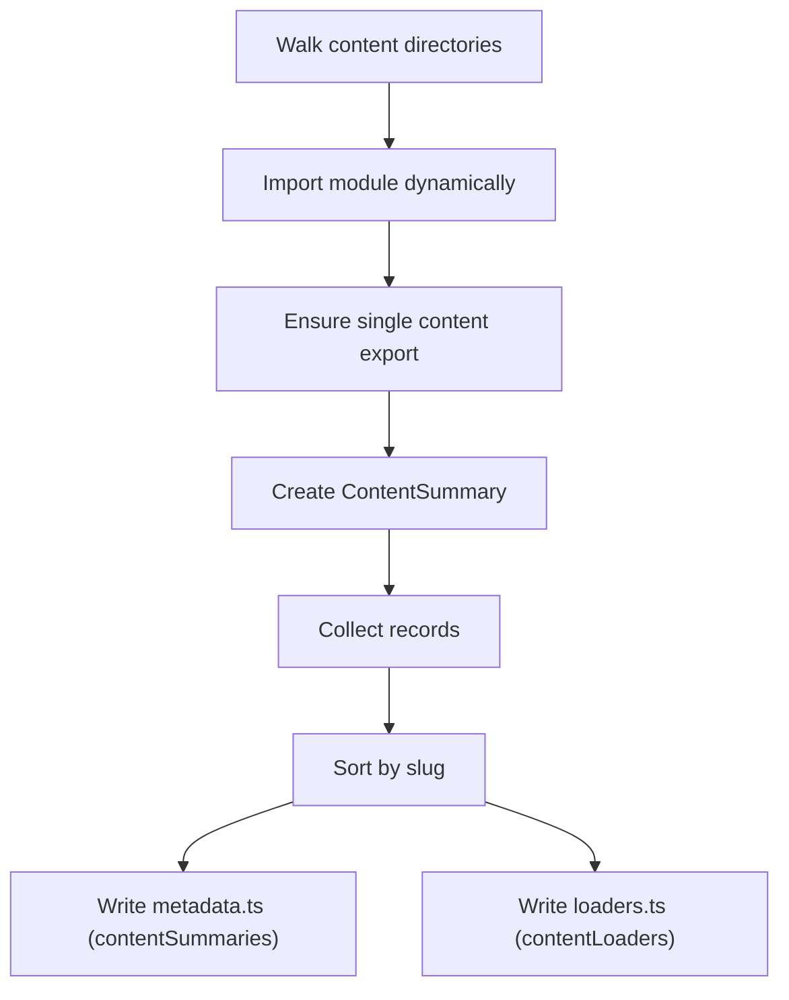
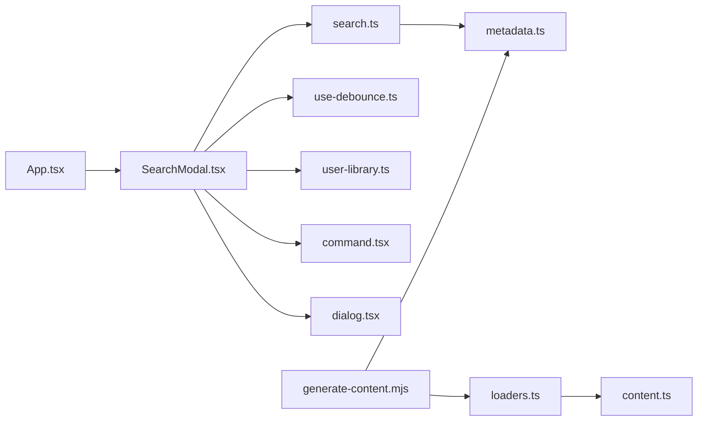

# Intelligent Search System

<cite>
**Referenced Files in This Document**
- [App.tsx](file://src/App.tsx)
- [SearchModal.tsx](file://src/components/search/SearchModal.tsx)
- [search.ts](file://src/lib/search.ts)
- [use-debounce.ts](file://src/hooks/use-debounce.ts)
- [user-library.ts](file://src/lib/user-library.ts)
- [generate-content.mjs](file://scripts/generate-content.mjs)
- [metadata.ts](file://src/content/generated/metadata.ts)
- [loaders.ts](file://src/content/generated/loaders.ts)
- [content.ts](file://src/lib/content.ts)
- [command.tsx](file://src/components/ui/command.tsx)
- [dialog.tsx](file://src/components/ui/dialog.tsx)
- [search.test.ts](file://src/tests/unit/search.test.ts)
</cite>

## Table of Contents
1. [Introduction](#introduction)
2. [Project Structure](#project-structure)
3. [Core Components](#core-components)
4. [Architecture Overview](#architecture-overview)
5. [Detailed Component Analysis](#detailed-component-analysis)
6. [Dependency Analysis](#dependency-analysis)
7. [Performance Considerations](#performance-considerations)
8. [Troubleshooting Guide](#troubleshooting-guide)
9. [Conclusion](#conclusion)
10. [Appendices](#appendices)

## Introduction
This document explains the intelligent search system powering JSphere’s content discovery. It covers the SearchModal component, keyboard shortcuts (Cmd/Ctrl + K), input handling, result display, and the advanced fuzzy search algorithm with weighted scoring. It documents the search indexing pipeline that builds searchable content from markdown files, the suggestions system, ranking algorithm, search history, and integration with the content loading system. Accessibility features, keyboard navigation, and mobile responsiveness are addressed alongside performance optimizations such as debounced input and result grouping.

## Project Structure
The search system spans UI components, search logic, content indexing, and user data persistence:
- UI: SearchModal integrates with command and dialog UI primitives.
- Logic: search.ts implements fuzzy scoring and ranking.
- Indexing: scripts/generate-content.mjs produces metadata and loaders.
- Persistence: user-library.ts stores recent searches and other user data.
- Routing: App.tsx wires keyboard shortcut to open the modal.

**Diagram sources**
- [App.tsx:40-103](file://src/App.tsx#L40-L103)
- [SearchModal.tsx:1-154](file://src/components/search/SearchModal.tsx#L1-L154)
- [search.ts:1-127](file://src/lib/search.ts#L1-L127)
- [use-debounce.ts:1-35](file://src/hooks/use-debounce.ts#L1-L35)
- [user-library.ts:1-213](file://src/lib/user-library.ts#L1-L213)
- [generate-content.mjs:93-158](file://scripts/generate-content.mjs#L93-L158)
- [metadata.ts:7-2747](file://src/content/generated/metadata.ts#L7-L2747)
- [loaders.ts:9-97](file://src/content/generated/loaders.ts#L9-L97)
- [content.ts:1-126](file://src/lib/content.ts#L1-L126)

**Section sources**
- [App.tsx:40-103](file://src/App.tsx#L40-L103)
- [SearchModal.tsx:1-154](file://src/components/search/SearchModal.tsx#L1-L154)
- [search.ts:1-127](file://src/lib/search.ts#L1-L127)
- [use-debounce.ts:1-35](file://src/hooks/use-debounce.ts#L1-L35)
- [user-library.ts:1-213](file://src/lib/user-library.ts#L1-L213)
- [generate-content.mjs:93-158](file://scripts/generate-content.mjs#L93-L158)
- [metadata.ts:7-2747](file://src/content/generated/metadata.ts#L7-L2747)
- [loaders.ts:9-97](file://src/content/generated/loaders.ts#L9-L97)
- [content.ts:1-126](file://src/lib/content.ts#L1-L126)

## Core Components
- SearchModal: Renders the command palette UI, handles input, debounced search, suggestions, recent searches, and navigation to content pages.
- search.ts: Implements normalization, tokenization, fuzzy subsequence scoring, weighted text matching, and sorting by type and title.
- generate-content.mjs: Scans content files, extracts summaries, and generates metadata and loaders for client-side content access.
- user-library.ts: Manages recent searches, sanitizes and persists user data, and exposes subscription events.
- App.tsx: Registers Cmd/Ctrl + K shortcut to toggle the modal.

**Section sources**
- [SearchModal.tsx:41-154](file://src/components/search/SearchModal.tsx#L41-L154)
- [search.ts:90-127](file://src/lib/search.ts#L90-L127)
- [generate-content.mjs:93-158](file://scripts/generate-content.mjs#L93-L158)
- [user-library.ts:160-170](file://src/lib/user-library.ts#L160-L170)
- [App.tsx:43-53](file://src/App.tsx#L43-L53)

## Architecture Overview
The search pipeline:
- Keyboard shortcut opens SearchModal.
- SearchModal debounces input and triggers search.ts to compute scores against contentSummaries.
- Results are grouped by content type and rendered via command UI.
- Selecting a result navigates to the content page using the slug.
- Recent searches are persisted via user-library.ts and shown as suggestions.

**Diagram sources**
- [App.tsx:43-53](file://src/App.tsx#L43-L53)
- [SearchModal.tsx:41-154](file://src/components/search/SearchModal.tsx#L41-L154)
- [use-debounce.ts:20-34](file://src/hooks/use-debounce.ts#L20-L34)
- [search.ts:111-113](file://src/lib/search.ts#L111-L113)
- [metadata.ts:7-2747](file://src/content/generated/metadata.ts#L7-L2747)

## Detailed Component Analysis

### SearchModal Component
Responsibilities:
- Debounce user input to reduce computation.
- Compute search results and group by content type.
- Render suggestions (popular content) and recent searches.
- Persist recent searches and navigate on selection.

Key behaviors:
- Debounced query via use-debounce with 150ms delay.
- Grouped results by contentType for segmented UI.
- Icons and labels mapped per content type.
- On selection, adds recent search (if applicable) and navigates to the content page.

**Diagram sources**
- [SearchModal.tsx:41-154](file://src/components/search/SearchModal.tsx#L41-L154)
- [use-debounce.ts:20-34](file://src/hooks/use-debounce.ts#L20-L34)
- [user-library.ts:160-170](file://src/lib/user-library.ts#L160-L170)

**Section sources**
- [SearchModal.tsx:41-154](file://src/components/search/SearchModal.tsx#L41-L154)
- [command.tsx:38-56](file://src/components/ui/command.tsx#L38-L56)
- [dialog.tsx:30-51](file://src/components/ui/dialog.tsx#L30-L51)

### Advanced Fuzzy Search Algorithm
Scoring pipeline:
- Normalization: lowercase, remove special characters, collapse whitespace.
- Tokenization: split normalized text into tokens.
- Exact/prefix/include scoring: weights applied to title, aliases, summary, description, keywords, tags, category, and pillar.
- Token prefix matching: bonus for matching all query tokens.
- Fuzzy subsequence scoring: character-level match with adjacency bonus and length penalty.
- Final score summed and filtered to positive values.
- Sorting: by score descending, then by contentType precedence, then by title.

Ranking factors:
- Title exact match > prefix > include.
- Aliases and keywords/tags contribute progressively less.
- Category and pillar boosts improve recall.
- Token prefix matching rewards multi-term queries.
- Fuzzy subsequence captures near matches.

**Diagram sources**
- [search.ts:21-109](file://src/lib/search.ts#L21-L109)

**Section sources**
- [search.ts:90-127](file://src/lib/search.ts#L90-L127)
- [search.test.ts:28-58](file://src/tests/unit/search.test.ts#L28-L58)

### Search Indexing Pipeline
Indexing process:
- Script walks content directories, imports each module, validates a single content export, and constructs a summary.
- Generates contentSummaries and contentLoaders.
- contentSummaries feed the search index.
- contentLoaders power dynamic content loading by slug.

**Diagram sources**
- [generate-content.mjs:23-158](file://scripts/generate-content.mjs#L23-L158)
- [metadata.ts:7-2747](file://src/content/generated/metadata.ts#L7-L2747)
- [loaders.ts:9-97](file://src/content/generated/loaders.ts#L9-L97)

**Section sources**
- [generate-content.mjs:93-158](file://scripts/generate-content.mjs#L93-L158)
- [metadata.ts:7-2747](file://src/content/generated/metadata.ts#L7-L2747)
- [loaders.ts:9-97](file://src/content/generated/loaders.ts#L9-L97)

### Search Suggestions and Popular Content
- Suggestions: top entries marked as featured.
- Recent searches: persisted user queries shown above popular suggestions.

**Section sources**
- [search.ts:115-117](file://src/lib/search.ts#L115-L117)
- [user-library.ts:160-170](file://src/lib/user-library.ts#L160-L170)
- [SearchModal.tsx:106-147](file://src/components/search/SearchModal.tsx#L106-L147)

### Search Result Ranking Algorithm
- Primary: score (weighted sum).
- Secondary: contentType precedence (predefined order).
- Tertiary: alphabetical by title.

**Section sources**
- [search.ts:102-109](file://src/lib/search.ts#L102-L109)
- [search.ts:9-19](file://src/lib/search.ts#L9-L19)

### Search History and Recently Searched Items
- addRecentSearch sanitizes input and enforces a cap.
- Stored in localStorage under a dedicated key and exposed via getUserLibraryState.
- SearchModal renders recent searches when query is empty.

**Section sources**
- [user-library.ts:160-170](file://src/lib/user-library.ts#L160-L170)
- [user-library.ts:103-123](file://src/lib/user-library.ts#L103-L123)
- [SearchModal.tsx:108-122](file://src/components/search/SearchModal.tsx#L108-L122)

### Integration with Content Loading System
- Content slugs are derived from ContentSummary entries.
- Navigation uses react-router-dom to route to content pages.
- Dynamic loaders enable on-demand content loading by slug.

**Section sources**
- [SearchModal.tsx:55-60](file://src/components/search/SearchModal.tsx#L55-L60)
- [content.ts:38-42](file://src/lib/content.ts#L38-L42)
- [loaders.ts:9-97](file://src/content/generated/loaders.ts#L9-L97)

### Accessibility Features and Mobile Responsiveness
- Command palette UI supports keyboard navigation (up/down arrows, enter, escape).
- Screen-reader-friendly ARIA roles and live regions are recommended in related content.
- Dialog overlay and content centering provide accessible modals.
- Mobile responsiveness: dialog width constrained and scroll areas handled by command list.

**Section sources**
- [command.tsx:38-132](file://src/components/ui/command.tsx#L38-L132)
- [dialog.tsx:30-51](file://src/components/ui/dialog.tsx#L30-L51)

## Dependency Analysis
Inter-module dependencies:
- App.tsx depends on SearchModal (lazy-loaded) and registers the global keyboard shortcut.
- SearchModal depends on search.ts, use-debounce.ts, user-library.ts, and UI primitives.
- search.ts depends on contentSummaries from metadata.ts.
- generate-content.mjs produces metadata.ts and loaders.ts consumed by the app.

**Diagram sources**
- [App.tsx:40-103](file://src/App.tsx#L40-L103)
- [SearchModal.tsx:1-154](file://src/components/search/SearchModal.tsx#L1-154)
- [search.ts:1-127](file://src/lib/search.ts#L1-L127)
- [use-debounce.ts:1-35](file://src/hooks/use-debounce.ts#L1-L35)
- [user-library.ts:1-213](file://src/lib/user-library.ts#L1-L213)
- [generate-content.mjs:93-158](file://scripts/generate-content.mjs#L93-L158)
- [metadata.ts:7-2747](file://src/content/generated/metadata.ts#L7-L2747)
- [loaders.ts:9-97](file://src/content/generated/loaders.ts#L9-L97)
- [content.ts:1-126](file://src/lib/content.ts#L1-L126)

**Section sources**
- [App.tsx:40-103](file://src/App.tsx#L40-L103)
- [SearchModal.tsx:1-154](file://src/components/search/SearchModal.tsx#L1-L154)
- [search.ts:1-127](file://src/lib/search.ts#L1-L127)
- [use-debounce.ts:1-35](file://src/hooks/use-debounce.ts#L1-L35)
- [user-library.ts:1-213](file://src/lib/user-library.ts#L1-L213)
- [generate-content.mjs:93-158](file://scripts/generate-content.mjs#L93-L158)
- [metadata.ts:7-2747](file://src/content/generated/metadata.ts#L7-L2747)
- [loaders.ts:9-97](file://src/content/generated/loaders.ts#L9-L97)
- [content.ts:1-126](file://src/lib/content.ts#L1-L126)

## Performance Considerations
- Debounced input: use-debounce reduces repeated computations during typing.
- Client-side search: operates on contentSummaries; keep query normalization and tokenization efficient.
- Result grouping: groupResultsByType minimizes rendering overhead by segmenting results.
- Lazy loading: SearchModal is lazy-imported to reduce initial bundle size.
- Index generation: generate-content.mjs precomputes metadata and loaders to avoid runtime parsing.

Recommendations:
- For very large datasets, consider offloading search to a Web Worker or using a specialized library (e.g., MiniSearch) to keep UI responsive.
- Cache frequent queries locally if needed, balancing memory usage.
- Keep aliases and keywords concise to reduce token explosion.

**Section sources**
- [use-debounce.ts:20-34](file://src/hooks/use-debounce.ts#L20-L34)
- [search.ts:119-126](file://src/lib/search.ts#L119-L126)
- [App.tsx:11-13](file://src/App.tsx#L11-L13)
- [generate-content.mjs:93-158](file://scripts/generate-content.mjs#L93-L158)

## Troubleshooting Guide
Common issues and resolutions:
- No results for a query:
  - Verify query normalization removes special characters and collapses spaces.
  - Confirm contentSummaries include the expected entries.
- Incorrect ranking:
  - Review contentType precedence and scoring weights.
  - Ensure aliases and keywords are populated for relevant entries.
- Recent searches not appearing:
  - Check localStorage availability and sanitization logic.
  - Confirm addRecentSearch is invoked only when query is non-empty.
- Modal does not open:
  - Ensure Cmd/Ctrl + K listener is attached and not prevented elsewhere.
  - Verify lazy import of SearchModal resolves correctly.

**Section sources**
- [search.ts:21-27](file://src/lib/search.ts#L21-L27)
- [metadata.ts:7-2747](file://src/content/generated/metadata.ts#L7-L2747)
- [user-library.ts:160-170](file://src/lib/user-library.ts#L160-L170)
- [App.tsx:43-53](file://src/App.tsx#L43-L53)

## Conclusion
JSphere’s search system combines a robust fuzzy scoring algorithm with a streamlined UI to deliver fast, relevant results. The indexing pipeline ensures content is searchable immediately, while debouncing and grouping optimize performance. Persistent recent searches and popular suggestions enhance discoverability. The system is designed with accessibility and mobile responsiveness in mind, and can be extended with worker-based search for larger datasets.

## Appendices

### Keyboard Shortcuts
- Open search: Cmd/Ctrl + K toggles the modal.

**Section sources**
- [App.tsx:43-53](file://src/App.tsx#L43-L53)

### UI Primitives Used
- Command palette: input, list, group, item, empty state.
- Dialog: overlay, content, close trigger.

**Section sources**
- [command.tsx:38-132](file://src/components/ui/command.tsx#L38-L132)
- [dialog.tsx:30-51](file://src/components/ui/dialog.tsx#L30-L51)