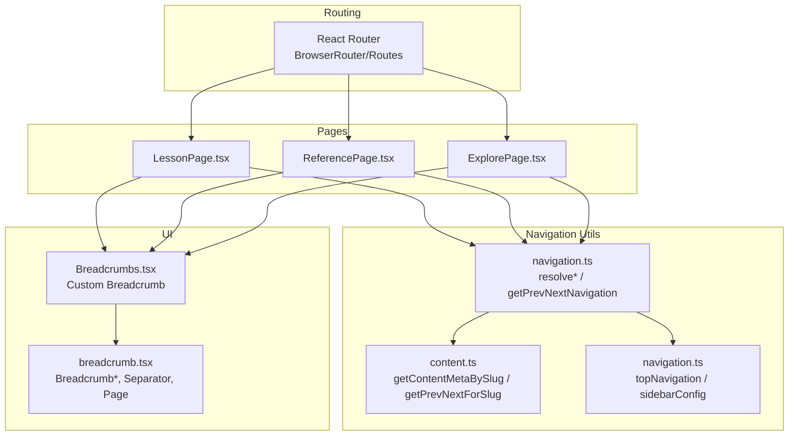
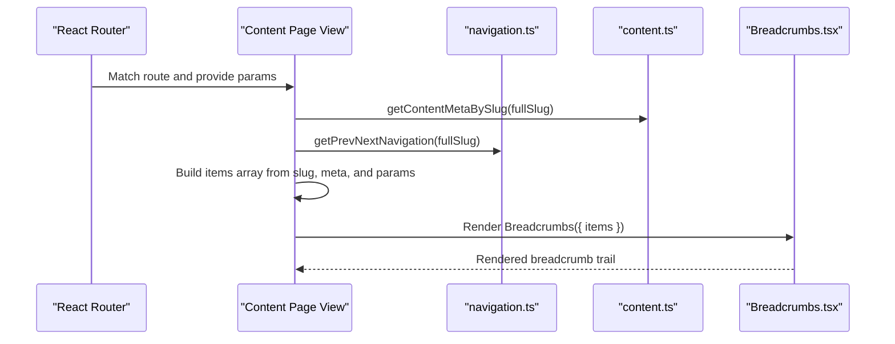
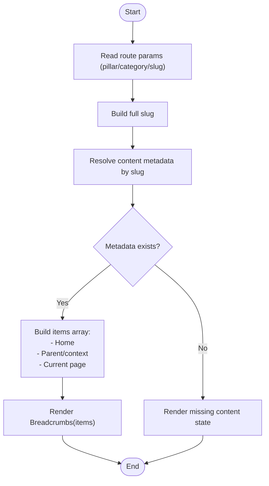
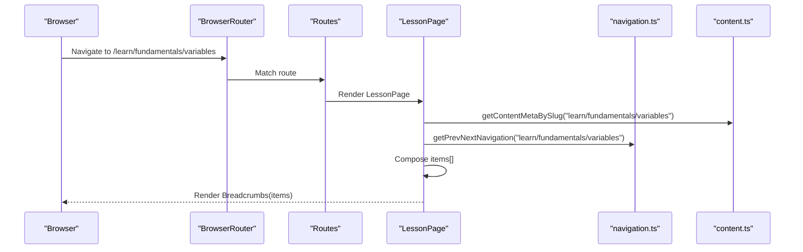
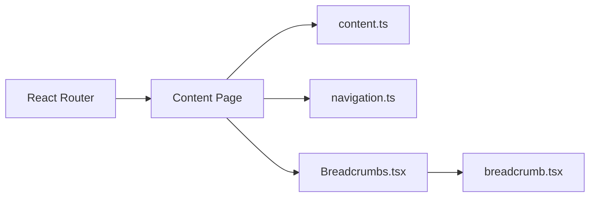
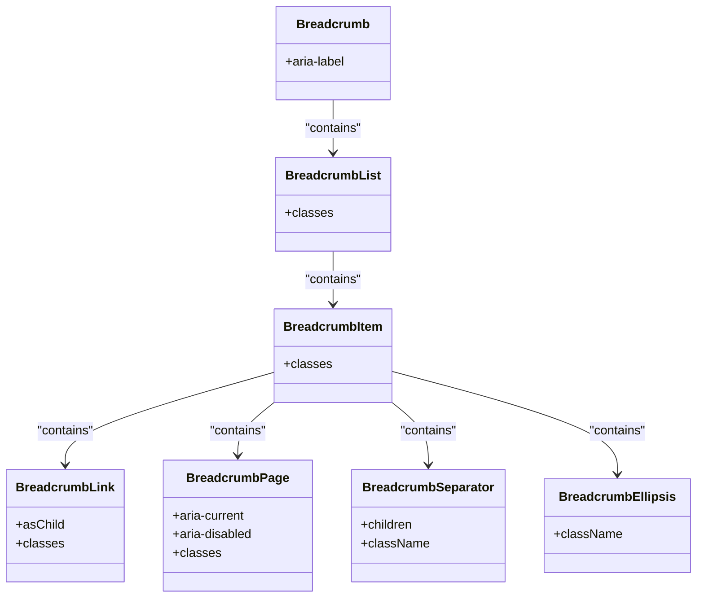

# Breadcrumb Navigation

<cite>
**Referenced Files in This Document**
- [Breadcrumbs.tsx](file://src/components/navigation/Breadcrumbs.tsx)
- [breadcrumb.tsx](file://src/components/ui/breadcrumb.tsx)
- [navigation.ts](file://src/lib/navigation.ts)
- [content.ts](file://src/lib/content.ts)
- [navigation.ts](file://src/config/navigation.ts)
- [LessonPage.tsx](file://src/features/learn/LessonPage.tsx)
- [ReferencePage.tsx](file://src/features/reference/ReferencePage.tsx)
- [ExplorePage.tsx](file://src/features/explore/ExplorePage.tsx)
- [App.tsx](file://src/App.tsx)
- [index.css](file://src/index.css)
</cite>

## Table of Contents
1. [Introduction](#introduction)
2. [Project Structure](#project-structure)
3. [Core Components](#core-components)
4. [Architecture Overview](#architecture-overview)
5. [Detailed Component Analysis](#detailed-component-analysis)
6. [Dependency Analysis](#dependency-analysis)
7. [Performance Considerations](#performance-considerations)
8. [Troubleshooting Guide](#troubleshooting-guide)
9. [Conclusion](#conclusion)
10. [Appendices](#appendices)

## Introduction
This document explains the Breadcrumb navigation component used across JSphere’s content structure. It covers how breadcrumbs are generated from content metadata and URL segments, how the component integrates with the routing system, and how it supports user orientation and SEO. It also documents styling, separator customization, accessibility features, and practical guidance for handling special content types, custom paths, and dynamic updates.

## Project Structure
The breadcrumb system spans three layers:
- UI primitives: a reusable, accessible breadcrumb set of components
- Navigation utilities: helpers to resolve content availability and build navigation metadata
- Page integration: per-pilar pages that assemble breadcrumb items from route params and content metadata

**Diagram sources**
- [App.tsx:72-89](file://src/App.tsx#L72-L89)
- [LessonPage.tsx:19-51](file://src/features/learn/LessonPage.tsx#L19-L51)
- [ReferencePage.tsx:20-59](file://src/features/reference/ReferencePage.tsx#L20-L59)
- [ExplorePage.tsx:17-43](file://src/features/explore/ExplorePage.tsx#L17-L43)
- [navigation.ts:59-73](file://src/lib/navigation.ts#L59-L73)
- [content.ts:91-101](file://src/lib/content.ts#L91-L101)
- [navigation.ts:62-262](file://src/config/navigation.ts#L62-L262)
- [breadcrumb.tsx:7-89](file://src/components/ui/breadcrumb.tsx#L7-L89)
- [Breadcrumbs.tsx:13-33](file://src/components/navigation/Breadcrumbs.tsx#L13-L33)

**Section sources**
- [App.tsx:72-89](file://src/App.tsx#L72-L89)
- [LessonPage.tsx:19-51](file://src/features/learn/LessonPage.tsx#L19-L51)
- [ReferencePage.tsx:20-59](file://src/features/reference/ReferencePage.tsx#L20-L59)
- [ExplorePage.tsx:17-43](file://src/features/explore/ExplorePage.tsx#L17-L43)
- [navigation.ts:59-73](file://src/lib/navigation.ts#L59-L73)
- [content.ts:91-101](file://src/lib/content.ts#L91-L101)
- [navigation.ts:62-262](file://src/config/navigation.ts#L62-L262)
- [breadcrumb.tsx:7-89](file://src/components/ui/breadcrumb.tsx#L7-L89)
- [Breadcrumbs.tsx:13-33](file://src/components/navigation/Breadcrumbs.tsx#L13-L33)

## Core Components
- Custom Breadcrumb (pages): A compact, home-focused breadcrumb tailored for JSphere’s content pages. It renders a home icon, followed by a chain of links and the current page label.
- Reusable Breadcrumb primitives: A Radix-based set of components supporting separators, ellipsis, and accessible roles for complex navigation trees.

Key behaviors:
- Automatic breadcrumb creation via page routes and content metadata
- Active item highlighting for the current page
- Accessible markup with ARIA roles and labels
- Flexible separator customization

**Section sources**
- [Breadcrumbs.tsx:13-33](file://src/components/navigation/Breadcrumbs.tsx#L13-L33)
- [breadcrumb.tsx:7-89](file://src/components/ui/breadcrumb.tsx#L7-L89)

## Architecture Overview
The breadcrumb pipeline connects routing, content metadata, and UI rendering:

**Diagram sources**
- [App.tsx:72-89](file://src/App.tsx#L72-L89)
- [LessonPage.tsx:20-51](file://src/features/learn/LessonPage.tsx#L20-L51)
- [ReferencePage.tsx:21-59](file://src/features/reference/ReferencePage.tsx#L21-L59)
- [ExplorePage.tsx:18-43](file://src/features/explore/ExplorePage.tsx#L18-L43)
- [navigation.ts:59-65](file://src/lib/navigation.ts#L59-L65)
- [content.ts:30-32](file://src/lib/content.ts#L30-L32)
- [Breadcrumbs.tsx:13-33](file://src/components/navigation/Breadcrumbs.tsx#L13-L33)

## Detailed Component Analysis

### Custom Breadcrumb Component (pages)
Purpose:
- Provide a concise, home-focused trail for content pages
- Highlight the current page without a link
- Use a home icon and chevron separators

Behavior:
- Renders a home link pointing to "/"
- Iterates over items and renders either a link (for prior items) or a non-link span (for the current page)
- Applies hover and active styles via Tailwind classes

Accessibility:
- Uses a nav landmark with an accessible label
- Current page is visually emphasized

Styling:
- Uses Tailwind utility classes for spacing, typography, and color tokens
- Inherits category-specific accent tokens from CSS variables

**Section sources**
- [Breadcrumbs.tsx:13-33](file://src/components/navigation/Breadcrumbs.tsx#L13-L33)
- [index.css:37-44](file://src/index.css#L37-L44)

### Reusable Breadcrumb Primitives (Radix-based)
Purpose:
- Provide a flexible, accessible breadcrumb toolkit for complex navigation trees
- Support custom separators, ellipsis, and page markers

Key elements:
- Breadcrumb: container with aria-label
- BreadcrumbList: ol element with responsive spacing and muted foreground
- BreadcrumbItem: li wrapper
- BreadcrumbLink: anchor with hover transitions; supports “asChild”
- BreadcrumbPage: span with aria-current="page" and disabled link semantics
- BreadcrumbSeparator: li with aria-hidden and default chevron icon
- BreadcrumbEllipsis: presentation span with sr-only text

Usage:
- Suitable for sitemaps, multi-level docs, and complex UIs
- Can be composed with custom separators and page markers

**Section sources**
- [breadcrumb.tsx:7-89](file://src/components/ui/breadcrumb.tsx#L7-L89)

### Page Integration Examples
- Learn lessons: derive category and title from route params and content metadata
- Reference entries: include category and method signature context
- Explore pages: simplified two-item trail

Each page composes an items array and passes it to the custom Breadcrumbs component.

**Section sources**
- [LessonPage.tsx:20-51](file://src/features/learn/LessonPage.tsx#L20-L51)
- [ReferencePage.tsx:21-59](file://src/features/reference/ReferencePage.tsx#L21-L59)
- [ExplorePage.tsx:18-43](file://src/features/explore/ExplorePage.tsx#L18-L43)

### Breadcrumb Generation Algorithm
Inputs:
- Route params (e.g., category, slug)
- Content metadata resolved by slug
- Optional previous/next metadata for navigation context

Algorithm steps:
1. Resolve content metadata by combining pillar, category, and slug
2. Build items array:
   - Root/home item (always present)
   - Parent/context items derived from route params and content metadata
   - Current page item (non-clickable, highlighted)
3. Pass items to Breadcrumbs component for rendering

Edge cases handled:
- Missing content metadata: page falls back to a missing state; breadcrumbs are not shown until metadata is available
- Root pages: items include a home link and a single trailing label
- Deeply nested content: items reflect the full hierarchy up to the current page

**Diagram sources**
- [LessonPage.tsx:20-51](file://src/features/learn/LessonPage.tsx#L20-L51)
- [ReferencePage.tsx:21-59](file://src/features/reference/ReferencePage.tsx#L21-L59)
- [ExplorePage.tsx:18-43](file://src/features/explore/ExplorePage.tsx#L18-L43)
- [content.ts:30-32](file://src/lib/content.ts#L30-L32)

**Section sources**
- [LessonPage.tsx:20-51](file://src/features/learn/LessonPage.tsx#L20-L51)
- [ReferencePage.tsx:21-59](file://src/features/reference/ReferencePage.tsx#L21-L59)
- [ExplorePage.tsx:18-43](file://src/features/explore/ExplorePage.tsx#L18-L43)
- [content.ts:30-32](file://src/lib/content.ts#L30-L32)

### Integration with Routing System
- Routes define content areas (e.g., /learn/:category/:slug, /reference/:category/:slug)
- Pages extract params and construct slugs
- Navigation utilities resolve availability and previous/next entries
- Breadcrumbs are rendered conditionally after metadata is loaded

**Diagram sources**
- [App.tsx:72-89](file://src/App.tsx#L72-L89)
- [LessonPage.tsx:20-51](file://src/features/learn/LessonPage.tsx#L20-L51)
- [navigation.ts:59-65](file://src/lib/navigation.ts#L59-L65)
- [content.ts:30-32](file://src/lib/content.ts#L30-L32)

**Section sources**
- [App.tsx:72-89](file://src/App.tsx#L72-L89)
- [LessonPage.tsx:20-51](file://src/features/learn/LessonPage.tsx#L20-L51)
- [navigation.ts:59-65](file://src/lib/navigation.ts#L59-L65)
- [content.ts:30-32](file://src/lib/content.ts#L30-L32)

### Visual Styling and Separator Customization
- Custom Breadcrumb:
  - Uses Tailwind classes for spacing, muted foreground, and hover transitions
  - Current page label is bold and foreground-colored
  - Separator is a chevron icon sized via utility classes
- Reusable Breadcrumb primitives:
  - BreadcrumbSeparator accepts a child to customize the separator icon or character
  - BreadcrumbList applies responsive spacing and typography
  - BreadcrumbPage marks the current page with aria-current and disabled link semantics

Practical tips:
- Replace the default chevron with a slash or dot by passing a custom separator to BreadcrumbSeparator
- Adjust spacing and typography by overriding BreadcrumbList and BreadcrumbItem classes
- Use category accent tokens for consistent theming across pillars

**Section sources**
- [Breadcrumbs.tsx:13-33](file://src/components/navigation/Breadcrumbs.tsx#L13-L33)
- [breadcrumb.tsx:62-66](file://src/components/ui/breadcrumb.tsx#L62-L66)
- [breadcrumb.tsx:15-26](file://src/components/ui/breadcrumb.tsx#L15-L26)
- [breadcrumb.tsx:48-60](file://src/components/ui/breadcrumb.tsx#L48-L60)
- [index.css:37-44](file://src/index.css#L37-L44)

### Accessibility Implementation
- Landmark and labeling:
  - The custom Breadcrumb component uses a nav element with aria-label="Breadcrumb"
  - Reusable Breadcrumb sets aria-label="breadcrumb" on the root nav
- Current page:
  - BreadcrumbPage sets aria-current="page" and disables link semantics
- Screen reader support:
  - BreadcrumbEllipsis includes an sr-only label for “More”
  - BreadcrumbSeparator is marked aria-hidden to avoid redundant announcements
- Keyboard navigation:
  - Links are native anchors; ensure focus styles are visible via theme tokens
  - No custom keyboard handling is required; standard browser behavior applies

Best practices:
- Keep breadcrumb labels descriptive and concise
- Avoid decorative separators; use aria-hidden appropriately
- Ensure sufficient color contrast for links and current page text

**Section sources**
- [Breadcrumbs.tsx:15](file://src/components/navigation/Breadcrumbs.tsx#L15)
- [breadcrumb.tsx:12](file://src/components/ui/breadcrumb.tsx#L12)
- [breadcrumb.tsx:50-58](file://src/components/ui/breadcrumb.tsx#L50-L58)
- [breadcrumb.tsx:69-80](file://src/components/ui/breadcrumb.tsx#L69-L80)
- [breadcrumb.tsx:62-66](file://src/components/ui/breadcrumb.tsx#L62-L66)

### Handling Special Content Types and Dynamic Updates
- Special content types:
  - Explore pages: simplified two-item trail (pillar + title)
  - Reference pages: include category and signature context
  - Lesson pages: include category and title derived from metadata
- Dynamic updates:
  - Breadcrumbs are recomputed when route params change
  - If content metadata becomes available later, re-render the page to update breadcrumbs
- Availability checks:
  - Use navigation utilities to mark items as available or coming-soon when integrating with top navigation or sidebars

**Section sources**
- [ExplorePage.tsx:18-43](file://src/features/explore/ExplorePage.tsx#L18-L43)
- [ReferencePage.tsx:21-59](file://src/features/reference/ReferencePage.tsx#L21-L59)
- [LessonPage.tsx:20-51](file://src/features/learn/LessonPage.tsx#L20-L51)
- [navigation.ts:28-43](file://src/lib/navigation.ts#L28-L43)

### Examples and Edge Cases
- Customizing appearance:
  - Override BreadcrumbList and BreadcrumbItem classes to adjust spacing and typography
  - Change the separator by wrapping BreadcrumbSeparator with a custom icon or character
- Adding custom separators:
  - Use BreadcrumbSeparator with a child to replace the default chevron
- Edge cases:
  - Root pages: items array contains home and a single trailing label
  - Deeply nested content: items reflect the full hierarchy up to the current page
  - Missing content: breadcrumbs are not rendered until metadata resolves

**Section sources**
- [breadcrumb.tsx:62-66](file://src/components/ui/breadcrumb.tsx#L62-L66)
- [ExplorePage.tsx:43](file://src/features/explore/ExplorePage.tsx#L43)
- [LessonPage.tsx:45-51](file://src/features/learn/LessonPage.tsx#L45-L51)

## Dependency Analysis
The breadcrumb system depends on:
- Routing to provide params and drive breadcrumb composition
- Content metadata to populate labels and validate availability
- Navigation utilities to compute previous/next and resolve availability
- UI primitives to render accessible and styled breadcrumbs

**Diagram sources**
- [App.tsx:72-89](file://src/App.tsx#L72-L89)
- [LessonPage.tsx:20-51](file://src/features/learn/LessonPage.tsx#L20-L51)
- [ReferencePage.tsx:21-59](file://src/features/reference/ReferencePage.tsx#L21-L59)
- [ExplorePage.tsx:18-43](file://src/features/explore/ExplorePage.tsx#L18-L43)
- [content.ts:30-32](file://src/lib/content.ts#L30-L32)
- [navigation.ts:59-65](file://src/lib/navigation.ts#L59-L65)
- [Breadcrumbs.tsx:13-33](file://src/components/navigation/Breadcrumbs.tsx#L13-L33)
- [breadcrumb.tsx:7-89](file://src/components/ui/breadcrumb.tsx#L7-L89)

**Section sources**
- [App.tsx:72-89](file://src/App.tsx#L72-L89)
- [LessonPage.tsx:20-51](file://src/features/learn/LessonPage.tsx#L20-L51)
- [ReferencePage.tsx:21-59](file://src/features/reference/ReferencePage.tsx#L21-L59)
- [ExplorePage.tsx:18-43](file://src/features/explore/ExplorePage.tsx#L18-L43)
- [content.ts:30-32](file://src/lib/content.ts#L30-L32)
- [navigation.ts:59-65](file://src/lib/navigation.ts#L59-L65)
- [Breadcrumbs.tsx:13-33](file://src/components/navigation/Breadcrumbs.tsx#L13-L33)
- [breadcrumb.tsx:7-89](file://src/components/ui/breadcrumb.tsx#L7-L89)

## Performance Considerations
- Keep items arrays small: only include necessary parent nodes to minimize DOM nodes
- Avoid unnecessary re-renders: memoize computed items and pass stable props to Breadcrumbs
- Prefer the reusable primitives for complex trees to leverage optimized rendering patterns

## Troubleshooting Guide
- Breadcrumb does not appear:
  - Ensure content metadata resolves for the current slug
  - Verify the page renders breadcrumbs only after metadata is available
- Active item not highlighted:
  - Confirm the last item has no href and is rendered as a non-link span
- Separator looks incorrect:
  - For the custom component, chevrons are applied automatically; for reusable primitives, ensure BreadcrumbSeparator is used
- Accessibility warnings:
  - Ensure aria-current is set on the current page marker
  - Keep separators aria-hidden when decorative

**Section sources**
- [LessonPage.tsx:26-37](file://src/features/learn/LessonPage.tsx#L26-L37)
- [ReferencePage.tsx:27-38](file://src/features/reference/ReferencePage.tsx#L27-L38)
- [ExplorePage.tsx:24-35](file://src/features/explore/ExplorePage.tsx#L24-L35)
- [Breadcrumbs.tsx:22-28](file://src/components/navigation/Breadcrumbs.tsx#L22-L28)
- [breadcrumb.tsx:50-58](file://src/components/ui/breadcrumb.tsx#L50-L58)
- [breadcrumb.tsx:62-66](file://src/components/ui/breadcrumb.tsx#L62-L66)

## Conclusion
The breadcrumb system in JSphere combines a simple, home-focused custom component with robust navigation utilities and accessible primitives. It provides clear user orientation, supports SEO through structured navigation data, and remains flexible for special content types and dynamic updates. By leveraging route params, content metadata, and Tailwind theming, breadcrumbs integrate seamlessly across the content structure.

## Appendices

### Class Model: Breadcrumb Primitives

**Diagram sources**
- [breadcrumb.tsx:7-89](file://src/components/ui/breadcrumb.tsx#L7-L89)