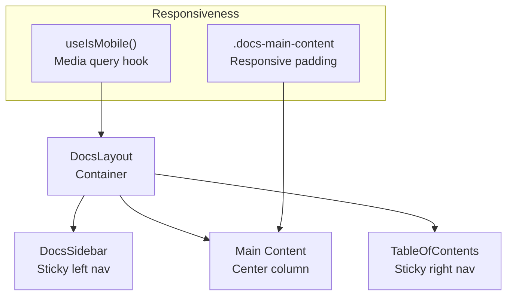
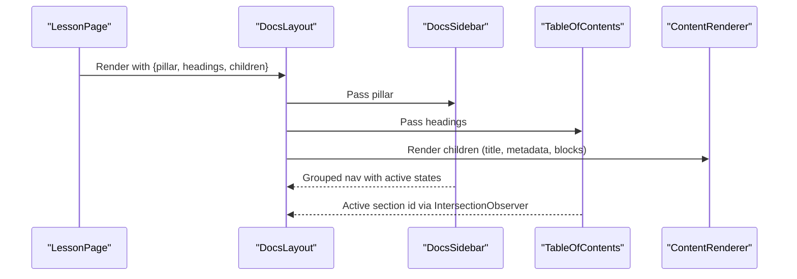
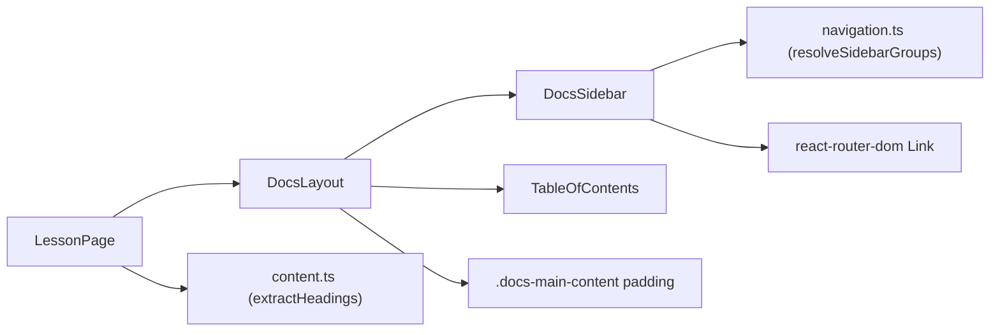

# Docs Layout System

<cite>
**Referenced Files in This Document**
- [DocsLayout.tsx](file://src/components/layout/DocsLayout.tsx)
- [DocsSidebar.tsx](file://src/components/navigation/DocsSidebar.tsx)
- [TableOfContents.tsx](file://src/components/navigation/TableOfContents.tsx)
- [use-mobile.tsx](file://src/hooks/use-mobile.tsx)
- [navigation.ts](file://src/lib/navigation.ts)
- [content.ts](file://src/lib/content.ts)
- [LessonPage.tsx](file://src/features/learn/LessonPage.tsx)
- [index.css](file://src/index.css)
- [navigation.ts (config)](file://src/config/navigation.ts)
- [sidebar.tsx](file://src/components/ui/sidebar.tsx)
</cite>

## Table of Contents
1. [Introduction](#introduction)
2. [Project Structure](#project-structure)
3. [Core Components](#core-components)
4. [Architecture Overview](#architecture-overview)
5. [Detailed Component Analysis](#detailed-component-analysis)
6. [Dependency Analysis](#dependency-analysis)
7. [Performance Considerations](#performance-considerations)
8. [Troubleshooting Guide](#troubleshooting-guide)
9. [Conclusion](#conclusion)
10. [Appendices](#appendices)

## Introduction
This document explains the DocsLayout system that orchestrates the main content presentation for JSphere’s documentation pages. It covers the layout structure (sidebar integration, main content area, and table of contents positioning), responsive breakpoints and mobile-first design, component composition, state management for sidebar visibility and TOC highlighting, scroll synchronization, and accessibility features. It also provides guidance on customization, extending layout regions, and handling edge cases.

## Project Structure
The DocsLayout system is composed of three primary parts:
- A layout container that positions the sidebar, main content, and TOC
- A sticky sidebar that renders hierarchical navigation per pillar
- A sticky table of contents that tracks the active section via intersection observation

Responsive behavior is driven by:
- A mobile breakpoint hook
- Tailwind-based responsive utilities
- Sticky positioning for sidebars and TOC

**Diagram sources**
- [DocsLayout.tsx:12-25](file://src/components/layout/DocsLayout.tsx#L12-L25)
- [DocsSidebar.tsx:13-67](file://src/components/navigation/DocsSidebar.tsx#L13-L67)
- [TableOfContents.tsx:9-67](file://src/components/navigation/TableOfContents.tsx#L9-L67)
- [use-mobile.tsx:5-19](file://src/hooks/use-mobile.tsx#L5-L19)
- [index.css:127-136](file://src/index.css#L127-L136)

**Section sources**
- [DocsLayout.tsx:12-25](file://src/components/layout/DocsLayout.tsx#L12-L25)
- [DocsSidebar.tsx:13-67](file://src/components/navigation/DocsSidebar.tsx#L13-L67)
- [TableOfContents.tsx:9-67](file://src/components/navigation/TableOfContents.tsx#L9-L67)
- [use-mobile.tsx:5-19](file://src/hooks/use-mobile.tsx#L5-L19)
- [index.css:127-136](file://src/index.css#L127-L136)

## Core Components
- DocsLayout: Provides the three-column layout and passes pillar and headings props to child components.
- DocsSidebar: Renders a sticky, collapsible sidebar with grouped navigation items resolved per pillar.
- TableOfContents: Renders a sticky right rail with anchor links and active section highlighting using IntersectionObserver.

Key props and responsibilities:
- DocsLayout: pillar, headings, children
- DocsSidebar: pillar (used to resolve sidebar groups)
- TableOfContents: headings (used to build TOC and observe sections)

**Section sources**
- [DocsLayout.tsx:6-10](file://src/components/layout/DocsLayout.tsx#L6-L10)
- [DocsSidebar.tsx:9-11](file://src/components/navigation/DocsSidebar.tsx#L9-L11)
- [TableOfContents.tsx:5-7](file://src/components/navigation/TableOfContents.tsx#L5-L7)

## Architecture Overview
The DocsLayout composes DocsSidebar and TableOfContents alongside the main content area. Headings are extracted from content and passed down to the TOC. The sidebar resolves items per pillar and reflects active states based on the current location.

**Diagram sources**
- [LessonPage.tsx:39-43](file://src/features/learn/LessonPage.tsx#L39-L43)
- [DocsLayout.tsx:12-25](file://src/components/layout/DocsLayout.tsx#L12-L25)
- [DocsSidebar.tsx:13-67](file://src/components/navigation/DocsSidebar.tsx#L13-L67)
- [TableOfContents.tsx:9-67](file://src/components/navigation/TableOfContents.tsx#L9-L67)
- [content.ts:121-125](file://src/lib/content.ts#L121-L125)

## Detailed Component Analysis

### DocsLayout
Responsibilities:
- Container layout with horizontal flexbox
- Left sidebar, center main content, right TOC
- Responsive padding for main content via CSS utilities
- Passes pillar and headings to child components

Composition:
- Uses DocsSidebar and TableOfContents as siblings around the main content region.

Responsive behavior:
- Mobile-first padding via CSS class on main content
- Desktop-specific padding applied at larger breakpoints

Customization tips:
- To add a new region, insert a sibling element between sidebar and TOC
- To change widths, adjust the fixed widths of sidebar and TOC containers and their responsive spacing

Edge cases:
- If headings is empty, TOC returns null
- If pillar is unknown, DocsSidebar falls back gracefully

**Section sources**
- [DocsLayout.tsx:12-25](file://src/components/layout/DocsLayout.tsx#L12-L25)
- [index.css:127-136](file://src/index.css#L127-L136)

### DocsSidebar
Responsibilities:
- Resolve sidebar groups per pillar
- Render collapsible groups with expand/collapse state
- Highlight active item based on current location
- Mark unavailable items with badges

Integration:
- Uses resolveSidebarGroups to compute status and metadata for each item
- Uses react-router-dom Link for navigation

State management:
- Uses Collapsible components to manage open/closed state
- Default open state can be configured per group

Accessibility:
- Keyboard-accessible triggers
- Proper focus styles and semantic markup

Customization tips:
- Add defaultOpen flags to groups for initial visibility
- Extend resolveSidebarGroups to enrich items with extra metadata

**Section sources**
- [DocsSidebar.tsx:13-67](file://src/components/navigation/DocsSidebar.tsx#L13-L67)
- [navigation.ts:45-57](file://src/lib/navigation.ts#L45-L57)

### TableOfContents
Responsibilities:
- Build anchor links from headings
- Track active heading via IntersectionObserver
- Apply sticky positioning and indentation based on heading levels
- Support keyboard activation for anchor links

State management:
- Tracks activeId in component state
- Observes heading elements when headings prop changes

Scroll synchronization:
- Uses IntersectionObserver with a root margin to mark headings as active when they enter the viewport
- Supports smooth scrolling when activated via keyboard

Customization tips:
- Adjust rootMargin/threshold to fine-tune active section detection
- Modify indentation classes to reflect deeper nesting

**Section sources**
- [TableOfContents.tsx:9-67](file://src/components/navigation/TableOfContents.tsx#L9-L67)

### Responsive Breakpoints and Mobile-First Design
- Mobile breakpoint is defined in a hook using a media query
- Tailwind utilities apply desktop-specific padding to the main content
- Sidebar and TOC are hidden on smaller screens by default and revealed at larger breakpoints

Implementation details:
- useIsMobile hook listens to media query changes
- index.css defines .docs-main-content padding for mobile and desktop

**Section sources**
- [use-mobile.tsx:5-19](file://src/hooks/use-mobile.tsx#L5-L19)
- [index.css:127-136](file://src/index.css#L127-L136)

### State Management for Sidebar Visibility and TOC Expansion
- Sidebar state is managed internally via Collapsible components; DocsSidebar does not expose external open state
- TOC maintains internal activeId state and recalculates on headings changes
- There is no cross-component state synchronization between sidebar and TOC in the current implementation

Recommendations:
- If cross-region synchronization is desired (e.g., opening a sidebar item highlights its TOC entry), introduce a shared context/provider to coordinate state

**Section sources**
- [DocsSidebar.tsx:24-61](file://src/components/navigation/DocsSidebar.tsx#L24-L61)
- [TableOfContents.tsx:10-30](file://src/components/navigation/TableOfContents.tsx#L10-L30)

### Smooth Scrolling Behavior and Anchor Link Navigation
- TOC anchors use href="#id" and rely on native smooth scrolling when clicked
- Keyboard activation (Enter/Space) programmatically scrolls to the target element with smooth behavior
- IntersectionObserver updates the active TOC entry as the user scrolls

Edge cases:
- If an anchor id is missing in the DOM, the observer ignores it
- Ensure heading ids are unique and stable

**Section sources**
- [TableOfContents.tsx:42-50](file://src/components/navigation/TableOfContents.tsx#L42-L50)
- [TableOfContents.tsx:24-27](file://src/components/navigation/TableOfContents.tsx#L24-L27)

### Content Height Calculations and Sticky Positioning
- Sticky containers use fixed top offsets and max-height based on viewport minus header height
- This ensures the sidebar and TOC remain within the viewport while allowing overflow scrolling

Considerations:
- Sticky positioning requires sufficient content height to enable scrolling
- Ensure content sections have distinct ids for accurate TOC observation

**Section sources**
- [DocsSidebar.tsx:18-67](file://src/components/navigation/DocsSidebar.tsx#L18-L67)
- [TableOfContents.tsx:34-67](file://src/components/navigation/TableOfContents.tsx#L34-L67)

### Accessibility Features
- Skip links: Consider adding a visually hidden link at the top of the page to jump to main content
- Focus management: Ensure focus moves appropriately when toggling collapsible groups or navigating TOC entries
- Keyboard navigation: TOC supports Enter/Space activation for anchor links
- Semantic markup: Use proper headings and lists for screen reader comprehension

**Section sources**
- [TableOfContents.tsx:45-50](file://src/components/navigation/TableOfContents.tsx#L45-L50)

## Dependency Analysis
The DocsLayout system depends on:
- Navigation resolution utilities to populate sidebar items
- Content extraction utilities to derive headings for TOC
- Responsive hooks and CSS for mobile-first behavior

**Diagram sources**
- [LessonPage.tsx:39-43](file://src/features/learn/LessonPage.tsx#L39-L43)
- [DocsLayout.tsx:12-25](file://src/components/layout/DocsLayout.tsx#L12-L25)
- [DocsSidebar.tsx:13-67](file://src/components/navigation/DocsSidebar.tsx#L13-L67)
- [TableOfContents.tsx:9-67](file://src/components/navigation/TableOfContents.tsx#L9-L67)
- [navigation.ts:45-57](file://src/lib/navigation.ts#L45-L57)
- [content.ts:121-125](file://src/lib/content.ts#L121-L125)

**Section sources**
- [LessonPage.tsx:39-43](file://src/features/learn/LessonPage.tsx#L39-L43)
- [navigation.ts:45-57](file://src/lib/navigation.ts#L45-L57)
- [content.ts:121-125](file://src/lib/content.ts#L121-L125)

## Performance Considerations
- IntersectionObserver is efficient for tracking active sections; ensure to disconnect observers on unmount (already handled)
- Debounce or throttle heavy computations if headings change frequently
- Lazy load content blocks to reduce initial render cost
- Use CSS containment or contain: layout/inline-size for isolated regions to minimize layout impact

[No sources needed since this section provides general guidance]

## Troubleshooting Guide
Common issues and resolutions:
- TOC not highlighting: Verify that heading ids exist in the DOM and are unique
- Sidebar not reflecting active item: Confirm current route matches an item href and that resolveSidebarGroups resolves items for the given pillar
- Mobile layout looks incorrect: Check that the mobile breakpoint hook is correctly detecting device width and that CSS padding classes are applied

**Section sources**
- [TableOfContents.tsx:24-27](file://src/components/navigation/TableOfContents.tsx#L24-L27)
- [navigation.ts:45-57](file://src/lib/navigation.ts#L45-L57)
- [use-mobile.tsx:5-19](file://src/hooks/use-mobile.tsx#L5-L19)

## Conclusion
The DocsLayout system provides a clean, mobile-first documentation layout with a sticky sidebar and TOC. Its composition pattern enables easy extension and customization. By leveraging IntersectionObserver for scroll synchronization and responsive utilities for padding, it balances readability and usability across devices. Future enhancements could centralize state management for cross-region coordination and introduce additional accessibility features like skip links.

[No sources needed since this section summarizes without analyzing specific files]

## Appendices

### Customizing Layout Behavior
- Adding a new layout region: Insert a new sibling element between sidebar and TOC in DocsLayout and adjust widths accordingly
- Modifying responsive behavior: Adjust the mobile breakpoint hook and CSS padding classes
- Enhancing sidebar behavior: Introduce a provider to share open/collapsed state across components

**Section sources**
- [DocsLayout.tsx:12-25](file://src/components/layout/DocsLayout.tsx#L12-L25)
- [use-mobile.tsx:5-19](file://src/hooks/use-mobile.tsx#L5-L19)
- [index.css:127-136](file://src/index.css#L127-L136)

### Handling Edge Cases
- Empty headings: TOC returns null when headings length is zero
- Unknown pillar: DocsSidebar falls back gracefully when resolving groups
- Missing anchor targets: IntersectionObserver ignores elements that do not exist

**Section sources**
- [TableOfContents.tsx:32-32](file://src/components/navigation/TableOfContents.tsx#L32-L32)
- [DocsSidebar.tsx:13-15](file://src/components/navigation/DocsSidebar.tsx#L13-L15)

### Accessibility Checklist
- Ensure focus order is logical and predictable
- Provide skip links for keyboard navigation
- Use ARIA attributes where appropriate for collapsible groups
- Maintain sufficient color contrast for active/inactive states

[No sources needed since this section provides general guidance]