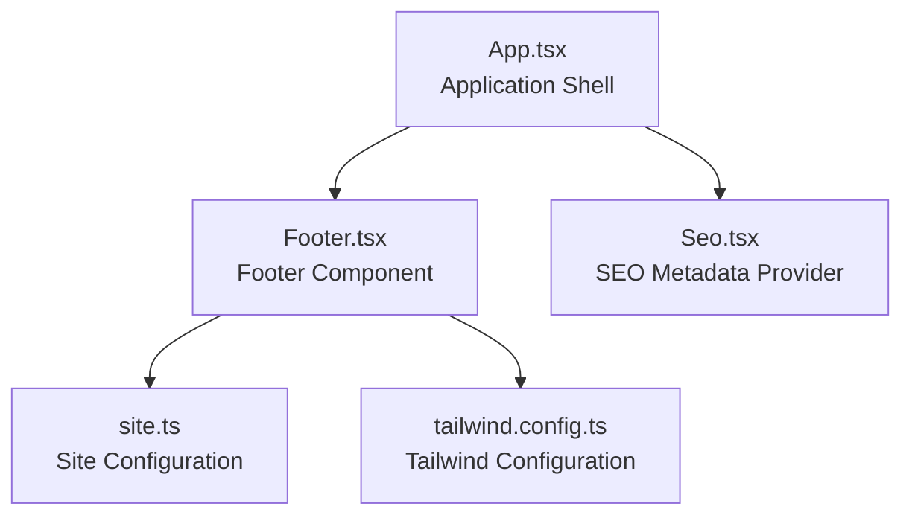
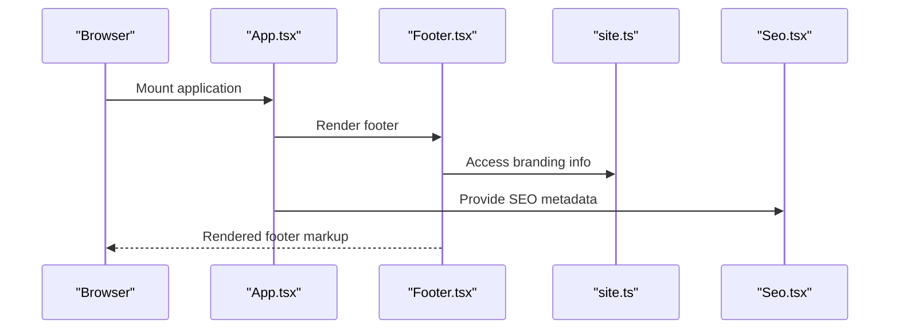
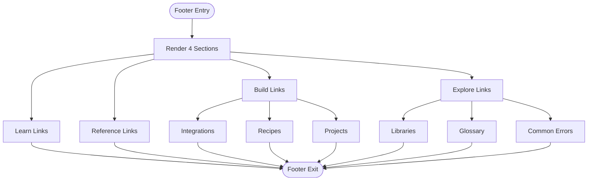
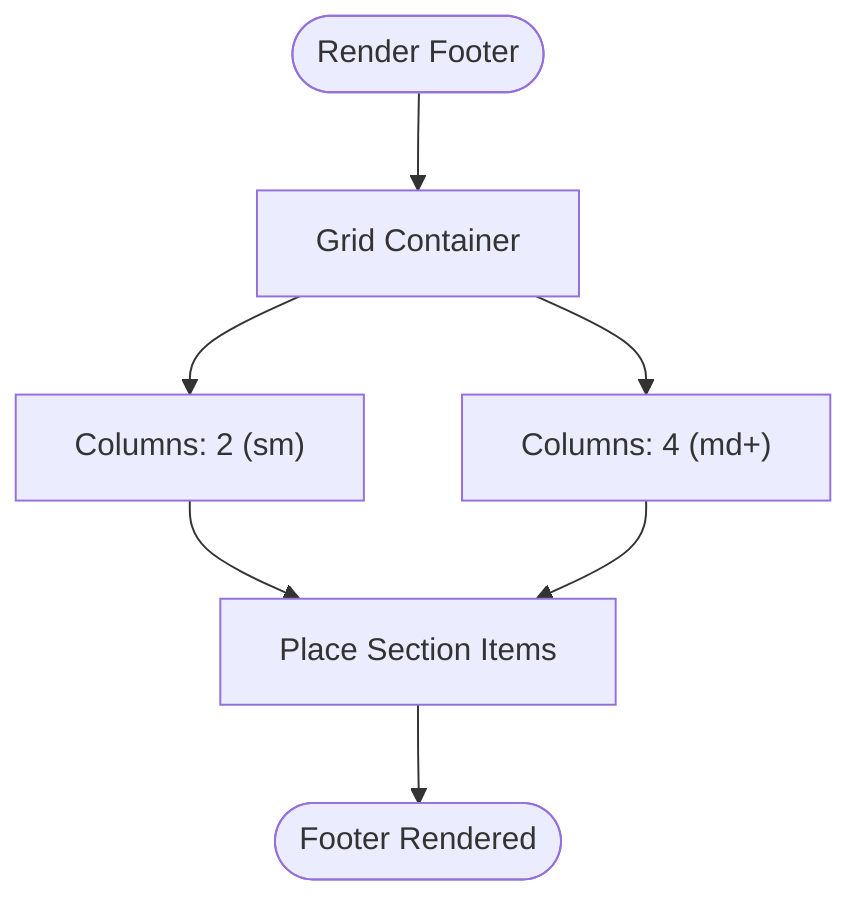
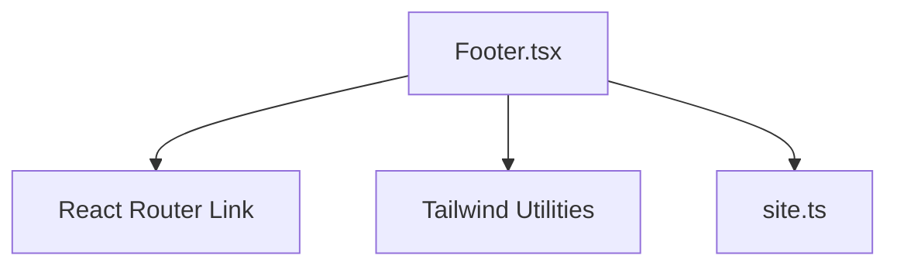

# Footer Component

<cite>
**Referenced Files in This Document**
- [Footer.tsx](file://src/components/navigation/Footer.tsx)
- [App.tsx](file://src/App.tsx)
- [site.ts](file://src/config/site.ts)
- [navigation.ts](file://src/config/navigation.ts)
- [navigation-lib.ts](file://src/lib/navigation.ts)
- [categories.ts](file://src/config/categories.ts)
- [Seo.tsx](file://src/components/seo/Seo.tsx)
- [tailwind.config.ts](file://tailwind.config.ts)
- [robots.txt](file://public/robots.txt)
</cite>

## Table of Contents
1. [Introduction](#introduction)
2. [Project Structure](#project-structure)
3. [Core Components](#core-components)
4. [Architecture Overview](#architecture-overview)
5. [Detailed Component Analysis](#detailed-component-analysis)
6. [Dependency Analysis](#dependency-analysis)
7. [Performance Considerations](#performance-considerations)
8. [Troubleshooting Guide](#troubleshooting-guide)
9. [Conclusion](#conclusion)

## Introduction
The Footer component provides secondary navigation and informational content at the bottom of JSphere pages. It presents structured links organized into sections, displays branding and authorship information, and ensures consistent presentation across screen sizes. The component is integrated into the application shell via the main App component and leverages site configuration for branding and SEO-friendly metadata.

## Project Structure
The Footer component resides under the navigation components and is rendered within the application layout. It uses Tailwind CSS for responsive grid layouts and styling, and integrates with site configuration for consistent branding.

**Diagram sources**
- [App.tsx:93](file://src/App.tsx#L93)
- [Footer.tsx:1](file://src/components/navigation/Footer.tsx#L1)
- [site.ts:1](file://src/config/site.ts#L1)
- [tailwind.config.ts:1](file://tailwind.config.ts#L1)
- [Seo.tsx:1](file://src/components/seo/Seo.tsx#L1)

**Section sources**
- [App.tsx:93](file://src/App.tsx#L93)
- [Footer.tsx:1](file://src/components/navigation/Footer.tsx#L1)
- [site.ts:1](file://src/config/site.ts#L1)
- [tailwind.config.ts:1](file://tailwind.config.ts#L1)

## Core Components
The Footer component consists of:
- A responsive grid layout that organizes navigation sections into columns.
- A branding area with logo initials and site name.
- An attribution paragraph with a link to the creator’s profile.
- A copyright statement.

Key characteristics:
- Uses React Router Link for internal navigation.
- Applies Tailwind utility classes for responsive breakpoints and spacing.
- Includes a small amount of static content suitable for quick customization.

**Section sources**
- [Footer.tsx:39-90](file://src/components/navigation/Footer.tsx#L39-L90)

## Architecture Overview
The Footer participates in the application’s layout and SEO pipeline. It is rendered by the App component and benefits from site-wide configuration and SEO metadata.

**Diagram sources**
- [App.tsx:93](file://src/App.tsx#L93)
- [Footer.tsx:39](file://src/components/navigation/Footer.tsx#L39)
- [site.ts:1](file://src/config/site.ts#L1)
- [Seo.tsx:10](file://src/components/seo/Seo.tsx#L10)

## Detailed Component Analysis

### Footer Structure and Sections
The Footer defines four primary sections: Learn, Reference, Build, and Explore. Each section contains a set of links pointing to relevant areas of the site. The Build section currently lists Integrations, Recipes, and Projects.

**Diagram sources**
- [Footer.tsx:3-37](file://src/components/navigation/Footer.tsx#L3-L37)

**Section sources**
- [Footer.tsx:3-37](file://src/components/navigation/Footer.tsx#L3-L37)

### Layout Grid System and Responsive Design
The Footer uses a two-column layout on small screens and expands to four columns on medium screens and above. This responsive behavior is controlled by Tailwind’s grid utilities.

**Diagram sources**
- [Footer.tsx:43](file://src/components/navigation/Footer.tsx#L43)
- [tailwind.config.ts:1](file://tailwind.config.ts#L1)

**Section sources**
- [Footer.tsx:43](file://src/components/navigation/Footer.tsx#L43)
- [tailwind.config.ts:1](file://tailwind.config.ts#L1)

### Navigation Link Configuration and External Link Handling
- Internal links: The Footer uses React Router Link to navigate internally. These links are defined in the component’s static configuration.
- External links: The Footer includes an external link in the attribution paragraph. It applies safe attributes for external links.

Customization note:
- To add new sections or modify existing ones, update the static footerLinks array.
- To add external links, follow the pattern used for the attribution link with appropriate target and rel attributes.

**Section sources**
- [Footer.tsx:39-90](file://src/components/navigation/Footer.tsx#L39-L90)

### Integration with Site Configuration
The Footer does not dynamically pull content from site configuration. However, it can be extended to integrate with site configuration for branding and metadata. The site configuration file provides site-wide branding details that could inform future enhancements.

**Section sources**
- [site.ts:1-15](file://src/config/site.ts#L1-L15)

### Accessibility Compliance and Semantic HTML
Current implementation highlights:
- Uses semantic heading elements for section titles.
- Uses list elements for grouping links.
- Provides clear text for interactive elements.

Recommendations for improvement:
- Add explicit aria-labels to the navigation lists for improved screen reader support.
- Ensure focus management for keyboard navigation by leveraging native anchor elements and proper tab order.
- Consider adding skip links to improve keyboard accessibility.

[No sources needed since this section provides general guidance]

### SEO Optimization and User Experience Enhancement
- The App component renders SEO metadata via the Seo component, which sets canonical URLs and meta tags. While the Footer itself does not directly generate SEO metadata, consistent branding and clear navigation contribute to a coherent user experience and indirectly support SEO.
- The robots.txt file allows indexing by major crawlers, supporting discoverability.

**Section sources**
- [Seo.tsx:10-32](file://src/components/seo/Seo.tsx#L10-L32)
- [robots.txt:1-15](file://public/robots.txt#L1-L15)

### Implementation Details and Customization Examples
- Adding a new section:
  - Extend the footerLinks array with a new section object containing a title and an array of link objects with label and href.
- Modifying existing sections:
  - Adjust the links array within the desired section.
- Managing link updates:
  - Update href values to reflect new routes or corrected destinations.
- External link management:
  - Follow the established pattern for external links with target and rel attributes.

Example paths for reference:
- Footer configuration: [Footer.tsx:3-37](file://src/components/navigation/Footer.tsx#L3-L37)
- Rendering logic: [Footer.tsx:39-90](file://src/components/navigation/Footer.tsx#L39-L90)

**Section sources**
- [Footer.tsx:3-37](file://src/components/navigation/Footer.tsx#L3-L37)
- [Footer.tsx:39-90](file://src/components/navigation/Footer.tsx#L39-L90)

## Dependency Analysis
The Footer component depends on:
- React Router Link for internal navigation.
- Tailwind CSS for responsive layout and styling.
- Site configuration for branding details.

**Diagram sources**
- [Footer.tsx:1](file://src/components/navigation/Footer.tsx#L1)
- [site.ts:1](file://src/config/site.ts#L1)

**Section sources**
- [Footer.tsx:1](file://src/components/navigation/Footer.tsx#L1)
- [site.ts:1](file://src/config/site.ts#L1)

## Performance Considerations
- Keep the number of footer sections and links reasonable to avoid rendering overhead.
- Prefer static content for the Footer to minimize re-renders.
- Use Tailwind utilities efficiently to avoid unnecessary CSS bloat.

[No sources needed since this section provides general guidance]

## Troubleshooting Guide
- Links not working:
  - Verify that the href values correspond to existing routes.
  - Ensure React Router is properly configured in the application shell.
- External links opening in the same tab:
  - Confirm that external links include target="_blank" and rel="noopener noreferrer".
- Styling issues:
  - Check Tailwind configuration and ensure responsive utilities are applied correctly.

**Section sources**
- [Footer.tsx:39-90](file://src/components/navigation/Footer.tsx#L39-L90)
- [tailwind.config.ts:1](file://tailwind.config.ts#L1)

## Conclusion
The Footer component delivers a concise, accessible, and responsive navigation layer at the bottom of JSphere pages. Its straightforward structure supports easy customization while maintaining consistent branding and user experience. Future enhancements can integrate site configuration and improve accessibility and SEO alignment.