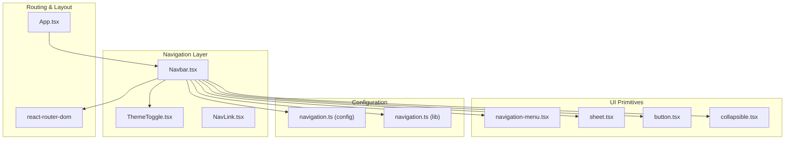
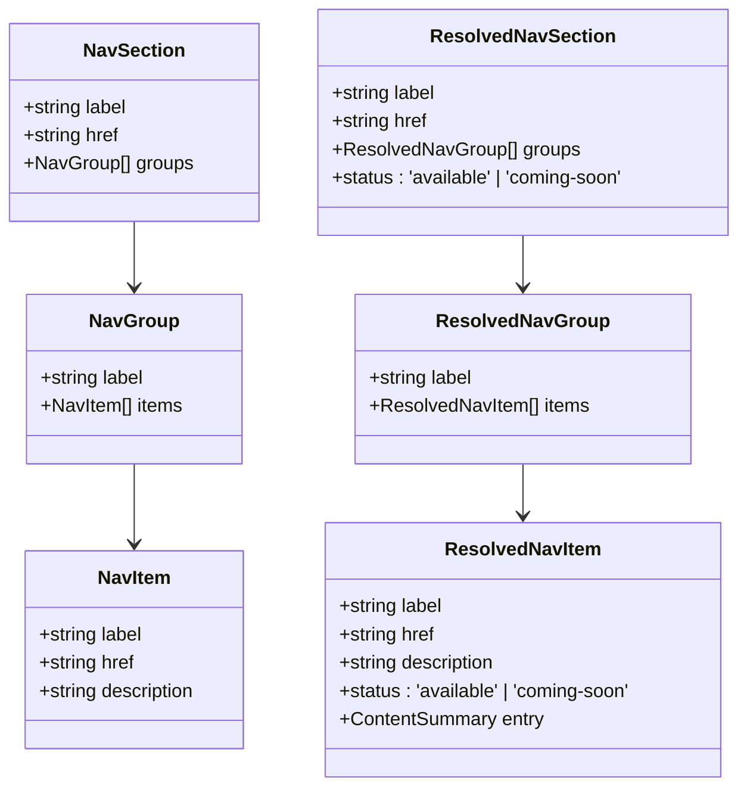
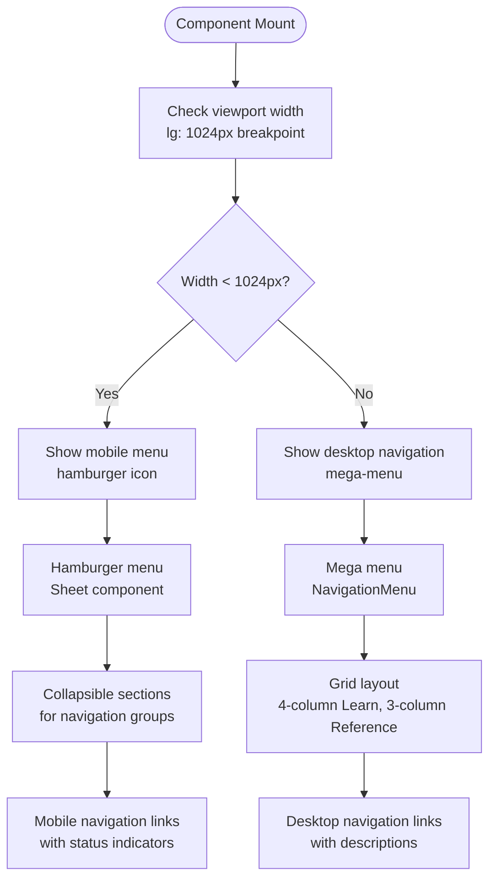
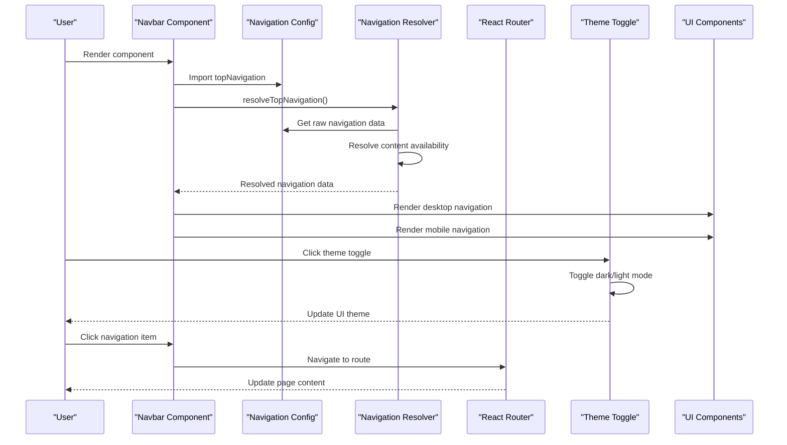
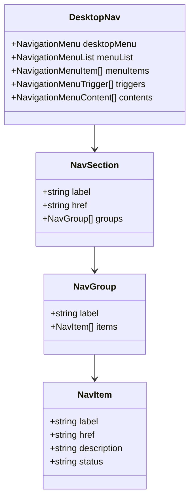
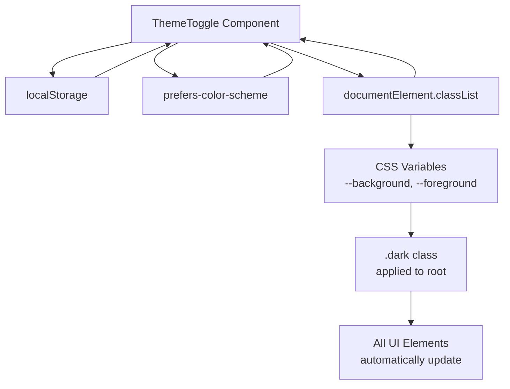
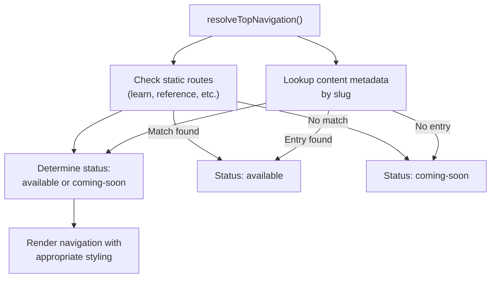
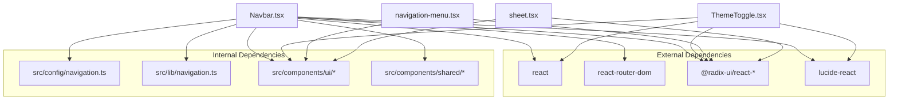

# Navbar Component

<cite>
**Referenced Files in This Document**
- [Navbar.tsx](file://src/components/navigation/Navbar.tsx)
- [ThemeToggle.tsx](file://src/components/shared/ThemeToggle.tsx)
- [navigation.ts](file://src/config/navigation.ts)
- [navigation.ts](file://src/lib/navigation.ts)
- [navigation-menu.tsx](file://src/components/ui/navigation-menu.tsx)
- [sheet.tsx](file://src/components/ui/sheet.tsx)
- [button.tsx](file://src/components/ui/button.tsx)
- [use-mobile.tsx](file://src/hooks/use-mobile.tsx)
- [App.tsx](file://src/App.tsx)
- [index.css](file://src/index.css)
- [tailwind.config.ts](file://tailwind.config.ts)
</cite>

## Table of Contents
1. [Introduction](#introduction)
2. [Project Structure](#project-structure)
3. [Core Components](#core-components)
4. [Architecture Overview](#architecture-overview)
5. [Detailed Component Analysis](#detailed-component-analysis)
6. [Dependency Analysis](#dependency-analysis)
7. [Performance Considerations](#performance-considerations)
8. [Troubleshooting Guide](#troubleshooting-guide)
9. [Conclusion](#conclusion)

## Introduction
The Navbar component serves as the primary navigation header for JSphere. It provides:
- Logo display with brand identity
- Desktop mega-menu navigation for top-level sections
- Mobile-responsive hamburger menu with collapsible sections
- Integrated theme toggle for light/dark mode switching
- Search trigger with keyboard shortcut support
- Responsive breakpoint handling for mobile devices
- Accessibility features including ARIA attributes and keyboard navigation

The component integrates tightly with the routing system to highlight active navigation items and with the content management system to dynamically resolve available content paths.

## Project Structure
The Navbar component is organized within the navigation components directory and leverages shared UI primitives and configuration systems.



**Diagram sources**
- [Navbar.tsx:1-183](file://src/components/navigation/Navbar.tsx#L1-L183)
- [ThemeToggle.tsx:1-30](file://src/components/shared/ThemeToggle.tsx#L1-L30)
- [navigation.ts:1-531](file://src/config/navigation.ts#L1-L531)
- [navigation.ts:1-74](file://src/lib/navigation.ts#L1-L74)

**Section sources**
- [Navbar.tsx:1-183](file://src/components/navigation/Navbar.tsx#L1-L183)
- [App.tsx:1-103](file://src/App.tsx#L1-L103)

## Core Components
The Navbar component consists of several key subsystems working together to provide a comprehensive navigation experience.

### Navigation Structure
The component uses a hierarchical navigation structure defined in configuration files:



**Diagram sources**
- [navigation.ts:5-52](file://src/config/navigation.ts#L5-L52)

### Responsive Design Implementation
The component implements responsive design through Tailwind CSS breakpoints and mobile detection:



**Diagram sources**
- [Navbar.tsx:40-98](file://src/components/navigation/Navbar.tsx#L40-L98)
- [Navbar.tsx:120-177](file://src/components/navigation/Navbar.tsx#L120-L177)

**Section sources**
- [Navbar.tsx:24-183](file://src/components/navigation/Navbar.tsx#L24-L183)
- [navigation.ts:62-262](file://src/config/navigation.ts#L62-L262)

## Architecture Overview
The Navbar component follows a modular architecture pattern with clear separation of concerns and integration points.



**Diagram sources**
- [Navbar.tsx:24-26](file://src/components/navigation/Navbar.tsx#L24-L26)
- [navigation.ts:28-43](file://src/lib/navigation.ts#L28-L43)
- [ThemeToggle.tsx:5-29](file://src/components/shared/ThemeToggle.tsx#L5-L29)

The architecture ensures loose coupling between navigation data, presentation, and behavior while maintaining strong integration with the routing system and theme management.

**Section sources**
- [App.tsx:40-103](file://src/App.tsx#L40-L103)
- [Navbar.tsx:1-183](file://src/components/navigation/Navbar.tsx#L1-L183)

## Detailed Component Analysis

### Desktop Navigation System
The desktop navigation uses a sophisticated mega-menu implementation with dynamic grid layouts based on content complexity.



**Diagram sources**
- [Navbar.tsx:40-98](file://src/components/navigation/Navbar.tsx#L40-L98)
- [navigation.ts:62-262](file://src/config/navigation.ts#L62-L262)

The desktop navigation features:
- **Dynamic Grid Layouts**: Different column configurations for Learn (4-column), Reference (3-column), and other sections (2-column)
- **Status Indicators**: Visual distinction between available content and coming-soon items
- **Hover Interactions**: Smooth animations and transitions for menu interactions
- **Responsive Descriptions**: Content descriptions displayed alongside navigation items

### Mobile Navigation System
The mobile navigation implements a collapsible sidebar menu using Radix UI's Sheet and Collapsible components.

```mermaid
sequenceDiagram
participant User as "User"
participant Hamburger as "Hamburger Button"
participant Sheet as "Sheet Component"
participant Collapsible as "Collapsible Sections"
participant Link as "Navigation Links"
User->>Hamburger : Click hamburger icon
Hamburger->>Sheet : Open sheet modal
Sheet->>Collapsible : Render collapsible sections
User->>Collapsible : Expand section
Collapsible->>Collapsible : Show nested items
User->>Link : Click navigation item
Link->>Sheet : Close sheet
Link->>Router : Navigate to route
```

**Diagram sources**
- [Navbar.tsx:120-177](file://src/components/navigation/Navbar.tsx#L120-L177)
- [sheet.tsx:54-67](file://src/components/ui/sheet.tsx#L54-L67)

The mobile navigation includes:
- **Collapsible Sections**: Each top-level section expands to show nested groups
- **Status Badges**: Visual indicators for content availability
- **Keyboard Navigation**: Full keyboard accessibility support
- **Touch-Friendly Design**: Large tap targets and appropriate spacing

### Theme Integration
The Navbar integrates seamlessly with the ThemeToggle component for light/dark mode switching.



**Diagram sources**
- [ThemeToggle.tsx:5-29](file://src/components/shared/ThemeToggle.tsx#L5-L29)
- [index.css:57-102](file://src/index.css#L57-L102)

**Section sources**
- [Navbar.tsx:117](file://src/components/navigation/Navbar.tsx#L117)
- [ThemeToggle.tsx:1-30](file://src/components/shared/ThemeToggle.tsx#L1-30)

### Accessibility Features
The Navbar implements comprehensive accessibility features:

#### Keyboard Navigation
- **Focus Management**: Proper tab order and focus trapping within mobile menu
- **Keyboard Shortcuts**: Support for Escape key to close menus
- **ARIA Attributes**: Complete ARIA-compliant markup for screen readers

#### Screen Reader Support
- **Semantic HTML**: Proper heading hierarchy and landmark roles
- **Descriptive Labels**: Clear labels for interactive elements
- **Status Announcements**: Dynamic updates for content availability

#### Mobile Accessibility
- **Touch Targets**: Minimum 44px touch targets for all interactive elements
- **Contrast Ratios**: Sufficient color contrast for text and backgrounds
- **Motion Preferences**: Respect reduced motion preferences

**Section sources**
- [Navbar.tsx:1-183](file://src/components/navigation/Navbar.tsx#L1-L183)
- [navigation-menu.tsx:51-54](file://src/components/ui/navigation-menu.tsx#L51-L54)

### Content Resolution System
The Navbar dynamically resolves content availability through a sophisticated system that checks against the content database.



**Diagram sources**
- [navigation.ts:28-43](file://src/lib/navigation.ts#L28-L43)
- [navigation.ts:20-26](file://src/lib/navigation.ts#L20-L26)

**Section sources**
- [navigation.ts:28-43](file://src/lib/navigation.ts#L28-L43)
- [navigation.ts:20-26](file://src/lib/navigation.ts#L20-L26)

## Dependency Analysis
The Navbar component has well-defined dependencies that contribute to its modularity and maintainability.



**Diagram sources**
- [Navbar.tsx:1-183](file://src/components/navigation/Navbar.tsx#L1-L183)
- [ThemeToggle.tsx:1-30](file://src/components/shared/ThemeToggle.tsx#L1-L30)

### Component Coupling
The Navbar maintains low coupling through:
- **Configuration-Driven Design**: Navigation data comes from centralized configuration files
- **Interface-Based Architecture**: Uses well-defined interfaces for navigation items and sections
- **Separation of Concerns**: Theme handling, content resolution, and UI rendering are separate concerns

### Circular Dependency Prevention
The component architecture avoids circular dependencies through:
- **Unidirectional Data Flow**: Navigation data flows from configuration to component
- **Event-Driven Communication**: Theme changes and search actions use callback patterns
- **Pure Functions**: Content resolution logic is contained within dedicated utility functions

**Section sources**
- [navigation.ts:1-531](file://src/config/navigation.ts#L1-L531)
- [navigation.ts:1-74](file://src/lib/navigation.ts#L1-L74)

## Performance Considerations
The Navbar component is designed with performance optimization in mind:

### Rendering Optimization
- **Conditional Rendering**: Desktop and mobile views render only when needed
- **Memoization**: Navigation data is resolved once and reused across renders
- **Lazy Loading**: Search modal and other heavy components are loaded on demand

### Bundle Size Management
- **Tree Shaking**: Unused UI components are automatically excluded
- **Icon Optimization**: Lucide icons are imported individually to minimize bundle size
- **CSS Optimization**: Tailwind utilities are purged during build process

### Runtime Performance
- **Event Delegation**: Click handlers are attached efficiently to minimize memory usage
- **Animation Performance**: CSS transitions are hardware-accelerated where possible
- **Responsive Debouncing**: Breakpoint detection uses efficient media query listeners

## Troubleshooting Guide

### Common Issues and Solutions

#### Navigation Items Not Appearing
**Symptoms**: Navigation items show as "Coming Soon" despite existing content
**Causes**: 
- Content not indexed in the content management system
- Incorrect slug formatting in navigation configuration
- Database connectivity issues

**Solutions**:
1. Verify content exists in the content database
2. Check slug formatting matches content structure
3. Review console for content resolution errors

#### Mobile Menu Not Opening
**Symptoms**: Hamburger menu click has no effect
**Causes**:
- JavaScript disabled or blocked
- CSS conflicts with positioning
- Event handler not properly attached

**Solutions**:
1. Enable JavaScript and refresh the page
2. Check for CSS conflicts in custom styles
3. Verify Sheet component imports are correct

#### Theme Toggle Not Working
**Symptoms**: Theme toggle has no visual effect
**Causes**:
- Local storage restrictions
- CSS variable conflicts
- JavaScript errors preventing initialization

**Solutions**:
1. Check browser console for JavaScript errors
2. Verify localStorage is available
3. Ensure CSS variables are properly defined

#### Accessibility Issues
**Symptoms**: Screen reader problems or keyboard navigation failures
**Causes**:
- Missing ARIA attributes
- Improper focus management
- Insufficient color contrast

**Solutions**:
1. Use browser developer tools to inspect ARIA attributes
2. Test keyboard navigation thoroughly
3. Run accessibility audits with automated tools

**Section sources**
- [ThemeToggle.tsx:8-14](file://src/components/shared/ThemeToggle.tsx#L8-L14)
- [Navbar.tsx:120-177](file://src/components/navigation/Navbar.tsx#L120-L177)

## Conclusion
The Navbar component represents a sophisticated implementation of modern web navigation patterns. Its architecture demonstrates excellent separation of concerns, comprehensive accessibility support, and seamless integration with the broader JSphere ecosystem. The component successfully balances functionality with performance while maintaining extensibility for future enhancements.

Key strengths include:
- **Modular Design**: Clean separation between navigation data, presentation, and behavior
- **Accessibility First**: Comprehensive ARIA support and keyboard navigation
- **Performance Optimized**: Efficient rendering and minimal bundle impact
- **Future-Ready**: Extensible architecture supporting additional navigation features

The component serves as a robust foundation for JSphere's navigation needs while providing a template for similar implementations across the platform.