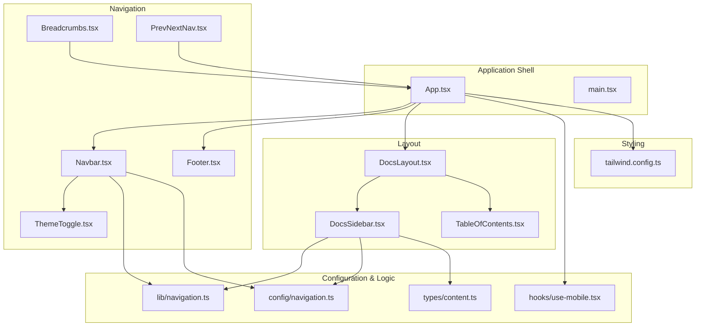
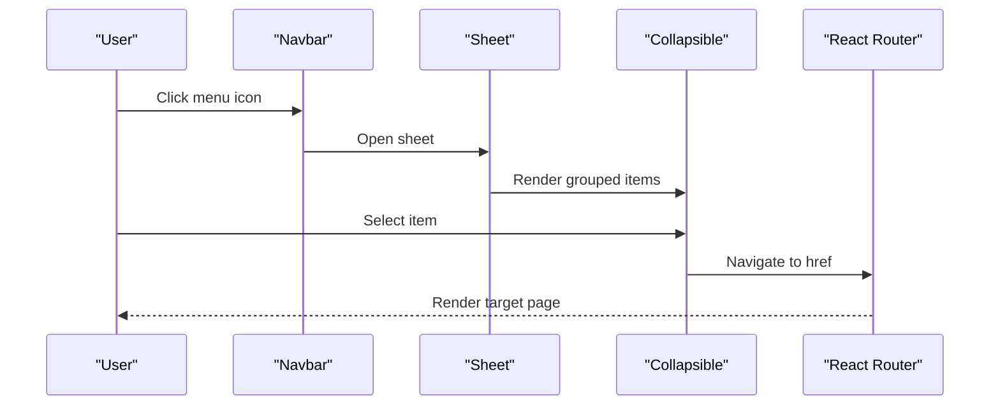
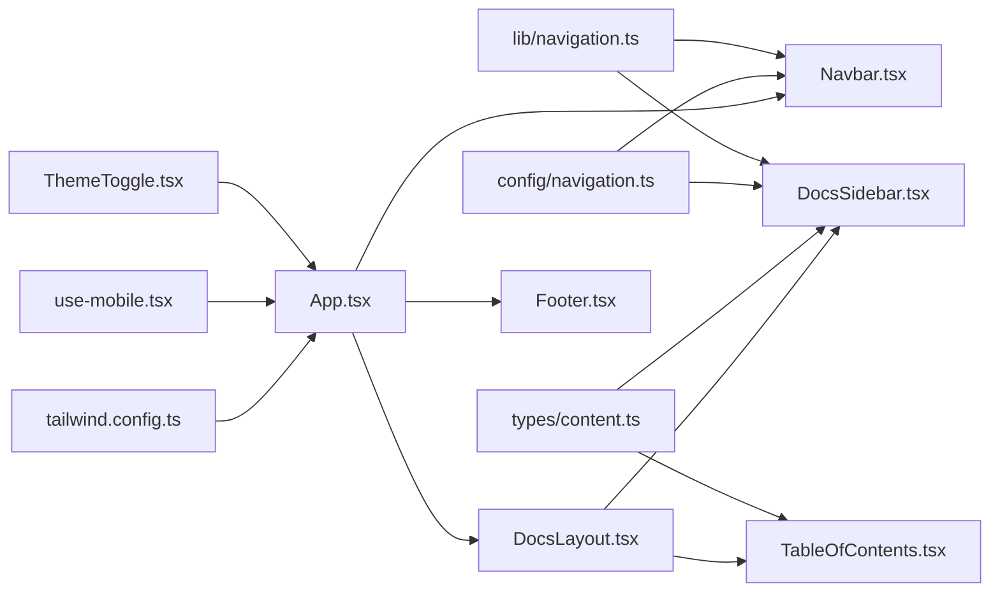

# Navigation and Layout System

<cite>
**Referenced Files in This Document**
- [Navbar.tsx](file://src/components/navigation/Navbar.tsx)
- [Footer.tsx](file://src/components/navigation/Footer.tsx)
- [DocsLayout.tsx](file://src/components/layout/DocsLayout.tsx)
- [Breadcrumbs.tsx](file://src/components/navigation/Breadcrumbs.tsx)
- [TableOfContents.tsx](file://src/components/navigation/TableOfContents.tsx)
- [DocsSidebar.tsx](file://src/components/navigation/DocsSidebar.tsx)
- [PrevNextNav.tsx](file://src/components/navigation/PrevNextNav.tsx)
- [ThemeToggle.tsx](file://src/components/shared/ThemeToggle.tsx)
- [navigation.ts](file://src/lib/navigation.ts)
- [navigation.ts (config)](file://src/config/navigation.ts)
- [content.ts (types)](file://src/types/content.ts)
- [use-mobile.tsx](file://src/hooks/use-mobile.tsx)
- [App.tsx](file://src/App.tsx)
- [main.tsx](file://src/main.tsx)
- [tailwind.config.ts](file://src/tailwind.config.ts)
</cite>

## Table of Contents
1. [Introduction](#introduction)
2. [Project Structure](#project-structure)
3. [Core Components](#core-components)
4. [Architecture Overview](#architecture-overview)
5. [Detailed Component Analysis](#detailed-component-analysis)
6. [Dependency Analysis](#dependency-analysis)
7. [Performance Considerations](#performance-considerations)
8. [Troubleshooting Guide](#troubleshooting-guide)
9. [Conclusion](#conclusion)

## Introduction
This document explains the navigation and layout system that powers JSphere’s user interface. It covers the Navbar with logo, desktop and mobile menus, and theme toggle; the Footer with sitemap and legal information; the DocsLayout that orchestrates content presentation with sidebar, main content, and table of contents; the Breadcrumbs for hierarchical orientation; the TableOfContents for in-page navigation; the DocsSidebar for content browsing; and the PrevNextNav for sequential navigation. It also documents responsive design patterns, component composition, state management, accessibility features, and the integration with the routing system, including active link highlighting and smooth scrolling behavior.

## Project Structure
The navigation and layout system is organized by feature and domain:
- Navigation components live under src/components/navigation
- Layout components live under src/components/layout
- Shared components (ThemeToggle) live under src/components/shared
- Navigation configuration and resolution logic live under src/config and src/lib
- Types for content and navigation live under src/types
- Responsive utilities live under src/hooks
- Application shell and routing live under src/App.tsx and src/main.tsx
- Tailwind configuration defines responsive breakpoints and dark mode behavior

**Diagram sources**
- [App.tsx:1-103](file://src/App.tsx#L1-L103)
- [Navbar.tsx:1-183](file://src/components/navigation/Navbar.tsx#L1-L183)
- [Footer.tsx:1-91](file://src/components/navigation/Footer.tsx#L1-L91)
- [DocsLayout.tsx:1-26](file://src/components/layout/DocsLayout.tsx#L1-L26)
- [DocsSidebar.tsx:1-68](file://src/components/navigation/DocsSidebar.tsx#L1-L68)
- [TableOfContents.tsx:1-68](file://src/components/navigation/TableOfContents.tsx#L1-L68)
- [Breadcrumbs.tsx:1-34](file://src/components/navigation/Breadcrumbs.tsx#L1-L34)
- [PrevNextNav.tsx:1-45](file://src/components/navigation/PrevNextNav.tsx#L1-L45)
- [ThemeToggle.tsx:1-30](file://src/components/shared/ThemeToggle.tsx#L1-L30)
- [navigation.ts:1-74](file://src/lib/navigation.ts#L1-L74)
- [navigation.ts (config):1-531](file://src/config/navigation.ts#L1-L531)
- [content.ts (types):1-169](file://src/types/content.ts#L1-L169)
- [use-mobile.tsx:1-20](file://src/hooks/use-mobile.tsx#L1-L20)
- [tailwind.config.ts:1-104](file://src/tailwind.config.ts#L1-L104)

**Section sources**
- [App.tsx:1-103](file://src/App.tsx#L1-L103)
- [main.tsx:1-6](file://src/main.tsx#L1-L6)
- [tailwind.config.ts:1-104](file://src/tailwind.config.ts#L1-L104)

## Core Components
- Navbar: Provides logo, desktop mega menu navigation, mobile sheet menu, search trigger, and theme toggle. Uses resolved navigation data and integrates with the routing system.
- Footer: Renders a multi-column sitemap and legal attribution.
- DocsLayout: Orchestrates sidebar, main content area, and table of contents with responsive padding and sticky positioning.
- Breadcrumbs: Presents hierarchical navigation with home and current page awareness.
- TableOfContents: Generates a sticky, keyboard-accessible navigation from page headings with intersection observer-based active state.
- DocsSidebar: Collapsible sidebar grouped by pillars with active link highlighting and “Coming Soon” badges.
- PrevNextNav: Offers previous/next navigation controls for sequential content consumption.
- ThemeToggle: Manages light/dark mode persistence and toggling via class on the root element.

**Section sources**
- [Navbar.tsx:24-183](file://src/components/navigation/Navbar.tsx#L24-L183)
- [Footer.tsx:39-91](file://src/components/navigation/Footer.tsx#L39-L91)
- [DocsLayout.tsx:12-26](file://src/components/layout/DocsLayout.tsx#L12-L26)
- [Breadcrumbs.tsx:13-34](file://src/components/navigation/Breadcrumbs.tsx#L13-L34)
- [TableOfContents.tsx:9-68](file://src/components/navigation/TableOfContents.tsx#L9-L68)
- [DocsSidebar.tsx:13-68](file://src/components/navigation/DocsSidebar.tsx#L13-L68)
- [PrevNextNav.tsx:9-45](file://src/components/navigation/PrevNextNav.tsx#L9-L45)
- [ThemeToggle.tsx:5-30](file://src/components/shared/ThemeToggle.tsx#L5-L30)

## Architecture Overview
The navigation system is driven by configuration and runtime resolution:
- Configuration defines top navigation sections and sidebar groups per pillar.
- Resolution functions compute availability and enrich items with content metadata.
- Components render navigation UI and integrate with React Router for active states and routing.
- Tailwind CSS provides responsive breakpoints and dark mode support.

**Diagram sources**
- [Navbar.tsx:120-178](file://src/components/navigation/Navbar.tsx#L120-L178)
- [DocsSidebar.tsx:24-62](file://src/components/navigation/DocsSidebar.tsx#L24-L62)

## Detailed Component Analysis

### Navbar Component
Responsibilities:
- Renders the brand logo and name.
- Builds a desktop navigation using a navigation menu with grouped items and descriptions.
- Provides a mobile sheet menu with collapsible sections and “Soon” indicators.
- Integrates a search trigger and a theme toggle.
- Uses resolved navigation data to mark items as available or coming soon.

Responsive behavior:
- Desktop menu visible from medium breakpoint; mobile menu activates below large breakpoint.
- Mobile menu uses a sheet overlay with a left-side panel and collapsible groups.

Accessibility:
- Uses semantic links and buttons with appropriate ARIA roles and labels.
- Keyboard navigation supported in interactive elements.

State management:
- Tracks mobile menu open state locally.
- Deactivates mobile menu after selecting a link.

Integration with routing:
- Links use React Router’s Link; active states are handled by downstream components (e.g., DocsSidebar).

Implementation highlights:
- Desktop menu grid sizing varies by section to accommodate content density.
- “Coming Soon” items display badges and reduced opacity.

**Section sources**
- [Navbar.tsx:24-183](file://src/components/navigation/Navbar.tsx#L24-L183)
- [navigation.ts:28-43](file://src/lib/navigation.ts#L28-L43)
- [navigation.ts (config):62-262](file://src/config/navigation.ts#L62-L262)

### Footer Component
Responsibilities:
- Renders a multi-column sitemap grouped by major sections (Learn, Reference, Build, Explore).
- Displays a brand identity and legal attribution text.

Structure:
- Grid layout adapts columns based on viewport.
- Each column lists section links pointing to routes.

Accessibility:
- Links are styled for hover and focus states; no explicit ARIA attributes are used beyond defaults.

**Section sources**
- [Footer.tsx:39-91](file://src/components/navigation/Footer.tsx#L39-L91)

### DocsLayout Component
Responsibilities:
- Composes DocsSidebar, main content area, and TableOfContents.
- Applies responsive padding and centers content within a constrained width.

Behavior:
- Sidebar is hidden on small screens; TOC is hidden until extra-large screens.
- Main content area receives child content nodes.

Responsive design:
- Uses Tailwind utilities for padding and screen-specific adjustments.

**Section sources**
- [DocsLayout.tsx:12-26](file://src/components/layout/DocsLayout.tsx#L12-L26)

### Breadcrumbs Component
Responsibilities:
- Displays a breadcrumb trail with a home link and subsequent items.
- Highlights the current page and makes prior items navigable.

Behavior:
- Last item is non-clickable and styled as the active label.
- Uses router Link for navigable items.

Accessibility:
- Includes an explicit aria-label for screen readers.

**Section sources**
- [Breadcrumbs.tsx:13-34](file://src/components/navigation/Breadcrumbs.tsx#L13-L34)

### TableOfContents Component
Responsibilities:
- Generates a sticky, right-aligned navigation from page headings.
- Tracks the active heading using an intersection observer.
- Supports keyboard activation for accessibility.

Behavior:
- Observes headings with a root margin to determine active state.
- Adds indentation for nested levels and applies active styles.
- Smooth scrolls to target headings on Enter/Space.

Accessibility:
- Keyboard support for activation.
- Focus-visible ring for keyboard navigation.

**Section sources**
- [TableOfContents.tsx:9-68](file://src/components/navigation/TableOfContents.tsx#L9-L68)

### DocsSidebar Component
Responsibilities:
- Renders a collapsible sidebar for a given pillar.
- Highlights the currently active item.
- Marks unavailable items with “Soon” badges.

Behavior:
- Uses location pathname to determine active state.
- Collapsible groups default to open if any child is active.
- Integrates with resolved sidebar groups and content metadata.

Accessibility:
- Uses semantic markup and hover/focus states.

**Section sources**
- [DocsSidebar.tsx:13-68](file://src/components/navigation/DocsSidebar.tsx#L13-L68)
- [navigation.ts:45-57](file://src/lib/navigation.ts#L45-L57)
- [navigation.ts (config):266-523](file://src/config/navigation.ts#L266-L523)

### PrevNextNav Component
Responsibilities:
- Provides Previous/Next navigation controls for sequential content.
- Conditionally renders based on presence of prev/next data.

Behavior:
- Left control for previous; right control for next.
- Hover animations enhance affordance.

**Section sources**
- [PrevNextNav.tsx:9-45](file://src/components/navigation/PrevNextNav.tsx#L9-L45)

### ThemeToggle Component
Responsibilities:
- Switches between light and dark themes.
- Persists user preference in localStorage.
- Initializes theme based on system preference if no stored preference exists.

Behavior:
- Toggles a class on the root element to drive Tailwind dark mode.
- Uses an accessible button with an aria-label.

**Section sources**
- [ThemeToggle.tsx:5-30](file://src/components/shared/ThemeToggle.tsx#L5-L30)
- [tailwind.config.ts:4-6](file://src/tailwind.config.ts#L4-L6)

## Dependency Analysis
Key relationships:
- Navbar depends on resolved navigation data and configuration to build the desktop menu and on ThemeToggle for theme switching.
- DocsLayout composes DocsSidebar and TableOfContents and relies on content types for headings.
- DocsSidebar and DocsLayout depend on navigation resolution and content metadata to compute availability and active states.
- App wires routing, error boundaries, and the global Navbar/Footer, while integrating search modal and theme toggle.

**Diagram sources**
- [navigation.ts:1-74](file://src/lib/navigation.ts#L1-L74)
- [navigation.ts (config):1-531](file://src/config/navigation.ts#L1-L531)
- [content.ts (types):1-169](file://src/types/content.ts#L1-L169)
- [Navbar.tsx:18-26](file://src/components/navigation/Navbar.tsx#L18-L26)
- [DocsSidebar.tsx:6-15](file://src/components/navigation/DocsSidebar.tsx#L6-L15)
- [TableOfContents.tsx:3](file://src/components/navigation/TableOfContents.tsx#L3)
- [App.tsx:8-93](file://src/App.tsx#L8-L93)
- [DocsLayout.tsx:2-4](file://src/components/layout/DocsLayout.tsx#L2-L4)
- [ThemeToggle.tsx:1-30](file://src/components/shared/ThemeToggle.tsx#L1-L30)
- [use-mobile.tsx:1-20](file://src/hooks/use-mobile.tsx#L1-L20)
- [tailwind.config.ts:1-104](file://src/tailwind.config.ts#L1-L104)

**Section sources**
- [navigation.ts:28-65](file://src/lib/navigation.ts#L28-L65)
- [App.tsx:40-103](file://src/App.tsx#L40-L103)

## Performance Considerations
- Intersection Observer in TableOfContents: Efficiently tracks active headings without polling; adjust thresholds and margins to balance responsiveness and performance.
- Collapsible components: Rendering large nested lists can be expensive; consider virtualization or lazy loading for very large sidebars.
- Navigation resolution: Computation occurs once per navigation change; keep configuration structures lean and avoid unnecessary re-renders by memoizing where appropriate.
- Responsive rendering: Hide heavy components (TOC, sidebar) at smaller breakpoints to reduce layout thrashing.

## Troubleshooting Guide
- Active link highlighting not working:
  - Verify that DocsSidebar compares the current pathname against item hrefs and that the active class is applied conditionally.
  - Confirm that the route structure matches the expected hrefs used in navigation configuration.
- Mobile menu not closing:
  - Ensure the mobile menu state is reset after selection in the mobile sheet menu.
- Theme toggle not persisting:
  - Confirm that the root element class toggles and localStorage writes occur on toggle.
  - Check that Tailwind dark mode is configured to use the class strategy.
- TableOfContents not updating:
  - Validate that headings are present and have IDs; ensure the intersection observer is observing the correct elements.
  - Confirm that the headings prop is passed correctly from the parent page component.
- Breadcrumbs incorrect:
  - Ensure the items array reflects the intended hierarchy and that the last item is non-clickable.

**Section sources**
- [DocsSidebar.tsx:22-42](file://src/components/navigation/DocsSidebar.tsx#L22-L42)
- [Navbar.tsx:152-152](file://src/components/navigation/Navbar.tsx#L152-L152)
- [ThemeToggle.tsx:16-22](file://src/components/shared/ThemeToggle.tsx#L16-L22)
- [tailwind.config.ts:4-6](file://src/tailwind.config.ts#L4-L6)
- [TableOfContents.tsx:12-30](file://src/components/navigation/TableOfContents.tsx#L12-L30)
- [Breadcrumbs.tsx:22-28](file://src/components/navigation/Breadcrumbs.tsx#L22-L28)

## Conclusion
JSphere’s navigation and layout system combines configurable, resolution-driven navigation with robust UI components to deliver a coherent, accessible, and responsive experience. Navbar and Footer anchor the global navigation; DocsLayout, DocsSidebar, and TableOfContents orchestrate content discovery; Breadcrumbs and PrevNextNav improve orientation and flow. ThemeToggle ensures user preference is honored. Together, these components integrate tightly with React Router and Tailwind to provide a scalable foundation for content-rich documentation sites.