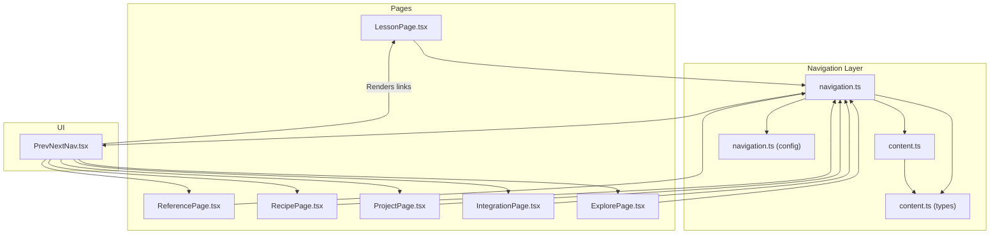
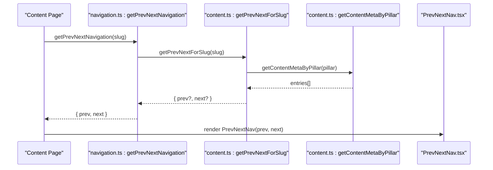
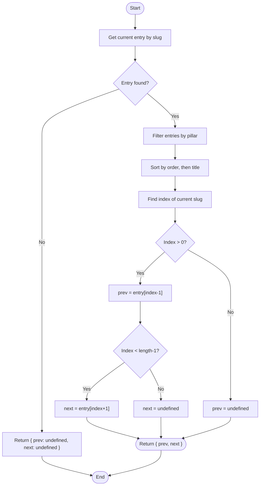
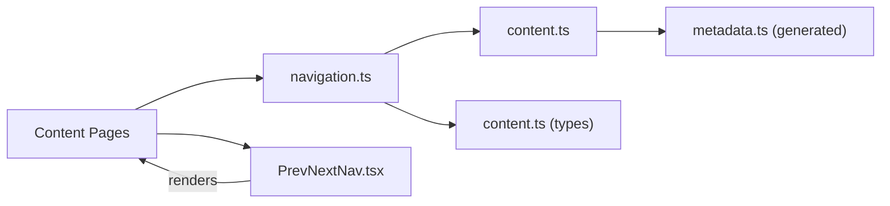

# Previous/Next Navigation

<cite>
**Referenced Files in This Document**
- [PrevNextNav.tsx](file://src/components/navigation/PrevNextNav.tsx)
- [navigation.ts](file://src/lib/navigation.ts)
- [content.ts](file://src/lib/content.ts)
- [navigation.ts (config)](file://src/config/navigation.ts)
- [content.ts (types)](file://src/types/content.ts)
- [LessonPage.tsx](file://src/features/learn/LessonPage.tsx)
- [ReferencePage.tsx](file://src/features/reference/ReferencePage.tsx)
- [RecipePage.tsx](file://src/features/recipes/RecipePage.tsx)
- [ProjectPage.tsx](file://src/features/projects/ProjectPage.tsx)
- [IntegrationPage.tsx](file://src/features/integrations/IntegrationPage.tsx)
- [ExplorePage.tsx](file://src/features/explore/ExplorePage.tsx)
- [use-content-page.ts](file://src/hooks/use-content-page.ts)
- [user-library.ts](file://src/lib/user-library.ts)
- [generate-content.mjs](file://scripts/generate-content.mjs)
- [metadata.ts (generated)](file://src/content/generated/metadata.ts)
</cite>

## Table of Contents
1. [Introduction](#introduction)
2. [Project Structure](#project-structure)
3. [Core Components](#core-components)
4. [Architecture Overview](#architecture-overview)
5. [Detailed Component Analysis](#detailed-component-analysis)
6. [Dependency Analysis](#dependency-analysis)
7. [Performance Considerations](#performance-considerations)
8. [Troubleshooting Guide](#troubleshooting-guide)
9. [Conclusion](#conclusion)
10. [Appendices](#appendices)

## Introduction
This document explains the Previous/Next navigation component used for sequential content browsing within JSphere’s documentation structure. It covers the navigation algorithm that leverages content metadata and slug-based ordering, integration with content relationships and hierarchical navigation patterns, styling and interaction behavior, keyboard accessibility, and user progress tracking integration. It also provides guidance on customizing navigation behavior, handling content gaps and category boundaries, and extending the system for special content types.

## Project Structure
The Previous/Next navigation is implemented as a small UI component that receives precomputed navigation hints from a navigation library. The navigation library resolves the previous and next items by consulting content metadata and grouping entries by pillar. The pages render the component at the bottom of content layouts.

**Diagram sources**
- [LessonPage.tsx:40](file://src/features/learn/LessonPage.tsx#L40)
- [ReferencePage.tsx:48](file://src/features/reference/ReferencePage.tsx#L48)
- [RecipePage.tsx:39](file://src/features/recipes/RecipePage.tsx#L39)
- [ProjectPage.tsx:40](file://src/features/projects/ProjectPage.tsx#L40)
- [IntegrationPage.tsx:40](file://src/features/integrations/IntegrationPage.tsx#L40)
- [ExplorePage.tsx:38](file://src/features/explore/ExplorePage.tsx#L38)
- [navigation.ts:59-65](file://src/lib/navigation.ts#L59-L65)
- [content.ts:91-101](file://src/lib/content.ts#L91-L101)
- [PrevNextNav.tsx:9-44](file://src/components/navigation/PrevNextNav.tsx#L9-L44)

**Section sources**
- [PrevNextNav.tsx:1-45](file://src/components/navigation/PrevNextNav.tsx#L1-L45)
- [navigation.ts:59-65](file://src/lib/navigation.ts#L59-L65)
- [content.ts:91-101](file://src/lib/content.ts#L91-L101)
- [navigation.ts (config):266-523](file://src/config/navigation.ts#L266-L523)
- [content.ts (types):1-169](file://src/types/content.ts#L1-L169)

## Core Components
- PrevNextNav: A lightweight component that renders “Previous” and “Next” links based on props. It handles disabled states when either direction is unavailable and applies consistent styling and hover effects.
- Navigation resolver: Provides getPrevNextNavigation(slug) that computes prev/next items by grouping content by pillar and ordering by the numeric order field.
- Content metadata: The content metadata includes a numeric order field and a slug, enabling deterministic sequential ordering per pillar.
- Page integration: Each content page computes prev/next via getPrevNextNavigation and passes the result to PrevNextNav.

Key behaviors:
- Sequential ordering within a pillar is derived from the order field and title fallback.
- Boundary conditions: If the current item is the first or last in the sorted list, the respective link is omitted.
- Disabled state handling: When a direction is unavailable, the component renders an empty spacer instead of a link.

**Section sources**
- [PrevNextNav.tsx:9-44](file://src/components/navigation/PrevNextNav.tsx#L9-L44)
- [navigation.ts:59-65](file://src/lib/navigation.ts#L59-L65)
- [content.ts:15-20](file://src/lib/content.ts#L15-L20)
- [content.ts:91-101](file://src/lib/content.ts#L91-L101)

## Architecture Overview
The navigation algorithm operates in two layers:
- Data layer: content metadata is loaded and sorted by order, then by title within the same pillar.
- Navigation layer: given a slug, locate the current entry, find its index in the sorted list, and pick adjacent entries as prev/next.

**Diagram sources**
- [navigation.ts:59-65](file://src/lib/navigation.ts#L59-L65)
- [content.ts:91-101](file://src/lib/content.ts#L91-L101)
- [content.ts:44-46](file://src/lib/content.ts#L44-L46)
- [PrevNextNav.tsx:9-44](file://src/components/navigation/PrevNextNav.tsx#L9-L44)

## Detailed Component Analysis

### PrevNextNav Component
PrevNextNav is a presentational component that:
- Accepts optional prev and next props with label and href.
- Renders a left-aligned Previous link and a right-aligned Next link.
- Uses a flex container to stretch links and leave space when one side is absent.
- Applies hover and focus-friendly transitions and spacing.

Styling and interaction highlights:
- Rounded borders, padding, and hover background transitions.
- Icons animate slightly on hover to reinforce interactivity.
- Disabled state: when a direction is unavailable, the component renders an empty spacer with the same flex weight to preserve layout.

Accessibility and keyboard support:
- Links are standard anchor elements with semantic labels.
- No explicit keyboard shortcuts are implemented in this component; pages can wire global shortcuts externally if desired.

**Section sources**
- [PrevNextNav.tsx:9-44](file://src/components/navigation/PrevNextNav.tsx#L9-L44)

### Navigation Algorithm
The algorithm relies on:
- Pillar-scoped sorting: entries are grouped by pillar and sorted by order, then by title.
- Index lookup: the current slug’s index determines neighbors.
- Boundary handling: first and last items yield undefined for prev/next respectively.

**Diagram sources**
- [content.ts:91-101](file://src/lib/content.ts#L91-L101)
- [content.ts:15-20](file://src/lib/content.ts#L15-L20)

**Section sources**
- [content.ts:91-101](file://src/lib/content.ts#L91-L101)
- [content.ts:15-20](file://src/lib/content.ts#L15-L20)

### Integration with Content Relationships and Hierarchies
- Hierarchical navigation: The navigation respects the documentation hierarchy by grouping entries by pillar and category. The algorithm ensures continuity within a pillar and category.
- Content relationships: While PrevNextNav itself does not use relatedTopics, the content metadata supports cross-linking via relatedTopics, which is used elsewhere in the app (e.g., RelatedTopics component in pages).
- Category boundaries: The algorithm operates within a single pillar. Cross-category navigation is handled by higher-level navigation menus and breadcrumbs.

**Section sources**
- [navigation.ts (config):266-523](file://src/config/navigation.ts#L266-L523)
- [content.ts (types):78-84](file://src/types/content.ts#L78-L84)

### Button Styling, Hover Effects, and Disabled States
- Consistent spacing and alignment: Flex layout with equal weights for both sides; when one side is disabled, a spacer maintains symmetry.
- Hover effects: Subtle background transitions and icon translation enhance affordance without distracting from content.
- Disabled state: Absent directions are represented by empty spacers rather than disabled buttons, preserving layout and avoiding focus trap issues.

**Section sources**
- [PrevNextNav.tsx:13-41](file://src/components/navigation/PrevNextNav.tsx#L13-L41)

### Keyboard Shortcuts, Accessibility, and Screen Reader Support
- No built-in keyboard shortcuts in PrevNextNav.
- Accessibility: Links are anchors with descriptive labels (“Previous”, “Next”) and titles. Screen readers will announce the labels and titles.
- Focus management: Standard anchor focus behavior; ensure external shortcuts (if added) do not steal focus from interactive elements.

**Section sources**
- [PrevNextNav.tsx:19-37](file://src/components/navigation/PrevNextNav.tsx#L19-L37)

### Handling Content Gaps, Category Boundaries, and Special Content Types
- Content gaps: If entries are missing from the metadata, they simply won’t appear in the sorted list; the algorithm will skip them naturally.
- Category boundaries: The algorithm filters by pillar, so transitions do not cross categories.
- Special content types: The algorithm treats all content types uniformly because it sorts by order and title. If special content types require custom ordering, adjust the order field accordingly.

**Section sources**
- [content.ts:44-46](file://src/lib/content.ts#L44-L46)
- [content.ts (types):3](file://src/types/content.ts#L3-L12)

### Customizing Navigation Behavior
Examples of customization strategies:
- Custom ordering: Adjust the order field in content metadata to reflect preferred sequencing.
- Category-aware ordering: If you want to mix categories while maintaining order, consider introducing a composite sort key or a separate navigation config for cross-category sequences.
- Conditional navigation: Pages can override or augment navigation by computing prev/next differently before passing to PrevNextNav.
- Special content types: For content types that should be skipped or grouped differently, preprocess the metadata or introduce a dedicated navigation resolver.

Implementation pointers:
- Modify order fields in content metadata to influence sequential order.
- Extend getPrevNextForSlug to incorporate additional rules (e.g., tags, categories).
- Introduce a navigation config similar to the existing sidebar config for cross-category sequences.

**Section sources**
- [content.ts:15-20](file://src/lib/content.ts#L15-L20)
- [content.ts:91-101](file://src/lib/content.ts#L91-L101)
- [navigation.ts (config):266-523](file://src/config/navigation.ts#L266-L523)

### Integrating with User Progress Tracking
- The pages already track user progress and record recent views. PrevNextNav can be combined with progress indicators to highlight completion status or suggest next steps.
- To integrate progress with navigation:
  - Pass progress percentage to PrevNextNav to visually indicate completion.
  - Use progress to customize labels (e.g., “Continue” for partially completed items).
  - Persist progress updates when navigating via PrevNextNav.

**Section sources**
- [LessonPage.tsx:24](file://src/features/learn/LessonPage.tsx#L24)
- [use-content-page.ts:25-34](file://src/hooks/use-content-page.ts#L25-L34)
- [user-library.ts:150-158](file://src/lib/user-library.ts#L150-L158)

## Dependency Analysis
The navigation pipeline connects UI, navigation logic, and content metadata:

**Diagram sources**
- [LessonPage.tsx:40](file://src/features/learn/LessonPage.tsx#L40)
- [navigation.ts:59-65](file://src/lib/navigation.ts#L59-L65)
- [content.ts:91-101](file://src/lib/content.ts#L91-L101)
- [PrevNextNav.tsx:9-44](file://src/components/navigation/PrevNextNav.tsx#L9-L44)
- [metadata.ts (generated):1-800](file://src/content/generated/metadata.ts#L1-L800)

**Section sources**
- [navigation.ts:59-65](file://src/lib/navigation.ts#L59-L65)
- [content.ts:91-101](file://src/lib/content.ts#L91-L101)
- [PrevNextNav.tsx:9-44](file://src/components/navigation/PrevNextNav.tsx#L9-L44)

## Performance Considerations
- Sorting cost: The algorithm sorts by order and title for the current pillar. Since content is grouped by pillar, the cost is proportional to the number of entries in that pillar.
- Memoization: If pages compute prev/next frequently, cache results keyed by slug to avoid repeated recomputation.
- Rendering: PrevNextNav is lightweight; keep it outside of hot rendering paths to minimize re-renders.

## Troubleshooting Guide
Common issues and resolutions:
- Missing prev/next: Verify the current slug exists in metadata and belongs to a recognized pillar.
- Incorrect order: Ensure the order field is set consistently and that titles are unique enough to break ties.
- Broken links: Confirm that hrefs are constructed as "/{slug}" and that slugs are valid routes.
- Empty spaces: When a direction is unavailable, the component intentionally renders an empty spacer; this is expected behavior.

**Section sources**
- [navigation.ts:59-65](file://src/lib/navigation.ts#L59-L65)
- [content.ts:91-101](file://src/lib/content.ts#L91-L101)
- [PrevNextNav.tsx:25-27](file://src/components/navigation/PrevNextNav.tsx#L25-L27)
- [PrevNextNav.tsx:39-41](file://src/components/navigation/PrevNextNav.tsx#L39-L41)

## Conclusion
The Previous/Next navigation component provides a robust, efficient way to enable sequential content browsing within JSphere’s documentation. By leveraging content metadata and pillar-scoped ordering, it delivers predictable navigation that reduces cognitive load and improves user workflow. Its simple design allows easy customization for special content types, cross-category sequences, and integration with progress tracking.

## Appendices

### How Content Metadata Drives Navigation
- The content generation script extracts metadata from content modules and writes a sorted list to metadata.ts.
- The navigation library reads this list, filters by pillar, and sorts by order and title.
- The algorithm uses the index of the current entry to compute prev/next.

**Section sources**
- [generate-content.mjs:113-126](file://scripts/generate-content.mjs#L113-L126)
- [metadata.ts (generated):7-800](file://src/content/generated/metadata.ts#L7-L800)
- [content.ts:44-46](file://src/lib/content.ts#L44-L46)
- [content.ts:15-20](file://src/lib/content.ts#L15-L20)