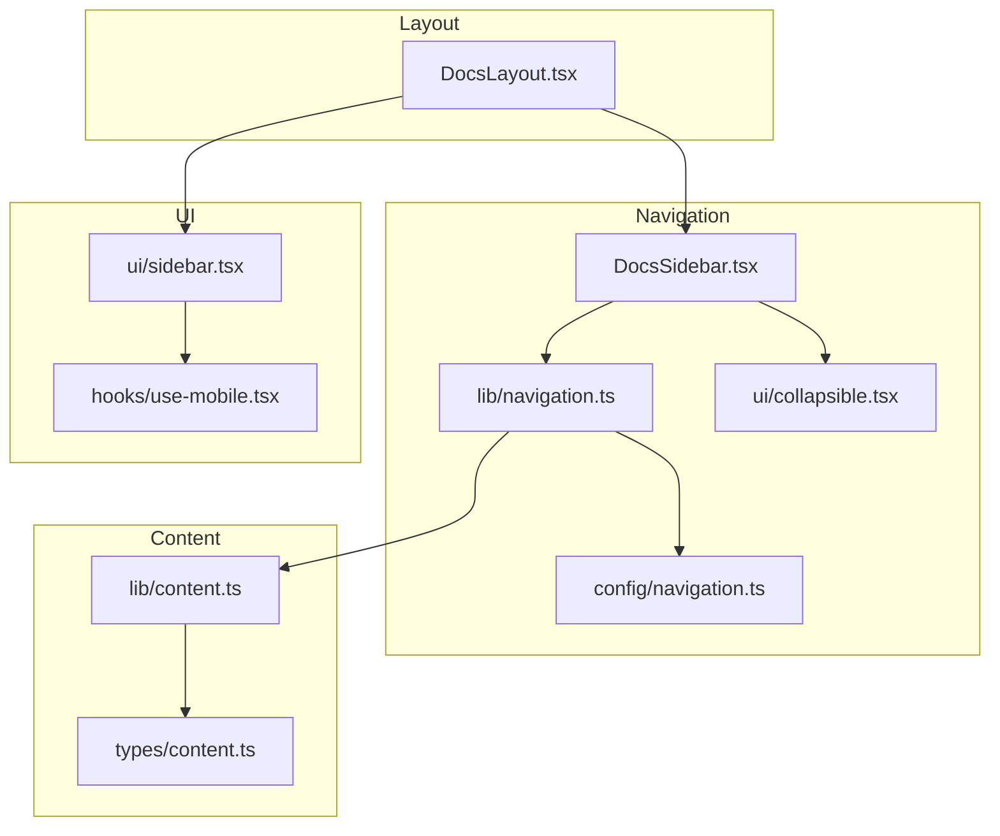
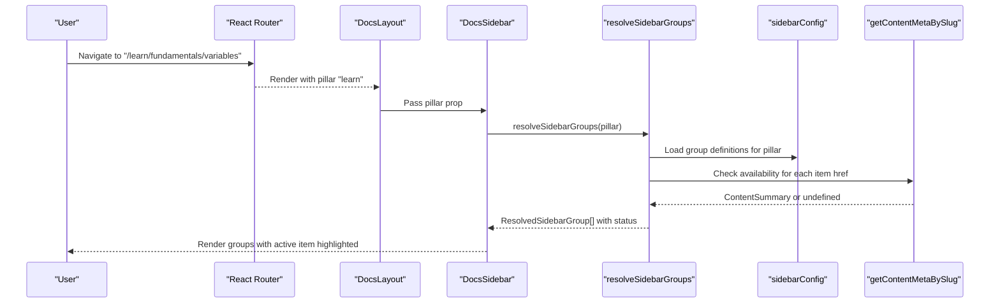
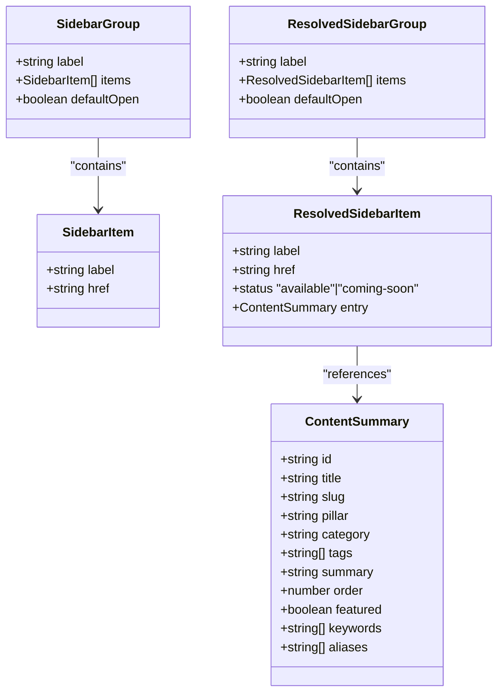
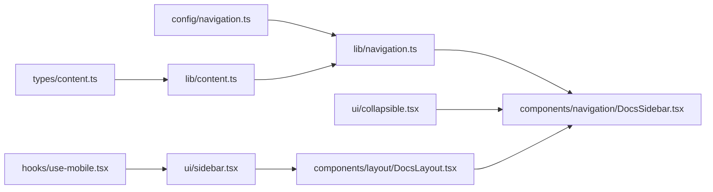

# Sidebar Navigation

<cite>
**Referenced Files in This Document**
- [DocsSidebar.tsx](file://src/components/navigation/DocsSidebar.tsx)
- [DocsLayout.tsx](file://src/components/layout/DocsLayout.tsx)
- [navigation.ts](file://src/lib/navigation.ts)
- [navigation.ts](file://src/config/navigation.ts)
- [categories.ts](file://src/config/categories.ts)
- [content.ts](file://src/lib/content.ts)
- [search.ts](file://src/lib/search.ts)
- [collapsible.tsx](file://src/components/ui/collapsible.tsx)
- [sidebar.tsx](file://src/components/ui/sidebar.tsx)
- [use-mobile.tsx](file://src/hooks/use-mobile.tsx)
- [content.ts](file://src/types/content.ts)
</cite>

## Table of Contents
1. [Introduction](#introduction)
2. [Project Structure](#project-structure)
3. [Core Components](#core-components)
4. [Architecture Overview](#architecture-overview)
5. [Detailed Component Analysis](#detailed-component-analysis)
6. [Dependency Analysis](#dependency-analysis)
7. [Performance Considerations](#performance-considerations)
8. [Troubleshooting Guide](#troubleshooting-guide)
9. [Conclusion](#conclusion)

## Introduction
This document explains the DocsSidebar component that powers hierarchical navigation and content browsing for JSphere’s documentation. It covers the sidebar data model, integration with category-based navigation and content metadata, expandable/collapsible behavior, active item highlighting, nested menu rendering, mobile-responsive design, touch-friendly interactions, search integration, keyboard navigation, accessibility features, customization patterns, and performance optimization for large navigation trees.

## Project Structure
The DocsSidebar is part of the navigation subsystem and integrates with layout and content resolution utilities:
- DocsSidebar renders the sidebar for a given pillar.
- DocsLayout composes the page layout and places DocsSidebar alongside main content and a table of contents.
- navigation.ts resolves sidebar groups from configuration and enriches them with content availability.
- content.ts provides content metadata used to compute availability and grouping.
- categories.ts defines pillar-level configuration for branding and ordering.
- search.ts provides client-side search utilities used across the app (including in the sidebar context).
- collapsible.tsx and sidebar.tsx provide reusable UI primitives for collapsible sections and responsive sidebar behavior.

**Diagram sources**
- [DocsLayout.tsx:12-25](file://src/components/layout/DocsLayout.tsx#L12-L25)
- [DocsSidebar.tsx:13-67](file://src/components/navigation/DocsSidebar.tsx#L13-L67)
- [navigation.ts:45-57](file://src/lib/navigation.ts#L45-L57)
- [navigation.ts:266-523](file://src/config/navigation.ts#L266-L523)
- [collapsible.tsx:1-10](file://src/components/ui/collapsible.tsx#L1-L10)
- [content.ts:1-126](file://src/lib/content.ts#L1-L126)
- [content.ts:30-70](file://src/types/content.ts#L30-L70)
- [sidebar.tsx:1-638](file://src/components/ui/sidebar.tsx#L1-L638)
- [use-mobile.tsx:1-20](file://src/hooks/use-mobile.tsx#L1-L20)

**Section sources**
- [DocsLayout.tsx:12-25](file://src/components/layout/DocsLayout.tsx#L12-L25)
- [DocsSidebar.tsx:13-67](file://src/components/navigation/DocsSidebar.tsx#L13-L67)
- [navigation.ts:45-57](file://src/lib/navigation.ts#L45-L57)
- [navigation.ts:266-523](file://src/config/navigation.ts#L266-L523)
- [collapsible.tsx:1-10](file://src/components/ui/collapsible.tsx#L1-L10)
- [content.ts:1-126](file://src/lib/content.ts#L1-L126)
- [content.ts:30-70](file://src/types/content.ts#L30-L70)
- [sidebar.tsx:1-638](file://src/components/ui/sidebar.tsx#L1-L638)
- [use-mobile.tsx:1-20](file://src/hooks/use-mobile.tsx#L1-L20)

## Core Components
- DocsSidebar: Renders a sticky, scrollable sidebar for a given pillar with collapsible groups and active item highlighting.
- Navigation resolver: Transforms static sidebar configuration into resolved groups enriched with content availability and metadata.
- Content metadata: Provides lookup and sorting for content entries used to determine availability and grouping.
- UI primitives: Collapsible components for expand/collapse behavior; a responsive sidebar component for mobile and desktop.

Key responsibilities:
- Build hierarchical menus from configuration per pillar.
- Resolve item availability from content metadata.
- Highlight the active item based on the current route.
- Provide expandable/collapsible groups with default open states.
- Integrate with layout for desktop and mobile experiences.

**Section sources**
- [DocsSidebar.tsx:13-67](file://src/components/navigation/DocsSidebar.tsx#L13-L67)
- [navigation.ts:45-57](file://src/lib/navigation.ts#L45-L57)
- [navigation.ts:266-523](file://src/config/navigation.ts#L266-L523)
- [content.ts:1-126](file://src/lib/content.ts#L1-L126)

## Architecture Overview
The sidebar architecture centers on a configuration-driven model and runtime resolution of content availability.

**Diagram sources**
- [DocsLayout.tsx:12-25](file://src/components/layout/DocsLayout.tsx#L12-L25)
- [DocsSidebar.tsx:13-67](file://src/components/navigation/DocsSidebar.tsx#L13-L67)
- [navigation.ts:45-57](file://src/lib/navigation.ts#L45-L57)
- [navigation.ts:266-523](file://src/config/navigation.ts#L266-L523)
- [content.ts:30-32](file://src/lib/content.ts#L30-L32)

## Detailed Component Analysis

### DocsSidebar Component
Responsibilities:
- Accepts a pillar identifier and computes sidebar groups via the resolver.
- Uses collapsible sections to organize groups with expand/collapse affordances.
- Highlights the active item when the current pathname matches an item’s href.
- Marks unavailable items with a “Soon” badge and disabled styles.

Behavioral highlights:
- Sticky positioning with constrained height for long navigation trees.
- Group defaultOpen controlled by configuration and/or active item detection.
- Hover and active states for discoverability and orientation.

Accessibility and UX:
- Uses semantic markup with triggers and content areas.
- Active item receives emphasis for quick reorientation.
- Collapsible transitions animate chevrons and content.

Customization hooks:
- Modify defaultOpen flags in configuration to pre-expand frequently visited sections.
- Add new items to existing groups or create new groups per pillar.
- Extend item metadata (e.g., badges) by adjusting the renderer.

**Section sources**
- [DocsSidebar.tsx:13-67](file://src/components/navigation/DocsSidebar.tsx#L13-L67)

#### Expandable/Collapsible Behavior
- Uses Radix UI collapsible primitives for robust cross-browser behavior.
- Chevron rotation indicates open/closed state.
- Groups default to open when an item inside is active.

**Section sources**
- [DocsSidebar.tsx:24-60](file://src/components/navigation/DocsSidebar.tsx#L24-L60)
- [collapsible.tsx:1-10](file://src/components/ui/collapsible.tsx#L1-L10)

#### Active Item Highlighting
- Active state computed when the current pathname equals an item’s href.
- Visual emphasis applied to the active link for immediate orientation.

**Section sources**
- [DocsSidebar.tsx:22-43](file://src/components/navigation/DocsSidebar.tsx#L22-L43)

#### Nested Menu Rendering
- Groups are rendered as collapsible sections.
- Each group contains a list of items; unavailable items are shown with a “Soon” indicator.

**Section sources**
- [DocsSidebar.tsx:21-62](file://src/components/navigation/DocsSidebar.tsx#L21-L62)

### Navigation Resolution and Data Model
- Configuration: sidebarConfig defines groups per pillar with labels, defaultOpen flags, and items.
- Resolution: resolveSidebarGroups maps configuration to resolved groups, attaching status and content metadata.
- Availability: isContentRouteAvailable determines whether a route corresponds to published content.

Data structures:
- SidebarGroup/SidebarItem define the base structure.
- ResolvedSidebarGroup/ResolvedSidebarItem add status and optional entry metadata.

**Diagram sources**
- [navigation.ts:27-58](file://src/config/navigation.ts#L27-L58)
- [content.ts:51-70](file://src/types/content.ts#L51-L70)

**Section sources**
- [navigation.ts:266-523](file://src/config/navigation.ts#L266-L523)
- [navigation.ts:45-57](file://src/lib/navigation.ts#L45-L57)
- [content.ts:1-126](file://src/lib/content.ts#L1-L126)

### Category-Based Navigation and Content Filtering
- Pillars: Learn, Reference, Integrations, Recipes, Projects, Explore, Errors.
- Each pillar has curated groups and items in sidebarConfig.
- Availability determined by content metadata lookups; missing entries are marked as “coming-soon.”

Integration points:
- getPillarFromPath extracts the pillar from a URL segment.
- getContentMetaByPillar filters content by pillar for suggestions or landing pages.

**Section sources**
- [navigation.ts:527-531](file://src/config/navigation.ts#L527-L531)
- [content.ts:44-46](file://src/lib/content.ts#L44-L46)
- [categories.ts:14-89](file://src/config/categories.ts#L14-L89)

### Mobile-Responsive Design and Touch-Friendly Interactions
- Desktop: Fixed sidebar with collapsible groups and sticky positioning.
- Mobile: Sheet-based off-canvas sidebar toggled via keyboard shortcut or trigger.
- Touch targets: Collapsible triggers and menu actions include larger hit areas on small screens.
- Keyboard shortcut: Toggle sidebar with a platform-appropriate key combination.

**Section sources**
- [DocsSidebar.tsx:18-67](file://src/components/navigation/DocsSidebar.tsx#L18-L67)
- [sidebar.tsx:153-171](file://src/components/ui/sidebar.tsx#L153-L171)
- [sidebar.tsx:79-89](file://src/components/ui/sidebar.tsx#L79-L89)
- [use-mobile.tsx:1-20](file://src/hooks/use-mobile.tsx#L1-L20)

### Search Integration Within Sidebar
- Client-side search scoring and ranking are implemented in search.ts.
- While DocsSidebar itself does not host a search input, the same search engine can power a search modal or page integrated into the layout.
- Suggestion and grouping helpers enable quick discovery across content types.

Implementation notes:
- Use searchContent to query across content summaries.
- Group results by contentType for categorized presentation.
- Announce result counts for accessibility.

**Section sources**
- [search.ts:111-127](file://src/lib/search.ts#L111-L127)
- [search.ts:90-113](file://src/lib/search.ts#L90-L113)

### Keyboard Navigation Support and Accessibility Features
- Active item highlighting improves keyboard focus orientation.
- Collapsible sections use semantic triggers and content regions.
- Screen-reader-friendly labels and states (e.g., chevron rotation) communicate state changes.
- For broader search affordances, see accessibility patterns in the codebase for live regions and skip links.

Note: The sidebar component does not include a dedicated search input; however, the underlying search utilities and accessibility patterns are available for integration.

**Section sources**
- [DocsSidebar.tsx:24-60](file://src/components/navigation/DocsSidebar.tsx#L24-L60)
- [search.ts:367-400](file://src/lib/search.ts#L367-L400)

### Customization Examples
- Customize appearance:
  - Adjust defaultOpen flags in sidebarConfig to pre-expand frequently accessed groups.
  - Use Tailwind utility classes on the sidebar wrapper to change spacing or colors.
- Add custom navigation items:
  - Append items to existing groups or introduce new groups in the pillar’s configuration.
  - Ensure hrefs correspond to published slugs to appear as available.
- Dynamic content updates:
  - Publish new content entries; availability resolves automatically via content metadata lookups.
  - Reorder items by adjusting the order field in content metadata.

**Section sources**
- [navigation.ts:266-523](file://src/config/navigation.ts#L266-L523)
- [content.ts:15-20](file://src/lib/content.ts#L15-L20)

## Dependency Analysis
The sidebar depends on:
- Configuration for structure and defaults.
- Content metadata for availability.
- UI primitives for collapsible behavior and responsive layout.

**Diagram sources**
- [navigation.ts:266-523](file://src/config/navigation.ts#L266-L523)
- [navigation.ts:45-57](file://src/lib/navigation.ts#L45-L57)
- [DocsSidebar.tsx:13-67](file://src/components/navigation/DocsSidebar.tsx#L13-L67)
- [content.ts:1-126](file://src/lib/content.ts#L1-L126)
- [content.ts:30-70](file://src/types/content.ts#L30-L70)
- [collapsible.tsx:1-10](file://src/components/ui/collapsible.tsx#L1-L10)
- [DocsLayout.tsx:12-25](file://src/components/layout/DocsLayout.tsx#L12-L25)
- [sidebar.tsx:1-638](file://src/components/ui/sidebar.tsx#L1-L638)
- [use-mobile.tsx:1-20](file://src/hooks/use-mobile.tsx#L1-L20)

**Section sources**
- [navigation.ts:266-523](file://src/config/navigation.ts#L266-L523)
- [navigation.ts:45-57](file://src/lib/navigation.ts#L45-L57)
- [DocsSidebar.tsx:13-67](file://src/components/navigation/DocsSidebar.tsx#L13-L67)
- [content.ts:1-126](file://src/lib/content.ts#L1-L126)
- [content.ts:30-70](file://src/types/content.ts#L30-L70)
- [collapsible.tsx:1-10](file://src/components/ui/collapsible.tsx#L1-L10)
- [DocsLayout.tsx:12-25](file://src/components/layout/DocsLayout.tsx#L12-L25)
- [sidebar.tsx:1-638](file://src/components/ui/sidebar.tsx#L1-L638)
- [use-mobile.tsx:1-20](file://src/hooks/use-mobile.tsx#L1-L20)

## Performance Considerations
- Keep group counts reasonable; large trees benefit from defaultOpen flags to limit initial rendering.
- Use sticky positioning and constrained height to avoid layout thrashing on long lists.
- Prefer client-side search for small-to-medium content sets; consider server-side search for very large catalogs.
- Debounce search input if integrating a search box within the sidebar.
- Avoid unnecessary re-renders by memoizing resolved groups and content lookups.

[No sources needed since this section provides general guidance]

## Troubleshooting Guide
- An item appears as “Coming Soon”:
  - Verify the slug exists in content metadata; otherwise, the resolver marks it as unavailable.
- A group does not expand:
  - Check defaultOpen flag in configuration and ensure the active item logic does not override it unintentionally.
- Active item highlight not appearing:
  - Confirm the current pathname matches the item href exactly.
- Mobile sidebar not opening:
  - Ensure the keyboard shortcut is triggered with the correct modifier key and that the device is detected as mobile.

**Section sources**
- [navigation.ts:24-26](file://src/lib/navigation.ts#L24-L26)
- [DocsSidebar.tsx:22-43](file://src/components/navigation/DocsSidebar.tsx#L22-L43)
- [sidebar.tsx:79-89](file://src/components/ui/sidebar.tsx#L79-L89)
- [use-mobile.tsx:1-20](file://src/hooks/use-mobile.tsx#L1-L20)

## Conclusion
The DocsSidebar provides a robust, configurable, and accessible navigation layer for JSphere’s documentation. Its configuration-driven design, content-aware availability resolution, and responsive behavior make it suitable for large-scale documentation. By leveraging the provided data model, UI primitives, and content utilities, teams can customize appearance, add new items, and maintain performance across extensive navigation trees.