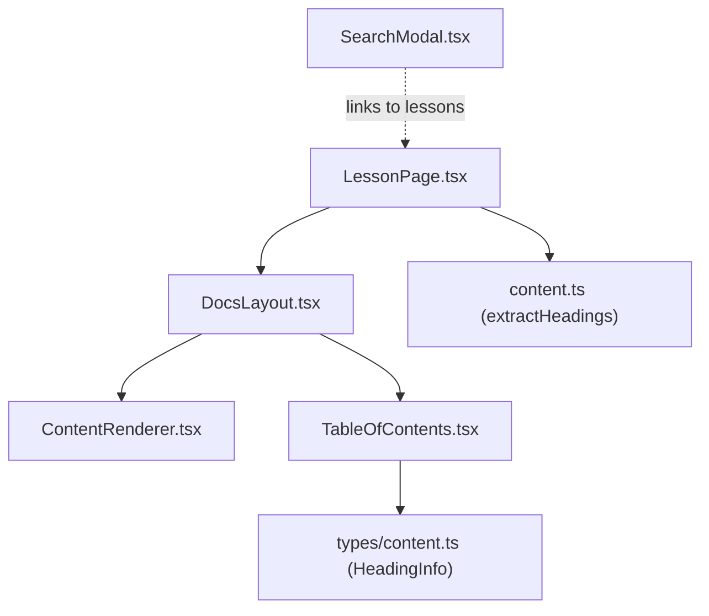
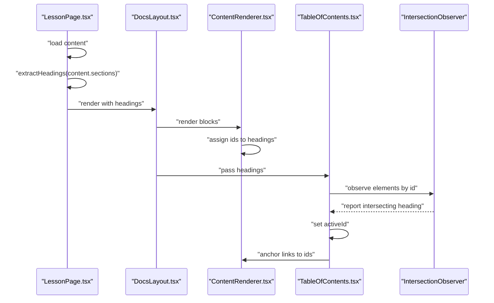
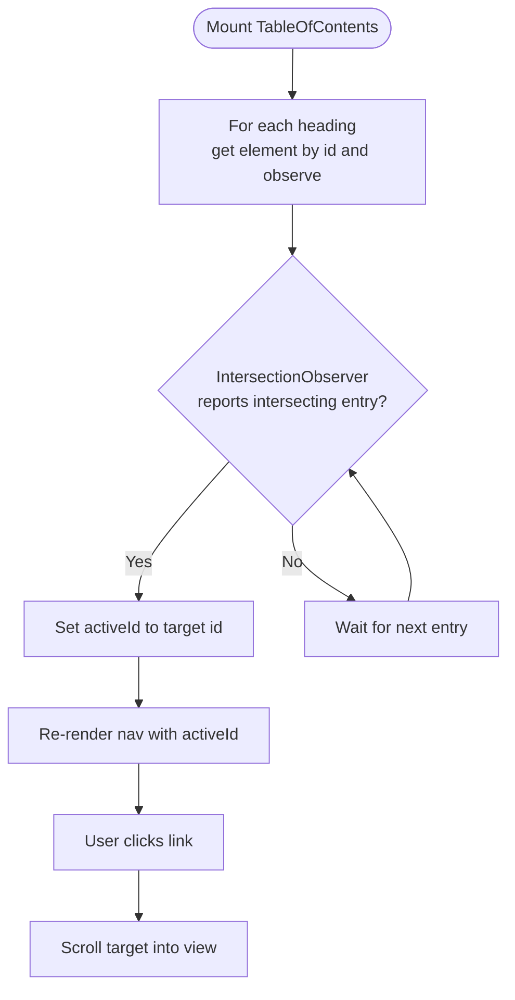
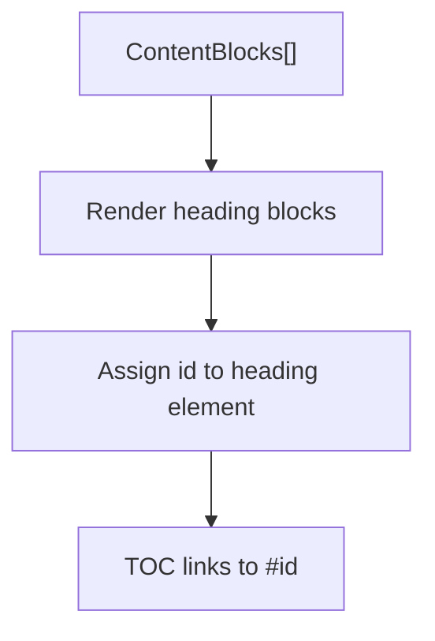
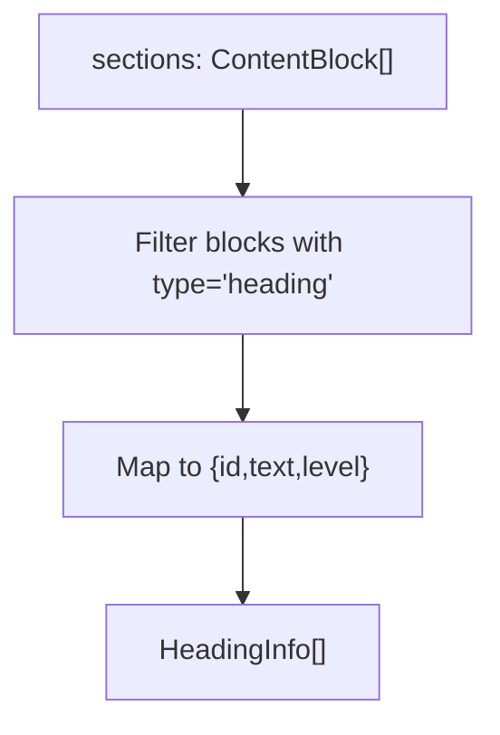
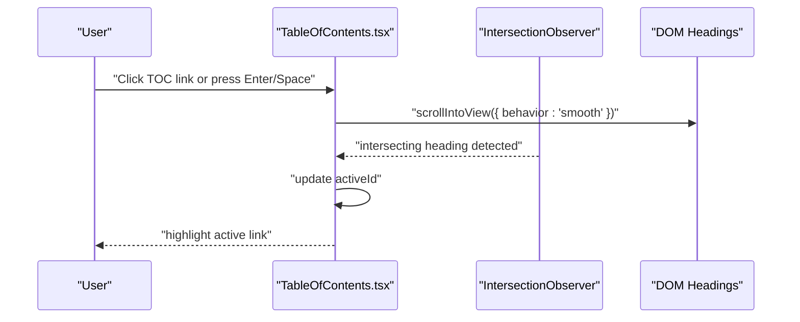
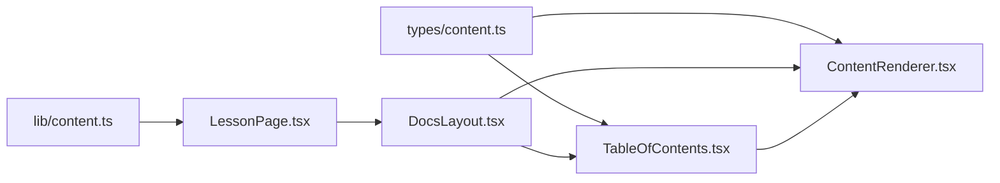

# Table of Contents

<cite>
**Referenced Files in This Document**
- [TableOfContents.tsx](file://src/components/navigation/TableOfContents.tsx)
- [ContentRenderer.tsx](file://src/components/content/ContentRenderer.tsx)
- [content.ts](file://src/lib/content.ts)
- [content.ts (types)](file://src/types/content.ts)
- [DocsLayout.tsx](file://src/components/layout/DocsLayout.tsx)
- [LessonPage.tsx](file://src/features/learn/LessonPage.tsx)
- [use-debounce.ts](file://src/hooks/use-debounce.ts)
- [SearchModal.tsx](file://src/components/search/SearchModal.tsx)
- [use-mobile.tsx](file://src/hooks/use-mobile.tsx)
</cite>

## Table of Contents
1. [Introduction](#introduction)
2. [Project Structure](#project-structure)
3. [Core Components](#core-components)
4. [Architecture Overview](#architecture-overview)
5. [Detailed Component Analysis](#detailed-component-analysis)
6. [Dependency Analysis](#dependency-analysis)
7. [Performance Considerations](#performance-considerations)
8. [Troubleshooting Guide](#troubleshooting-guide)
9. [Conclusion](#conclusion)
10. [Appendices](#appendices)

## Introduction
This document explains the Table of Contents (TOC) component that generates interactive navigation from content headings. It covers:
- How headings are extracted from markdown content via DOM traversal and content parsing
- Integration with ContentRenderer to produce dynamic TOC entries
- Scroll spy behavior, active heading highlighting, and smooth scrolling
- Responsive design patterns and mobile adaptation
- Handling heading levels, nested sections, and anchor link generation
- Customization tips for appearance and behavior
- Accessibility features and integration with search for enhanced UX

## Project Structure
The TOC lives in the navigation components and integrates with content rendering and layout:
- TableOfContents renders a sticky sidebar navigation
- ContentRenderer renders markdown blocks into DOM elements with heading anchors
- DocsLayout composes the page layout and passes headings to the TOC
- LessonPage orchestrates content loading and TOC generation
- Utility functions extract headings from structured content
- SearchModal provides cross-content navigation and discovery

**Diagram sources**
- [LessonPage.tsx:39](file://src/features/learn/LessonPage.tsx#L39)
- [DocsLayout.tsx:22](file://src/components/layout/DocsLayout.tsx#L22)
- [ContentRenderer.tsx:54](file://src/components/content/ContentRenderer.tsx#L54-L66)
- [TableOfContents.tsx:9](file://src/components/navigation/TableOfContents.tsx#L9)
- [content.ts:121](file://src/lib/content.ts#L121-L125)
- [content.ts (types):146](file://src/types/content.ts#L146-L150)
- [SearchModal.tsx:55](file://src/components/search/SearchModal.tsx#L55-L60)

**Section sources**
- [TableOfContents.tsx:1](file://src/components/navigation/TableOfContents.tsx#L1-L68)
- [ContentRenderer.tsx:29](file://src/components/content/ContentRenderer.tsx#L29-L157)
- [content.ts:121](file://src/lib/content.ts#L121-L125)
- [content.ts (types):146](file://src/types/content.ts#L146-L150)
- [DocsLayout.tsx:12](file://src/components/layout/DocsLayout.tsx#L12-L25)
- [LessonPage.tsx:39](file://src/features/learn/LessonPage.tsx#L39)

## Core Components
- TableOfContents: Renders a sticky right sidebar with links to headings. Implements scroll spy using IntersectionObserver and supports keyboard-driven navigation with smooth scrolling.
- ContentRenderer: Renders markdown blocks into DOM elements, assigning IDs to headings so they can be targeted by the TOC.
- extractHeadings: Extracts HeadingInfo from ContentBlock arrays for consumption by the TOC.
- DocsLayout: Provides the page layout and injects headings into the TOC.
- LessonPage: Loads content, computes headings, and renders the page with the TOC.

Key responsibilities:
- Heading extraction: extractHeadings filters ContentBlock arrays for heading blocks and maps them to HeadingInfo.
- Anchor generation: ContentRenderer assigns ids to heading elements, enabling anchor links.
- Active state: TableOfContents tracks the currently intersecting heading and applies active styles.
- Smooth scrolling: TableOfContents scrolls target headings into view with smooth behavior on keyboard activation.

**Section sources**
- [TableOfContents.tsx:9](file://src/components/navigation/TableOfContents.tsx#L9-L67)
- [ContentRenderer.tsx:54](file://src/components/content/ContentRenderer.tsx#L54-L66)
- [content.ts:121](file://src/lib/content.ts#L121-L125)
- [DocsLayout.tsx:22](file://src/components/layout/DocsLayout.tsx#L22)
- [LessonPage.tsx:39](file://src/features/learn/LessonPage.tsx#L39)

## Architecture Overview
The TOC pipeline:
1. LessonPage loads content and computes headings via extractHeadings.
2. DocsLayout passes headings to TableOfContents.
3. ContentRenderer renders ContentBlocks, assigning IDs to headings.
4. TableOfContents observes headings via IntersectionObserver and updates active state.
5. Clicking or pressing Enter/Space on a TOC link smoothly scrolls to the corresponding heading.

**Diagram sources**
- [LessonPage.tsx:39](file://src/features/learn/LessonPage.tsx#L39)
- [DocsLayout.tsx:22](file://src/components/layout/DocsLayout.tsx#L22)
- [ContentRenderer.tsx:54](file://src/components/content/ContentRenderer.tsx#L54-L66)
- [TableOfContents.tsx:12](file://src/components/navigation/TableOfContents.tsx#L12-L30)

## Detailed Component Analysis

### TableOfContents Component
Responsibilities:
- Accepts an array of HeadingInfo and renders a sticky navigation sidebar.
- Uses IntersectionObserver to detect the active heading based on viewport position.
- Applies indentation and active styles based on heading levels.
- Supports keyboard navigation (Enter/Space) to smoothly scroll to targets.

Implementation highlights:
- Scroll spy: Observes elements whose IDs match the provided headings.
- Active highlighting: Updates activeId when a heading intersects.
- Indentation: Adds left padding based on heading levels to visually reflect nesting.
- Smooth scrolling: On keyboard activation, triggers smooth scroll to the target element.

**Diagram sources**
- [TableOfContents.tsx:12](file://src/components/navigation/TableOfContents.tsx#L12-L30)
- [TableOfContents.tsx:42](file://src/components/navigation/TableOfContents.tsx#L42-L50)

**Section sources**
- [TableOfContents.tsx:9](file://src/components/navigation/TableOfContents.tsx#L9-L67)

### ContentRenderer Integration
Responsibilities:
- Renders ContentBlocks into DOM elements.
- Assigns unique IDs to heading elements so they can be linked to by the TOC.

Implementation highlights:
- Heading rendering: Creates h2/h3/h4 elements and assigns id attributes from the ContentBlock.
- Anchor compatibility: The id attributes align with the HeadingInfo.id used by the TOC.

**Diagram sources**
- [ContentRenderer.tsx:54](file://src/components/content/ContentRenderer.tsx#L54-L66)
- [content.ts (types):20](file://src/types/content.ts#L20-L26)

**Section sources**
- [ContentRenderer.tsx:54](file://src/components/content/ContentRenderer.tsx#L54-L66)

### Heading Extraction Algorithm
Responsibilities:
- Convert raw ContentBlock arrays into a simplified list of headings suitable for the TOC.

Algorithm:
- Filter blocks where type equals 'heading'.
- Map each filtered block to an object containing id, text, and level.

**Diagram sources**
- [content.ts:121](file://src/lib/content.ts#L121-L125)
- [content.ts (types):20](file://src/types/content.ts#L20-L26)

**Section sources**
- [content.ts:121](file://src/lib/content.ts#L121-L125)

### Layout Integration
Responsibilities:
- Provide a responsive page layout that includes the TOC sidebar alongside the main content.

Highlights:
- DocsLayout composes the page and passes headings to the TOC.
- The TOC is hidden on small screens and becomes visible at xl breakpoint.

**Section sources**
- [DocsLayout.tsx:12](file://src/components/layout/DocsLayout.tsx#L12-L25)
- [TableOfContents.tsx:35](file://src/components/navigation/TableOfContents.tsx#L35)

### Scroll Spy, Active Highlighting, and Smooth Scrolling
- Scroll spy: IntersectionObserver configured with a root margin to trigger when a heading enters the viewport.
- Active highlighting: The activeId drives visual state for the active link.
- Smooth scrolling: Keyboard activation triggers smooth scroll into view for the target element.

**Diagram sources**
- [TableOfContents.tsx:12](file://src/components/navigation/TableOfContents.tsx#L12-L30)
- [TableOfContents.tsx:45](file://src/components/navigation/TableOfContents.tsx#L45-L50)

**Section sources**
- [TableOfContents.tsx:12](file://src/components/navigation/TableOfContents.tsx#L12-L30)
- [TableOfContents.tsx:45](file://src/components/navigation/TableOfContents.tsx#L45-L50)

### Responsive Design and Mobile Adaptation
- Desktop-first layout: The TOC is hidden on small screens and shown at xl breakpoint.
- Mobile-friendly behavior: On smaller screens, the TOC does not interfere with main content width.
- Additional hook: useIsMobile provides a boolean flag for runtime adaptation if needed elsewhere.

**Section sources**
- [TableOfContents.tsx:35](file://src/components/navigation/TableOfContents.tsx#L35)
- [use-mobile.tsx:3](file://src/hooks/use-mobile.tsx#L3-L19)

### Handling Heading Levels, Nested Sections, and Anchor Links
- Heading levels: The renderer supports h2, h3, h4. The TOC applies indentation based on level to reflect hierarchy.
- Anchor links: Each heading rendered by ContentRenderer receives an id attribute; the TOC links use href="#id".
- Nested sections: ContentRenderer groups blocks into sections separated by h2 headings, aiding logical grouping.

**Section sources**
- [ContentRenderer.tsx:52](file://src/components/content/ContentRenderer.tsx#L52-L66)
- [TableOfContents.tsx:53](file://src/components/navigation/TableOfContents.tsx#L53-L54)

### Customization Examples
- Appearance: Modify the TOC link styles, active state colors, and indentation spacing via Tailwind classes applied in the component.
- Custom heading classes: Extend ContentRenderer to add additional className tokens to headings when needed.
- Special content formatting: Use ContentRenderer’s list/table/callout blocks to create rich sections; ensure headings remain h2/h3/h4 to keep the TOC accurate.

Note: Specific class names and styles are defined in the component files and can be adjusted to match brand guidelines.

**Section sources**
- [TableOfContents.tsx:51](file://src/components/navigation/TableOfContents.tsx#L51-L58)
- [ContentRenderer.tsx:57](file://src/components/content/ContentRenderer.tsx#L57-L62)

### Accessibility Features
- Keyboard navigation: TOC links support Enter and Space to activate smooth scrolling.
- Focus management: Links apply focus-visible ring styles for keyboard users.
- Screen reader compatibility: Links use semantic anchor elements with href attributes pointing to ids.

Recommendations:
- Ensure sufficient color contrast for active/inactive states.
- Consider adding aria-current for the active link if desired.

**Section sources**
- [TableOfContents.tsx:45](file://src/components/navigation/TableOfContents.tsx#L45-L50)
- [TableOfContents.tsx:55](file://src/components/navigation/TableOfContents.tsx#L55-L58)

### Integration with Search Functionality
- Cross-content navigation: SearchModal provides a unified way to discover lessons and navigate quickly.
- Enhanced UX: Users can jump to relevant content and then use the TOC to navigate within the page.

**Section sources**
- [SearchModal.tsx:55](file://src/components/search/SearchModal.tsx#L55-L60)

## Dependency Analysis
- TableOfContents depends on:
  - HeadingInfo type for rendering and linking
  - DOM elements created by ContentRenderer (ids)
  - IntersectionObserver for scroll spy
- ContentRenderer depends on:
  - ContentBlock types to render headings with ids
- LessonPage depends on:
  - extractHeadings to compute headings
  - DocsLayout to render the page structure

**Diagram sources**
- [content.ts (types):146](file://src/types/content.ts#L146-L150)
- [content.ts:121](file://src/lib/content.ts#L121-L125)
- [LessonPage.tsx:39](file://src/features/learn/LessonPage.tsx#L39)
- [DocsLayout.tsx:22](file://src/components/layout/DocsLayout.tsx#L22)
- [ContentRenderer.tsx:54](file://src/components/content/ContentRenderer.tsx#L54-L66)
- [TableOfContents.tsx:9](file://src/components/navigation/TableOfContents.tsx#L9)

**Section sources**
- [content.ts (types):146](file://src/types/content.ts#L146-L150)
- [content.ts:121](file://src/lib/content.ts#L121-L125)
- [LessonPage.tsx:39](file://src/features/learn/LessonPage.tsx#L39)
- [DocsLayout.tsx:22](file://src/components/layout/DocsLayout.tsx#L22)
- [ContentRenderer.tsx:54](file://src/components/content/ContentRenderer.tsx#L54-L66)
- [TableOfContents.tsx:9](file://src/components/navigation/TableOfContents.tsx#L9)

## Performance Considerations
- Large documents:
  - IntersectionObserver thresholds and margins are tuned to minimize unnecessary re-renders.
  - Limit the number of observed elements by filtering to only headings present in the current page.
- Rendering cost:
  - Memoize extracted headings and sections to avoid recomputation.
  - Keep the TOC list shallow; consider truncating very deep hierarchies if needed.
- Debouncing:
  - While the TOC itself does not debounce, debouncing can be applied to search queries that influence navigation decisions.

**Section sources**
- [TableOfContents.tsx:12](file://src/components/navigation/TableOfContents.tsx#L12-L30)
- [LessonPage.tsx:39](file://src/features/learn/LessonPage.tsx#L39)
- [use-debounce.ts:20](file://src/hooks/use-debounce.ts#L20-L34)

## Troubleshooting Guide
- TOC not updating active state:
  - Ensure headings have corresponding DOM elements with matching ids.
  - Verify IntersectionObserver is observing the correct elements.
- Links not scrolling smoothly:
  - Confirm the target element exists and has the expected id.
  - Check for CSS that might prevent smooth scrolling.
- Missing headings:
  - Confirm that extractHeadings is called with the correct sections array.
  - Ensure ContentRenderer assigns ids to heading blocks.

**Section sources**
- [TableOfContents.tsx:24](file://src/components/navigation/TableOfContents.tsx#L24-L27)
- [ContentRenderer.tsx:56](file://src/components/content/ContentRenderer.tsx#L56)
- [content.ts:121](file://src/lib/content.ts#L121-L125)

## Conclusion
The Table of Contents component provides a robust, accessible, and performant navigation solution for documentation pages. By extracting headings from structured content, anchoring them in the rendered DOM, and applying scroll spy with smooth scrolling, it enhances readability and usability. The design is responsive, customizable, and integrates seamlessly with search and layout components.

## Appendices
- Data model for headings:
  - HeadingInfo includes id, text, and level for rendering and linking.

**Section sources**
- [content.ts (types):146](file://src/types/content.ts#L146-L150)