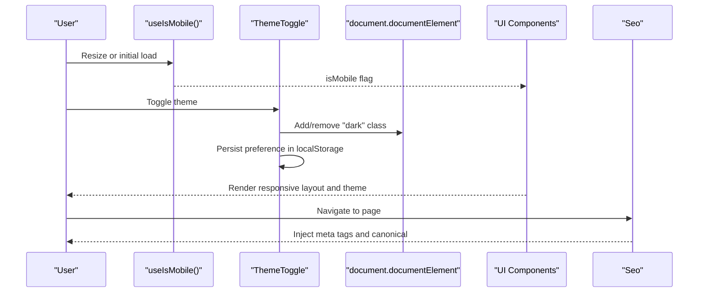
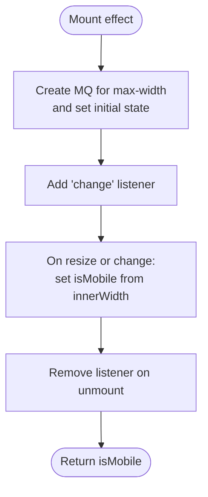
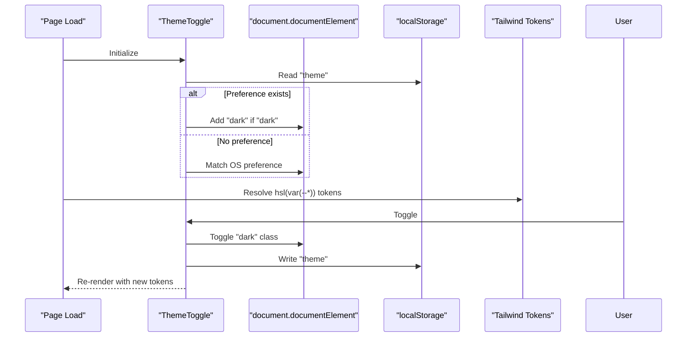
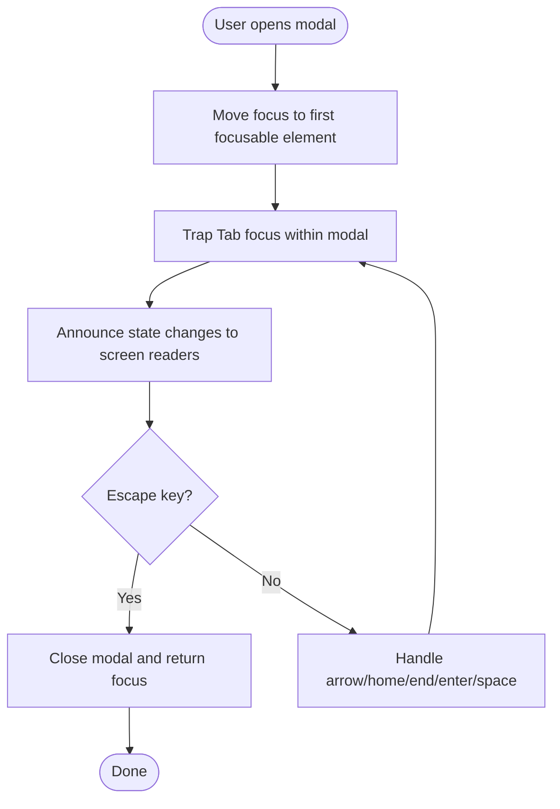
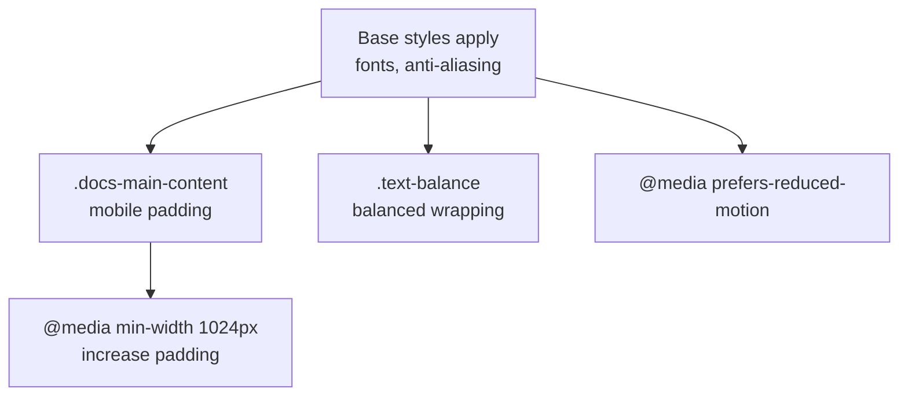
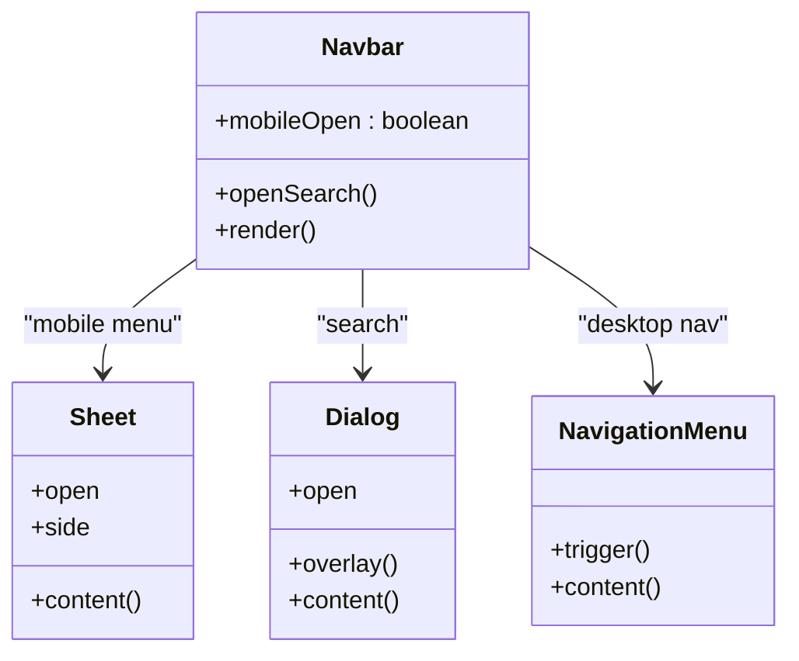
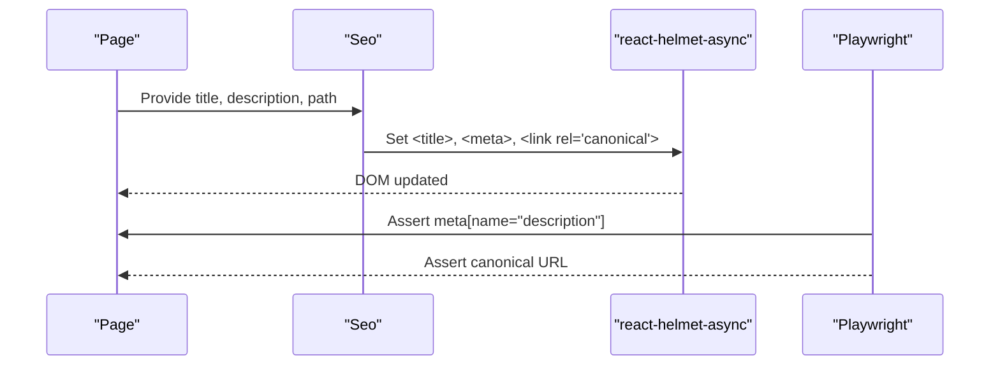
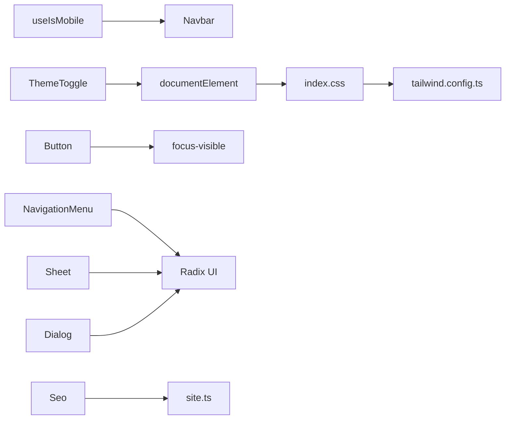

# Responsive Design and Accessibility

<cite>
**Referenced Files in This Document**
- [use-mobile.tsx](file://src/hooks/use-mobile.tsx)
- [ThemeToggle.tsx](file://src/components/shared/ThemeToggle.tsx)
- [index.css](file://src/index.css)
- [App.css](file://src/App.css)
- [tailwind.config.ts](file://tailwind.config.ts)
- [Seo.tsx](file://src/components/seo/Seo.tsx)
- [site.ts](file://src/config/site.ts)
- [Navbar.tsx](file://src/components/navigation/Navbar.tsx)
- [DocsLayout.tsx](file://src/components/layout/DocsLayout.tsx)
- [button.tsx](file://src/components/ui/button.tsx)
- [navigation-menu.tsx](file://src/components/ui/navigation-menu.tsx)
- [sheet.tsx](file://src/components/ui/sheet.tsx)
- [dialog.tsx](file://src/components/ui/dialog.tsx)
- [HomePage.tsx](file://src/features/home/HomePage.tsx)
- [smoke.spec.ts](file://src/tests/e2e/smoke.spec.ts)
- [accessibility.ts](file://src/content/explore/accessibility.ts)
</cite>

## Table of Contents
1. [Introduction](#introduction)
2. [Project Structure](#project-structure)
3. [Core Components](#core-components)
4. [Architecture Overview](#architecture-overview)
5. [Detailed Component Analysis](#detailed-component-analysis)
6. [Dependency Analysis](#dependency-analysis)
7. [Performance Considerations](#performance-considerations)
8. [Troubleshooting Guide](#troubleshooting-guide)
9. [Conclusion](#conclusion)
10. [Appendices](#appendices)

## Introduction
This document explains how JSphere ensures a seamless experience across devices and user needs. It covers the responsive design system, the theme and color scheme management, accessibility features grounded in WCAG, responsive typography and spacing, mobile-first interactions, SEO optimization, CSS-in-JS patterns, animation performance, cross-browser compatibility, testing strategies, progressive enhancement, and the integration between responsiveness and the content delivery system.

## Project Structure
JSphere organizes responsive and accessibility concerns across hooks, components, styles, and configuration:
- Hook for responsive behavior detection
- Theme toggle with persistent preference and OS preference fallback
- Tailwind-based design tokens and dark mode class strategy
- CSS custom properties for theme-aware tokens
- UI primitives with focus and keyboard support
- Layouts with mobile-first spacing and responsive grids
- SEO metadata and structured presentation
- E2E tests validating responsive behavior and SEO

```mermaid
graph TB
subgraph "Responsive Detection"
UM["use-mobile.tsx"]
end
subgraph "Theme System"
TT["ThemeToggle.tsx"]
ICSS["index.css"]
TCFG["tailwind.config.ts"]
end
subgraph "UI Primitives"
BTN["button.tsx"]
NM["navigation-menu.tsx"]
SH["sheet.tsx"]
DL["dialog.tsx"]
end
subgraph "Layouts"
NAV["Navbar.tsx"]
DOCL["DocsLayout.tsx"]
end
subgraph "SEO"
SEO["Seo.tsx"]
SITE["site.ts"]
end
subgraph "Tests"
SMOKETEST["smoke.spec.ts"]
end
UM --> NAV
TT --> ICSS
ICSS --> TCFG
NAV --> SH
NAV --> DL
NAV --> NM
DOCL --> ICSS
SEO --> SITE
SMOKETEST --> SEO
```

**Diagram sources**
- [use-mobile.tsx:1-20](file://src/hooks/use-mobile.tsx#L1-L20)
- [ThemeToggle.tsx:1-30](file://src/components/shared/ThemeToggle.tsx#L1-L30)
- [index.css:1-161](file://src/index.css#L1-L161)
- [tailwind.config.ts:1-104](file://tailwind.config.ts#L1-L104)
- [button.tsx:1-48](file://src/components/ui/button.tsx#L1-L48)
- [navigation-menu.tsx:1-121](file://src/components/ui/navigation-menu.tsx#L1-L121)
- [sheet.tsx:1-108](file://src/components/ui/sheet.tsx#L1-L108)
- [dialog.tsx:1-96](file://src/components/ui/dialog.tsx#L1-L96)
- [Navbar.tsx:1-183](file://src/components/navigation/Navbar.tsx#L1-L183)
- [DocsLayout.tsx:1-26](file://src/components/layout/DocsLayout.tsx#L1-L26)
- [Seo.tsx:1-33](file://src/components/seo/Seo.tsx#L1-L33)
- [site.ts:1-15](file://src/config/site.ts#L1-L15)
- [smoke.spec.ts:1-81](file://src/tests/e2e/smoke.spec.ts#L1-L81)

**Section sources**
- [use-mobile.tsx:1-20](file://src/hooks/use-mobile.tsx#L1-L20)
- [ThemeToggle.tsx:1-30](file://src/components/shared/ThemeToggle.tsx#L1-L30)
- [index.css:1-161](file://src/index.css#L1-L161)
- [tailwind.config.ts:1-104](file://tailwind.config.ts#L1-L104)
- [button.tsx:1-48](file://src/components/ui/button.tsx#L1-L48)
- [navigation-menu.tsx:1-121](file://src/components/ui/navigation-menu.tsx#L1-L121)
- [sheet.tsx:1-108](file://src/components/ui/sheet.tsx#L1-L108)
- [dialog.tsx:1-96](file://src/components/ui/dialog.tsx#L1-L96)
- [Navbar.tsx:1-183](file://src/components/navigation/Navbar.tsx#L1-L183)
- [DocsLayout.tsx:1-26](file://src/components/layout/DocsLayout.tsx#L1-L26)
- [Seo.tsx:1-33](file://src/components/seo/Seo.tsx#L1-L33)
- [site.ts:1-15](file://src/config/site.ts#L1-L15)
- [smoke.spec.ts:1-81](file://src/tests/e2e/smoke.spec.ts#L1-L81)

## Core Components
- Device breakpoint detection via media queries and resize listener
- Light/dark mode with persisted user preference and OS fallback
- CSS custom properties for theme-aware tokens and Tailwind integration
- Accessible UI primitives with focus-visible, keyboard navigation, and ARIA
- Mobile-first layouts with responsive spacing and adaptive grids
- SEO metadata and social previews with canonical URLs
- E2E tests validating responsive behavior and SEO

**Section sources**
- [use-mobile.tsx:1-20](file://src/hooks/use-mobile.tsx#L1-L20)
- [ThemeToggle.tsx:1-30](file://src/components/shared/ThemeToggle.tsx#L1-L30)
- [index.css:1-161](file://src/index.css#L1-L161)
- [tailwind.config.ts:1-104](file://tailwind.config.ts#L1-L104)
- [button.tsx:1-48](file://src/components/ui/button.tsx#L1-L48)
- [DocsLayout.tsx:1-26](file://src/components/layout/DocsLayout.tsx#L1-L26)
- [Seo.tsx:1-33](file://src/components/seo/Seo.tsx#L1-L33)
- [smoke.spec.ts:1-81](file://src/tests/e2e/smoke.spec.ts#L1-L81)

## Architecture Overview
JSphere’s responsive and accessible architecture centers on:
- A responsive hook that tracks viewport and emits a boolean flag for mobile behavior
- A theme system that toggles a root class and persists preferences
- Tailwind utilities bound to CSS custom properties for consistent theming
- UI components designed with focus management and keyboard support
- Layouts that adapt spacing and grid density per breakpoint
- SEO metadata injected at runtime for each page



**Diagram sources**
- [use-mobile.tsx:1-20](file://src/hooks/use-mobile.tsx#L1-L20)
- [ThemeToggle.tsx:1-30](file://src/components/shared/ThemeToggle.tsx#L1-L30)
- [index.css:1-161](file://src/index.css#L1-L161)
- [tailwind.config.ts:1-104](file://tailwind.config.ts#L1-L104)
- [button.tsx:1-48](file://src/components/ui/button.tsx#L1-L48)
- [Seo.tsx:1-33](file://src/components/seo/Seo.tsx#L1-L33)

## Detailed Component Analysis

### Responsive Behavior Hook: useIsMobile
- Detects mobile viewport using a media query and innerWidth comparison
- Subscribes to media query change events and cleans up listeners
- Returns a boolean suitable for conditional rendering and behavior toggles



**Diagram sources**
- [use-mobile.tsx:1-20](file://src/hooks/use-mobile.tsx#L1-L20)

**Section sources**
- [use-mobile.tsx:1-20](file://src/hooks/use-mobile.tsx#L1-L20)

### Theme System: Light/Dark Mode and Color Scheme Management
- ThemeToggle initializes from localStorage or OS preference, applies a root class, and persists the choice
- index.css defines CSS custom properties for light and dark modes
- tailwind.config.ts binds Tailwind colors to these custom properties and enables dark mode via class strategy



**Diagram sources**
- [ThemeToggle.tsx:1-30](file://src/components/shared/ThemeToggle.tsx#L1-L30)
- [index.css:1-161](file://src/index.css#L1-L161)
- [tailwind.config.ts:1-104](file://tailwind.config.ts#L1-L104)

**Section sources**
- [ThemeToggle.tsx:1-30](file://src/components/shared/ThemeToggle.tsx#L1-L30)
- [index.css:1-161](file://src/index.css#L1-L161)
- [tailwind.config.ts:1-104](file://tailwind.config.ts#L1-L104)

### Accessibility Features: ARIA, Keyboard, Screen Reader, Focus
- Native semantic elements are preferred; ARIA roles are applied only when necessary
- Keyboard navigation supported for menus and dialogs (arrow keys, home/end, enter/space, escape)
- Live regions and skip links assist screen readers
- Focus management traps focus within overlays and moves focus into modals
- UI primitives include focus-visible outlines and accessible labels



**Diagram sources**
- [accessibility.ts:250-365](file://src/content/explore/accessibility.ts#L250-L365)
- [dialog.tsx:1-96](file://src/components/ui/dialog.tsx#L1-L96)
- [sheet.tsx:1-108](file://src/components/ui/sheet.tsx#L1-L108)

**Section sources**
- [accessibility.ts:110-300](file://src/content/explore/accessibility.ts#L110-L300)
- [dialog.tsx:1-96](file://src/components/ui/dialog.tsx#L1-L96)
- [sheet.tsx:1-108](file://src/components/ui/sheet.tsx#L1-L108)

### Responsive Typography and Spacing
- index.css defines base fonts and applies anti-aliased rendering
- DocsLayout sets mobile-first padding and increases padding at larger screens
- Utility class text-balance improves readability
- App.css demonstrates prefers-reduced-motion awareness



**Diagram sources**
- [index.css:1-161](file://src/index.css#L1-L161)
- [DocsLayout.tsx:1-26](file://src/components/layout/DocsLayout.tsx#L1-L26)
- [App.css:1-43](file://src/App.css#L1-L43)

**Section sources**
- [index.css:1-161](file://src/index.css#L1-L161)
- [DocsLayout.tsx:1-26](file://src/components/layout/DocsLayout.tsx#L1-L26)
- [App.css:1-43](file://src/App.css#L1-L43)

### Mobile-First Design and Touch-Friendly Interactions
- Navbar switches from desktop NavigationMenu to a Sheet-based mobile menu
- Sheet and Dialog components provide slide/fade transitions and close affordances
- Buttons and interactive elements use adequate size and focus styles
- NavigationMenu supports keyboard-triggered expansion and nested lists



**Diagram sources**
- [Navbar.tsx:1-183](file://src/components/navigation/Navbar.tsx#L1-L183)
- [sheet.tsx:1-108](file://src/components/ui/sheet.tsx#L1-L108)
- [dialog.tsx:1-96](file://src/components/ui/dialog.tsx#L1-L96)
- [navigation-menu.tsx:1-121](file://src/components/ui/navigation-menu.tsx#L1-L121)

**Section sources**
- [Navbar.tsx:1-183](file://src/components/navigation/Navbar.tsx#L1-L183)
- [sheet.tsx:1-108](file://src/components/ui/sheet.tsx#L1-L108)
- [dialog.tsx:1-96](file://src/components/ui/dialog.tsx#L1-L96)
- [navigation-menu.tsx:1-121](file://src/components/ui/navigation-menu.tsx#L1-L121)

### SEO Optimization: Meta Tags, Structured Data, Performance Metrics
- Seo composes title, description, canonical URL, and social meta tags
- site.ts centralizes site-wide metadata for reuse
- E2E tests assert SEO presence and correctness on key pages



**Diagram sources**
- [Seo.tsx:1-33](file://src/components/seo/Seo.tsx#L1-L33)
- [site.ts:1-15](file://src/config/site.ts#L1-L15)
- [smoke.spec.ts:31-42](file://src/tests/e2e/smoke.spec.ts#L31-L42)

**Section sources**
- [Seo.tsx:1-33](file://src/components/seo/Seo.tsx#L1-L33)
- [site.ts:1-15](file://src/config/site.ts#L1-L15)
- [smoke.spec.ts:1-81](file://src/tests/e2e/smoke.spec.ts#L1-L81)

### Implementation Details: CSS-in-JS Patterns, Animation Performance, Cross-Browser Compatibility
- Tailwind utilities are bound to CSS custom properties for theme tokens
- Animations leverage CSS transitions and Radix motion attributes for smoothness
- prefers-reduced-motion media query respects user preferences
- Focus-visible outlines ensure keyboard accessibility without relying solely on mouse hover

**Section sources**
- [index.css:1-161](file://src/index.css#L1-L161)
- [tailwind.config.ts:1-104](file://tailwind.config.ts#L1-L104)
- [App.css:30-34](file://src/App.css#L30-L34)
- [button.tsx:1-48](file://src/components/ui/button.tsx#L1-L48)

### Accessibility Testing Strategies and WCAG Compliance
- E2E tests validate focus order, live regions, and skip links
- Accessibility content includes ARIA patterns, keyboard navigation, and screen reader announcements
- WCAG checklist emphasizes semantic HTML, contrast, focus indicators, and reduced motion

**Section sources**
- [smoke.spec.ts:1-81](file://src/tests/e2e/smoke.spec.ts#L1-L81)
- [accessibility.ts:574-601](file://src/content/explore/accessibility.ts#L574-L601)

### Progressive Enhancement and Graceful Degradation
- Feature detection augments user experience without breaking core functionality
- Dark mode falls back to OS preference when localStorage is unavailable
- Animations degrade gracefully when prefers-reduced-motion is enabled

**Section sources**
- [ThemeToggle.tsx:1-30](file://src/components/shared/ThemeToggle.tsx#L1-L30)
- [App.css:30-34](file://src/App.css#L30-L34)

### Integration Between Responsive Design and Content Delivery
- HomePage composes SEO metadata with responsive layouts and personalized sections
- DocsLayout and DocsSidebar adapt content presentation across breakpoints
- UI primitives consistently apply focus and keyboard behavior regardless of content

**Section sources**
- [HomePage.tsx:1-455](file://src/features/home/HomePage.tsx#L1-L455)
- [DocsLayout.tsx:1-26](file://src/components/layout/DocsLayout.tsx#L1-L26)
- [button.tsx:1-48](file://src/components/ui/button.tsx#L1-L48)

## Dependency Analysis
The responsive and accessibility stack exhibits low coupling and high cohesion:
- useIsMobile depends on window.matchMedia and innerWidth
- ThemeToggle depends on localStorage and documentElement class manipulation
- Tailwind relies on CSS custom properties defined in index.css
- UI components depend on shared focus-visible and motion utilities
- SEO components depend on site configuration



**Diagram sources**
- [use-mobile.tsx:1-20](file://src/hooks/use-mobile.tsx#L1-L20)
- [ThemeToggle.tsx:1-30](file://src/components/shared/ThemeToggle.tsx#L1-L30)
- [index.css:1-161](file://src/index.css#L1-L161)
- [tailwind.config.ts:1-104](file://tailwind.config.ts#L1-L104)
- [button.tsx:1-48](file://src/components/ui/button.tsx#L1-L48)
- [navigation-menu.tsx:1-121](file://src/components/ui/navigation-menu.tsx#L1-L121)
- [sheet.tsx:1-108](file://src/components/ui/sheet.tsx#L1-L108)
- [dialog.tsx:1-96](file://src/components/ui/dialog.tsx#L1-L96)
- [Seo.tsx:1-33](file://src/components/seo/Seo.tsx#L1-L33)
- [site.ts:1-15](file://src/config/site.ts#L1-L15)

**Section sources**
- [use-mobile.tsx:1-20](file://src/hooks/use-mobile.tsx#L1-L20)
- [ThemeToggle.tsx:1-30](file://src/components/shared/ThemeToggle.tsx#L1-L30)
- [index.css:1-161](file://src/index.css#L1-L161)
- [tailwind.config.ts:1-104](file://tailwind.config.ts#L1-L104)
- [button.tsx:1-48](file://src/components/ui/button.tsx#L1-L48)
- [navigation-menu.tsx:1-121](file://src/components/ui/navigation-menu.tsx#L1-L121)
- [sheet.tsx:1-108](file://src/components/ui/sheet.tsx#L1-L108)
- [dialog.tsx:1-96](file://src/components/ui/dialog.tsx#L1-L96)
- [Seo.tsx:1-33](file://src/components/seo/Seo.tsx#L1-L33)
- [site.ts:1-15](file://src/config/site.ts#L1-L15)

## Performance Considerations
- Prefer CSS custom properties for theming to avoid costly reflows
- Use container queries and responsive utilities to minimize layout shifts
- Limit heavy animations for users who prefer reduced motion
- Keep media queries coarse-grained to reduce recalculations during resize

## Troubleshooting Guide
- ThemeToggle does not persist: verify localStorage availability and permissions
- Dark mode not applying: confirm the "dark" class is present on documentElement and Tailwind darkMode is configured
- Focus trap not working: ensure first and last focusable elements are correctly identified and focus is programmatically moved
- SEO meta missing: check Seo props and ensure Helmet renders without conflicts

**Section sources**
- [ThemeToggle.tsx:1-30](file://src/components/shared/ThemeToggle.tsx#L1-L30)
- [tailwind.config.ts:1-104](file://tailwind.config.ts#L1-L104)
- [accessibility.ts:300-365](file://src/content/explore/accessibility.ts#L300-L365)
- [Seo.tsx:1-33](file://src/components/seo/Seo.tsx#L1-L33)

## Conclusion
JSphere’s responsive and accessible design integrates a robust device detection hook, a flexible theme system, and a comprehensive set of UI primitives. The approach balances mobile-first layouts, semantic accessibility, and SEO best practices while maintaining performance and cross-browser compatibility. The included testing and content resources provide practical guidance for ongoing maintenance and enhancements.

## Appendices
- WCAG checklist and testing references are documented in the accessibility content
- E2E smoke tests demonstrate responsive and SEO validation scenarios

**Section sources**
- [accessibility.ts:574-601](file://src/content/explore/accessibility.ts#L574-L601)
- [smoke.spec.ts:1-81](file://src/tests/e2e/smoke.spec.ts#L1-L81)