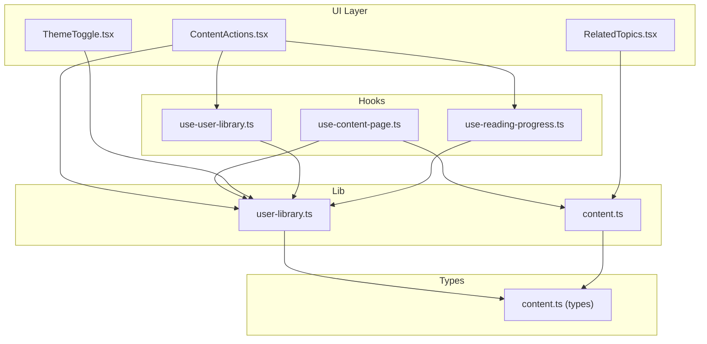
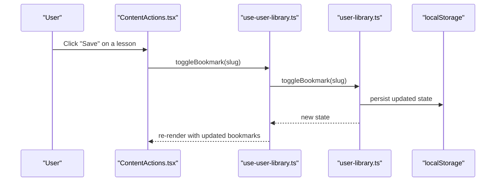
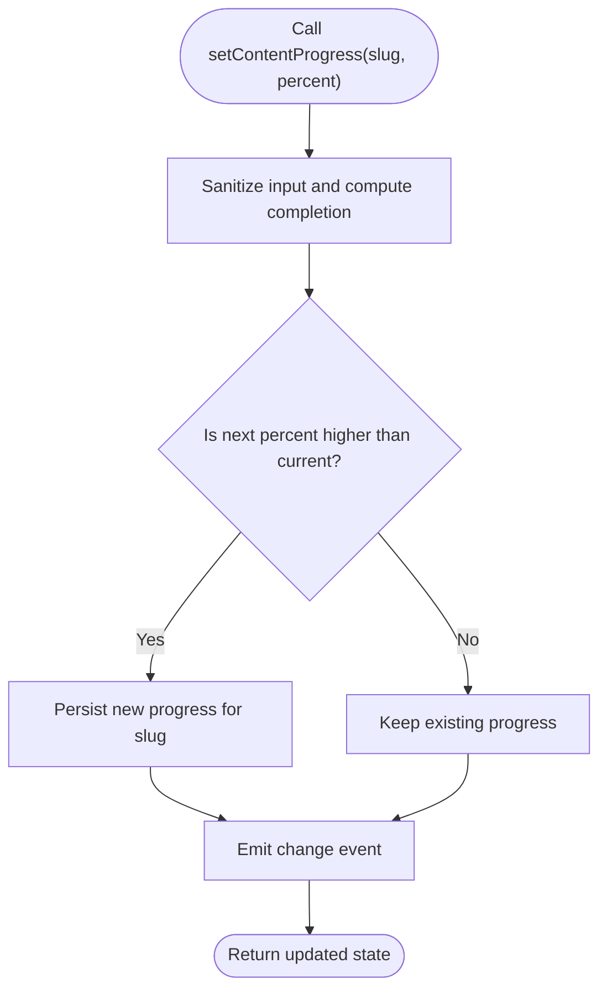
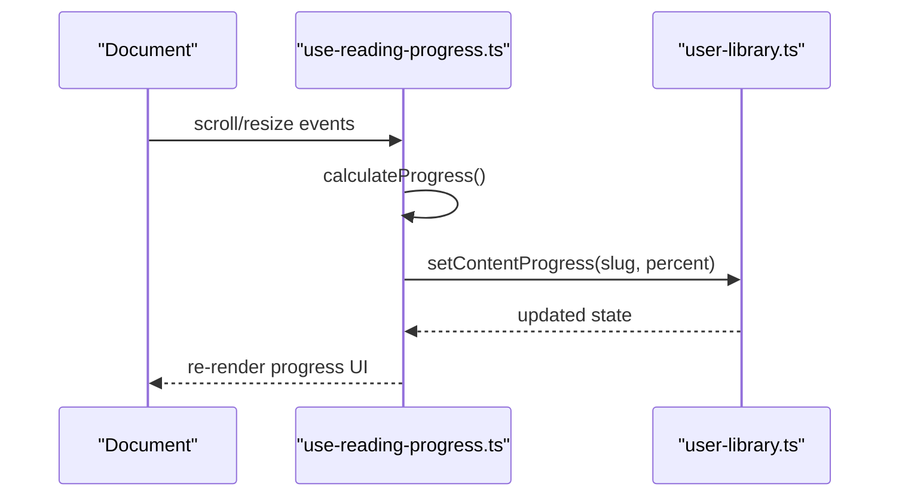
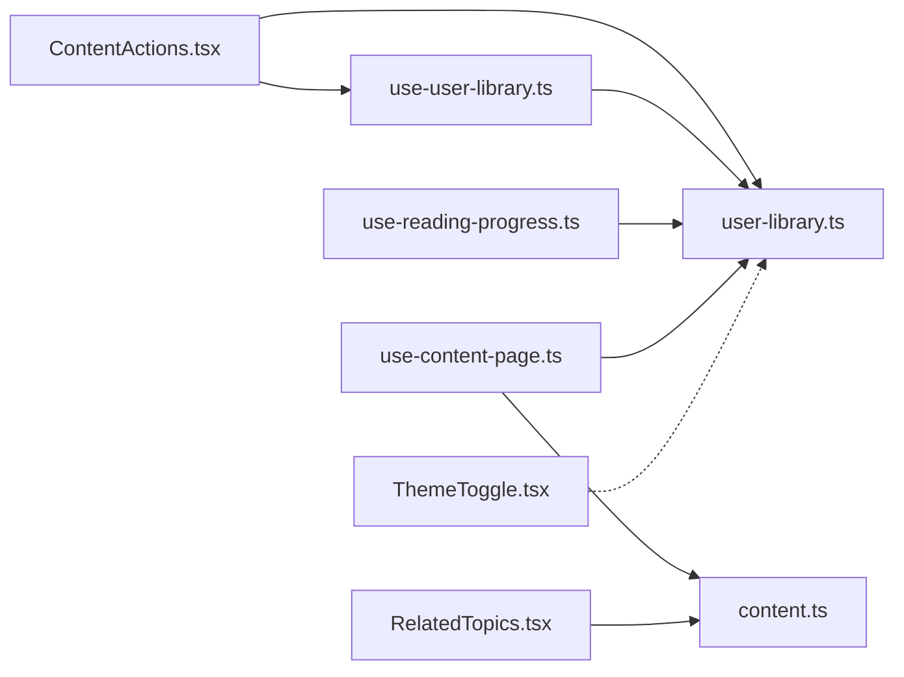

# User Library and Personalization

<cite>
**Referenced Files in This Document**
- [user-library.ts](file://src/lib/user-library.ts)
- [use-user-library.ts](file://src/hooks/use-user-library.ts)
- [ContentActions.tsx](file://src/components/content/ContentActions.tsx)
- [use-reading-progress.ts](file://src/hooks/use-reading-progress.ts)
- [RelatedTopics.tsx](file://src/components/content/RelatedTopics.tsx)
- [content.ts](file://src/lib/content.ts)
- [content.ts (types)](file://src/types/content.ts)
- [LessonPage.tsx](file://src/features/learn/LessonPage.tsx)
- [use-content-page.ts](file://src/hooks/use-content-page.ts)
- [ThemeToggle.tsx](file://src/components/shared/ThemeToggle.tsx)
- [dark-mode.ts](file://src/content/recipes/dark-mode.ts)
- [user-library.test.ts](file://src/tests/unit/user-library.test.ts)
</cite>

## Table of Contents
1. [Introduction](#introduction)
2. [Project Structure](#project-structure)
3. [Core Components](#core-components)
4. [Architecture Overview](#architecture-overview)
5. [Detailed Component Analysis](#detailed-component-analysis)
6. [Dependency Analysis](#dependency-analysis)
7. [Performance Considerations](#performance-considerations)
8. [Troubleshooting Guide](#troubleshooting-guide)
9. [Privacy and Data Control](#privacy-and-data-control)
10. [Conclusion](#conclusion)

## Introduction
This document explains the user library and personalization system that powers personalized learning experiences. It covers:
- User library utilities for bookmarks, reading progress, and recent activity
- A React hook that provides reactive access to user data with localStorage persistence
- Content actions enabling bookmarking, progress tracking, and sharing affordances
- Reading progress tracking that monitors engagement and supports “Continue reading”
- Related topics recommendations powered by content metadata
- User preferences for theme selection and related UI behaviors
- Data persistence, offline storage, and cross-session synchronization
- Integration with the content management system and how user actions trigger content updates
- Privacy considerations, data export capabilities, and user control over personal information

## Project Structure
The personalization system spans several layers:
- Utilities for user data management and persistence
- React hooks for reactive state and progress tracking
- UI components that render personalized controls and recommendations
- Content metadata and recommendation engine
- Theme preference handling separate from user library

**Diagram sources**
- [ContentActions.tsx:1-41](file://src/components/content/ContentActions.tsx#L1-L41)
- [use-user-library.ts:1-7](file://src/hooks/use-user-library.ts#L1-L7)
- [use-reading-progress.ts:1-52](file://src/hooks/use-reading-progress.ts#L1-L52)
- [use-content-page.ts:1-35](file://src/hooks/use-content-page.ts#L1-L35)
- [user-library.ts:1-213](file://src/lib/user-library.ts#L1-L213)
- [content.ts:1-126](file://src/lib/content.ts#L1-L126)
- [content.ts (types):1-169](file://src/types/content.ts#L1-L169)
- [RelatedTopics.tsx:1-42](file://src/components/content/RelatedTopics.tsx#L1-L42)
- [ThemeToggle.tsx:1-30](file://src/components/shared/ThemeToggle.tsx#L1-L30)

**Section sources**
- [user-library.ts:1-213](file://src/lib/user-library.ts#L1-L213)
- [use-user-library.ts:1-7](file://src/hooks/use-user-library.ts#L1-L7)
- [ContentActions.tsx:1-41](file://src/components/content/ContentActions.tsx#L1-L41)
- [use-reading-progress.ts:1-52](file://src/hooks/use-reading-progress.ts#L1-L52)
- [RelatedTopics.tsx:1-42](file://src/components/content/RelatedTopics.tsx#L1-L42)
- [content.ts:1-126](file://src/lib/content.ts#L1-L126)
- [content.ts (types):1-169](file://src/types/content.ts#L1-L169)
- [use-content-page.ts:1-35](file://src/hooks/use-content-page.ts#L1-L35)
- [ThemeToggle.tsx:1-30](file://src/components/shared/ThemeToggle.tsx#L1-L30)

## Core Components
- User library utilities manage persistent user state (bookmarks, recent views, recent searches, per-slug progress) with robust sanitization and caching.
- The use-user-library hook integrates with React’s useSyncExternalStore to subscribe to changes and keep UI synchronized.
- ContentActions renders bookmark toggles and reading progress bars, delegating persistence to user library functions.
- use-reading-progress calculates scroll-based progress and persists it via user library.
- use-content-page ties together content loading, recent view recording, and progress tracking.
- RelatedTopics recommends content based on content metadata and related topics graph.
- ThemeToggle manages theme preference independently of user library.

**Section sources**
- [user-library.ts:1-213](file://src/lib/user-library.ts#L1-L213)
- [use-user-library.ts:1-7](file://src/hooks/use-user-library.ts#L1-L7)
- [ContentActions.tsx:1-41](file://src/components/content/ContentActions.tsx#L1-L41)
- [use-reading-progress.ts:1-52](file://src/hooks/use-reading-progress.ts#L1-L52)
- [use-content-page.ts:1-35](file://src/hooks/use-content-page.ts#L1-L35)
- [RelatedTopics.tsx:1-42](file://src/components/content/RelatedTopics.tsx#L1-L42)
- [ThemeToggle.tsx:1-30](file://src/components/shared/ThemeToggle.tsx#L1-L30)

## Architecture Overview
The personalization pipeline connects UI actions to persisted state and content recommendations.

**Diagram sources**
- [ContentActions.tsx:1-41](file://src/components/content/ContentActions.tsx#L1-L41)
- [use-user-library.ts:1-7](file://src/hooks/use-user-library.ts#L1-L7)
- [user-library.ts:138-148](file://src/lib/user-library.ts#L138-L148)

## Detailed Component Analysis

### User Library Utilities (user-library.ts)
Responsibilities:
- Load, sanitize, cache, and persist user library state to localStorage
- Provide mutation functions for bookmarks, recent views, recent searches, and reading progress
- Emit change events for cross-tab synchronization and React subscription
- Enforce data integrity and bounds (e.g., capped lists, clamped percentages)

Key behaviors:
- State shape includes bookmarks, recentlyViewed, recentSearches, and progressBySlug
- Sanitization ensures only valid, deduplicated, and bounded data is stored
- Subscriptions listen to both storage events and a custom change event for immediate propagation
- Progress updates are monotonic (only increases are persisted) with completion inferred at thresholds

**Diagram sources**
- [user-library.ts:172-204](file://src/lib/user-library.ts#L172-L204)

**Section sources**
- [user-library.ts:1-213](file://src/lib/user-library.ts#L1-L213)
- [content.ts (types):152-168](file://src/types/content.ts#L152-L168)

### React Hook for User Library (use-user-library.ts)
Responsibilities:
- Subscribe to user library changes using useSyncExternalStore
- Provide a single source of truth for UI rendering
- Enable seamless updates across tabs and windows

Integration:
- Uses getUserLibraryState as getSnapshot and subscribeToUserLibrary as subscribe
- Ensures consistent state across browser sessions

**Section sources**
- [use-user-library.ts:1-7](file://src/hooks/use-user-library.ts#L1-L7)
- [user-library.ts:103-136](file://src/lib/user-library.ts#L103-L136)

### Content Actions Component (ContentActions.tsx)
Responsibilities:
- Render reading progress bar and bookmark toggle
- Defer persistence to user library functions
- Reflect current bookmark status reactively

Usage:
- Receives slug, progress percentage, and completion flag from parent
- Calls toggleBookmark on click to flip bookmark state

**Section sources**
- [ContentActions.tsx:1-41](file://src/components/content/ContentActions.tsx#L1-L41)
- [use-user-library.ts:1-7](file://src/hooks/use-user-library.ts#L1-L7)
- [user-library.ts:138-148](file://src/lib/user-library.ts#L138-L148)

### Reading Progress Tracking (use-reading-progress.ts)
Responsibilities:
- Compute scroll-based progress percentage
- Persist progress via user library with throttled updates
- Maintain a minimum progress invariant (never decreases)

Behavior:
- Uses requestAnimationFrame to optimize updates during scroll/resize
- Stores the highest observed progress per slug
- Infers completion when threshold is met

**Diagram sources**
- [use-reading-progress.ts:1-52](file://src/hooks/use-reading-progress.ts#L1-L52)
- [user-library.ts:172-204](file://src/lib/user-library.ts#L172-L204)

**Section sources**
- [use-reading-progress.ts:1-52](file://src/hooks/use-reading-progress.ts#L1-L52)
- [user-library.ts:172-204](file://src/lib/user-library.ts#L172-L204)

### Content Page Integration (LessonPage.tsx and use-content-page.ts)
Responsibilities:
- Load content by slug and expose metadata and sections
- Track recent views and integrate reading progress
- Render ContentActions and RelatedTopics alongside content

Flow:
- LessonPage composes ContentActions and RelatedTopics with computed progress
- useContentPageTracking orchestrates recent view recording and progress retrieval
- useContentEntry handles content fetching and caching

**Section sources**
- [LessonPage.tsx:1-123](file://src/features/learn/LessonPage.tsx#L1-L123)
- [use-content-page.ts:1-35](file://src/hooks/use-content-page.ts#L1-L35)
- [content.ts:38-42](file://src/lib/content.ts#L38-L42)

### Related Topics Recommendation (RelatedTopics.tsx)
Responsibilities:
- Suggest related content based on content metadata
- Render links with pillar labels and reading time

Implementation:
- Uses getRelatedContent(contentId) to fetch related summaries
- Renders a grid of links with navigation to related slugs

**Section sources**
- [RelatedTopics.tsx:1-42](file://src/components/content/RelatedTopics.tsx#L1-L42)
- [content.ts:78-89](file://src/lib/content.ts#L78-L89)

### Theme Preferences (ThemeToggle.tsx and dark-mode.ts)
Responsibilities:
- Allow users to toggle theme preference
- Persist theme choice in localStorage
- Apply theme via CSS variables and data attributes

Note:
- Theme preference is separate from user library state and stored under a dedicated key

**Section sources**
- [ThemeToggle.tsx:1-30](file://src/components/shared/ThemeToggle.tsx#L1-L30)
- [dark-mode.ts:84-457](file://src/content/recipes/dark-mode.ts#L84-L457)

## Dependency Analysis
The system exhibits clean separation of concerns:
- UI components depend on hooks and utilities for state and persistence
- Hooks depend on user-library utilities for data operations
- Content utilities provide metadata and recommendation functions
- Theme utilities operate independently of user library

**Diagram sources**
- [ContentActions.tsx:1-41](file://src/components/content/ContentActions.tsx#L1-L41)
- [use-user-library.ts:1-7](file://src/hooks/use-user-library.ts#L1-L7)
- [use-reading-progress.ts:1-52](file://src/hooks/use-reading-progress.ts#L1-L52)
- [use-content-page.ts:1-35](file://src/hooks/use-content-page.ts#L1-L35)
- [user-library.ts:1-213](file://src/lib/user-library.ts#L1-L213)
- [content.ts:1-126](file://src/lib/content.ts#L1-L126)
- [RelatedTopics.tsx:1-42](file://src/components/content/RelatedTopics.tsx#L1-L42)
- [ThemeToggle.tsx:1-30](file://src/components/shared/ThemeToggle.tsx#L1-L30)

**Section sources**
- [user-library.ts:1-213](file://src/lib/user-library.ts#L1-L213)
- [use-user-library.ts:1-7](file://src/hooks/use-user-library.ts#L1-L7)
- [use-reading-progress.ts:1-52](file://src/hooks/use-reading-progress.ts#L1-L52)
- [use-content-page.ts:1-35](file://src/hooks/use-content-page.ts#L1-L35)
- [content.ts:1-126](file://src/lib/content.ts#L1-L126)
- [RelatedTopics.tsx:1-42](file://src/components/content/RelatedTopics.tsx#L1-L42)
- [ThemeToggle.tsx:1-30](file://src/components/shared/ThemeToggle.tsx#L1-L30)

## Performance Considerations
- Reading progress updates are throttled using requestAnimationFrame to avoid layout thrash during scroll/resize.
- User library mutations batch writes to localStorage and emit a single change event to minimize redundant renders.
- Caching avoids repeated parsing of localStorage by comparing raw strings and maintaining an in-memory snapshot.
- Recommendations rely on precomputed metadata, avoiding expensive computations at render time.

[No sources needed since this section provides general guidance]

## Troubleshooting Guide
Common issues and resolutions:
- Invalid localStorage state: The user library gracefully falls back to default state when parsing fails.
- Duplicate items in recent lists: Deduplication and ordering are handled automatically by sanitization.
- Progress not updating: Ensure the reading progress hook is enabled and attached to the correct slug.
- Cross-tab synchronization: Changes are propagated via storage events and a custom change event.

Validation references:
- Tests confirm bookmark toggling, recent search deduplication, monotonic progress behavior, and safe fallback on invalid storage.

**Section sources**
- [user-library.ts:103-136](file://src/lib/user-library.ts#L103-L136)
- [user-library.test.ts:1-46](file://src/tests/unit/user-library.test.ts#L1-L46)

## Privacy and Data Control
- Data persistence: All user preferences and personalization data are stored locally in the browser’s localStorage. No server-side storage is involved by default.
- Cross-session synchronization: The system listens to storage events and a custom change event to reflect updates across tabs.
- Export capability: There is no built-in export mechanism in the current codebase. To enable export, implement a function that serializes the user library state and exposes it to the user.
- User control: Users can clear their localStorage to reset bookmarks, progress, and recent activity. Theme preference can be removed to revert to system defaults.
- Security: Input sanitization prevents XSS by removing HTML tags and limiting lengths for recent searches.

**Section sources**
- [user-library.ts:30-35](file://src/lib/user-library.ts#L30-L35)
- [user-library.ts:103-136](file://src/lib/user-library.ts#L103-L136)
- [ThemeToggle.tsx:1-30](file://src/components/shared/ThemeToggle.tsx#L1-L30)

## Conclusion
The user library and personalization system provides a robust foundation for personalized learning:
- Reactive state management via a dedicated hook
- Reliable persistence with sanitization and caching
- Engagement tracking through scroll-based progress
- Practical recommendations based on content metadata
- Independent theme preferences for user comfort

Future enhancements could include explicit data export, server-side synchronization, and richer preference settings.