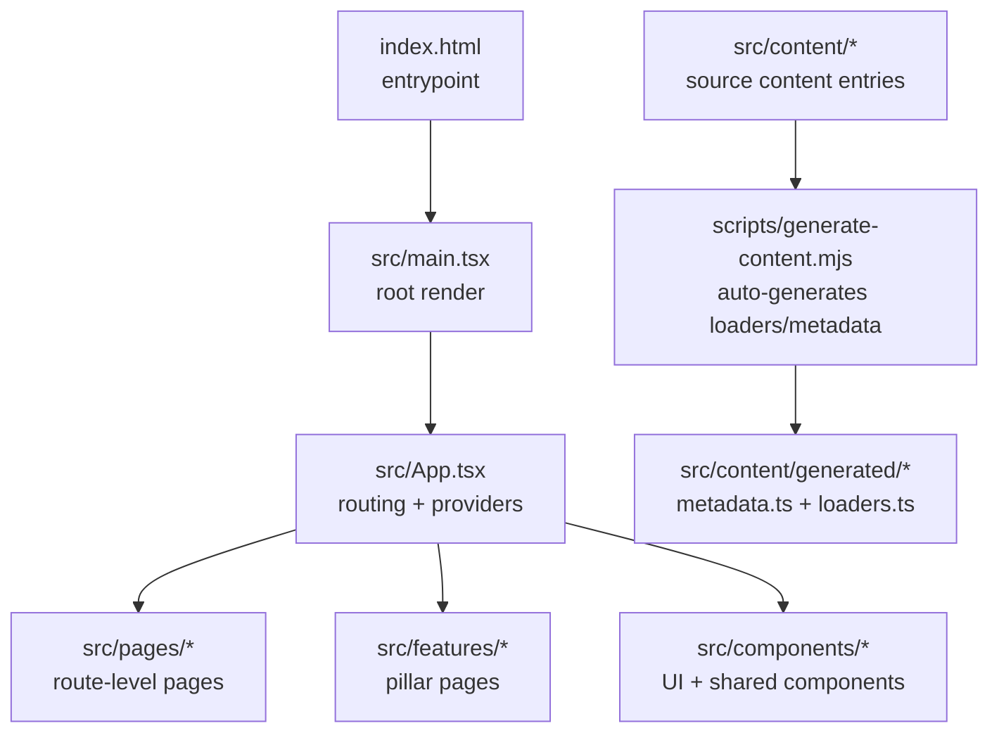
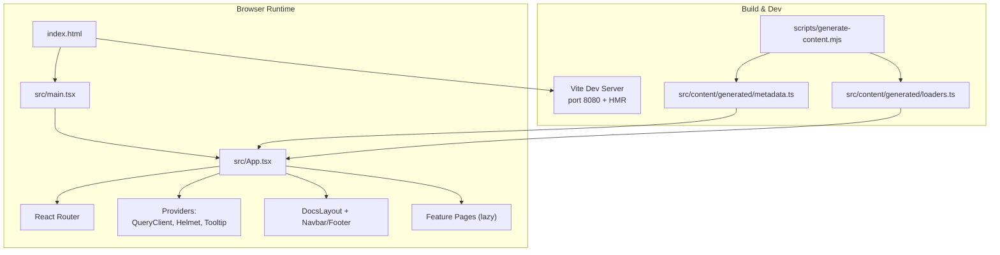
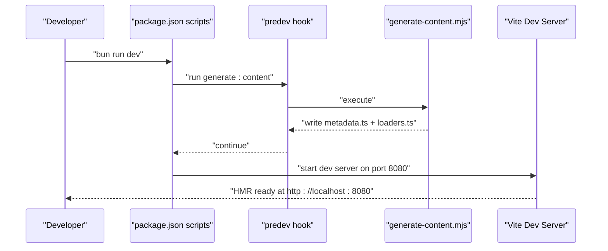
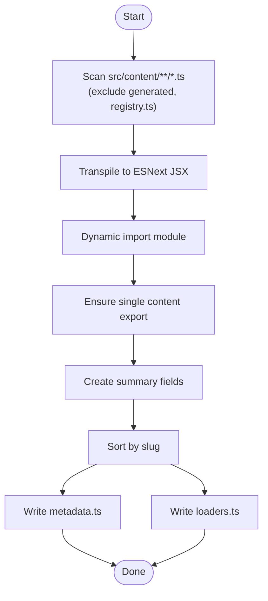
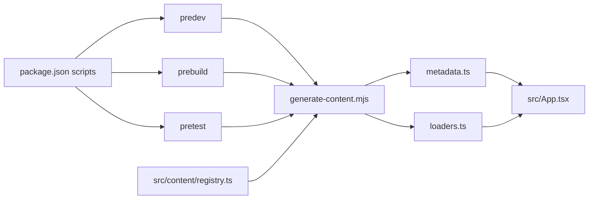

# Getting Started

<cite>
**Referenced Files in This Document**
- [README.md](file://README.md)
- [package.json](file://package.json)
- [vite.config.ts](file://vite.config.ts)
- [scripts/generate-content.mjs](file://scripts/generate-content.mjs)
- [src/content/registry.ts](file://src/content/registry.ts)
- [index.html](file://index.html)
- [src/main.tsx](file://src/main.tsx)
- [src/App.tsx](file://src/App.tsx)
- [tsconfig.json](file://tsconfig.json)
- [eslint.config.js](file://eslint.config.js)
- [tailwind.config.ts](file://tailwind.config.ts)
- [components.json](file://components.json)
- [playwright.config.ts](file://playwright.config.ts)
- [vitest.config.ts](file://vitest.config.ts)
</cite>

## Table of Contents
1. [Introduction](#introduction)
2. [Project Structure](#project-structure)
3. [Core Components](#core-components)
4. [Architecture Overview](#architecture-overview)
5. [Detailed Component Analysis](#detailed-component-analysis)
6. [Dependency Analysis](#dependency-analysis)
7. [Performance Considerations](#performance-considerations)
8. [Troubleshooting Guide](#troubleshooting-guide)
9. [Conclusion](#conclusion)
10. [Appendices](#appendices)

## Introduction
JSphere is a modern, full-featured JavaScript knowledge platform built with React, TypeScript, Vite, and Tailwind CSS. It provides structured learning paths, API references, production-ready recipes, integration guides, project walkthroughs, discovery tools, and debugging playbooks — all wrapped in a fast, accessible UI with dark mode, smart search, bookmarks, and reading progress tracking.

This guide focuses on rapid onboarding and development environment setup, covering prerequisites, installation, content generation, and running the development server with hot module replacement.

## Project Structure
At a high level, the project is organized around:
- Public assets under public/
- A content generation script under scripts/
- A large src/ tree containing components, pages, features, hooks, libs, tests, and content
- Build and tooling configs for Vite, TypeScript, ESLint, Tailwind CSS, Vitest, and Playwright

**Diagram sources**
- [index.html](file://index.html)
- [src/main.tsx](file://src/main.tsx)
- [src/App.tsx](file://src/App.tsx)
- [scripts/generate-content.mjs](file://scripts/generate-content.mjs)
- [src/content/registry.ts](file://src/content/registry.ts)

**Section sources**
- [README.md](file://README.md)
- [src/content/registry.ts](file://src/content/registry.ts)

## Core Components
- Development server: Vite runs on port 8080 with HMR enabled and overlays disabled for a cleaner terminal.
- Content generation: A Node-based script scans content entries, generates metadata and dynamic loaders, and writes them to src/content/generated/.
- Build pipeline: Vite builds the app with route-based code splitting and chunking for vendor/UI/query bundles.
- Type checking and linting: TypeScript strictness and ESLint with recommended rules.
- Styling: Tailwind CSS with custom design tokens and dark mode support.
- Testing: Vitest for unit/integration tests and Playwright for E2E tests.

**Section sources**
- [vite.config.ts](file://vite.config.ts)
- [scripts/generate-content.mjs](file://scripts/generate-content.mjs)
- [tsconfig.json](file://tsconfig.json)
- [eslint.config.js](file://eslint.config.js)
- [tailwind.config.ts](file://tailwind.config.ts)
- [playwright.config.ts](file://playwright.config.ts)
- [vitest.config.ts](file://vitest.config.ts)

## Architecture Overview
The runtime architecture centers on a React application bootstrapped via index.html and main.tsx, with App.tsx orchestrating routing, providers, and lazy-loaded pages. Content is authored under src/content and consumed via auto-generated metadata and loaders.

**Diagram sources**
- [index.html](file://index.html)
- [src/main.tsx](file://src/main.tsx)
- [src/App.tsx](file://src/App.tsx)
- [vite.config.ts](file://vite.config.ts)
- [scripts/generate-content.mjs](file://scripts/generate-content.mjs)
- [src/content/registry.ts](file://src/content/registry.ts)

## Detailed Component Analysis

### Prerequisites and Installation
- Node.js v18+ is required.
- Bun is recommended for speed, but npm, yarn, and pnpm are supported.
- Steps:
  1) Clone the repository and enter the directory.
  2) Install dependencies using your preferred package manager.
  3) Start the development server; content metadata is auto-generated before dev starts.

Verification:
- The dev server runs at http://localhost:8080.
- The app renders the homepage and navigable routes.

Supported package managers:
- Bun: bun install, bun run dev
- npm: npm install, npm run dev
- yarn: yarn install, yarn dev
- pnpm: pnpm install, pnpm dev

**Section sources**
- [README.md](file://README.md)
- [package.json](file://package.json)

### Development Server and Hot Module Replacement
- Vite dev server listens on port 8080 and enables HMR with overlay disabled.
- Host binding allows access from other devices on the network.
- The dev command triggers predev hooks to generate content metadata and loaders.

**Diagram sources**
- [package.json](file://package.json)
- [scripts/generate-content.mjs](file://scripts/generate-content.mjs)
- [vite.config.ts](file://vite.config.ts)

**Section sources**
- [vite.config.ts](file://vite.config.ts)
- [package.json](file://package.json)

### Content Generation Pipeline
JSphere auto-generates content metadata and loaders from TypeScript content entries. The pipeline:
- Scans src/content for .ts files (excluding registry.ts and the generated folder).
- Transpiles each file to ESNext JSX and dynamically imports it to extract a single content export.
- Builds a sorted list of summaries and writes contentSummaries to metadata.ts.
- Generates a contentLoaders map keyed by slug to dynamically import the content entry.
- Writes both files to src/content/generated/.

**Diagram sources**
- [scripts/generate-content.mjs](file://scripts/generate-content.mjs)
- [src/content/registry.ts](file://src/content/registry.ts)

**Section sources**
- [scripts/generate-content.mjs](file://scripts/generate-content.mjs)
- [src/content/registry.ts](file://src/content/registry.ts)

### Manual Content Generation Workflow
While dev, build, and test commands run the generator automatically, you can also run it manually:
- Command: bun run generate:content or npm run generate:content
- Output: src/content/generated/metadata.ts and src/content/generated/loaders.ts

Why this matters:
- Without generated metadata and loaders, content pages will not render correctly.
- Changes to content entries require regeneration to reflect updates.

**Section sources**
- [README.md](file://README.md)
- [package.json](file://package.json)
- [scripts/generate-content.mjs](file://scripts/generate-content.mjs)

### Build and Preview
- Build for production: bun run build or npm run build
- Development mode build (unminified): bun run build:dev or npm run build:dev
- Preview production build locally: bun run preview or npm run preview

Vite build configuration:
- Sourcemaps enabled in development mode.
- Manual chunks for vendor, UI, and query libraries to optimize caching and load performance.

**Section sources**
- [package.json](file://package.json)
- [vite.config.ts](file://vite.config.ts)

### Testing
- Unit & integration tests with Vitest: bun run test or npm run test
- Watch mode: bun run test:watch or npm run test:watch
- E2E tests with Playwright: bun run test:e2e or npm run test:e2e

Test coverage areas:
- Content integrity validation
- Search logic (fuzzy matching, ranking, filtering)
- SEO meta rendering
- User library (bookmarks, history, reading state)

**Section sources**
- [README.md](file://README.md)
- [playwright.config.ts](file://playwright.config.ts)
- [vitest.config.ts](file://vitest.config.ts)

### Linting and Formatting
- ESLint with TypeScript and React Hooks recommended rules.
- Recommended to run lint before committing: bun run lint or npm run lint

**Section sources**
- [eslint.config.js](file://eslint.config.js)
- [README.md](file://README.md)

### Styling and Design System
- Tailwind CSS configured with custom design tokens, dark mode, and animations.
- shadcn/ui components aliased via components.json for consistent UI primitives.

**Section sources**
- [tailwind.config.ts](file://tailwind.config.ts)
- [components.json](file://components.json)

## Dependency Analysis
The project’s scripts orchestrate the content generation pipeline before dev/build/test commands. The content registry aggregates all content entries, which the generator consumes to produce metadata and loaders.

**Diagram sources**
- [package.json](file://package.json)
- [scripts/generate-content.mjs](file://scripts/generate-content.mjs)
- [src/content/registry.ts](file://src/content/registry.ts)
- [src/App.tsx](file://src/App.tsx)

**Section sources**
- [package.json](file://package.json)
- [scripts/generate-content.mjs](file://scripts/generate-content.mjs)
- [src/content/registry.ts](file://src/content/registry.ts)
- [src/App.tsx](file://src/App.tsx)

## Performance Considerations
- Vite + SWC delivers sub-second builds and instant HMR during development.
- Route-based code splitting via lazy loading reduces initial bundle size.
- Manual chunking groups vendor/UI/query libraries for optimal caching.
- Tailwind purges unused styles; ensure your content paths are covered so nothing is unintentionally removed.

[No sources needed since this section provides general guidance]

## Troubleshooting Guide
Common setup issues and fixes:
- Node.js version too low
  - Symptom: Installation fails or dev server crashes immediately.
  - Fix: Upgrade to Node.js v18+.
- Missing dependencies after cloning
  - Symptom: “command not found” for dev/build/test.
  - Fix: Install dependencies using your package manager (bun install, npm install, yarn install, pnpm install).
- Port 8080 in use
  - Symptom: Vite fails to start with port conflict.
  - Fix: Change the port in vite.config.ts or kill the conflicting process.
- Content not rendering
  - Symptom: Blank content pages or missing slugs.
  - Fix: Run manual content generation (bun run generate:content) and ensure src/content/generated/ exists.
- HMR not updating
  - Symptom: Changes not reflected without refresh.
  - Fix: Disable overlay in vite.config.ts if needed; ensure no syntax errors in TS/TSX files.
- E2E tests failing to connect
  - Symptom: Playwright cannot reach the dev server.
  - Fix: Confirm baseURL and port in playwright.config.ts match your dev server settings.

Verification checklist:
- Dev server reachable at http://localhost:8080
- Homepage renders and navigation works
- Content pages load without blank screens
- Search modal opens and returns results
- Tests pass locally (bun run test or npm run test)

**Section sources**
- [vite.config.ts](file://vite.config.ts)
- [README.md](file://README.md)
- [playwright.config.ts](file://playwright.config.ts)

## Conclusion
You now have everything needed to set up JSphere quickly and develop confidently. The content generation pipeline is central to the app’s operation—always ensure it runs before dev/build/test. Use the provided scripts and configurations to keep your environment aligned with the project’s architecture.

[No sources needed since this section summarizes without analyzing specific files]

## Appendices

### Quick Commands Reference
- Install dependencies: bun install, npm install, yarn install, pnpm install
- Start dev server: bun run dev, npm run dev
- Generate content: bun run generate:content, npm run generate:content
- Build: bun run build, npm run build
- Dev build: bun run build:dev, npm run build:dev
- Preview prod: bun run preview, npm run preview
- Lint: bun run lint, npm run lint
- Unit tests: bun run test, npm run test
- Watch tests: bun run test:watch, npm run test:watch
- E2E tests: bun run test:e2e, npm run test:e2e

**Section sources**
- [README.md](file://README.md)
- [package.json](file://package.json)