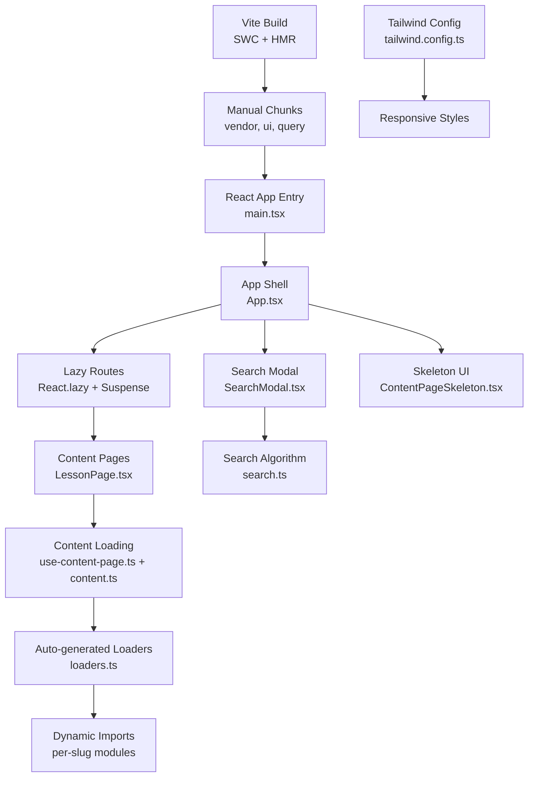
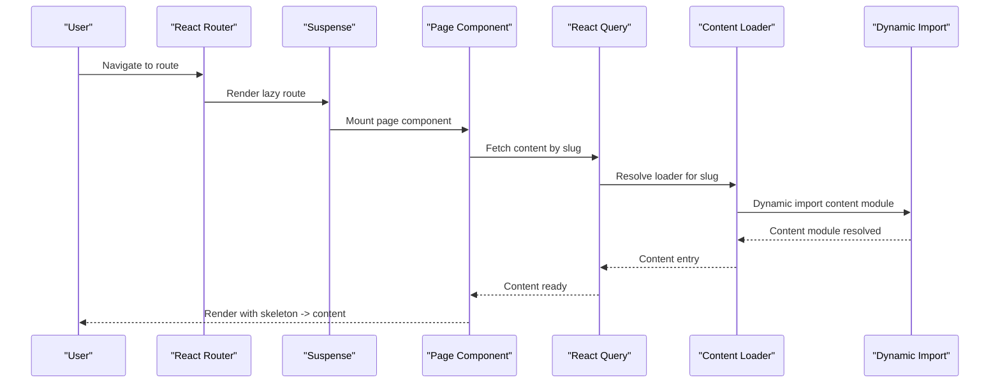
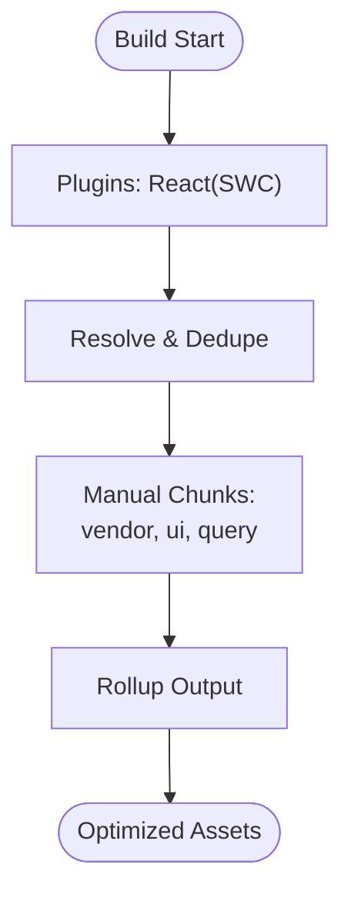
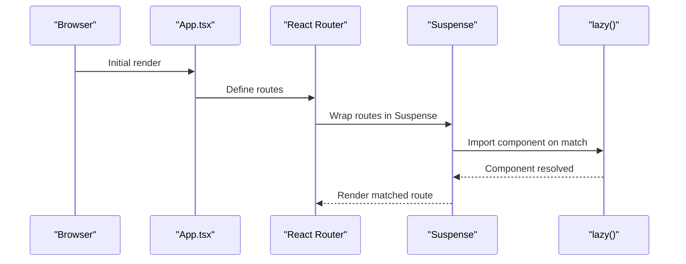
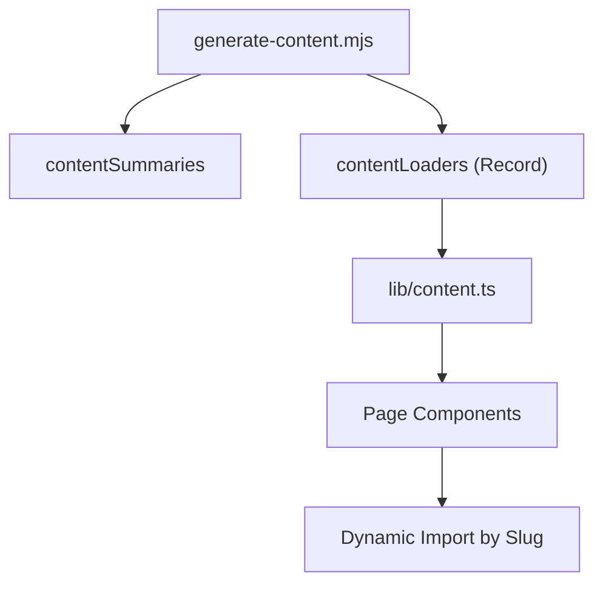
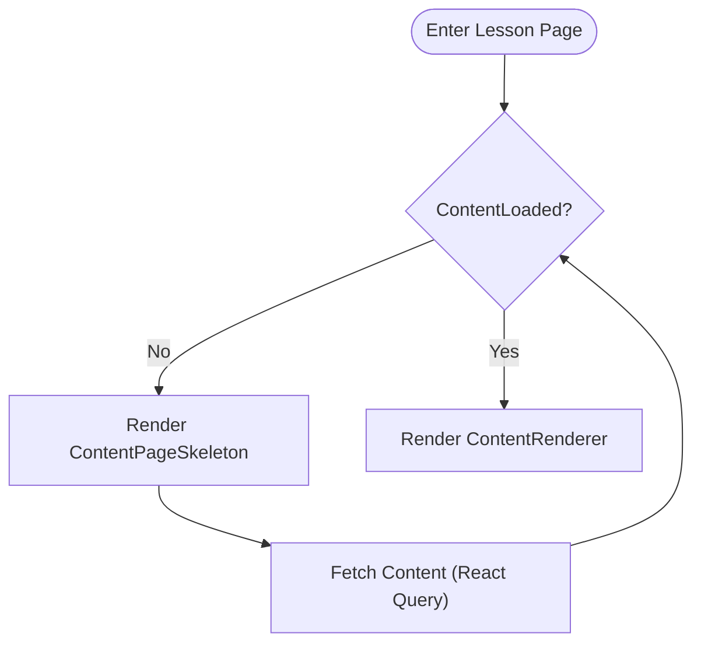
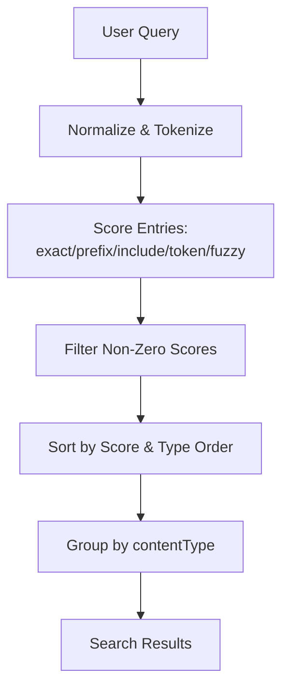
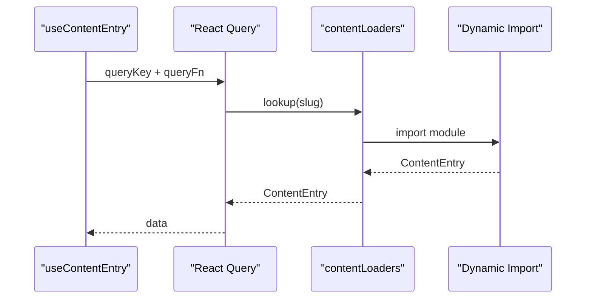
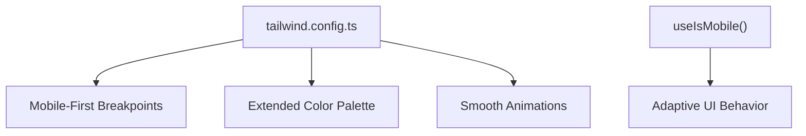
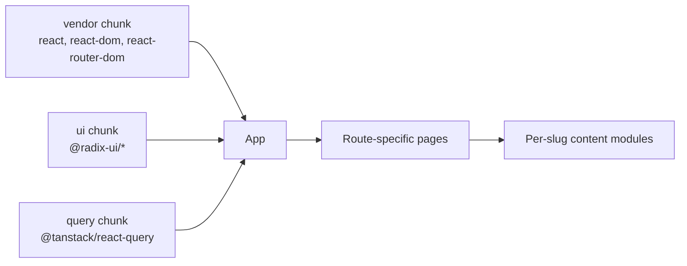

# Performance Optimization

<cite>
**Referenced Files in This Document**
- [vite.config.ts](file://vite.config.ts)
- [package.json](file://package.json)
- [src/main.tsx](file://src/main.tsx)
- [src/App.tsx](file://src/App.tsx)
- [src/lib/content.ts](file://src/lib/content.ts)
- [src/lib/search.ts](file://src/lib/search.ts)
- [src/components/search/SearchModal.tsx](file://src/components/search/SearchModal.tsx)
- [src/components/content/ContentPageSkeleton.tsx](file://src/components/content/ContentPageSkeleton.tsx)
- [src/components/content/ContentRenderer.tsx](file://src/components/content/ContentRenderer.tsx)
- [src/features/learn/LessonPage.tsx](file://src/features/learn/LessonPage.tsx)
- [src/hooks/use-content-page.ts](file://src/hooks/use-content-page.ts)
- [src/hooks/use-mobile.tsx](file://src/hooks/use-mobile.tsx)
- [scripts/generate-content.mjs](file://scripts/generate-content.mjs)
- [src/content/generated/loaders.ts](file://src/content/generated/loaders.ts)
- [tailwind.config.ts](file://tailwind.config.ts)
</cite>

## Table of Contents
1. [Introduction](#introduction)
2. [Project Structure](#project-structure)
3. [Core Components](#core-components)
4. [Architecture Overview](#architecture-overview)
5. [Detailed Component Analysis](#detailed-component-analysis)
6. [Dependency Analysis](#dependency-analysis)
7. [Performance Considerations](#performance-considerations)
8. [Troubleshooting Guide](#troubleshooting-guide)
9. [Conclusion](#conclusion)
10. [Appendices](#appendices)

## Introduction
This document provides a comprehensive performance optimization guide for JSphere, focusing on delivering a fast and responsive educational platform. It covers the Vite + SWC build system enabling sub-second builds and instant Hot Module Replacement (HMR), route-based code splitting via React Router lazy loading, a metadata-driven content system with auto-generated loaders that produce lean bundles, skeleton loading states and perceived performance enhancements, search algorithm optimizations for fuzzy matching and weighted scoring, content loading strategies using dynamic imports, responsive design and mobile optimization, monitoring and measurement approaches, and best practices for sustaining performance as the platform scales.

## Project Structure
JSphere is a React application configured with Vite and SWC for rapid development and production builds. The build pipeline is optimized with manual chunking to separate vendor, UI, and query libraries. Routing leverages React Router’s lazy loading to defer heavy components until needed. Content is managed through a metadata-driven system with auto-generated loaders that enable per-page dynamic imports, minimizing initial bundle size. UI performance benefits from skeleton loaders and lightweight rendering components.

**Diagram sources**
- [vite.config.ts:1-35](file://vite.config.ts#L1-L35)
- [src/main.tsx:1-6](file://src/main.tsx#L1-L6)
- [src/App.tsx:1-103](file://src/App.tsx#L1-L103)
- [src/features/learn/LessonPage.tsx:1-123](file://src/features/learn/LessonPage.tsx#L1-L123)
- [src/lib/content.ts:1-126](file://src/lib/content.ts#L1-L126)
- [src/content/generated/loaders.ts:1-97](file://src/content/generated/loaders.ts#L1-L97)
- [src/components/search/SearchModal.tsx:1-154](file://src/components/search/SearchModal.tsx#L1-L154)
- [src/lib/search.ts:1-127](file://src/lib/search.ts#L1-L127)
- [src/components/content/ContentPageSkeleton.tsx:1-14](file://src/components/content/ContentPageSkeleton.tsx#L1-L14)
- [tailwind.config.ts:1-104](file://tailwind.config.ts#L1-L104)

**Section sources**
- [vite.config.ts:1-35](file://vite.config.ts#L1-L35)
- [package.json:1-99](file://package.json#L1-L99)
- [src/main.tsx:1-6](file://src/main.tsx#L1-L6)
- [src/App.tsx:1-103](file://src/App.tsx#L1-L103)
- [tailwind.config.ts:1-104](file://tailwind.config.ts#L1-L104)

## Core Components
- Vite + SWC build system with manual chunking for vendor, UI, and query libraries to improve caching and parallel loading.
- Route-based code splitting using React Router lazy loading to defer heavy routes until navigation occurs.
- Metadata-driven content system with auto-generated loaders enabling per-slug dynamic imports for lean initial bundles.
- Skeleton loading states to maintain perceived performance while content is loading.
- Optimized search algorithm with fuzzy matching and weighted scoring to deliver fast, relevant results.
- Content loading hooks leveraging React Query for caching, retries, and stale-while-revalidate behavior.
- Responsive design and mobile-first styles via Tailwind CSS configuration.

**Section sources**
- [vite.config.ts:22-33](file://vite.config.ts#L22-L33)
- [src/App.tsx:11-23](file://src/App.tsx#L11-L23)
- [src/lib/content.ts:38-42](file://src/lib/content.ts#L38-L42)
- [src/components/content/ContentPageSkeleton.tsx:1-14](file://src/components/content/ContentPageSkeleton.tsx#L1-L14)
- [src/lib/search.ts:29-88](file://src/lib/search.ts#L29-L88)
- [src/hooks/use-content-page.ts:7-23](file://src/hooks/use-content-page.ts#L7-L23)
- [tailwind.config.ts:16-100](file://tailwind.config.ts#L16-L100)

## Architecture Overview
The platform’s performance architecture centers on three pillars:
- Build-time optimization: Vite + SWC with manual chunking to separate frequently changing application code from stable vendor libraries.
- Runtime optimization: Route-based code splitting and dynamic imports to minimize initial payload; skeleton UI and efficient rendering to keep the UI responsive.
- Data and content optimization: Auto-generated loaders and metadata-driven content retrieval with caching and intelligent search scoring.

**Diagram sources**
- [src/App.tsx:71-90](file://src/App.tsx#L71-L90)
- [src/features/learn/LessonPage.tsx:23-24](file://src/features/learn/LessonPage.tsx#L23-L24)
- [src/hooks/use-content-page.ts:8-22](file://src/hooks/use-content-page.ts#L8-L22)
- [src/lib/content.ts:38-42](file://src/lib/content.ts#L38-L42)
- [src/content/generated/loaders.ts:9-97](file://src/content/generated/loaders.ts#L9-L97)

## Detailed Component Analysis

### Build System: Vite + SWC with Manual Chunking
- Sub-second builds and instant HMR are enabled by Vite and the React plugin powered by SWC.
- Manual chunking separates vendor libraries (React, ReactDOM, React Router DOM), UI primitives (Radix UI packages), and state management (TanStack React Query) into dedicated chunks to maximize cache hits and parallel loading.
- Deduplication of React/ReactDOM reduces bundle size and avoids duplicate runtime overhead.
- Aliasing @ to src improves import readability and maintainability.

**Diagram sources**
- [vite.config.ts:7-33](file://vite.config.ts#L7-L33)

**Section sources**
- [vite.config.ts:7-33](file://vite.config.ts#L7-L33)
- [package.json:6-21](file://package.json#L6-L21)

### Route-Based Code Splitting with Lazy Loading
- Routes are lazily loaded using React.lazy with Suspense boundaries around the Routes to show a minimal fallback during transitions.
- Heavy components like SearchModal are imported lazily and mounted conditionally to avoid inflating the initial bundle.
- This strategy ensures that only the currently visible routes and their immediate dependencies are downloaded.

**Diagram sources**
- [src/App.tsx:11-23](file://src/App.tsx#L11-L23)
- [src/App.tsx:71-90](file://src/App.tsx#L71-L90)

**Section sources**
- [src/App.tsx:11-23](file://src/App.tsx#L11-L23)
- [src/App.tsx:71-90](file://src/App.tsx#L71-L90)

### Metadata-Driven Content System with Auto-Generated Loaders
- A build-time script generates content metadata and loaders from TypeScript content modules.
- Loaders are keyed by slug and return a dynamic import promise for the corresponding content module, enabling per-page lazy loading.
- The content library exposes functions to retrieve metadata and load content entries asynchronously, keeping the initial runtime small.

**Diagram sources**
- [scripts/generate-content.mjs:93-152](file://scripts/generate-content.mjs#L93-L152)
- [src/content/generated/loaders.ts:9-97](file://src/content/generated/loaders.ts#L9-L97)
- [src/lib/content.ts:38-42](file://src/lib/content.ts#L38-L42)

**Section sources**
- [scripts/generate-content.mjs:93-152](file://scripts/generate-content.mjs#L93-L152)
- [src/content/generated/loaders.ts:9-97](file://src/content/generated/loaders.ts#L9-L97)
- [src/lib/content.ts:38-42](file://src/lib/content.ts#L38-L42)

### Skeleton Loading States and Perceived Performance
- A minimal skeleton UI is rendered immediately while content is loading, preventing layout shifts and communicating progress to users.
- The Lesson page conditionally renders the skeleton until the content is fetched, after which the full renderer displays the content blocks.
- Smooth animations and transitions enhance perceived responsiveness.

**Diagram sources**
- [src/features/learn/LessonPage.tsx:53-55](file://src/features/learn/LessonPage.tsx#L53-L55)
- [src/components/content/ContentPageSkeleton.tsx:1-14](file://src/components/content/ContentPageSkeleton.tsx#L1-L14)
- [src/components/content/ContentRenderer.tsx:29-157](file://src/components/content/ContentRenderer.tsx#L29-L157)

**Section sources**
- [src/features/learn/LessonPage.tsx:53-55](file://src/features/learn/LessonPage.tsx#L53-L55)
- [src/components/content/ContentPageSkeleton.tsx:1-14](file://src/components/content/ContentPageSkeleton.tsx#L1-L14)
- [src/components/content/ContentRenderer.tsx:29-157](file://src/components/content/ContentRenderer.tsx#L29-L157)

### Search Algorithm Optimizations: Fuzzy Matching and Weighted Scoring
- The search algorithm normalizes and tokenizes queries and targets, applying multiple scoring heuristics: exact match, prefix, inclusion, token-based matching, and fuzzy subsequence scoring.
- Results are grouped by content type and sorted by score and type order, ensuring relevant results appear first.
- Debouncing the query input reduces unnecessary recomputation during typing.

**Diagram sources**
- [src/lib/search.ts:21-109](file://src/lib/search.ts#L21-L109)
- [src/components/search/SearchModal.tsx:42-52](file://src/components/search/SearchModal.tsx#L42-L52)

**Section sources**
- [src/lib/search.ts:21-109](file://src/lib/search.ts#L21-L109)
- [src/components/search/SearchModal.tsx:42-52](file://src/components/search/SearchModal.tsx#L42-L52)

### Content Loading Strategies and Dynamic Imports
- Content is fetched via a hook that integrates with React Query for caching, retries, and stale-while-revalidate behavior.
- The content loader resolves the appropriate module based on slug, enabling per-route lazy loading and reducing initial bundle size.
- Stale time and retry configuration balance freshness with performance.

**Diagram sources**
- [src/hooks/use-content-page.ts:7-23](file://src/hooks/use-content-page.ts#L7-L23)
- [src/lib/content.ts:38-42](file://src/lib/content.ts#L38-L42)
- [src/content/generated/loaders.ts:9-97](file://src/content/generated/loaders.ts#L9-L97)

**Section sources**
- [src/hooks/use-content-page.ts:7-23](file://src/hooks/use-content-page.ts#L7-L23)
- [src/lib/content.ts:38-42](file://src/lib/content.ts#L38-L42)
- [src/content/generated/loaders.ts:9-97](file://src/content/generated/loaders.ts#L9-L97)

### Responsive Design and Mobile Optimization
- Tailwind CSS is configured with a mobile-first approach, custom breakpoints, and responsive spacing to ensure optimal rendering on smaller screens.
- A dedicated hook detects mobile widths and can be used to adapt UI behavior for touch-friendly interactions.
- Typography and color palettes are extended to support readable text sizes and accessible contrast across devices.

**Diagram sources**
- [tailwind.config.ts:16-100](file://tailwind.config.ts#L16-L100)
- [src/hooks/use-mobile.tsx:1-20](file://src/hooks/use-mobile.tsx#L1-L20)

**Section sources**
- [tailwind.config.ts:16-100](file://tailwind.config.ts#L16-L100)
- [src/hooks/use-mobile.tsx:1-20](file://src/hooks/use-mobile.tsx#L1-L20)

## Dependency Analysis
The application’s performance depends on strategic separation of concerns and chunking:
- Vendor chunk isolates React ecosystem libraries.
- UI chunk groups Radix UI primitives for cohesive updates.
- Query chunk encapsulates TanStack React Query for predictable caching behavior.
- Application routes and pages remain as separate chunks to leverage route-based code splitting.

**Diagram sources**
- [vite.config.ts:26-30](file://vite.config.ts#L26-L30)
- [src/App.tsx:14-23](file://src/App.tsx#L14-L23)

**Section sources**
- [vite.config.ts:22-33](file://vite.config.ts#L22-L33)
- [src/App.tsx:14-23](file://src/App.tsx#L14-L23)

## Performance Considerations
- Keep initial bundle size low by deferring non-critical routes and components.
- Prefer lazy loading for heavy UI components and modals.
- Use React Query effectively with appropriate staleTime and retry policies to balance freshness and performance.
- Maintain a lean content metadata surface and rely on dynamic imports for content modules.
- Optimize search queries with debouncing and limit result sets to improve responsiveness.
- Leverage Tailwind utilities and CSS animations sparingly to avoid layout thrashing.
- Monitor Largest Contentful Paint (LCP), First Input Delay (FID), and Cumulative Layout Shift (CLS) in production to track real-world performance.

[No sources needed since this section provides general guidance]

## Troubleshooting Guide
- If routes appear slow to load, verify that lazy imports are used and Suspense boundaries wrap route components.
- If content fetches fail repeatedly, inspect the content loader mapping and slug correctness; confirm that the auto-generation script ran successfully.
- If search feels sluggish, check debounce timing and consider precomputing popular queries or limiting grouped result counts.
- If UI stutters during navigation, ensure animations and heavy computations are deferred or memoized.
- For build performance regressions, review manual chunk assignments and ensure vendor libraries are properly deduplicated.

**Section sources**
- [src/App.tsx:71-90](file://src/App.tsx#L71-L90)
- [src/content/generated/loaders.ts:9-97](file://src/content/generated/loaders.ts#L9-L97)
- [src/components/search/SearchModal.tsx:42-52](file://src/components/search/SearchModal.tsx#L42-L52)
- [src/hooks/use-content-page.ts:7-23](file://src/hooks/use-content-page.ts#L7-L23)

## Conclusion
JSphere achieves fast, responsive performance through a combination of Vite + SWC for rapid builds, route-based code splitting, metadata-driven content with auto-generated loaders, skeleton UI for perceived performance, optimized search scoring, and thoughtful responsive design. By continuing to leverage dynamic imports, caching strategies, and measured monitoring, the platform can scale efficiently as new content and features are added.

[No sources needed since this section summarizes without analyzing specific files]

## Appendices
- Best practices for maintaining performance:
  - Keep content modules granular and lazy-imported.
  - Use React Query’s caching and background refetch strategies judiciously.
  - Continuously monitor and iterate on search scoring weights and grouping.
  - Audit chunk sizes regularly and adjust manual chunk boundaries as the app evolves.
  - Measure and track Core Web Vitals in production to guide ongoing improvements.

[No sources needed since this section provides general guidance]