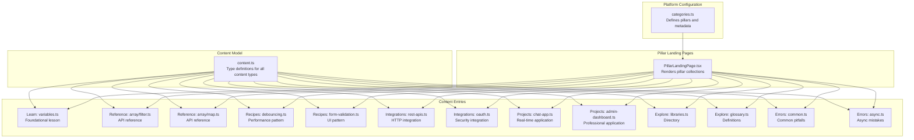
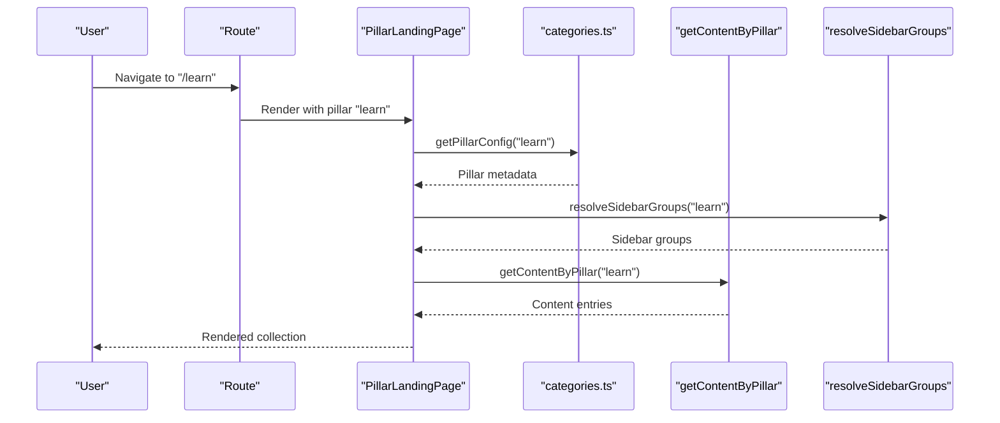
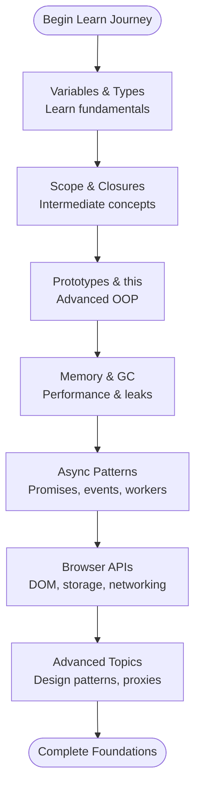
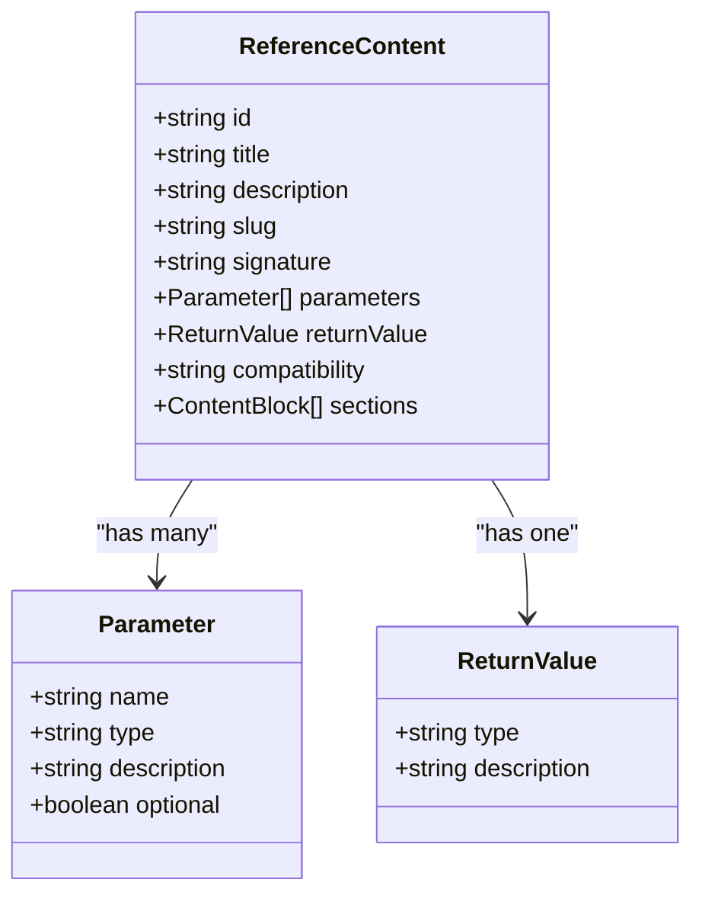
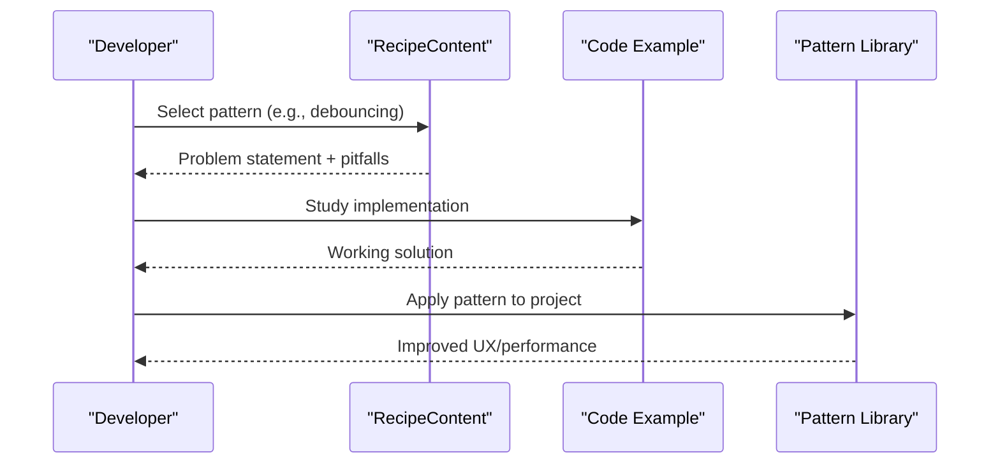
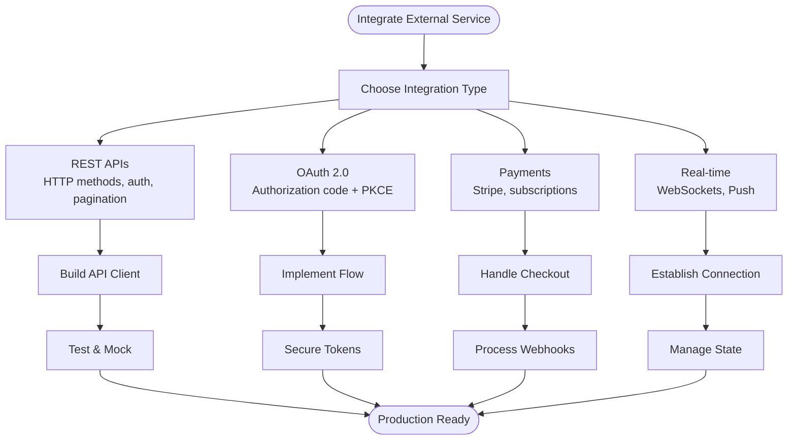
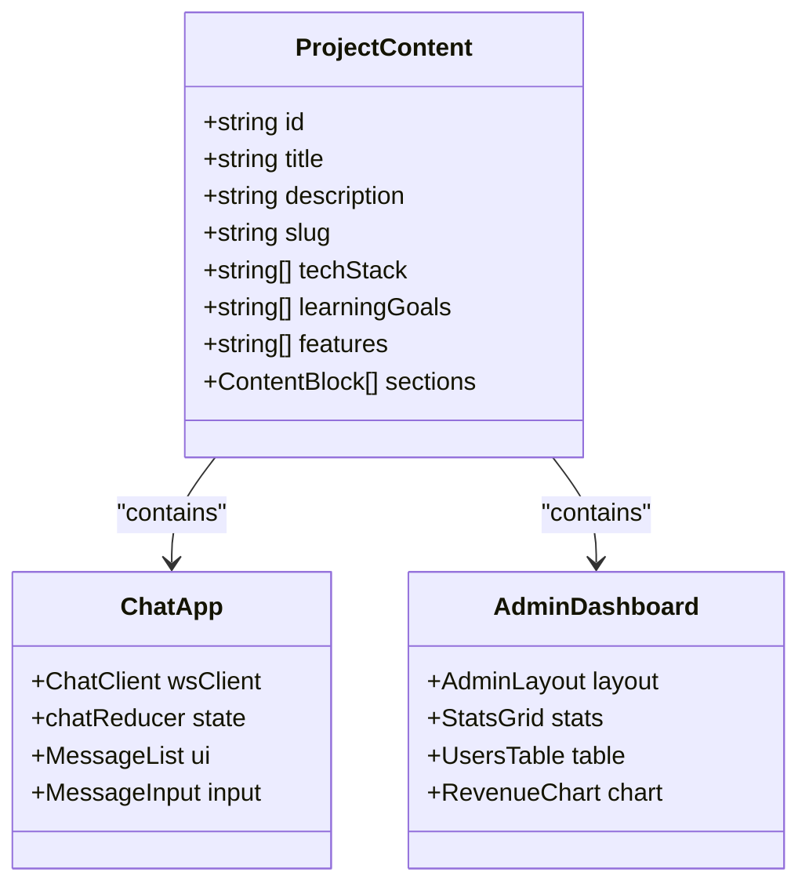
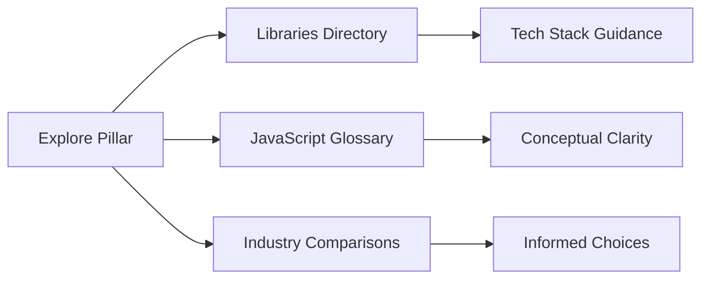
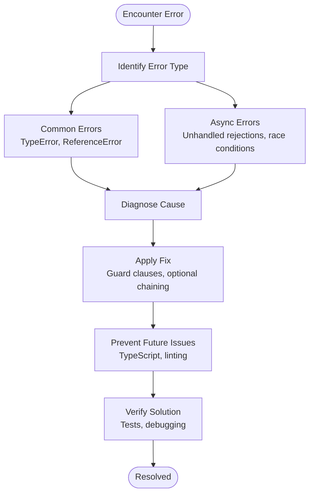
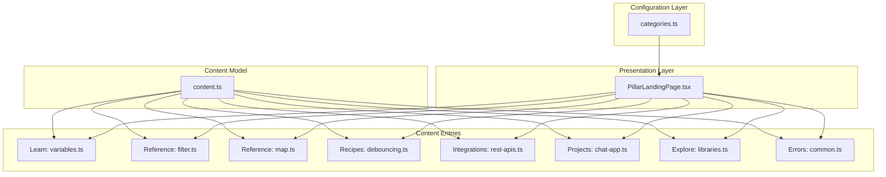

# Content Pillars Overview

<cite>
**Referenced Files in This Document**
- [categories.ts](file://src/config/categories.ts)
- [PillarLandingPage.tsx](file://src/features/pillar/PillarLandingPage.tsx)
- [learn/fundamentals/variables.ts](file://src/content/learn/fundamentals/variables.ts)
- [reference/array/filter.ts](file://src/content/reference/array/filter.ts)
- [reference/array/map.ts](file://src/content/reference/array/map.ts)
- [recipes/debouncing.ts](file://src/content/recipes/debouncing.ts)
- [recipes/form-validation.ts](file://src/content/recipes/form-validation.ts)
- [integrations/rest-apis.ts](file://src/content/integrations/rest-apis.ts)
- [integrations/oauth.ts](file://src/content/integrations/oauth.ts)
- [projects/chat-app.ts](file://src/content/projects/chat-app.ts)
- [projects/admin-dashboard.ts](file://src/content/projects/admin-dashboard.ts)
- [explore/libraries.ts](file://src/content/explore/libraries.ts)
- [explore/glossary.ts](file://src/content/explore/glossary.ts)
- [errors/common.ts](file://src/content/errors/common.ts)
- [errors/async.ts](file://src/content/errors/async.ts)
- [content.ts](file://src/types/content.ts)
</cite>

## Table of Contents
1. [Introduction](#introduction)
2. [Project Structure](#project-structure)
3. [Core Components](#core-components)
4. [Architecture Overview](#architecture-overview)
5. [Detailed Component Analysis](#detailed-component-analysis)
6. [Dependency Analysis](#dependency-analysis)
7. [Performance Considerations](#performance-considerations)
8. [Troubleshooting Guide](#troubleshooting-guide)
9. [Conclusion](#conclusion)

## Introduction
JSphere is a comprehensive JavaScript education platform organized around seven distinct learning pillars. Each pillar serves a specific pedagogical purpose and collectively supports a complete learning journey from fundamentals to advanced engineering. The pillars are designed to complement each other: Learn builds foundational knowledge, Reference provides authoritative API documentation, Recipes demonstrates practical solutions, Integrations covers real-world connectivity, Projects offers hands-on applications, Explore expands discovery, and Errors equips learners with debugging expertise.

## Project Structure
The platform organizes content into a hierarchical structure aligned with the seven pillars. Each piece of content is represented as a strongly-typed content entry with metadata, sections, and pedagogical elements. The configuration defines the pillars, their labels, descriptions, and visual identity, while landing pages render curated collections of content grouped by category and difficulty.

**Diagram sources**
- [categories.ts:14-85](file://src/config/categories.ts#L14-L85)
- [PillarLandingPage.tsx:15-89](file://src/features/pillar/PillarLandingPage.tsx#L15-L89)
- [content.ts:30-142](file://src/types/content.ts#L30-L142)

**Section sources**
- [categories.ts:14-85](file://src/config/categories.ts#L14-L85)
- [PillarLandingPage.tsx:15-89](file://src/features/pillar/PillarLandingPage.tsx#L15-L89)
- [content.ts:30-142](file://src/types/content.ts#L30-L142)

## Core Components
Each pillar is defined by a combination of configuration metadata and content entries. The configuration provides labels, descriptions, icons, and ordering, while content entries deliver structured pedagogy with sections, examples, and cross-references.

- Learn: Structured lessons progressing from fundamentals to advanced topics, with learning goals, exercises, and comprehensive coverage of core concepts.
- Reference: Authoritative API documentation with signatures, parameters, return values, compatibility, and practical examples.
- Recipes: Practical implementation patterns for common UI and performance challenges, including pitfalls and variations.
- Integrations: Real-world connectivity guides for REST APIs, OAuth, payments, and real-time communications.
- Projects: Hands-on applications demonstrating professional-grade features and engineering patterns.
- Explore: Discovery tools including libraries, glossaries, and comparisons to broaden understanding.
- Errors: Debugging guides for common JavaScript pitfalls and asynchronous programming issues.

**Section sources**
- [categories.ts:14-85](file://src/config/categories.ts#L14-L85)
- [content.ts:74-138](file://src/types/content.ts#L74-L138)

## Architecture Overview
The platform architecture aligns content creation with consumption through a unified content model and standardized landing pages. Configuration determines the pillars and their presentation, while content entries encapsulate pedagogy and examples. The landing page composes sidebar groups, resolves content by pillar, and renders discoverable collections.

**Diagram sources**
- [PillarLandingPage.tsx:15-89](file://src/features/pillar/PillarLandingPage.tsx#L15-L89)
- [categories.ts:87-90](file://src/config/categories.ts#L87-L90)

**Section sources**
- [PillarLandingPage.tsx:15-89](file://src/features/pillar/PillarLandingPage.tsx#L15-L89)
- [categories.ts:87-90](file://src/config/categories.ts#L87-L90)

## Detailed Component Analysis

### Learn: JavaScript Fundamentals to Advanced Concepts
The Learn pillar provides structured, progressive instruction from variables and types to advanced topics like closures, prototypes, and memory management. Each lesson includes learning goals, exercises, sections with code examples, and best practices.

Pedagogical philosophy:
- Build understanding incrementally with clear prerequisites and learning outcomes.
- Reinforce concepts through guided exercises and practical examples.
- Emphasize correctness and performance considerations early.

Implementation highlights:
- Comprehensive coverage of primitive and reference types, coercion, and destructuring.
- Practical exercises for common pitfalls and performance optimizations.
- Integration of browser APIs and asynchronous patterns.

**Diagram sources**
- [learn/fundamentals/variables.ts:21-29](file://src/content/learn/fundamentals/variables.ts#L21-L29)

**Section sources**
- [learn/fundamentals/variables.ts:3-633](file://src/content/learn/fundamentals/variables.ts#L3-L633)

### Reference: API Documentation with Signatures and Compatibility
The Reference pillar delivers authoritative, searchable documentation for JavaScript APIs. Each entry includes method signatures, parameter descriptions, return values, compatibility notes, and practical examples.

Pedagogical philosophy:
- Provide precise, actionable information for quick lookup and deep understanding.
- Include browser compatibility and TypeScript type narrowing for modern development.
- Offer real-world patterns and common mistakes to avoid.

Implementation highlights:
- Consistent structure across entries: signature, parameters, return value, compatibility.
- Rich examples demonstrating chaining, edge cases, and performance considerations.
- Cross-references to related methods and topics.

**Diagram sources**
- [content.ts:84-91](file://src/types/content.ts#L84-L91)

**Section sources**
- [reference/array/filter.ts:3-223](file://src/content/reference/array/filter.ts#L3-L223)
- [reference/array/map.ts:3-294](file://src/content/reference/array/map.ts#L3-L294)

### Recipes: Practical Implementation Patterns
The Recipes pillar showcases engineering patterns for common UI and performance challenges. Each recipe addresses a specific problem, outlines pitfalls, presents variations, and provides code examples.

Pedagogical philosophy:
- Teach by solving real problems with reusable patterns.
- Emphasize trade-offs and when to apply each pattern.
- Include accessibility, performance, and maintainability considerations.

Implementation highlights:
- Debouncing and throttling for performance optimization.
- Form validation strategies with real-time feedback.
- Integration patterns for search, autosave, and window resize.

**Diagram sources**
- [recipes/debouncing.ts:20-27](file://src/content/recipes/debouncing.ts#L20-L27)
- [recipes/form-validation.ts:20-28](file://src/content/recipes/form-validation.ts#L20-L28)

**Section sources**
- [recipes/debouncing.ts:3-60](file://src/content/recipes/debouncing.ts#L3-L60)
- [recipes/form-validation.ts:3-73](file://src/content/recipes/form-validation.ts#L3-L73)

### Integrations: External Service Connections
The Integrations pillar covers connecting JavaScript applications to external services. It includes REST APIs, OAuth, payments, and real-time communications with practical guides and security considerations.

Pedagogical philosophy:
- Bridge theory and practice with real-world integration patterns.
- Emphasize security, reliability, and error handling.
- Provide reusable patterns and best practices.

Implementation highlights:
- REST API client construction with authentication and pagination.
- OAuth 2.0 flows including PKCE for SPAs.
- Token management, request cancellation, and error handling strategies.

**Diagram sources**
- [integrations/rest-apis.ts:23-32](file://src/content/integrations/rest-apis.ts#L23-L32)
- [integrations/oauth.ts:24-33](file://src/content/integrations/oauth.ts#L24-L33)

**Section sources**
- [integrations/rest-apis.ts:3-318](file://src/content/integrations/rest-apis.ts#L3-L318)
- [integrations/oauth.ts:3-322](file://src/content/integrations/oauth.ts#L3-L322)

### Projects: Hands-On Applications
The Projects pillar offers real-world applications demonstrating professional-grade features. Projects include chat apps, dashboards, collaborative editors, and more.

Pedagogical philosophy:
- Learn by building complete applications.
- Integrate multiple technologies and patterns.
- Focus on user experience, performance, and maintainability.

Implementation highlights:
- Chat application with WebSocket connections, auto-reconnect, and typing indicators.
- Admin dashboard with responsive layout, data tables, charts, and role-based access.
- Professional UI patterns, state management, and accessibility.

**Diagram sources**
- [content.ts:115-121](file://src/types/content.ts#L115-L121)

**Section sources**
- [projects/chat-app.ts:3-444](file://src/content/projects/chat-app.ts#L3-L444)
- [projects/admin-dashboard.ts:3-369](file://src/content/projects/admin-dashboard.ts#L3-L369)

### Explore: Discovery Tools and Resources
The Explore pillar provides discovery tools for libraries, glossaries, and industry comparisons. It helps learners expand their knowledge beyond core JavaScript concepts.

Pedagogical philosophy:
- Encourage exploration and continuous learning.
- Provide curated directories and definitions.
- Support informed technology decisions.

Implementation highlights:
- Curated directories of JavaScript libraries and frameworks.
- Comprehensive glossary of JavaScript terms and concepts.
- Comparisons and recommendations for tooling and ecosystems.

**Diagram sources**
- [explore/libraries.ts:20-215](file://src/content/explore/libraries.ts#L20-L215)
- [explore/glossary.ts:20-199](file://src/content/explore/glossary.ts#L20-L199)

**Section sources**
- [explore/libraries.ts:3-215](file://src/content/explore/libraries.ts#L3-L215)
- [explore/glossary.ts:3-199](file://src/content/explore/glossary.ts#L3-L199)

### Errors: Debugging Guides and Troubleshooting
The Errors pillar equips learners with debugging expertise for common JavaScript pitfalls and asynchronous programming issues. It focuses on prevention, diagnosis, and resolution strategies.

Pedagogical philosophy:
- Teach debugging systematically and comprehensively.
- Emphasize prevention through best practices and tooling.
- Provide practical solutions for real-world scenarios.

Implementation highlights:
- Common JavaScript errors with real-world examples and solutions.
- Async mistakes including unhandled rejections, race conditions, and memory leaks.
- Debug strategies, prevention techniques, and defensive programming patterns.

**Diagram sources**
- [errors/common.ts:28-311](file://src/content/errors/common.ts#L28-L311)
- [errors/async.ts:28-411](file://src/content/errors/async.ts#L28-L411)

**Section sources**
- [errors/common.ts:3-312](file://src/content/errors/common.ts#L3-L312)
- [errors/async.ts:3-412](file://src/content/errors/async.ts#L3-L412)

## Dependency Analysis
The platform exhibits clear separation of concerns with configuration driving presentation and content entries providing pedagogical material. The content model ensures consistency across all pillars while enabling specialized structures for each content type.

**Diagram sources**
- [categories.ts:14-85](file://src/config/categories.ts#L14-L85)
- [PillarLandingPage.tsx:15-89](file://src/features/pillar/PillarLandingPage.tsx#L15-L89)
- [content.ts:30-142](file://src/types/content.ts#L30-L142)

**Section sources**
- [categories.ts:14-85](file://src/config/categories.ts#L14-L85)
- [PillarLandingPage.tsx:15-89](file://src/features/pillar/PillarLandingPage.tsx#L15-L89)
- [content.ts:30-142](file://src/types/content.ts#L30-L142)

## Performance Considerations
- Learn: Progressively introduce complexity to avoid cognitive overload; use exercises to reinforce concepts.
- Reference: Provide concise signatures and compatibility notes to minimize lookup time.
- Recipes: Emphasize performance implications of patterns (debouncing, throttling) and suggest alternatives.
- Integrations: Highlight caching strategies, request cancellation, and error boundaries.
- Projects: Demonstrate virtualization, controlled concurrency, and state normalization.
- Explore: Curate lightweight resources and provide quick-access categorization.
- Errors: Teach profiling techniques and defensive programming to prevent performance regressions.

## Troubleshooting Guide
Common issues and resolutions across pillars:
- Learn: Use exercises to identify knowledge gaps; revisit fundamentals when struggling with advanced topics.
- Reference: Cross-reference signatures and compatibility; leverage TypeScript for compile-time checks.
- Recipes: Validate assumptions about timing and state; test with real user interactions.
- Integrations: Implement proper error handling and retry logic; use AbortController for request cancellation.
- Projects: Monitor performance metrics; implement lazy loading and virtualization for large datasets.
- Explore: Use the glossary to clarify terminology; consult libraries directory for suitable tools.
- Errors: Establish systematic debugging workflows; implement global error handlers and logging.

**Section sources**
- [errors/common.ts:284-311](file://src/content/errors/common.ts#L284-L311)
- [errors/async.ts:349-411](file://src/content/errors/async.ts#L349-L411)

## Conclusion
JSphere's seven-pillar architecture creates a comprehensive educational ecosystem that progresses from foundational knowledge to advanced engineering. By combining structured lessons, authoritative references, practical recipes, real-world integrations, hands-on projects, discovery tools, and debugging expertise, learners develop both breadth and depth of JavaScript mastery. The consistent content model and pedagogical philosophy ensure that each pillar builds upon and complements the others, supporting a complete and effective learning journey.