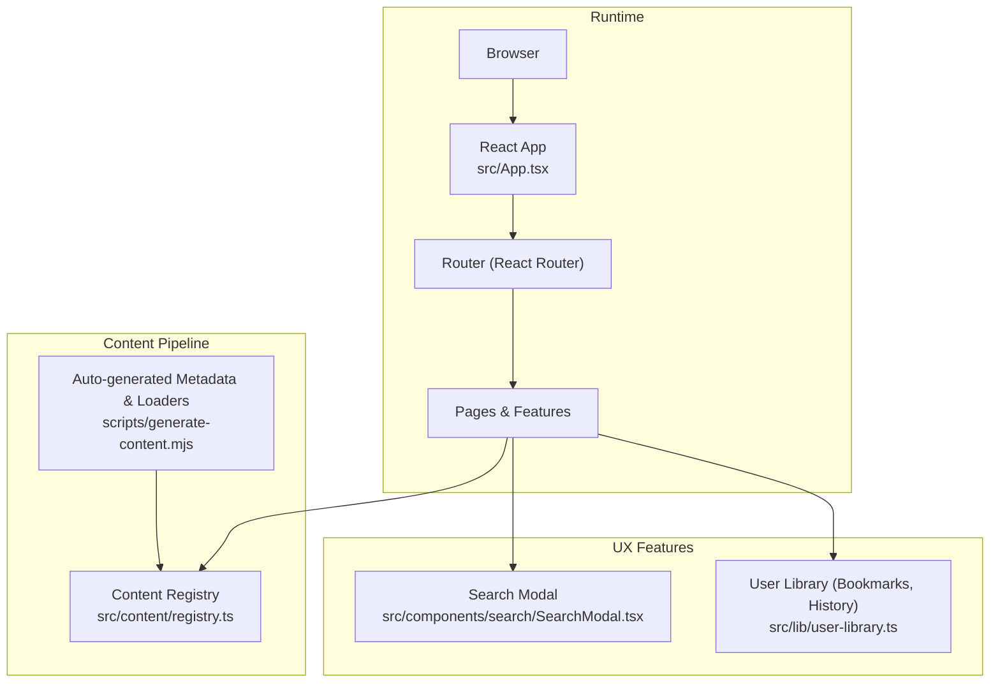

# Getting Started

<cite>
**Referenced Files in This Document**
- [README.md](file://README.md)
- [package.json](file://package.json)
- [vite.config.ts](file://vite.config.ts)
- [src/main.tsx](file://src/main.tsx)
- [src/App.tsx](file://src/App.tsx)
- [src/lib/search.ts](file://src/lib/search.ts)
- [src/components/search/SearchModal.tsx](file://src/components/search/SearchModal.tsx)
- [src/lib/user-library.ts](file://src/lib/user-library.ts)
- [src/hooks/use-user-library.ts](file://src/hooks/use-user-library.ts)
- [src/config/categories.ts](file://src/config/categories.ts)
- [src/features/home/HomePage.tsx](file://src/features/home/HomePage.tsx)
- [scripts/generate-content.mjs](file://scripts/generate-content.mjs)
- [src/content/registry.ts](file://src/content/registry.ts)
- [src/types/content.ts](file://src/types/content.ts)
- [src/content/learn/fundamentals/variables.ts](file://src/content/learn/fundamentals/variables.ts)
- [src/content/recipes/debouncing.ts](file://src/content/recipes/debouncing.ts)
- [src/content/projects/crud-app.ts](file://src/content/projects/crud-app.ts)
</cite>

## Table of Contents
1. [Introduction](#introduction)
2. [Prerequisites](#prerequisites)
3. [Installation](#installation)
4. [Development Server](#development-server)
5. [Basic Usage](#basic-usage)
6. [Quick Start Workflows](#quick-start-workflows)
7. [Verification Steps](#verification-steps)
8. [Troubleshooting](#troubleshooting)
9. [Architecture Overview](#architecture-overview)
10. [Dependency Analysis](#dependency-analysis)
11. [Performance Considerations](#performance-considerations)
12. [Conclusion](#conclusion)

## Introduction
JSphere is a modern, full-featured JavaScript engineering knowledge platform. It organizes learning content into seven pillars: Learn, Reference, Recipes, Integrations, Projects, Explore, and Errors. The platform emphasizes practical engineering knowledge with rich content rendering, smart search, personalization (bookmarks, reading history), and performance-first tooling.

## Prerequisites
- Node.js v18 or higher
- A package manager: Bun (recommended), npm, yarn, or pnpm

These requirements are validated by the project’s setup and scripts.

**Section sources**
- [README.md: Prerequisites:197-203](file://README.md#L197-L203)

## Installation
Follow these steps to install and run JSphere locally:

1. Clone the repository and enter the project directory.
2. Install dependencies using your preferred package manager:
   - Bun: bun install
   - npm: npm install
3. Start the development server:
   - Bun: bun run dev
   - npm: npm run dev

The development server will automatically generate content metadata before starting.

**Section sources**
- [README.md: Installation:204-221](file://README.md#L204-L221)
- [package.json: Scripts:6-21](file://package.json#L6-L21)

## Development Server
- Port: 8080
- Host binding: :: (accessible on all interfaces)
- Hot Module Replacement (HMR) overlay disabled for a cleaner DX

You can adjust the port and host in the Vite configuration if needed.

**Section sources**
- [vite.config.ts: Server configuration:8-14](file://vite.config.ts#L8-L14)
- [README.md: Available Scripts:234-248](file://README.md#L234-L248)

## Basic Usage
Once the dev server is running, open http://localhost:8080 in your browser.

- Navigate the seven content pillars:
  - Learn: Structured lessons from fundamentals to advanced topics
  - Reference: API references with signatures and examples
  - Recipes: Production-ready implementation patterns
  - Integrations: Guides for external services and APIs
  - Projects: Full app walkthroughs
  - Explore: Libraries, glossary, tooling, and comparisons
  - Errors: Debugging guides and error breakdowns

- Search content:
  - Press ⌘K or Ctrl+K to open the search modal
  - Type to filter by title, aliases, keywords, tags, and descriptions
  - Select results to navigate directly

- Personalization:
  - Bookmark content to build a personal library
  - Resume reading where you left off
  - Revisit recently viewed items
  - Search history is available for quick recall

**Section sources**
- [README.md: Content Pillars:63-76](file://README.md#L63-L76)
- [README.md: Features:79-121](file://README.md#L79-L121)
- [src/App.tsx: Keyboard shortcut and search modal:43-53](file://src/App.tsx#L43-L53)
- [src/components/search/SearchModal.tsx: Search UI:41-60](file://src/components/search/SearchModal.tsx#L41-L60)
- [src/lib/search.ts: Search logic:90-113](file://src/lib/search.ts#L90-L113)
- [src/lib/user-library.ts: Bookmarks and history:138-170](file://src/lib/user-library.ts#L138-L170)
- [src/features/home/HomePage.tsx: Personalized sections:150-178](file://src/features/home/HomePage.tsx#L150-L178)

## Quick Start Workflows
Below are common, productivity-focused workflows mapped to the platform’s structure.

### Learning a New Concept
- Start at Learn → Fundamentals
- Example: Variables & Types
- Use the “Continue Reading” and “Recently Viewed” sections on the homepage to pick up where you left off
- Toggle bookmarks to curate your learning queue

**Section sources**
- [src/features/home/HomePage.tsx: Continue Reading and Bookmarks:304-338](file://src/features/home/HomePage.tsx#L304-L338)
- [src/content/learn/fundamentals/variables.ts: Lesson content:3-36](file://src/content/learn/fundamentals/variables.ts#L3-L36)

### Finding Implementation Patterns
- Go to Recipes
- Example: Debouncing & Throttling
- Copy and adapt the provided patterns for search UI, autosave, and performance-sensitive events

**Section sources**
- [src/content/recipes/debouncing.ts: Recipe content:3-27](file://src/content/recipes/debouncing.ts#L3-L27)

### Building a Project
- Explore Projects
- Example: CRUD Todo App
- Follow the step-by-step guide to implement state management, API integration, and UI components

**Section sources**
- [src/content/projects/crud-app.ts: Project content:3-22](file://src/content/projects/crud-app.ts#L3-L22)

## Verification Steps
After installation and server start, verify your setup:

- Confirm the dev server is listening on http://localhost:8080
- Open the homepage and ensure:
  - Featured content is visible
  - Pillar cards render correctly
  - Personalized sections (Continue Reading, Recently Viewed, Bookmarks) appear
- Test search:
  - Open the search modal with ⌘K/Ctrl+K
  - Enter a query and confirm results appear and you can navigate to a result
- Verify personalization:
  - Toggle a bookmark and refresh the page to see it persist
  - Navigate to a lesson and return to see “Continue Reading” update

**Section sources**
- [README.md: Available Scripts:234-248](file://README.md#L234-L248)
- [src/App.tsx: Keyboard shortcut:43-53](file://src/App.tsx#L43-L53)
- [src/components/search/SearchModal.tsx: Search modal:41-60](file://src/components/search/SearchModal.tsx#L41-L60)
- [src/lib/user-library.ts: Persistence and state:103-123](file://src/lib/user-library.ts#L103-L123)

## Troubleshooting
- Port already in use:
  - Change the port in the Vite config or stop the conflicting process
  - Reference: [vite.config.ts:8-14](file://vite.config.ts#L8-L14)
- Package manager issues:
  - Try switching between Bun, npm, yarn, or pnpm as needed
  - Reference: [README.md: Installation:204-221](file://README.md#L204-L221)
- Content not loading:
  - Ensure content metadata is generated before dev/build/test
  - Run: bun run generate:content or npm run generate:content
  - Reference: [scripts/generate-content.mjs:93-152](file://scripts/generate-content.mjs#L93-L152)
- Search not working:
  - Confirm the search modal opens and results appear
  - Reference: [src/components/search/SearchModal.tsx:41-60](file://src/components/search/SearchModal.tsx#L41-L60)
- Persistent state not updating:
  - Check local storage availability and permissions
  - Reference: [src/lib/user-library.ts:103-123](file://src/lib/user-library.ts#L103-L123)

**Section sources**
- [vite.config.ts: Server configuration:8-14](file://vite.config.ts#L8-L14)
- [README.md: Installation:204-221](file://README.md#L204-L221)
- [scripts/generate-content.mjs: Content generation:93-152](file://scripts/generate-content.mjs#L93-L152)
- [src/components/search/SearchModal.tsx: Search modal:41-60](file://src/components/search/SearchModal.tsx#L41-L60)
- [src/lib/user-library.ts: State persistence:103-123](file://src/lib/user-library.ts#L103-L123)

## Architecture Overview
High-level runtime and content pipeline:

**Diagram sources**
- [src/App.tsx:40-99](file://src/App.tsx#L40-L99)
- [src/content/registry.ts:161-305](file://src/content/registry.ts#L161-L305)
- [scripts/generate-content.mjs:93-152](file://scripts/generate-content.mjs#L93-L152)
- [src/components/search/SearchModal.tsx:41-60](file://src/components/search/SearchModal.tsx#L41-L60)
- [src/lib/user-library.ts:103-123](file://src/lib/user-library.ts#L103-L123)

## Dependency Analysis
- Build and Dev Tools
  - Vite + SWC for fast builds and HMR
  - React Router for client-side routing
- UI and Styling
  - Radix UI + shadcn/ui primitives
  - Tailwind CSS for utility-first styling
- Data and Forms
  - TanStack Query for async state
  - React Hook Form + Zod for forms
- Code Rendering
  - Prism React Renderer for syntax highlighting
- Testing
  - Vitest + Testing Library for unit tests
  - Playwright for E2E tests

**Section sources**
- [README.md: Tech Stack:124-144](file://README.md#L124-L144)
- [package.json: Dependencies and Dev Dependencies:22-97](file://package.json#L22-L97)

## Performance Considerations
- Sub-second builds and HMR via Vite + SWC
- Route-based code splitting with lazy loading
- Metadata-driven content with auto-generated loaders
- Skeleton loading states for perceived performance
- Debouncing/throttling patterns in Recipes for UI responsiveness

**Section sources**
- [README.md: Features (Performance):111-116](file://README.md#L111-L116)
- [src/content/recipes/debouncing.ts:3-27](file://src/content/recipes/debouncing.ts#L3-L27)

## Conclusion
You are ready to learn, search, and build with JSphere. Use the seven pillars to target your needs, leverage the smart search and personalization features, and follow the quick start workflows to accelerate your productivity. If you encounter issues, consult the troubleshooting section and verification steps to ensure a smooth setup.