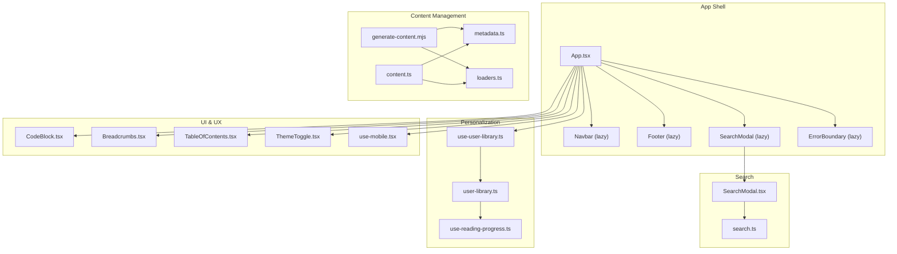
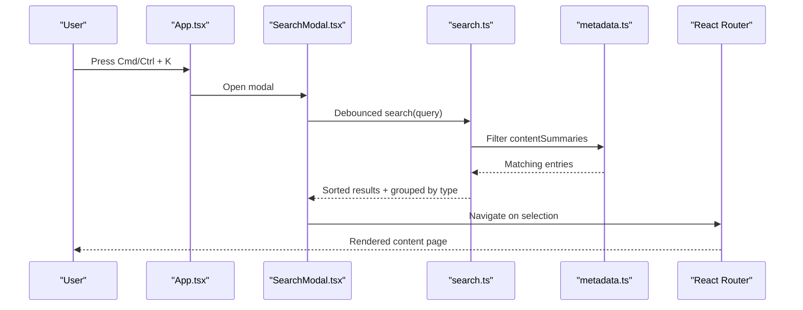
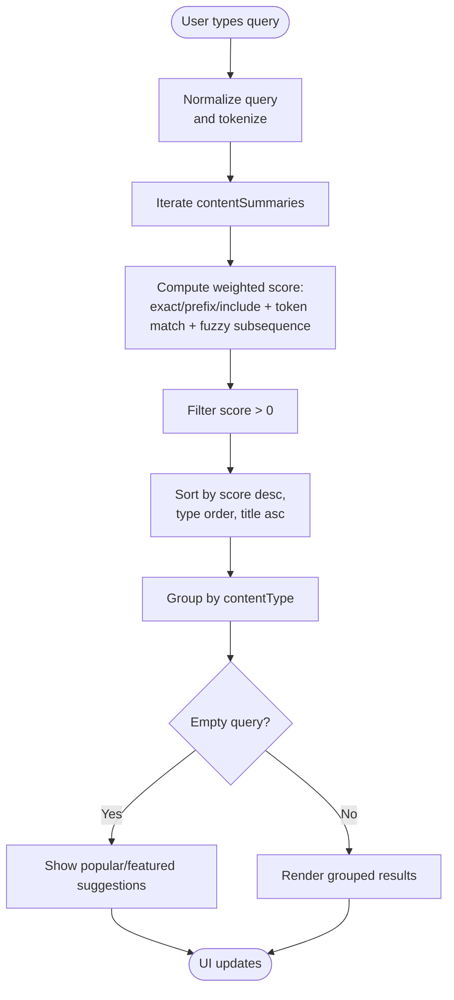
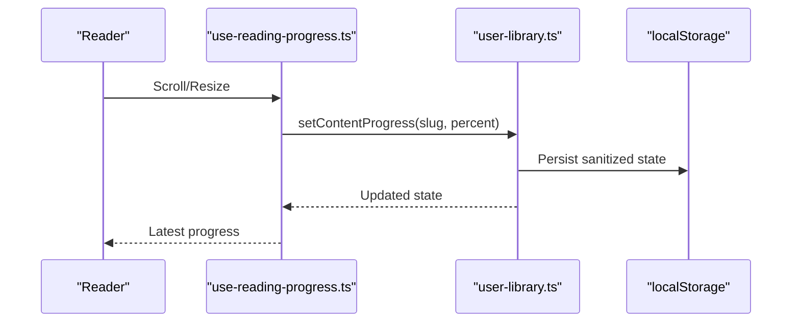
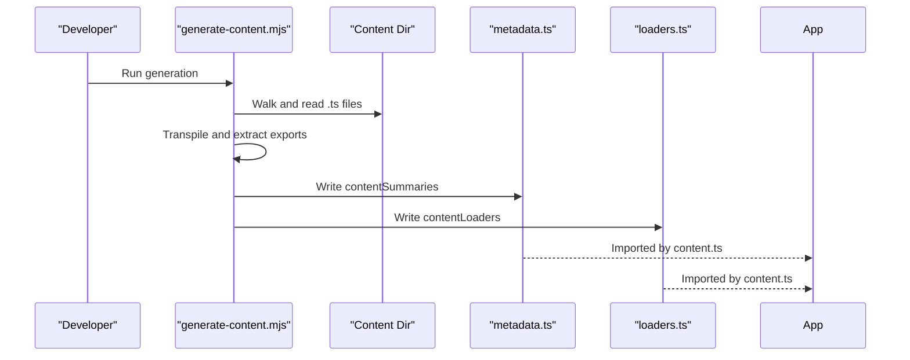
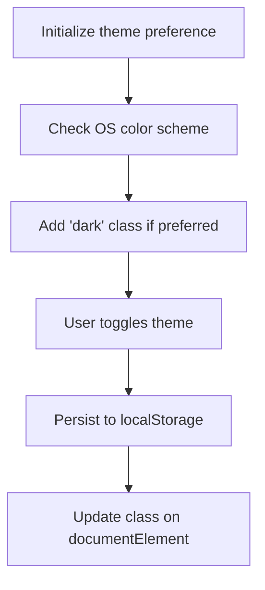
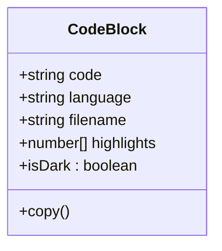
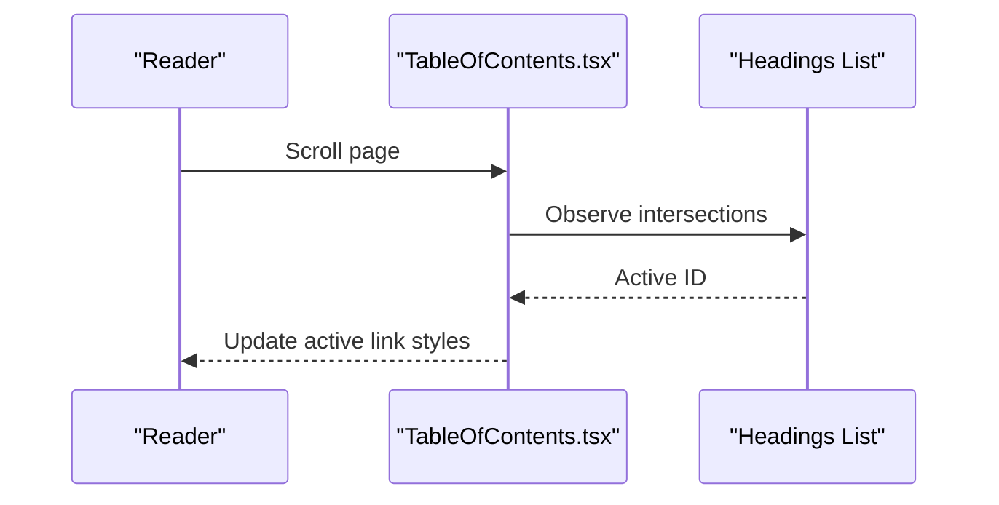
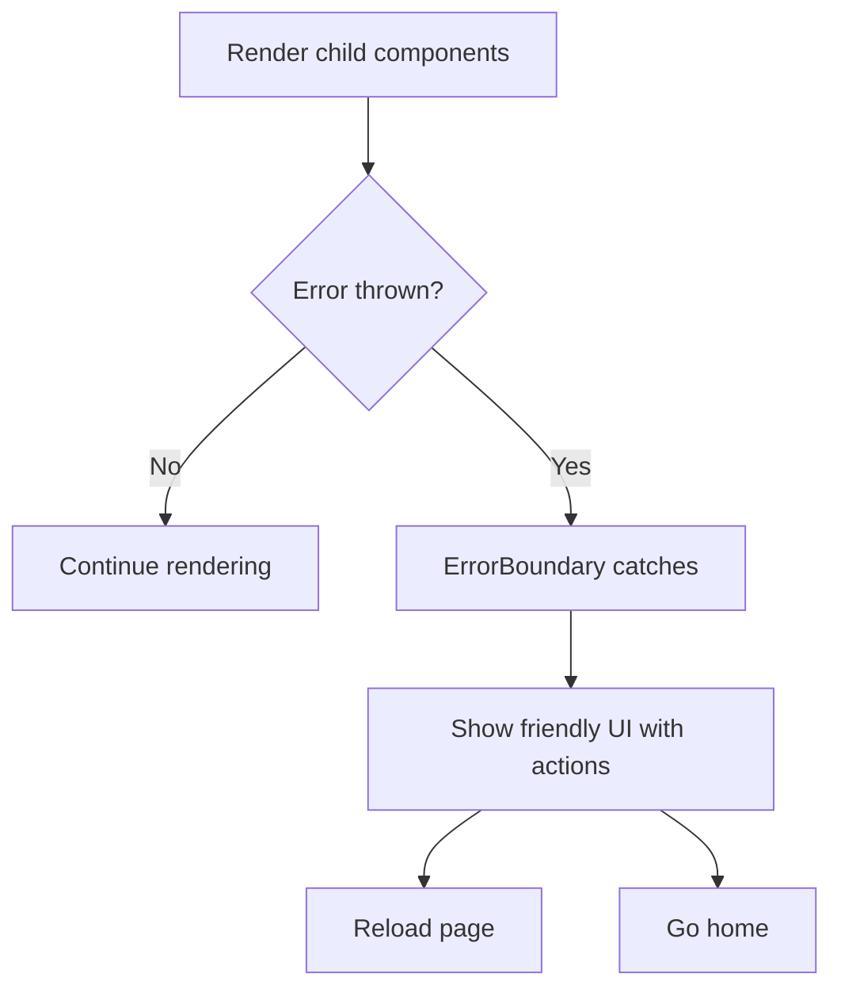
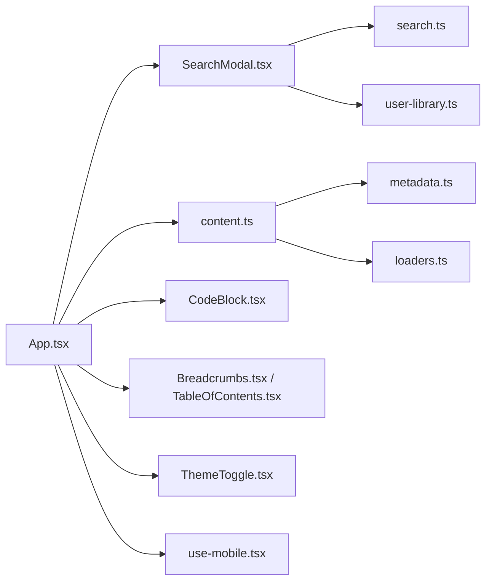

# Key Features

<cite>
**Referenced Files in This Document**
- [App.tsx](file://src/App.tsx)
- [SearchModal.tsx](file://src/components/search/SearchModal.tsx)
- [search.ts](file://src/lib/search.ts)
- [user-library.ts](file://src/lib/user-library.ts)
- [use-user-library.ts](file://src/hooks/use-user-library.ts)
- [use-reading-progress.ts](file://src/hooks/use-reading-progress.ts)
- [content.ts](file://src/lib/content.ts)
- [CodeBlock.tsx](file://src/components/code/CodeBlock.tsx)
- [Breadcrumbs.tsx](file://src/components/navigation/Breadcrumbs.tsx)
- [TableOfContents.tsx](file://src/components/navigation/TableOfContents.tsx)
- [ErrorBoundary.tsx](file://src/components/error-boundary/ErrorBoundary.tsx)
- [ThemeToggle.tsx](file://src/components/shared/ThemeToggle.tsx)
- [use-mobile.tsx](file://src/hooks/use-mobile.tsx)
- [generate-content.mjs](file://scripts/generate-content.mjs)
- [metadata.ts](file://src/content/generated/metadata.ts)
- [loaders.ts](file://src/content/generated/loaders.ts)
</cite>

## Table of Contents
1. [Introduction](#introduction)
2. [Project Structure](#project-structure)
3. [Core Components](#core-components)
4. [Architecture Overview](#architecture-overview)
5. [Detailed Component Analysis](#detailed-component-analysis)
6. [Dependency Analysis](#dependency-analysis)
7. [Performance Considerations](#performance-considerations)
8. [Troubleshooting Guide](#troubleshooting-guide)
9. [Conclusion](#conclusion)

## Introduction
This document details the distinctive capabilities of JSphere that elevate the JavaScript learning experience. It focuses on:
- Intelligent search with fuzzy matching, weighted scoring, and instant suggestions accessible via Cmd/Ctrl + K
- Personalization via user library: bookmarking, progress tracking, and reading history
- Content management with dynamic loading, metadata generation, and automatic content discovery
- Responsive design with adaptive layouts, dark mode, and mobile-first approach
- Code highlighting with syntax highlighting, language detection, and copy-to-clipboard
- Navigation aids: breadcrumbs, table of contents, and contextual links
- Error handling with boundary components and graceful degradation
- Performance optimizations: lazy loading, code splitting, and efficient content delivery

## Project Structure
JSphere organizes features by domain and capability:
- Application shell and routing with lazy loading and error boundaries
- Search modal and search engine with debounced queries and grouped results
- User library persisted in localStorage with reactive subscriptions
- Content metadata and loaders generated at build time
- Navigation components for breadcrumbs and table of contents
- Code block renderer with syntax highlighting and clipboard actions
- Theme toggle and responsive hooks for dark mode and mobile adaptation

**Diagram sources**
- [App.tsx:1-103](file://src/App.tsx#L1-L103)
- [SearchModal.tsx:1-154](file://src/components/search/SearchModal.tsx#L1-L154)
- [search.ts:1-127](file://src/lib/search.ts#L1-L127)
- [use-user-library.ts:1-7](file://src/hooks/use-user-library.ts#L1-L7)
- [user-library.ts:1-213](file://src/lib/user-library.ts#L1-L213)
- [use-reading-progress.ts:1-52](file://src/hooks/use-reading-progress.ts#L1-L52)
- [content.ts:1-126](file://src/lib/content.ts#L1-L126)
- [metadata.ts:1-800](file://src/content/generated/metadata.ts#L1-L800)
- [loaders.ts:1-97](file://src/content/generated/loaders.ts#L1-L97)
- [generate-content.mjs:1-158](file://scripts/generate-content.mjs#L1-L158)
- [CodeBlock.tsx:1-106](file://src/components/code/CodeBlock.tsx#L1-L106)
- [Breadcrumbs.tsx:1-34](file://src/components/navigation/Breadcrumbs.tsx#L1-L34)
- [TableOfContents.tsx:1-68](file://src/components/navigation/TableOfContents.tsx#L1-L68)
- [ThemeToggle.tsx:1-30](file://src/components/shared/ThemeToggle.tsx#L1-L30)
- [use-mobile.tsx:1-20](file://src/hooks/use-mobile.tsx#L1-L20)

**Section sources**
- [App.tsx:1-103](file://src/App.tsx#L1-L103)
- [search.ts:1-127](file://src/lib/search.ts#L1-L127)
- [user-library.ts:1-213](file://src/lib/user-library.ts#L1-L213)
- [content.ts:1-126](file://src/lib/content.ts#L1-L126)
- [generate-content.mjs:1-158](file://scripts/generate-content.mjs#L1-L158)

## Core Components
- Intelligent Search Engine: Implements fuzzy subsequence scoring, token-based matching, and weighted field scoring. Results are grouped by content type and sorted by relevance and content type ordering.
- Search Modal: Debounces queries, groups results, shows popular suggestions, and integrates recent searches. Triggered by Cmd/Ctrl + K globally.
- User Library: Reactive localStorage-backed state for bookmarks, recent views, recent searches, and per-slug progress. Provides hooks to subscribe and update state.
- Content Management: Auto-generated metadata and dynamic loaders enable on-demand content loading and fast navigation.
- Code Highlighting: Prism-based syntax highlighting with theme-awareness and copy-to-clipboard.
- Navigation: Breadcrumbs and table of contents with intersection observer for active state.
- Error Boundary: Graceful degradation with reload and navigation options.
- Responsive Design: Dark mode toggle, mobile breakpoint hook, and adaptive layouts.

**Section sources**
- [search.ts:1-127](file://src/lib/search.ts#L1-L127)
- [SearchModal.tsx:1-154](file://src/components/search/SearchModal.tsx#L1-L154)
- [user-library.ts:1-213](file://src/lib/user-library.ts#L1-L213)
- [use-user-library.ts:1-7](file://src/hooks/use-user-library.ts#L1-L7)
- [use-reading-progress.ts:1-52](file://src/hooks/use-reading-progress.ts#L1-L52)
- [content.ts:1-126](file://src/lib/content.ts#L1-L126)
- [CodeBlock.tsx:1-106](file://src/components/code/CodeBlock.tsx#L1-L106)
- [Breadcrumbs.tsx:1-34](file://src/components/navigation/Breadcrumbs.tsx#L1-L34)
- [TableOfContents.tsx:1-68](file://src/components/navigation/TableOfContents.tsx#L1-L68)
- [ErrorBoundary.tsx:1-65](file://src/components/error-boundary/ErrorBoundary.tsx#L1-L65)
- [ThemeToggle.tsx:1-30](file://src/components/shared/ThemeToggle.tsx#L1-L30)
- [use-mobile.tsx:1-20](file://src/hooks/use-mobile.tsx#L1-L20)

## Architecture Overview
The app leverages React.lazy and Suspense for code-splitting, @tanstack/react-query for caching, and a custom search engine with generated metadata and loaders for content discovery.

**Diagram sources**
- [App.tsx:40-53](file://src/App.tsx#L40-L53)
- [SearchModal.tsx:41-60](file://src/components/search/SearchModal.tsx#L41-L60)
- [search.ts:90-109](file://src/lib/search.ts#L90-L109)
- [metadata.ts:1-800](file://src/content/generated/metadata.ts#L1-L800)

**Section sources**
- [App.tsx:1-103](file://src/App.tsx#L1-L103)
- [SearchModal.tsx:1-154](file://src/components/search/SearchModal.tsx#L1-L154)
- [search.ts:1-127](file://src/lib/search.ts#L1-L127)
- [metadata.ts:1-800](file://src/content/generated/metadata.ts#L1-L800)

## Detailed Component Analysis

### Intelligent Search System
- Fuzzy matching: Uses a subsequence scoring algorithm that rewards consecutive character matches and penalizes length differences.
- Token scoring: Tokenizes query and targets to compute partial-prefix matching scores.
- Weighted scoring: Scores title, aliases, summary, description, keywords, tags, category, and pillar with distinct weights; includes token-based bonuses.
- Sorting and grouping: Sorts by score, then by content type order, then alphabetically; groups results by content type for UI presentation.
- Instant suggestions: Pulls featured content as suggestions when the query is empty.
- Debounced input: Reduces re-computation during typing; integrates recent searches and navigates on selection.

**Diagram sources**
- [search.ts:21-109](file://src/lib/search.ts#L21-L109)
- [SearchModal.tsx:47-52](file://src/components/search/SearchModal.tsx#L47-L52)

Practical example:
- Typing “async await” yields lessons and recipes with high token and fuzzy scores; selecting a result records the recent search and navigates instantly.

**Section sources**
- [search.ts:1-127](file://src/lib/search.ts#L1-L127)
- [SearchModal.tsx:1-154](file://src/components/search/SearchModal.tsx#L1-L154)

### Personalization: User Library
- Bookmarking: Toggle bookmarks per slug; persists in localStorage and emits change events.
- Progress tracking: Computes reading progress using scroll position and stores percentage with completion thresholds.
- Reading history: Records recently viewed slugs with timestamps; deduplicates and enforces size limits.
- Recent searches: Sanitized and capped list of recent queries; supports quick re-selection.
- Reactive state: Hook subscribes to localStorage and custom change events for live updates across components.

**Diagram sources**
- [use-reading-progress.ts:12-51](file://src/hooks/use-reading-progress.ts#L12-L51)
- [user-library.ts:172-204](file://src/lib/user-library.ts#L172-L204)

Practical example:
- After reading a lesson, the system saves progress and completion status; returning later resumes reading near the last position.

**Section sources**
- [user-library.ts:1-213](file://src/lib/user-library.ts#L1-L213)
- [use-user-library.ts:1-7](file://src/hooks/use-user-library.ts#L1-L7)
- [use-reading-progress.ts:1-52](file://src/hooks/use-reading-progress.ts#L1-L52)

### Content Management System
- Dynamic loading: Loaders map slugs to async imports enabling on-demand content chunks.
- Metadata generation: Build script walks content directories, transpiles modules, extracts summaries, and writes metadata and loaders.
- Automatic discovery: Generated metadata powers search, suggestions, and navigation; loaders power route-specific content pages.

**Diagram sources**
- [generate-content.mjs:93-152](file://scripts/generate-content.mjs#L93-L152)
- [metadata.ts:1-800](file://src/content/generated/metadata.ts#L1-L800)
- [loaders.ts:1-97](file://src/content/generated/loaders.ts#L1-L97)

Practical example:
- Adding a new lesson under learn/async triggers regeneration; the new slug appears in search and can be loaded on demand.

**Section sources**
- [generate-content.mjs:1-158](file://scripts/generate-content.mjs#L1-L158)
- [content.ts:1-126](file://src/lib/content.ts#L1-L126)
- [metadata.ts:1-800](file://src/content/generated/metadata.ts#L1-L800)
- [loaders.ts:1-97](file://src/content/generated/loaders.ts#L1-L97)

### Responsive Design System
- Dark mode: ThemeToggle toggles a class on documentElement and persists preference in localStorage; respects OS preference initially.
- Mobile-first: useIsMobile detects viewport width below 768px; enables mobile-specific UI behaviors.
- Adaptive layouts: Components adjust spacing, visibility, and breakpoints for optimal viewing across devices.

**Diagram sources**
- [ThemeToggle.tsx:5-22](file://src/components/shared/ThemeToggle.tsx#L5-L22)
- [use-mobile.tsx:3-18](file://src/hooks/use-mobile.tsx#L3-L18)

Practical example:
- Switching to dark mode applies consistent theming across code blocks, UI components, and navigation.

**Section sources**
- [ThemeToggle.tsx:1-30](file://src/components/shared/ThemeToggle.tsx#L1-L30)
- [use-mobile.tsx:1-20](file://src/hooks/use-mobile.tsx#L1-L20)

### Code Highlighting System
- Syntax highlighting: Uses prism-react-renderer with theme-aware selection and renders line numbers and optional highlight overlays.
- Language detection: Accepts language prop; ensures accurate highlighting for diverse code samples.
- Copy-to-clipboard: One-click copy with visual feedback; handles errors gracefully.

**Diagram sources**
- [CodeBlock.tsx:6-41](file://src/components/code/CodeBlock.tsx#L6-L41)

Practical example:
- Copying a highlighted code snippet to clipboard accelerates hands-on learning and experimentation.

**Section sources**
- [CodeBlock.tsx:1-106](file://src/components/code/CodeBlock.tsx#L1-L106)

### Navigation Features
- Breadcrumbs: Renders hierarchical navigation with home link and trailing active label; supports clickable intermediate steps.
- Table of contents: Observes headings intersection to highlight the active section; supports keyboard activation for smooth scrolling.

**Diagram sources**
- [TableOfContents.tsx:12-30](file://src/components/navigation/TableOfContents.tsx#L12-L30)
- [Breadcrumbs.tsx:13-32](file://src/components/navigation/Breadcrumbs.tsx#L13-L32)

Practical example:
- Jumping to a specific section via TOC or navigating back to parent topics via breadcrumbs streamlines content consumption.

**Section sources**
- [Breadcrumbs.tsx:1-34](file://src/components/navigation/Breadcrumbs.tsx#L1-L34)
- [TableOfContents.tsx:1-68](file://src/components/navigation/TableOfContents.tsx#L1-L68)

### Error Handling System
- Boundary component: Catches rendering errors, logs details, and offers reload or home navigation with clear messaging.

**Diagram sources**
- [ErrorBoundary.tsx:16-62](file://src/components/error-boundary/ErrorBoundary.tsx#L16-L62)

Practical example:
- When a content chunk fails to load, users see actionable controls instead of a blank screen.

**Section sources**
- [ErrorBoundary.tsx:1-65](file://src/components/error-boundary/ErrorBoundary.tsx#L1-L65)

## Dependency Analysis
- App.tsx orchestrates lazy routes, error boundaries, and the global search shortcut.
- SearchModal depends on search.ts and user-library for recent searches; integrates with router for navigation.
- Content APIs depend on generated metadata and loaders; content.ts exposes convenience functions for filtering and loading.
- User library is decoupled via hooks and localStorage, enabling reuse across pages.
- UI components rely on shared primitives (theme, tooltips, toasts) provided by the app shell.

**Diagram sources**
- [App.tsx:1-103](file://src/App.tsx#L1-L103)
- [SearchModal.tsx:1-154](file://src/components/search/SearchModal.tsx#L1-L154)
- [search.ts:1-127](file://src/lib/search.ts#L1-L127)
- [user-library.ts:1-213](file://src/lib/user-library.ts#L1-L213)
- [content.ts:1-126](file://src/lib/content.ts#L1-L126)
- [metadata.ts:1-800](file://src/content/generated/metadata.ts#L1-L800)
- [loaders.ts:1-97](file://src/content/generated/loaders.ts#L1-L97)
- [CodeBlock.tsx:1-106](file://src/components/code/CodeBlock.tsx#L1-L106)
- [Breadcrumbs.tsx:1-34](file://src/components/navigation/Breadcrumbs.tsx#L1-L34)
- [TableOfContents.tsx:1-68](file://src/components/navigation/TableOfContents.tsx#L1-L68)
- [ThemeToggle.tsx:1-30](file://src/components/shared/ThemeToggle.tsx#L1-L30)
- [use-mobile.tsx:1-20](file://src/hooks/use-mobile.tsx#L1-L20)

**Section sources**
- [App.tsx:1-103](file://src/App.tsx#L1-L103)
- [content.ts:1-126](file://src/lib/content.ts#L1-L126)

## Performance Considerations
- Lazy loading and code splitting: Routes and modals are lazy-loaded to minimize initial bundle size.
- Debounced search: Reduces recomputation during rapid typing.
- Intersection Observer for TOC: Efficiently tracks active headings without heavy polling.
- Local storage caching: User library state is cached and emitted via events to avoid redundant writes.
- Efficient content delivery: Generated loaders enable on-demand imports; metadata precomputes searchable indices.

[No sources needed since this section provides general guidance]

## Troubleshooting Guide
- Search not responding:
  - Verify the global shortcut is not intercepted by the browser.
  - Check that content metadata was regenerated after adding new content.
- Results not appearing:
  - Confirm query normalization and tokenization are functioning; ensure contentSummaries includes the target entries.
- Progress not saving:
  - Inspect localStorage availability and sanitization logic for progress updates.
- Code highlighting issues:
  - Ensure language prop is set; confirm theme availability and clipboard permissions.
- TOC not updating:
  - Validate heading IDs and intersection observer thresholds.

**Section sources**
- [App.tsx:40-53](file://src/App.tsx#L40-L53)
- [search.ts:21-109](file://src/lib/search.ts#L21-L109)
- [user-library.ts:172-204](file://src/lib/user-library.ts#L172-L204)
- [CodeBlock.tsx:33-41](file://src/components/code/CodeBlock.tsx#L33-L41)
- [TableOfContents.tsx:12-30](file://src/components/navigation/TableOfContents.tsx#L12-L30)

## Conclusion
JSphere’s key features combine intelligent search, personalized learning, robust content management, and a polished UI/UX to accelerate JavaScript education. The modular architecture, performance-conscious design, and resilient error handling deliver a scalable foundation for continuous growth and iteration.

[No sources needed since this section summarizes without analyzing specific files]