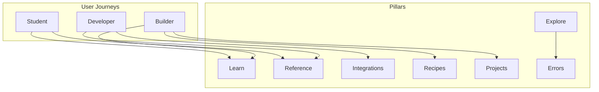
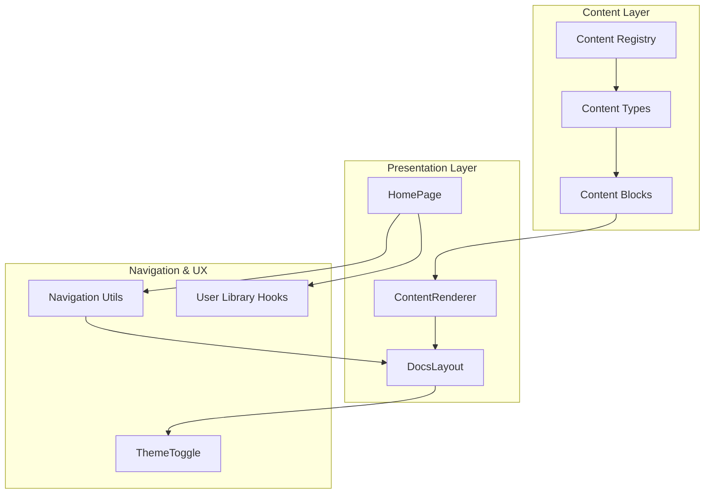
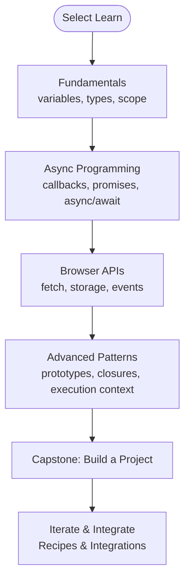
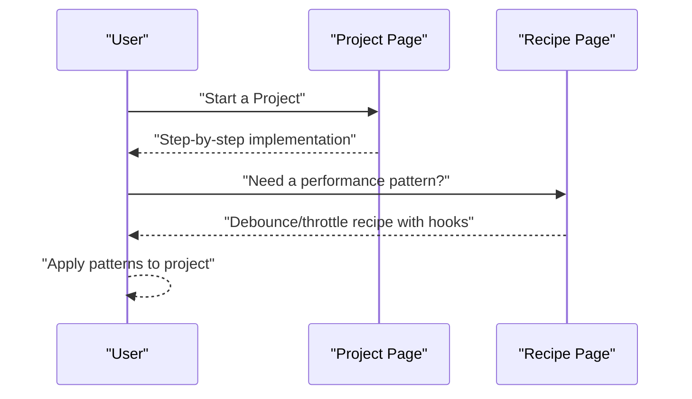
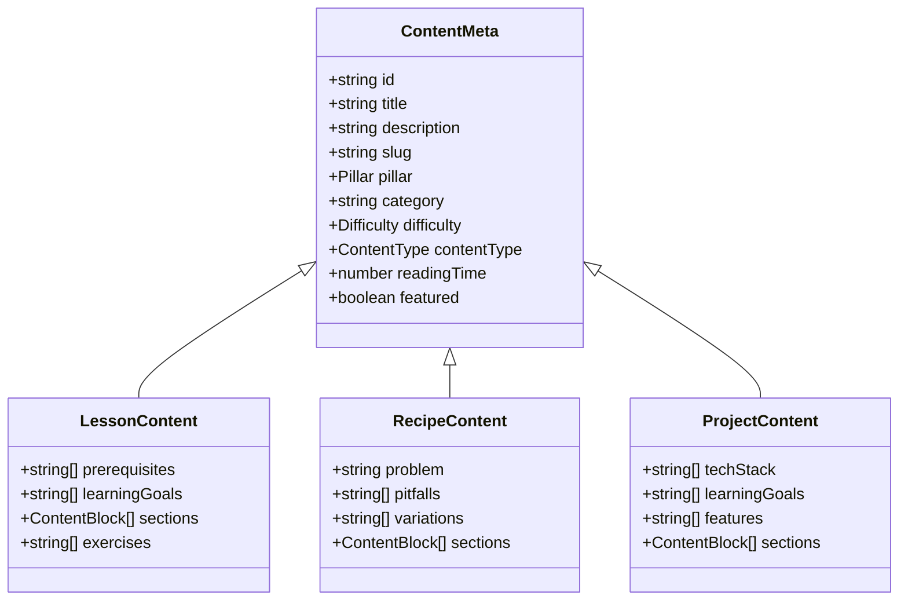
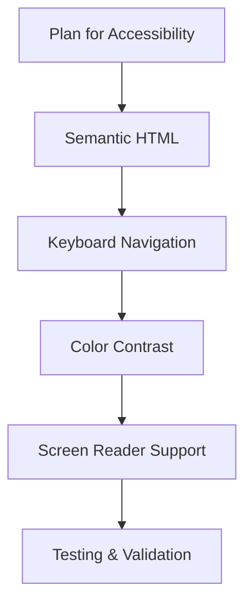
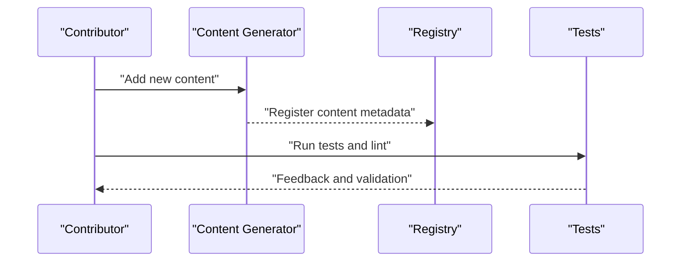
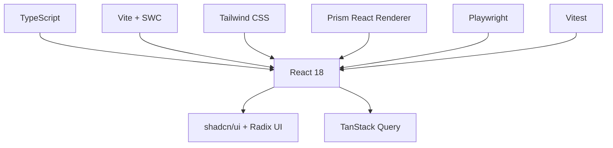
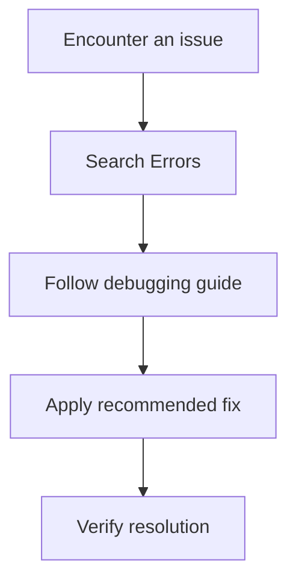

# Platform Philosophy

<cite>
**Referenced Files in This Document**
- [README.md](file://README.md)
- [site.ts](file://src/config/site.ts)
- [categories.ts](file://src/config/categories.ts)
- [navigation.ts](file://src/lib/navigation.ts)
- [registry.ts](file://src/content/registry.ts)
- [variables.ts](file://src/content/learn/fundamentals/variables.ts)
- [async-await.ts](file://src/content/learn/async/async-await.ts)
- [debouncing.ts](file://src/content/recipes/debouncing.ts)
- [crud-app.ts](file://src/content/projects/crud-app.ts)
- [DocsLayout.tsx](file://src/components/layout/DocsLayout.tsx)
- [ThemeToggle.tsx](file://src/components/shared/ThemeToggle.tsx)
- [ContentRenderer.tsx](file://src/components/content/ContentRenderer.tsx)
- [HomePage.tsx](file://src/features/home/HomePage.tsx)
- [content.ts](file://src/types/content.ts)
- [accessibility.ts](file://src/content/explore/accessibility.ts)
</cite>

## Table of Contents
1. [Introduction](#introduction)
2. [Project Structure](#project-structure)
3. [Core Components](#core-components)
4. [Architecture Overview](#architecture-overview)
5. [Detailed Component Analysis](#detailed-component-analysis)
6. [Dependency Analysis](#dependency-analysis)
7. [Performance Considerations](#performance-considerations)
8. [Troubleshooting Guide](#troubleshooting-guide)
9. [Conclusion](#conclusion)
10. [Appendices](#appendices)

## Introduction
JSphere is a JavaScript engineering knowledge platform built for builders and engineered for clarity. Its philosophy centers on:
- Being built for builders: learning by doing, progressing from fundamentals to advanced topics, and building real applications.
- Engineered for clarity: clean, well-structured content that reduces cognitive load and accelerates understanding.
- Progressive learning: a coherent pathway from beginner fundamentals to advanced patterns.
- Real-world relevance: covering technologies and patterns used in production JavaScript development.
- Accessibility: ensuring content is usable by developers with varying skill levels and backgrounds.
- Community-driven curation: continuous improvement through contributor guidelines and content registries.
- Code quality and best practices: emphasizing professional development and maintainable engineering habits.

These principles shape the platform’s content organization, user experience, and technical design.

**Section sources**
- [README.md:24](file://README.md#L24)
- [README.md:47](file://README.md#L47)
- [README.md:63](file://README.md#L63)
- [README.md:79](file://README.md#L79)
- [site.ts:1-15](file://src/config/site.ts#L1-L15)

## Project Structure
JSphere organizes knowledge into seven pillars, each aligned with a specific engineering need:
- Learn: structured lessons from fundamentals to advanced.
- Reference: fast, searchable method-level documentation.
- Recipes: production-ready implementation patterns.
- Integrations: guides for external services and APIs.
- Projects: full app walkthroughs.
- Explore: curated directories and discovery tools.
- Errors: debugging guides and error breakdowns.

This structure reflects the “built for builders” ethos by offering clear entry points for different learning and engineering tasks, and the “engineered for clarity” approach by grouping related knowledge domains.

**Diagram sources**
- [README.md:63](file://README.md#L63)
- [categories.ts:14](file://src/config/categories.ts#L14-L85)

**Section sources**
- [README.md:63](file://README.md#L63-L76)
- [categories.ts:14](file://src/config/categories.ts#L14-L85)

## Core Components
JSphere’s philosophy is reflected in its core components:

- Content Registry and Type System
  - The content registry centralizes all entries across pillars, enabling consistent metadata, navigation, and discovery.
  - The type system enforces structure across content types (lessons, references, recipes, projects, integrations, errors, explore), supporting clarity and reliability.

- Navigation and Organization
  - Navigation utilities resolve availability, suggest content by pillar, and compute prev/next steps, reinforcing progressive learning and easy orientation.

- Layout and Rendering
  - The DocsLayout provides a clean, distraction-free reading experience with sidebar navigation and a table of contents.
  - The ContentRenderer transforms structured content blocks into a readable, accessible page with semantic headings, code highlighting, and callouts.

- Personalization and Accessibility
  - The ThemeToggle supports light/dark modes with system preference detection.
  - Explore content on accessibility demonstrates inclusive design practices, aligning with the platform’s commitment to accessibility.

- Homepage Experience
  - The homepage presents clear pathways (“Start Learning,” “Find a Method,” “Solve a Pattern”) and personalized sections (Continue Reading, Recently Viewed, Bookmarks), reflecting the builder-first mindset.

**Section sources**
- [registry.ts:161](file://src/content/registry.ts#L161-L305)
- [content.ts:30](file://src/types/content.ts#L30-L169)
- [navigation.ts:28](file://src/lib/navigation.ts#L28-L74)
- [DocsLayout.tsx:12](file://src/components/layout/DocsLayout.tsx#L12-L25)
- [ContentRenderer.tsx:29](file://src/components/content/ContentRenderer.tsx#L29-L157)
- [ThemeToggle.tsx:5](file://src/components/shared/ThemeToggle.tsx#L5-L29)
- [HomePage.tsx:146](file://src/features/home/HomePage.tsx#L146-L455)

## Architecture Overview
JSphere’s architecture embodies its philosophy:
- Content-first design: content metadata and blocks define the UI and navigation.
- Pillar-centric organization: each pillar encapsulates a domain of knowledge with consistent structure.
- Progressive navigation: prev/next and suggested content help learners move systematically.
- Personalization: user library integrates bookmarks, reading history, and progress to tailor the experience.

**Diagram sources**
- [registry.ts:161](file://src/content/registry.ts#L161-L305)
- [content.ts:30](file://src/types/content.ts#L30-L169)
- [ContentRenderer.tsx:29](file://src/components/content/ContentRenderer.tsx#L29-L157)
- [DocsLayout.tsx:12](file://src/components/layout/DocsLayout.tsx#L12-L25)
- [HomePage.tsx:146](file://src/features/home/HomePage.tsx#L146-L455)
- [navigation.ts:28](file://src/lib/navigation.ts#L28-L74)
- [ThemeToggle.tsx:5](file://src/components/shared/ThemeToggle.tsx#L5-L29)

## Detailed Component Analysis

### Progressive Learning Pathway
JSphere’s Learn pillar is organized progressively, starting with fundamentals and advancing to advanced topics. This mirrors the “built for builders” principle by scaffolding knowledge and encouraging hands-on practice.

**Diagram sources**
- [variables.ts:3](file://src/content/learn/fundamentals/variables.ts#L3-L633)
- [async-await.ts:3](file://src/content/learn/async/async-await.ts#L3-L507)
- [categories.ts:14](file://src/config/categories.ts#L14-L85)

**Section sources**
- [variables.ts:21](file://src/content/learn/fundamentals/variables.ts#L21-L36)
- [async-await.ts:21](file://src/content/learn/async/async-await.ts#L21-L34)
- [README.md:69](file://README.md#L69)

### Practical Applications and Real-World Relevance
Projects and Recipes emphasize real-world relevance:
- Projects demonstrate end-to-end application development with CRUD operations, state management, and API integration.
- Recipes provide production-ready patterns for performance, UX, and maintainability.

**Diagram sources**
- [crud-app.ts:3](file://src/content/projects/crud-app.ts#L3-L330)
- [debouncing.ts:3](file://src/content/recipes/debouncing.ts#L3-L60)

**Section sources**
- [crud-app.ts:21](file://src/content/projects/crud-app.ts#L21-L22)
- [debouncing.ts:20](file://src/content/recipes/debouncing.ts#L20-L27)

### Engineered for Clarity in Content Structure
JSphere’s content types and rendering pipeline enforce clarity:
- Structured content blocks (headings, paragraphs, code, lists, callouts, tables) improve readability.
- Consistent metadata (difficulty, reading time, tags) helps users quickly assess content fit.
- The renderer groups content into concept sections and applies semantic markup for accessibility.

**Diagram sources**
- [content.ts:30](file://src/types/content.ts#L30-L169)

**Section sources**
- [ContentRenderer.tsx:29](file://src/components/content/ContentRenderer.tsx#L29-L157)
- [content.ts:74](file://src/types/content.ts#L74-L121)

### Accessibility and Inclusive Design
JSphere embraces accessibility through:
- Semantic HTML and ARIA patterns in content and UI.
- Theming with system preference detection.
- Guidance on color contrast, keyboard navigation, and screen reader support.

**Diagram sources**
- [accessibility.ts:3](file://src/content/explore/accessibility.ts#L3-L601)
- [ThemeToggle.tsx:5](file://src/components/shared/ThemeToggle.tsx#L5-L29)

**Section sources**
- [accessibility.ts:48](file://src/content/explore/accessibility.ts#L48-L601)
- [ThemeToggle.tsx:8](file://src/components/shared/ThemeToggle.tsx#L8-L14)

### Community-Driven Curation and Continuous Improvement
JSphere encourages contributions and maintains quality through:
- A centralized content registry for discoverability and consistency.
- Contributor guidelines enforcing code style, content registration, and testing.
- Automated content generation and metadata management.

**Diagram sources**
- [registry.ts:161](file://src/content/registry.ts#L161-L305)
- [README.md:290](file://README.md#L290-L318)

**Section sources**
- [registry.ts:161](file://src/content/registry.ts#L161-L305)
- [README.md:290](file://README.md#L290-L318)

## Dependency Analysis
JSphere’s dependencies reflect its philosophy of clarity, performance, and maintainability:
- React 18 and TypeScript for type safety and component composition.
- Vite + SWC for fast builds and HMR.
- Tailwind CSS for utility-first styling with a custom design system.
- shadcn/ui and Radix UI for accessible, composable primitives.
- TanStack Query for async state management.
- Prism React Renderer for syntax highlighting.
- Playwright and Vitest for robust testing.

**Diagram sources**
- [README.md:124](file://README.md#L124-L144)

**Section sources**
- [README.md:124](file://README.md#L124-L144)

## Performance Considerations
JSphere prioritizes performance to support the “built for builders” ethos:
- Vite + SWC for sub-second builds and instant HMR.
- Route-based code splitting and lazy loading.
- Skeleton loading states for perceived performance.
- Metadata-driven content with auto-generated loaders.

These choices ensure learners can iterate quickly and focus on building rather than waiting for builds.

**Section sources**
- [README.md:111](file://README.md#L111-L116)

## Troubleshooting Guide
JSphere’s approach to clarity extends to error handling and debugging:
- Errors pillar provides structured debugging guides for common issues.
- ContentRenderer includes callouts for tips, warnings, and best practices.
- Personalization tracks reading progress and bookmarks to reduce friction.

**Diagram sources**
- [README.md:75](file://README.md#L75)
- [ContentRenderer.tsx:106](file://src/components/content/ContentRenderer.tsx#L106-L108)

**Section sources**
- [README.md:75](file://README.md#L75)

## Conclusion
JSphere’s platform philosophy—“built for builders” and “engineered for clarity”—is embedded in its content organization, user experience, and technical design. By structuring knowledge into clear pillars, emphasizing progressive learning, focusing on real-world relevance, and maintaining accessibility and performance, JSphere enables JavaScript engineers to learn effectively, build confidently, and grow professionally.

[No sources needed since this section summarizes without analyzing specific files]

## Appendices
- Example of how philosophy translates into features:
  - Learn → structured lessons with learning goals and exercises.
  - Recipes → production-ready patterns with pitfalls and variations.
  - Projects → end-to-end applications with best practices.
  - Explore → curated directories and accessibility guidance.
  - Errors → actionable debugging playbooks.
  - Navigation and layout → breadcrumbs, prev/next, and table of contents.
  - Personalization → bookmarks, recently viewed, continue reading, and reading progress.

[No sources needed since this section provides general guidance]