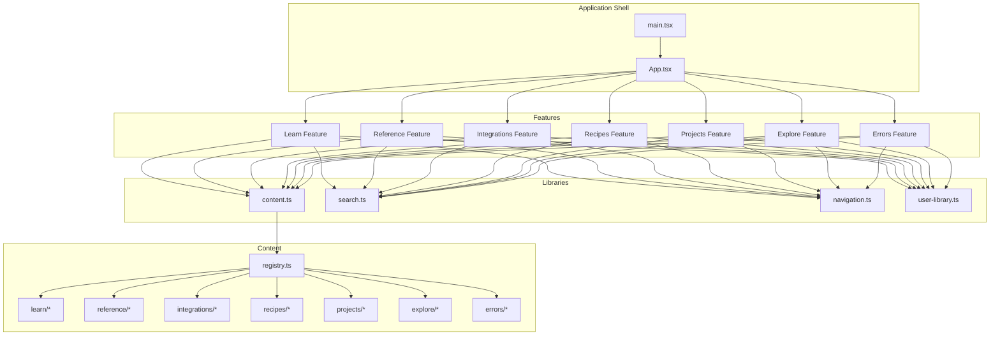
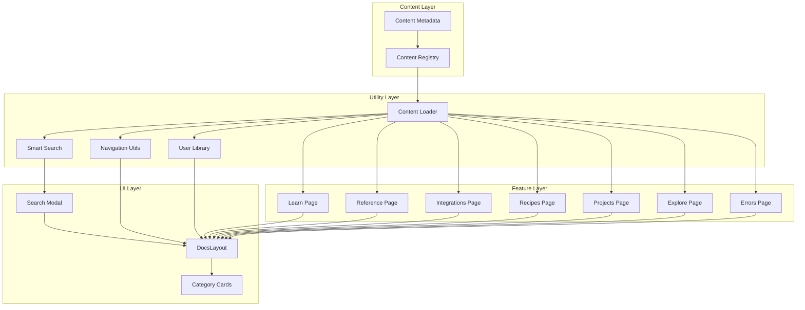
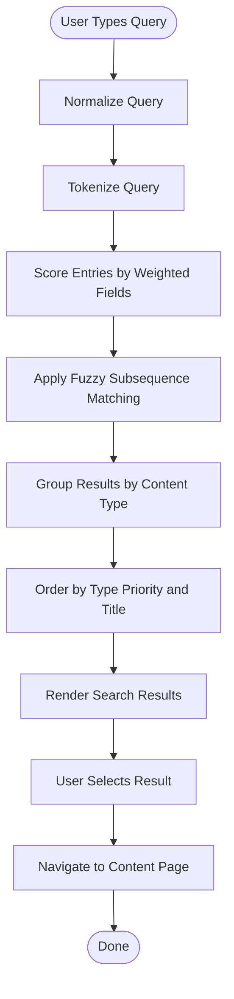
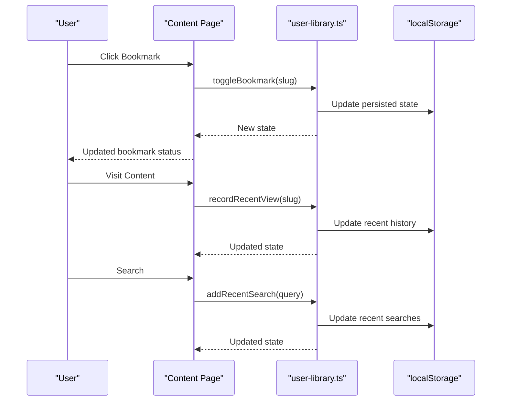
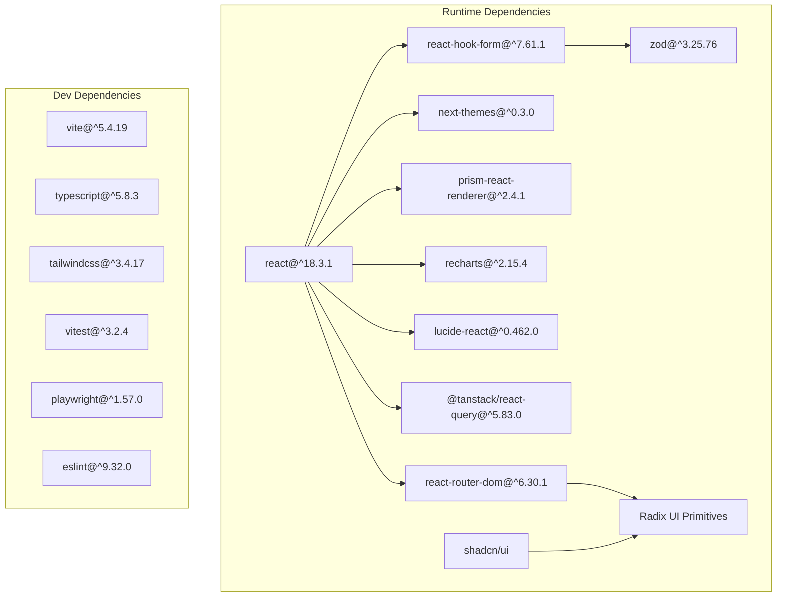

# Project Overview

<cite>
**Referenced Files in This Document**
- [README.md](file://README.md)
- [site.ts](file://src/config/site.ts)
- [categories.ts](file://src/config/categories.ts)
- [content.ts](file://src/lib/content.ts)
- [navigation.ts](file://src/lib/navigation.ts)
- [search.ts](file://src/lib/search.ts)
- [user-library.ts](file://src/lib/user-library.ts)
- [content.ts](file://src/types/content.ts)
- [registry.ts](file://src/content/registry.ts)
- [closures.ts](file://src/content/learn/closures.ts)
- [oauth.ts](file://src/content/integrations/oauth.ts)
- [debouncing.ts](file://src/content/recipes/debouncing.ts)
- [common.ts](file://src/content/errors/common.ts)
- [PillarLandingPage.tsx](file://src/features/pillar/PillarLandingPage.tsx)
- [SearchModal.tsx](file://src/components/search/SearchModal.tsx)
- [package.json](file://package.json)
</cite>

## Table of Contents
1. [Introduction](#introduction)
2. [Project Structure](#project-structure)
3. [Core Components](#core-components)
4. [Architecture Overview](#architecture-overview)
5. [Detailed Component Analysis](#detailed-component-analysis)
6. [Dependency Analysis](#dependency-analysis)
7. [Performance Considerations](#performance-considerations)
8. [Troubleshooting Guide](#troubleshooting-guide)
9. [Conclusion](#conclusion)

## Introduction
JSphere is a premium, structured knowledge platform built for real-world JavaScript engineers. Its purpose is to unify learning, reference, practical recipes, integrations, projects, exploration, and debugging into a single, fast, and accessible system. The platform is built for builders and engineered for clarity, delivering a curated experience that scales from beginners learning closures to senior engineers wiring up OAuth flows.

At its core, JSphere organizes knowledge into seven content pillars, each aligned with a distinct engineering need. The platform emphasizes practical outcomes: learners gain structured lessons, practitioners find production-ready recipes, and professionals integrate services seamlessly. Smart search, personalization via a user library, and a responsive UI reinforce usability across skill levels.

**Section sources**
- [README.md:45-60](file://README.md#L45-L60)
- [site.ts:1-15](file://src/config/site.ts#L1-L15)

## Project Structure
JSphere follows a feature- and pillar-based organization. The repository is structured around:
- src/components: reusable UI primitives and page shells
- src/lib: core utilities for content, navigation, search, and user library
- src/content: authored content organized by pillar and category
- src/features: page-level components per pillar
- src/pages: route-level entry points
- src/tests: unit and integration tests
- scripts: automated content metadata generation

**Diagram sources**
- [PillarLandingPage.tsx:15-89](file://src/features/pillar/PillarLandingPage.tsx#L15-L89)
- [content.ts](file://src/lib/content.ts)
- [search.ts:1-127](file://src/lib/search.ts#L1-L127)
- [navigation.ts](file://src/lib/navigation.ts)
- [user-library.ts:1-213](file://src/lib/user-library.ts#L1-L213)
- [registry.ts:161-305](file://src/content/registry.ts#L161-L305)

**Section sources**
- [README.md:147-191](file://README.md#L147-L191)
- [package.json:1-99](file://package.json#L1-L99)

## Core Components
JSphere’s core components enable a seamless, personalized, and efficient learning and engineering experience:

- Content pillars: Learn, Reference, Recipes, Integrations, Projects, Explore, Errors
- Smart search: Fuzzy matching, weighted scoring, grouped results, and keyboard shortcuts
- User library: Bookmarks, recently viewed, continue reading, and search history
- Rich content renderer: Block-based content, syntax-highlighted code, and structured metadata
- Personalized navigation: Breadcrumbs, previous/next, and auto-generated table of contents
- Performance-first stack: Vite + SWC, route-based code splitting, and skeleton loading

These components collectively support the platform’s philosophy of being “built for builders” and “engineered for clarity.”

**Section sources**
- [README.md:63-121](file://README.md#L63-L121)
- [categories.ts:14-85](file://src/config/categories.ts#L14-L85)
- [search.ts:90-127](file://src/lib/search.ts#L90-L127)
- [user-library.ts:103-213](file://src/lib/user-library.ts#L103-L213)

## Architecture Overview
JSphere’s architecture centers on a metadata-driven content model and a modular UI layer. Content is authored as structured entries and registered centrally. Utilities provide search, navigation, and user state persistence. The UI composes feature-level pages per pillar, leveraging shared components and a consistent design system.

**Diagram sources**
- [registry.ts:161-305](file://src/content/registry.ts#L161-L305)
- [content.ts](file://src/lib/content.ts)
- [search.ts:1-127](file://src/lib/search.ts#L1-L127)
- [navigation.ts](file://src/lib/navigation.ts)
- [user-library.ts:1-213](file://src/lib/user-library.ts#L1-L213)
- [PillarLandingPage.tsx:15-89](file://src/features/pillar/PillarLandingPage.tsx#L15-L89)
- [SearchModal.tsx:41-153](file://src/components/search/SearchModal.tsx#L41-L153)

## Detailed Component Analysis

### Content Pillars
JSphere organizes knowledge into seven pillars, each with a distinct educational value proposition:

- Learn: Structured lessons from fundamentals to advanced patterns, with prerequisites, learning goals, and exercises.
- Reference: Fast, searchable method-level documentation with signatures, parameters, and return types.
- Recipes: Production-ready implementation patterns for common real-world problems.
- Integrations: Practical guides for connecting JavaScript with external services and APIs.
- Projects: Full app walkthroughs from idea to code, showcasing technology stacks and features.
- Explore: Curated directories, glossaries, and comparisons to help discover new tools and concepts.
- Errors: Debugging guides and error breakdowns with diagnostic strategies and prevention tips.

Each pillar is mapped to a dedicated feature page and configured with a unique accent color and icon for visual distinction.

**Section sources**
- [README.md:63-76](file://README.md#L63-L76)
- [categories.ts:14-85](file://src/config/categories.ts#L14-L85)

### Smart Search
JSphere’s search utility implements a robust, weighted scoring system across titles, aliases, keywords, tags, summaries, descriptions, and categories. It normalizes and tokenizes queries, applies fuzzy subsequence matching, and groups results by content type for intuitive browsing. The search modal integrates suggestions, recent searches, and keyboard shortcuts for quick access.

**Diagram sources**
- [search.ts:21-109](file://src/lib/search.ts#L21-L109)
- [SearchModal.tsx:47-105](file://src/components/search/SearchModal.tsx#L47-L105)

**Section sources**
- [search.ts:90-127](file://src/lib/search.ts#L90-L127)
- [SearchModal.tsx:12-34](file://src/components/search/SearchModal.tsx#L12-L34)

### User Library
The user library persists bookmarks, recently viewed items, recent searches, and reading progress in local storage. It sanitizes inputs, enforces limits, and emits change events to keep UIs synchronized. Hooks and utilities provide convenient APIs for toggling bookmarks, recording views, adding recent searches, and tracking progress.

**Diagram sources**
- [user-library.ts:138-213](file://src/lib/user-library.ts#L138-L213)
- [SearchModal.tsx:55-60](file://src/components/search/SearchModal.tsx#L55-L60)

**Section sources**
- [user-library.ts:103-213](file://src/lib/user-library.ts#L103-L213)

### Rich Content Renderer
JSphere renders structured content blocks including paragraphs, headings, code, lists, callouts, and tables. It supports syntax-highlighted code blocks, function signature tables, and metadata such as difficulty and reading time. This enables clear, scannable documentation across all pillars.

**Section sources**
- [README.md:87-92](file://README.md#L87-L92)
- [content.ts:20-26](file://src/types/content.ts#L20-L26)

### Personalization and Navigation
Personalization features include bookmarks, recently viewed, continue reading, and search history. Navigation includes breadcrumbs, previous/next controls, and an auto-generated table of contents. These features help users maintain context and resume learning efficiently.

**Section sources**
- [README.md:99-104](file://README.md#L99-L104)
- [README.md:93-98](file://README.md#L93-L98)

### Example Use Cases
- Beginner learning closures: A structured lesson with exercises and real-world examples demonstrates closure mechanics, pitfalls, and best practices.
- Senior engineer integrating OAuth: A practical integration guide covers PKCE flow, token management, security best practices, and provider-specific setup.
- Developer optimizing UI performance: A recipe for debouncing/throttling shows patterns for search, resize, and autosave scenarios with cancellation and cleanup.
- Debugging common errors: A guide to understanding and resolving frequent JavaScript errors with prevention strategies and debugging approaches.

**Section sources**
- [closures.ts:3-30](file://src/content/learn/closures.ts#L3-L30)
- [oauth.ts:3-22](file://src/content/integrations/oauth.ts#L3-L22)
- [debouncing.ts:3-27](file://src/content/recipes/debouncing.ts#L3-L27)
- [common.ts:3-27](file://src/content/errors/common.ts#L3-L27)

## Dependency Analysis
JSphere’s dependencies reflect a modern, production-grade stack emphasizing speed, scalability, and developer experience. The platform leverages React 18, TypeScript, Vite, Tailwind CSS, and a curated set of UI primitives and utilities.

**Diagram sources**
- [package.json:22-74](file://package.json#L22-L74)
- [package.json:75-97](file://package.json#L75-L97)

**Section sources**
- [package.json:22-97](file://package.json#L22-L97)

## Performance Considerations
JSphere prioritizes performance with:
- Vite + SWC for sub-second builds and instant hot module replacement
- Route-based code splitting via React Router lazy loading
- Metadata-driven content with auto-generated loaders for lean bundles
- Skeleton loading states for smooth perceived performance
- Debounced search to minimize recomputation during typing

These choices ensure fast iteration in development and a responsive experience in production.

**Section sources**
- [README.md:111-116](file://README.md#L111-L116)

## Troubleshooting Guide
Common areas to verify when encountering issues:
- Content integrity: Ensure content entries are well-formed and registered in the content registry
- Search logic: Confirm fuzzy matching, ranking, and filtering behave as expected
- SEO: Verify meta tags render correctly per page
- User library: Check bookmarks, history, and reading state management persist and update correctly

Automated tests cover these areas to maintain reliability.

**Section sources**
- [README.md:252-287](file://README.md#L252-L287)

## Conclusion
JSphere delivers a premium, structured knowledge platform tailored for real-world JavaScript engineers. Its seven content pillars, smart search, user library, and performance-first architecture embody the philosophy of being “built for builders” and “engineered for clarity.” Whether you are a beginner mastering closures or a senior engineer implementing OAuth, JSphere provides the right content, tools, and clarity to accelerate your learning and development.