# Technology Stack

<cite>
**Referenced Files in This Document**
- [package.json](file://package.json)
- [vite.config.ts](file://vite.config.ts)
- [tailwind.config.ts](file://tailwind.config.ts)
- [eslint.config.js](file://eslint.config.js)
- [tsconfig.json](file://tsconfig.json)
- [tsconfig.app.json](file://tsconfig.app.json)
- [src/main.tsx](file://src/main.tsx)
- [src/App.tsx](file://src/App.tsx)
- [src/components/ui/form.tsx](file://src/components/ui/form.tsx)
- [src/hooks/use-toast.ts](file://src/hooks/use-toast.ts)
- [src/types/content.ts](file://src/types/content.ts)
- [src/features/learn/LessonPage.tsx](file://src/features/learn/LessonPage.tsx)
- [vitest.config.ts](file://vitest.config.ts)
- [playwright.config.ts](file://playwright.config.ts)
- [components.json](file://components.json)
</cite>

## Table of Contents
1. [Introduction](#introduction)
2. [Project Structure](#project-structure)
3. [Core Components](#core-components)
4. [Architecture Overview](#architecture-overview)
5. [Detailed Component Analysis](#detailed-component-analysis)
6. [Dependency Analysis](#dependency-analysis)
7. [Performance Considerations](#performance-considerations)
8. [Troubleshooting Guide](#troubleshooting-guide)
9. [Conclusion](#conclusion)
10. [Appendices](#appendices)

## Introduction
This document presents the modern frontend technology stack powering JSphere, focusing on React 18.3.1, TypeScript 5.8.3, Vite 5.4.19, Tailwind CSS 3.4.1, Radix UI primitives, @tanstack/react-query, and comprehensive testing with Vitest and Playwright. It explains how these technologies are configured and integrated to deliver a fast, accessible, and maintainable educational platform.

## Project Structure
JSphere follows a feature-driven, component-centric structure with a strong emphasis on type safety and modular tooling:
- Application bootstrap initializes React 18 and renders the root component.
- Routing is handled via React Router DOM 6.x with lazy-loaded routes and suspense boundaries.
- UI primitives are built on Radix UI for accessibility and composability.
- Data fetching is centralized with @tanstack/react-query.
- Styling leverages Tailwind CSS with custom animations and a cohesive design system.
- Forms use React Hook Form with Zod resolvers for robust validation.
- Testing spans unit tests (Vitest) and E2E tests (Playwright).

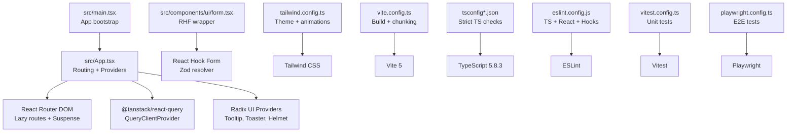

**Diagram sources**
- [src/main.tsx:1-6](file://src/main.tsx#L1-L6)
- [src/App.tsx:1-103](file://src/App.tsx#L1-L103)
- [src/components/ui/form.tsx:1-130](file://src/components/ui/form.tsx#L1-L130)
- [tailwind.config.ts:1-104](file://tailwind.config.ts#L1-L104)
- [vite.config.ts:1-35](file://vite.config.ts#L1-L35)
- [tsconfig.json:1-24](file://tsconfig.json#L1-L24)
- [tsconfig.app.json:1-36](file://tsconfig.app.json#L1-L36)
- [eslint.config.js:1-27](file://eslint.config.js#L1-L27)
- [vitest.config.ts:1-18](file://vitest.config.ts#L1-L18)
- [playwright.config.ts:1-25](file://playwright.config.ts#L1-L25)

**Section sources**
- [src/main.tsx:1-6](file://src/main.tsx#L1-L6)
- [src/App.tsx:1-103](file://src/App.tsx#L1-L103)
- [vite.config.ts:1-35](file://vite.config.ts#L1-L35)
- [tailwind.config.ts:1-104](file://tailwind.config.ts#L1-L104)
- [eslint.config.js:1-27](file://eslint.config.js#L1-L27)
- [tsconfig.json:1-24](file://tsconfig.json#L1-L24)
- [tsconfig.app.json:1-36](file://tsconfig.app.json#L1-L36)
- [vitest.config.ts:1-18](file://vitest.config.ts#L1-L18)
- [playwright.config.ts:1-25](file://playwright.config.ts#L1-L25)

## Core Components
- React 18.3.1: Concurrent features, automatic batching, and improved hydration support.
- React Router DOM 6.30.1: Declarative routing with nested routes, lazy loading, and Suspense integration.
- React Hook Form 7.x: Performant form state management with Zod resolver for schema-driven validation.
- TypeScript 5.8.3: Strict type checking across app, node, and test configs.
- Vite 5.4.19: Lightning-fast dev server and optimized production builds with SWC-based React plugin.
- Tailwind CSS 3.4.1: Utility-first styling with custom animations, typography, and a cohesive color system.
- Radix UI: Accessible, unstyled primitives for dialogs, tooltips, menus, and more.
- @tanstack/react-query: Efficient caching, background updates, and optimistic UI patterns.
- Testing: Vitest for unit tests with jsdom; Playwright for E2E scenarios.

**Section sources**
- [package.json:22-74](file://package.json#L22-L74)
- [src/App.tsx:1-103](file://src/App.tsx#L1-L103)
- [src/components/ui/form.tsx:1-130](file://src/components/ui/form.tsx#L1-L130)
- [tsconfig.json:1-24](file://tsconfig.json#L1-L24)
- [tsconfig.app.json:1-36](file://tsconfig.app.json#L1-L36)
- [vite.config.ts:1-35](file://vite.config.ts#L1-L35)
- [tailwind.config.ts:1-104](file://tailwind.config.ts#L1-L104)
- [eslint.config.js:1-27](file://eslint.config.js#L1-L27)
- [vitest.config.ts:1-18](file://vitest.config.ts#L1-L18)
- [playwright.config.ts:1-25](file://playwright.config.ts#L1-L25)

## Architecture Overview
The runtime architecture centers on a single SPA bootstrapped by React 18, with routing, data fetching, and UI rendering orchestrated through providers and lazy-loaded routes.

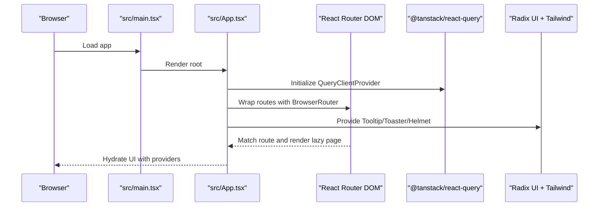

**Diagram sources**
- [src/main.tsx:1-6](file://src/main.tsx#L1-L6)
- [src/App.tsx:1-103](file://src/App.tsx#L1-L103)

**Section sources**
- [src/main.tsx:1-6](file://src/main.tsx#L1-L6)
- [src/App.tsx:1-103](file://src/App.tsx#L1-L103)

## Detailed Component Analysis

### React 18.3.1 and Routing with React Router DOM 6.30.1
- Lazy loading and Suspense boundaries ensure fast initial loads and smooth navigation.
- Nested routes organize content by pillars (learn, reference, recipes, etc.) with dynamic segments.
- Error boundaries wrap route rendering to prevent app crashes and improve UX.

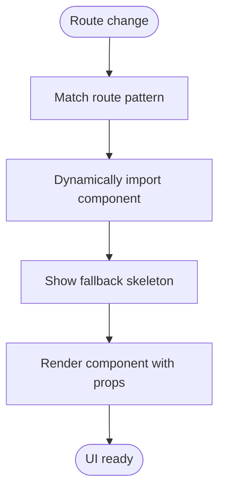

**Diagram sources**
- [src/App.tsx:70-91](file://src/App.tsx#L70-L91)
- [src/features/learn/LessonPage.tsx:1-123](file://src/features/learn/LessonPage.tsx#L1-L123)

**Section sources**
- [src/App.tsx:1-103](file://src/App.tsx#L1-L103)
- [src/features/learn/LessonPage.tsx:1-123](file://src/features/learn/LessonPage.tsx#L1-L123)

### React Hook Form with Zod Resolvers for Type-Safe Forms
- Centralized form provider and field context enable consistent validation and accessibility attributes.
- Schema-driven validation improves reliability and reduces boilerplate.
- Integration with Radix UI primitives ensures proper labeling and ARIA attributes.

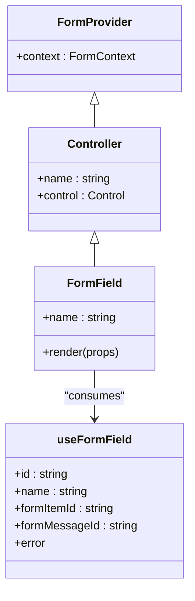

**Diagram sources**
- [src/components/ui/form.tsx:1-130](file://src/components/ui/form.tsx#L1-L130)

**Section sources**
- [src/components/ui/form.tsx:1-130](file://src/components/ui/form.tsx#L1-L130)
- [package.json:23-24](file://package.json#L23-L24)

### TypeScript 5.8.3 Across the Codebase
- Strict compiler options enforce correctness and catch potential issues early.
- Path aliases simplify imports and improve readability.
- Test environment includes Vitest globals for accurate typing during unit tests.

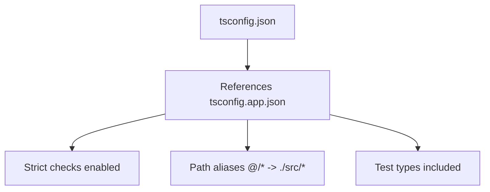

**Diagram sources**
- [tsconfig.json:1-24](file://tsconfig.json#L1-L24)
- [tsconfig.app.json:1-36](file://tsconfig.app.json#L1-L36)

**Section sources**
- [tsconfig.json:1-24](file://tsconfig.json#L1-L24)
- [tsconfig.app.json:1-36](file://tsconfig.app.json#L1-L36)

### Vite 5.4.19 Build System and Performance Optimizations
- SWC-based React plugin accelerates dev builds and HMR.
- Chunk splitting groups vendor libraries, UI primitives, and data-fetching logic for optimal caching.
- Aliasing and deduplication reduce bundle duplication and improve load times.

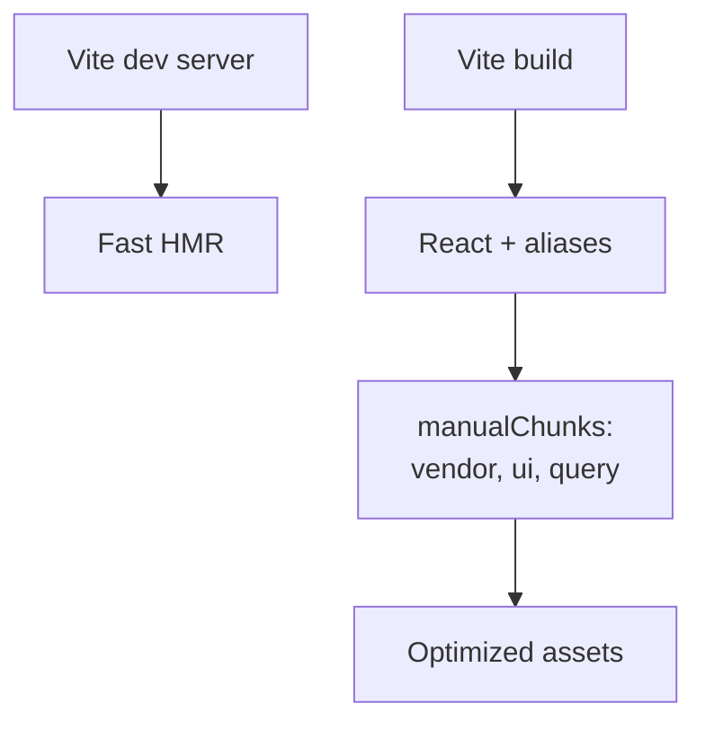

**Diagram sources**
- [vite.config.ts:1-35](file://vite.config.ts#L1-L35)

**Section sources**
- [vite.config.ts:1-35](file://vite.config.ts#L1-L35)
- [package.json:84-96](file://package.json#L84-L96)

### Tailwind CSS 3.4.1 Configuration and Design System
- Design tokens for colors, typography, spacing, and radii unify the UI language.
- Custom keyframes and animations enhance micro-interactions (e.g., accordion).
- Dark mode via class strategy supports user preference and semantic variants.

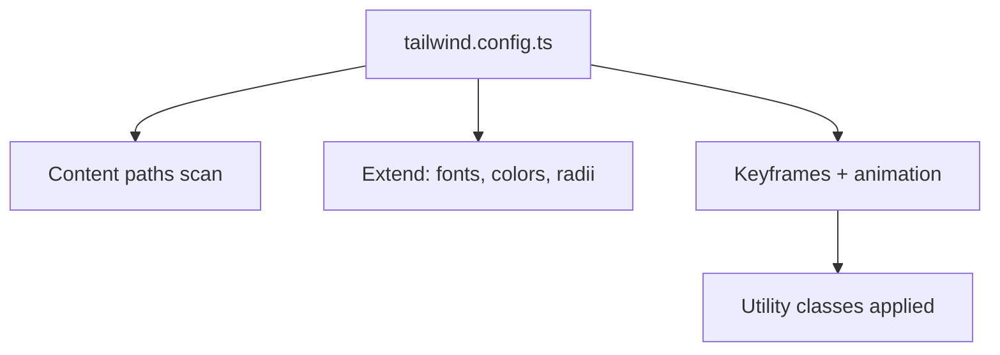

**Diagram sources**
- [tailwind.config.ts:1-104](file://tailwind.config.ts#L1-L104)

**Section sources**
- [tailwind.config.ts:1-104](file://tailwind.config.ts#L1-L104)
- [components.json:1-21](file://components.json#L1-L21)

### Radix UI Primitives for Accessibility Foundations
- Unstyled, accessible base components compose into polished UI elements.
- Provider wrappers centralize behavior (tooltips, toasters, theme switching).

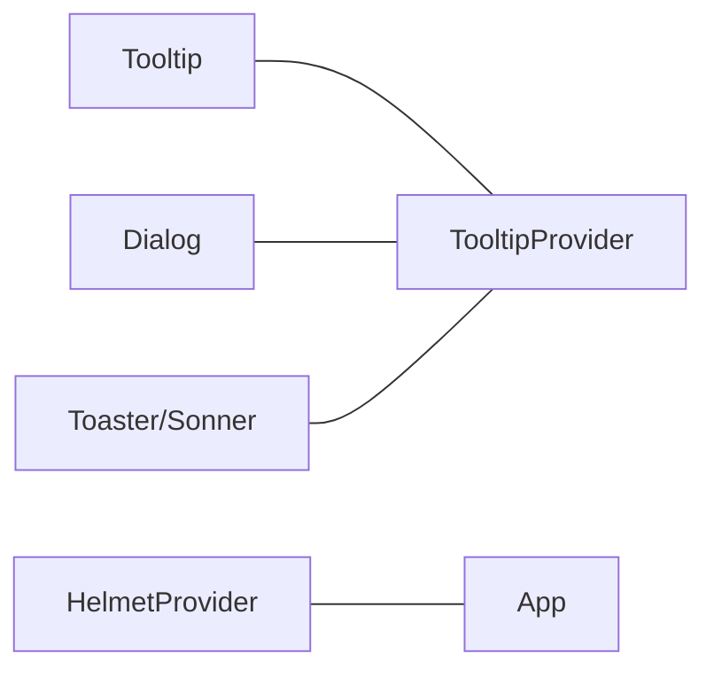

**Diagram sources**
- [src/App.tsx:5-10](file://src/App.tsx#L5-L10)

**Section sources**
- [src/App.tsx:5-10](file://src/App.tsx#L5-L10)

### @tanstack/react-query for Efficient Data Fetching
- Centralized cache and query client enable optimistic updates, background refetch, and consistent invalidation.
- Hooks integrate seamlessly with pages to manage loading states and errors.

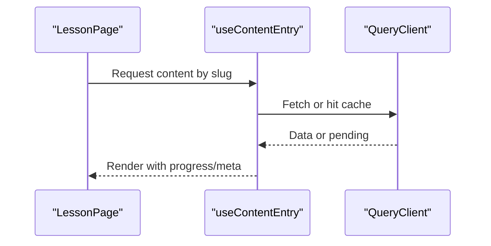

**Diagram sources**
- [src/features/learn/LessonPage.tsx:19-24](file://src/features/learn/LessonPage.tsx#L19-L24)
- [src/App.tsx:25-25](file://src/App.tsx#L25-L25)

**Section sources**
- [src/features/learn/LessonPage.tsx:19-24](file://src/features/learn/LessonPage.tsx#L19-L24)
- [src/App.tsx:25-25](file://src/App.tsx#L25-L25)

### Testing Infrastructure: Vitest and Playwright
- Vitest runs unit tests in a jsdom environment with React and TypeScript support.
- Playwright automates E2E flows against a local dev server with trace retention and parallelization.

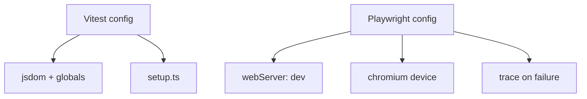

**Diagram sources**
- [vitest.config.ts:1-18](file://vitest.config.ts#L1-L18)
- [playwright.config.ts:1-25](file://playwright.config.ts#L1-L25)

**Section sources**
- [vitest.config.ts:1-18](file://vitest.config.ts#L1-L18)
- [playwright.config.ts:1-25](file://playwright.config.ts#L1-L25)

### ESLint Configuration and Code Quality Standards
- TypeScript + React + Hooks recommended rules enforced.
- React Refresh warnings configured for safe HMR.
- Unused variable rule relaxed to accommodate generated content and UI patterns.

**Section sources**
- [eslint.config.js:1-27](file://eslint.config.js#L1-L27)

## Dependency Analysis
External libraries and their roles:
- React ecosystem: react, react-dom, react-router-dom, react-helmet-async.
- Form handling: react-hook-form, @hookform/resolvers, zod.
- UI primitives: @radix-ui/react-* packages, lucide-react, cmdk, sonner.
- Data fetching: @tanstack/react-query.
- Styling: tailwindcss, postcss, autoprefixer, tailwindcss-animate, @tailwindcss/typography.
- Tooling: vite, @vitejs/plugin-react-swc, typescript, eslint, vitest, playwright.

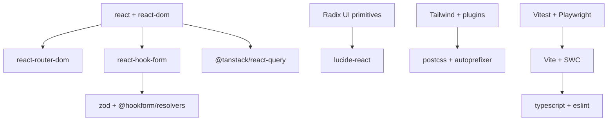

**Diagram sources**
- [package.json:22-74](file://package.json#L22-L74)
- [package.json:75-97](file://package.json#L75-L97)

**Section sources**
- [package.json:22-74](file://package.json#L22-L74)
- [package.json:75-97](file://package.json#L75-L97)

## Performance Considerations
- Prefer lazy loading for feature routes and modals to minimize initial bundle size.
- Use manualChunks to separate vendor, UI, and query code for long-term caching.
- Keep Tailwind content globs scoped to reduce CSS generation overhead.
- Enable strict TS options to catch performance-impacting anti-patterns early.
- Use React Query’s background refetch and stale times to balance freshness and bandwidth.

## Troubleshooting Guide
- HMR overlay disabled in dev server to streamline error visibility.
- Sourcemaps enabled in development builds for easier debugging.
- ESLint rules tuned to reduce noise while preserving safety (e.g., unused vars).
- Vitest uses jsdom; ensure setup files initialize DOM mocks for UI components.
- Playwright reuses existing dev server in CI to speed up E2E runs.

**Section sources**
- [vite.config.ts:8-24](file://vite.config.ts#L8-L24)
- [eslint.config.js:20-24](file://eslint.config.js#L20-L24)
- [vitest.config.ts:8-12](file://vitest.config.ts#L8-L12)
- [playwright.config.ts:21-23](file://playwright.config.ts#L21-L23)

## Conclusion
JSphere’s stack balances developer productivity with strong performance and accessibility. React 18 and React Router DOM enable modern navigation; TypeScript enforces correctness; Vite delivers a smooth DX; Tailwind provides a scalable design system; Radix UI ensures accessible primitives; @tanstack/react-query streamlines data management; and Vitest/Playwright guarantee quality across unit and E2E scopes.

## Appendices

### Type Safety Highlights
- Strongly typed content model for lessons, references, recipes, integrations, projects, error guides, and explore content.
- Discriminated unions and interfaces ensure exhaustive handling of content types.

**Section sources**
- [src/types/content.ts:1-169](file://src/types/content.ts#L1-L169)

### Toast Utilities
- Centralized toast manager with queue limits and timed dismissal for non-intrusive user feedback.

**Section sources**
- [src/hooks/use-toast.ts:1-187](file://src/hooks/use-toast.ts#L1-L187)