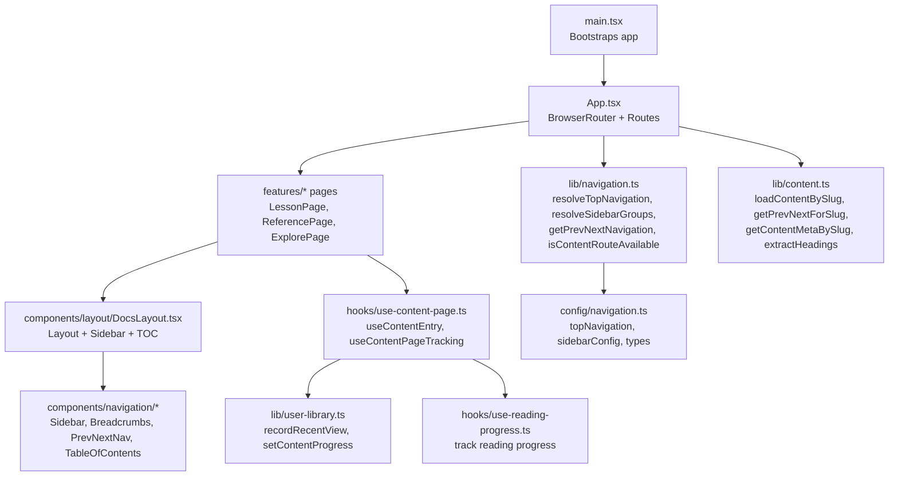
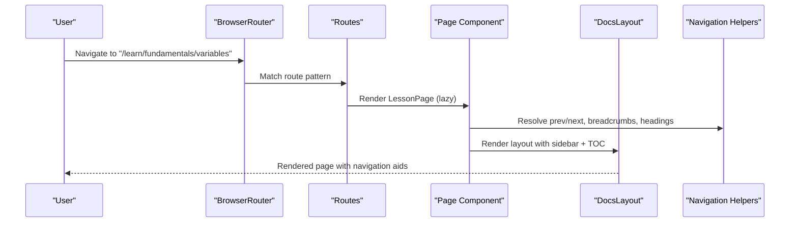
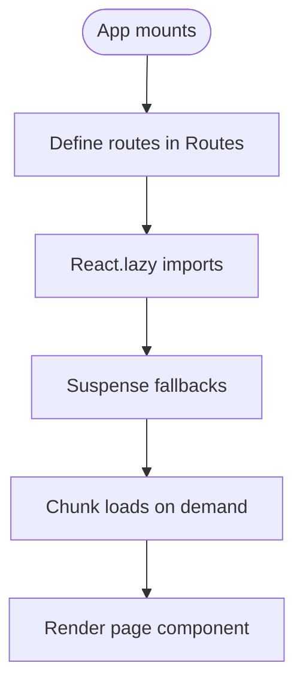
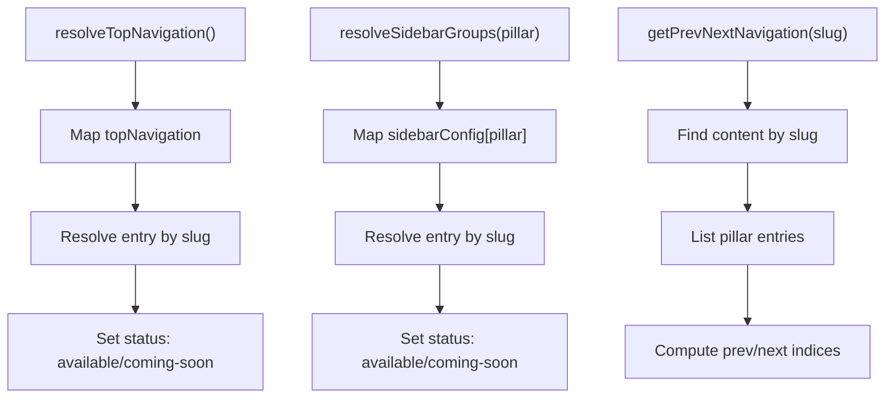
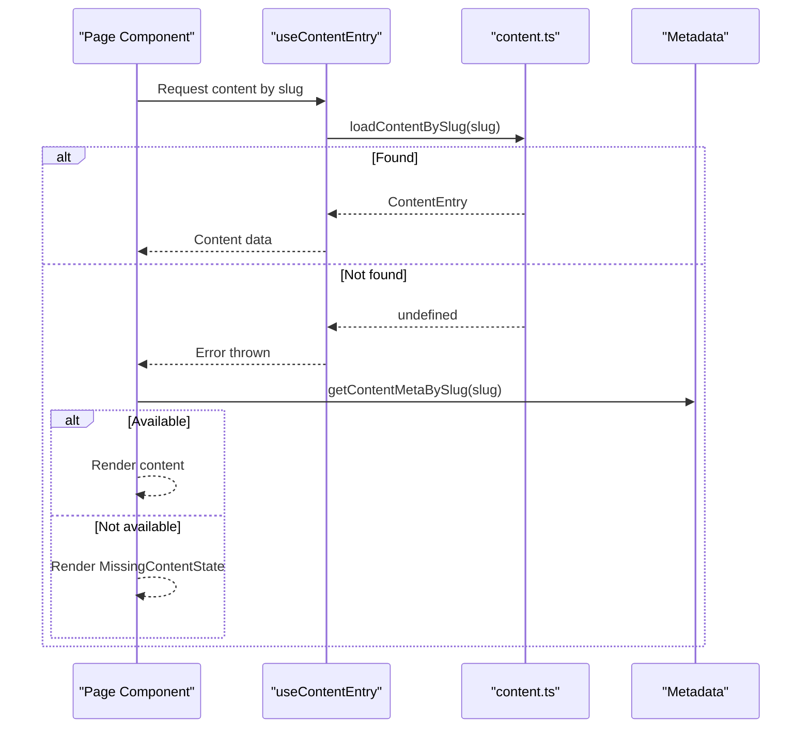
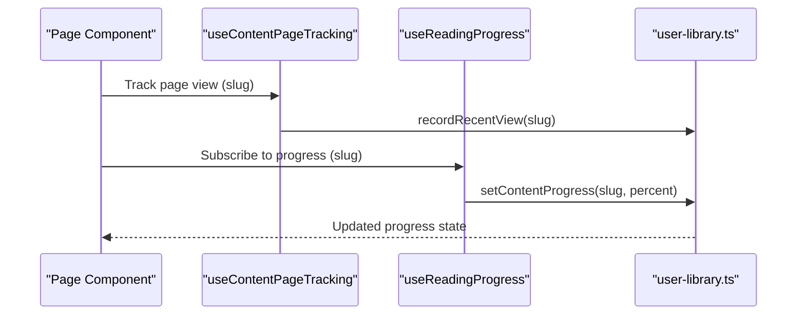
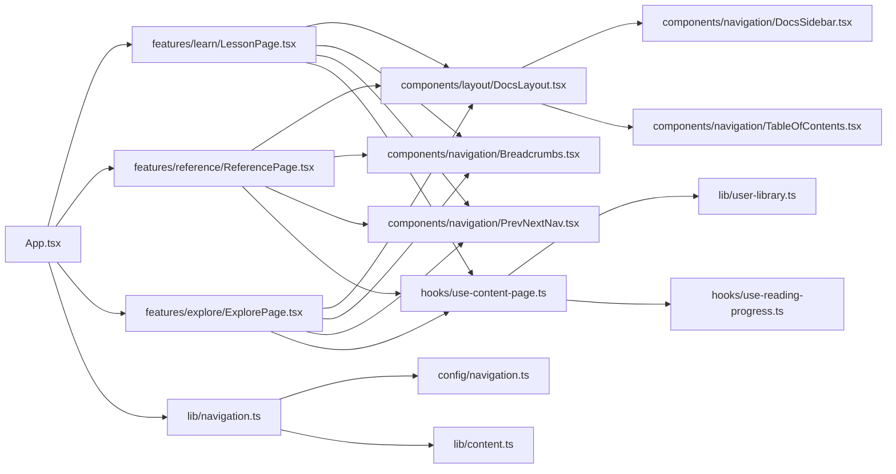

# Routing & Navigation

<cite>
**Referenced Files in This Document**
- [App.tsx](file://src/App.tsx)
- [main.tsx](file://src/main.tsx)
- [DocsLayout.tsx](file://src/components/layout/DocsLayout.tsx)
- [DocsSidebar.tsx](file://src/components/navigation/DocsSidebar.tsx)
- [Breadcrumbs.tsx](file://src/components/navigation/Breadcrumbs.tsx)
- [PrevNextNav.tsx](file://src/components/navigation/PrevNextNav.tsx)
- [TableOfContents.tsx](file://src/components/navigation/TableOfContents.tsx)
- [navigation.ts (config)](file://src/config/navigation.ts)
- [navigation.ts (lib)](file://src/lib/navigation.ts)
- [content.ts](file://src/lib/content.ts)
- [use-content-page.ts](file://src/hooks/use-content-page.ts)
- [use-reading-progress.ts](file://src/hooks/use-reading-progress.ts)
- [user-library.ts](file://src/lib/user-library.ts)
- [LessonPage.tsx](file://src/features/learn/LessonPage.tsx)
- [ReferencePage.tsx](file://src/features/reference/ReferencePage.tsx)
- [ExplorePage.tsx](file://src/features/explore/ExplorePage.tsx)
- [content.ts (types)](file://src/types/content.ts)
</cite>

## Table of Contents
1. [Introduction](#introduction)
2. [Project Structure](#project-structure)
3. [Core Components](#core-components)
4. [Architecture Overview](#architecture-overview)
5. [Detailed Component Analysis](#detailed-component-analysis)
6. [Dependency Analysis](#dependency-analysis)
7. [Performance Considerations](#performance-considerations)
8. [Troubleshooting Guide](#troubleshooting-guide)
9. [Conclusion](#conclusion)

## Introduction
This document explains JSphere’s client-side routing and navigation system built with React Router v6. It covers the URL structure pattern /{pillar}/{category}/{slug} for Learn lessons, the per-pillar routes for Reference, Recipes, Integrations, Projects, Explore, and Errors, and how lazy loading and route-based code splitting optimize performance. It also documents the navigation ecosystem: sidebar, breadcrumbs, previous/next navigation, and table of contents generation. Finally, it details navigation helpers, the relationship between features/ and pages/, accessibility and keyboard support, integration with user library features (continue reading and recently viewed), and robustness against broken links and content reorganization.

## Project Structure
JSphere organizes routing and navigation across three primary areas:
- App-level routing and lazy loading in App.tsx
- Navigation configuration and helpers in config/navigation.ts and lib/navigation.ts
- Page components and layouts in features/ and components/layout/DocsLayout.tsx



**Diagram sources**
- [main.tsx:1-6](file://src/main.tsx#L1-L6)
- [App.tsx:40-100](file://src/App.tsx#L40-L100)
- [DocsLayout.tsx:12-25](file://src/components/layout/DocsLayout.tsx#L12-L25)
- [DocsSidebar.tsx:13-67](file://src/components/navigation/DocsSidebar.tsx#L13-L67)
- [Breadcrumbs.tsx:13-33](file://src/components/navigation/Breadcrumbs.tsx#L13-L33)
- [PrevNextNav.tsx:9-44](file://src/components/navigation/PrevNextNav.tsx#L9-L44)
- [TableOfContents.tsx:9-67](file://src/components/navigation/TableOfContents.tsx#L9-L67)
- [navigation.ts (lib):28-73](file://src/lib/navigation.ts#L28-L73)
- [navigation.ts (config):62-262](file://src/config/navigation.ts#L62-L262)
- [content.ts:38-101](file://src/lib/content.ts#L38-L101)
- [use-content-page.ts:7-34](file://src/hooks/use-content-page.ts#L7-L34)
- [use-reading-progress.ts:12-51](file://src/hooks/use-reading-progress.ts#L12-L51)
- [user-library.ts:150-158](file://src/lib/user-library.ts#L150-L158)

**Section sources**
- [main.tsx:1-6](file://src/main.tsx#L1-L6)
- [App.tsx:40-100](file://src/App.tsx#L40-L100)
- [DocsLayout.tsx:12-25](file://src/components/layout/DocsLayout.tsx#L12-L25)

## Core Components
- App routing and lazy loading: Defines routes for each pillar and uses React.lazy for code-split bundles. Suspense provides fallbacks during loading.
- Navigation configuration: Static top navigation and sidebar configurations per pillar, resolved at runtime to reflect content availability.
- Content loading: Per-page hooks fetch content by slug, with caching and retry logic.
- Navigation UI: Sidebar, breadcrumbs, previous/next nav, and table of contents are integrated via DocsLayout.

**Section sources**
- [App.tsx:11-23](file://src/App.tsx#L11-L23)
- [App.tsx:72-89](file://src/App.tsx#L72-L89)
- [navigation.ts (config):62-262](file://src/config/navigation.ts#L62-L262)
- [navigation.ts (lib):28-73](file://src/lib/navigation.ts#L28-L73)
- [content.ts:38-42](file://src/lib/content.ts#L38-L42)
- [DocsLayout.tsx:12-25](file://src/components/layout/DocsLayout.tsx#L12-L25)

## Architecture Overview
JSphere uses React Router v6 with route-based code splitting. The App component mounts BrowserRouter and defines routes for each content pillar. Pages under features/ are lazy-loaded and render content inside DocsLayout, which composes sidebar, table of contents, and page content.



**Diagram sources**
- [App.tsx:72-89](file://src/App.tsx#L72-L89)
- [LessonPage.tsx:19-122](file://src/features/learn/LessonPage.tsx#L19-L122)
- [DocsLayout.tsx:12-25](file://src/components/layout/DocsLayout.tsx#L12-L25)
- [navigation.ts (lib):59-65](file://src/lib/navigation.ts#L59-L65)

## Detailed Component Analysis

### URL Structure and Route Patterns
- Learn: /learn/{category}/{slug}
- Reference: /reference/{category}/{slug}
- Recipes: /recipes/{slug}
- Integrations: /integrations/{slug}
- Projects: /projects/{slug}
- Explore: /explore/{slug}
- Errors: /errors/{slug}
- Fallback: /* resolves to NotFound

These patterns enable predictable, hierarchical URLs aligned with the seven content pillars.

**Section sources**
- [App.tsx:74-88](file://src/App.tsx#L74-L88)

### Route-Based Code Splitting and Lazy Loading
- App.tsx imports page components via React.lazy and renders them under Suspense.
- Search modal and several UI components are also lazy-loaded to reduce initial bundle size.
- RouteFallback provides a skeleton while route chunks are loading.



**Diagram sources**
- [App.tsx:11-23](file://src/App.tsx#L11-L23)
- [App.tsx:27-38](file://src/App.tsx#L27-L38)
- [App.tsx:71-91](file://src/App.tsx#L71-L91)

**Section sources**
- [App.tsx:11-23](file://src/App.tsx#L11-L23)
- [App.tsx:27-38](file://src/App.tsx#L27-L38)

### Navigation Helpers and Utilities
- resolveTopNavigation: Augments topNavigation with availability and content metadata.
- resolveSidebarGroups: Builds sidebar groups per pillar with availability and entry metadata.
- getPrevNextNavigation: Computes previous/next slugs within the same pillar.
- isContentRouteAvailable: Determines if a given href corresponds to existing content.



**Diagram sources**
- [navigation.ts (lib):28-65](file://src/lib/navigation.ts#L28-L65)
- [navigation.ts (config):62-262](file://src/config/navigation.ts#L62-L262)

**Section sources**
- [navigation.ts (lib):28-73](file://src/lib/navigation.ts#L28-L73)
- [navigation.ts (config):62-262](file://src/config/navigation.ts#L62-L262)

### Content Loading and Availability
- useContentEntry(slug) fetches content by slug using loadContentBySlug, with caching and retries.
- getContentMetaBySlug determines whether a route exists; pages render MissingContentState when unavailable.
- getPrevNextForSlug computes adjacent entries for Previous/Next navigation.



**Diagram sources**
- [use-content-page.ts:7-23](file://src/hooks/use-content-page.ts#L7-L23)
- [content.ts:38-42](file://src/lib/content.ts#L38-L42)
- [content.ts:30-32](file://src/lib/content.ts#L30-L32)

**Section sources**
- [use-content-page.ts:7-34](file://src/hooks/use-content-page.ts#L7-L34)
- [content.ts:30-42](file://src/lib/content.ts#L30-L42)

### Layout and Navigation UI
- DocsLayout composes DocsSidebar and TableOfContents alongside page content.
- DocsSidebar builds collapsible groups from resolved sidebar config and highlights active items.
- Breadcrumbs renders hierarchical navigation with an accessible aria-label.
- PrevNextNav provides “Previous” and “Next” links derived from getPrevNextNavigation.
- TableOfContents tracks visible headings via IntersectionObserver and supports keyboard activation.

```mermaid
classDiagram
class DocsLayout {
+pillar : string
+headings : HeadingInfo[]
+children : ReactNode
}
class DocsSidebar {
+pillar : string
}
class TableOfContents {
+headings : HeadingInfo[]
}
class Breadcrumbs {
+items : BreadcrumbItem[]
}
class PrevNextNav {
+prev? : {label, href}
+next? : {label, href}
}
DocsLayout --> DocsSidebar : "renders"
DocsLayout --> TableOfContents : "renders"
DocsSidebar --> "uses" navigation.ts (lib)
PrevNextNav --> "uses" navigation.ts (lib)
TableOfContents --> "observes" headings
```

**Diagram sources**
- [DocsLayout.tsx:12-25](file://src/components/layout/DocsLayout.tsx#L12-L25)
- [DocsSidebar.tsx:13-67](file://src/components/navigation/DocsSidebar.tsx#L13-L67)
- [TableOfContents.tsx:9-67](file://src/components/navigation/TableOfContents.tsx#L9-L67)
- [Breadcrumbs.tsx:13-33](file://src/components/navigation/Breadcrumbs.tsx#L13-L33)
- [PrevNextNav.tsx:9-44](file://src/components/navigation/PrevNextNav.tsx#L9-L44)
- [navigation.ts (lib):59-65](file://src/lib/navigation.ts#L59-L65)

**Section sources**
- [DocsLayout.tsx:12-25](file://src/components/layout/DocsLayout.tsx#L12-L25)
- [DocsSidebar.tsx:13-67](file://src/components/navigation/DocsSidebar.tsx#L13-L67)
- [Breadcrumbs.tsx:13-33](file://src/components/navigation/Breadcrumbs.tsx#L13-L33)
- [PrevNextNav.tsx:9-44](file://src/components/navigation/PrevNextNav.tsx#L9-L44)
- [TableOfContents.tsx:9-67](file://src/components/navigation/TableOfContents.tsx#L9-L67)

### Accessibility and Keyboard Navigation
- Breadcrumbs include an aria-label for screen readers.
- TableOfContents supports keyboard activation of entries using Enter or Space to scroll into view.
- Sidebar and navigation items use semantic links and hover/focus states appropriate for keyboard users.

**Section sources**
- [Breadcrumbs.tsx:15](file://src/components/navigation/Breadcrumbs.tsx#L15)
- [TableOfContents.tsx:45-50](file://src/components/navigation/TableOfContents.tsx#L45-L50)

### Integration with User Library Features
- useContentPageTracking records recent views via recordRecentView and integrates reading progress via setContentProgress.
- useReadingProgress calculates and persists reading progress as the user scrolls.
- These utilities feed into user-library state persisted in localStorage.



**Diagram sources**
- [use-content-page.ts:25-34](file://src/hooks/use-content-page.ts#L25-L34)
- [use-reading-progress.ts:12-51](file://src/hooks/use-reading-progress.ts#L12-L51)
- [user-library.ts:150-158](file://src/lib/user-library.ts#L150-L158)
- [user-library.ts:172-204](file://src/lib/user-library.ts#L172-L204)

**Section sources**
- [use-content-page.ts:25-34](file://src/hooks/use-content-page.ts#L25-L34)
- [use-reading-progress.ts:12-51](file://src/hooks/use-reading-progress.ts#L12-L51)
- [user-library.ts:150-158](file://src/lib/user-library.ts#L150-L158)
- [user-library.ts:172-204](file://src/lib/user-library.ts#L172-L204)

### Edge Cases and Robustness
- Missing content: Pages render MissingContentState when getContentMetaBySlug returns undefined for a slug.
- Broken links: isContentRouteAvailable can be used to gate navigation items; resolveStatus marks unavailable routes as coming-soon.
- Content reorganization: getPrevNextForSlug relies on sorted content by pillar and order; reordering updates adjacency automatically.

**Section sources**
- [LessonPage.tsx:26-37](file://src/features/learn/LessonPage.tsx#L26-L37)
- [navigation.ts (lib):71-73](file://src/lib/navigation.ts#L71-L73)
- [content.ts:91-101](file://src/lib/content.ts#L91-L101)

## Dependency Analysis
- App.tsx depends on features/ pages and lazy-loads them; it also lazily imports UI components.
- Page components depend on DocsLayout and navigation helpers; they rely on content.ts for metadata and loaders.
- navigation.ts (lib) depends on navigation.ts (config) and content.ts to resolve availability and compute prev/next.
- user-library.ts provides persistence and subscriptions consumed by reading progress and recent view tracking.



**Diagram sources**
- [App.tsx:72-89](file://src/App.tsx#L72-L89)
- [LessonPage.tsx:19-122](file://src/features/learn/LessonPage.tsx#L19-L122)
- [ReferencePage.tsx:20-136](file://src/features/reference/ReferencePage.tsx#L20-L136)
- [ExplorePage.tsx:17-81](file://src/features/explore/ExplorePage.tsx#L17-L81)
- [DocsLayout.tsx:12-25](file://src/components/layout/DocsLayout.tsx#L12-L25)
- [DocsSidebar.tsx:13-67](file://src/components/navigation/DocsSidebar.tsx#L13-L67)
- [TableOfContents.tsx:9-67](file://src/components/navigation/TableOfContents.tsx#L9-L67)
- [Breadcrumbs.tsx:13-33](file://src/components/navigation/Breadcrumbs.tsx#L13-L33)
- [PrevNextNav.tsx:9-44](file://src/components/navigation/PrevNextNav.tsx#L9-L44)
- [navigation.ts (lib):28-73](file://src/lib/navigation.ts#L28-L73)
- [navigation.ts (config):62-262](file://src/config/navigation.ts#L62-L262)
- [content.ts:30-42](file://src/lib/content.ts#L30-L42)
- [use-content-page.ts:7-34](file://src/hooks/use-content-page.ts#L7-L34)
- [use-reading-progress.ts:12-51](file://src/hooks/use-reading-progress.ts#L12-L51)
- [user-library.ts:150-158](file://src/lib/user-library.ts#L150-L158)

**Section sources**
- [App.tsx:72-89](file://src/App.tsx#L72-L89)
- [navigation.ts (lib):28-73](file://src/lib/navigation.ts#L28-L73)
- [content.ts:30-42](file://src/lib/content.ts#L30-L42)

## Performance Considerations
- Route-based code splitting reduces initial bundle size by loading only the necessary page chunk.
- Suspense fallbacks improve perceived performance during navigation.
- useContentEntry caches content for a short period and retries transient failures.
- TableOfContents uses IntersectionObserver with tuned thresholds to avoid heavy computations.

[No sources needed since this section provides general guidance]

## Troubleshooting Guide
- Content not found: Verify slug exists in metadata; pages render MissingContentState when getContentMetaBySlug returns undefined.
- Incorrect prev/next: Ensure content order is consistent within the pillar; getPrevNextForSlug derives adjacency from sorted metadata.
- Navigation items show “Coming soon”: resolveStatus marks items without matching metadata as unavailable; add content or remove the link.
- Progress not saved: Confirm useReadingProgress is enabled and user-library persistence is available; check browser storage.

**Section sources**
- [LessonPage.tsx:26-37](file://src/features/learn/LessonPage.tsx#L26-L37)
- [content.ts:91-101](file://src/lib/content.ts#L91-L101)
- [navigation.ts (lib):24-26](file://src/lib/navigation.ts#L24-L26)
- [use-reading-progress.ts:12-51](file://src/hooks/use-reading-progress.ts#L12-L51)
- [user-library.ts:150-158](file://src/lib/user-library.ts#L150-L158)

## Conclusion
JSphere’s routing and navigation system leverages React Router v6 with route-based code splitting to deliver fast, structured access to seven content pillars. The URL pattern /{pillar}/{category}/{slug} aligns with content organization, while navigation helpers and UI components provide a cohesive, accessible experience. Integration with user library features enhances continuity, and robust content loading and availability checks ensure resilience against missing or reorganized content.