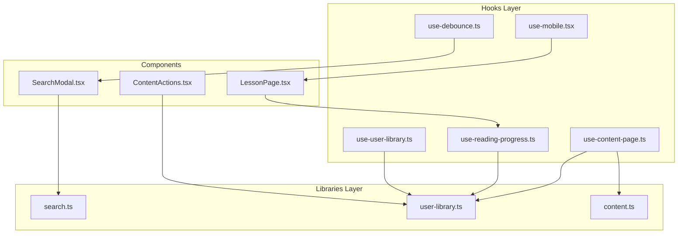
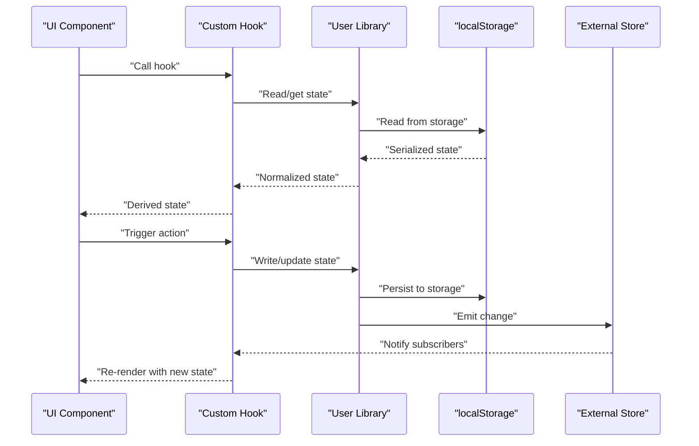
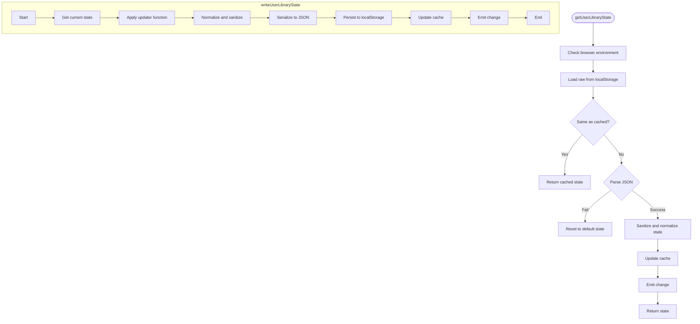
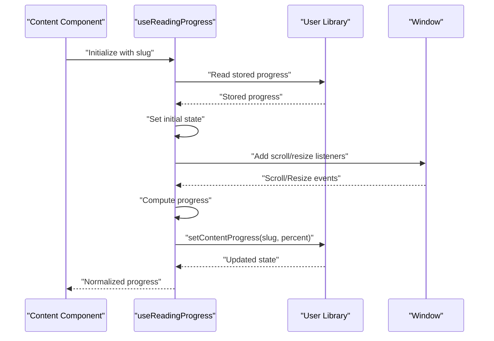
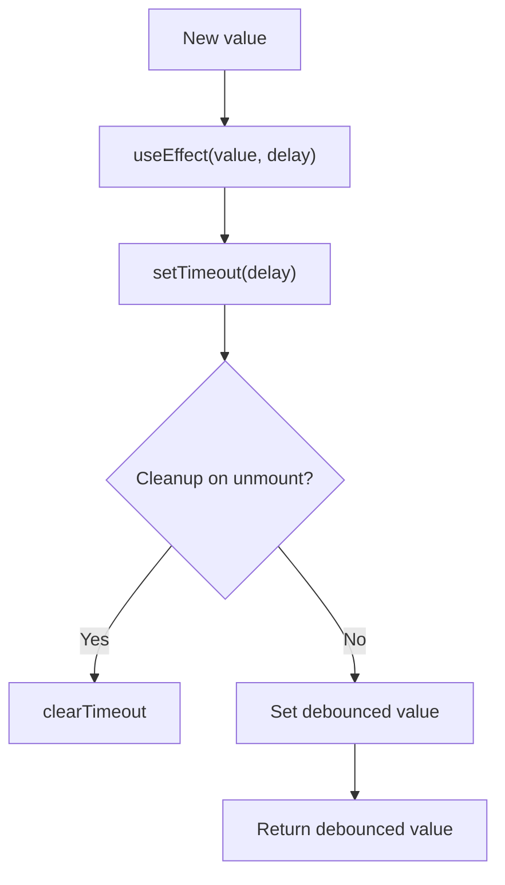
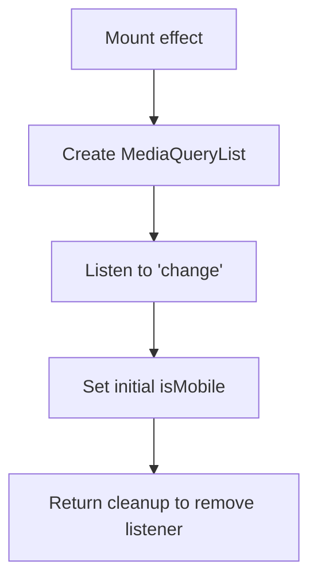
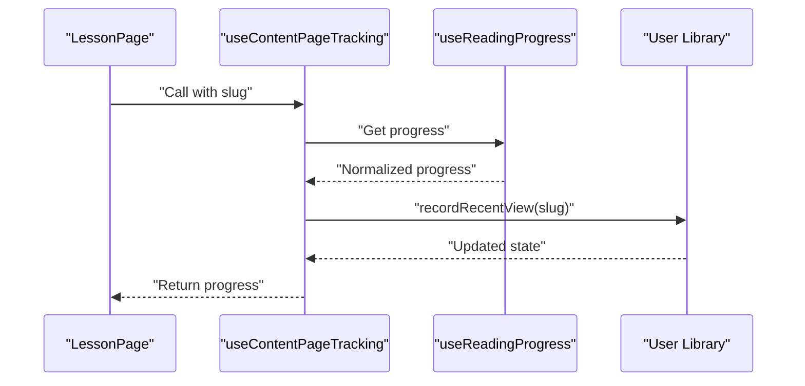
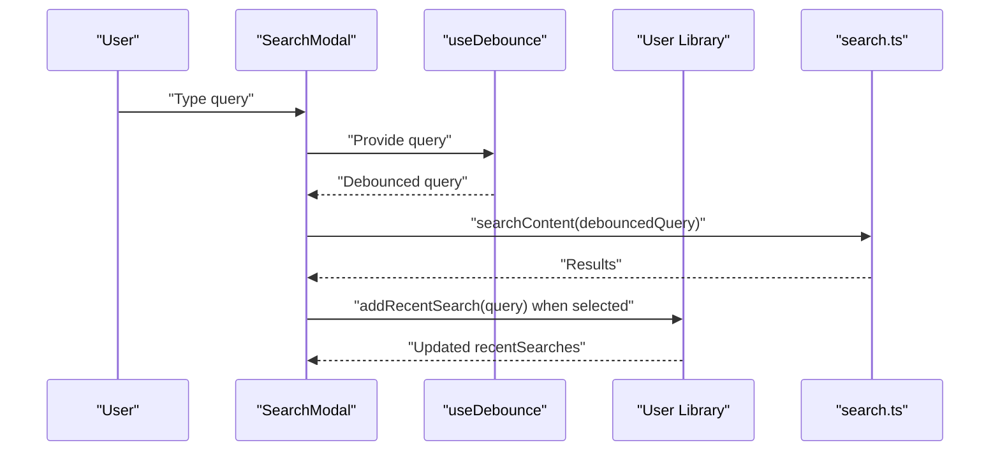
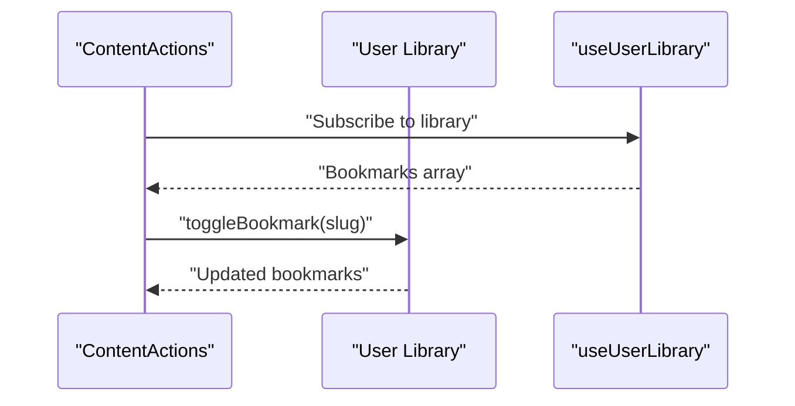
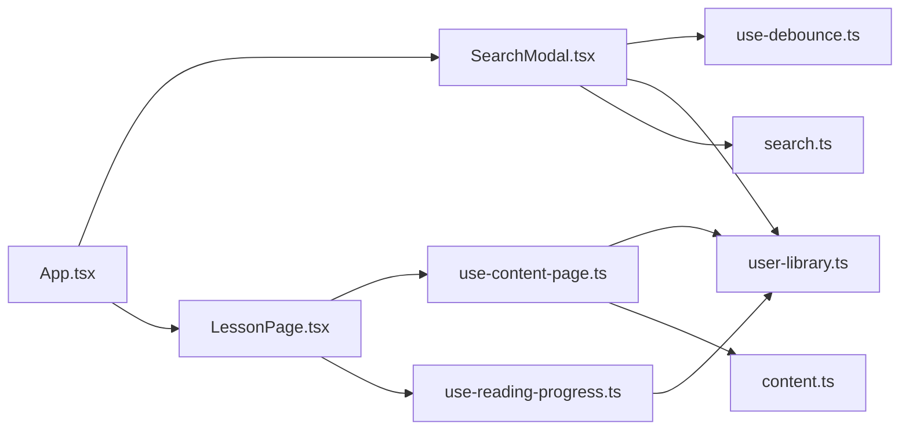

# State Management

<cite>
**Referenced Files in This Document**
- [use-user-library.ts](file://src/hooks/use-user-library.ts)
- [use-reading-progress.ts](file://src/hooks/use-reading-progress.ts)
- [use-debounce.ts](file://src/hooks/use-debounce.ts)
- [use-mobile.tsx](file://src/hooks/use-mobile.tsx)
- [user-library.ts](file://src/lib/user-library.ts)
- [content.ts](file://src/lib/content.ts)
- [search.ts](file://src/lib/search.ts)
- [ContentActions.tsx](file://src/components/content/ContentActions.tsx)
- [SearchModal.tsx](file://src/components/search/SearchModal.tsx)
- [LessonPage.tsx](file://src/features/learn/LessonPage.tsx)
- [use-content-page.ts](file://src/hooks/use-content-page.ts)
- [App.tsx](file://src/App.tsx)
- [content.ts](file://src/types/content.ts)
</cite>

## Table of Contents
1. [Introduction](#introduction)
2. [Project Structure](#project-structure)
3. [Core Components](#core-components)
4. [Architecture Overview](#architecture-overview)
5. [Detailed Component Analysis](#detailed-component-analysis)
6. [Dependency Analysis](#dependency-analysis)
7. [Performance Considerations](#performance-considerations)
8. [Troubleshooting Guide](#troubleshooting-guide)
9. [Conclusion](#conclusion)
10. [Appendices](#appendices)

## Introduction
This document explains the state management architecture of JSphere with a focus on custom hooks and utilities that manage user interactions, preferences, and application state. It covers the user library system (bookmarks, reading progress, and search history), the reading progress hook enabling continue reading functionality, debounced search for performance optimization, and mobile-responsive hooks. It also documents integration with localStorage for persistent state, synchronization across component boundaries, state normalization and caching strategies, and hook composition patterns that deliver a seamless user experience.

## Project Structure
JSphere organizes state management primarily in two layers:
- Hooks: React custom hooks that expose derived state and orchestrate side effects for user interactions and preferences.
- Libraries: Pure utilities that encapsulate state normalization, persistence, and cross-tab synchronization.

**Diagram sources**
- [use-user-library.ts:1-7](file://src/hooks/use-user-library.ts#L1-L7)
- [use-reading-progress.ts:1-52](file://src/hooks/use-reading-progress.ts#L1-L52)
- [use-debounce.ts:1-35](file://src/hooks/use-debounce.ts#L1-L35)
- [use-mobile.tsx:1-20](file://src/hooks/use-mobile.tsx#L1-L20)
- [use-content-page.ts:1-35](file://src/hooks/use-content-page.ts#L1-L35)
- [user-library.ts:1-213](file://src/lib/user-library.ts#L1-L213)
- [content.ts:1-169](file://src/lib/content.ts#L1-L169)
- [search.ts:1-127](file://src/lib/search.ts#L1-L127)
- [SearchModal.tsx:1-154](file://src/components/search/SearchModal.tsx#L1-L154)
- [ContentActions.tsx:1-41](file://src/components/content/ContentActions.tsx#L1-L41)
- [LessonPage.tsx:1-123](file://src/features/learn/LessonPage.tsx#L1-L123)

**Section sources**
- [use-user-library.ts:1-7](file://src/hooks/use-user-library.ts#L1-L7)
- [user-library.ts:1-213](file://src/lib/user-library.ts#L1-L213)

## Core Components
- User Library Hook: Provides a React external store subscription to the user library state, enabling components to subscribe to changes and re-render efficiently.
- Reading Progress Hook: Tracks reading progress per slug, persists it to localStorage, and exposes normalized progress data.
- Debounce Hook: Delays updates to reduce expensive operations during search input.
- Mobile Hook: Detects viewport width and adapts UI behavior accordingly.
- Content Page Tracking: Integrates reading progress and recent view recording with content loading.

**Section sources**
- [use-user-library.ts:1-7](file://src/hooks/use-user-library.ts#L1-L7)
- [use-reading-progress.ts:1-52](file://src/hooks/use-reading-progress.ts#L1-L52)
- [use-debounce.ts:1-35](file://src/hooks/use-debounce.ts#L1-L35)
- [use-mobile.tsx:1-20](file://src/hooks/use-mobile.tsx#L1-L20)
- [use-content-page.ts:1-35](file://src/hooks/use-content-page.ts#L1-L35)

## Architecture Overview
The state management architecture follows a unidirectional data flow:
- Components trigger actions via hooks and libraries.
- Libraries normalize and persist state to localStorage and broadcast changes.
- Hooks subscribe to the external store and derive state for rendering.

**Diagram sources**
- [user-library.ts:103-136](file://src/lib/user-library.ts#L103-L136)
- [use-user-library.ts:4-6](file://src/hooks/use-user-library.ts#L4-L6)

## Detailed Component Analysis

### User Library System
The user library encapsulates bookmarks, recent views, recent searches, and reading progress. It normalizes and validates data, caches it in memory, and synchronizes across tabs via storage events and a custom change event.

Key responsibilities:
- Normalization: Ensures consistent shapes for progress, recent views, and search terms.
- Persistence: Reads/writes to localStorage with caching and sanitization.
- Synchronization: Emits change events and listens to storage and custom events.
- APIs: Exposes functions to toggle bookmarks, record recent views, add recent searches, and update content progress.

**Diagram sources**
- [user-library.ts:103-136](file://src/lib/user-library.ts#L103-L136)
- [user-library.ts:115-123](file://src/lib/user-library.ts#L115-L123)

**Section sources**
- [user-library.ts:1-213](file://src/lib/user-library.ts#L1-L213)
- [content.ts:152-169](file://src/types/content.ts#L152-L169)

### Reading Progress Hook
The reading progress hook calculates and persists reading progress for a given slug. It:
- Initializes progress from stored state.
- Updates progress on scroll and resize using requestAnimationFrame.
- Writes progress to the user library and ensures monotonic increases.
- Returns a normalized progress object with completion status and timestamps.

**Diagram sources**
- [use-reading-progress.ts:12-51](file://src/hooks/use-reading-progress.ts#L12-L51)
- [user-library.ts:172-204](file://src/lib/user-library.ts#L172-L204)

**Section sources**
- [use-reading-progress.ts:1-52](file://src/hooks/use-reading-progress.ts#L1-L52)
- [user-library.ts:172-204](file://src/lib/user-library.ts#L172-L204)

### Debounced Search Hook
The debounced hook delays updates to a value until after a specified delay. It is used in the search modal to reduce the cost of frequent search queries.

**Diagram sources**
- [use-debounce.ts:20-34](file://src/hooks/use-debounce.ts#L20-L34)

**Section sources**
- [use-debounce.ts:1-35](file://src/hooks/use-debounce.ts#L1-L35)
- [SearchModal.tsx:42-50](file://src/components/search/SearchModal.tsx#L42-L50)

### Mobile-Responsive Hook
The mobile hook detects whether the viewport width is below a breakpoint and adapts UI behavior accordingly. It initializes state on mount and listens to media query changes.

**Diagram sources**
- [use-mobile.tsx:5-19](file://src/hooks/use-mobile.tsx#L5-L19)

**Section sources**
- [use-mobile.tsx:1-20](file://src/hooks/use-mobile.tsx#L1-L20)

### Content Page Tracking
The content page tracking hook integrates reading progress with recent view recording. It uses the reading progress hook and records the current slug as a recent view when enabled.

**Diagram sources**
- [use-content-page.ts:25-34](file://src/hooks/use-content-page.ts#L25-L34)
- [user-library.ts:150-158](file://src/lib/user-library.ts#L150-L158)

**Section sources**
- [use-content-page.ts:1-35](file://src/hooks/use-content-page.ts#L1-L35)

### Search Modal Integration
The search modal demonstrates hook composition:
- Uses the debounced hook to limit search computation.
- Reads recent searches from the user library.
- Persists new searches upon selection.
- Groups and renders results with type-specific icons and badges.

**Diagram sources**
- [SearchModal.tsx:41-60](file://src/components/search/SearchModal.tsx#L41-L60)
- [use-debounce.ts:20-34](file://src/hooks/use-debounce.ts#L20-L34)
- [search.ts:111-113](file://src/lib/search.ts#L111-L113)
- [user-library.ts:160-170](file://src/lib/user-library.ts#L160-L170)

**Section sources**
- [SearchModal.tsx:1-154](file://src/components/search/SearchModal.tsx#L1-L154)
- [search.ts:1-127](file://src/lib/search.ts#L1-L127)

### Content Actions Integration
The content actions component demonstrates bookmark toggling and reading progress display. It reads the current bookmark status from the user library and toggles bookmarks via library functions.

**Diagram sources**
- [ContentActions.tsx:13-36](file://src/components/content/ContentActions.tsx#L13-L36)
- [user-library.ts:138-148](file://src/lib/user-library.ts#L138-L148)

**Section sources**
- [ContentActions.tsx:1-41](file://src/components/content/ContentActions.tsx#L1-L41)
- [user-library.ts:138-148](file://src/lib/user-library.ts#L138-L148)

## Dependency Analysis
- Hooks depend on libraries for state normalization and persistence.
- Libraries depend on localStorage and browser APIs for synchronization.
- Components depend on hooks for derived state and side-effect orchestration.
- The app integrates React Query for content fetching and caching.

**Diagram sources**
- [App.tsx:40-103](file://src/App.tsx#L40-L103)
- [SearchModal.tsx:1-154](file://src/components/search/SearchModal.tsx#L1-L154)
- [LessonPage.tsx:1-123](file://src/features/learn/LessonPage.tsx#L1-L123)
- [use-content-page.ts:1-35](file://src/hooks/use-content-page.ts#L1-L35)
- [use-reading-progress.ts:1-52](file://src/hooks/use-reading-progress.ts#L1-L52)
- [user-library.ts:1-213](file://src/lib/user-library.ts#L1-L213)
- [search.ts:1-127](file://src/lib/search.ts#L1-L127)
- [content.ts:1-169](file://src/lib/content.ts#L1-L169)

**Section sources**
- [App.tsx:1-103](file://src/App.tsx#L1-L103)
- [use-content-page.ts:1-35](file://src/hooks/use-content-page.ts#L1-L35)

## Performance Considerations
- Debounced search: Limits API-like computations by deferring updates, reducing CPU usage during rapid typing.
- Reading progress throttling: Uses requestAnimationFrame to batch updates and minimize layout thrashing.
- LocalStorage caching: Avoids repeated parsing by caching the last known raw and parsed state.
- Monotonic progress updates: Prevents regressions and reduces unnecessary writes.
- React Query: Provides efficient caching and invalidation for content loading.
- Memoization: Components memoize derived data to avoid redundant re-renders.

[No sources needed since this section provides general guidance]

## Troubleshooting Guide
Common issues and resolutions:
- State not updating across tabs: Ensure the change event and storage event listeners are registered and that the external store subscription is active.
- Progress resets unexpectedly: Verify that progress updates are monotonic and that the hook is enabled only when needed.
- Debounced search not triggering: Confirm the delay is sufficient and that the debounced value is used for actual search computation.
- Mobile detection not reactive: Ensure the media query listener is attached and cleaned up properly.

**Section sources**
- [user-library.ts:125-136](file://src/lib/user-library.ts#L125-L136)
- [use-reading-progress.ts:21-44](file://src/hooks/use-reading-progress.ts#L21-L44)
- [use-debounce.ts:20-34](file://src/hooks/use-debounce.ts#L20-L34)
- [use-mobile.tsx:8-16](file://src/hooks/use-mobile.tsx#L8-L16)

## Conclusion
JSphere’s state management combines React custom hooks with robust library utilities to provide a responsive, performant, and persistent user experience. The user library centralizes normalization, persistence, and synchronization, while hooks encapsulate side effects and compose seamlessly with components. Debounced search, reading progress tracking, and mobile responsiveness are integrated to optimize performance and usability.

[No sources needed since this section summarizes without analyzing specific files]

## Appendices

### Hook Composition Patterns
- Reading progress composition: The reading progress hook depends on the user library hook for state and uses requestAnimationFrame for smooth updates.
- Content page tracking composition: The content page tracking hook composes reading progress and recent view recording.
- Search composition: The search modal composes debounced input with search results and recent searches.

**Section sources**
- [use-reading-progress.ts:12-51](file://src/hooks/use-reading-progress.ts#L12-L51)
- [use-content-page.ts:25-34](file://src/hooks/use-content-page.ts#L25-L34)
- [SearchModal.tsx:41-60](file://src/components/search/SearchModal.tsx#L41-L60)

### Example Usage and Integration Patterns
- Continue reading: Use the reading progress hook in content pages to track and display progress, persisting it across sessions.
- Search performance: Wrap user input with the debounced hook and compute results based on the debounced value.
- Mobile adaptation: Use the mobile hook to adjust layouts and interactions for smaller screens.
- Bookmarking: Integrate bookmark toggling in content actions and render bookmark status from the user library.

**Section sources**
- [use-reading-progress.ts:12-51](file://src/hooks/use-reading-progress.ts#L12-L51)
- [use-debounce.ts:20-34](file://src/hooks/use-debounce.ts#L20-L34)
- [use-mobile.tsx:5-19](file://src/hooks/use-mobile.tsx#L5-L19)
- [ContentActions.tsx:13-36](file://src/components/content/ContentActions.tsx#L13-L36)